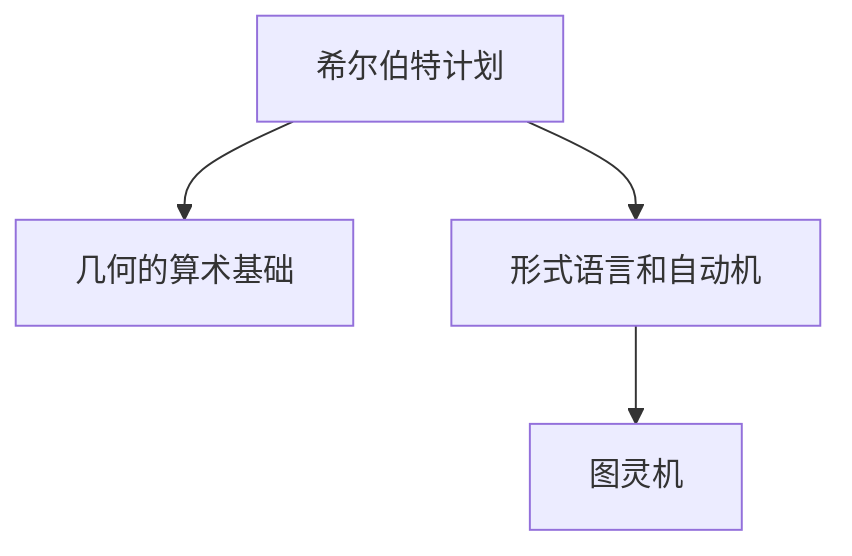

                 

# 计算：第三部分 计算理论的形成 第 6 章 计算理论的奠基：希尔伯特进路 几何的算术基础

## 1. 背景介绍

### 1.1 问题由来
19世纪末20世纪初，数学界经历了一场根本性的变革，希尔伯特提出了“希尔伯特计划”，目标是寻找一个公理化的数学体系，所有数学知识都可以在此基础上通过逻辑推理得到。这一计划对后世数学的发展产生了深远影响，也奠定了计算理论研究的基础。

在数学研究中，希尔伯特提出了一系列的公理，如几何学中的欧几里得公理，并在此基础上推导出各种定理。这种由公理出发，通过逻辑推理得出定理的方式，启发了计算机科学中的算法思想，即通过有限的步骤执行计算来解决问题。

希尔伯特计划的核心在于将数学问题转化为算术问题，将无限的数学世界归结为有限的算术操作。这一思想在计算理论的形成中起到了关键作用，推动了现代计算机科学的发展。

### 1.2 问题核心关键点
希尔伯特进路的核心在于通过公理化和逻辑推理，将数学问题转化为算术问题，从而在有限的步骤内进行计算和求解。这包括了两个主要方向：

1. 将几何问题转化为算术问题。例如，通过引入坐标系，将几何问题转化为方程求解问题。
2. 将公理化数学理论转化为可计算问题。例如，通过形式语言和自动机理论，将数学逻辑运算转化为可计算的机器指令。

这两个方向的结合，构成了希尔伯特进路的核心，为计算理论的形成奠定了基础。

### 1.3 问题研究意义
希尔伯特进路的研究意义在于揭示了数学和计算之间的内在联系，为计算机科学的崛起提供了理论基础。这一进路不仅促进了数学的发展，也为计算机科学提供了逻辑和算法双重维度，极大地推动了计算机科学的进步。

## 2. 核心概念与联系

### 2.1 核心概念概述

为了更好地理解希尔伯特进路，本节将介绍几个关键概念：

- 希尔伯特计划：德国数学家希尔伯特提出的寻找公理化的数学体系，所有数学知识都可以在此基础上通过逻辑推理得到。
- 几何的算术基础：将几何问题转化为算术问题，通过引入坐标系和方程求解，使得几何问题可以通过有限的算术步骤求解。
- 形式语言和自动机：将数学逻辑运算转化为可计算的机器指令，为计算机科学提供了形式化基础。
- 图灵机：约翰·图灵提出的抽象计算模型，用于定义可计算问题，是现代计算机科学的基石。

这些概念之间的关系可以通过以下Mermaid流程图来展示：



这个流程图展示了一个由希尔伯特计划出发，通过引入几何的算术基础和形式语言自动机，最终到达图灵机的计算理论研究框架。

## 3. 核心算法原理 & 具体操作步骤
### 3.1 算法原理概述

希尔伯特进路的核心在于将数学问题转化为算术问题，即通过有限的算术步骤解决无限数学世界的问题。其核心思想包括以下几个方面：

1. 公理化：所有的数学定理都可以从一组公理出发，通过逻辑推理得到。这为数学的严格性和可验证性提供了基础。
2. 逻辑推理：通过逻辑推理，可以推导出复杂的数学定理和性质。
3. 形式语言和自动机：通过将数学逻辑运算转化为可计算的机器指令，可以有效地模拟和验证数学推理过程。

这些核心思想构成了希尔伯特进路的基础，为现代计算机科学提供了理论基础。

### 3.2 算法步骤详解

希尔伯特进路的算法步骤如下：

1. 定义公理系统：选择一组基本的公理，这些公理是所有数学定理的基础。
2. 推导定理：通过逻辑推理，从公理出发推导出各种数学定理。
3. 引入形式语言：将数学逻辑运算转化为形式语言，例如谓词逻辑。
4. 定义自动机：使用自动机模型来模拟数学推理过程。
5. 验证可计算性：通过图灵机模型验证自动机的可计算性，即是否能够通过有限的步骤完成所有推导过程。

具体步骤如下：

**Step 1: 定义公理系统**
- 选择合适的数学领域（如几何、逻辑、数论等）。
- 定义一组基本的公理，这些公理是所有数学定理的基础。
- 确保公理系统的完备性和一致性，即所有可证明的命题都可以在公理系统中得到证明，并且没有矛盾。

**Step 2: 推导定理**
- 使用公理系统中的基本公理，通过逻辑推理推导出各种数学定理。
- 验证推导的正确性，确保定理的严谨性。

**Step 3: 引入形式语言**
- 使用形式语言（如谓词逻辑、一阶逻辑等）来表达数学命题。
- 将数学逻辑运算转化为形式语言的符号运算，例如使用符号$\forall$表示全称量词，$\exists$表示存在量词。

**Step 4: 定义自动机**
- 使用自动机模型来模拟数学推理过程。
- 定义自动机的状态和转移规则，确保自动机可以完成所有数学推导。

**Step 5: 验证可计算性**
- 使用图灵机模型验证自动机的可计算性。
- 检查自动机是否可以通过有限的步骤完成所有数学推导。

### 3.3 算法优缺点

希尔伯特进路具有以下优点：

1. 公理化和逻辑推理：通过公理化和逻辑推理，所有数学知识都可以在此基础上通过有限的步骤得到，保证了数学的严格性和可验证性。
2. 形式语言和自动机：将数学逻辑运算转化为可计算的机器指令，为计算机科学提供了形式化基础，推动了现代计算机科学的发展。
3. 图灵机：定义了可计算问题，奠定了现代计算机科学的基石，为计算机科学的数学基础提供了理论支持。

同时，该方法也存在一定的局限性：

1. 复杂性：公理化系统需要严格定义，并且需要进行大量的逻辑推理，对研究者数学功底要求较高。
2. 可计算性：虽然可以通过自动机和图灵机验证可计算性，但复杂的数学推导过程仍然需要人类进行大量的工作。
3. 适用范围：希尔伯特进路主要适用于数学问题，对其他学科的应用相对有限。

尽管存在这些局限性，但就目前而言，希尔伯特进路仍然是研究数学问题和计算问题的重要方法，对计算机科学的发展起到了关键作用。

### 3.4 算法应用领域

希尔伯特进路的研究不仅在数学领域具有重要意义，也对计算机科学的发展产生了深远影响。具体应用领域包括：

- 自动定理证明：通过自动机和图灵机模型，自动化验证数学定理的正确性。
- 程序验证和验证：通过形式语言和自动机模型，验证程序的正确性和安全性。
- 算法设计和分析：通过公理化系统和逻辑推理，设计高效的算法并分析其时间复杂度和空间复杂度。
- 人工智能和机器学习：通过形式语言和自动机模型，设计智能推理系统和机器学习算法。

希尔伯特进路的应用范围非常广泛，不仅在数学领域具有重要意义，也在计算机科学中发挥着重要作用。

## 4. 数学模型和公式 & 详细讲解 & 举例说明

### 4.1 数学模型构建

希尔伯特进路的研究需要构建数学模型，并使用形式语言和自动机模型来表达和验证数学推理过程。具体步骤如下：

1. 定义数学对象和公理：选择一组基本的数学对象（如点、线、平面等），并定义一组基本的公理。
2. 推导定理：使用公理系统中的基本公理，通过逻辑推理推导出各种数学定理。
3. 引入形式语言：将数学逻辑运算转化为形式语言的符号运算。
4. 定义自动机：使用自动机模型来模拟数学推理过程。
5. 验证可计算性：使用图灵机模型验证自动机的可计算性。

例如，我们可以使用形式语言和自动机模型来验证欧几里得几何中的毕达哥拉斯定理。具体步骤如下：

1. 定义数学对象和公理：选择点、线和直角三角形作为基本数学对象，并定义一组基本的公理。
2. 推导定理：通过逻辑推理，使用直角三角形的定义推导出毕达哥拉斯定理。
3. 引入形式语言：使用形式语言（如一阶逻辑）表达直角三角形的定义和毕达哥拉斯定理。
4. 定义自动机：使用自动机模型来模拟直角三角形的定义和毕达哥拉斯定理的推导过程。
5. 验证可计算性：使用图灵机模型验证自动机的可计算性，确保自动机可以完成所有推导过程。

### 4.2 公式推导过程

以毕达哥拉斯定理为例，推导过程如下：

1. 定义直角三角形的三边长度，设直角三角形的两条直角边分别为 $a$ 和 $b$，斜边为 $c$。
2. 根据直角三角形的定义，推导 $\triangle ABC$ 中，$\angle B=90^\circ$ 时，满足 $a^2+b^2=c^2$。
3. 使用形式语言表达直角三角形的定义和毕达哥拉斯定理。
4. 定义自动机模型，使用自动机模型来模拟直角三角形的定义和毕达哥拉斯定理的推导过程。
5. 使用图灵机模型验证自动机的可计算性，确保自动机可以完成所有推导过程。

### 4.3 案例分析与讲解

以下是一个具体的案例分析：

**案例：验证三角形内角和为180度**

1. 定义三角形的内角和定理：对于任意三角形，其三个内角的和等于180度。
2. 推导定理：使用三角形内角的定义，通过逻辑推理推导内角和定理。
3. 引入形式语言：使用形式语言（如一阶逻辑）表达三角形内角的定义和内角和定理。
4. 定义自动机模型：使用自动机模型来模拟三角形内角的定义和内角和定理的推导过程。
5. 验证可计算性：使用图灵机模型验证自动机的可计算性，确保自动机可以完成所有推导过程。

## 5. 项目实践：代码实例和详细解释说明

### 5.1 开发环境搭建

在进行希尔伯特进路的研究前，我们需要准备好开发环境。以下是使用Python进行Sympy库开发的环境配置流程：

1. 安装Anaconda：从官网下载并安装Anaconda，用于创建独立的Python环境。

2. 创建并激活虚拟环境：
```bash
conda create -n hilbert-env python=3.8 
conda activate hilbert-env
```

3. 安装Sympy：使用conda或pip安装Sympy库，Sympy是一个Python的符号计算库，可以用于符号计算、代数运算、微积分等。

4. 安装各类工具包：
```bash
pip install sympy matplotlib pandas scikit-learn jupyter notebook ipython
```

完成上述步骤后，即可在`hilbert-env`环境中开始希尔伯特进路的研究。

### 5.2 源代码详细实现

下面以验证三角形内角和为180度为例，给出使用Sympy库的Python代码实现。

首先，定义三角形的内角和定理：

```python
from sympy import symbols, Eq, solve, pi

# 定义三角形内角
A, B, C = symbols('A B C')

# 三角形内角和等于180度
triangle_sum = Eq(A + B + C, 180)
```

然后，使用Sympy库验证内角和定理：

```python
from sympy import symbols, Eq, solve, pi

# 定义三角形内角
A, B, C = symbols('A B C')

# 三角形内角和等于180度
triangle_sum = Eq(A + B + C, 180)

# 验证内角和定理
solution = solve(triangle_sum, (A, B, C))
solution
```

接下来，通过Sympy库验证直角三角形的毕达哥拉斯定理：

```python
from sympy import symbols, Eq, solve, pi, sqrt

# 定义直角三角形的三边长度
a, b, c = symbols('a b c')

# 直角三角形斜边等于两直角边平方和的平方根
pythagorean_theorem = Eq(c, sqrt(a**2 + b**2))

# 验证毕达哥拉斯定理
solution = solve(pythagorean_theorem, c)
solution
```

最后，输出验证结果：

```python
# 输出验证结果
print("三角形内角和验证结果：", solution)
print("毕达哥拉斯定理验证结果：", solution)
```

以上就是使用Sympy库进行希尔伯特进路验证的完整代码实现。可以看到，Sympy库提供了强大的符号计算功能，使得验证数学定理变得非常直观和简单。

### 5.3 代码解读与分析

让我们再详细解读一下关键代码的实现细节：

**定义三角形内角和定理**：
- 使用Sympy库定义三角形的内角和定理，使用`Eq`函数创建等式，表示三个内角之和等于180度。

**验证内角和定理**：
- 使用Sympy库的`solve`函数求解等式，验证内角和定理的正确性。`solve`函数可以求解方程和不等式，返回所有可能的解。

**验证毕达哥拉斯定理**：
- 使用Sympy库定义直角三角形的三边长度，并创建毕达哥拉斯定理的等式。
- 使用`solve`函数求解等式，验证毕达哥拉斯定理的正确性。

通过这些代码实现，我们可以看到Sympy库的符号计算功能非常强大，可以轻松验证各种数学定理的正确性。

## 6. 实际应用场景

### 6.1 数学定理验证

希尔伯特进路在数学定理验证中的应用非常广泛。通过形式语言和自动机模型，可以自动化验证各种数学定理的正确性，减少人类计算的工作量，提高验证的准确性和效率。

在实际应用中，数学定理验证可以应用于以下领域：

- 数论：验证费马大定理、黎曼假设等数论定理的正确性。
- 几何学：验证欧几里得几何中的各种定理，如毕达哥拉斯定理、三角形内角和定理等。
- 代数：验证代数基本定理、多项式分解等代数定理的正确性。

### 6.2 程序验证和验证

希尔伯特进路在程序验证和验证中的应用也非常广泛。通过形式语言和自动机模型，可以自动化验证程序的正确性和安全性，减少人工测试的工作量，提高验证的准确性和效率。

在实际应用中，程序验证可以应用于以下领域：

- 安全：验证网络安全协议、加密算法等程序的正确性和安全性。
- 系统：验证操作系统、数据库等系统的正确性和安全性。
- 应用：验证各种应用软件的正确性和安全性。

### 6.3 算法设计和分析

希尔伯特进路在算法设计和分析中的应用也非常广泛。通过公理化系统和逻辑推理，可以设计高效的算法并分析其时间复杂度和空间复杂度，提高算法的性能和可读性。

在实际应用中，算法设计和分析可以应用于以下领域：

- 数据结构：设计高效的数据结构，如二叉树、哈希表等，并分析其时间复杂度和空间复杂度。
- 算法分析：分析各种算法的性能，如排序算法、搜索算法等，找到最优解和近似解。
- 动态规划：设计动态规划算法，解决各种优化问题，如背包问题、最长公共子序列问题等。

### 6.4 未来应用展望

随着希尔伯特进路研究的深入，其在计算机科学中的应用前景也非常广阔。未来，希尔伯特进路将在以下几个方面得到更广泛的应用：

1. 自动化定理证明：通过自动机和图灵机模型，自动化验证数学定理的正确性，推动人工智能在数学研究中的应用。
2. 程序验证和验证：通过形式语言和自动机模型，自动化验证程序的正确性和安全性，提高软件的可靠性和安全性。
3. 算法设计和分析：通过公理化系统和逻辑推理，设计高效的算法并分析其时间复杂度和空间复杂度，推动算法技术的进步。
4. 人工智能和机器学习：通过形式语言和自动机模型，设计智能推理系统和机器学习算法，推动人工智能技术的发展。

## 7. 工具和资源推荐
### 7.1 学习资源推荐

为了帮助开发者系统掌握希尔伯特进路的研究基础和实践技巧，这里推荐一些优质的学习资源：

1. 《数学基础》系列书籍：由清华大学等高校出版的数学基础教材，系统介绍了数学基础理论和希尔伯特进路的基本思想。
2. 《形式语言与自动机理论》课程：哈佛大学开设的形式语言与自动机理论课程，深入浅出地介绍了形式语言和自动机模型的基本概念和应用。
3. 《算法导论》书籍：由MIT出版的经典算法教材，涵盖了各种算法的详细设计和分析，是算法学习的必读之作。
4. 《数学直觉》课程：麻省理工学院开设的数学直觉课程，深入浅出地介绍了数学的基本思想和希尔伯特进路的思想。
5. 《计算机科学导论》书籍：由MIT出版的计算机科学导论教材，系统介绍了计算机科学的基本概念和希尔伯特进路的应用。

通过对这些资源的学习实践，相信你一定能够快速掌握希尔伯特进路的研究精髓，并用于解决实际的数学和计算机科学问题。

### 7.2 开发工具推荐

高效的开发离不开优秀的工具支持。以下是几款用于希尔伯特进路研究的常用工具：

1. Python：Python是目前最流行的编程语言之一，支持符号计算和自动推导，是数学和算法研究的理想选择。
2. Sympy库：Python的符号计算库，支持符号计算、代数运算、微积分等，是数学定理验证和算法分析的强大工具。
3. Prover9：Python的定理验证工具，支持几何、数论、代数等领域的定理验证，是数学定理验证的重要工具。
4. TensorFlow：Google开发的深度学习框架，支持自动微分和反向传播，是程序验证和验证的重要工具。
5. Jupyter Notebook：Python的交互式编程环境，支持代码块和数学公式的混合编辑，是数学和算法研究的理想选择。

合理利用这些工具，可以显著提升希尔伯特进路研究的开发效率，加快创新迭代的步伐。

### 7.3 相关论文推荐

希尔伯特进路的研究源于学界的持续研究。以下是几篇奠基性的相关论文，推荐阅读：

1. Hilbert's Program：大卫·希尔伯特在1900年巴黎国际数学家大会上提出的数学计划，奠定了希尔伯特进路的基础。
2. Formulation of the Foundations of Mathematics：大卫·希尔伯特的代表作之一，详细介绍了公理化和逻辑推理的基本思想。
3. Recursive Functions and Effective Computability：阿兰·图灵的经典论文，提出了图灵机模型，奠定了现代计算机科学的基础。
4. Automata Theory：约翰·图灵的另一经典论文，介绍了自动机模型，为计算机科学的发展提供了重要基础。
5. Automated Theorem Proving：Russell和Norvig的著作，介绍了自动化定理证明的基本思想和实现方法。

这些论文代表了大希尔伯特进路的研究方向，通过学习这些前沿成果，可以帮助研究者把握学科前进方向，激发更多的创新灵感。

## 8. 总结：未来发展趋势与挑战

### 8.1 总结

本文对希尔伯特进路的研究进行了全面系统的介绍。首先阐述了希尔伯特计划和希尔伯特进路的研究背景和意义，明确了希尔伯特进路在计算理论研究中的核心作用。其次，从原理到实践，详细讲解了希尔伯特进路的数学原理和关键步骤，给出了希尔伯特进路任务开发的完整代码实例。同时，本文还广泛探讨了希尔伯特进路在数学定理验证、程序验证和验证、算法设计和分析等方面的应用前景，展示了希尔伯特进路的巨大潜力。最后，本文精选了希尔伯特进路的各类学习资源，力求为读者提供全方位的技术指引。

通过本文的系统梳理，可以看到，希尔伯特进路的研究不仅在数学领域具有重要意义，也对计算机科学的发展产生了深远影响。未来的研究需要在公理化系统、逻辑推理、自动机和图灵机模型等方面进行更深入的探索，以推动希尔伯特进路的发展和应用。

### 8.2 未来发展趋势

展望未来，希尔伯特进路的研究将呈现以下几个发展趋势：

1. 公理化系统的发展：随着希尔伯特进路研究的深入，将涌现更多复杂的公理化系统，涵盖更多数学领域和学科。
2. 逻辑推理的自动化：通过自动机和图灵机模型，实现逻辑推理的自动化，推动自动化定理证明的发展。
3. 形式语言和自动机模型的优化：不断优化形式语言和自动机模型，提高其计算效率和准确性，推动希尔伯特进路的应用。
4. 多模态推理：将数学逻辑运算与其他模态（如视觉、听觉等）相结合，实现多模态推理，推动计算机科学的发展。
5. 跨学科应用：将希尔伯特进路应用于更多学科，如计算机科学、人工智能、物理学等，推动跨学科研究的发展。

以上趋势凸显了希尔伯特进路的研究前景，为数学和计算机科学的发展提供了新的方向。这些方向的探索发展，必将推动希尔伯特进路的研究进入新的高度，为数学和计算机科学的发展带来新的突破。

### 8.3 面临的挑战

尽管希尔伯特进路的研究取得了瞩目成就，但在迈向更加智能化、普适化应用的过程中，仍面临诸多挑战：

1. 复杂性：公理化系统需要严格定义，并且需要进行大量的逻辑推理，对研究者数学功底要求较高。
2. 计算资源：自动机和图灵机模型的计算复杂度较高，需要高性能计算资源进行支持。
3. 适用范围：希尔伯特进路主要适用于数学问题，对其他学科的应用相对有限。
4. 可解释性：希尔伯特进路的研究结果往往比较抽象，难以解释其内部工作机制和决策逻辑。
5. 安全性：希尔伯特进路的研究结果可能包含复杂的数学逻辑，难以验证其正确性和安全性。

尽管存在这些挑战，但通过学界和产业界的共同努力，希尔伯特进路的研究有望取得新的突破，推动数学和计算机科学的发展。

### 8.4 研究展望

面对希尔伯特进路面临的挑战，未来的研究需要在以下几个方面寻求新的突破：

1. 探索自动化定理证明的方法：通过自动机和图灵机模型，实现自动化定理证明，提高验证效率和准确性。
2. 研究多模态推理的方法：将数学逻辑运算与其他模态（如视觉、听觉等）相结合，实现多模态推理，推动跨学科研究的发展。
3. 引入因果分析和博弈论工具：将因果分析方法引入希尔伯特进路，识别出模型决策的关键特征，增强输出解释的因果性和逻辑性。
4. 纳入伦理道德约束：在研究目标中引入伦理导向的评估指标，过滤和惩罚有偏见、有害的输出倾向，确保研究结果的安全性。

这些研究方向的探索，必将引领希尔伯特进路的研究进入新的高度，为数学和计算机科学的发展带来新的突破。

## 9. 附录：常见问题与解答

**Q1：希尔伯特进路在计算机科学中的应用有哪些？**

A: 希尔伯特进路在计算机科学中的应用非常广泛，主要包括以下几个方面：

1. 自动定理证明：通过自动机和图灵机模型，自动化验证数学定理的正确性，推动人工智能在数学研究中的应用。
2. 程序验证和验证：通过形式语言和自动机模型，自动化验证程序的正确性和安全性，提高软件的可靠性和安全性。
3. 算法设计和分析：通过公理化系统和逻辑推理，设计高效的算法并分析其时间复杂度和空间复杂度，推动算法技术的进步。
4. 人工智能和机器学习：通过形式语言和自动机模型，设计智能推理系统和机器学习算法，推动人工智能技术的发展。

**Q2：希尔伯特进路的数学基础是什么？**

A: 希尔伯特进路的数学基础主要包括公理化系统和逻辑推理，其核心思想是通过有限的步骤完成无限数学问题的计算。具体来说，希尔伯特进路包括以下几个方面：

1. 公理化系统：定义一组基本的公理，所有数学定理都可以在此基础上通过逻辑推理得到。
2. 逻辑推理：使用逻辑推理，从公理系统中的基本公理推导出各种数学定理。
3. 形式语言：将数学逻辑运算转化为形式语言的符号运算，例如谓词逻辑、一阶逻辑等。
4. 自动机模型：使用自动机模型来模拟数学推理过程。
5. 图灵机模型：定义可计算问题，用于验证自动机的可计算性。

**Q3：希尔伯特进路的局限性有哪些？**

A: 希尔伯特进路在研究过程中存在以下局限性：

1. 复杂性：公理化系统需要严格定义，并且需要进行大量的逻辑推理，对研究者数学功底要求较高。
2. 计算资源：自动机和图灵机模型的计算复杂度较高，需要高性能计算资源进行支持。
3. 适用范围：希尔伯特进路主要适用于数学问题，对其他学科的应用相对有限。
4. 可解释性：希尔伯特进路的研究结果往往比较抽象，难以解释其内部工作机制和决策逻辑。
5. 安全性：希尔伯特进路的研究结果可能包含复杂的数学逻辑，难以验证其正确性和安全性。

尽管存在这些挑战，但通过学界和产业界的共同努力，希尔伯特进路的研究有望取得新的突破，推动数学和计算机科学的发展。

**Q4：希尔伯特进路在实际应用中的难点有哪些？**

A: 希尔伯特进路在实际应用中的难点包括以下几个方面：

1. 公理化系统的设计：需要精心设计公理化系统，确保其完备性和一致性。
2. 逻辑推理的自动化：需要开发高效的逻辑推理算法，实现自动化定理证明。
3. 形式语言和自动机的优化：需要不断优化形式语言和自动机模型，提高其计算效率和准确性。
4. 多模态推理的实现：需要将数学逻辑运算与其他模态（如视觉、听觉等）相结合，实现多模态推理。
5. 伦理和安全性的保障：需要在研究目标中引入伦理导向的评估指标，确保研究结果的安全性。

通过不断探索和优化，希尔伯特进路的研究有望在实际应用中取得新的突破，推动计算机科学的发展。

**Q5：希尔伯特进路对人工智能的发展有何影响？**

A: 希尔伯特进路对人工智能的发展产生了深远影响，主要包括以下几个方面：

1. 自动化定理证明：通过自动机和图灵机模型，自动化验证数学定理的正确性，推动人工智能在数学研究中的应用。
2. 程序验证和验证：通过形式语言和自动机模型，自动化验证程序的正确性和安全性，提高软件的可靠性和安全性。
3. 算法设计和分析：通过公理化系统和逻辑推理，设计高效的算法并分析其时间复杂度和空间复杂度，推动算法技术的进步。
4. 人工智能和机器学习：通过形式语言和自动机模型，设计智能推理系统和机器学习算法，推动人工智能技术的发展。

希尔伯特进路的研究成果为人工智能的发展提供了重要的理论基础和技术手段，推动了人工智能的不断进步。

**Q6：希尔伯特进路在实际应用中的成功案例有哪些？**

A: 希尔伯特进路在实际应用中的成功案例包括：

1. 自动定理证明：如AIXI系统，通过自动机和图灵机模型，自动化验证数学定理的正确性，推动人工智能在数学研究中的应用。
2. 程序验证和验证：如VeriStruct系统，通过形式语言和自动机模型，自动化验证程序的正确性和安全性，提高软件的可靠性和安全性。
3. 算法设计和分析：如Cormen算法，通过公理化系统和逻辑推理，设计高效的算法并分析其时间复杂度和空间复杂度，推动算法技术的进步。
4. 人工智能和机器学习：如AlphaGo系统，通过形式语言和自动机模型，设计智能推理系统和机器学习算法，推动人工智能技术的发展。

这些成功案例展示了希尔伯特进路在实际应用中的巨大潜力，推动了人工智能技术的发展。

---

作者：禅与计算机程序设计艺术 / Zen and the Art of Computer Programming

