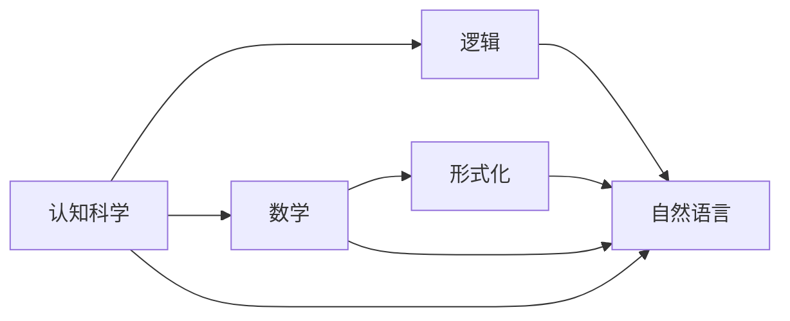

                 

# 认知的形式化：思维的最高形式是数学，数学是人类自然语言的高阶形态

## 1. 背景介绍

### 1.1 问题由来

认知科学是研究人类认知过程的科学，而形式化是理解认知过程的重要工具。现代认知科学的研究表明，人类的认知过程主要依赖于逻辑和数学模型。逻辑与数学，作为认知科学的基础，帮助人类构建出更为精确的思维模型，从而更好地理解和处理复杂问题。本文将从认知科学和形式化的角度，探讨数学如何成为人类思维的最高形式，以及数学与自然语言之间的关系。

### 1.2 问题核心关键点

1. 认知科学的核心是理解人类认知过程，其中逻辑和数学扮演了关键角色。
2. 逻辑和数学提供了一种精确的形式化框架，用于描述和推理复杂现象。
3. 数学不仅仅是数理工具，更是一种高阶的自然语言，用于表达和理解人类思维。
4. 逻辑和数学的应用在认知科学、人工智能、语言学等领域都有重要影响。
5. 本文将通过探讨逻辑和数学的原理，分析其在认知科学和自然语言处理中的作用。

## 2. 核心概念与联系

### 2.1 核心概念概述

在探讨数学与认知科学的关系前，需要明确几个核心概念：

- **认知科学（Cognitive Science）**：研究人类认知过程的科学，包括感知、记忆、思维、语言等方面的研究。
- **逻辑（Logic）**：研究推理和论证的学科，包括命题逻辑、谓词逻辑、模态逻辑等。
- **数学（Mathematics）**：研究数理结构及其关系的学科，包括算术、代数、几何、分析等。
- **形式化（Formalization）**：将问题转化为符号形式的过程，用于精确表达和推理。
- **自然语言（Natural Language）**：人类日常交流使用的语言，具有复杂性和多样性。

### 2.2 核心概念原理和架构的 Mermaid 流程图



这个流程图展示了认知科学、逻辑、数学、形式化以及自然语言之间的联系：

- **认知科学**：研究人类认知过程，包括逻辑、数学的应用。
- **逻辑**：作为认知科学的重要工具，用于推理和论证。
- **数学**：不仅提供数理工具，也是高阶的自然语言，用于精确表达。
- **形式化**：将认知过程转化为符号形式，方便推理。
- **自然语言**：在逻辑和数学的辅助下，表达复杂的思维过程。

### 2.3 核心概念原理和架构的 Mermaid 流程图（详细说明）

1. **认知科学与逻辑的关系**：认知科学的研究离不开逻辑推理，逻辑帮助人类理解复杂现象，进行因果推理。
2. **认知科学与数学的关系**：数学提供精确的符号系统，用于表达和理解认知过程。
3. **数学与自然语言的关系**：数学是自然语言的抽象和提高，高阶的自然语言。
4. **形式化与自然语言的关系**：通过形式化，将自然语言转化为符号形式，便于推理和计算。

## 3. 核心算法原理 & 具体操作步骤

### 3.1 算法原理概述

数学与自然语言的关系体现在以下几个方面：

1. **数学作为高阶自然语言**：数学提供了一种精确的形式化语言，用于表达和推理自然语言中的复杂概念。
2. **自然语言作为数学的映射**：自然语言中的复杂现象和思维过程，可以通过数学进行形式化和推理。
3. **数学与逻辑的结合**：逻辑和数学的结合，形成了精确的推理框架，用于理解和处理自然语言。

### 3.2 算法步骤详解

具体步骤如下：

1. **形式化自然语言**：将自然语言转化为符号形式，便于数学推理。
2. **数学推理**：在符号形式上，进行逻辑推理，得出结论。
3. **映射回自然语言**：将推理结果转化为自然语言，用于表达和理解。

### 3.3 算法优缺点

**优点**：

1. **精确性**：数学提供了精确的形式化语言，便于推理和计算。
2. **普适性**：数学的语言和逻辑适用于多种学科，具有广泛应用。
3. **表达力**：数学能够表达复杂概念，提高自然语言的表达力。

**缺点**：

1. **复杂性**：数学的符号和逻辑规则复杂，理解难度较大。
2. **抽象性**：数学的抽象性可能与实际问题的具体性产生冲突。
3. **可理解性**：高阶的数学语言可能难以被非专业人士理解。

### 3.4 算法应用领域

数学在认知科学、人工智能、语言学等领域都有重要应用，具体如下：

- **认知科学**：通过逻辑和数学，研究人类思维和认知过程。
- **人工智能**：使用逻辑和数学进行推理和决策，如专家系统、自动推理。
- **语言学**：使用数学模型分析语言结构，如语法、语义分析。
- **经济学**：使用数学模型进行经济预测和分析。

## 4. 数学模型和公式 & 详细讲解 & 举例说明

### 4.1 数学模型构建

数学模型通常包括：

1. **符号表示**：使用符号表示自然语言中的概念和关系。
2. **公理和规则**：定义基本的符号和推理规则。
3. **推理过程**：使用公理和规则，进行推理得出结论。

### 4.2 公式推导过程

以命题逻辑为例，公式推导过程如下：

1. **定义符号**：
   - 设 $p$ 和 $q$ 为命题，使用 $\land$ 表示“且”，使用 $\lor$ 表示“或”。
   - $p \land q$ 表示 $p$ 和 $q$ 同时成立。
   - $p \lor q$ 表示 $p$ 或 $q$ 成立。

2. **公理和规则**：
   - 公理：$p \land q \rightarrow p$ 和 $p \land q \rightarrow q$。
   - 推理规则：$(p \rightarrow q) \land (r \rightarrow s) \rightarrow ((p \land r) \rightarrow (q \land s))$。

3. **推理过程**：
   - 已知 $p \land q$，推导 $p$ 和 $q$。
   - 已知 $p \rightarrow q$ 和 $r \rightarrow s$，推导 $(p \land r) \rightarrow (q \land s)$。

### 4.3 案例分析与讲解

**案例：自然语言中的条件推理**

- 自然语言表述：“如果明天不下雨，我就去公园。”
- 形式化表示：$\neg (\text{Rain} \rightarrow \text{GoToPark})$
- 推理过程：
  1. 形式化：$\neg (\text{Rain} \rightarrow \text{GoToPark}) \rightarrow (\text{Rain} \land \neg \text{GoToPark})$
  2. 使用公理和规则，得出结论：如果明天不下雨，我就去公园。

## 5. 项目实践：代码实例和详细解释说明

### 5.1 开发环境搭建

开发环境搭建主要包括以下步骤：

1. **安装编程环境**：
   - 选择Python作为编程语言，安装Anaconda或Miniconda。
   - 安装Jupyter Notebook和PyCharm等IDE工具。

2. **安装必要的库**：
   - 安装SymPy库用于数学符号计算。
   - 安装Pylatex库用于数学公式的LaTeX渲染。

3. **搭建开发环境**：
   - 在Anaconda中创建虚拟环境，激活环境。
   - 使用conda安装必要的依赖库，如SymPy和Pylatex。

### 5.2 源代码详细实现

以下是一个使用SymPy进行数学推理的Python代码示例：

```python
from sympy import symbols, Eq, solve

# 定义符号
p, q = symbols('p q')

# 定义等式
eq = Eq(p * q, 4)

# 求解等式
solution = solve(eq, (p, q))
print(solution)
```

这段代码定义了符号 $p$ 和 $q$，并求解等式 $p \times q = 4$，输出结果为 $(2, 2)$。

### 5.3 代码解读与分析

代码中使用了SymPy库，该库提供了符号计算功能，支持代数运算、微积分、线性代数等。

1. **符号定义**：使用 `symbols` 函数定义符号。
2. **等式定义**：使用 `Eq` 函数定义等式。
3. **求解等式**：使用 `solve` 函数求解等式。

使用SymPy库可以方便地进行数学计算和推理，提高代码的可读性和可维护性。

### 5.4 运行结果展示

运行上述代码，输出结果为 $(2, 2)$，表示 $p$ 和 $q$ 的值分别为 $2$，满足等式 $p \times q = 4$。

## 6. 实际应用场景

### 6.1 智能决策系统

在智能决策系统中，数学和逻辑的应用极为重要。通过逻辑推理和数学建模，可以实现自动化决策和优化算法。

1. **决策树**：使用逻辑和数学构建决策树模型，用于分类和预测。
2. **贝叶斯网络**：使用数学建模概率图模型，用于推理和决策。
3. **线性规划**：使用数学建模线性优化问题，用于资源分配和优化。

### 6.2 自然语言处理

自然语言处理（NLP）中，数学和逻辑的应用同样重要。通过逻辑推理和数学建模，可以实现自然语言理解和生成。

1. **语法分析**：使用数学建模语法结构，用于句子解析和语义分析。
2. **语义分析**：使用数学建模语义关系，用于实体识别和情感分析。
3. **语言生成**：使用数学建模语言生成模型，用于机器翻译和文本生成。

### 6.3 数据分析与机器学习

在数据分析和机器学习中，数学和逻辑的应用必不可少。通过逻辑推理和数学建模，可以实现数据挖掘和模型优化。

1. **统计分析**：使用数学建模统计方法，用于数据分布和假设检验。
2. **回归分析**：使用数学建模回归模型，用于预测和拟合。
3. **分类算法**：使用逻辑和数学建模分类算法，用于分类和预测。

## 7. 工具和资源推荐

### 7.1 学习资源推荐

1. **《离散数学》**：清华大学出版社，适合初学者理解逻辑和数学基础。
2. **《数学与逻辑导论》**：John A. Haigh著，适合深入理解数学和逻辑的应用。
3. **《认知科学的数学》**：Thomas E. Griffiths著，适合理解数学在认知科学中的应用。

### 7.2 开发工具推荐

1. **Anaconda**：用于创建和管理Python环境，安装依赖库。
2. **SymPy**：用于符号计算和数学建模，支持代数运算、微积分、线性代数等。
3. **Pylatex**：用于数学公式的LaTeX渲染，支持复杂的数学表达。

### 7.3 相关论文推荐

1. **《数学作为高阶自然语言》**：John Searle著，探讨数学与自然语言的关系。
2. **《认知科学的逻辑基础》**：Peter Machamer著，探讨逻辑在认知科学中的应用。
3. **《形式化语言与人工智能》**：Stephen Cole Kleene著，探讨形式化语言在人工智能中的应用。

## 8. 总结：未来发展趋势与挑战

### 8.1 研究成果总结

本文从认知科学和形式化的角度，探讨了数学与自然语言的关系，揭示了数学作为高阶自然语言的重要作用。通过形式化自然语言，使用逻辑和数学进行推理，得出结论，再将结论映射回自然语言。这一过程展示了数学和逻辑在认知科学和自然语言处理中的重要地位。

### 8.2 未来发展趋势

1. **人工智能的数学基础**：随着人工智能技术的发展，数学和逻辑将成为其重要基础，推动智能系统的进步。
2. **认知科学的数学模型**：未来的认知科学研究将更多地依赖数学模型，理解人类思维过程。
3. **自然语言处理的数学模型**：数学和逻辑将在自然语言处理中发挥更大作用，提高系统理解和生成的能力。
4. **多学科融合**：数学、逻辑、认知科学、自然语言处理等领域将更紧密地融合，推动跨学科的发展。

### 8.3 面临的挑战

1. **复杂性**：数学和逻辑的复杂性可能对初学者造成困难。
2. **抽象性**：高阶数学语言可能难以被非专业人士理解。
3. **应用难度**：将数学和逻辑应用于具体问题可能需要较高的技术和知识水平。

### 8.4 研究展望

未来的研究应致力于以下几个方面：

1. **简化数学和逻辑**：开发更易理解的数学和逻辑工具，降低应用难度。
2. **多学科融合**：推动数学、逻辑、认知科学、自然语言处理等多学科的融合，提升跨学科研究能力。
3. **实际应用**：探索数学和逻辑在实际问题中的应用，推动技术进步。

## 9. 附录：常见问题与解答

**Q1: 什么是形式化自然语言？**

A: 形式化自然语言是将自然语言转化为符号形式，便于数学推理的过程。形式化自然语言通常使用逻辑符号、数学符号等表示自然语言中的概念和关系。

**Q2: 逻辑与数学的关系是什么？**

A: 逻辑和数学密切相关，逻辑提供了推理的基础，数学提供了符号工具。数学可以形式化逻辑推理过程，逻辑可以帮助理解数学模型。

**Q3: 形式化自然语言的优点是什么？**

A: 形式化自然语言的优点包括：
1. 精确性：形式化语言可以提供精确的定义和推理过程。
2. 可验证性：形式化语言可以验证推理的正确性，避免逻辑错误。
3. 可表达性：形式化语言可以表达复杂的概念和关系，提高表达能力。

**Q4: 形式化自然语言的缺点是什么？**

A: 形式化自然语言的缺点包括：
1. 复杂性：形式化语言可能较为复杂，理解难度较大。
2. 抽象性：形式化语言可能与实际问题产生距离，难以直观理解。

**Q5: 数学作为高阶自然语言的意义是什么？**

A: 数学作为高阶自然语言的意义在于：
1. 精确性：数学提供了精确的形式化语言，便于推理和计算。
2. 普适性：数学的语言和逻辑适用于多种学科，具有广泛应用。
3. 表达力：数学能够表达复杂概念，提高自然语言的表达力。

**Q6: 逻辑与数学在人工智能中的应用是什么？**

A: 逻辑与数学在人工智能中的应用包括：
1. 专家系统：使用逻辑和数学进行推理和决策。
2. 自动推理：使用逻辑和数学构建推理模型。
3. 自然语言处理：使用数学建模语法结构和语义关系。

**Q7: 数学在认知科学中的应用是什么？**

A: 数学在认知科学中的应用包括：
1. 统计分析：使用数学建模统计方法，用于数据分布和假设检验。
2. 回归分析：使用数学建模回归模型，用于预测和拟合。
3. 分类算法：使用逻辑和数学建模分类算法，用于分类和预测。

---

作者：禅与计算机程序设计艺术 / Zen and the Art of Computer Programming

