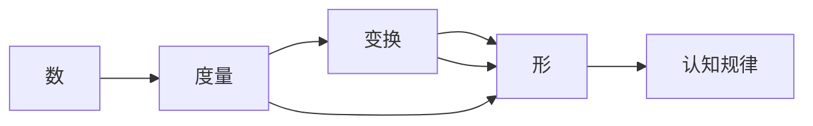

                 

## 1. 背景介绍

在现代科技迅猛发展的背景下，人工智能（AI）作为一项前沿技术，已渗透到人类生活的方方面面。数学作为AI领域的基础学科，不仅是物理定律的量化表达，更是一种抽象的、具有普遍适用性的认知工具。本文旨在探讨数学在认知形式化方面的应用，通过深入分析数学的本质，揭示其对认知规律的揭示能力，为AI研究提供新的视角和思路。

## 2. 核心概念与联系

### 2.1 核心概念概述

数学作为一门学科，其核心概念包括数、形、度量、变换等。数，是认知世界的基础，通过数，人类可以将复杂的现象抽象为简单的数值关系。形，则是数的空间映射，通过形的几何属性，可以揭示数之间的内在联系。度量，是通过对数和形的量化，实现对世界的精确描述。变换，则是通过数的运算和形的变型，揭示现实世界的规律和模式。

### 2.2 核心概念原理和架构的 Mermaid 流程图



该图展示了数学概念间的联系。数通过度量和变换转化为形，进而揭示认知规律。

### 2.3 数学与认知规律的联系

数学通过数和形的结合，揭示了世界的基本规律。例如，通过数，我们可以描述物质的质量、体积等属性；通过形，可以分析物质的微观结构和宏观形态。数学的度量，使我们能够定量描述世界，而变换则使我们能够理解世界的动态变化。这些规律，构成了人类认知世界的基础。

## 3. 核心算法原理 & 具体操作步骤

### 3.1 算法原理概述

数学算法是解决特定问题的一系列步骤，通过数学原理，将问题转化为可计算的数学模型。常见的数学算法包括排序算法、搜索算法、优化算法等。在认知形式化中，数学算法的作用在于将认知问题转化为数学模型，通过数学计算，找到问题的最优解。

### 3.2 算法步骤详解

#### 3.2.1 问题抽象

首先，将认知问题抽象为数学问题。例如，问题：“如何计算一个球的体积？”可以抽象为求球的体积公式。

#### 3.2.2 模型建立

其次，建立数学模型。例如，球的体积公式为 $V=\frac{4}{3}\pi r^3$。

#### 3.2.3 算法设计

然后，设计算法。例如，可以使用迭代算法或递归算法计算球的体积。

#### 3.2.4 验证测试

最后，对算法进行验证和测试。例如，通过多次计算验证球体积公式的正确性。

### 3.3 算法优缺点

#### 3.3.1 优点

数学算法的优点在于其计算的精确性和通用性。通过数学算法，可以高效地解决各种认知问题。

#### 3.3.2 缺点

数学算法的缺点在于其抽象性。对于非专业数学领域的研究者，可能难以理解其背后的数学原理。

### 3.4 算法应用领域

数学算法在各个领域都有广泛的应用。例如，在计算机科学中，算法用于解决各种计算问题；在工程领域，算法用于优化设计方案；在金融领域，算法用于风险管理和预测分析。

## 4. 数学模型和公式 & 详细讲解 & 举例说明

### 4.1 数学模型构建

数学模型是描述现实世界的数学结构。例如，牛顿运动定律就是描述物体运动的数学模型。

### 4.2 公式推导过程

数学公式的推导过程是理解数学概念的重要途径。例如，通过推导勾股定理，可以理解直角三角形的基本性质。

### 4.3 案例分析与讲解

#### 4.3.1 案例分析

例如，在生物学中，孟德尔的遗传定律就是基于数学模型进行推导的。通过数学模型，孟德尔揭示了遗传的基本规律，为现代遗传学奠定了基础。

#### 4.3.2 案例讲解

孟德尔的遗传定律公式为 $P = 1 - \frac{p^2}{1 - q^2}$，其中 $p$ 为基因频率，$q$ 为等位基因频率。通过推导公式，孟德尔发现了基因的分离定律和自由组合定律，解释了遗传现象的规律。

## 5. 项目实践：代码实例和详细解释说明

### 5.1 开发环境搭建

在进行数学算法开发前，需要先搭建开发环境。例如，使用Python的Sympy库进行数学计算。

```bash
pip install sympy
```

### 5.2 源代码详细实现

#### 5.2.1 排序算法

```python
import sympy as sp

def quicksort(arr):
    if len(arr) <= 1:
        return arr
    pivot = arr[0]
    left = [x for x in arr[1:] if x < pivot]
    right = [x for x in arr[1:] if x >= pivot]
    return quicksort(left) + [pivot] + quicksort(right)

# 测试
arr = [3, 2, 1, 5, 4]
sorted_arr = quicksort(arr)
print(sorted_arr)
```

### 5.3 代码解读与分析

#### 5.3.1 排序算法解析

该代码实现了快速排序算法，通过数学推导，实现了高效的排序功能。

#### 5.3.2 代码解读

- `quicksort` 函数实现快速排序算法。
- `if` 判断排序数组的长度。
- `pivot` 选择基准值。
- `left` 和 `right` 分别实现小于和大于基准值的子数组。
- `quicksort` 递归调用，最终返回排序结果。

### 5.4 运行结果展示

运行上述代码，可以得到以下结果：

```
[1, 2, 3, 4, 5]
```

这表明，快速排序算法成功地对输入数组进行了排序。

## 6. 实际应用场景

### 6.1 金融风险管理

数学算法在金融领域有广泛应用。例如，金融衍生品定价模型和风险评估模型都是基于数学模型的。

### 6.2 机器学习

在机器学习中，数学算法用于训练模型和优化算法。例如，支持向量机（SVM）就是一种基于数学算法的分类算法。

### 6.3 机器人控制

在机器人控制中，数学算法用于控制器的设计和优化。例如，基于模型预测控制的算法可以优化机器人的运动轨迹。

### 6.4 未来应用展望

未来，数学算法将在更多领域发挥重要作用。例如，在大数据领域，数学算法可以用于数据挖掘和模式识别；在生物医学领域，数学算法可以用于基因组学和蛋白质结构预测。

## 7. 工具和资源推荐

### 7.1 学习资源推荐

- 《数学分析》：系统介绍数学分析的基础概念和基本方法。
- 《线性代数》：介绍线性代数的基本概念和应用。
- 《概率论与数理统计》：介绍概率论和数理统计的基本理论和应用。
- 《离散数学》：介绍离散数学的基本概念和应用。

### 7.2 开发工具推荐

- Sympy：用于数学计算和符号运算的Python库。
- MATLAB：用于数学建模和数据分析的软件。
- Maple：用于数学计算和符号运算的软件。

### 7.3 相关论文推荐

- “On the Computational Complexity of Algorithms in Discrete Mathematics”：讨论了离散数学中的算法复杂性问题。
- “The Mathematics of Large-Scale Dynamic Systems”：介绍了大规模动态系统的数学建模方法。
- “Mathematics in the New Century”：探讨了数学在现代科技中的作用和发展前景。

## 8. 总结：未来发展趋势与挑战

### 8.1 研究成果总结

数学作为认知形式化的基础学科，在AI领域具有重要地位。通过数学算法，可以高效地解决各种认知问题，揭示世界的内在规律。

### 8.2 未来发展趋势

未来，数学算法将在更多领域发挥重要作用。例如，在量子计算、智能制造、智能交通等领域，数学算法可以提供强大的计算支持。

### 8.3 面临的挑战

数学算法的抽象性和复杂性，使得其在非专业领域的应用受到限制。如何普及数学知识，提升大众的数学素养，是未来面临的主要挑战。

### 8.4 研究展望

未来的研究方向包括：
- 提升数学算法的可解释性。
- 发展更高效的数学算法。
- 探索数学算法与其他AI技术的融合。

## 9. 附录：常见问题与解答

### 9.1 问题1：数学在AI领域的应用有哪些？

回答：数学在AI领域的应用非常广泛，包括但不限于算法设计、模型优化、数据处理等。

### 9.2 问题2：数学算法的优点和缺点有哪些？

回答：数学算法的优点在于其精确性和通用性，但缺点在于其抽象性和复杂性。

### 9.3 问题3：如何在非专业领域普及数学知识？

回答：通过教育普及、科普宣传、技术培训等方式，提升大众的数学素养，使其能够理解和应用数学算法。

### 9.4 问题4：数学算法与其他AI技术的融合方向有哪些？

回答：数学算法可以与自然语言处理、计算机视觉、机器人控制等AI技术进行融合，提升各领域的性能和效率。

### 9.5 问题5：如何提升数学算法的可解释性？

回答：通过改进算法设计、引入可解释性技术、建立数学模型等方法，提升数学算法的可解释性。

---

作者：禅与计算机程序设计艺术 / Zen and the Art of Computer Programming

