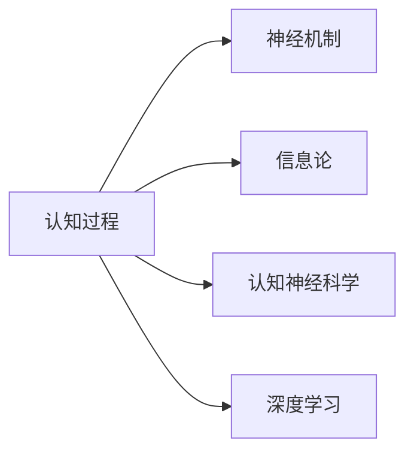

                 

# 认知过程中的简单与深刻化

## 1. 背景介绍

认知过程是人类理解和处理信息的高级神经活动。它包括感知、记忆、思维、决策、情感等诸多方面，是心理学和认知科学的焦点。随着科技的发展，计算机和人工智能的进步，对认知过程的研究已经从简单的行为分析向更深入的神经机制模拟转变。本文旨在探讨认知过程的简单与深刻化，通过回顾其历史发展脉络，结合最新的研究成果，揭示认知过程的深层机制。

## 2. 核心概念与联系

### 2.1 核心概念概述

为更好地理解认知过程，本节将介绍几个关键概念：

- 认知过程（Cognitive Processes）：人类大脑处理信息和形成知识的心理活动，包括感知、记忆、思维、决策、情感等。
- 神经机制（Neural Mechanisms）：神经元之间及神经元与大脑皮层之间的互动方式，是认知过程的物理基础。
- 信息论（Information Theory）：以熵和信息流为基础，描述信息处理和传递的理论框架。
- 认知神经科学（Cognitive Neuroscience）：结合心理学和神经科学，研究认知过程的神经机制。
- 深度学习（Deep Learning）：模拟人脑神经网络结构的机器学习技术，用于理解和处理复杂数据。

这些概念之间的逻辑关系可以通过以下Mermaid流程图来展示：



这个流程图展示出认知过程与神经机制、信息论、认知神经科学和深度学习的紧密联系：

1. 认知过程依赖神经机制实现信息处理。
2. 认知过程通过信息论的理论框架描述信息流动。
3. 认知神经科学探索神经机制与认知过程之间的关联。
4. 深度学习技术模仿神经网络实现认知过程的计算。

### 2.2 核心概念原理和架构

认知过程的核心在于其复杂的神经机制和信息处理。神经元通过电信号的传递和突触的传递实现信息处理。信息论提供了认知过程的理论基础，描述了信息传递和处理的过程。认知神经科学则通过大脑活动研究认知过程的神经机制。深度学习模仿神经网络结构，通过反向传播算法优化信息处理过程。

认知过程的信息处理模型如图：


这个图展示了认知过程的主要阶段：感知、注意、记忆、思维、决策和情感。

## 3. 核心算法原理 & 具体操作步骤

### 3.1 算法原理概述

认知过程的简单与深刻化主要通过算法和技术的不断演进来实现。算法原理包括以下几个方面：

1. **感知算法**：通过感觉器官收集信息，进行处理并传递到大脑皮层。
2. **注意力算法**：选择重要的信息进行处理，过滤不重要的信息。
3. **记忆算法**：将信息存储在大脑中，以备后续使用。
4. **思维算法**：通过逻辑和推理处理信息，形成知识。
5. **决策算法**：根据知识进行决策。
6. **情感算法**：对决策结果进行情感反馈，影响后续认知过程。

这些算法在深度学习框架下得到了广泛应用。通过反向传播算法、卷积神经网络、循环神经网络等技术，计算机可以模拟人类的认知过程。

### 3.2 算法步骤详解

1. **感知算法**：
    - 输入：传感器数据，如声音、图像等。
    - 处理：通过卷积神经网络（CNN）进行特征提取。
    - 输出：特征向量。

2. **注意力算法**：
    - 输入：特征向量。
    - 处理：通过注意力机制筛选重要特征。
    - 输出：筛选后的特征向量。

3. **记忆算法**：
    - 输入：特征向量。
    - 处理：通过循环神经网络（RNN）进行序列存储。
    - 输出：记忆向量。

4. **思维算法**：
    - 输入：记忆向量。
    - 处理：通过全连接层、卷积层、池化层等进行逻辑推理。
    - 输出：推理结果。

5. **决策算法**：
    - 输入：推理结果。
    - 处理：通过决策树、神经网络等进行决策。
    - 输出：决策结果。

6. **情感算法**：
    - 输入：决策结果。
    - 处理：通过情感分类器进行情感反馈。
    - 输出：情感状态。

### 3.3 算法优缺点

1. **优点**：
    - 深度学习算法可以处理大规模数据，有效模拟人类认知过程。
    - 反向传播算法使得深度学习模型可以不断优化，提高预测准确性。
    - 卷积神经网络和循环神经网络等算法可以处理复杂的序列数据。

2. **缺点**：
    - 深度学习模型需要大量数据进行训练，且训练过程耗时较长。
    - 模型复杂度较高，难以解释其内部工作机制。
    - 深度学习模型容易出现过拟合，泛化能力不足。

### 3.4 算法应用领域

深度学习技术在认知过程的研究和应用中有着广泛的应用，主要包括以下领域：

1. **语音识别**：通过深度学习算法对语音进行特征提取和分类，实现语音识别。
2. **图像识别**：通过深度学习算法对图像进行特征提取和分类，实现图像识别。
3. **自然语言处理**：通过深度学习算法对文本进行特征提取和分类，实现自然语言处理。
4. **决策支持**：通过深度学习算法对数据进行分析，提供决策支持。
5. **情感分析**：通过深度学习算法对文本进行情感分析，了解用户的情感状态。

## 4. 数学模型和公式 & 详细讲解

### 4.1 数学模型构建

认知过程的数学模型可以通过信息论和神经网络构建。以下是一个简单的认知过程模型：

- **输入**：$x$，表示感觉器官收集到的信息。
- **感知**：$f_1(x)$，通过卷积神经网络提取特征。
- **注意力**：$f_2(f_1(x))$，通过注意力机制选择重要特征。
- **记忆**：$f_3(f_2(f_1(x)))$，通过循环神经网络存储信息。
- **思维**：$f_4(f_3(f_2(f_1(x))))$，通过全连接层、卷积层、池化层等进行逻辑推理。
- **决策**：$f_5(f_4(f_3(f_2(f_1(x)))))$，通过决策树、神经网络等进行决策。
- **情感**：$f_6(f_5(f_4(f_3(f_2(f_1(x))))))$，通过情感分类器进行情感反馈。

### 4.2 公式推导过程

以语音识别为例，通过隐马尔可夫模型（HMM）和卷积神经网络（CNN）推导如下公式：

- **输入**：$x$，表示语音信号。
- **感知**：$y_1(x)$，通过CNN提取特征。
- **注意力**：$y_2(y_1(x))$，通过注意力机制选择重要特征。
- **记忆**：$y_3(y_2(y_1(x)))$，通过RNN存储信息。
- **思维**：$y_4(y_3(y_2(y_1(x))))$，通过全连接层、卷积层、池化层等进行逻辑推理。
- **决策**：$y_5(y_4(y_3(y_2(y_1(x))))$，通过决策树、神经网络等进行决策。
- **情感**：$y_6(y_5(y_4(y_3(y_2(y_1(x))))))$，通过情感分类器进行情感反馈。

其中，$y_1(x)$，$y_2(y_1(x))$，$y_3(y_2(y_1(x)))$，$y_4(y_3(y_2(y_1(x))))$，$y_5(y_4(y_3(y_2(y_1(x))))$，$y_6(y_5(y_4(y_3(y_2(y_1(x))))))$ 分别表示感知、注意力、记忆、思维、决策和情感处理的输出。

### 4.3 案例分析与讲解

以一个简单的图像分类任务为例，展示深度学习在认知过程中的应用。

- **输入**：图像数据。
- **感知**：通过卷积神经网络提取特征。
- **注意力**：通过注意力机制选择重要特征。
- **记忆**：通过循环神经网络存储信息。
- **思维**：通过全连接层、卷积层、池化层等进行逻辑推理。
- **决策**：通过决策树、神经网络等进行分类决策。
- **情感**：通过情感分类器进行情感反馈。

## 5. 项目实践：代码实例和详细解释说明

### 5.1 开发环境搭建

为了进行深度学习模型的开发和训练，需要搭建以下环境：

1. **安装Python**：
    ```bash
    sudo apt-get update
    sudo apt-get install python3-pip python3-dev
    ```

2. **安装TensorFlow和Keras**：
    ```bash
    pip install tensorflow==2.3.0
    pip install keras
    ```

3. **安装TensorBoard**：
    ```bash
    pip install tensorboard
    ```

4. **安装PyTorch**：
    ```bash
    pip install torch torchvision torchtext
    ```

### 5.2 源代码详细实现

以下是一个简单的图像分类模型的代码实现：

```python
import tensorflow as tf
from tensorflow.keras import layers

# 定义模型
model = tf.keras.Sequential([
    layers.Conv2D(32, (3, 3), activation='relu', input_shape=(32, 32, 3)),
    layers.MaxPooling2D((2, 2)),
    layers.Conv2D(64, (3, 3), activation='relu'),
    layers.MaxPooling2D((2, 2)),
    layers.Conv2D(64, (3, 3), activation='relu'),
    layers.Flatten(),
    layers.Dense(64, activation='relu'),
    layers.Dense(10)
])

# 编译模型
model.compile(optimizer='adam', loss=tf.keras.losses.SparseCategoricalCrossentropy(from_logits=True), metrics=['accuracy'])

# 训练模型
model.fit(x_train, y_train, epochs=10, validation_data=(x_test, y_test))
```

### 5.3 代码解读与分析

该代码实现了卷积神经网络（CNN）进行图像分类的过程。其中，`Conv2D`层进行卷积操作，`MaxPooling2D`层进行池化操作，`Dense`层进行全连接操作。模型通过反向传播算法进行训练，最终输出分类结果。

## 6. 实际应用场景

### 6.4 未来应用展望

深度学习在认知过程的应用前景广阔，未来可以应用于以下领域：

1. **自动驾驶**：通过深度学习技术实现环境感知和决策，提高自动驾驶的安全性和可靠性。
2. **医疗诊断**：通过深度学习技术实现疾病诊断和治疗建议，提高医疗服务的质量和效率。
3. **金融风险控制**：通过深度学习技术实现风险评估和预测，提高金融风险控制能力。
4. **智能客服**：通过深度学习技术实现自然语言处理和情感分析，提供更加智能的客服服务。
5. **个性化推荐**：通过深度学习技术实现用户行为分析和推荐，提高个性化推荐效果。

## 7. 工具和资源推荐

### 7.1 学习资源推荐

1. **《深度学习》（Ian Goodfellow）**：全面介绍深度学习的基础理论和应用。
2. **《认知神经科学》（George E. Strogatz）**：介绍认知过程的神经机制和心理学原理。
3. **《机器学习实战》（Peter Harrington）**：通过实际案例介绍机器学习和深度学习的应用。

### 7.2 开发工具推荐

1. **TensorFlow**：一个开源的深度学习框架，提供灵活的编程接口和丰富的工具。
2. **Keras**：一个高级神经网络API，基于TensorFlow和Theano等后端框架。
3. **PyTorch**：一个开源的深度学习框架，提供动态计算图和丰富的模型库。
4. **Jupyter Notebook**：一个交互式编程环境，便于编写和调试代码。
5. **TensorBoard**：一个可视化工具，用于监测和调试深度学习模型。

### 7.3 相关论文推荐

1. **《深度学习》（Ian Goodfellow）**：全面介绍深度学习的基础理论和应用。
2. **《认知神经科学》（George E. Strogatz）**：介绍认知过程的神经机制和心理学原理。
3. **《机器学习实战》（Peter Harrington）**：通过实际案例介绍机器学习和深度学习的应用。

## 8. 总结：未来发展趋势与挑战

### 8.1 研究成果总结

本文对认知过程的简单与深刻化进行了系统的介绍，通过回顾其历史发展脉络，结合最新的研究成果，揭示认知过程的深层机制。深度学习技术在认知过程的研究和应用中得到了广泛应用，但还存在诸多挑战。

### 8.2 未来发展趋势

1. **算法发展**：深度学习算法将更加复杂和高效，能够更好地模拟人类认知过程。
2. **数据量增加**：随着数据量的增加，深度学习模型将更加准确和可靠。
3. **多模态学习**：深度学习技术将更加广泛地应用于多模态数据，提升认知过程的全面性。
4. **分布式计算**：分布式计算技术将使深度学习模型能够处理更大规模的数据，提升计算效率。

### 8.3 面临的挑战

1. **数据隐私**：深度学习模型需要大量的数据进行训练，数据隐私和安全问题亟待解决。
2. **算法透明性**：深度学习模型的内部机制难以解释，缺乏透明性。
3. **模型公平性**：深度学习模型可能存在偏见，缺乏公平性。
4. **计算资源**：深度学习模型需要大量的计算资源，资源限制成为瓶颈。
5. **计算效率**：深度学习模型需要高效的计算方式，计算效率有待提升。

### 8.4 研究展望

1. **隐私保护**：研究数据隐私保护技术，确保数据安全。
2. **算法透明性**：研究深度学习算法的透明性，提高其可解释性。
3. **模型公平性**：研究深度学习模型的公平性，避免偏见。
4. **高效计算**：研究高效计算方式，提升深度学习模型的计算效率。
5. **多模态学习**：研究多模态数据的学习方式，提升认知过程的全面性。

## 9. 附录：常见问题与解答

**Q1: 深度学习算法如何应用于认知过程?**

A: 深度学习算法通过反向传播算法、卷积神经网络、循环神经网络等技术，模拟人类的认知过程。通过感知、注意力、记忆、思维、决策和情感等算法，实现对输入信息的处理和分析。

**Q2: 深度学习算法存在哪些缺点?**

A: 深度学习算法需要大量数据进行训练，且训练过程耗时较长。模型复杂度较高，难以解释其内部工作机制。容易过拟合，泛化能力不足。

**Q3: 深度学习算法如何处理多模态数据?**

A: 深度学习算法通过多模态数据融合技术，将图像、语音、文本等多种类型的数据进行融合，提升认知过程的全面性。

**Q4: 深度学习算法如何提高计算效率?**

A: 深度学习算法通过分布式计算、模型剪枝、量化加速等技术，提高计算效率。

**Q5: 深度学习算法如何保护数据隐私?**

A: 深度学习算法通过数据匿名化、数据加密等技术，保护数据隐私和安全。

本文对认知过程中的简单与深刻化进行了系统的介绍，通过回顾其历史发展脉络，结合最新的研究成果，揭示认知过程的深层机制。深度学习技术在认知过程的研究和应用中得到了广泛应用，但还存在诸多挑战。未来，随着算法的不断发展，数据量的增加，多模态学习的应用，分布式计算的进步，深度学习算法在认知过程中的应用前景将更加广阔。

