                 

## 1. 背景介绍

设计模式（Design Pattern）是软件开发中广泛应用的最佳实践，帮助开发者以优雅的方式解决常见问题，提升代码的可读性、可维护性和可扩展性。通过学习设计模式，可以更好地理解代码的架构，提高开发效率，促进技术的进步。本文将对设计模式进行分类，并详细探讨各种模式的应用场景，为软件开发提供有价值的参考。

## 2. 核心概念与联系

### 2.1 核心概念概述

设计模式分为三大类：**创建型（Creational Patterns）**、**结构型（Structural Patterns）**和**行为型（Behavioral Patterns）**。每一类设计模式都围绕不同的软件设计和架构问题，提供灵活的解决方案。

- **创建型模式**：主要关注对象的创建过程，通过某种机制将对象的创建和使用分离开来，从而简化对象创建和减少耦合。
- **结构型模式**：关注对象之间的组织结构，通过组合和继承来优化类和对象的交互。
- **行为型模式**：关注对象之间的交互方式，通过消息传递、状态转移等方式实现复杂的行为。

### 2.2 核心概念原理和架构的 Mermaid 流程图

以下是一个简化的 Mermaid 流程图，展示了三种设计模式之间的联系和区别：

```mermaid
graph TB
    A[创建型模式] --> B[工厂方法模式]
    A --> C[单例模式]
    A --> D[原型模式]
    A --> E[抽象工厂模式]
    
    A --> F[结构型模式]
    A --> G[代理模式]
    A --> H[装饰者模式]
    A --> I[外观模式]
    A --> J[组合模式]
    A --> K[适配器模式]
    
    A --> L[行为型模式]
    A --> M[策略模式]
    A --> N[模板方法模式]
    A --> O[观察者模式]
    A --> P[命令模式]
    A --> Q[状态模式]
    A --> R[解释器模式]
    A --> S[迭代器模式]
    A --> T[中介者模式]
    A --> U[发布-订阅模式]
    A --> V[责任链模式]
    A --> W[访问者模式]
```



## 3. 核心算法原理 & 具体操作步骤

### 3.1 算法原理概述

设计模式通过将抽象和实现在不同的对象之间解耦，实现代码的灵活性和可复用性。其基本原理包括：

1. **抽象化**：通过抽象将问题封装在具体的实现中，降低耦合性。
2. **分而治之**：将大问题分解为小问题，通过组合和继承解决不同的小问题。
3. **延迟决策**：将决策延迟到运行时，实现动态绑定和灵活配置。
4. **解耦合**：减少不同模块之间的依赖关系，提高系统的可维护性和可扩展性。

### 3.2 算法步骤详解

设计模式的实现步骤一般包括以下几个关键步骤：

1. **理解问题**：明确问题需求和设计目标，确定需要解决的核心问题。
2. **选择模式**：根据问题特性选择合适的设计模式，如创建型模式、结构型模式或行为型模式。
3. **设计类图**：根据模式定义设计具体的类图和接口，确定各类的关系和依赖。
4. **实现代码**：根据设计图编写具体的代码实现，并测试验证其正确性。
5. **维护优化**：根据实际应用反馈，对代码进行持续维护和优化。

### 3.3 算法优缺点

设计模式具有以下优点：

- **提升可复用性**：通过模板方法和策略模式等，提升代码的可复用性。
- **简化代码结构**：通过代理模式和适配器模式等，降低对象之间的依赖，简化代码结构。
- **增强灵活性**：通过单例模式和工厂方法模式等，实现动态绑定，提高系统的灵活性。
- **提高可维护性**：通过策略模式和装饰者模式等，使代码更加模块化和可扩展。

同时，设计模式也存在一些缺点：

- **复杂性**：设计模式涉及多个类和接口，增加了代码的复杂度。
- **过度设计**：过度使用设计模式可能导致过度设计，影响性能和可读性。
- **不适用于所有场景**：设计模式不能解决所有问题，需要根据具体情况进行选择。

### 3.4 算法应用领域

设计模式广泛应用于软件开发的不同领域，包括但不限于：

- **Web开发**：通过单例模式和工厂方法模式等，优化Web应用的结构和性能。
- **移动开发**：通过适配器模式和装饰者模式等，提高移动应用的模块化和扩展性。
- **游戏开发**：通过观察者模式和责任链模式等，实现游戏逻辑的灵活性和响应性。
- **大数据处理**：通过代理模式和策略模式等，优化大数据处理框架的结构和效率。
- **云计算**：通过组合模式和发布-订阅模式等，实现云服务的灵活性和可扩展性。

## 4. 数学模型和公式 & 详细讲解 & 举例说明

### 4.1 数学模型构建

设计模式的应用常常与具体的算法和数据结构相关。以下是几种常见设计模式的数学模型构建：

- **工厂方法模式**：将创建逻辑封装在抽象工厂中，使用不同的具体工厂创建不同的产品对象。
- **单例模式**：通过静态变量和双重检查锁定等技术，确保只有一个实例对象存在。
- **代理模式**：通过定义代理类，在客户端和真实对象之间增加一层抽象，实现对真实对象的代理访问。

### 4.2 公式推导过程

以工厂方法模式为例，假设有一个抽象工厂 `AbstractFactory` 和两个具体工厂 `ConcreteFactoryA` 和 `ConcreteFactoryB`，分别创建产品 `ProductA` 和 `ProductB`：

```python
class AbstractFactory:
    def create_product(self):
        pass

class ConcreteFactoryA(AbstractFactory):
    def create_product(self):
        return ProductA()

class ProductA:
    def operation(self):
        print("Product A operation")

class ConcreteFactoryB(AbstractFactory):
    def create_product(self):
        return ProductB()

class ProductB:
    def operation(self):
        print("Product B operation")

# 使用工厂方法模式创建产品
def factory_method(factory, product):
    product = factory.create_product()
    product.operation()

# 测试
factory = ConcreteFactoryA()
factory_method(factory, None)
```

### 4.3 案例分析与讲解

在Web开发中，常常使用工厂方法模式来创建不同的HTTP请求对象。通过定义一个抽象工厂 `HttpRequestFactory`，创建具体的 `HttpGetRequest` 和 `HttpPostRequest`，实现对不同请求类型的支持：

```python
class HttpRequestFactory:
    def create_request(self, method):
        if method == "GET":
            return GetHttpRequest()
        elif method == "POST":
            return PostHttpRequest()

class GetHttpRequest:
    def execute(self):
        print("HTTP GET request")

class PostHttpRequest:
    def execute(self):
        print("HTTP POST request")

# 使用工厂方法模式创建HTTP请求
def create_http_request(method):
    factory = HttpRequestFactory()
    request = factory.create_request(method)
    request.execute()

# 测试
create_http_request("GET")
create_http_request("POST")
```

## 5. 项目实践：代码实例和详细解释说明

### 5.1 开发环境搭建

要进行设计模式的实践，需要安装Python和相应的框架。常用的框架包括Django、Flask、Spring等。以下是使用Django进行工厂方法模式的实践：

```bash
# 安装Django
pip install django

# 创建Django项目
django-admin startproject myapp

# 创建Django应用
python manage.py startapp factory
```

### 5.2 源代码详细实现

在应用中，我们定义一个抽象工厂 `AbstractFactory`，创建具体的工厂 `ConcreteFactoryA` 和 `ConcreteFactoryB`，以及产品 `ProductA` 和 `ProductB`：

```python
from django.http import HttpResponse

class AbstractFactory:
    def create_product(self):
        pass

class ConcreteFactoryA(AbstractFactory):
    def create_product(self):
        return ProductA()

class ProductA:
    def operation(self):
        return HttpResponse("Product A")

class ConcreteFactoryB(AbstractFactory):
    def create_product(self):
        return ProductB()

class ProductB:
    def operation(self):
        return HttpResponse("Product B")

# 定义工厂方法
def factory_method(factory, product):
    product = factory.create_product()
    return product.operation()

# 定义视图
def view(request):
    if request.method == "GET":
        factory = ConcreteFactoryA()
        return factory_method(factory, None)
    elif request.method == "POST":
        factory = ConcreteFactoryB()
        return factory_method(factory, None)
```

### 5.3 代码解读与分析

在上述代码中，我们定义了抽象工厂 `AbstractFactory` 和两个具体工厂 `ConcreteFactoryA` 和 `ConcreteFactoryB`，实现了工厂方法模式。当客户端发送不同的HTTP请求时，根据请求方法选择相应的工厂创建产品对象，并返回对应的操作结果。

### 5.4 运行结果展示

在Django的开发环境中，运行应用并访问 `http://127.0.0.1:8000`，可以看到不同的HTTP请求被正确处理，并返回相应的产品信息。

## 6. 实际应用场景

### 6.1 电商推荐系统

电商推荐系统需要根据用户行为和历史数据，推荐合适的商品。使用工厂方法模式，可以动态创建不同的推荐算法模型，提升系统的灵活性和可扩展性：

```python
class AlgorithmFactory:
    def create_algorithm(self, algorithm):
        if algorithm == "协同过滤":
            return CollaborativeFiltering()
        elif algorithm == "内容推荐":
            return ContentBasedRecommendation()
        else:
            return None

class CollaborativeFiltering:
    def recommend(self, user, item):
        return item

class ContentBasedRecommendation:
    def recommend(self, user, item):
        return item

# 使用工厂方法创建推荐算法
def create_algorithm(algorithm, user, item):
    factory = AlgorithmFactory()
    algorithm = factory.create_algorithm(algorithm)
    return algorithm.recommend(user, item)
```

### 6.2 日志系统

日志系统需要记录应用程序的各种日志信息，使用工厂方法模式，可以动态创建不同的日志记录器，支持多条记录的输出：

```python
class LogFactory:
    def create_logger(self, logger):
        if logger == "console":
            return ConsoleLogger()
        elif logger == "file":
            return FileLogger()
        else:
            return None

class ConsoleLogger:
    def log(self, message):
        print(message)

class FileLogger:
    def log(self, message):
        with open("log.txt", "a") as f:
            f.write(message)

# 使用工厂方法创建日志记录器
def create_logger(logger):
    factory = LogFactory()
    logger = factory.create_logger(logger)
    logger.log("This is a log message")
```

## 7. 工具和资源推荐

### 7.1 学习资源推荐

为了更好地理解设计模式，推荐以下学习资源：

- 《Head First Design Patterns》：采用图表和类图的方式介绍设计模式，易于理解。
- 《Design Patterns》：由GoF（Gang of Four）编写，是设计模式领域的经典之作。
- 《Clean Architecture》：介绍如何通过设计模式构建清晰、可扩展的系统架构。
- 《Effective Java》：虽然主要面向Java开发者，但其中的设计模式思路对其他语言也有借鉴意义。
- 《UML快速入门》：了解UML类图和时序图，有助于更好地理解设计模式。

### 7.2 开发工具推荐

设计模式的实现和测试需要开发工具的支持，推荐以下工具：

- **IntelliJ IDEA**：支持Java和Kotlin开发，集成了设计模式模板和代码分析功能。
- **Visual Studio**：支持C#和.NET开发，提供了丰富的代码导航和重构工具。
- **Eclipse**：支持Java、JavaScript等开发，具有强大的插件生态和调试功能。
- **Git**：版本控制系统，方便版本管理和协作开发。
- **JUnit**：Java单元测试框架，帮助测试设计模式的实现。

### 7.3 相关论文推荐

- **Head First Design Patterns**：采用通俗易懂的方式介绍设计模式，适合初学者阅读。
- **Design Patterns: Elements of Reusable Object-Oriented Software**：GoF编写，详细介绍了23种经典设计模式。
- **Clean Architecture: A Craftsman's Guide to Software Structure and Design**：介绍如何通过设计模式构建清晰、可扩展的系统架构。
- **UML Distilled: A Brief Guide to the Standard Object Modeling Language**：介绍UML类图和时序图的语法和用法，有助于理解设计模式。

## 8. 总结：未来发展趋势与挑战

### 8.1 研究成果总结

设计模式在软件开发中具有广泛的应用和深远的影响。通过学习设计模式，可以更好地理解代码的结构和架构，提升开发效率和代码质量。设计模式的核心在于抽象和封装，通过将复杂问题分解为简单、可重用的模块，实现代码的灵活性和可扩展性。

### 8.2 未来发展趋势

未来设计模式将继续演化，呈现出以下几个趋势：

- **组件化**：随着微服务架构的普及，设计模式将更多地应用于组件化开发，提升系统的模块化和可扩展性。
- **智能编程**：通过机器学习和人工智能技术，设计模式将变得更加智能，能够自动选择最优的设计方案。
- **跨平台支持**：设计模式将更加关注跨平台开发，支持多语言、多平台的代码复用和互操作性。
- **生态系统构建**：设计模式将更多地融入开源生态系统，促进代码的共享和协作开发。
- **实时系统支持**：设计模式将更多地应用于实时系统开发，提升系统的响应速度和稳定性。

### 8.3 面临的挑战

尽管设计模式具有重要的应用价值，但在实际应用中也面临一些挑战：

- **过度设计**：过度使用设计模式可能导致过度设计，影响代码的可读性和性能。
- **实现复杂**：设计模式的实现涉及多个类和接口，增加了代码的复杂度。
- **适配困难**：设计模式需要根据具体场景进行选择和适配，有时可能不太适合某些特定的应用场景。
- **维护成本高**：设计模式的复杂性和灵活性使得维护成本较高，需要持续的优化和调整。

### 8.4 研究展望

未来的研究需要在以下几个方面进行突破：

- **简化设计模式**：通过优化和改进设计模式，使其更加简洁和易于实现。
- **自动化设计**：通过工具和技术支持，自动选择和实现最适合的设计模式。
- **可扩展设计**：通过模块化和组件化的设计，实现系统的高效扩展和维护。
- **跨领域应用**：将设计模式应用于不同领域的开发，提升代码的复用性和可扩展性。
- **智能设计**：结合人工智能和机器学习技术，实现更加智能和灵活的设计模式。

## 9. 附录：常见问题与解答

### Q1: 设计模式如何提升代码的可读性和可维护性？

A: 设计模式通过将问题分解为简单、可重用的模块，提升代码的清晰度和可读性。通过封装复杂逻辑和细节，使得代码更加模块化和易于维护。

### Q2: 设计模式有哪些常见的陷阱？

A: 设计模式的使用需要注意以下陷阱：
- 过度使用：过度使用设计模式可能导致代码变得复杂和难以理解。
- 实现复杂：设计模式需要考虑多个类和接口，增加了代码的复杂度。
- 过度设计：过度使用设计模式可能导致过度设计，影响代码的可读性和性能。
- 适配困难：设计模式需要根据具体场景进行选择和适配，有时可能不太适合某些特定的应用场景。

### Q3: 设计模式如何应用于不同语言的开发？

A: 设计模式的核心思想是抽象和封装，因此可以应用于不同语言的开发。不同语言有不同的实现方式，但基本设计思路和原理是相同的。例如，Java和C#都支持设计模式，Python和JavaScript等语言也有相应的实现方式。

### Q4: 设计模式如何应用于测试驱动开发（TDD）？

A: 设计模式在TDD中具有重要的作用，通过先定义接口和抽象类，然后根据需求逐步实现具体类，可以保证代码的模块化和可扩展性。设计模式还提供了许多常用的测试模板和方法，有助于编写高质量的测试代码。

---

作者：禅与计算机程序设计艺术 / Zen and the Art of Computer Programming

