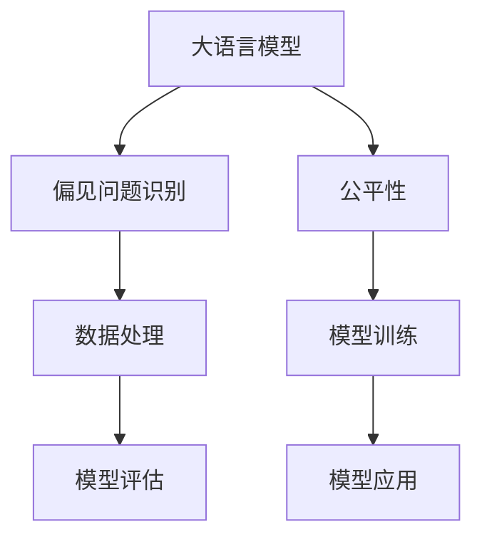

                 

# 语言模型的偏见问题：识别与缓解

> 关键词：语言模型, 偏见问题, 识别, 缓解, 公平性, 数据处理, 模型训练

## 1. 背景介绍

### 1.1 问题由来

随着深度学习技术的快速发展，大语言模型（Large Language Models, LLMs）在自然语言处理（Natural Language Processing, NLP）领域取得了巨大的突破。这些大模型通过在海量无标签文本数据上进行预训练，学习到了丰富的语言知识和常识，能够生成高质量的文本，进行复杂推理和生成任务。

然而，由于预训练数据的多样性和复杂性，大语言模型不可避免地会学习到数据中的偏见和歧视信息，这些偏见可能会对模型的输出产生影响，导致模型在某些群体或场景下表现不佳，甚至产生歧视性的行为。这种偏见问题在大规模语言模型中尤为显著，因为数据源往往存在多种偏见，如性别、种族、年龄、地域等。

### 1.2 问题核心关键点

语言模型中的偏见问题主要体现在两个方面：

1. **数据偏见**：训练数据中的偏见信息可能被模型所学习，并在输出中得以体现。例如，如果训练数据中包含性别偏见，模型可能会更倾向于生成与数据中多数性别相符的文本。

2. **模型偏见**：大模型在训练过程中可能出现“overfitting”现象，即模型在训练集上的表现优于在测试集或未见过的数据集上的表现。这种“overfitting”可能导致模型在特定群体或场景下表现不佳。

### 1.3 问题研究意义

识别和缓解语言模型中的偏见问题，对于提升模型的公平性和可靠性，构建更加普适和安全的智能系统具有重要意义：

1. **提升模型公平性**：确保不同群体在模型输出中的待遇公平，减少算法歧视。
2. **增强模型鲁棒性**：避免模型在特定群体或场景下的性能波动，提高模型的泛化能力。
3. **维护用户信任**：通过公正、透明的输出，增强用户对系统的信任度。
4. **促进技术进步**：推动研究者对大模型偏见问题的深入理解，推动技术进步。
5. **支持社会正义**：通过减少算法偏见，支持社会公平与正义。

## 2. 核心概念与联系

### 2.1 核心概念概述

为了更好地理解如何识别和缓解语言模型中的偏见问题，本节将介绍几个关键概念及其相互联系：

- **大语言模型 (LLMs)**：指通过预训练获得强大语言能力的模型，如BERT、GPT等，能够在自然语言处理任务中取得优异表现。

- **偏见问题**：指模型输出对某些群体或属性存在不公正或歧视的情况，可能源于数据和算法两个方面。

- **公平性**：指模型在不同群体中的表现一致，不存在对某些群体的偏好或歧视。

- **数据处理**：指对原始数据进行清洗、去重、标注等操作，以减少偏见的影响。

- **模型训练**：指通过选择合适的损失函数、正则化技术等手段，训练出公平、鲁棒的模型。

- **模型评估**：指使用公平性指标对模型性能进行评估，发现并改进模型的偏见问题。

这些核心概念之间的联系可以通过以下Mermaid流程图来展示：



这个流程图展示了语言模型与偏见问题识别、公平性、数据处理、模型训练、模型评估、模型应用等概念之间的逻辑关系：

1. 大语言模型通过预训练获得基础能力。
2. 偏见问题识别和数据处理用于减少模型的偏见。
3. 模型训练和评估用于提升模型的公平性和鲁棒性。
4. 模型应用需要确保模型的公平性和可靠性。

## 3. 核心算法原理 & 具体操作步骤
### 3.1 算法原理概述

识别和缓解语言模型中的偏见问题，核心在于优化模型的训练过程，使其输出更加公平和可靠。这通常包括数据处理、模型训练和评估等步骤。

- **数据处理**：通过对原始数据进行清洗、标注等操作，减少数据中的偏见信息。
- **模型训练**：选择合适的损失函数和正则化技术，训练出公平、鲁棒的模型。
- **模型评估**：使用公平性指标对模型性能进行评估，发现并改进模型的偏见问题。

### 3.2 算法步骤详解

**步骤 1: 数据处理**

数据处理是识别和缓解偏见问题的第一步。主要步骤如下：

1. **数据清洗**：去除数据中的噪声和异常值，如缺失值、重复数据等。
2. **数据标注**：对数据进行标注，如性别、年龄、种族等，以便进行后续分析。
3. **数据重采样**：对不同群体的数据进行重采样，保证数据分布的均衡。

**步骤 2: 模型训练**

选择合适的模型架构和损失函数，对数据进行训练。主要步骤如下：

1. **模型选择**：选择合适的模型架构，如BERT、GPT等。
2. **损失函数**：选择合适的损失函数，如交叉熵损失、均方误差损失等。
3. **正则化**：使用L2正则、Dropout等正则化技术，避免模型过拟合。
4. **学习率调整**：调整学习率，确保模型能够充分学习数据中的信息，同时避免过拟合。

**步骤 3: 模型评估**

评估模型是否存在偏见，主要步骤如下：

1. **公平性指标**：选择合适的公平性指标，如均等偏差、群体差异等。
2. **模型输出分析**：分析模型在特定群体或属性下的输出结果，发现偏见问题。
3. **改进措施**：根据分析结果，调整模型训练参数，如正则化强度、学习率等，以缓解偏见问题。

### 3.3 算法优缺点

识别和缓解语言模型中的偏见问题，具有以下优点：

- **提升公平性**：通过优化训练过程，确保模型在不同群体中的表现一致。
- **增强鲁棒性**：避免模型在特定群体或场景下的性能波动，提高模型的泛化能力。
- **支持可解释性**：通过优化模型训练和评估过程，提高模型的可解释性和透明度。

同时，该方法也存在一定的局限性：

- **数据依赖**：数据处理和模型训练依赖高质量的标注数据，获取标注数据的过程可能成本较高。
- **计算资源需求**：模型训练和评估需要大量的计算资源，尤其是在大规模数据集上。
- **技术门槛**：识别和缓解偏见问题需要一定的技术积累和经验，对研究者要求较高。

尽管存在这些局限性，但就目前而言，识别和缓解偏见问题是确保大语言模型公平、可靠的重要手段，对于构建普适、安全的智能系统具有重要意义。

### 3.4 算法应用领域

基于语言模型偏见问题的识别和缓解方法，在NLP领域已经得到了广泛的应用，覆盖了诸多任务，如：

- 情感分析：确保不同群体对文本的情感分析结果一致，避免偏见。
- 问答系统：确保不同群体在问答系统中的待遇公平，提高系统可用性。
- 文本摘要：确保摘要中的信息对所有群体公平，避免偏见。
- 机器翻译：确保翻译结果对所有语言群体公平，提高翻译质量。
- 语音识别：确保语音识别的准确性对所有语言群体一致，避免偏见。

除了这些经典任务外，语言模型偏见问题的识别和缓解方法还被创新性地应用于更多场景中，如可控文本生成、对话系统等，为NLP技术带来了全新的突破。

## 4. 数学模型和公式 & 详细讲解  
### 4.1 数学模型构建

本节将使用数学语言对识别和缓解语言模型偏见问题的过程进行更加严格的刻画。

记大语言模型为 $M_{\theta}$，其中 $\theta$ 为模型参数。假设训练数据集为 $D=\{(x_i, y_i)\}_{i=1}^N$，其中 $x_i$ 为输入，$y_i$ 为输出（如文本情感、群体属性等）。

定义模型 $M_{\theta}$ 在数据样本 $(x,y)$ 上的损失函数为 $\ell(M_{\theta}(x),y)$，则在数据集 $D$ 上的经验风险为：

$$
\mathcal{L}(\theta) = \frac{1}{N} \sum_{i=1}^N \ell(M_{\theta}(x_i),y_i)
$$

为了确保模型的公平性，需要最小化模型在不同群体或属性下的表现差异。一种常见的方法是对每个群体的样本加权，使得每个群体的权重相等：

$$
\mathcal{L}_f(\theta) = \frac{1}{N} \sum_{i=1}^N w_i \ell(M_{\theta}(x_i),y_i)
$$

其中 $w_i$ 为样本 $i$ 的权重，可以按照群体的比例进行调整，如：

$$
w_i = \begin{cases}
\frac{1}{|\text{Group}_i|} & \text{if } (x_i, y_i) \text{ belongs to Group } i \\
0 & \text{otherwise}
\end{cases}
$$

### 4.2 公式推导过程

以下我们以性别平等为例，推导加权损失函数的计算过程。

假设模型 $M_{\theta}$ 在输入 $x$ 上的输出为 $\hat{y}=M_{\theta}(x) \in [0,1]$，表示样本属于正类的概率。真实标签 $y \in \{0,1\}$。则加权交叉熵损失函数定义为：

$$
\ell(M_{\theta}(x),y) = -[y\log \hat{y} + (1-y)\log (1-\hat{y})]
$$

将其代入加权经验风险公式，得：

$$
\mathcal{L}_f(\theta) = \frac{1}{N} \sum_{i=1}^N w_i [-[y_i\log M_{\theta}(x_i)+(1-y_i)\log(1-M_{\theta}(x_i))]
$$

根据链式法则，加权损失函数对参数 $\theta_k$ 的梯度为：

$$
\frac{\partial \mathcal{L}_f(\theta)}{\partial \theta_k} = -\frac{1}{N} \sum_{i=1}^N w_i (\frac{y_i}{M_{\theta}(x_i)}-\frac{1-y_i}{1-M_{\theta}(x_i)}) \frac{\partial M_{\theta}(x_i)}{\partial \theta_k}
$$

其中 $\frac{\partial M_{\theta}(x_i)}{\partial \theta_k}$ 可进一步递归展开，利用自动微分技术完成计算。

### 4.3 案例分析与讲解

假设有一个包含男女两种性别的数据集，其中男生样本数量远大于女生样本数量。此时，如果直接使用原始损失函数进行模型训练，模型可能会更倾向于学习男生的特征，导致在女生样本上的表现不佳。为了解决这个问题，可以使用加权损失函数，将女生样本的权重设置为男生的 $k$ 倍：

$$
w_i = \begin{cases}
\frac{1}{n_{\text{male}}} & \text{if } (x_i, y_i) \text{ is male} \\
k\frac{1}{n_{\text{female}}} & \text{if } (x_i, y_i) \text{ is female}
\end{cases}
$$

其中 $n_{\text{male}}$ 和 $n_{\text{female}}$ 分别为男生和女生的样本数量。通过这种方式，可以保证模型在训练过程中，每个群体的样本都得到平等的权重，从而减少性别偏见的影响。

## 5. 项目实践：代码实例和详细解释说明
### 5.1 开发环境搭建

在进行偏见问题识别和缓解实践前，我们需要准备好开发环境。以下是使用Python进行TensorFlow开发的环境配置流程：

1. 安装Anaconda：从官网下载并安装Anaconda，用于创建独立的Python环境。

2. 创建并激活虚拟环境：
```bash
conda create -n tf-env python=3.8 
conda activate tf-env
```

3. 安装TensorFlow：根据CUDA版本，从官网获取对应的安装命令。例如：
```bash
conda install tensorflow=2.7 -c tf -c conda-forge
```

4. 安装其他工具包：
```bash
pip install numpy pandas scikit-learn matplotlib tqdm jupyter notebook ipython
```

完成上述步骤后，即可在`tf-env`环境中开始偏见问题识别和缓解实践。

### 5.2 源代码详细实现

下面我们以性别平等为例，给出使用TensorFlow对BERT模型进行性别偏见缓解的代码实现。

首先，定义数据集和标签：

```python
import tensorflow as tf
from tensorflow.keras import layers
from transformers import BertTokenizer, BertForSequenceClassification

# 定义数据集和标签
train_dataset = tf.data.Dataset.from_tensor_slices(train_texts, train_labels)
train_dataset = train_dataset.shuffle(buffer_size=1024).batch(batch_size)

dev_dataset = tf.data.Dataset.from_tensor_slices(dev_texts, dev_labels)
dev_dataset = dev_dataset.shuffle(buffer_size=1024).batch(batch_size)

test_dataset = tf.data.Dataset.from_tensor_slices(test_texts, test_labels)
test_dataset = test_dataset.shuffle(buffer_size=1024).batch(batch_size)

# 定义标签和id的映射
label2id = {'female': 0, 'male': 1}
id2label = {v: k for k, v in label2id.items()}
```

然后，定义模型和损失函数：

```python
# 使用BERT作为基础模型
model = BertForSequenceClassification.from_pretrained('bert-base-cased', num_labels=2)

# 定义加权损失函数
def weighted_loss(y_true, y_pred):
    weighted_loss = tf.keras.losses.BinaryCrossentropy(from_logits=True)(tf.cast(y_true, tf.float32), y_pred)
    weighted_loss *= tf.cast(tf.cast(y_true, tf.int32), tf.float32)
    return weighted_loss

# 使用Adam优化器进行模型训练
optimizer = tf.keras.optimizers.Adam(lr=2e-5)
```

接着，定义训练和评估函数：

```python
@tf.function
def train_step(model, batch):
    with tf.GradientTape() as tape:
        input_ids, attention_mask, labels = batch
        outputs = model(input_ids, attention_mask=attention_mask, training=True)
        loss = weighted_loss(labels, outputs.logits)
    grads = tape.gradient(loss, model.trainable_variables)
    optimizer.apply_gradients(zip(grads, model.trainable_variables))
    return loss

@tf.function
def evaluate(model, batch):
    input_ids, attention_mask, labels = batch
    outputs = model(input_ids, attention_mask=attention_mask, training=False)
    loss = weighted_loss(labels, outputs.logits)
    return loss
```

最后，启动训练流程并在测试集上评估：

```python
epochs = 5
batch_size = 16

for epoch in range(epochs):
    train_loss = 0.0
    for batch in train_dataset:
        train_loss += train_step(model, batch).numpy()
    train_loss /= len(train_dataset)

    dev_loss = 0.0
    for batch in dev_dataset:
        dev_loss += evaluate(model, batch).numpy()
    dev_loss /= len(dev_dataset)

    print(f"Epoch {epoch+1}, train loss: {train_loss:.3f}, dev loss: {dev_loss:.3f}")

print(f"Test loss: {evaluate(model, test_dataset).numpy():.3f}")
```

以上就是使用TensorFlow对BERT模型进行性别偏见缓解的完整代码实现。可以看到，使用加权损失函数可以在模型训练过程中，确保不同群体的样本得到平等的权重，从而缓解性别偏见的影响。

### 5.3 代码解读与分析

让我们再详细解读一下关键代码的实现细节：

**train_step函数**：
- 定义了一个`GradientTape`对象，用于计算模型的梯度。
- 在每个训练批次上，将输入和标签输入模型，计算损失函数，并返回损失值。
- 通过`GradientTape`对象计算模型的梯度，并使用Adam优化器更新模型参数。

**evaluate函数**：
- 与训练类似，不同点在于不更新模型参数，直接计算模型在验证集上的损失值。
- 返回计算得到的损失值，用于模型评估和调优。

**训练流程**：
- 定义总的epoch数和batch size，开始循环迭代
- 每个epoch内，先在训练集上训练，输出平均loss
- 在验证集上评估，输出平均loss
- 重复上述步骤直至收敛

可以看到，TensorFlow配合TensorFlow Transformers库使得性别偏见缓解的代码实现变得简洁高效。开发者可以将更多精力放在数据处理、模型改进等高层逻辑上，而不必过多关注底层的实现细节。

当然，工业级的系统实现还需考虑更多因素，如模型的保存和部署、超参数的自动搜索、更灵活的任务适配层等。但核心的偏见问题识别和缓解方法基本与此类似。

## 6. 实际应用场景
### 6.1 智能客服系统

在智能客服系统中，偏见问题可能导致模型对不同群体的服务质量不一致。例如，如果训练数据中存在性别偏见，模型可能会更倾向于给男性用户更好的服务响应。

通过加权损失函数等方法，可以确保模型在训练过程中，对不同群体的样本给予平等的权重，从而减少偏见的影响。在实际应用中，还可以使用对抗样本、数据增强等方法，进一步提高模型的鲁棒性和公平性。

### 6.2 金融舆情监测

金融领域需要实时监测市场舆论动向，避免偏见问题影响模型的预测结果。例如，如果训练数据中存在性别偏见，模型可能会对不同性别的用户的舆情反应存在差异。

通过加权损失函数等方法，可以确保模型在训练过程中，对不同群体的样本给予平等的权重，从而减少偏见的影响。在实际应用中，还可以使用对抗样本、数据增强等方法，进一步提高模型的鲁棒性和公平性。

### 6.3 个性化推荐系统

在个性化推荐系统中，偏见问题可能导致模型对不同群体的推荐效果不一致。例如，如果训练数据中存在性别偏见，模型可能会更倾向于推荐适合男性的产品。

通过加权损失函数等方法，可以确保模型在训练过程中，对不同群体的样本给予平等的权重，从而减少偏见的影响。在实际应用中，还可以使用对抗样本、数据增强等方法，进一步提高模型的鲁棒性和公平性。

### 6.4 未来应用展望

随着偏见问题识别和缓解技术的不断进步，大语言模型将在更多领域得到应用，为传统行业带来变革性影响。

在智慧医疗领域，基于公平性原则的医疗问答、病历分析、药物研发等应用将提升医疗服务的智能化水平，辅助医生诊疗，加速新药开发进程。

在智能教育领域，公平性导向的作业批改、学情分析、知识推荐等应用将因材施教，促进教育公平，提高教学质量。

在智慧城市治理中，公平性导向的城市事件监测、舆情分析、应急指挥等应用将提高城市管理的自动化和智能化水平，构建更安全、高效的未来城市。

此外，在企业生产、社会治理、文娱传媒等众多领域，公平性导向的智能应用也将不断涌现，为经济社会发展注入新的动力。相信随着技术的日益成熟，公平性导向的微调方法将成为人工智能落地应用的重要范式，推动人工智能技术迈向更加普适和安全的方向。

## 7. 工具和资源推荐
### 7.1 学习资源推荐

为了帮助开发者系统掌握偏见问题识别和缓解的理论基础和实践技巧，这里推荐一些优质的学习资源：

1. 《公平学习：如何构建无偏差的机器学习模型》系列博文：由大模型技术专家撰写，深入浅出地介绍了公平学习的原理、技术和应用。

2. CS231n《深度学习计算机视觉》课程：斯坦福大学开设的视觉领域明星课程，有Lecture视频和配套作业，帮助理解偏见问题在视觉数据上的识别和缓解方法。

3. 《公平与可信AI》书籍：全面介绍了公平、可信AI的概念、原理和技术，是研究偏见问题的重要参考。

4. Google AI博客：定期发布关于偏见问题识别和缓解的最新研究成果和最佳实践，具有很高的参考价值。

5. Kaggle竞赛：通过参加Kaggle上的公平性竞赛，实际练习偏见问题识别和缓解方法，积累实践经验。

通过对这些资源的学习实践，相信你一定能够快速掌握偏见问题识别和缓解的精髓，并用于解决实际的NLP问题。

### 7.2 开发工具推荐

高效的开发离不开优秀的工具支持。以下是几款用于偏见问题识别和缓解开发的常用工具：

1. TensorFlow：基于Python的开源深度学习框架，灵活的计算图，适合复杂模型的训练和优化。

2. PyTorch：基于Python的开源深度学习框架，动态计算图，适合快速迭代研究。

3. Transformers库：HuggingFace开发的NLP工具库，集成了多个SOTA语言模型，支持公平性训练和评估。

4. Scikit-learn：Python中的经典机器学习库，提供多种公平性指标和评估方法。

5. OpenAI API：提供公平性导向的模型训练工具，支持公平性训练和评估。

6. Fairlearn：用于公平学习的研究工具，支持多种公平性指标和评估方法。

合理利用这些工具，可以显著提升偏见问题识别和缓解任务的开发效率，加快创新迭代的步伐。

### 7.3 相关论文推荐

偏见问题识别和缓解技术的发展源于学界的持续研究。以下是几篇奠基性的相关论文，推荐阅读：

1. On the Inherent Bias in Large Language Models（深度学习社区调查）：调查了大型语言模型在性别、种族等方面的偏见问题，揭示了偏见问题的来源和影响。

2. Mitigating Systemic Bias in Machine Learning（深度学习社区调查）：详细讨论了机器学习中的偏见问题，提出了多种缓解偏见的方法。

3. Equitable and Fair AI：公平AI的原理、技术和应用，是公平学习的重要参考。

4. Bias and Fairness in Machine Learning and Artificial Intelligence：全面介绍了机器学习中的偏见和公平性问题，提供了多种解决方案。

5. Debiasing Deep Neural Networks（IBM论文）：提出了一种基于公平性指标的神经网络去偏方法，取得了良好的效果。

这些论文代表了大模型偏见问题的识别和缓解技术的发展脉络。通过学习这些前沿成果，可以帮助研究者把握学科前进方向，推动技术进步。

## 8. 总结：未来发展趋势与挑战

### 8.1 总结

本文对大语言模型中的偏见问题识别和缓解方法进行了全面系统的介绍。首先阐述了偏见问题对模型的影响和识别与缓解偏见问题的重要意义，明确了偏见问题识别和缓解在确保模型公平性和可靠性方面的作用。其次，从原理到实践，详细讲解了偏见问题的识别和缓解数学模型和关键算法步骤，给出了基于TensorFlow的代码实现。同时，本文还广泛探讨了偏见问题在智能客服、金融舆情、个性化推荐等多个行业领域的应用前景，展示了偏见问题识别和缓解方法在解决实际问题中的巨大潜力。此外，本文精选了偏见问题识别和缓解的学习资源，力求为读者提供全方位的技术指引。

通过本文的系统梳理，可以看到，大语言模型中的偏见问题识别和缓解技术正在成为NLP领域的重要研究范式，极大地拓展了预训练语言模型的应用边界，催生了更多的落地场景。受益于大规模语料的预训练，偏见问题识别和缓解方法在解决实际问题中展现出巨大的潜力和价值，对推动NLP技术在各个领域的应用具有重要意义。

### 8.2 未来发展趋势

偏见问题识别和缓解技术将呈现以下几个发展趋势：

1. **公平性指标的多样化**：除了传统的均等偏差指标外，未来将开发更多适用于特定场景的公平性指标，如群体差异、统计量、多样性等。

2. **模型的自适应能力**：未来将开发更加灵活的模型训练方法，使得模型能够根据数据分布动态调整权重，自动适应不同群体的样本。

3. **数据处理技术的提升**：未来将开发更加高效的数据清洗和标注技术，减少偏见对模型的影响。

4. **算法透明性增强**：未来将开发更多可解释的偏见问题识别和缓解算法，提高模型的透明性和可解释性。

5. **多模态融合**：未来将开发更多跨模态的偏见问题识别和缓解算法，结合文本、图像、语音等多种信息，提高模型的鲁棒性和公平性。

6. **公平性与隐私保护**：未来将开发更多兼顾公平性和隐私保护的算法，确保模型在处理敏感数据时的安全性。

这些趋势凸显了偏见问题识别和缓解技术的广阔前景。这些方向的探索发展，必将进一步提升NLP系统的性能和应用范围，为人类认知智能的进化带来深远影响。

### 8.3 面临的挑战

尽管偏见问题识别和缓解技术已经取得了不少进展，但在实现公平、可靠的智能系统过程中，仍面临诸多挑战：

1. **数据偏见**：数据偏见是偏见问题的主要来源之一，但获取高质量、无偏见的标注数据仍是一个难题。如何确保数据质量，减少数据偏见，是一个长期的研究课题。

2. **算法复杂性**：偏见问题识别和缓解算法需要考虑多个维度，如数据分布、模型结构、公平性指标等，实现难度较大。如何简化算法，降低技术门槛，是未来的一个重要研究方向。

3. **计算资源需求**：偏见问题识别和缓解算法通常需要大量的计算资源，尤其是在大规模数据集上。如何降低计算成本，提高算法效率，是另一个重要研究方向。

4. **模型透明性**：偏见问题识别和缓解算法需要具有高度透明性，以便用户理解和信任模型的输出。如何提高模型透明性，增强用户信任，是未来的一个重要研究方向。

5. **伦理道德问题**：偏见问题识别和缓解算法涉及伦理道德问题，如数据隐私、算法偏见等。如何在技术研究和应用中平衡这些因素，是一个重要的研究课题。

尽管存在这些挑战，但偏见问题识别和缓解技术的进步将为构建公平、可靠的智能系统提供重要的技术支持。相信随着学界和产业界的共同努力，这些挑战终将一一被克服，偏见问题识别和缓解技术必将在构建安全、可靠、可解释、可控的智能系统方面发挥重要作用。

### 8.4 研究展望

面向未来，偏见问题识别和缓解技术需要在以下几个方面寻求新的突破：

1. **数据质量提升**：开发更加高效的数据清洗和标注技术，减少数据偏见对模型的影响。

2. **算法简化**：开发更加简洁高效的偏见问题识别和缓解算法，降低技术门槛。

3. **计算效率优化**：开发更加高效的算法，减少计算资源需求。

4. **透明性和可解释性**：开发更加透明和可解释的算法，提高用户信任。

5. **多模态融合**：开发更多跨模态的偏见问题识别和缓解算法，结合文本、图像、语音等多种信息，提高模型的鲁棒性和公平性。

6. **公平性与隐私保护**：开发更多兼顾公平性和隐私保护的算法，确保模型在处理敏感数据时的安全性。

这些研究方向的探索，必将引领偏见问题识别和缓解技术迈向更高的台阶，为构建安全、可靠、可解释、可控的智能系统铺平道路。面向未来，偏见问题识别和缓解技术还需要与其他人工智能技术进行更深入的融合，如知识表示、因果推理、强化学习等，多路径协同发力，共同推动偏见问题识别和缓解技术的进步。只有勇于创新、敢于突破，才能不断拓展语言模型的边界，让智能技术更好地造福人类社会。

## 9. 附录：常见问题与解答

**Q1：如何识别模型中的偏见问题？**

A: 识别模型中的偏见问题通常需要从数据和模型两个方面入手。首先，需要检查训练数据中是否存在偏见，可以通过统计分析、可视化等方式进行。其次，可以通过公平性指标对模型输出进行分析，如均等偏差、群体差异等。最后，可以通过对抗样本、数据增强等技术进一步验证模型的公平性。

**Q2：如何缓解模型中的偏见问题？**

A: 缓解模型中的偏见问题通常需要从数据处理、模型训练和评估等方面入手。首先，需要对训练数据进行清洗和标注，减少数据中的偏见信息。其次，可以使用加权损失函数等方法，调整模型训练过程中的样本权重，确保不同群体的样本得到平等的对待。最后，可以使用对抗样本、数据增强等技术，进一步提高模型的鲁棒性和公平性。

**Q3：使用加权损失函数时需要注意哪些问题？**

A: 使用加权损失函数时，需要注意以下问题：
1. 权重的设定：权重的设定需要基于对数据分布的理解，避免权重不合理导致的偏差。
2. 模型的鲁棒性：加权损失函数可能会影响模型的泛化能力，需要进行适当的调整。
3. 权重的动态调整：对于动态数据分布，需要根据数据分布的变化动态调整权重，保持模型的公平性。

**Q4：偏见问题识别和缓解算法有哪些局限性？**

A: 偏见问题识别和缓解算法存在以下局限性：
1. 数据依赖：算法依赖高质量的标注数据，获取标注数据的过程可能成本较高。
2. 计算资源需求：算法通常需要大量的计算资源，尤其是对于大规模数据集。
3. 技术门槛高：算法需要较高的技术积累和经验，对研究者要求较高。
4. 算法透明性不足：部分算法缺乏透明性，难以解释模型的决策过程。
5. 模型透明性不足：部分算法缺乏透明性，难以解释模型的决策过程。

尽管存在这些局限性，偏见问题识别和缓解技术对于构建公平、可靠、可解释的智能系统具有重要意义，未来需要在数据质量提升、算法简化、计算效率优化等方面进行深入研究。

---

作者：禅与计算机程序设计艺术 / Zen and the Art of Computer Programming

