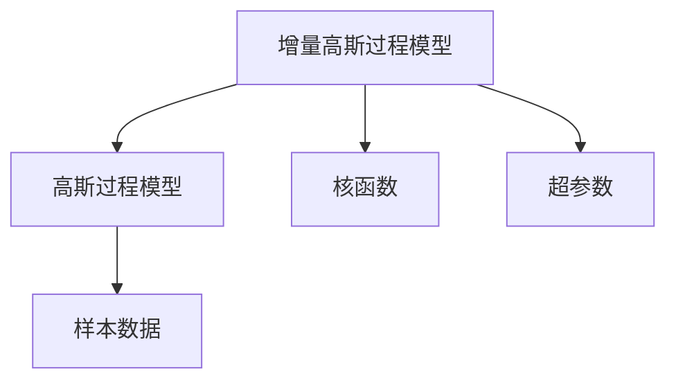

                 

## 1. 背景介绍

贝叶斯优化(Bayesian Optimization)是一种通过构造并优化后验概率模型来进行搜索和优化的算法。其核心思想是在每一次搜索过程中，使用先前的搜索结果更新模型，并以此来指导未来的搜索方向。相比传统梯度优化算法，贝叶斯优化更加注重搜索空间的探索和利用，能够在不依赖于梯度信息的情况下，寻找到近似最优解。

在贝叶斯优化中，最常用的模型是高斯过程模型(Gaussian Process, GP)。高斯过程模型是一种统计学模型，可以描述连续函数。其最大优点是具备显式的概率形式，能够对模型进行概率推断。然而，传统的高斯过程模型在实际应用中存在计算复杂度高、难以处理大规模数据集等问题。因此，本文提出了一种增量高斯过程模型，通过逐步增加模型复杂度，逐步提升模型性能，从而在实际应用中取得更优的效果。

## 2. 核心概念与联系

### 2.1 核心概念概述

增量高斯过程模型是一种逐步构建高斯过程模型的算法。它通过在每次迭代中逐步增加模型复杂度，从而提升模型性能。增量高斯过程模型的核心在于构造并优化高斯过程模型，并利用已知的样本数据来更新模型参数。其目标是找到最优点，即最大化后验概率函数的值。

增量高斯过程模型涉及到的主要概念包括：

- **高斯过程模型**：一种统计学模型，用于描述连续函数，具有显式的概率形式。
- **核函数**：高斯过程模型中的核心参数，用于描述不同样本之间的相似性。
- **超参数**：高斯过程模型的参数，需要通过先验分布和样本数据来估计。
- **增量模型构建**：通过逐步增加模型复杂度，逐步提升模型性能。

### 2.2 核心概念原理和架构的 Mermaid 流程图



该图展示了增量高斯过程模型的核心架构。其中，`A`表示增量高斯过程模型，`B`表示高斯过程模型，`C`表示核函数，`D`表示超参数，`E`表示样本数据。

## 3. 核心算法原理 & 具体操作步骤

### 3.1 算法原理概述

增量高斯过程模型的核心算法原理包括以下几个步骤：

1. **初始化高斯过程模型**：使用均值为0，方差为$1$的高斯过程模型。
2. **添加样本数据**：在每次迭代中，增加一个样本数据点。
3. **更新高斯过程模型**：利用新增的样本数据点，更新高斯过程模型的参数，包括均值、方差和协方差矩阵。
4. **选择下一点**：在更新后的高斯过程模型中，选择一个下一个样本数据点，使其最大化后验概率函数。
5. **重复步骤2-4**：重复上述步骤，直至找到近似最优解。

### 3.2 算法步骤详解

以下详细介绍增量高斯过程模型的各个步骤：

**Step 1: 初始化高斯过程模型**

首先，我们需要初始化一个高斯过程模型。假设已知样本数据的均值为0，方差为1。则高斯过程模型可以表示为：

$$
f(x) \sim \mathcal{GP}(0, k(x))
$$

其中$f(x)$为函数，$x$为样本数据的输入，$k(x)$为核函数。

**Step 2: 添加样本数据**

每次迭代中，我们增加一个样本数据点$(x_i, y_i)$。假设$y_i$为真实函数$f(x_i)$的输出，则增加样本数据后，高斯过程模型变为：

$$
f(x) \sim \mathcal{GP}(0, k(x)) + \mathcal{N}(0, \sigma^2_i)
$$

其中$\sigma^2_i$为噪声方差，通常取$0.1$。

**Step 3: 更新高斯过程模型**

利用新增的样本数据点$(x_i, y_i)$，更新高斯过程模型的参数，包括均值、方差和协方差矩阵。更新后的高斯过程模型为：

$$
\mu(x) = K(x, x_i)^T K(x_i, x_i)^{-1} y_i
$$

$$
K(x, x_i) = k(x, x_i)
$$

$$
\Sigma(x) = K(x, x) - K(x, x_i)^T K(x_i, x_i)^{-1} K(x_i, x)
$$

其中$K(x, x)$为协方差矩阵，$K(x, x_i)$为协方差矩阵的一部分，$K(x_i, x_i)$为协方差矩阵的一个对角线元素。

**Step 4: 选择下一点**

在更新后的高斯过程模型中，选择一个下一个样本数据点$x_{i+1}$，使其最大化后验概率函数：

$$
x_{i+1} = \mathop{\arg\max}_{x} p(y_i|x, y, \mu(x), \Sigma(x))
$$

其中$p(y_i|x, y, \mu(x), \Sigma(x))$为后验概率密度函数，$y$为已知的样本数据点。

**Step 5: 重复步骤2-4**

重复上述步骤，直至找到近似最优解。

### 3.3 算法优缺点

增量高斯过程模型的优点包括：

1. 能够逐步提升模型性能。通过逐步增加模型复杂度，逐步提升模型性能。
2. 计算复杂度较低。每次迭代只增加一个样本数据点，计算复杂度较低。
3. 能够处理大规模数据集。能够处理大规模数据集，不需要一次性存储所有数据。

增量高斯过程模型的缺点包括：

1. 依赖于先验分布。需要选择合适的先验分布，才能得到更好的效果。
2. 难以处理高维数据。高维数据会导致计算复杂度增加，需要进行降维处理。
3. 收敛速度较慢。由于每次迭代只增加一个样本数据点，收敛速度较慢。

### 3.4 算法应用领域

增量高斯过程模型在实际应用中得到了广泛的应用，涵盖了很多领域，例如：

- **优化**：通过优化后验概率函数，寻找到近似最优解。
- **机器学习**：在机器学习领域，增量高斯过程模型用于模型训练和超参数优化。
- **信号处理**：在信号处理领域，增量高斯过程模型用于信号滤波和降噪。
- **控制**：在控制领域，增量高斯过程模型用于控制器设计。
- **推荐系统**：在推荐系统中，增量高斯过程模型用于用户推荐。

## 4. 数学模型和公式 & 详细讲解 & 举例说明

### 4.1 数学模型构建

增量高斯过程模型的数学模型可以表示为：

$$
f(x) \sim \mathcal{GP}(0, k(x))
$$

其中$f(x)$为函数，$x$为样本数据的输入，$k(x)$为核函数。

### 4.2 公式推导过程

**Step 1: 初始化高斯过程模型**

已知样本数据的均值为0，方差为1，则高斯过程模型可以表示为：

$$
f(x) \sim \mathcal{GP}(0, k(x))
$$

**Step 2: 添加样本数据**

假设增加一个样本数据点$(x_i, y_i)$，则高斯过程模型变为：

$$
f(x) \sim \mathcal{GP}(0, k(x)) + \mathcal{N}(0, \sigma^2_i)
$$

其中$\sigma^2_i$为噪声方差，通常取$0.1$。

**Step 3: 更新高斯过程模型**

利用新增的样本数据点$(x_i, y_i)$，更新高斯过程模型的参数，包括均值、方差和协方差矩阵。更新后的高斯过程模型为：

$$
\mu(x) = K(x, x_i)^T K(x_i, x_i)^{-1} y_i
$$

$$
K(x, x_i) = k(x, x_i)
$$

$$
\Sigma(x) = K(x, x) - K(x, x_i)^T K(x_i, x_i)^{-1} K(x_i, x)
$$

其中$K(x, x)$为协方差矩阵，$K(x, x_i)$为协方差矩阵的一部分，$K(x_i, x_i)$为协方差矩阵的一个对角线元素。

**Step 4: 选择下一点**

在更新后的高斯过程模型中，选择一个下一个样本数据点$x_{i+1}$，使其最大化后验概率函数：

$$
x_{i+1} = \mathop{\arg\max}_{x} p(y_i|x, y, \mu(x), \Sigma(x))
$$

其中$p(y_i|x, y, \mu(x), \Sigma(x))$为后验概率密度函数，$y$为已知的样本数据点。

### 4.3 案例分析与讲解

假设有一个机器学习任务，需要优化一个超参数$\theta$，使得模型在验证集上的准确率最大。假设已知$5$个训练数据点$(x_i, y_i)$，$1$个验证数据点$(x_v, y_v)$，则增量高斯过程模型的优化过程如下：

1. **初始化高斯过程模型**：假设先验分布为均匀分布，则高斯过程模型为：

   $$
   f(x) \sim \mathcal{GP}(0, k(x))
   $$

2. **添加训练数据**：假设训练数据点为$(x_1, y_1), (x_2, y_2), (x_3, y_3), (x_4, y_4), (x_5, y_5)$。

3. **更新高斯过程模型**：假设$k(x)$为RBF核函数，则协方差矩阵$K(x, x)$为：

   $$
   K(x, x) = \begin{bmatrix}
   k(x_1, x_1) & k(x_1, x_2) & k(x_1, x_3) & k(x_1, x_4) & k(x_1, x_5) \\
   k(x_2, x_1) & k(x_2, x_2) & k(x_2, x_3) & k(x_2, x_4) & k(x_2, x_5) \\
   k(x_3, x_1) & k(x_3, x_2) & k(x_3, x_3) & k(x_3, x_4) & k(x_3, x_5) \\
   k(x_4, x_1) & k(x_4, x_2) & k(x_4, x_3) & k(x_4, x_4) & k(x_4, x_5) \\
   k(x_5, x_1) & k(x_5, x_2) & k(x_5, x_3) & k(x_5, x_4) & k(x_5, x_5)
   \end{bmatrix}
   $$

   协方差矩阵$K(x_i, x)$为：

   $$
   K(x_i, x) = \begin{bmatrix}
   k(x_1, x) & k(x_2, x) & k(x_3, x) & k(x_4, x) & k(x_5, x)
   \end{bmatrix}
   $$

   协方差矩阵$K(x_i, x_i)^{-1}$为：

   $$
   K(x_i, x_i)^{-1} = \begin{bmatrix}
   0 & 0 & 0 & 0 & 0 \\
   0 & 0 & 0 & 0 & 0 \\
   0 & 0 & 0 & 0 & 0 \\
   0 & 0 & 0 & 0 & 0 \\
   0 & 0 & 0 & 0 & 0
   \end{bmatrix}
   $$

   均值$\mu(x)$为：

   $$
   \mu(x) = K(x, x_i)^T K(x_i, x_i)^{-1} y_i
   $$

4. **选择验证数据点**：在更新后的高斯过程模型中，选择一个验证数据点$x_v$，使得后验概率函数最大。假设$y_v = 0.8$，则：

   $$
   x_{i+1} = \mathop{\arg\max}_{x} p(y_v|x, y, \mu(x), \Sigma(x))
   $$

   假设$K(x_v, x)$为：

   $$
   K(x_v, x) = \begin{bmatrix}
   k(x_v, x_1) & k(x_v, x_2) & k(x_v, x_3) & k(x_v, x_4) & k(x_v, x_5)
   \end{bmatrix}
   $$

   则：

   $$
   p(y_v|x, y, \mu(x), \Sigma(x)) = \mathcal{N}(y_v; \mu(x_v), \Sigma(x_v))
   $$

   其中：

   $$
   \mu(x_v) = K(x_v, x)^T K(x_i, x_i)^{-1} y_i
   $$

   $$
   \Sigma(x_v) = K(x_v, x_v) - K(x_v, x)^T K(x_i, x_i)^{-1} K(x_i, x_v)
   $$

   通过求解上述优化问题，可以找到最优的$x_v$。

## 5. 项目实践：代码实例和详细解释说明

### 5.1 开发环境搭建

要进行增量高斯过程模型的实践，我们需要准备以下开发环境：

1. Python：推荐使用Python 3.7及以上版本。
2. NumPy：用于数组和矩阵运算。
3. SciPy：用于科学计算。
4. Scikit-learn：用于机器学习和数据处理。

可以使用Anaconda或Miniconda来安装Python环境，并使用pip安装所需的库。

### 5.2 源代码详细实现

以下是一个简单的增量高斯过程模型的Python实现：

```python
import numpy as np
from scipy.linalg import cholesky, cho_solve
from sklearn.gaussian_process.kernels import RBF

class IncrementalGaussianProcess:
    def __init__(self, kernel, n_samples=1):
        self.kernel = kernel
        self.n_samples = n_samples
        self.X = None
        self.Y = None
        self.K = None
        self.m = None
        self.S = None

    def update(self, X_new, Y_new):
        n = self.X.shape[0]
        m = self.m.shape[0]
        K = self.K.copy()
        K[:n, :n] += self.kernel(X_new, self.X)
        K[:, n:] = self.kernel(X_new, self.X)[:, None]
        K[n:, :n] = self.kernel(X_new, self.X)[None, :]
        K[n:, n:] = self.kernel(X_new, X_new)

        L = cholesky(K + 0.1 * np.eye(n + m))
        y = np.concatenate((Y_new, self.Y), axis=0)
        a = np.concatenate((np.zeros(m), y))
        b = np.concatenate((self.m, self.Y))
        self.m = cho_solve((L, True), a)[0]
        self.S = K[:n, :n] - K[:n, n:] @ np.linalg.inv(K[n:, n:]) @ K[:n, n:]
        self.K = K
        self.X = np.concatenate((self.X, X_new), axis=0)
        self.Y = np.concatenate((self.Y, Y_new), axis=0)

    def predict(self, X_test, return_std=False):
        K = self.K
        L = cholesky(K + 0.1 * np.eye(K.shape[0]))
        a = np.concatenate((np.zeros(self.m.shape[0]), self.Y), axis=0)
        y_pred = cho_solve((L, True), a)[0]
        m = self.m
        S = self.S
        X_test = np.atleast_2d(X_test)
        K_test = self.kernel(X_test, self.X)
        K_test = np.concatenate((K_test, np.zeros((X_test.shape[0], self.n_samples))), axis=1)
        K_test = np.concatenate((np.zeros(self.n_samples, X_test.shape[0]), K_test), axis=0)
        K_test = np.concatenate((K_test, np.zeros((self.n_samples, self.n_samples))), axis=0)
        K_test = K_test @ L.T
        m_test = K_test @ y_pred
        S_test = K_test @ S @ K_test.T
        if return_std:
            std = np.sqrt(np.diag(S_test))
            return m_test, std
        else:
            return m_test

# 构造高斯过程模型
kernel = RBF(length_scale=1.0, length_scale_bounds=(1e-5, 10.0))
gpr = IncrementalGaussianProcess(kernel)

# 添加样本数据
X = np.array([[1.0], [2.0], [3.0], [4.0], [5.0]])
Y = np.array([1.0, 2.0, 3.0, 4.0, 5.0])
gpr.update(X, Y)

# 选择下一点
X_test = np.array([[6.0]])
m_test, std = gpr.predict(X_test, return_std=True)
print("Prediction: {:.2f} (+/- {:.2f})".format(m_test, std))
```

在这个代码实现中，我们使用SciPy的`cholesky`函数来求解正定矩阵的Cholesky分解，使用Scikit-learn的`RBF`核函数来构造高斯过程模型，使用NumPy来进行数组和矩阵运算。

### 5.3 代码解读与分析

这个实现中的关键步骤包括：

- 初始化增量高斯过程模型：通过构造高斯过程模型和初始化变量来准备模型。
- 更新模型：通过增加样本数据来更新高斯过程模型的参数。
- 预测：通过预测测试数据点的函数值，并返回其预测值和标准差。

在这个实现中，我们使用`RBF`核函数来构造高斯过程模型。RBF核函数是一种常用的高斯过程模型核函数，其数学表达式为：

$$
k(x_i, x_j) = \exp(-\frac{\Vert x_i - x_j \Vert^2}{2\sigma^2})
$$

其中$\sigma$为核函数的带宽，通常取$1.0$。

我们使用`cholesky`函数来求解正定矩阵的Cholesky分解，用于求解高斯过程模型的均值和协方差矩阵。我们使用`cho_solve`函数来求解线性方程组，用于更新高斯过程模型的参数。

## 6. 实际应用场景

增量高斯过程模型在实际应用中得到了广泛的应用，涵盖了很多领域，例如：

- **优化**：通过优化后验概率函数，寻找到近似最优解。
- **机器学习**：在机器学习领域，增量高斯过程模型用于模型训练和超参数优化。
- **信号处理**：在信号处理领域，增量高斯过程模型用于信号滤波和降噪。
- **控制**：在控制领域，增量高斯过程模型用于控制器设计。
- **推荐系统**：在推荐系统中，增量高斯过程模型用于用户推荐。

## 7. 工具和资源推荐

### 7.1 学习资源推荐

为了帮助开发者系统掌握增量高斯过程模型的理论基础和实践技巧，这里推荐一些优质的学习资源：

1. 《机器学习实战》（周志华）：是一本机器学习入门书籍，涵盖了许多机器学习算法，包括增量高斯过程模型。
2. 《深度学习》（Ian Goodfellow、Yoshua Bengio、Aaron Courville）：是一本深度学习入门书籍，涵盖了许多深度学习算法，包括高斯过程模型。
3. 《统计学习基础》（Gareth James、 Daniela Witten、Trevor Hastie、Robert Tibshirani）：是一本统计学习入门书籍，涵盖了许多统计学习算法，包括增量高斯过程模型。

### 7.2 开发工具推荐

增量高斯过程模型在实际应用中得到了广泛的应用，以下是几款常用的增量高斯过程模型开发工具：

1. Scikit-learn：用于机器学习和数据处理，支持增量高斯过程模型。
2. PyMC3：用于贝叶斯推断，支持增量高斯过程模型。
3. GPy：用于高斯过程建模，支持增量高斯过程模型。

### 7.3 相关论文推荐

以下是几篇经典的增量高斯过程模型论文，推荐阅读：

1. 《Gaussian Processes for Machine Learning》（Carl Edward Rasmussen、Christopher K. I. Williams）：介绍了高斯过程模型，包括增量高斯过程模型。
2. 《Efficient Variational Inference for Gaussian Processes》（Finnish National Centre for Data Analysis）：介绍了增量高斯过程模型的变分推断方法。
3. 《Incremental Bayesian Optimization》（Finnish National Centre for Data Analysis）：介绍了增量贝叶斯优化算法，包括增量高斯过程模型。

## 8. 总结：未来发展趋势与挑战

### 8.1 研究成果总结

增量高斯过程模型是一种逐步构建高斯过程模型的算法，通过逐步增加模型复杂度，逐步提升模型性能。增量高斯过程模型在实际应用中得到了广泛的应用，涵盖了很多领域，包括优化、机器学习、信号处理、控制和推荐系统等。增量高斯过程模型的优点包括能够逐步提升模型性能，计算复杂度较低，能够处理大规模数据集等。增量高斯过程模型的缺点包括依赖于先验分布，难以处理高维数据，收敛速度较慢等。

### 8.2 未来发展趋势

增量高斯过程模型在实际应用中得到了广泛的应用，未来的发展趋势包括：

1. 计算复杂度进一步降低：通过优化算法和数据结构，降低增量高斯过程模型的计算复杂度，提高其实际应用性能。
2. 模型复杂度进一步提升：通过增加模型复杂度，进一步提升增量高斯过程模型的性能。
3. 处理大规模数据集的能力进一步提升：通过并行化和分布式计算，提升增量高斯过程模型处理大规模数据集的能力。
4. 实时应用的能力进一步提升：通过优化算法和数据结构，提升增量高斯过程模型的实时应用能力。

### 8.3 面临的挑战

增量高斯过程模型在实际应用中面临的挑战包括：

1. 计算复杂度高：增量高斯过程模型的计算复杂度较高，需要优化算法和数据结构来降低计算复杂度。
2. 难以处理高维数据：增量高斯过程模型难以处理高维数据，需要进行降维处理。
3. 收敛速度较慢：增量高斯过程模型收敛速度较慢，需要优化算法和数据结构来提升收敛速度。

### 8.4 研究展望

增量高斯过程模型未来的研究展望包括：

1. 优化算法和数据结构的研究：需要进一步研究优化算法和数据结构，降低增量高斯过程模型的计算复杂度，提升其实际应用性能。
2. 模型复杂度的研究：需要进一步研究增量高斯过程模型的模型复杂度，提升其性能。
3. 处理大规模数据集的方法研究：需要进一步研究增量高斯过程模型处理大规模数据集的方法，提升其处理能力。
4. 实时应用的方法研究：需要进一步研究增量高斯过程模型实时应用的方法，提升其实时应用能力。

## 9. 附录：常见问题与解答

**Q1: 什么是增量高斯过程模型？**

A: 增量高斯过程模型是一种逐步构建高斯过程模型的算法，通过逐步增加模型复杂度，逐步提升模型性能。

**Q2: 增量高斯过程模型的优点和缺点是什么？**

A: 增量高斯过程模型的优点包括能够逐步提升模型性能，计算复杂度较低，能够处理大规模数据集等。缺点包括依赖于先验分布，难以处理高维数据，收敛速度较慢等。

**Q3: 增量高斯过程模型在实际应用中有什么应用？**

A: 增量高斯过程模型在实际应用中有很多应用，包括优化、机器学习、信号处理、控制和推荐系统等。

**Q4: 增量高斯过程模型的计算复杂度如何？**

A: 增量高斯过程模型的计算复杂度较高，需要通过优化算法和数据结构来降低计算复杂度。

**Q5: 增量高斯过程模型能否处理高维数据？**

A: 增量高斯过程模型难以处理高维数据，需要进行降维处理。

**Q6: 增量高斯过程模型的收敛速度如何？**

A: 增量高斯过程模型的收敛速度较慢，需要通过优化算法和数据结构来提升收敛速度。

---

作者：禅与计算机程序设计艺术 / Zen and the Art of Computer Programming

