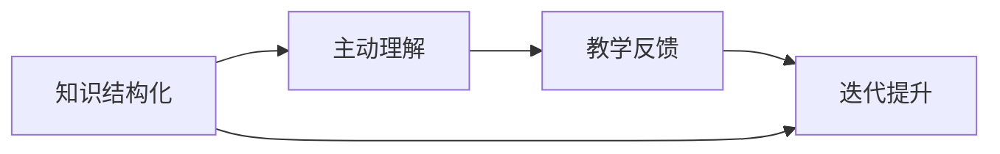

                 

# 费曼提问法促进团队学习与成长

## 1. 背景介绍

在快速发展的技术世界中，个人学习已不再是企业竞争的关键因素。今天的竞争越来越集中在团队合作、集体创新能力以及团队知识共享和传播的有效性上。费曼提问法，一种以科学家理查德·费曼（Richard Feynman）命名的学习方法，是促进团队学习和成长的有效工具。通过精准、深入的问题提问，费曼提问法能够帮助团队成员更全面、深入地理解复杂概念，促进知识交流，提升团队整体的知识水平和协作效率。本文将深入探讨费曼提问法的基本原理、核心步骤以及实际应用场景，以期为团队学习和成长提供可行的实践路径。

## 2. 核心概念与联系

### 2.1 核心概念概述

费曼提问法是一种基于以教为学原则的学习方法，核心思想是通过教学过程中的问题设计，促进学习者对知识的深度理解与掌握。它强调通过将复杂概念拆解为易于理解的小问题，并以生动的形式展示出来，以帮助学习者构建清晰的知识结构，并检验自己的理解深度。

费曼提问法的基本组成部分包括：
1. **知识结构化**：将复杂概念拆解为简单、明确的问题，帮助学习者构建知识框架。
2. **主动理解**：通过回答这些问题，促使学习者主动思考，深化理解。
3. **教学反馈**：通过向他人解释自己的理解，检验和修正知识盲点。
4. **迭代提升**：不断迭代提问和解释的过程，持续提升理解深度。

这些核心概念相互关联，形成了一个循环的学习过程，不仅促进了个人的知识掌握，还通过教学反馈机制促进了团队间的知识共享与协作。

### 2.2 核心概念原理和架构的 Mermaid 流程图



这个流程图展示了费曼提问法的核心步骤：首先，通过知识结构化将复杂概念拆解为简单问题，然后学习者通过主动理解回答问题，接着通过教学反馈验证自己的理解，最后通过迭代提升进一步深化理解。这一过程不仅促进了个人的学习，也增强了团队的整体知识水平。

## 3. 核心算法原理 & 具体操作步骤

### 3.1 算法原理概述

费曼提问法的基本原理基于“以教为学”的概念，即通过向他人解释和教授概念，加深自己对该概念的理解。这种方法将学习的重点从被动接受转移到主动探究，通过不断的提问和回答，帮助学习者将抽象概念具体化，并将复杂的知识体系拆解为易于理解的单元。

费曼提问法的主要操作步骤包括：
1. **选择学习目标**：明确学习的具体内容与目标。
2. **构建问题链**：将学习目标拆解为一系列详细、具体的问题。
3. **主动回答**：针对构建的问题链，深入思考并主动回答。
4. **教学反馈**：向他人解释自己的回答，并接受反馈。
5. **迭代深化**：根据反馈不断迭代和调整回答，深化理解。

### 3.2 算法步骤详解

以下是费曼提问法的详细步骤：

**Step 1: 选择学习目标**
- 明确学习的具体内容，如某个复杂的算法原理、新的编程语言特性、新的技术栈等。

**Step 2: 构建问题链**
- 将学习目标拆解为多个具体问题。问题应尽量具体、详细，以便于逐一解答。例如，学习函数式编程时，可以将问题链构建为“函数式编程的基本概念是什么？”、“什么是高阶函数？”、“函数式编程与命令式编程的区别是什么？”等。

**Step 3: 主动回答**
- 针对构建的问题链，逐一思考并给出回答。这一过程要求学习者不仅掌握问题的答案，还要能够深入解释背后的原理。例如，对于“什么是高阶函数？”这一问题，学习者不仅要回答“高阶函数是可以接收函数作为参数或返回函数作为结果的函数”，还要解释其背后的设计理念和实际应用场景。

**Step 4: 教学反馈**
- 向他人（如同事、朋友、导师等）解释自己的回答，并接受反馈。这一过程不仅检验了自己的理解深度，还可以通过他人的不同视角进一步深化理解。

**Step 5: 迭代深化**
- 根据反馈不断调整和完善回答。这一步骤要求学习者对反馈意见进行反思，识别知识盲点和误区，并据此进行进一步学习和调整。例如，如果反馈指出解释不够清晰，学习者应进一步查阅资料或与他人讨论，以确保自己的回答准确无误。

### 3.3 算法优缺点

**优点：**
1. **深度理解**：通过详细的问题设计，促进学习者对知识的深度理解与掌握。
2. **知识传播**：通过教学反馈机制，促进团队成员之间的知识共享与传播，提升团队整体知识水平。
3. **自我验证**：通过向他人解释和教授，帮助学习者检验和修正自己的理解，提升学习效率。
4. **灵活适应**：适用于各种复杂概念和知识体系的学习，适用于不同的学习场景和目标。

**缺点：**
1. **时间成本高**：详细构建和解答问题链可能需要较长时间，尤其在处理复杂问题时。
2. **需要他人参与**：教学反馈环节依赖他人的参与和反馈，若他人无法提供有价值的反馈，效果可能受限。
3. **依赖问题设计**：问题的设计质量和深度直接影响学习效果，需要设计者具备较高的专业知识和思考能力。

### 3.4 算法应用领域

费曼提问法不仅适用于个人学习，在团队学习和知识管理中也有广泛应用。例如：

- **团队项目讨论**：在团队项目讨论中，使用费曼提问法可以促进团队成员深入理解项目需求和技术细节，提升项目讨论效率和质量。
- **知识分享会**：在知识分享会上，通过使用费曼提问法，知识分享者可以更加深入地讲解和探讨某个知识点，促进听众的深刻理解和吸收。
- **技术培训和指导**：在技术培训和指导过程中，通过设计详细的问题链，教师可以帮助学员更深入地理解复杂的算法和概念。
- **问题解答和诊断**：在技术支持和问题诊断过程中，通过使用费曼提问法，可以更精准地定位问题根源，提供有效的解决方案。

## 4. 数学模型和公式 & 详细讲解 & 举例说明

### 4.1 数学模型构建

费曼提问法的数学模型主要通过构建问题链和教学反馈来实现知识的深度理解和共享。问题链的设计和解答过程可以通过以下数学模型来描述：

**问题链设计：**
- **问题链结构**：问题链由多个有序问题组成，每个问题有明确的答案和解释。例如，问题链结构可以表示为：
  $$
  \begin{aligned}
  &Q_1: 什么是高阶函数？ \\
  &Q_2: 高阶函数的特点是什么？ \\
  &Q_3: 高阶函数与普通函数的区别是什么？
  \end{aligned}
  $$
- **问题之间的关系**：问题之间存在递进关系，前一个问题往往是后一个问题的基础。例如，$Q_2$的答案是$Q_1$的解释，$Q_3$的答案是$Q_2$的解释。

**教学反馈：**
- **反馈模型**：教学反馈模型通常包括两部分：一是学习者对问题的回答，二是反馈者（如同事、朋友、导师等）的反馈意见。例如，反馈模型可以表示为：
  $$
  \begin{aligned}
  &L_1 = \text{回答}(Q_1) \\
  &F_1 = \text{反馈}(L_1)
  \end{aligned}
  $$
- **反馈评估**：反馈评估模型用于评估反馈意见的质量，例如：
  $$
  \begin{aligned}
  &E = \text{评估}(F_1)
  \end{aligned}
  $$

### 4.2 公式推导过程

**问题链设计公式：**
- **问题链长度**：$N$表示问题链的长度，即问题的总数。
- **问题链关系**：$R_{ij}$表示问题链中第$i$个问题与第$j$个问题之间的关系。例如，$R_{ij}=1$表示$Q_i$是$Q_j$的前置问题。

**教学反馈公式：**
- **反馈评分**：$S_{k}=\sum_{l=1}^{n}F_{l}$表示学习者对$k$个问题的回答的平均反馈评分，其中$n$表示问题总数。
- **反馈权重**：$W_{k}$表示问题$k$在反馈模型中的权重，通常与问题的难度和重要性有关。
- **反馈调整**：$\Delta S_{k}=S_{k}-\frac{1}{n}S$表示调整后的反馈评分，其中$S$表示所有问题的平均反馈评分。

### 4.3 案例分析与讲解

**案例：理解Kubernetes中的Pod生命周期**

- **问题链设计**：
  1. Kubernetes中的Pod生命周期包括哪些阶段？
  2. Pod生命周期中每个阶段的特点是什么？
  3. Pod的生命周期对应用管理有什么影响？
  
- **主动回答**：
  1. Kubernetes中的Pod生命周期包括Pending、Running、Succeeded、Failed四个阶段。
  2. Pending阶段表示Pod正在创建中，Running阶段表示Pod已经成功启动并运行，Succeeded阶段表示Pod正常退出，Failed阶段表示Pod异常退出。
  3. Pod的生命周期对应用管理有重要影响，例如在应用启动时，Pod状态可以帮助监控和管理应用的生命周期。

- **教学反馈**：
  1. 反馈者可以针对回答的准确性和完整性给出反馈，例如指出Pod生命周期的所有阶段。
  2. 反馈者可以提出新的问题，例如“Pod的生命周期状态如何影响应用的可扩展性？”。

- **迭代深化**：
  1. 学习者根据反馈意见调整回答，确保回答的准确性和完整性。
  2. 学习者深入研究Pod生命周期对应用扩展性的影响，并更新回答。

## 5. 项目实践：代码实例和详细解释说明

### 5.1 开发环境搭建

费曼提问法主要用于知识学习和传播，不涉及复杂的代码实现。但在知识管理和协作平台中，可以使用代码进行辅助和自动化。例如，可以使用GitHub Issues来记录和追踪问题链，并使用PRs来进行教学反馈和迭代调整。

以下是使用GitHub Issues进行费曼提问法的示例：

1. 创建项目仓库。
2. 在Issues中创建问题链。例如，创建一个Kubernetes Pod生命周期的问题链。
3. 通过PRs进行教学反馈和迭代调整。例如，一个团队成员在PR中提出了一个新的问题，另一个成员通过评论和PRs进行回答和反馈。

### 5.2 源代码详细实现

由于费曼提问法主要用于知识管理和传播，不涉及复杂的代码实现。以下是使用GitHub Issues进行费曼提问法的示例代码：

```python
# 创建项目仓库
import git
repo = git.Repo.clone_from('https://github.com/yourusername/your-repo.git', 'path/to/your/repo')

# 在Issues中创建问题链
repo.issues.create(title="Kubernetes Pod生命周期")
repo.issues.create(title="Pod生命周期中的阶段")
repo.issues.create(title="Pod生命周期对应用管理的影响")

# 通过PRs进行教学反馈和迭代调整
pr = repo.pull_request(title="Pod生命周期问题链解答", body="回答Kubernetes Pod生命周期问题链")
pr.add_to_reviewers('colleagues-username')
pr.add_assignees('colleagues-username')

# 在评论中提出新的问题
issue = repo.issues.get(1)
issue.add_comment("新的问题：Pod生命周期对应用扩展性的影响是什么？")
```

### 5.3 代码解读与分析

通过GitHub Issues进行费曼提问法的示例代码展示了如何使用GitHub Issues记录和追踪问题链，并通过PRs进行教学反馈和迭代调整。这些步骤清晰展示了费曼提问法的实施过程，包括问题链的创建、教学反馈和迭代调整。

## 6. 实际应用场景

### 6.1 智能客服系统

在智能客服系统中，费曼提问法可以用于客户服务代表的知识培训和技能提升。通过构建详细的问题链，客服代表可以深入理解常见问题及其解决方案，提升服务质量。

例如，智能客服系统可以构建一个常见问题解答的问题链，客服代表可以通过回答问题来检验和巩固自己的知识，并从同事和客户的反馈中进一步深化理解。

### 6.2 产品设计与开发

在产品设计和开发过程中，费曼提问法可以帮助团队深入理解产品需求和技术细节，提升设计和开发的精度和效率。

例如，产品团队可以构建一个产品需求分析的问题链，设计师和开发者通过回答问题来确保对产品需求和功能理解的一致性，并通过同事和用户的反馈进行迭代和优化。

### 6.3 项目管理

在项目管理中，费曼提问法可以用于任务分解和进度跟踪。通过构建详细的问题链，项目经理可以深入理解任务细节和关键点，并确保团队成员对任务的理解一致。

例如，项目经理可以构建一个项目任务分解的问题链，团队成员通过回答问题来确认任务的细节和优先级，并通过同事和领导的反馈进行迭代和调整。

## 7. 工具和资源推荐

### 7.1 学习资源推荐

1. **《费曼学习法》书籍**：书籍详细介绍了费曼提问法的理论基础和实践方法，适合初学者阅读。
2. **Coursera《学习科学基础》课程**：课程介绍了费曼学习法的原理和应用，适合希望系统学习费曼提问法的学习者。
3. **Khan Academy视频**：Khan Academy提供了一系列关于费曼学习法的教学视频，适合视觉学习者。

### 7.2 开发工具推荐

1. **GitHub Issues**：用于记录和追踪问题链，支持PRs进行教学反馈和迭代调整。
2. **Trello**：用于管理问题和任务，支持团队协作和进度跟踪。
3. **Slack**：用于团队沟通和知识共享，支持创建专门的频道和话题。

### 7.3 相关论文推荐

1. **《以教为学的学习法》论文**：详细介绍了费曼提问法的原理和实践方法，适合学术研究人员阅读。
2. **《使用问题链促进学习》论文**：讨论了问题链在教育中的有效性和应用，适合教育领域研究人员阅读。

## 8. 总结：未来发展趋势与挑战

### 8.1 研究成果总结

费曼提问法作为一种高效的学习和知识共享方法，已经在多个领域展示了其强大的应用潜力。它通过详细的问题设计，促进了团队成员的深度理解和知识传播，提升了团队整体的知识水平和协作效率。

### 8.2 未来发展趋势

1. **自动化和智能化**：随着技术的发展，费曼提问法有望实现自动化和智能化，通过AI技术自动生成和推荐问题链，提升学习效率。
2. **多模态学习**：结合图像、视频等多模态数据，拓展费曼提问法的应用场景，提升学习效果。
3. **跨领域应用**：费曼提问法可以应用于更多领域，如医学、法律、工程等，提升跨领域知识共享和传播的效率。

### 8.3 面临的挑战

1. **问题设计质量**：问题链的设计质量直接影响学习效果，需要设计者具备较高的专业知识和思考能力。
2. **反馈质量**：教学反馈的质量直接影响学习效果，需要反馈者具备较高的专业知识和沟通能力。
3. **学习效率**：详细的问题链设计需要较长时间，尤其在处理复杂问题时，影响学习效率。

### 8.4 研究展望

未来的研究可以从以下几个方向展开：
1. **问题链自动化生成**：结合AI技术，自动生成高质量的问题链，提升学习效率。
2. **反馈系统优化**：构建高效的反馈系统，提升反馈质量和学习效果。
3. **多模态学习扩展**：结合图像、视频等多模态数据，拓展费曼提问法的应用场景。
4. **跨领域应用探索**：将费曼提问法应用于更多领域，提升跨领域知识共享和传播的效率。

总之，费曼提问法作为一种高效的学习和知识共享方法，通过详细的问题设计和教学反馈机制，促进了团队成员的深度理解和知识传播，提升了团队整体的知识水平和协作效率。未来，随着技术的进步和应用场景的扩展，费曼提问法将发挥更大的作用，为团队学习和成长提供更强大的支持。

## 9. 附录：常见问题与解答

**Q1: 费曼提问法为什么能够促进深度理解？**

A: 费曼提问法通过详细的问题设计和教学反馈机制，促使学习者将抽象概念具体化，并将复杂的知识体系拆解为易于理解的单元。这不仅帮助学习者构建清晰的知识结构，还通过不断的提问和回答，加深了对概念的理解和掌握。

**Q2: 费曼提问法适用于哪些学习场景？**

A: 费曼提问法适用于各种复杂概念和知识体系的学习，尤其适合团队学习和知识共享场景。例如，技术培训、项目讨论、知识分享会等。

**Q3: 费曼提问法如何使用？**

A: 使用费曼提问法，首先明确学习的具体内容，构建详细的问题链，并逐一回答。然后向他人解释回答，接受反馈，并根据反馈不断调整和完善回答。

---

作者：禅与计算机程序设计艺术 / Zen and the Art of Computer Programming

