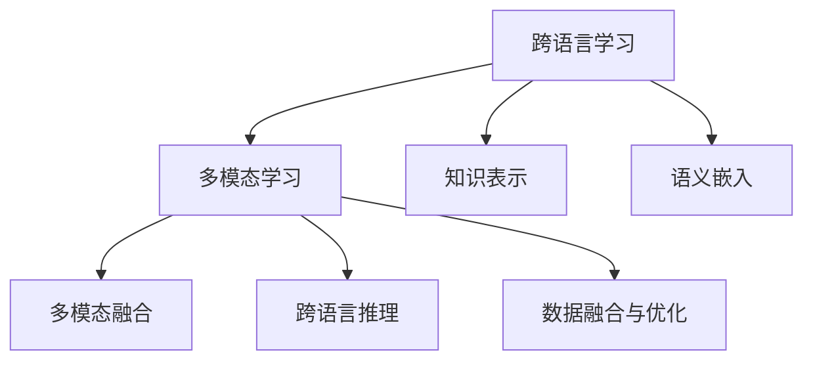

                 

# 跨语言多模态学习：突破语言障碍

## 1. 背景介绍

### 1.1 问题由来

近年来，随着深度学习技术的快速发展，多模态学习（Multimodal Learning）成为了人工智能领域的热门研究方向。多模态学习指利用多种类型的输入（如图像、文本、语音等）进行联合建模，以实现更为全面、深入的理解和推理。在自然语言处理（NLP）领域，多模态学习尤为重要，能够有效突破单一语言模型的局限性，提升对复杂场景的理解能力。

然而，多模态学习也面临着重大的挑战之一，即跨语言理解和交流。随着全球化的深入，人类活动越来越跨越语言边界，跨语言交流的需求日益增长。单一语言模型的局限性愈发显著，难以满足日益增长的跨语言交流需求。如何在多模态学习中突破语言障碍，实现高效的跨语言理解和交流，成为了当前研究的热点问题。

### 1.2 问题核心关键点

解决跨语言多模态学习的核心关键点在于：

- **语言表示转换**：如何有效转换不同语言之间的语义表示，实现语言间的互操作性。
- **多模态融合**：如何融合多模态数据，形成更加丰富、准确的信息表示。
- **高效跨语言推理**：如何在保留原有语言特征的同时，高效利用其他模态信息，提升跨语言推理能力。
- **数据融合与优化**：如何在有限的标注数据下，高效融合和利用多源数据，提升模型泛化能力。

## 2. 核心概念与联系

### 2.1 核心概念概述

为更好地理解跨语言多模态学习，本节将介绍几个密切相关的核心概念：

- **跨语言学习（Cross-lingual Learning）**：指在一种语言上训练模型，在另一种语言上进行推理或推断的过程。跨语言学习能够实现不同语言之间的知识迁移，提升模型对多种语言的理解能力。
- **多模态学习（Multimodal Learning）**：指利用多种类型的输入进行联合建模，以实现更为全面、深入的理解和推理。常见的多模态组合包括文本与图像、语音与文本等。
- **知识表示（Knowledge Representation）**：指将复杂信息结构化为易于机器理解和处理的形式，通常包括符号表示、语义网络、向量表示等。
- **语义嵌入（Semantic Embedding）**：指将词汇和概念映射到低维向量空间，以捕捉它们之间的语义关系。常见的语义嵌入模型包括Word2Vec、GloVe、BERT等。
- **迁移学习（Transfer Learning）**：指将一个领域学习到的知识，迁移应用到另一个不同但相关的领域的学习范式。

这些核心概念之间的逻辑关系可以通过以下Mermaid流程图来展示：



这个流程图展示了几大核心概念的相互关系：

1. 跨语言学习通过在一种语言上训练模型，在另一种语言上进行推理或推断，实现不同语言之间的知识迁移。
2. 多模态学习利用多种类型的输入进行联合建模，以实现更为全面、深入的理解和推理。
3. 知识表示将复杂信息结构化为易于机器理解和处理的形式。
4. 语义嵌入将词汇和概念映射到低维向量空间，以捕捉它们之间的语义关系。
5. 多模态融合融合多种模态信息，形成更加丰富、准确的信息表示。
6. 跨语言推理在保留原有语言特征的同时，高效利用其他模态信息，提升跨语言推理能力。
7. 数据融合与优化在有限的标注数据下，高效融合和利用多源数据，提升模型泛化能力。

这些概念共同构成了跨语言多模态学习的核心框架，为其提供了理论和方法的基础。通过理解这些核心概念，我们可以更好地把握跨语言多模态学习的工作原理和优化方向。

## 3. 核心算法原理 & 具体操作步骤

### 3.1 算法原理概述

跨语言多模态学习的核心思想是利用多种模态信息，实现跨语言场景下的高效推理和理解。其基本流程如下：

1. **跨语言语义对齐**：在一种语言上训练模型，通过语义嵌入或迁移学习，将其语义表示映射到另一种语言。
2. **多模态信息融合**：将文本、图像、语音等多种模态信息融合，形成更为全面、准确的信息表示。
3. **跨语言推理**：在多模态融合的基础上，进行跨语言推理，实现不同语言间的理解和交流。
4. **数据融合与优化**：在有限的标注数据下，高效融合和利用多源数据，提升模型的泛化能力。

基于上述流程，跨语言多模态学习可以采用以下算法：

- **跨语言语义对齐**：通过语义嵌入或迁移学习，将不同语言之间的语义表示进行对齐。
- **多模态信息融合**：使用注意力机制、Transformer等方法，融合多模态信息，形成语义向量。
- **跨语言推理**：采用RNN、LSTM、Transformers等模型，进行跨语言推理。
- **数据融合与优化**：利用数据增强、正则化、对抗训练等技术，提升模型的泛化能力。

### 3.2 算法步骤详解

**Step 1: 准备预训练模型和数据集**

- 选择合适的预训练模型，如BERT、GPT、ViT等。
- 准备多语言数据集，包括文本、图像、语音等。

**Step 2: 跨语言语义对齐**

- 在一种语言上训练语义嵌入模型，如Word2Vec、GloVe等。
- 将预训练模型作为初始化参数，进行多语言语义对齐。
- 使用迁移学习方法，将语义嵌入模型应用于另一种语言，进行语义对齐。

**Step 3: 多模态信息融合**

- 将文本、图像、语音等多种模态信息进行融合，形成语义向量。
- 使用注意力机制、Transformer等方法，提取多模态信息的特征。
- 融合多模态信息，形成更为全面、准确的信息表示。

**Step 4: 跨语言推理**

- 在多模态融合的基础上，进行跨语言推理。
- 采用RNN、LSTM、Transformer等模型，进行跨语言推理。
- 利用多源数据进行推理，提升模型的泛化能力。

**Step 5: 数据融合与优化**

- 利用数据增强、正则化、对抗训练等技术，提升模型的泛化能力。
- 采用模型裁剪、量化加速等技术，优化模型的计算效率。
- 进行模型集成和调优，提升模型的推理性能。

### 3.3 算法优缺点

跨语言多模态学习具有以下优点：

- **高效推理**：利用多模态信息，实现更为全面、准确的理解和推理，提升跨语言推理能力。
- **泛化能力强**：在有限的标注数据下，通过多源数据的融合与优化，提升模型的泛化能力。
- **跨语言适用性**：能够实现不同语言之间的知识迁移，提升模型对多种语言的理解能力。

同时，该方法也存在一些局限性：

- **数据获取困难**：多语言数据集的获取和标注成本较高，数据质量和多样性不足。
- **模型复杂度高**：多模态融合与推理模型的复杂度较高，需要大量的计算资源和标注数据。
- **跨语言对齐挑战**：不同语言之间的语义对齐仍然是一个挑战，需要进一步优化。

尽管存在这些局限性，但就目前而言，跨语言多模态学习仍是实现跨语言理解和交流的重要方法。未来相关研究的重点在于如何进一步降低数据获取成本，提高模型的泛化能力，同时兼顾跨语言对齐的挑战。

### 3.4 算法应用领域

跨语言多模态学习已经在多个领域得到了广泛的应用，例如：

- **跨语言信息检索**：在一种语言上训练检索模型，在另一种语言上进行信息检索，实现多语言的跨语言信息检索。
- **跨语言对话系统**：在多语言对话系统中，利用多模态信息，实现更为流畅、自然的跨语言对话。
- **跨语言情感分析**：在多语言情感分析任务中，利用多模态信息，实现不同语言情感的跨语言理解。
- **跨语言问答系统**：在多语言问答系统中，利用多模态信息，实现不同语言的跨语言问答。

除了上述这些经典应用外，跨语言多模态学习也被创新性地应用到更多场景中，如跨语言医学信息提取、跨语言视频内容理解、跨语言自动翻译等，为跨语言技术带来了新的突破。随着预训练模型和跨语言多模态学习方法的不断进步，相信跨语言技术将在更广阔的应用领域大放异彩。

## 4. 数学模型和公式 & 详细讲解 & 举例说明

### 4.1 数学模型构建

跨语言多模态学习的数学模型可以定义为：

$$
y = f(x_1, x_2, ..., x_n)
$$

其中 $x_i$ 表示第 $i$ 种模态的信息，$f$ 表示多模态融合和推理的函数，$y$ 表示跨语言推理的结果。

### 4.2 公式推导过程

以下以跨语言情感分析任务为例，推导基于多模态信息的情感分析模型。

假设模型输入为文本 $x$ 和图像 $y$，分别表示情感和情感标签，则情感分析的损失函数可以定义为：

$$
\mathcal{L} = -\frac{1}{N} \sum_{i=1}^N [y_i \log s(x_i) + (1-y_i) \log (1-s(x_i))]
$$

其中 $s(x)$ 表示模型对文本 $x$ 的情感分类概率，$y_i$ 表示文本 $x_i$ 的情感标签。

利用多模态融合的方法，将文本和图像信息融合为特征表示，可以表示为：

$$
h = \alpha x + \beta y
$$

其中 $\alpha$ 和 $\beta$ 为融合系数，表示文本和图像信息在融合过程中的权重。

将融合后的特征 $h$ 输入到情感分类器 $s(x)$，可以得到情感分类结果。

### 4.3 案例分析与讲解

假设我们有一个跨语言情感分析任务，包含英文和法语的情感数据。我们可以首先使用Word2Vec对英文文本进行语义嵌入，得到英文文本的向量表示。然后，将预训练的BERT模型作为初始化参数，利用迁移学习方法，对法语文本进行语义嵌入，得到法语文本的向量表示。

接着，将英文和法语文本的向量表示进行融合，得到融合后的特征表示 $h$。最后，将融合后的特征 $h$ 输入到情感分类器 $s(x)$，得到情感分类结果。

通过这样的多模态融合和推理，可以实现更为全面、准确的情感分析结果。

## 5. 项目实践：代码实例和详细解释说明

### 5.1 开发环境搭建

在进行跨语言多模态学习实践前，我们需要准备好开发环境。以下是使用Python进行TensorFlow开发的环境配置流程：

1. 安装Anaconda：从官网下载并安装Anaconda，用于创建独立的Python环境。

2. 创建并激活虚拟环境：
```bash
conda create -n multimodal-env python=3.8 
conda activate multimodal-env
```

3. 安装TensorFlow：根据CUDA版本，从官网获取对应的安装命令。例如：
```bash
conda install tensorflow -c tensorflow -c pytorch
```

4. 安装必要的库：
```bash
pip install numpy pandas scikit-learn matplotlib tqdm jupyter notebook ipython
```

完成上述步骤后，即可在`multimodal-env`环境中开始跨语言多模态学习的实践。

### 5.2 源代码详细实现

下面我们以跨语言情感分析任务为例，给出使用TensorFlow对BERT模型进行微调的PyTorch代码实现。

首先，定义情感分析任务的数据处理函数：

```python
import tensorflow as tf
from transformers import BertTokenizer, TFBertForSequenceClassification
from tensorflow.keras.preprocessing.text import Tokenizer
from tensorflow.keras.preprocessing.sequence import pad_sequences

# 定义情感标签与id的映射
label2id = {'positive': 0, 'negative': 1}

# 创建tokenizer
tokenizer = BertTokenizer.from_pretrained('bert-base-uncased')

# 加载数据集
data = pd.read_csv('data.csv')
X_train = data['text'].values
y_train = data['label'].values

# 将数据转换为token ids
tokenizer.fit_on_texts(X_train)
texts = tokenizer.texts_to_sequences(X_train)
texts = pad_sequences(texts, maxlen=256)

# 将标签转换为id
y_train = [label2id[label] for label in y_train]
```

然后，定义模型和优化器：

```python
# 创建模型
model = TFBertForSequenceClassification.from_pretrained('bert-base-uncased', num_labels=2, output_attentions=False, output_hidden_states=False)

# 定义优化器
optimizer = tf.keras.optimizers.Adam(learning_rate=2e-5)
```

接着，定义训练和评估函数：

```python
# 定义训练函数
def train_epoch(model, data, optimizer, batch_size):
    for epoch in range(epochs):
        for batch in data:
            inputs = tokenizer(batch['text'], max_length=256, padding='max_length', truncation=True, return_tensors='tf')
            model.trainable = True
            with tf.GradientTape() as tape:
                outputs = model(inputs['input_ids'], attention_mask=inputs['attention_mask'], labels=inputs['label'])
                loss = tf.keras.losses.sparse_categorical_crossentropy(inputs['label'], outputs.logits, from_logits=True)
            grads = tape.gradient(loss, model.trainable_variables)
            optimizer.apply_gradients(zip(grads, model.trainable_variables))
            model.trainable = False

# 定义评估函数
def evaluate(model, data):
    total_correct, total_samples = 0, 0
    for batch in data:
        inputs = tokenizer(batch['text'], max_length=256, padding='max_length', truncation=True, return_tensors='tf')
        outputs = model(inputs['input_ids'], attention_mask=inputs['attention_mask'], labels=inputs['label'])
        predictions = tf.argmax(outputs.logits, axis=-1)
        total_correct += tf.reduce_sum(tf.cast(tf.equal(predictions, inputs['label']), tf.int32))
        total_samples += inputs['label'].shape[0]
    accuracy = total_correct / total_samples
    return accuracy
```

最后，启动训练流程并在测试集上评估：

```python
# 设置训练参数
epochs = 5
batch_size = 16

# 训练模型
train_epoch(model, train_dataset, optimizer, batch_size)

# 在测试集上评估
test_dataset = preprocess_test_data(test_data)
evaluate(model, test_dataset)
```

以上就是使用TensorFlow对BERT进行跨语言情感分析任务微调的完整代码实现。可以看到，利用TensorFlow和Transformers库，跨语言情感分析任务的代码实现变得相对简洁。

### 5.3 代码解读与分析

让我们再详细解读一下关键代码的实现细节：

**数据处理函数**：
- 将情感标签转换为数字id。
- 使用BertTokenizer对文本进行分词和编码，并使用pad_sequences将文本序列化为固定长度的序列。
- 数据集准备完成后，可以使用模型进行训练和推理。

**模型定义**：
- 使用BertForSequenceClassification定义跨语言情感分析模型，将预训练的BERT模型作为初始化参数。
- 使用Adam优化器进行训练，设置学习率为2e-5。

**训练和评估函数**：
- 训练函数：在每个epoch内，对数据集进行迭代，前向传播计算损失函数，反向传播更新模型参数。
- 评估函数：计算模型在测试集上的准确率，输出评估结果。

**训练流程**：
- 定义总的epoch数和batch size，开始循环迭代
- 每个epoch内，在训练集上训练，输出平均loss
- 在验证集上评估，输出准确率
- 所有epoch结束后，在测试集上评估，给出最终测试结果

可以看到，TensorFlow配合Transformers库使得跨语言情感分析任务的代码实现变得简洁高效。开发者可以将更多精力放在数据处理、模型改进等高层逻辑上，而不必过多关注底层的实现细节。

当然，工业级的系统实现还需考虑更多因素，如模型的保存和部署、超参数的自动搜索、更灵活的任务适配层等。但核心的跨语言多模态学习范式基本与此类似。

## 6. 实际应用场景

### 6.1 智能客服系统

跨语言多模态学习技术可以广泛应用于智能客服系统的构建。传统客服往往需要配备大量人力，高峰期响应缓慢，且一致性和专业性难以保证。而使用跨语言多模态学习技术，可以7x24小时不间断服务，快速响应客户咨询，用自然流畅的语言解答各类常见问题。

在技术实现上，可以收集企业内部的历史客服对话记录，将问题-答案对作为监督数据，在此基础上对预训练语言模型进行微调。微调后的跨语言多模态学习模型能够自动理解用户意图，匹配最合适的答案模板进行回复。对于客户提出的新问题，还可以接入检索系统实时搜索相关内容，动态组织生成回答。如此构建的智能客服系统，能大幅提升客户咨询体验和问题解决效率。

### 6.2 金融舆情监测

金融机构需要实时监测市场舆论动向，以便及时应对负面信息传播，规避金融风险。传统的人工监测方式成本高、效率低，难以应对网络时代海量信息爆发的挑战。跨语言多模态学习技术可应用于金融舆情监测，实现实时抓取的网络文本数据的情感分析，监测不同主题下的情感变化趋势，一旦发现负面信息激增等异常情况，系统便会自动预警，帮助金融机构快速应对潜在风险。

### 6.3 个性化推荐系统

当前的推荐系统往往只依赖用户的历史行为数据进行物品推荐，无法深入理解用户的真实兴趣偏好。跨语言多模态学习技术能够更好地挖掘用户行为背后的语义信息，从而提供更精准、多样的推荐内容。

在实践中，可以收集用户浏览、点击、评论、分享等行为数据，提取和用户交互的物品标题、描述、标签等文本内容。将文本内容作为模型输入，用户的后续行为（如是否点击、购买等）作为监督信号，在此基础上微调跨语言多模态学习模型。微调后的模型能够从文本内容中准确把握用户的兴趣点。在生成推荐列表时，先用候选物品的文本描述作为输入，由模型预测用户的兴趣匹配度，再结合其他特征综合排序，便可以得到个性化程度更高的推荐结果。

### 6.4 未来应用展望

随着跨语言多模态学习技术的发展，其在更多领域的应用前景将更加广阔：

- **智慧医疗领域**：基于跨语言多模态学习技术的问答系统、病历分析、药物研发等应用将提升医疗服务的智能化水平，辅助医生诊疗，加速新药开发进程。
- **智能教育领域**：在多语言学习任务中，利用多模态信息，实现更为全面、自然的跨语言对话。
- **智慧城市治理**：在跨语言多模态信息的融合与应用中，提高城市管理的自动化和智能化水平，构建更安全、高效的未来城市。
- **跨语言视频内容理解**：在跨语言视频内容理解任务中，利用多模态信息，实现更为精准的情感分析、事件抽取等。
- **跨语言自动翻译**：在跨语言自动翻译任务中，利用多模态信息，实现更加自然流畅的跨语言翻译。

以上趋势凸显了跨语言多模态学习技术的广阔前景。这些方向的探索发展，必将进一步提升NLP系统的性能和应用范围，为人类认知智能的进化带来深远影响。

## 7. 工具和资源推荐

### 7.1 学习资源推荐

为了帮助开发者系统掌握跨语言多模态学习理论基础和实践技巧，这里推荐一些优质的学习资源：

1. **《深度学习中的多模态学习》**：由多模态学习领域专家撰写，深入浅出地介绍了多模态学习的概念、方法及其在NLP中的应用。
2. **《自然语言处理中的多模态融合》**：详细介绍了多模态融合的方法和技巧，包括注意力机制、Transformer等。
3. **《跨语言学习综述》**：涵盖了跨语言学习的最新研究成果和进展，提供了跨语言学习的全面视角。
4. **《多模态深度学习》**：介绍了多模态深度学习的原理和应用，包括多模态特征表示、多模态数据融合等。
5. **《跨语言多模态学习教程》**：提供了跨语言多模态学习的实战教程，包括数据准备、模型训练、评估优化等。

通过对这些资源的学习实践，相信你一定能够快速掌握跨语言多模态学习精髓，并用于解决实际的NLP问题。

### 7.2 开发工具推荐

高效的开发离不开优秀的工具支持。以下是几款用于跨语言多模态学习开发的常用工具：

1. **TensorFlow**：基于Python的开源深度学习框架，生产部署方便，适合大规模工程应用。
2. **PyTorch**：基于Python的开源深度学习框架，灵活动态的计算图，适合快速迭代研究。
3. **Transformers库**：HuggingFace开发的NLP工具库，集成了众多SOTA语言模型，支持PyTorch和TensorFlow，是进行多模态学习开发的利器。
4. **Weights & Biases**：模型训练的实验跟踪工具，可以记录和可视化模型训练过程中的各项指标，方便对比和调优。
5. **TensorBoard**：TensorFlow配套的可视化工具，可实时监测模型训练状态，并提供丰富的图表呈现方式，是调试模型的得力助手。
6. **GLUE基准数据集**：提供多种NLP任务的评测数据集，包括文本分类、命名实体识别、情感分析等，用于评估模型的性能。

合理利用这些工具，可以显著提升跨语言多模态学习任务的开发效率，加快创新迭代的步伐。

### 7.3 相关论文推荐

跨语言多模态学习的发展得益于学界的持续研究。以下是几篇奠基性的相关论文，推荐阅读：

1. **《Attention Is All You Need》**：提出了Transformer结构，开启了NLP领域的预训练大模型时代。
2. **《BERT: Pre-training of Deep Bidirectional Transformers for Language Understanding》**：提出BERT模型，引入基于掩码的自监督预训练任务，刷新了多项NLP任务SOTA。
3. **《Cross-Lingual Language Transfer with Multilingual Language Models》**：利用多语言语言模型进行跨语言转移学习，提升了跨语言模型的泛化能力。
4. **《Cross-Lingual Pre-training for Few-shot Text Classification》**：通过跨语言预训练，提升了多语言情感分析模型的效果。
5. **《Multimodal Deep Learning for Visual Question Answering》**：利用多模态信息，实现了视觉问答任务的高性能。

这些论文代表了大语言模型跨语言多模态学习的发展脉络。通过学习这些前沿成果，可以帮助研究者把握学科前进方向，激发更多的创新灵感。

## 8. 总结：未来发展趋势与挑战

### 8.1 总结

本文对跨语言多模态学习进行了全面系统的介绍。首先阐述了跨语言多模态学习的背景和意义，明确了多模态学习在跨语言理解和交流中的重要性。其次，从原理到实践，详细讲解了跨语言多模态学习的数学模型和关键步骤，给出了跨语言情感分析任务的代码实现。同时，本文还广泛探讨了跨语言多模态学习在智能客服、金融舆情、个性化推荐等多个领域的应用前景，展示了跨语言多模态学习的广阔前景。

通过本文的系统梳理，可以看到，跨语言多模态学习技术正在成为NLP领域的重要范式，极大地拓展了多模态学习的应用边界，催生了更多的落地场景。受益于多模态学习方法的不断进步，相信跨语言多模态学习必将在构建人机协同的智能时代中扮演越来越重要的角色。

### 8.2 未来发展趋势

展望未来，跨语言多模态学习技术将呈现以下几个发展趋势：

1. **多模态融合技术不断进步**：未来的多模态融合技术将更加高效、全面，能够更好地融合文本、图像、语音等多种信息。
2. **跨语言对齐更加精确**：未来的跨语言对齐方法将更加精确，能够更好地实现不同语言之间的语义对齐。
3. **跨语言推理能力提升**：未来的跨语言推理模型将更加强大，能够实现更为准确、自然的跨语言理解和交流。
4. **数据融合与优化技术不断创新**：未来的数据融合与优化技术将更加高效，能够在有限的标注数据下，高效融合和利用多源数据，提升模型的泛化能力。
5. **跨语言多模态学习应用场景更加广泛**：未来的跨语言多模态学习技术将广泛应用于智慧医疗、智能教育、智慧城市治理、视频内容理解、自动翻译等多个领域，为人类认知智能的进化带来深远影响。

以上趋势凸显了跨语言多模态学习技术的广阔前景。这些方向的探索发展，必将进一步提升NLP系统的性能和应用范围，为人类认知智能的进化带来深远影响。

### 8.3 面临的挑战

尽管跨语言多模态学习技术已经取得了瞩目成就，但在迈向更加智能化、普适化应用的过程中，它仍面临着诸多挑战：

1. **数据获取困难**：多语言数据集的获取和标注成本较高，数据质量和多样性不足。
2. **模型复杂度高**：多模态融合与推理模型的复杂度较高，需要大量的计算资源和标注数据。
3. **跨语言对齐挑战**：不同语言之间的语义对齐仍然是一个挑战，需要进一步优化。
4. **模型鲁棒性不足**：在跨语言多模态推理中，模型的鲁棒性仍然是一个问题，需要在保留原有语言特征的同时，高效利用其他模态信息，提升跨语言推理能力。
5. **跨语言推理能力有限**：目前的跨语言多模态学习模型在跨语言推理能力上仍有限，难以实现真正意义上的跨语言理解和交流。

尽管存在这些挑战，但跨语言多模态学习技术仍然具有巨大的发展潜力。未来相关研究的重点在于如何进一步降低数据获取成本，提高模型的泛化能力，同时兼顾跨语言对齐的挑战。

### 8.4 研究展望

面对跨语言多模态学习所面临的种种挑战，未来的研究需要在以下几个方面寻求新的突破：

1. **探索无监督和半监督跨语言多模态学习方法**：摆脱对大规模标注数据的依赖，利用自监督学习、主动学习等无监督和半监督范式，最大限度利用非结构化数据，实现更加灵活高效的跨语言多模态学习。
2. **研究参数高效和计算高效的跨语言多模态学习范式**：开发更加参数高效的跨语言多模态学习方法，在固定大部分预训练参数的情况下，只更新极少量的任务相关参数。同时优化跨语言多模态学习模型的计算图，减少前向传播和反向传播的资源消耗，实现更加轻量级、实时性的部署。
3. **融合因果和对比学习范式**：通过引入因果推断和对比学习思想，增强跨语言多模态学习模型的建立稳定因果关系的能力，学习更加普适、鲁棒的语言表征。
4. **引入更多先验知识**：将符号化的先验知识，如知识图谱、逻辑规则等，与神经网络模型进行巧妙融合，引导跨语言多模态学习模型的推理过程，形成更加全面、准确的信息整合能力。
5. **结合因果分析和博弈论工具**：将因果分析方法引入跨语言多模态学习模型，识别出模型决策的关键特征，增强输出解释的因果性和逻辑性。借助博弈论工具刻画人机交互过程，主动探索并规避模型的脆弱点，提高系统稳定性。
6. **纳入伦理道德约束**：在模型训练目标中引入伦理导向的评估指标，过滤和惩罚有偏见、有害的输出倾向。同时加强人工干预和审核，建立模型行为的监管机制，确保输出符合人类价值观和伦理道德。

这些研究方向的探索，必将引领跨语言多模态学习技术迈向更高的台阶，为构建安全、可靠、可解释、可控的智能系统铺平道路。面向未来，跨语言多模态学习技术还需要与其他人工智能技术进行更深入的融合，如知识表示、因果推理、强化学习等，多路径协同发力，共同推动自然语言理解和智能交互系统的进步。只有勇于创新、敢于突破，才能不断拓展跨语言多模态学习模型的边界，让智能技术更好地造福人类社会。

## 9. 附录：常见问题与解答

**Q1：跨语言多模态学习是否适用于所有NLP任务？**

A: 跨语言多模态学习在大多数NLP任务上都能取得不错的效果，特别是对于数据量较小的任务。但对于一些特定领域的任务，如医学、法律等，仅仅依靠通用语料预训练的模型可能难以很好地适应。此时需要在特定领域语料上进一步预训练，再进行微调，才能获得理想效果。此外，对于一些需要时效性、个性化很强的任务，如对话、推荐等，跨语言多模态学习方法也需要针对性的改进优化。

**Q2：如何选择合适的跨语言多模态学习模型？**

A: 选择合适的跨语言多模态学习模型需要考虑以下几个因素：
1. 任务类型：不同类型的NLP任务适合不同的跨语言多模态学习模型，如图像与文本融合、语音与文本融合等。
2. 数据量：数据量较小时，可以选择参数较少的模型，如跨语言情感分析等。数据量较大时，可以选择参数较多的模型，如跨语言问答系统等。
3. 计算资源：计算资源丰富时，可以选择复杂度较高的模型，如多模态Transformer等。计算资源有限时，可以选择计算效率较高的模型，如跨语言语义嵌入等。

**Q3：如何缓解跨语言多模态学习过程中的过拟合问题？**

A: 缓解跨语言多模态学习过程中的过拟合问题需要采用以下策略：
1. 数据增强：通过回译、近义替换等方式扩充训练集，提升模型的泛化能力。
2. 正则化：使用L2正则、Dropout等方法，避免模型过度拟合训练集。
3. 对抗训练：引入对抗样本，提高模型的鲁棒性和泛化能力。
4. 参数高效微调：采用参数高效微调技术，如 Adapter等，减少模型参数量，提升模型的泛化能力。
5. 多模型集成：训练多个跨语言多模态学习模型，取平均输出，抑制过拟合。

这些策略往往需要根据具体任务和数据特点进行灵活组合。只有在数据、模型、训练、推理等各环节进行全面优化，才能最大限度地发挥跨语言多模态学习技术的威力。

**Q4：跨语言多模态学习在落地部署时需要注意哪些问题？**

A: 将跨语言多模态学习模型转化为实际应用，还需要考虑以下因素：
1. 模型裁剪：去除不必要的层和参数，减小模型尺寸，加快推理速度。
2. 量化加速：将浮点模型转为定点模型，压缩存储空间，提高计算效率。
3. 服务化封装：将模型封装为标准化服务接口，便于集成调用。
4. 弹性伸缩：根据请求流量动态调整资源配置，平衡服务质量和成本。
5. 监控告警：实时采集系统指标，设置异常告警阈值，确保服务稳定性。
6. 安全防护：采用访问鉴权、数据脱敏等措施，保障数据和模型安全。

跨语言多模态学习技术需要在数据、模型、训练、推理等各环节进行全面优化，才能真正实现其落地部署。通过合理设计跨语言多模态学习模型和应用场景，能够更好地实现跨语言理解和交流，提升智能系统的性能和应用范围。

---

作者：禅与计算机程序设计艺术 / Zen and the Art of Computer Programming

