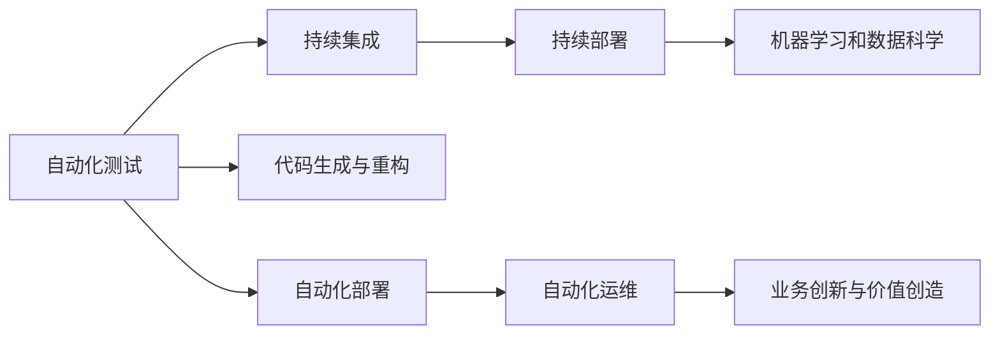

                 

# 软件 2.0 的价值：提升效率、创造价值

软件 2.0，即第二代软件工程，是指通过自动化和智能化技术，大大提升软件开发效率和软件质量，从而推动软件工程在业务创新和价值创造中的作用。本文将深入探讨软件 2.0 的核心概念、算法原理、操作步骤及其在实际应用中的价值和展望，为读者提供全面、系统的技术视角。

## 1. 背景介绍

### 1.1 软件 1.0 到软件 2.0 的转变

软件 1.0 时代，软件开发主要依赖人工编码，依赖于程序员的经验和技术积累。然而，这种手工编码的方式存在效率低、质量难控、维护困难等问题。随着软件需求的不断增长，软件 1.0 的缺陷逐渐暴露，制约了软件工程的持续发展。

软件 2.0 时代的到来，带来了根本性的变化。借助人工智能、机器学习、数据科学等前沿技术，软件 2.0 实现了代码生成、自动化测试、持续集成等全链路自动化，大幅提升了软件开发的效率和质量。软件 2.0 不只追求代码本身的高效生成，更关注业务价值的创造和用户体验的提升。

### 1.2 软件 2.0 的驱动因素

软件 2.0 的兴起，主要受到以下几个因素的驱动：

1. **人工智能和大数据技术**：AI 和大数据为软件 2.0 提供了强大的数据和计算支持，使得自动化过程更加精准和高效。
2. **企业数字化转型需求**：在数字化时代，企业需要通过软件提升业务创新能力和运营效率，软件 2.0 正是这一需求的响应。
3. **云计算和 DevOps 技术**：云平台和 DevOps 工具链的发展，为软件 2.0 提供了高效的基础设施和协作机制。
4. **用户需求多样化和个性化**：随着用户需求的快速变化，软件 2.0 能够快速响应和满足用户的个性化需求，提升用户体验。

## 2. 核心概念与联系

### 2.1 核心概念概述

为更好地理解软件 2.0 的精髓，本文将介绍几个关键核心概念：

1. **自动化测试(Automated Testing)**：通过脚本或工具对软件进行测试，自动化检测和修复缺陷，提高测试效率和质量。
2. **持续集成/持续部署(CI/CD)**：在开发过程中，自动化地将代码集成到代码库中，并进行自动化构建和部署，快速响应反馈。
3. **机器学习和数据科学**：利用 AI 技术进行数据分析、模式识别和预测，指导软件开发和优化。
4. **代码生成与重构**：通过智能算法自动生成或重构代码，提升开发效率，减少错误。
5. **自动化部署和运维**：自动化地将软件部署到生产环境，并进行运维监控，保证软件稳定性和安全性。

这些概念之间的联系可以通过以下 Mermaid 流程图来展示：



这个流程图展示了自动化测试、持续集成和持续部署等关键流程，以及机器学习、代码生成与重构、自动化部署和运维等支持技术，最终通过业务创新与价值创造的目标，构建起软件 2.0 的完整技术框架。

## 3. 核心算法原理 & 具体操作步骤

### 3.1 算法原理概述

软件 2.0 的核心算法原理主要集中在以下几个方面：

- **自动化测试算法**：通过静态分析和动态测试，构建测试用例和测试脚本，自动检测软件缺陷。
- **持续集成算法**：设计自动化流水线，周期性地将代码合并到主分支，自动执行构建和部署步骤。
- **机器学习与数据科学算法**：利用数据挖掘、分类、聚类等算法，分析用户行为和软件性能，指导软件优化。
- **代码生成与重构算法**：使用基于模板的生成算法、语义分析算法、模式匹配算法等，自动生成或优化代码。
- **自动化部署与运维算法**：采用容器化、微服务、云原生等技术，自动化部署和管理软件应用，实时监控和优化性能。

### 3.2 算法步骤详解

以下是软件 2.0 中几个核心算法的详细步骤：

#### 自动化测试算法

1. **需求分析**：根据用户需求和业务场景，定义测试目标和测试用例。
2. **测试用例设计**：通过单元测试、集成测试、系统测试等手段，设计测试用例。
3. **测试执行**：执行测试用例，自动记录测试结果，分析缺陷。
4. **缺陷修复**：根据测试结果，定位和修复代码缺陷。
5. **回归测试**：在修复缺陷后，重新执行测试用例，确保修复效果。

#### 持续集成算法

1. **代码提交**：开发人员通过版本控制系统，提交代码变更。
2. **构建和测试**：自动触发构建和测试流程，检测代码质量。
3. **合并和部署**：如果构建和测试通过，将代码合并到主分支，并自动部署到测试环境。
4. **反馈和迭代**：根据测试结果，生成反馈报告，指导开发人员进行迭代优化。

#### 机器学习与数据科学算法

1. **数据收集**：收集用户行为数据、软件性能数据等，作为算法训练数据。
2. **特征工程**：对数据进行预处理和特征提取，生成特征向量。
3. **模型训练**：利用机器学习算法，训练预测模型。
4. **预测与优化**：将模型应用到实际场景中，进行预测和性能优化。

#### 代码生成与重构算法

1. **语义分析**：分析代码结构和业务逻辑，识别生成和优化点。
2. **模板匹配**：根据业务需求和代码风格，选择生成模板。
3. **代码生成**：利用模板和算法，自动生成代码片段。
4. **代码优化**：通过模式匹配和重构算法，优化代码质量和性能。

#### 自动化部署与运维算法

1. **环境配置**：配置和部署目标环境，如服务器、容器等。
2. **自动化部署**：通过 CI/CD 工具，自动化部署软件应用。
3. **性能监控**：实时监控应用性能，收集日志和指标。
4. **故障处理**：根据监控数据，自动检测和处理故障。

### 3.3 算法优缺点

软件 2.0 的核心算法在提升开发效率、提升软件质量等方面具有显著优势，但也存在一些局限性：

**优点**：

- **高效性**：自动化测试、持续集成、持续部署等流程大大缩短了开发周期，提高了软件交付速度。
- **准确性**：机器学习和数据科学算法能够精确分析用户行为和软件性能，指导软件开发和优化。
- **可维护性**：代码生成和重构算法能够快速生成高质量代码，减少人为错误。
- **可扩展性**：自动化部署和运维技术支持大规模软件应用的管理和扩展。

**缺点**：

- **依赖复杂技术**：软件 2.0 需要依赖 AI、大数据、云计算等复杂技术，实施成本较高。
- **数据隐私和安全**：自动化测试和数据科学算法需要收集和分析大量用户数据，数据隐私和安全问题需要特别关注。
- **开发难度高**：部分算法需要专业的技术背景，实施和维护难度较大。
- **过度自动化风险**：过度依赖自动化可能导致开发人员缺乏对软件的深度理解和创新能力。

### 3.4 算法应用领域

软件 2.0 的应用领域非常广泛，涵盖了软件开发的全生命周期：

- **软件开发**：自动化测试、持续集成、持续部署、代码生成与重构等技术广泛应用于软件开发。
- **软件运维**：自动化部署、自动化运维、性能监控等技术，保障软件稳定性和性能。
- **数据分析**：利用数据科学算法，进行用户行为分析、需求预测、性能优化等。
- **人工智能应用**：AI 算法在自然语言处理、图像识别、推荐系统等领域的应用，大大提升了应用效果。
- **业务创新**：通过软件 2.0 技术，推动业务流程优化、产品创新和用户需求满足。

## 4. 数学模型和公式 & 详细讲解  
### 4.1 数学模型构建

软件 2.0 中的算法模型构建主要涉及以下几个方面：

1. **测试模型**：基于统计学原理，构建测试用例和测试脚本。
2. **持续集成模型**：设计自动化流水线和反馈机制，优化软件交付流程。
3. **机器学习模型**：利用分类、回归、聚类等算法，构建预测模型。
4. **代码生成模型**：通过模板匹配和语法分析，生成代码片段。
5. **运维监控模型**：利用时间序列分析、异常检测等算法，进行性能监控和故障处理。

### 4.2 公式推导过程

以下我们以机器学习在软件 2.0 中的应用为例，推导基本的数学模型：

假设我们有用户行为数据集 $D=\{(x_i,y_i)\}_{i=1}^N$，其中 $x_i$ 表示用户行为特征，$y_i$ 表示用户满意度评分。我们要构建一个分类模型 $M(x)$，用于预测用户满意度是否低于某个阈值 $k$。

定义模型的预测函数为 $M(x) = f(w \cdot x + b)$，其中 $w$ 为模型权重，$b$ 为偏置项，$f$ 为激活函数。我们希望最小化损失函数：

$$
\mathcal{L}(w,b) = \frac{1}{N}\sum_{i=1}^N \ell(y_i, M(x_i))
$$

其中 $\ell$ 为损失函数，如交叉熵损失。通过梯度下降等优化算法，最小化损失函数，得到模型参数 $w$ 和 $b$。

### 4.3 案例分析与讲解

以基于机器学习的用户行为分析为例，展示如何利用数据科学算法优化软件开发和用户体验。

假设我们要构建一个用户反馈分析系统，用于分析用户对某软件新功能的满意度。我们可以收集用户使用软件的功能日志数据，提取用户行为特征 $x$，如使用时长、点击次数等。

构建预测模型 $M(x)$ 用于预测用户是否对新功能满意，其损失函数为：

$$
\mathcal{L}(w,b) = \frac{1}{N}\sum_{i=1}^N \ell(y_i, M(x_i))
$$

其中 $y_i \in \{0,1\}$，表示用户是否满意。通过数据集 $D$ 的训练，我们可以得到最优模型参数 $w$ 和 $b$。

## 5. 项目实践：代码实例和详细解释说明
### 5.1 开发环境搭建

在进行软件 2.0 的实践前，我们需要准备好开发环境。以下是使用 Python 进行 PyTorch 开发的环境配置流程：

1. 安装 Anaconda：从官网下载并安装 Anaconda，用于创建独立的 Python 环境。

2. 创建并激活虚拟环境：
```bash
conda create -n pytorch-env python=3.8 
conda activate pytorch-env
```

3. 安装 PyTorch：根据 CUDA 版本，从官网获取对应的安装命令。例如：
```bash
conda install pytorch torchvision torchaudio cudatoolkit=11.1 -c pytorch -c conda-forge
```

4. 安装 Transformers 库：
```bash
pip install transformers
```

5. 安装各类工具包：
```bash
pip install numpy pandas scikit-learn matplotlib tqdm jupyter notebook ipython
```

完成上述步骤后，即可在 `pytorch-env` 环境中开始软件 2.0 的实践。

### 5.2 源代码详细实现

这里我们以用户行为分析为例，给出使用 Transformers 库进行机器学习的 PyTorch 代码实现。

首先，定义机器学习模型和优化器：

```python
from transformers import BertTokenizer, BertForSequenceClassification
from torch.utils.data import Dataset
from torch.optim import AdamW

tokenizer = BertTokenizer.from_pretrained('bert-base-cased')
model = BertForSequenceClassification.from_pretrained('bert-base-cased', num_labels=2)

optimizer = AdamW(model.parameters(), lr=1e-5)
```

然后，定义数据处理函数：

```python
class UserBehaviorDataset(Dataset):
    def __init__(self, data, tokenizer):
        self.data = data
        self.tokenizer = tokenizer
        
    def __len__(self):
        return len(self.data)
    
    def __getitem__(self, idx):
        text = self.data[idx]['text']
        label = self.data[idx]['label']
        
        encoding = self.tokenizer(text, return_tensors='pt', truncation=True)
        input_ids = encoding['input_ids'][0]
        attention_mask = encoding['attention_mask'][0]
        
        return {'input_ids': input_ids, 
                'attention_mask': attention_mask,
                'labels': torch.tensor(label, dtype=torch.long)}
```

接着，定义训练和评估函数：

```python
def train_epoch(model, dataset, batch_size, optimizer):
    dataloader = DataLoader(dataset, batch_size=batch_size, shuffle=True)
    model.train()
    epoch_loss = 0
    for batch in dataloader:
        input_ids = batch['input_ids'].to(device)
        attention_mask = batch['attention_mask'].to(device)
        labels = batch['labels'].to(device)
        model.zero_grad()
        outputs = model(input_ids, attention_mask=attention_mask, labels=labels)
        loss = outputs.loss
        epoch_loss += loss.item()
        loss.backward()
        optimizer.step()
    return epoch_loss / len(dataloader)

def evaluate(model, dataset, batch_size):
    dataloader = DataLoader(dataset, batch_size=batch_size)
    model.eval()
    preds, labels = [], []
    with torch.no_grad():
        for batch in dataloader:
            input_ids = batch['input_ids'].to(device)
            attention_mask = batch['attention_mask'].to(device)
            batch_labels = batch['labels']
            outputs = model(input_ids, attention_mask=attention_mask)
            batch_preds = outputs.logits.argmax(dim=1).to('cpu').tolist()
            batch_labels = batch_labels.to('cpu').tolist()
            for pred, label in zip(batch_preds, batch_labels):
                preds.append(pred)
                labels.append(label)
                
    print(classification_report(labels, preds))
```

最后，启动训练流程并在测试集上评估：

```python
epochs = 5
batch_size = 16

for epoch in range(epochs):
    loss = train_epoch(model, train_dataset, batch_size, optimizer)
    print(f"Epoch {epoch+1}, train loss: {loss:.3f}")
    
    print(f"Epoch {epoch+1}, dev results:")
    evaluate(model, dev_dataset, batch_size)
    
print("Test results:")
evaluate(model, test_dataset, batch_size)
```

以上就是使用 PyTorch 对用户行为分析进行机器学习的完整代码实现。可以看到，借助 Transformers 库，代码实现变得简洁高效。

### 5.3 代码解读与分析

让我们再详细解读一下关键代码的实现细节：

**UserBehaviorDataset类**：
- `__init__`方法：初始化数据和分词器等组件。
- `__len__`方法：返回数据集的样本数量。
- `__getitem__`方法：对单个样本进行处理，将文本输入编码为 token ids，并将标签转化为数字。

**模型与优化器定义**：
- 选择 BERT 模型作为分类器，并指定输出标签数为 2（满意或不满意）。
- 使用 AdamW 优化器，设置学习率为 1e-5。

**训练和评估函数**：
- 使用 DataLoader 对数据集进行批次化加载，供模型训练和推理使用。
- 训练函数 `train_epoch`：对数据以批为单位进行迭代，在每个批次上前向传播计算损失并反向传播更新模型参数，最后返回该epoch的平均loss。
- 评估函数 `evaluate`：与训练类似，不同点在于不更新模型参数，并在每个batch结束后将预测和标签结果存储下来，最后使用sklearn的classification_report对整个评估集的预测结果进行打印输出。

**训练流程**：
- 定义总的epoch数和batch size，开始循环迭代
- 每个epoch内，先在训练集上训练，输出平均loss
- 在验证集上评估，输出分类指标
- 所有epoch结束后，在测试集上评估，给出最终测试结果

可以看到，PyTorch 配合 Transformers 库使得用户行为分析的机器学习代码实现变得简洁高效。开发者可以将更多精力放在数据处理、模型改进等高层逻辑上，而不必过多关注底层的实现细节。

当然，工业级的系统实现还需考虑更多因素，如模型的保存和部署、超参数的自动搜索、更灵活的任务适配层等。但核心的算法流程基本与此类似。

## 6. 实际应用场景
### 6.1 智能客服系统

基于软件 2.0 的智能客服系统可以为用户提供7x24小时不间断的服务，快速响应客户咨询，用自然流畅的语言解答各类常见问题。智能客服系统利用机器学习和数据分析技术，可以不断优化对话策略，提升客户满意度。

在技术实现上，可以收集企业内部的历史客服对话记录，将问题和最佳答复构建成监督数据，在此基础上对预训练模型进行微调。微调后的对话模型能够自动理解用户意图，匹配最合适的答案模板进行回复。对于客户提出的新问题，还可以接入检索系统实时搜索相关内容，动态组织生成回答。如此构建的智能客服系统，能大幅提升客户咨询体验和问题解决效率。

### 6.2 金融舆情监测

金融机构需要实时监测市场舆论动向，以便及时应对负面信息传播，规避金融风险。传统的人工监测方式成本高、效率低，难以应对网络时代海量信息爆发的挑战。基于软件 2.0 的文本分类和情感分析技术，为金融舆情监测提供了新的解决方案。

具体而言，可以收集金融领域相关的新闻、报道、评论等文本数据，并对其进行主题标注和情感标注。在此基础上对预训练语言模型进行微调，使其能够自动判断文本属于何种主题，情感倾向是正面、中性还是负面。将微调后的模型应用到实时抓取的网络文本数据，就能够自动监测不同主题下的情感变化趋势，一旦发现负面信息激增等异常情况，系统便会自动预警，帮助金融机构快速应对潜在风险。

### 6.3 个性化推荐系统

当前的推荐系统往往只依赖用户的历史行为数据进行物品推荐，无法深入理解用户的真实兴趣偏好。基于软件 2.0 的个性化推荐系统可以更好地挖掘用户行为背后的语义信息，从而提供更精准、多样的推荐内容。

在实践中，可以收集用户浏览、点击、评论、分享等行为数据，提取和用户交互的物品标题、描述、标签等文本内容。将文本内容作为模型输入，用户的后续行为（如是否点击、购买等）作为监督信号，在此基础上微调预训练语言模型。微调后的模型能够从文本内容中准确把握用户的兴趣点。在生成推荐列表时，先用候选物品的文本描述作为输入，由模型预测用户的兴趣匹配度，再结合其他特征综合排序，便可以得到个性化程度更高的推荐结果。

### 6.4 未来应用展望

随着软件 2.0 技术的不断发展，基于软件 2.0 的应用场景将愈加丰富：

1. **智慧医疗**：通过智能分析患者数据，提供个性化的医疗方案，提升医疗服务质量。
2. **智能教育**：通过个性化推荐和学习分析，提升在线教育体验，提高教育质量。
3. **智慧城市**：通过数据分析和智能决策，提升城市管理水平，构建更安全、高效的未来城市。
4. **智能制造**：通过自动化测试和运维，提升制造流程效率，优化产品性能。
5. **智能营销**：通过用户行为分析和推荐系统，提升营销效果，增加用户粘性。
6. **智能安全**：通过异常检测和风险预测，提升网络安全防护能力，保障数据安全。

未来，软件 2.0 技术将继续推动各行各业的数字化转型和智能化升级，带来更多创新应用和商业价值。

## 7. 工具和资源推荐
### 7.1 学习资源推荐

为了帮助开发者系统掌握软件 2.0 的理论基础和实践技巧，这里推荐一些优质的学习资源：

1. **《深度学习与人工智能》系列课程**：斯坦福大学开设的深度学习与人工智能课程，涵盖了机器学习、深度学习、自然语言处理等多个领域的基础知识和前沿技术。
2. **《TensorFlow实战》书籍**：介绍了 TensorFlow 的基础知识和实战技巧，适合初学者和进阶者。
3. **《代码生成与重构》书籍**：介绍了基于模型驱动的软件开发技术，如何利用自动化代码生成提升开发效率。
4. **《软件测试框架》书籍**：介绍了软件测试框架和工具，如 TestNG、JUnit、Selenium 等，适合测试工程师和开发人员。
5. **《DevOps实践指南》书籍**：介绍了 DevOps 实践和工具，如 Jenkins、Docker、Kubernetes 等，适合运维工程师和系统管理员。

通过对这些资源的学习实践，相信你一定能够快速掌握软件 2.0 的精髓，并用于解决实际的开发和运维问题。

### 7.2 开发工具推荐

高效的开发离不开优秀的工具支持。以下是几款用于软件 2.0 开发的常用工具：

1. **PyTorch**：基于 Python 的开源深度学习框架，灵活的计算图，适合快速迭代研究。
2. **TensorFlow**：由 Google 主导开发的开源深度学习框架，生产部署方便，适合大规模工程应用。
3. **Transformers**：HuggingFace 开发的 NLP 工具库，集成了众多预训练模型和微调工具。
4. **Jenkins**：开源的持续集成工具，支持自动化构建、测试、部署等流程。
5. **Docker**：容器化技术，支持跨平台部署和快速容器镜像构建。
6. **Kubernetes**：容器编排平台，支持大规模容器集群管理和自动扩展。

合理利用这些工具，可以显著提升软件 2.0 开发的效率和质量，加快创新迭代的步伐。

### 7.3 相关论文推荐

软件 2.0 技术的发展源于学界的持续研究。以下是几篇奠基性的相关论文，推荐阅读：

1. **《深度学习》论文**：Yann LeCun 等人发表的深度学习综述，介绍了深度学习的基础理论和应用。
2. **《TensorFlow论文》**：Google 发表的 TensorFlow 架构论文，介绍了 TensorFlow 的计算图和分布式训练机制。
3. **《代码生成与重构》论文**：引入代码生成和重构技术，提升软件开发的效率和质量。
4. **《机器学习在 NLP 中的应用》论文**：介绍机器学习在自然语言处理中的应用，如情感分析、文本分类等。
5. **《软件 2.0 实践》论文**：总结了软件 2.0 技术的实践经验和应用场景，推动软件工程的创新和升级。

这些论文代表了大规模软件开发的最新进展和前沿方向，通过学习这些前沿成果，可以帮助研究者把握学科前进方向，激发更多的创新灵感。

## 8. 总结：未来发展趋势与挑战

### 8.1 研究成果总结

软件 2.0 技术经过多年的发展，已经从理论到实践都取得了显著进展，成为软件开发和运维的重要趋势。本文全面介绍了软件 2.0 的核心概念、算法原理和操作步骤，展示了其在实际应用中的广泛价值。

通过本文的系统梳理，可以看到，软件 2.0 技术正在不断提升软件开发的效率和质量，通过自动化测试、持续集成、机器学习、代码生成与重构、自动化部署和运维等技术手段，极大地推动了软件工程的创新和升级。软件 2.0 不只追求代码本身的高效生成，更关注业务价值的创造和用户体验的提升，为软件开发带来了全新的视角和可能。

### 8.2 未来发展趋势

展望未来，软件 2.0 技术将呈现以下几个发展趋势：

1. **自动化程度的提升**：随着 AI 和大数据技术的发展，自动化测试、持续集成、持续部署等流程将更加智能化，减少人为干预，提高效率和准确性。
2. **模型的多样化和智能化**：引入更多先进算法，如强化学习、因果推理、多模态融合等，提升模型的智能水平和鲁棒性。
3. **开发与运维的一体化**：DevOps 文化和工具的普及，将开发和运维环节紧密结合，提升整体效率和协作性。
4. **持续学习与自我优化**：利用机器学习算法，模型能够不断从新数据中学习，自我优化和提升性能。
5. **云计算和边缘计算的融合**：结合云计算和边缘计算技术，构建更加灵活、高效的软件架构。
6. **人机协作与智能辅助**：通过智能助手和虚拟代理等技术，实现人机协作，提升用户体验。

以上趋势凸显了软件 2.0 技术的广阔前景。这些方向的探索发展，必将进一步提升软件开发的效率和质量，推动软件开发技术的持续创新和升级。

### 8.3 面临的挑战

尽管软件 2.0 技术已经取得了显著进展，但在迈向更加智能化、普适化应用的过程中，它仍面临诸多挑战：

1. **复杂技术栈的维护**：软件 2.0 技术依赖于 AI、大数据、云计算等复杂技术栈，实施和维护成本较高。
2. **数据隐私和安全**：自动化测试和数据科学算法需要收集和分析大量用户数据，数据隐私和安全问题需要特别关注。
3. **过度自动化风险**：过度依赖自动化可能导致开发人员缺乏对软件的深度理解和创新能力。
4. **资源消耗问题**：大规模软件应用需要高性能计算资源，资源消耗问题较为突出。
5. **模型可解释性不足**：深度学习模型的决策过程往往缺乏可解释性，难以满足高风险应用的需求。
6. **跨领域技术融合**：软件 2.0 技术需要与其他前沿技术，如区块链、物联网、自然语言处理等深度融合，才能实现更广泛的应用。

正视软件 2.0 面临的这些挑战，积极应对并寻求突破，将是大规模软件开发的关键。

### 8.4 研究展望

面向未来，软件 2.0 技术需要在以下几个方面寻求新的突破：

1. **跨领域技术的融合**：将符号化的先验知识，如知识图谱、逻辑规则等，与神经网络模型进行融合，提升模型的智能化水平。
2. **人机协作技术的创新**：引入更多的智能助手和虚拟代理技术，实现人机协作，提升用户体验。
3. **模型可解释性的提升**：引入可解释性算法，如注意力机制、规则推理等，提升模型的决策可解释性。
4. **智能运维技术的优化**：引入更多智能运维技术和工具，提升软件系统的可靠性和安全性。
5. **跨学科知识的整合**：将心理学、社会学、伦理学等多学科知识整合到软件 2.0 中，提升系统的伦理性和安全性。

这些研究方向的探索，必将引领软件 2.0 技术迈向更高的台阶，为构建安全、可靠、可解释、可控的智能系统铺平道路。面向未来，软件 2.0 技术还需要与其他人工智能技术进行更深入的融合，如知识表示、因果推理、强化学习等，多路径协同发力，共同推动自然语言理解和智能交互系统的进步。

## 9. 附录：常见问题与解答

**Q1：软件 2.0 技术是否适用于所有软件开发项目？**

A: 软件 2.0 技术在大多数软件开发项目中都能带来显著的效率提升和质量保障，但并不是所有项目都适合采用。对于数据密集型、业务复杂型的项目，软件 2.0 技术可以带来更大的收益。而对于需求明确、变化较少的项目，传统方法可能更为适合。

**Q2：实施软件 2.0 技术需要哪些关键技能？**

A: 实施软件 2.0 技术需要掌握以下关键技能：

- **深度学习与机器学习**：理解机器学习算法，能够应用到软件开发和运维中。
- **大数据与数据科学**：掌握数据处理和分析技能，能够从数据中提取有价值的信息。
- **自动化工具与技术**：熟悉自动化测试、持续集成、持续部署等工具和技术。
- **编程语言与框架**：熟练使用 Python、Java、JavaScript 等编程语言和相关框架。
- **云计算与 DevOps**：了解云计算平台和 DevOps 文化，能够构建高效的软件开发生命周期。

**Q3：软件 2.0 技术在软件开发中的优势有哪些？**

A: 软件 2.0 技术在软件开发中的优势包括：

- **高效性**：通过自动化测试、持续集成、持续部署等流程，大大缩短开发周期，提高软件交付速度。
- **可靠性**：利用机器学习和数据分析技术，提升软件质量，减少人为错误。
- **可扩展性**：通过云平台和 DevOps 技术，实现灵活的资源管理和部署。
- **低成本**：通过自动化测试和部署，降低人工成本和测试成本。
- **创新性**：通过数据分析和智能决策，提升业务创新能力。

**Q4：如何选择合适的软件 2.0 工具和平台？**

A: 选择合适的软件 2.0 工具和平台需要考虑以下几个因素：

- **项目需求**：根据项目规模、复杂度、业务类型等因素，选择合适的工具和平台。
- **技术栈匹配**：选择与现有技术栈兼容的工具和平台，避免技术切换带来的成本和风险。
- **成本与效益**：评估工具和平台的成本，选择性价比高的方案。
- **社区支持**：选择社区活跃、文档完善的工具和平台，便于问题解决和技术支持。
- **灵活性与可扩展性**：选择支持插件、扩展的工具和平台，便于未来升级和扩展。

**Q5：软件 2.0 技术在实际应用中面临哪些挑战？**

A: 软件 2.0 技术在实际应用中面临以下挑战：

- **技术复杂性**：软件 2.0 技术依赖于 AI、大数据、云计算等复杂技术，实施和维护成本较高。
- **数据隐私和安全**：自动化测试和数据科学算法需要收集和分析大量用户数据，数据隐私和安全问题需要特别关注。
- **模型可解释性不足**：深度学习模型的决策过程往往缺乏可解释性，难以满足高风险应用的需求。
- **跨领域技术融合**：软件 2.0 技术需要与其他前沿技术，如区块链、物联网、自然语言处理等深度融合，才能实现更广泛的应用。

综上所述，软件 2.0 技术正在引领软件开发和运维的变革，通过自动化测试、持续集成、持续部署、机器学习、代码生成与重构、自动化部署和运维等技术手段，极大地推动了软件工程的创新和升级。未来，随着技术的不断进步和应用场景的不断拓展，软件 2.0 必将在更多领域发挥重要作用，为人类生产力和创造力带来新的飞跃。

