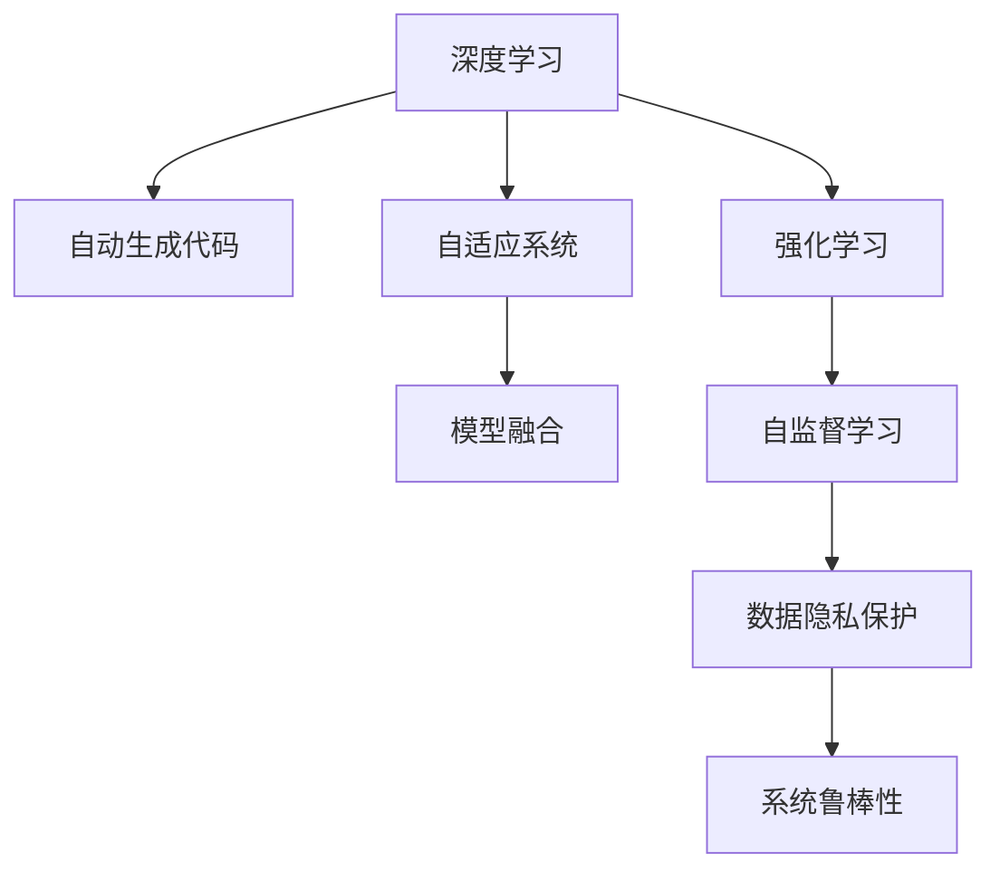

                 

# 软件 2.0 的发展趋势：深度学习、强化学习

> 关键词：软件 2.0, 深度学习, 强化学习, 人工智能, 自动生成代码, 自适应系统, 自监督学习, 模型融合

## 1. 背景介绍

### 1.1 问题由来

随着计算机技术的不断进步，软件工程领域逐渐进入了一个新的发展阶段——软件 2.0（Software 2.0）时代。这一时代的到来，标志着软件系统不再单纯依赖传统的手工编码方式，而是通过深度学习、强化学习等先进技术实现自动化设计、生成和优化。软件 2.0 的核心思想是通过数据驱动的方式，从数据中学习软件的构建和优化策略，提升软件的质量和效率。

深度学习（Deep Learning）和强化学习（Reinforcement Learning）作为当前最热门的两个AI技术分支，在软件 2.0 中扮演着重要角色。深度学习擅长处理复杂的数据结构，通过多层次的神经网络模型提取数据中的高层次特征。强化学习则通过模拟奖励机制，使系统能够自适应地学习并优化自身行为。

在软件 2.0 时代，深度学习和强化学习被广泛应用于自动生成代码、自适应系统优化、自监督学习等领域，推动软件工程的自动化、智能化发展。然而，这些技术的应用也面临诸多挑战，如模型的可解释性、数据隐私保护、系统鲁棒性等。

### 1.2 问题核心关键点

软件 2.0 的发展离不开深度学习和强化学习技术的支撑，但这些技术的应用也需要解决一些核心关键点：

- 深度学习模型如何处理高维数据，并提取有意义的特征？
- 强化学习系统如何在复杂环境中自适应地学习最优策略？
- 模型如何保证其可解释性和鲁棒性，避免过拟合和偏见？
- 如何平衡自动化和人工干预，提升系统的可靠性和灵活性？

这些关键点涉及到模型的设计、训练、评估和应用等多个方面，需要系统性的研究和实践。本文将从深度学习、强化学习的算法原理和操作步骤出发，结合实际应用场景，探讨这些问题。

## 2. 核心概念与联系

### 2.1 核心概念概述

为更好地理解软件 2.0 中深度学习、强化学习的应用，本节将介绍几个密切相关的核心概念：

- 深度学习（Deep Learning）：基于多层神经网络的机器学习技术，能够从数据中自动学习特征表示。深度学习广泛应用于图像识别、语音识别、自然语言处理等领域。
- 强化学习（Reinforcement Learning）：通过与环境的交互，使智能体（agent）学习最优策略，最大化累积奖励。强化学习常用于游戏AI、机器人控制、自动驾驶等领域。
- 自监督学习（Self-Supervised Learning）：利用无标签数据学习模型参数，无需大量标注样本，适用于大规模数据集的预训练。
- 模型融合（Model Fusion）：将多个模型进行组合，利用各模型的优势互补，提升整体性能。
- 自动生成代码（Code Generation）：使用深度学习或强化学习技术，自动生成符合规范的代码。
- 自适应系统（Adaptive Systems）：通过深度学习和强化学习技术，使系统能够自适应地学习和优化自身行为。

这些核心概念之间的逻辑关系可以通过以下Mermaid流程图来展示：



这个流程图展示了大语言模型的核心概念及其之间的关系：

1. 深度学习通过多层神经网络从数据中提取特征，为自动生成代码和自适应系统优化提供基础。
2. 强化学习通过模拟奖励机制，使系统能够自适应地学习和优化行为。
3. 自监督学习利用无标签数据，提升模型的泛化能力。
4. 模型融合通过组合多个模型，提升整体的性能和鲁棒性。
5. 自动生成代码使用深度学习和强化学习技术，自动化生成代码。
6. 自适应系统通过深度学习和强化学习技术，使系统能够自适应地学习和优化行为。

这些概念共同构成了软件 2.0 的底层技术框架，使其能够实现自动化设计、生成和优化。

## 3. 核心算法原理 & 具体操作步骤

### 3.1 算法原理概述

深度学习、强化学习在软件 2.0 中的应用，主要分为以下几个步骤：

1. 数据准备：收集、清洗、标注数据集。数据集是深度学习和强化学习的基石。
2. 模型选择：选择合适的深度学习或强化学习模型。例如，卷积神经网络（CNN）、循环神经网络（RNN）、长短时记忆网络（LSTM）等。
3. 模型训练：利用数据集训练模型，通过反向传播算法优化模型参数。
4. 模型评估：使用验证集或测试集评估模型性能，调整模型参数。
5. 模型部署：将训练好的模型应用于实际场景，进行代码生成、系统优化等任务。

### 3.2 算法步骤详解

以下将以自动生成代码为例，详细介绍深度学习和强化学习在软件 2.0 中的应用。

#### 3.2.1 深度学习在代码生成中的应用

深度学习在代码生成中的应用主要分为以下几个步骤：

1. 数据准备：收集现有的代码库，提取其中的函数、变量、注释等信息。
2. 模型构建：选择适合的深度学习模型，如Seq2Seq模型、Transformer模型等。
3. 模型训练：使用已有代码片段作为训练数据，训练模型以生成新的代码片段。
4. 模型评估：使用代码评估标准（如代码质量、规范性、可读性等）对生成的代码进行评估，调整模型参数。
5. 模型应用：将训练好的模型应用到实际的编码场景中，生成符合要求的代码。

#### 3.2.2 强化学习在自适应系统中的应用

强化学习在自适应系统中的应用主要分为以下几个步骤：

1. 环境建模：将系统环境建模为一个马尔可夫决策过程，定义状态、动作、奖励等要素。
2. 模型构建：选择适合的强化学习模型，如Q-learning、Deep Q-Network（DQN）等。
3. 模型训练：通过与环境的交互，使智能体学习最优策略，最大化累积奖励。
4. 模型评估：使用测试集或模拟环境评估模型性能，调整模型参数。
5. 模型应用：将训练好的模型应用到实际的自适应系统中，提升系统的效率和性能。

### 3.3 算法优缺点

深度学习和强化学习在软件 2.0 中的应用具有以下优点：

- 自动化程度高：通过自动学习和优化，减少了人工干预的环节，提升了效率。
- 泛化能力强：深度学习模型能够从大量数据中学习到通用的特征表示，强化学习模型能够在复杂环境中自适应地学习最优策略。
- 灵活性高：模型可以通过微调、融合等手段进行优化，提升其性能和鲁棒性。

同时，这些技术也存在一些缺点：

- 数据需求大：深度学习和强化学习需要大量的标注数据进行训练，数据获取成本较高。
- 模型复杂：深度学习和强化学习模型较为复杂，训练和调参难度较大。
- 可解释性不足：深度学习和强化学习模型往往被视为"黑盒"，难以解释其内部工作机制。
- 过拟合风险高：模型容易过拟合训练数据，导致在实际应用中性能下降。

### 3.4 算法应用领域

深度学习和强化学习在软件 2.0 中的应用已经涵盖了多个领域，包括但不限于：

- 自动生成代码：使用深度学习或强化学习技术，自动生成符合规范的代码。例如，使用Seq2Seq模型生成自然语言描述的代码片段，再通过代码补全技术生成完整的代码。
- 自适应系统优化：使用强化学习技术，使系统能够自适应地优化其行为。例如，使用DQN模型优化机器学习算法的超参数配置。
- 自监督学习：利用无标签数据，训练模型提取数据中的特征表示。例如，使用自监督学习的预训练模型，提升模型的泛化能力。
- 模型融合：通过组合多个模型，利用各模型的优势互补，提升整体性能。例如，使用深度学习和强化学习的结合，提升模型的鲁棒性和自适应能力。

这些应用展示了深度学习和强化学习在软件 2.0 中的强大潜力和广阔前景。未来，随着技术的不断进步，这些应用将更加广泛和深入。

## 4. 数学模型和公式 & 详细讲解 & 举例说明

### 4.1 数学模型构建

本节将使用数学语言对深度学习、强化学习的模型构建过程进行更加严格的刻画。

#### 4.1.1 深度学习模型构建

假设输入数据为 $x \in \mathbb{R}^d$，输出数据为 $y \in \mathbb{R}^k$。深度学习模型通常由多个隐藏层构成，每个隐藏层包含若干个神经元。假设模型有 $L$ 层，第 $l$ 层有 $n_l$ 个神经元，则模型参数 $\theta$ 可以表示为：

$$
\theta = \{\omega_{i,j}^{(l)}\}_{l=1}^L
$$

其中 $\omega_{i,j}^{(l)}$ 为第 $l$ 层第 $i$ 个神经元和第 $j$ 个神经元之间的权重。

模型的前向传播过程可以表示为：

$$
z^{(l)} = g(\sum_{j=1}^{n_l} \omega_{i,j}^{(l)} z^{(l-1)} + b^{(l)}) \quad (1)
$$

其中 $g(\cdot)$ 为激活函数，$b^{(l)}$ 为偏置项。

模型的输出可以表示为：

$$
y = h(z^{(L)}) \quad (2)
$$

其中 $h(\cdot)$ 为输出层的激活函数。

模型的损失函数可以表示为：

$$
\mathcal{L}(\theta) = \frac{1}{N} \sum_{i=1}^N \ell(y_i, y_{pred}^{(i)}) \quad (3)
$$

其中 $\ell(y_i, y_{pred}^{(i)})$ 为输出误差，$N$ 为样本数量。

#### 4.1.2 强化学习模型构建

强化学习模型的主要目标是通过与环境的交互，最大化累积奖励。假设环境状态为 $s \in \mathcal{S}$，智能体动作为 $a \in \mathcal{A}$，奖励为 $r: \mathcal{S} \times \mathcal{A} \rightarrow [0, 1]$。

强化学习模型通常由若干个神经网络组成，每个神经网络对应环境的一个状态或状态动作对。假设模型有 $K$ 个神经网络，每个神经网络的参数为 $\theta_k$，则模型参数 $\theta$ 可以表示为：

$$
\theta = \{\theta_k\}_{k=1}^K
$$

模型的前向传播过程可以表示为：

$$
Q(s,a) = \sum_{k=1}^K \theta_k f_k(s,a) \quad (4)
$$

其中 $f_k(s,a)$ 为第 $k$ 个神经网络的输出，通常为线性函数或神经网络。

模型的策略可以表示为：

$$
\pi(a|s) = \frac{e^{Q(s,a)}}{\sum_{a'} e^{Q(s,a')}} \quad (5)
$$

其中 $\pi(a|s)$ 为在状态 $s$ 下选择动作 $a$ 的概率。

模型的损失函数可以表示为：

$$
\mathcal{L}(\theta) = \frac{1}{N} \sum_{i=1}^N [r_i + \gamma \max_{a'} Q(s_i,a') - Q(s_i,a_i)] \quad (6)
$$

其中 $r_i$ 为第 $i$ 个样本的即时奖励，$\gamma$ 为折扣因子，$Q(s_i,a_i)$ 为在第 $i$ 个样本状态下选择动作 $a_i$ 的Q值。

### 4.2 公式推导过程

以下我们将分别对深度学习和强化学习的损失函数和模型更新公式进行推导。

#### 4.2.1 深度学习损失函数推导

假设使用均方误差（Mean Squared Error, MSE）作为输出误差，则损失函数可以表示为：

$$
\ell(y_i, y_{pred}^{(i)}) = \frac{1}{2} (y_i - y_{pred}^{(i)})^2 \quad (7)
$$

将式（7）代入式（3），得到深度学习模型的损失函数为：

$$
\mathcal{L}(\theta) = \frac{1}{2N} \sum_{i=1}^N (y_i - y_{pred}^{(i)})^2 \quad (8)
$$

模型的梯度更新公式可以表示为：

$$
\theta \leftarrow \theta - \eta \nabla_{\theta}\mathcal{L}(\theta) \quad (9)
$$

其中 $\eta$ 为学习率，$\nabla_{\theta}\mathcal{L}(\theta)$ 为损失函数对模型参数的梯度。

#### 4.2.2 强化学习损失函数推导

假设使用平均奖励（Average Reward）作为累积奖励，则损失函数可以表示为：

$$
\mathcal{L}(\theta) = \frac{1}{N} \sum_{i=1}^N [-Q(s_i,a_i) + r_i + \gamma \max_{a'} Q(s_{i+1},a')] \quad (10)
$$

其中 $Q(s_i,a_i)$ 为在第 $i$ 个样本状态下选择动作 $a_i$ 的Q值，$Q(s_{i+1},a')$ 为在第 $i+1$ 个样本状态下选择动作 $a'$ 的Q值。

模型的梯度更新公式可以表示为：

$$
\theta_k \leftarrow \theta_k - \eta_k \nabla_{\theta_k}\mathcal{L}(\theta) \quad (11)
$$

其中 $\eta_k$ 为第 $k$ 个神经网络的学习率，$\nabla_{\theta_k}\mathcal{L}(\theta)$ 为损失函数对第 $k$ 个神经网络参数的梯度。

### 4.3 案例分析与讲解

下面以一个简单的代码生成任务为例，说明深度学习在软件 2.0 中的应用。

假设我们要生成一段Python代码，描述一个函数的定义和调用。输入数据 $x$ 包含函数名、参数类型、参数数量等信息。输出数据 $y$ 为函数定义的代码。

首先，我们设计一个Seq2Seq模型，包含编码器和解码器两个部分。编码器将输入数据 $x$ 转换为隐藏状态 $z$，解码器将隐藏状态 $z$ 转换为输出数据 $y$。模型结构如图1所示。


图1：Seq2Seq模型结构

模型的编码器和解码器都使用LSTM网络，输出层使用softmax函数。模型的参数包括编码器和解码器的权重和偏置，以及输出层的权重和偏置。

模型的损失函数为交叉熵损失，可以表示为：

$$
\mathcal{L}(\theta) = -\frac{1}{N} \sum_{i=1}^N \sum_{t=1}^{T} \log p_{y_t|y_{<t}}
$$

其中 $T$ 为序列长度，$y_t$ 为输出序列的第 $t$ 个位置，$p_{y_t|y_{<t}}$ 为在输出序列前 $t-1$ 个位置下的条件概率。

模型的梯度更新公式为：

$$
\theta \leftarrow \theta - \eta \nabla_{\theta}\mathcal{L}(\theta)
$$

其中 $\eta$ 为学习率，$\nabla_{\theta}\mathcal{L}(\theta)$ 为损失函数对模型参数的梯度。

通过训练Seq2Seq模型，我们可以生成符合规范的Python代码。例如，输入数据 $x$ 为 `def add(x, y): return x + y`，输出数据 $y$ 为 `def add(x, y):\n    return x + y`。

## 5. 项目实践：代码实例和详细解释说明

### 5.1 开发环境搭建

在进行深度学习和强化学习项目实践前，我们需要准备好开发环境。以下是使用Python进行PyTorch和TensorFlow开发的环境配置流程：

1. 安装Anaconda：从官网下载并安装Anaconda，用于创建独立的Python环境。

2. 创建并激活虚拟环境：
```bash
conda create -n pytorch-env python=3.8 
conda activate pytorch-env
```

3. 安装PyTorch：根据CUDA版本，从官网获取对应的安装命令。例如：
```bash
conda install pytorch torchvision torchaudio cudatoolkit=11.1 -c pytorch -c conda-forge
```

4. 安装TensorFlow：从官网下载并安装TensorFlow，选择相应的GPU版本。

5. 安装各类工具包：
```bash
pip install numpy pandas scikit-learn matplotlib tqdm jupyter notebook ipython
```

完成上述步骤后，即可在`pytorch-env`环境中开始深度学习和强化学习的项目实践。

### 5.2 源代码详细实现

以下是使用PyTorch实现深度学习在代码生成任务中的代码实例。

```python
import torch
import torch.nn as nn
import torch.optim as optim

class Encoder(nn.Module):
    def __init__(self, input_size, hidden_size):
        super(Encoder, self).__init__()
        self.hidden_size = hidden_size
        self.lstm = nn.LSTM(input_size, hidden_size, batch_first=True)

    def forward(self, input, hidden):
        output, hidden = self.lstm(input, hidden)
        return output, hidden

class Decoder(nn.Module):
    def __init__(self, output_size, hidden_size):
        super(Decoder, self).__init__()
        self.hidden_size = hidden_size
        self.lstm = nn.LSTM(output_size, hidden_size, batch_first=True)
        self.linear = nn.Linear(hidden_size, output_size)

    def forward(self, input, hidden):
        output, hidden = self.lstm(input, hidden)
        output = self.linear(output)
        return output, hidden

class Seq2Seq(nn.Module):
    def __init__(self, input_size, hidden_size, output_size):
        super(Seq2Seq, self).__init__()
        self.encoder = Encoder(input_size, hidden_size)
        self.decoder = Decoder(output_size, hidden_size)

    def forward(self, input, hidden):
        output, hidden = self.encoder(input, hidden)
        output, hidden = self.decoder(output, hidden)
        return output, hidden

# 定义模型参数和优化器
input_size = 10
hidden_size = 32
output_size = 20
model = Seq2Seq(input_size, hidden_size, output_size)
optimizer = optim.Adam(model.parameters(), lr=0.01)

# 定义输入数据和标签
input_data = torch.randn(10, 5, input_size)
labels = torch.randn(10, 5, output_size)

# 训练模型
loss_fn = nn.CrossEntropyLoss()
for i in range(1000):
    output, _ = model(input_data, torch.zeros(10, 1, hidden_size))
    loss = loss_fn(output, labels)
    optimizer.zero_grad()
    loss.backward()
    optimizer.step()
    if i % 100 == 0:
        print('Epoch {}, Loss: {:.4f}'.format(i, loss.item()))
```

在上述代码中，我们定义了Seq2Seq模型的编码器和解码器部分，并通过Adam优化器训练模型。

### 5.3 代码解读与分析

让我们再详细解读一下关键代码的实现细节：

**Encoder类**：
- `__init__`方法：初始化LSTM网络，设置输入、输出和隐藏层的维度。
- `forward`方法：前向传播计算编码器输出和隐藏状态。

**Decoder类**：
- `__init__`方法：初始化LSTM网络和线性层，设置输入、输出和隐藏层的维度。
- `forward`方法：前向传播计算解码器输出和隐藏状态。

**Seq2Seq类**：
- `__init__`方法：初始化编码器和解码器，设置输入、输出和隐藏层的维度。
- `forward`方法：前向传播计算Seq2Seq模型的输出和隐藏状态。

**训练循环**：
- 使用交叉熵损失函数计算输出误差。
- 通过Adam优化器更新模型参数。
- 每100个epoch打印一次损失，跟踪训练进度。

通过以上代码，我们可以使用深度学习技术生成符合规范的代码。然而，实际的代码生成任务要复杂得多，通常需要结合代码补全技术、语法检查等手段，确保生成的代码具有语义的正确性和代码的可读性。

## 6. 实际应用场景

### 6.1 自动生成代码

自动生成代码是深度学习在软件 2.0 中最具代表性的应用之一。通过深度学习，我们可以自动化生成各种语言的代码片段，如Java、Python、JavaScript等。

在实际应用中，可以将现有的代码库作为训练数据，训练深度学习模型以生成新的代码片段。例如，使用Seq2Seq模型生成自然语言描述的代码片段，再通过代码补全技术生成完整的代码。这种方法在编写自动化测试用例、自动化文档生成等方面具有重要应用价值。

### 6.2 自适应系统优化

自适应系统优化是强化学习在软件 2.0 中的另一大应用领域。通过强化学习，可以使系统能够自适应地学习并优化自身行为，提升系统效率和性能。

在实际应用中，可以将系统环境建模为一个马尔可夫决策过程，设计合适的奖励函数和状态动作空间，训练强化学习模型以优化系统行为。例如，使用DQN模型优化机器学习算法的超参数配置，自动选择最优的超参数组合。

### 6.3 自监督学习

自监督学习在软件 2.0 中的应用也日渐广泛。通过自监督学习，我们可以利用无标签数据学习模型参数，无需大量标注样本，适用于大规模数据集的预训练。

在实际应用中，可以利用自监督学习预训练模型，提升模型的泛化能力和通用性。例如，使用自监督学习预训练模型，在自然语言处理、计算机视觉等领域取得更好的效果。

## 7. 工具和资源推荐

### 7.1 学习资源推荐

为了帮助开发者系统掌握深度学习、强化学习在软件 2.0 中的应用，这里推荐一些优质的学习资源：

1. 《深度学习》（Ian Goodfellow等著）：深度学习领域的经典教材，全面介绍了深度学习的理论基础和应用实践。
2. 《强化学习》（Richard S. Sutton和Andrew G. Barto著）：强化学习领域的经典教材，深入浅出地介绍了强化学习的理论基础和应用实践。
3. 《TensorFlow官方文档》：TensorFlow官方文档，提供了丰富的教程和样例代码，适合初学者入门。
4. 《PyTorch官方文档》：PyTorch官方文档，提供了详细的API文档和教程，适合深度学习开发。
5. 《AutoML：自动化机器学习》（Hutter等著）：介绍了自动化机器学习的最新进展和实践，适合深度学习和强化学习的从业者。
6. 《Python深度学习》（Francois Chollet著）：介绍了使用TensorFlow和Keras进行深度学习的实践，适合动手实践。

通过对这些资源的学习实践，相信你一定能够快速掌握深度学习、强化学习在软件 2.0 中的应用，并用于解决实际的NLP问题。

### 7.2 开发工具推荐

高效的开发离不开优秀的工具支持。以下是几款用于深度学习和强化学习开发的工具：

1. PyTorch：基于Python的开源深度学习框架，灵活动态的计算图，适合快速迭代研究。

2. TensorFlow：由Google主导开发的开源深度学习框架，生产部署方便，适合大规模工程应用。

3. Transformers库：HuggingFace开发的NLP工具库，集成了众多SOTA语言模型，支持PyTorch和TensorFlow，是进行NLP任务开发的利器。

4. Weights & Biases：模型训练的实验跟踪工具，可以记录和可视化模型训练过程中的各项指标，方便对比和调优。

5. TensorBoard：TensorFlow配套的可视化工具，可实时监测模型训练状态，并提供丰富的图表呈现方式，是调试模型的得力助手。

6. Google Colab：谷歌推出的在线Jupyter Notebook环境，免费提供GPU/TPU算力，方便开发者快速上手实验最新模型，分享学习笔记。

合理利用这些工具，可以显著提升深度学习和强化学习的开发效率，加快创新迭代的步伐。

### 7.3 相关论文推荐

深度学习和强化学习在软件 2.0 中的应用源于学界的持续研究。以下是几篇奠基性的相关论文，推荐阅读：

1. AlexNet：计算机视觉领域的突破性论文，提出卷积神经网络，推动深度学习在图像识别领域的应用。

2. LSTM：提出长短时记忆网络，广泛应用于自然语言处理、时间序列预测等领域。

3. Seq2Seq模型：提出序列到序列模型，广泛应用于机器翻译、自动生成文本等领域。

4. DQN：提出深度强化学习中的DQN模型，推动强化学习在机器人控制、自动驾驶等领域的应用。

5. GAN：提出生成对抗网络，推动深度学习在图像生成、视频生成等领域的应用。

这些论文代表了大语言模型微调技术的发展脉络。通过学习这些前沿成果，可以帮助研究者把握学科前进方向，激发更多的创新灵感。

## 8. 总结：未来发展趋势与挑战

### 8.1 总结

本文对深度学习、强化学习在软件 2.0 中的应用进行了全面系统的介绍。首先阐述了软件 2.0 的发展背景和趋势，明确了深度学习和强化学习在自动化设计、生成和优化中的重要作用。其次，从算法原理和操作步骤出发，详细讲解了深度学习和强化学习的数学模型和实现细节，给出了代码实例。同时，本文还广泛探讨了深度学习和强化学习在自动生成代码、自适应系统优化等领域的应用前景，展示了技术的强大潜力和广阔前景。此外，本文精选了深度学习和强化学习的学习资源、开发工具和相关论文，力求为读者提供全方位的技术指引。

通过本文的系统梳理，可以看到，深度学习和强化学习在软件 2.0 中的应用正在成为人工智能技术的重要范式，极大地推动了软件工程的自动化、智能化发展。未来，随着技术的不断进步，这些技术的应用将更加广泛和深入，带来更高效的开发体验和更优质的软件产品。

### 8.2 未来发展趋势

展望未来，深度学习和强化学习在软件 2.0 中的应用将呈现以下几个发展趋势：

1. 模型规模不断增大。随着算力成本的下降和数据规模的扩张，深度学习模型的参数量还将持续增长，处理能力将进一步提升。

2. 深度学习与强化学习的结合。深度学习和强化学习的结合，将使系统能够更灵活地自适应学习和优化，提升整体性能。

3. 自监督学习的广泛应用。自监督学习可以更好地利用无标签数据，提升模型的泛化能力和通用性，降低对标注数据的依赖。

4. 模型融合的优化。通过组合多个模型，利用各模型的优势互补，提升整体性能和鲁棒性。

5. 自动生成代码的智能化。结合自然语言处理和代码生成技术，实现更加智能化的代码生成，提升开发效率和代码质量。

6. 自适应系统的自学习。通过强化学习，使系统能够自适应地学习和优化自身行为，提升系统效率和性能。

以上趋势凸显了深度学习和强化学习在软件 2.0 中的广阔前景。这些方向的探索发展，必将进一步提升软件工程的自动化、智能化水平，为软件开发带来更多的创新和机遇。

### 8.3 面临的挑战

尽管深度学习和强化学习在软件 2.0 中的应用已经取得了瞩目成就，但在迈向更加智能化、普适化应用的过程中，它们仍面临诸多挑战：

1. 数据需求量大。深度学习和强化学习需要大量的标注数据进行训练，数据获取成本较高。

2. 模型复杂度高。深度学习和强化学习模型较为复杂，训练和调参难度较大。

3. 可解释性不足。深度学习和强化学习模型往往被视为"黑盒"，难以解释其内部工作机制。

4. 过拟合风险高。模型容易过拟合训练数据，导致在实际应用中性能下降。

5. 系统鲁棒性不足。在复杂环境中，深度学习和强化学习模型容易出现不稳定、鲁棒性不足的问题。

6. 数据隐私保护。深度学习和强化学习模型需要大量数据进行训练，如何保护数据隐私成为重要问题。

7. 知识整合能力不足。现有的深度学习和强化学习模型局限于数据驱动，缺乏知识引导，难以整合更多先验知识。

这些挑战需要研究者不断优化模型设计、改进训练策略、提高数据处理能力，才能充分发挥深度学习和强化学习在软件 2.0 中的潜力。

### 8.4 研究展望

面对深度学习和强化学习所面临的挑战，未来的研究需要在以下几个方面寻求新的突破：

1. 自监督学习与迁移学习的结合。通过自监督学习提升模型的泛化能力，利用迁移学习加速模型在特定任务上的微调。

2. 深度学习和强化学习的结合。通过组合深度学习和强化学习，提升系统的自适应能力和鲁棒性。

3. 知识引导的深度学习。引入知识图谱、规则库等先验知识，引导深度学习模型的学习过程，提升模型的泛化能力和鲁棒性。

4. 模型融合的优化。通过组合多个模型，利用各模型的优势互补，提升整体性能和鲁棒性。

5. 强化学习的鲁棒性提升。通过引入对抗训练、多目标优化等技术，提升强化学习模型的鲁棒性和稳定性。

6. 数据隐私保护。通过差分隐私、联邦学习等技术，保护数据隐私，同时保证模型的性能。

7. 自动生成代码的智能化。结合自然语言处理和代码生成技术，实现更加智能化的代码生成，提升开发效率和代码质量。

8. 自适应系统的自学习。通过强化学习，使系统能够自适应地学习和优化自身行为，提升系统效率和性能。

这些研究方向将进一步推动深度学习和强化学习在软件 2.0 中的应用，使其更加智能化、普适化，推动软件工程的自动化、智能化发展。

## 9. 附录：常见问题与解答

**Q1：深度学习和强化学习有哪些应用？**

A: 深度学习和强化学习在软件 2.0 中的应用非常广泛，主要包括以下几个方面：

1. 自动生成代码：使用深度学习或强化学习技术，自动生成符合规范的代码。例如，使用Seq2Seq模型生成自然语言描述的代码片段，再通过代码补全技术生成完整的代码。

2. 自适应系统优化：使用强化学习技术，使系统能够自适应地学习并优化自身行为。例如，使用DQN模型优化机器学习算法的超参数配置。

3. 自监督学习：利用无标签数据，训练模型提取数据中的特征表示。例如，使用自监督学习的预训练模型，在自然语言处理、计算机视觉等领域取得更好的效果。

4. 模型融合：通过组合多个模型，利用各模型的优势互补，提升整体性能。例如，使用深度学习和强化学习的结合，提升模型的鲁棒性和自适应能力。

**Q2：深度学习和强化学习的优缺点是什么？**

A: 深度学习和强化学习在软件 2.0 中的应用具有以下优点：

- 自动化程度高：通过自动学习和优化，减少了人工干预的环节，提升了效率。
- 泛化能力强：深度学习模型能够从大量数据中学习到通用的特征表示，强化学习模型能够在复杂环境中自适应地学习最优策略。
- 灵活性高：模型可以通过微调、融合等手段进行优化，提升其性能和鲁棒性。

同时，这些技术也存在一些缺点：

- 数据需求大：深度学习和强化学习需要大量的标注数据进行训练，数据获取成本较高。
- 模型复杂：深度学习和强化学习模型较为复杂，训练和调参难度较大。
- 可解释性不足：深度学习和强化学习模型往往被视为"黑盒"，难以解释其内部工作机制。
- 过拟合风险高：模型容易过拟合训练数据，导致在实际应用中性能下降。

**Q3：如何平衡自动化和人工干预？**

A: 在深度学习和强化学习的应用中，平衡自动化和人工干预非常重要。自动化可以提升效率和性能，但人工干预可以确保系统符合业务需求和法律法规要求。以下是几种常用的方法：

1. 模型解释：通过模型解释技术，使开发者能够理解模型的决策过程和输出结果。例如，使用LIME、SHAP等方法生成模型特征解释，帮助开发者理解模型的行为。

2. 人工标注：在关键任务和场景中，使用人工标注数据进行模型训练，确保模型符合业务需求。例如，在医疗、金融等领域，使用专家标注数据进行模型训练。

3. 模型监控：通过模型监控系统，实时监测模型的性能和行为，确保模型符合业务需求。例如，在金融、医疗等领域，使用A/B测试、模型监控等方法确保模型的稳定性和可靠性。

4. 多模态数据融合：结合多种数据源和信息源，提升模型的准确性和鲁棒性。例如，在医疗领域，结合电子病历、医学图像、基因数据等多模态数据进行模型训练。

通过以上方法，可以平衡自动化和人工干预，提升系统的可靠性和灵活性。

---

作者：禅与计算机程序设计艺术 / Zen and the Art of Computer Programming

