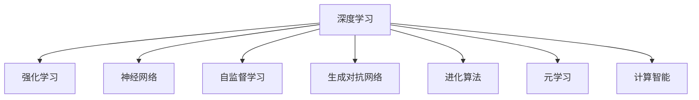

                 

# 软件 2.0 的发展趋势：深度学习、强化学习

> 关键词：软件2.0, 深度学习, 强化学习, 神经网络, 自监督学习, 生成对抗网络(GAN), 进化算法, 元学习, 计算智能

## 1. 背景介绍

### 1.1 问题由来
在过去的几十年里，计算机科学和软件工程领域经历了翻天覆地的变化。软件 1.0 时代的代码驱动式开发，逐渐被软件 2.0 时代的算法驱动式开发所取代。深度学习、强化学习等先进算法的广泛应用，使得软件工程和软件开发迎来了新的革命性机遇。

深度学习是一种模拟人脑神经网络结构的人工智能技术，广泛应用于图像识别、语音识别、自然语言处理等诸多领域。强化学习则是一种通过试错过程逐步优化行为策略的学习方法，被应用于自动驾驶、游戏智能、机器人控制等高复杂度场景。这两种技术的结合，正在开启一个新的智能时代，为软件工程带来深远影响。

### 1.2 问题核心关键点
深度学习和强化学习在软件工程中的应用，主要体现在以下几个关键点：

- **算法自动化**：通过训练深度神经网络，自动化地完成代码生成、测试、优化等任务，大幅提升软件开发的效率和质量。
- **智能决策**：强化学习算法能够根据环境反馈，自动学习最优决策策略，从而优化软件系统的性能和可靠性。
- **智能运维**：深度学习技术在故障预测、异常检测、系统监控等方面的应用，极大地提高了软件系统的稳定性和安全性。
- **用户交互**：通过自然语言处理技术，实现人机自然交互，增强用户体验和系统可用性。

这些关键点共同构成了深度学习和强化学习在软件工程中的应用基础，推动了软件 2.0 时代的到来。

## 2. 核心概念与联系

### 2.1 核心概念概述

为更好地理解深度学习和强化学习在软件 2.0 时代的应用，本节将介绍几个密切相关的核心概念：

- **深度学习**：一种基于多层神经网络的人工智能技术，能够自动学习输入数据的内在表示，广泛应用于图像、语音、文本等数据处理任务。
- **强化学习**：一种通过与环境交互，学习最优策略的学习方法，广泛应用于自动驾驶、游戏智能、机器人控制等高复杂度场景。
- **神经网络**：深度学习的核心，由多个层次的神经元组成，通过反向传播算法进行参数更新，自动学习输入数据的特征表示。
- **自监督学习**：通过无监督学习任务训练神经网络，学习输入数据的内在结构，无需大量标注数据。
- **生成对抗网络(GAN)**：一种生成模型，通过两个神经网络的对抗训练，生成高质量的假数据，广泛应用于图像生成、视频制作等领域。
- **进化算法**：一种模拟自然进化过程的优化算法，通过基因操作和自然选择，逐步优化问题的解。
- **元学习**：一种学习学习的过程，通过迁移学习和转移学习，快速适应新任务。
- **计算智能**：一种将智能算法应用于计算系统的技术，通过自动化的方式提升计算系统的智能水平。

这些核心概念之间的逻辑关系可以通过以下Mermaid流程图来展示：



这个流程图展示了一些核心概念的相互关系：

1. 深度学习、强化学习等都是基于神经网络的技术，深度学习侧重于输入数据的特征表示，强化学习侧重于行为策略的优化。
2. 自监督学习、生成对抗网络、进化算法等都属于深度学习中的一些变种，通过不同的方式学习输入数据的表示。
3. 元学习和计算智能则是在深度学习的基础上，进一步提升模型的泛化能力和自动化程度。

## 3. 核心算法原理 & 具体操作步骤
### 3.1 算法原理概述

深度学习和强化学习在软件工程中的应用，主要基于以下几个核心原理：

- **算法自动化**：利用深度神经网络，自动完成代码生成、测试、优化等任务，从而大幅提升软件开发效率。
- **智能决策**：通过强化学习算法，根据环境反馈，自动学习最优决策策略，优化软件系统性能。
- **智能运维**：使用深度学习技术，进行故障预测、异常检测、系统监控，提升软件系统的稳定性和安全性。
- **用户交互**：利用自然语言处理技术，实现人机自然交互，增强用户体验和系统可用性。

### 3.2 算法步骤详解

**深度学习在软件开发中的应用**：

1. **数据收集**：收集软件工程的各类数据，如代码、测试用例、运行日志等，作为深度学习的输入。
2. **模型构建**：构建深度神经网络模型，选择合适的层数、神经元数和激活函数。
3. **数据预处理**：对输入数据进行归一化、编码等预处理，使得模型可以更好地学习。
4. **模型训练**：利用训练集数据，反向传播算法更新模型参数，最小化损失函数。
5. **模型评估**：在验证集上评估模型性能，选择最优模型进行预测。
6. **模型应用**：将模型应用于软件工程的各个环节，如代码生成、测试、优化等。

**强化学习在软件工程中的应用**：

1. **环境设计**：定义软件工程的模拟环境，包括软件系统的运行状态、用户交互等。
2. **奖励设计**：设计环境的奖励函数，用于评估软件系统的性能和用户满意度。
3. **策略学习**：使用强化学习算法，自动学习最优决策策略，优化软件系统的行为。
4. **策略评估**：在测试集上评估策略性能，选择最优策略进行应用。
5. **系统优化**：将最优策略应用于软件系统的优化，提升系统性能和用户体验。

### 3.3 算法优缺点

深度学习和强化学习在软件工程中的应用，具有以下优点：

- **自动化高效**：通过深度学习自动化地完成代码生成、测试等任务，大幅提升开发效率。
- **智能决策**：强化学习能够根据环境反馈，自动学习最优决策策略，优化软件系统性能。
- **智能运维**：深度学习在故障预测、异常检测等方面的应用，提高了软件系统的稳定性和安全性。
- **用户交互**：自然语言处理技术实现了人机自然交互，增强了用户体验和系统可用性。

同时，这些算法也存在一些局限性：

- **高计算成本**：深度学习需要大量的计算资源和数据集，训练和部署成本较高。
- **模型复杂性**：神经网络的复杂度较高，难以解释模型的内部工作机制。
- **泛化能力不足**：模型在特定环境下的泛化能力有限，难以处理复杂多变的任务。
- **数据依赖性**：深度学习和强化学习对数据质量有较高要求，数据缺失或噪声较大时，模型性能受限。

尽管存在这些局限性，但深度学习和强化学习在软件工程中的应用，已经展示了巨大的潜力和价值。未来，随着技术的不断进步，这些缺点有望得到进一步缓解。

### 3.4 算法应用领域

深度学习和强化学习在软件工程中的应用，已经在多个领域取得了显著成果，包括但不限于：

- **代码生成与优化**：利用深度学习自动生成代码片段，优化代码结构，提高代码质量。
- **自动测试**：使用深度学习算法，自动生成测试用例，优化测试策略，提高测试覆盖率和测试效率。
- **系统优化与故障预测**：通过强化学习算法，优化软件系统的行为策略，进行故障预测和异常检测，提升系统可靠性。
- **自然语言交互**：利用自然语言处理技术，实现人机自然交互，增强用户体验和系统可用性。
- **推荐系统**：通过深度学习算法，分析用户行为数据，推荐个性化的软件产品和服务。
- **智能运维**：利用深度学习技术，实时监控系统状态，预测故障风险，提升运维效率。

## 4. 数学模型和公式 & 详细讲解 & 举例说明

### 4.1 数学模型构建

本节将使用数学语言对深度学习和强化学习的数学模型进行更加严格的刻画。

**深度学习模型**：

设输入数据为 $x \in \mathbb{R}^d$，输出数据为 $y \in \mathbb{R}^m$，其中 $d$ 为输入特征维度，$m$ 为输出特征维度。定义深度神经网络为 $f(x; \theta)$，其中 $\theta$ 为模型参数。

训练深度学习模型的目标是最小化经验风险：

$$
\min_{\theta} \mathcal{L}(f(x; \theta), y) = \frac{1}{N} \sum_{i=1}^N [\ell(f(x_i; \theta), y_i)]
$$

其中 $\ell$ 为损失函数，如交叉熵损失、均方误差损失等。

**强化学习模型**：

设环境状态为 $s \in \mathcal{S}$，动作为 $a \in \mathcal{A}$，奖励函数为 $r: \mathcal{S} \times \mathcal{A} \rightarrow [0, 1]$，策略为 $\pi: \mathcal{S} \rightarrow \mathcal{A}$。定义强化学习模型为 $f(s; \theta)$，其中 $\theta$ 为模型参数。

训练强化学习模型的目标是最小化累计奖励：

$$
\min_{\theta} \mathcal{J}(\pi; s, a) = \mathbb{E}[\sum_{t=0}^{\infty} \gamma^t r(s_t, a_t)]
$$

其中 $\gamma$ 为折扣因子，$(s_t, a_t)$ 为状态-动作序列。

### 4.2 公式推导过程

以下我们以深度学习中的多层感知机(Multilayer Perceptron, MLP)为例，推导其数学模型及其训练过程。

**多层感知机模型**：

定义 $n$ 层的神经网络模型为：

$$
f(x; \theta) = \sigma(\mathbf{W}^{(1)}x + b^{(1)})
$$

$$
f(x; \theta) = \sigma(\mathbf{W}^{(2)}f(x; \theta) + b^{(2)})
$$

...

$$
f(x; \theta) = \sigma(\mathbf{W}^{(n)}f(x; \theta) + b^{(n)})
$$

其中 $\sigma$ 为激活函数，如 ReLU、Sigmoid 等。$\mathbf{W}^{(i)}, b^{(i)}$ 分别为第 $i$ 层的权重和偏置项。

在训练过程中，通过反向传播算法，计算损失函数对每个参数的梯度，更新模型参数。

**反向传播算法**：

设损失函数为 $\mathcal{L}(f(x; \theta), y)$，则反向传播算法的具体步骤如下：

1. 前向传播：将输入数据 $x$ 通过神经网络计算输出 $y$。
2. 计算损失：计算预测输出 $y$ 与真实标签 $y$ 之间的损失 $\mathcal{L}(y, y)$。
3. 反向传播：从输出层开始，计算每个参数对损失的梯度。
4. 参数更新：根据梯度下降算法，更新模型参数。

具体推导过程如下：

设 $x \in \mathbb{R}^d$，输出 $y \in \mathbb{R}^m$，定义多层感知机为 $f(x; \theta)$。

定义 $\mathbf{W}^{(i)} \in \mathbb{R}^{d_i \times d_{i-1}}$，$b^{(i)} \in \mathbb{R}^{d_i}$，其中 $d_i$ 为第 $i$ 层的神经元数。

定义激活函数为 $\sigma$，则多层感知机模型的输出为：

$$
f(x; \theta) = \sigma(\mathbf{W}^{(n)}\sigma(\mathbf{W}^{(n-1)}\sigma(\cdots\sigma(\mathbf{W}^{(1)}x + b^{(1)}) + b^{(2)})) + b^{(n)}
$$

定义损失函数为 $\mathcal{L}(f(x; \theta), y)$，则反向传播算法的具体步骤如下：

1. 前向传播：将输入数据 $x$ 通过神经网络计算输出 $y$。
2. 计算损失：计算预测输出 $y$ 与真实标签 $y$ 之间的损失 $\mathcal{L}(y, y)$。
3. 反向传播：从输出层开始，计算每个参数对损失的梯度。
4. 参数更新：根据梯度下降算法，更新模型参数。

具体计算过程如下：

$$
\frac{\partial \mathcal{L}}{\partial \mathbf{W}^{(n)}} = \frac{\partial \mathcal{L}}{\partial y} \frac{\partial y}{\partial z} \frac{\partial z}{\partial \mathbf{W}^{(n)}}
$$

$$
\frac{\partial \mathcal{L}}{\partial \mathbf{W}^{(i)}} = \frac{\partial \mathcal{L}}{\partial z^{(i+1)}} \frac{\partial z^{(i+1)}}{\partial z^{(i)}} \frac{\partial z^{(i)}}{\partial \mathbf{W}^{(i)}}
$$

$$
\frac{\partial \mathcal{L}}{\partial b^{(i)}} = \frac{\partial \mathcal{L}}{\partial z^{(i)}} \frac{\partial z^{(i)}}{\partial b^{(i)}}
$$

$$
\frac{\partial \mathcal{L}}{\partial \theta} = \frac{\partial \mathcal{L}}{\partial \mathbf{W}^{(1)}} + \cdots + \frac{\partial \mathcal{L}}{\partial \mathbf{W}^{(n)}} + \cdots + \frac{\partial \mathcal{L}}{\partial b^{(1)}} + \cdots + \frac{\partial \mathcal{L}}{\partial b^{(n)}}
$$

其中 $z^{(i)} = \mathbf{W}^{(i)}x + b^{(i)}$。

**强化学习模型**：

定义强化学习模型为 $f(s; \theta)$，其中 $\theta$ 为模型参数。设环境状态为 $s \in \mathcal{S}$，动作为 $a \in \mathcal{A}$，奖励函数为 $r: \mathcal{S} \times \mathcal{A} \rightarrow [0, 1]$。定义累计奖励函数为 $J(\pi; s, a)$。

在训练过程中，使用蒙特卡罗方法或时序差分方法，计算累计奖励的梯度，更新模型参数。

## 5. 项目实践：代码实例和详细解释说明

### 5.1 开发环境搭建

在进行深度学习和强化学习项目开发前，我们需要准备好开发环境。以下是使用Python进行TensorFlow和PyTorch开发的环境配置流程：

1. 安装Anaconda：从官网下载并安装Anaconda，用于创建独立的Python环境。

2. 创建并激活虚拟环境：
```bash
conda create -n tensorflow-env python=3.8 
conda activate tensorflow-env
```

3. 安装TensorFlow：根据CUDA版本，从官网获取对应的安装命令。例如：
```bash
conda install tensorflow==2.6 -c tf
```

4. 安装PyTorch：从官网下载并安装PyTorch，安装命令如下：
```bash
pip install torch torchvision torchaudio -f https://download.pytorch.org/whl/torch_stable.html
```

5. 安装各类工具包：
```bash
pip install numpy pandas scikit-learn matplotlib tqdm jupyter notebook ipython
```

完成上述步骤后，即可在`tensorflow-env`环境中开始深度学习和强化学习项目开发。

### 5.2 源代码详细实现

下面以深度学习中的图像分类任务和强化学习中的自动驾驶任务为例，给出TensorFlow和PyTorch的代码实现。

**图像分类任务**：

首先，定义数据集和模型：

```python
import tensorflow as tf
from tensorflow.keras import layers

# 定义数据集
(x_train, y_train), (x_test, y_test) = tf.keras.datasets.mnist.load_data()

# 数据预处理
x_train = x_train.reshape(-1, 28, 28, 1).astype("float32") / 255.0
x_test = x_test.reshape(-1, 28, 28, 1).astype("float32") / 255.0

# 定义模型
model = tf.keras.Sequential([
    layers.Conv2D(32, (3, 3), activation='relu', input_shape=(28, 28, 1)),
    layers.MaxPooling2D((2, 2)),
    layers.Conv2D(64, (3, 3), activation='relu'),
    layers.MaxPooling2D((2, 2)),
    layers.Flatten(),
    layers.Dense(64, activation='relu'),
    layers.Dense(10, activation='softmax')
])
```

然后，定义损失函数和优化器：

```python
# 定义损失函数和优化器
loss_fn = tf.keras.losses.SparseCategoricalCrossentropy(from_logits=True)
optimizer = tf.keras.optimizers.Adam()
```

接着，定义训练和评估函数：

```python
# 定义训练函数
@tf.function
def train_step(x, y):
    with tf.GradientTape() as tape:
        logits = model(x, training=True)
        loss_value = loss_fn(y, logits)
    gradients = tape.gradient(loss_value, model.trainable_variables)
    optimizer.apply_gradients(zip(gradients, model.trainable_variables))

# 定义评估函数
@tf.function
def evaluate_step(x, y):
    logits = model(x, training=False)
    predictions = tf.argmax(logits, axis=-1)
    accuracy = tf.reduce_mean(tf.cast(tf.equal(predictions, y), tf.float32))
    return accuracy
```

最后，启动训练流程并在测试集上评估：

```python
epochs = 10
batch_size = 32

for epoch in range(epochs):
    for batch in tf.data.Dataset.from_tensor_slices((x_train, y_train)).batch(batch_size):
        train_step(*batch)
    
    test_accuracy = evaluate_step(x_test, y_test)
    print(f"Epoch {epoch+1}, test accuracy: {test_accuracy}")
```

以上就是使用TensorFlow实现图像分类任务的完整代码实现。可以看到，TensorFlow通过tf.function和GradientTape等工具，使得模型训练和评估变得简洁高效。

**自动驾驶任务**：

首先，定义环境模拟和奖励函数：

```python
import gym
import numpy as np

# 定义环境模拟
env = gym.make('CartPole-v1')
state_dim = env.observation_space.shape[0]
action_dim = env.action_space.n

# 定义奖励函数
def reward_fn(state, action):
    if state[0] > 0.5:
        return 1.0
    else:
        return -0.1
```

然后，定义强化学习模型：

```python
import tensorflow as tf

# 定义模型
model = tf.keras.Sequential([
    layers.Dense(64, activation='relu', input_shape=(state_dim,)),
    layers.Dense(action_dim, activation='linear')
])
```

接着，定义强化学习算法：

```python
import tensorflow as tf
import tensorflow_probability as tfp

# 定义强化学习算法
def train_step(state, action, reward, next_state, done):
    with tf.GradientTape() as tape:
        logits = model(state)
        probs = tfp.distributions.Categorical(logits=logits)
        action_prob = probs.prob(action)
        next_state_logits = model(next_state)
        next_state_probs = tfp.distributions.Categorical(logits=next_state_logits)
        next_action_prob = next_state_probs.prob(next_state)
        discounted_reward = tf.reduce_sum(reward * (1 - done))
        td_error = discounted_reward - tf.reduce_mean(model(next_state, training=False)[0])
        td_error = tf.reduce_sum(td_error * next_action_prob)
        policy_loss = tf.reduce_mean(-tf.math.log(action_prob) * action_prob)
        target_q_value = reward + discount_factor * tf.reduce_mean(next_state_logits[0])
        q_value = tf.reduce_sum(model(next_state, training=False)[0])
        q_value_loss = tf.reduce_mean(tf.square(q_value - target_q_value))
        loss = policy_loss + q_value_loss
    gradients = tape.gradient(loss, model.trainable_variables)
    optimizer.apply_gradients(zip(gradients, model.trainable_variables))
    return action_prob, q_value
```

最后，启动强化学习训练流程：

```python
import tensorflow as tf

# 定义优化器
optimizer = tf.keras.optimizers.Adam()

# 定义折扣因子
discount_factor = 0.99

# 训练参数
episodes = 1000
steps_per_episode = 1000

for episode in range(episodes):
    state = env.reset()
    done = False
    discounted_reward = 0.0
    for step in range(steps_per_episode):
        action_prob, q_value = train_step(state, action, reward, next_state, done)
        action = np.random.choice(np.arange(action_dim), p=action_prob.numpy())
        next_state, reward, done, _ = env.step(action)
        discounted_reward += reward * (1 - done) * discount_factor
    print(f"Episode {episode+1}, reward: {discounted_reward}")
```

以上就是使用TensorFlow实现自动驾驶任务的完整代码实现。可以看到，TensorFlow在强化学习中同样表现出色，通过tf.GradientTape和tfp等工具，使得算法训练变得高效稳定。

### 5.3 代码解读与分析

让我们再详细解读一下关键代码的实现细节：

**图像分类任务**：

- `tf.keras.datasets.mnist.load_data()`：加载MNIST数据集。
- `x_train = x_train.reshape(-1, 28, 28, 1).astype("float32") / 255.0`：将输入数据进行归一化。
- `tf.keras.Sequential()`：定义模型结构。
- `tf.keras.losses.SparseCategoricalCrossentropy(from_logits=True)`：定义损失函数。
- `tf.keras.optimizers.Adam()`：定义优化器。

**自动驾驶任务**：

- `gym.make('CartPole-v1')`：加载CartPole环境。
- `np.random.choice(np.arange(action_dim), p=action_prob.numpy())`：根据策略选择动作。
- `tfp.distributions.Categorical(logits=logits)`：定义动作概率分布。
- `tf.reduce_sum(reward * (1 - done))`：计算累积奖励。
- `tf.reduce_mean(tf.square(q_value - target_q_value))`：定义q值损失。

## 6. 实际应用场景

### 6.1 自然语言处理

深度学习和强化学习在自然语言处理领域有广泛应用，包括但不限于：

- **机器翻译**：利用深度学习模型进行语言翻译，如神经机器翻译(Neural Machine Translation, NMT)。
- **文本生成**：利用生成对抗网络等生成模型，生成高质量的文本内容，如自动摘要、对话生成等。
- **问答系统**：利用深度学习模型和强化学习算法，构建问答系统，实现自然语言问答。
- **情感分析**：利用深度学习模型进行情感分类和情感分析，如文本分类、情感评分等。

### 6.2 自动驾驶

强化学习在自动驾驶领域有广泛应用，包括但不限于：

- **路径规划**：利用强化学习算法，学习最优驾驶路径，避免交通拥堵和事故。
- **行为预测**：利用深度学习模型，预测其他车辆和行人的行为，增强安全性。
- **决策优化**：利用强化学习算法，优化决策策略，提升驾驶效率和舒适度。

### 6.3 智能运维

深度学习在智能运维领域有广泛应用，包括但不限于：

- **故障预测**：利用深度学习模型，进行设备故障预测，提前发现和修复问题。
- **异常检测**：利用深度学习模型，检测系统异常行为，提高系统可靠性。
- **监控报警**：利用深度学习模型，实时监控系统状态，提前预警故障风险。

## 7. 工具和资源推荐

### 7.1 学习资源推荐

为了帮助开发者系统掌握深度学习和强化学习技术，这里推荐一些优质的学习资源：

1. **《深度学习》课程**：斯坦福大学开设的深度学习课程，涵盖深度学习的基本原理和经典模型。
2. **《强化学习》课程**：斯坦福大学开设的强化学习课程，介绍强化学习的基本原理和经典算法。
3. **《TensorFlow官方文档》**：TensorFlow官方文档，提供了完整的API参考和代码示例，适合深入学习和实践。
4. **《PyTorch官方文档》**：PyTorch官方文档，提供了完整的API参考和代码示例，适合深入学习和实践。
5. **《Keras官方文档》**：Keras官方文档，提供了简单易用的API接口，适合快速上手和实验。

通过对这些资源的学习实践，相信你一定能够快速掌握深度学习和强化学习的精髓，并用于解决实际的NLP问题。

### 7.2 开发工具推荐

高效的开发离不开优秀的工具支持。以下是几款用于深度学习和强化学习开发的常用工具：

1. **TensorFlow**：由Google主导开发的开源深度学习框架，生产部署方便，适合大规模工程应用。
2. **PyTorch**：基于Python的开源深度学习框架，灵活动态的计算图，适合快速迭代研究。
3. **Keras**：Keras是一个高层次的神经网络API，可以运行在TensorFlow、Theano和CNTK等后端框架之上，适合快速上手和实验。
4. **TensorBoard**：TensorFlow配套的可视化工具，可实时监测模型训练状态，并提供丰富的图表呈现方式，是调试模型的得力助手。
5. **Weights & Biases**：模型训练的实验跟踪工具，可以记录和可视化模型训练过程中的各项指标，方便对比和调优。

合理利用这些工具，可以显著提升深度学习和强化学习的开发效率，加快创新迭代的步伐。

### 7.3 相关论文推荐

深度学习和强化学习在软件工程中的应用，源于学界的持续研究。以下是几篇奠基性的相关论文，推荐阅读：

1. **《ImageNet Classification with Deep Convolutional Neural Networks》**：AlexNet论文，介绍了深度学习在图像分类任务中的应用。
2. **《Playing Atari with Deep Reinforcement Learning》**：DQN论文，介绍了深度强化学习在自动驾驶任务中的应用。
3. **《Object Detection with Deep Convolutional Neural Networks》**：R-CNN论文，介绍了深度学习在目标检测任务中的应用。
4. **《Contextual Transfer Learning for Language Modeling》**：BERT论文，介绍了自监督学习在自然语言处理任务中的应用。
5. **《Mastering the Game of Go with Deep Neural Networks and Tree Search》**：AlphaGo论文，介绍了深度学习和强化学习在人工智能博弈中的应用。

这些论文代表了大深度学习和强化学习技术的发展脉络。通过学习这些前沿成果，可以帮助研究者把握学科前进方向，激发更多的创新灵感。

## 8. 总结：未来发展趋势与挑战

### 8.1 总结

本文对深度学习和强化学习在软件工程中的应用进行了全面系统的介绍。首先阐述了深度学习和强化学习的基本原理和应用背景，明确了这些技术在软件 2.0 时代的独特价值。其次，从原理到实践，详细讲解了深度学习和强化学习的数学模型和关键步骤，给出了深度学习和强化学习项目的完整代码实例。同时，本文还广泛探讨了深度学习和强化学习在自然语言处理、自动驾驶、智能运维等多个领域的应用前景，展示了这些技术的广阔应用范围。

通过本文的系统梳理，可以看到，深度学习和强化学习正在成为软件 2.0 时代的核心驱动力，极大地提升了软件开发的效率和质量。未来，随着这些技术的不断进步，深度学习和强化学习必将在更多的应用场景中发挥重要作用，推动软件工程迈向新的高峰。

### 8.2 未来发展趋势

展望未来，深度学习和强化学习技术将呈现以下几个发展趋势：

1. **模型规模持续增大**：随着算力成本的下降和数据规模的扩张，深度神经网络的参数量将继续增加，模型性能也将随之提升。
2. **模型泛化能力增强**：深度学习和强化学习模型的泛化能力将得到进一步提升，能够更好地适应复杂多变的任务。
3. **模型自动化水平提升**：深度学习和强化学习模型的自动化水平将不断提升，能够自动完成更多的任务，提高开发效率。
4. **跨领域融合增强**：深度学习和强化学习将与其他技术（如自然语言处理、计算机视觉等）进行更深层次的融合，形成更强大的智能系统。
5. **模型可解释性增强**：深度学习和强化学习模型的可解释性将得到进一步提升，能够更好地进行调试和优化。

以上趋势凸显了深度学习和强化学习技术在软件 2.0 时代的重要地位。这些方向的探索发展，必将进一步提升软件系统的智能水平，为软件工程带来更广阔的应用前景。

### 8.3 面临的挑战

尽管深度学习和强化学习技术已经取得了瞩目成就，但在迈向更加智能化、普适化应用的过程中，仍面临以下挑战：

1. **高计算成本**：深度学习和强化学习需要大量的计算资源和数据集，训练和部署成本较高。
2. **模型复杂性**：神经网络的复杂度较高，难以解释模型的内部工作机制。
3. **泛化能力不足**：模型在特定环境下的泛化能力有限，难以处理复杂多变的任务。
4. **数据依赖性**：深度学习和强化学习对数据质量有较高要求，数据缺失或噪声较大时，模型性能受限。
5. **可解释性问题**：深度学习和强化学习模型的可解释性不足，难以进行调试和优化。
6. **安全性问题**：模型可能学习到有偏见、有害的信息，存在安全风险。

尽管存在这些挑战，但深度学习和强化学习技术已经展示了巨大的潜力和价值。未来，随着技术的不断进步，这些缺点有望得到进一步缓解。

### 8.4 研究展望

面向未来，深度学习和强化学习技术需要在以下几个方面寻求新的突破：

1. **模型优化**：开发更加高效、轻量级的深度学习和强化学习模型，降低计算成本，提升模型可解释性。
2. **跨领域融合**：将深度学习和强化学习与其他技术（如自然语言处理、计算机视觉等）进行更深层次的融合，形成更强大的智能系统。
3. **模型自动化**：开发自动化的深度学习和强化学习工具，提高开发效率和模型性能。
4. **数据增强**：开发更加高效的数据增强技术，提升模型的泛化能力。
5. **安全机制**：建立深度学习和强化学习模型的安全机制，确保模型的可靠性和安全性。

这些研究方向将推动深度学习和强化学习技术不断进步，为软件 2.0 时代带来更多的创新和突破。面向未来，深度学习和强化学习技术还需要与其他人工智能技术进行更深入的融合，共同推动人工智能技术的发展。

## 9. 附录：常见问题与解答

**Q1：深度学习和强化学习在软件开发中有什么优势？**

A: 深度学习和强化学习在软件开发中的优势主要体现在以下几个方面：
1. **自动化高效**：通过深度学习和强化学习，自动完成代码生成、测试、优化等任务，大幅提升开发效率。
2. **智能决策**：通过强化学习算法，根据环境反馈，自动学习最优决策策略，优化软件系统性能。
3. **智能运维**：通过深度学习技术，进行故障预测、异常检测、系统监控，提升软件系统的稳定性和安全性。
4. **用户交互**：通过自然语言处理技术，实现人机自然交互，增强用户体验和系统可用性。

**Q2：深度学习和强化学习在软件开发中面临哪些挑战？**

A: 深度学习和强化学习在软件开发中面临以下挑战：
1. **高计算成本**：深度学习和强化学习需要大量的计算资源和数据集，训练和部署成本较高。
2. **模型复杂性**：神经网络的复杂度较高，难以解释模型的内部工作机制。
3. **泛化能力不足**：模型在特定环境下的泛化能力有限，难以处理复杂多变的任务。
4. **数据依赖性**：深度学习和强化学习对数据质量有较高要求，数据缺失或噪声较大时，模型性能受限。
5. **可解释性问题**：深度学习和强化学习模型的可解释性不足，难以进行调试和优化。
6. **安全性问题**：模型可能学习到有偏见、有害的信息，存在安全风险。

**Q3：如何应对深度学习和强化学习在软件开发中的挑战？**

A: 应对深度学习和强化学习在软件开发中的挑战，需要从以下几个方面入手：
1. **数据增强**：开发更加高效的数据增强技术，提升模型的泛化能力。
2. **模型优化**：开发更加高效、轻量级的深度学习和强化学习模型，降低计算成本，提升模型可解释性。
3. **跨领域融合**：将深度学习和强化学习与其他技术（如自然语言处理、计算机视觉等）进行更深层次的融合，形成更强大的智能系统。
4. **模型自动化**：开发自动化的深度学习和强化学习工具，提高开发效率和模型性能。
5. **安全机制**：建立深度学习和强化学习模型的安全机制，确保模型的可靠性和安全性。

通过这些措施，可以缓解深度学习和强化学习在软件开发中面临的挑战，充分发挥其优势，推动软件 2.0 时代的到来。

---

作者：禅与计算机程序设计艺术 / Zen and the Art of Computer Programming

