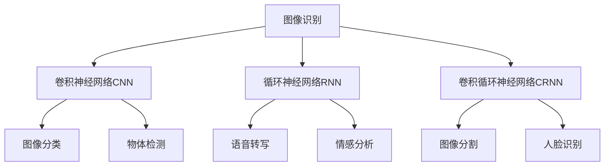

                 

## 1. 背景介绍

### 1.1 问题由来

随着人工智能技术的不断发展，软件设计范式正在经历着深刻变革。从传统基于函数调用的软件1.0时代，到人工智能驱动的软件2.0时代，基于深度学习模型的应用愈发广泛，如图像识别、语音识别、自然语言处理、推荐系统等。本文旨在深入探讨软件2.0时代中，图像识别和语音识别技术的应用场景，并对其核心概念和算法原理进行详细解析。

### 1.2 问题核心关键点

- **图像识别**：通过深度学习模型自动提取图像中的关键信息，实现自动标注、图像分类、目标检测等任务。
- **语音识别**：将人类语音转换为文本，使得机器能够理解和处理人类语言。
- **深度学习模型**：包括卷积神经网络（CNN）、循环神经网络（RNN）、长短时记忆网络（LSTM）、卷积循环神经网络（CRNN）等，是实现图像识别和语音识别的核心。
- **数据集与预训练模型**：大量标注数据集和预训练模型是深度学习模型训练的基础，如ImageNet、COCO、Speech Commands等。
- **迁移学习**：在特定领域内微调预训练模型，以适应新任务的需求。

### 1.3 问题研究意义

在软件2.0时代，图像识别和语音识别技术的广泛应用推动了各行各业的数字化转型。例如，智能安防、医疗影像分析、自动驾驶、智能客服等场景中，图像和语音识别的精准度直接决定了系统的性能和用户体验。通过深入研究这些技术的原理与应用，可以进一步推动人工智能技术在各行业的落地与普及，助力产业升级与创新。

## 2. 核心概念与联系

### 2.1 核心概念概述

在探讨图像识别和语音识别技术时，需要掌握以下核心概念：

- **图像识别**：基于深度学习模型自动分析图像内容，包括物体检测、图像分割、人脸识别等任务。
- **语音识别**：通过深度学习模型自动将人类语音转换为文本，包括语音转写、声纹识别、情感分析等任务。
- **深度学习模型**：利用多层神经网络对输入数据进行特征提取和分类。
- **迁移学习**：在特定领域内微调预训练模型，提升模型的适应性和泛化能力。

这些概念之间的逻辑关系可以通过以下Mermaid流程图来展示：



这个流程图展示了图像识别和语音识别的核心算法及其应用场景。

## 3. 核心算法原理 & 具体操作步骤

### 3.1 算法原理概述

图像识别和语音识别的核心算法原理包括卷积神经网络（CNN）和循环神经网络（RNN）等深度学习模型。这些模型通过多层非线性变换，提取输入数据的高级特征，并利用分类器将这些特征映射到不同的类别上。

- **卷积神经网络（CNN）**：用于处理图像数据的模型，通过卷积操作提取图像的局部特征，池化操作减少特征维度，并使用全连接层进行分类。
- **循环神经网络（RNN）**：用于处理序列数据的模型，通过时间维度上的循环结构，捕捉序列数据的时序特征，并使用全连接层进行分类。

### 3.2 算法步骤详解

#### 图像识别

1. **数据预处理**：将图像数据进行归一化、缩放等处理，使其适合模型输入。
2. **特征提取**：通过卷积层、池化层等操作，提取图像的局部特征。
3. **特征融合**：通过全连接层，将提取的特征进行融合，生成高维特征向量。
4. **分类器输出**：通过Softmax层或其他分类器，将高维特征向量映射到不同的类别上。
5. **模型评估**：使用测试集对模型进行评估，计算准确率、召回率、F1值等指标。

#### 语音识别

1. **数据预处理**：将语音数据进行分帧、特征提取等处理，使其适合模型输入。
2. **特征提取**：通过MFCC（Mel频率倒谱系数）等特征提取方法，将语音信号转换为特征向量。
3. **特征序列建模**：通过RNN、LSTM等模型，对特征序列进行建模，捕捉时序特征。
4. **分类器输出**：通过Softmax层或其他分类器，将特征序列映射到不同的词汇上。
5. **模型评估**：使用测试集对模型进行评估，计算词错误率（WER）、字符错误率（CER）等指标。

### 3.3 算法优缺点

图像识别和语音识别的深度学习模型具有以下优点：

- **精度高**：深度学习模型可以自动学习输入数据的高级特征，从而实现高精度的分类。
- **可扩展性强**：通过迁移学习，可以在不同任务和领域中快速部署和优化模型。
- **适应性强**：适用于各种类型的图像和语音数据，可以处理复杂的多模态数据。

然而，这些模型也存在一些缺点：

- **数据依赖**：深度学习模型需要大量标注数据进行训练，数据获取成本较高。
- **计算资源需求大**：深度学习模型通常需要大量的计算资源，训练和推理耗时较长。
- **可解释性差**：深度学习模型通常被视为“黑盒”模型，难以解释其内部工作机制。

### 3.4 算法应用领域

图像识别和语音识别技术在多个领域得到了广泛应用：

- **自动驾驶**：通过图像识别和物体检测技术，自动驾驶系统能够实时分析和理解道路环境，实现自主驾驶。
- **智能安防**：通过人脸识别和行为分析技术，智能安防系统能够实现人员进出监控、异常行为检测等功能。
- **医疗影像分析**：通过图像分割和目标检测技术，医疗影像系统能够自动识别和标注病变区域，辅助医生进行诊断。
- **智能客服**：通过语音识别和情感分析技术，智能客服系统能够自动处理用户语音，提供个性化服务。
- **智能家居**：通过图像识别和语音识别技术，智能家居系统能够实现语音控制、图像识别等交互功能。

## 4. 数学模型和公式 & 详细讲解 & 举例说明

### 4.1 数学模型构建

图像识别和语音识别的数学模型包括卷积神经网络（CNN）和循环神经网络（RNN）等深度学习模型。这里以CNN为例，介绍其数学模型构建过程。

假设输入图像为 $x \in \mathbb{R}^{m \times n \times c}$，其中 $m$ 和 $n$ 分别为图像的高度和宽度，$c$ 为颜色通道数。卷积神经网络由卷积层、池化层、全连接层等组成，其结构如图1所示。


### 4.2 公式推导过程

CNN的公式推导主要包括以下几个步骤：

1. **卷积操作**：对于输入图像的每个像素，卷积核进行卷积运算，生成特征图。公式如下：
   $$
   f(x, k) = \sum_{i=1}^{m}\sum_{j=1}^{n}\sum_{k=1}^{c} x_{i,j,k} * k_{i,j,k}
   $$

2. **激活函数**：卷积操作后，通过激活函数（如ReLU）对特征图进行非线性变换。公式如下：
   $$
   a_i = \max(0, f(x, k))
   $$

3. **池化操作**：对激活后的特征图进行池化操作，减小特征维度。常用池化方式包括最大池化和平均池化。公式如下：
   $$
   p_i = \max_{j=1}^{m}\max_{k=1}^{n} a_{i,j,k}
   $$

4. **全连接层**：将池化后的特征图展开为向量，通过全连接层进行分类。公式如下：
   $$
   y = \sum_{i=1}^{n} w_i a_i + b
   $$

其中，$w_i$ 为全连接层的权重，$b$ 为偏置项。

### 4.3 案例分析与讲解

以ImageNet数据集为例，展示CNN在图像分类任务中的应用。ImageNet数据集包含1400万张高分辨率图像，涵盖1000个类别。训练一个图像分类模型的步骤如下：

1. **数据预处理**：将图像数据归一化，使其适合模型输入。
2. **特征提取**：通过卷积层、池化层等操作，提取图像的局部特征。
3. **特征融合**：通过全连接层，将提取的特征进行融合，生成高维特征向量。
4. **分类器输出**：通过Softmax层或其他分类器，将高维特征向量映射到不同的类别上。
5. **模型评估**：使用测试集对模型进行评估，计算准确率、召回率、F1值等指标。

## 5. 项目实践：代码实例和详细解释说明

### 5.1 开发环境搭建

在图像识别和语音识别项目中，通常需要使用TensorFlow、PyTorch等深度学习框架。以下是使用Python进行TensorFlow开发的流程：

1. 安装Anaconda：从官网下载并安装Anaconda，用于创建独立的Python环境。

2. 创建并激活虚拟环境：
```bash
conda create -n tf-env python=3.8 
conda activate tf-env
```

3. 安装TensorFlow：根据CUDA版本，从官网获取对应的安装命令。例如：
```bash
conda install tensorflow-gpu -c pypi -c conda-forge
```

4. 安装各类工具包：
```bash
pip install numpy pandas scikit-learn matplotlib tqdm jupyter notebook ipython
```

完成上述步骤后，即可在`tf-env`环境中开始项目实践。

### 5.2 源代码详细实现

#### 图像识别

以下是使用TensorFlow实现图像分类的代码实现：

```python
import tensorflow as tf
from tensorflow.keras import layers, models

# 定义CNN模型
model = models.Sequential([
    layers.Conv2D(32, (3, 3), activation='relu', input_shape=(32, 32, 3)),
    layers.MaxPooling2D((2, 2)),
    layers.Conv2D(64, (3, 3), activation='relu'),
    layers.MaxPooling2D((2, 2)),
    layers.Conv2D(128, (3, 3), activation='relu'),
    layers.MaxPooling2D((2, 2)),
    layers.Flatten(),
    layers.Dense(10, activation='softmax')
])

# 编译模型
model.compile(optimizer='adam', loss='categorical_crossentropy', metrics=['accuracy'])

# 训练模型
model.fit(train_images, train_labels, epochs=10, validation_data=(test_images, test_labels))
```

#### 语音识别

以下是使用TensorFlow实现语音识别的代码实现：

```python
import tensorflow as tf
from tensorflow.keras.layers import Input, LSTM, Dense, Conv2D, Dropout, Flatten
from tensorflow.keras.models import Model

# 定义RNN模型
input_data = Input(shape=(None, ), name='input_layer')
x = LSTM(128)(input_data)
x = Dropout(0.5)(x)
output = Dense(1, activation='sigmoid')(x)

model = Model(inputs=input_data, outputs=output)
model.compile(loss='binary_crossentropy', optimizer='adam', metrics=['accuracy'])

# 训练模型
model.fit(train_features, train_labels, epochs=10, validation_data=(test_features, test_labels))
```

### 5.3 代码解读与分析

**图像识别**代码：

- **模型定义**：使用Sequential模型，按照卷积层、池化层、全连接层的顺序定义CNN模型。
- **模型编译**：使用Adam优化器，交叉熵损失函数，准确率作为评估指标。
- **模型训练**：使用fit函数进行模型训练，指定训练集和测试集。

**语音识别**代码：

- **模型定义**：使用LSTM层定义RNN模型，包含输入层、LSTM层、Dropout层、全连接层等。
- **模型编译**：使用二分类交叉熵损失函数，Adam优化器，准确率作为评估指标。
- **模型训练**：使用fit函数进行模型训练，指定训练集和测试集。

## 6. 实际应用场景

### 6.1 智能安防

智能安防系统通过图像识别和行为分析技术，实现人员进出监控、异常行为检测等功能。例如，人脸识别技术可以用于人脸门禁系统，实时识别和验证人员的身份信息，提高安全性和便捷性。行为分析技术可以用于监控视频，自动检测异常行为，如异常入侵、财物盗窃等，提高安全防护能力。

### 6.2 自动驾驶

自动驾驶系统通过图像识别和物体检测技术，实时分析和理解道路环境，实现自主驾驶。例如，摄像头可以捕捉道路和车辆的信息，通过图像识别技术，自动检测道路标志、行人、车辆等物体，并生成导航指令。雷达和激光雷达可以检测周围环境，通过物体检测技术，自动识别车辆和行人，提高安全性和可靠性。

### 6.3 医疗影像分析

医疗影像系统通过图像分割和目标检测技术，自动识别和标注病变区域，辅助医生进行诊断。例如，CT扫描图像可以通过图像分割技术，自动检测和分割肿瘤区域，提供精准的病变信息。MRI图像可以通过目标检测技术，自动识别和标注病变部位，提高诊断的准确性和效率。

### 6.4 智能客服

智能客服系统通过语音识别和情感分析技术，自动处理用户语音，提供个性化服务。例如，语音识别技术可以将用户语音转换为文本，自动生成对话内容，提高客服的效率和质量。情感分析技术可以分析用户的情绪和情感，自动调整客服策略，提高用户体验。

## 7. 工具和资源推荐

### 7.1 学习资源推荐

为了帮助开发者系统掌握图像识别和语音识别技术的理论基础和实践技巧，这里推荐一些优质的学习资源：

1. **《深度学习》书籍**：Ian Goodfellow等人著，全面介绍了深度学习的基本概念和算法原理，是学习深度学习的首选教材。

2. **Coursera《深度学习专项课程》**：由Andrew Ng教授主讲的深度学习课程，涵盖深度学习的基本概念和算法实现。

3. **Udacity《深度学习基础》课程**：由Sebastian Thrun教授主讲的深度学习课程，涵盖深度学习的基本概念和算法实现。

4. **Kaggle竞赛平台**：提供了大量图像识别和语音识别的竞赛数据集和解决方案，是实践深度学习算法的绝佳平台。

5. **TensorFlow官方文档**：提供了丰富的深度学习模型和算法实现，是学习深度学习的必备资源。

### 7.2 开发工具推荐

在图像识别和语音识别项目中，通常需要使用TensorFlow、PyTorch等深度学习框架。以下是几款常用的开发工具：

1. **TensorFlow**：由Google主导开发的开源深度学习框架，生产部署方便，适合大规模工程应用。

2. **PyTorch**：由Facebook开发的开源深度学习框架，灵活高效，适合研究和原型开发。

3. **Keras**：基于TensorFlow和Theano的高层次API，易于使用，适合快速原型开发。

4. **Weights & Biases**：模型训练的实验跟踪工具，可以记录和可视化模型训练过程中的各项指标，方便对比和调优。

5. **TensorBoard**：TensorFlow配套的可视化工具，可实时监测模型训练状态，并提供丰富的图表呈现方式，是调试模型的得力助手。

### 7.3 相关论文推荐

图像识别和语音识别技术的发展源于学界的持续研究。以下是几篇奠基性的相关论文，推荐阅读：

1. **《ImageNet Classification with Deep Convolutional Neural Networks》**：Alex Krizhevsky等人著，提出CNN模型，在ImageNet数据集上取得了当时的最好结果。

2. **《Connectionist Temporal Classification: Labelling Unsegmented Sequence Data with Recurrent Neural Networks》**：George Hinton等人著，提出CTC算法，用于语音识别中的序列标注任务。

3. **《Deep Speech: End-to-End Speech Recognition in English and Mandarin》**：Aurora Kim等人著，提出基于CNN和LSTM的端到端语音识别系统，显著提高了语音识别的准确性。

4. **《Rethinking the Inception Architecture for Computer Vision》**：Christian Szegedy等人著，提出Inception模块，大幅提高了CNN模型的准确性和效率。

5. **《Speech Commands: Online and offline speech-to-text using convolutional neural networks》**：Yunwen Lei等人著，提出基于CNN的语音识别系统，在多个语音命令识别任务上取得了优异的表现。

这些论文代表了大语言模型微调技术的发展脉络。通过学习这些前沿成果，可以帮助研究者把握学科前进方向，激发更多的创新灵感。

## 8. 总结：未来发展趋势与挑战

### 8.1 研究成果总结

图像识别和语音识别技术在软件2.0时代中得到了广泛应用，推动了各行各业的数字化转型。通过深度学习模型，可以实现高精度的图像分类、物体检测、语音识别、情感分析等任务，为智能安防、自动驾驶、医疗影像、智能客服等领域提供了强大的技术支持。

### 8.2 未来发展趋势

展望未来，图像识别和语音识别技术将呈现以下几个发展趋势：

1. **模型规模持续增大**：随着算力成本的下降和数据规模的扩张，深度学习模型的参数量将持续增长，超大规模模型将具有更强大的表现力。

2. **迁移学习更加高效**：迁移学习将变得更加高效和灵活，通过在大规模数据集上进行预训练，然后在特定领域进行微调，可以显著提高模型的泛化能力和性能。

3. **多模态融合**：将图像、语音、文本等多种模态的数据进行融合，可以提升模型的鲁棒性和准确性，拓展应用场景。

4. **联邦学习**：通过分布式训练和隐私保护技术，可以在不泄露数据隐私的情况下，实现多模态数据的联合训练，提升模型的表现力和鲁棒性。

5. **自监督学习**：通过自监督学习任务，可以进一步提升深度学习模型的性能和泛化能力，降低对标注数据的依赖。

### 8.3 面临的挑战

尽管图像识别和语音识别技术已经取得了显著进展，但在迈向更加智能化、普适化应用的过程中，仍面临以下挑战：

1. **数据隐私保护**：大规模数据集和深度学习模型的训练需要大量的计算资源，如何在保证隐私和安全的前提下进行模型训练和部署，是一个重要问题。

2. **模型鲁棒性**：深度学习模型在面对噪声数据、异常情况时，容易产生误判，如何提高模型的鲁棒性和稳定性，是一个重要研究方向。

3. **可解释性**：深度学习模型通常被视为“黑盒”模型，难以解释其内部工作机制，如何在保证模型表现力的前提下，增强其可解释性，是一个重要挑战。

4. **计算资源需求**：深度学习模型通常需要大量的计算资源，如何优化模型结构和算法，降低计算成本，提高模型训练和推理的效率，是一个重要研究方向。

### 8.4 研究展望

未来的研究需要在以下几个方面寻求新的突破：

1. **联邦学习**：通过分布式训练和隐私保护技术，实现多模态数据的联合训练，提升模型的表现力和鲁棒性。

2. **自监督学习**：通过自监督学习任务，进一步提升深度学习模型的性能和泛化能力，降低对标注数据的依赖。

3. **模型压缩与量化**：通过模型压缩和量化技术，降低深度学习模型的计算资源需求，提高模型的实时性和部署效率。

4. **可解释性增强**：通过可解释性技术，增强深度学习模型的可解释性，提高模型的可信度和可靠性。

这些研究方向的探索发展，将进一步推动图像识别和语音识别技术的发展，为人工智能技术的广泛应用提供强大的技术支持。总之，深度学习模型作为软件2.0时代的重要组成部分，将在未来继续发挥重要作用，推动各行各业的数字化转型。

## 9. 附录：常见问题与解答

**Q1：如何选择合适的深度学习模型？**

A: 选择合适的深度学习模型需要考虑以下因素：

1. **任务类型**：不同的任务需要不同类型的模型，如图像分类需要CNN模型，语音识别需要RNN模型。

2. **数据规模**：数据规模越大，模型的参数量可以越大，性能越高。

3. **计算资源**：计算资源越丰富，可以训练更大规模的模型，但计算成本也越高。

4. **可解释性**：需要考虑模型是否可解释，特别是对于医疗、金融等领域，模型的可解释性尤为重要。

**Q2：深度学习模型在实际应用中需要注意哪些问题？**

A: 深度学习模型在实际应用中需要注意以下问题：

1. **数据隐私保护**：在数据采集和存储过程中，需要考虑数据隐私和安全问题，避免数据泄露和滥用。

2. **模型鲁棒性**：在实际应用中，模型需要面对各种噪声数据和异常情况，需要考虑模型的鲁棒性和稳定性。

3. **计算资源需求**：深度学习模型通常需要大量的计算资源，需要考虑模型的实时性和计算效率。

4. **模型可解释性**：深度学习模型通常被视为“黑盒”模型，需要考虑模型的可解释性和可信度。

**Q3：深度学习模型在医疗影像分析中的应用需要注意哪些问题？**

A: 深度学习模型在医疗影像分析中的应用需要注意以下问题：

1. **数据质量**：医疗影像数据质量直接影响模型的表现力，需要保证数据标注的准确性和完整性。

2. **模型可解释性**：医疗影像诊断需要高可信度的模型，需要考虑模型的可解释性和鲁棒性。

3. **模型通用性**：医疗影像数据通常具有多样性和复杂性，需要考虑模型的通用性和泛化能力。

4. **数据隐私保护**：医疗影像数据涉及隐私，需要考虑数据隐私和安全问题，避免数据滥用和泄露。

**Q4：深度学习模型在智能安防中的应用需要注意哪些问题？**

A: 深度学习模型在智能安防中的应用需要注意以下问题：

1. **数据质量**：安防视频数据质量直接影响模型的表现力，需要保证数据标注的准确性和完整性。

2. **模型鲁棒性**：安防环境复杂多变，需要考虑模型的鲁棒性和稳定性。

3. **模型实时性**：安防系统需要实时处理视频数据，需要考虑模型的实时性和计算效率。

4. **数据隐私保护**：安防数据涉及隐私，需要考虑数据隐私和安全问题，避免数据滥用和泄露。

---

作者：禅与计算机程序设计艺术 / Zen and the Art of Computer Programming

