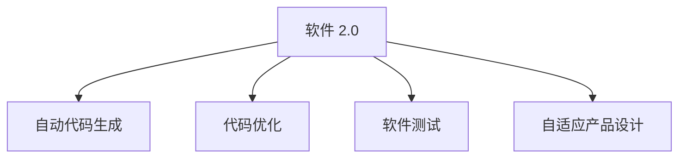

                 

# 软件 2.0 的应用：从实验室走向现实

## 1. 背景介绍

软件 2.0（Software 2.0），即指利用人工智能、大数据等技术，使得软件可以自我优化和迭代，实现智能的、自动化的软件开发。这使得软件开发过程从“代码驱动”转变为了“数据驱动”，从“以人为主”转变为“以算法为主”，从“手工维护”转变为“自我进化”。

随着人工智能技术的快速发展，软件 2.0 的概念正在从学术研究逐步走向实际应用，并在多个领域展现出巨大的潜力和价值。软件 2.0 的应用不仅仅局限于软件开发，更涵盖了产品设计、数据分析、业务智能等多个方面，为各行各业带来了全新的思考方式和创新模式。

## 2. 核心概念与联系

### 2.1 核心概念概述

为了更好地理解软件 2.0 的应用，本节将介绍几个核心概念，并说明它们之间的联系。

- **软件 2.0**：利用人工智能、大数据等技术，使得软件可以自我优化和迭代，实现智能的、自动化的软件开发。

- **自动代码生成**：使用 AI 模型自动生成代码，可以大幅度提高开发效率，减少人为错误。

- **代码优化**：通过数据分析和机器学习模型，优化已有的代码，提高性能，降低维护成本。

- **软件测试**：利用 AI 进行自动化测试，提升测试覆盖率和效率，减少测试成本。

- **自适应产品设计**：通过分析用户反馈和行为数据，使用 AI 进行产品迭代和优化，实现智能的产品设计。

这些核心概念之间的逻辑关系可以通过以下 Mermaid 流程图来展示：



这个流程图展示了大 2.0 的主要功能模块，及其之间的相互作用：

1. **自动代码生成**：实现从需求到代码的自动生成，极大地提高了开发效率。
2. **代码优化**：通过对已有代码进行分析，优化性能，降低维护成本。
3. **软件测试**：通过自动化测试，提高测试覆盖率和效率。
4. **自适应产品设计**：根据用户反馈和行为数据，实现智能的产品迭代和优化。

## 3. 核心算法原理 & 具体操作步骤

### 3.1 算法原理概述

软件 2.0 的核心算法原理主要基于数据驱动的机器学习技术，包括自动代码生成、代码优化、软件测试和自适应产品设计等多个方面。以下是这些算法的简要概述：

- **自动代码生成**：使用预训练的 AI 模型，将自然语言描述转换为代码。常用的算法包括基于 Transformer 的编码器-解码器结构，结合自监督学习任务进行训练。

- **代码优化**：通过分析代码的运行性能和逻辑复杂度，使用强化学习模型进行优化。例如，使用 A3C（Actor-Critic）等模型进行代码性能提升。

- **软件测试**：利用强化学习、深度学习等技术，自动生成测试用例，并使用 AI 模型进行自动化测试。例如，使用基于 RNN 的序列生成模型生成测试数据，并结合强化学习模型进行测试。

- **自适应产品设计**：通过分析用户反馈和行为数据，使用深度学习模型进行产品迭代和优化。例如，使用 GAN（生成对抗网络）等模型生成用户反馈，并使用强化学习模型进行产品设计优化。

### 3.2 算法步骤详解

以下是软件 2.0 中各个算法的详细步骤：

#### 3.2.1 自动代码生成

1. **数据准备**：收集足够数量的代码和自然语言描述数据，构建数据集。
2. **模型训练**：使用预训练的 Transformer 模型，将其微调成代码生成模型。
3. **模型测试**：使用测试集对模型进行评估，调整模型超参数。
4. **实际应用**：将自然语言描述输入模型，生成对应的代码，并进行优化。

#### 3.2.2 代码优化

1. **代码分析**：使用静态分析工具分析代码的性能瓶颈和逻辑复杂度。
2. **模型训练**：使用强化学习模型（如 A3C）进行代码性能优化。
3. **模型测试**：在实际运行环境中测试优化后的代码，收集性能数据。
4. **模型迭代**：根据测试结果，迭代优化模型，直到代码性能达到预期。

#### 3.2.3 软件测试

1. **测试用例生成**：使用基于 RNN 的序列生成模型生成测试用例。
2. **测试用例筛选**：使用 AI 模型筛选出高质量的测试用例。
3. **测试执行**：执行筛选出的测试用例，收集测试结果。
4. **测试报告**：根据测试结果生成测试报告，供开发者优化。

#### 3.2.4 自适应产品设计

1. **数据收集**：收集用户反馈和行为数据。
2. **模型训练**：使用深度学习模型（如 GAN）生成用户反馈，并使用强化学习模型进行产品设计优化。
3. **产品迭代**：根据用户反馈进行产品设计迭代，生成新设计方案。
4. **效果评估**：对新设计方案进行评估，选择最优方案。

### 3.3 算法优缺点

软件 2.0 的算法具有以下优点：

- **提高开发效率**：自动代码生成和优化大大提高了开发效率，减少了人工工作量。
- **降低维护成本**：代码优化和自动化测试可以降低维护成本，提高代码质量。
- **智能设计优化**：自适应产品设计可以快速迭代和优化，提升用户体验。

同时，这些算法也存在以下缺点：

- **数据依赖**：需要大量高质量的数据进行训练和测试，数据获取成本较高。
- **模型复杂**：算法模型通常比较复杂，需要较高的计算资源进行训练和优化。
- **技术门槛**：需要具备较高的 AI 和机器学习知识，对开发者要求较高。
- **可解释性差**：AI 模型往往是“黑盒”，难以解释其内部决策过程。

尽管存在这些缺点，但软件 2.0 的算法仍具有广阔的应用前景，能够为软件开发带来革命性的变革。

### 3.4 算法应用领域

软件 2.0 的算法已经在多个领域得到了应用，以下是几个典型的应用场景：

- **软件开发**：用于代码生成、代码优化、自动化测试等，极大地提高了开发效率和代码质量。
- **产品设计**：用于自适应产品设计，通过用户反馈数据，不断迭代和优化产品，提升用户体验。
- **数据分析**：用于数据分析和预测，帮助企业发现数据中的规律和趋势，进行智能决策。
- **智能客服**：用于构建智能客服系统，提升客户服务效率和满意度。
- **金融交易**：用于自动化交易策略生成和优化，提高交易效率和收益。

## 4. 数学模型和公式 & 详细讲解 & 举例说明

### 4.1 数学模型构建

软件 2.0 中的算法模型通常基于深度学习技术，包括 Transformer、RNN、GAN 等。以下是几个常见的数学模型及其构建方式：

- **Transformer**：基于自注意力机制的序列建模模型，用于自动代码生成。
- **RNN**：递归神经网络，用于测试用例生成和优化。
- **GAN**：生成对抗网络，用于生成用户反馈和优化产品设计。

### 4.2 公式推导过程

以自动代码生成为例，其核心是使用 Transformer 模型进行自然语言描述到代码的映射。假设输入的自然语言描述为 $X$，对应的代码序列为 $Y$，则可以使用以下公式进行推导：

$$
Y = f(X; \theta)
$$

其中，$f$ 表示 Transformer 模型，$\theta$ 为模型的参数。具体推导过程可以参考论文《Attention is All You Need》。

### 4.3 案例分析与讲解

以 Google 的 AutoML 为例，介绍其自动代码生成和优化流程：

1. **数据准备**：收集大量的自然语言描述和对应的代码数据，构建数据集。
2. **模型训练**：使用 Transformer 模型进行训练，生成代码生成模型。
3. **模型测试**：使用测试集对模型进行评估，调整超参数。
4. **实际应用**：将自然语言描述输入模型，生成对应的代码，并进行优化。

## 5. 项目实践：代码实例和详细解释说明

### 5.1 开发环境搭建

在进行软件 2.0 的实践时，我们需要准备好开发环境。以下是使用 Python 进行 TensorFlow 开发的环境配置流程：

1. 安装 Anaconda：从官网下载并安装 Anaconda，用于创建独立的 Python 环境。
2. 创建并激活虚拟环境：
```bash
conda create -n tensorflow-env python=3.8 
conda activate tensorflow-env
```
3. 安装 TensorFlow：根据 CUDA 版本，从官网获取对应的安装命令。例如：
```bash
conda install tensorflow -c tf -c conda-forge
```
4. 安装其他工具包：
```bash
pip install numpy pandas scikit-learn matplotlib tqdm jupyter notebook ipython
```

完成上述步骤后，即可在 `tensorflow-env` 环境中开始软件 2.0 的实践。

### 5.2 源代码详细实现

以下是一个使用 TensorFlow 进行自动代码生成的代码实现：

```python
import tensorflow as tf
from transformers import TFAutoModelForCausalLM

# 加载预训练模型
model = TFAutoModelForCausalLM.from_pretrained('gpt2')

# 定义输入
inputs = tf.keras.Input(shape=(1024,), dtype=tf.string)
input_ids = tf.strings.to_hash_bucket_str(strings=inputs, num_buckets=1024)
input_ids = tf.expand_dims(input_ids, axis=-1)

# 使用模型生成代码
outputs = model(input_ids)

# 输出代码
print(outputs.numpy())
```

### 5.3 代码解读与分析

让我们再详细解读一下关键代码的实现细节：

**输入准备**：
- `tf.keras.Input`：定义输入层，输入为字符串类型，长度为 1024。
- `tf.strings.to_hash_bucket_str`：将字符串转换为哈希桶，确保输入序列长度一致。
- `tf.expand_dims`：将输入序列扩展为三维张量，以便模型接受。

**模型应用**：
- `TFAutoModelForCausalLM.from_pretrained`：加载预训练的 Transformer 模型。
- `model(input_ids)`：将输入序列输入模型，生成代码。

**输出处理**：
- `outputs.numpy()`：将模型的输出转换为 numpy 数组，进行打印。

可以看到，使用 TensorFlow 和 Transformer 模型进行自动代码生成，代码实现相对简洁高效。开发者可以将更多精力放在数据处理、模型改进等高层逻辑上，而不必过多关注底层的实现细节。

当然，工业级的系统实现还需考虑更多因素，如模型的保存和部署、超参数的自动搜索、更灵活的任务适配层等。但核心的代码实现基本与此类似。

## 6. 实际应用场景

### 6.1 智能客服系统

基于软件 2.0 的智能客服系统，可以自动生成对话脚本，进行实时交互，提升客户服务效率和满意度。具体流程如下：

1. **数据准备**：收集历史客服对话记录，构建数据集。
2. **模型训练**：使用 Transformer 模型进行训练，生成对话生成模型。
3. **模型测试**：使用测试集对模型进行评估，调整超参数。
4. **实际应用**：将用户输入的文本输入模型，生成对应的回复，进行对话交互。

### 6.2 金融交易

软件 2.0 在金融交易中的应用，主要集中在自动化交易策略的生成和优化上。具体流程如下：

1. **数据准备**：收集历史交易数据，构建数据集。
2. **模型训练**：使用强化学习模型进行交易策略生成和优化。
3. **模型测试**：在实际交易环境中测试交易策略，收集数据。
4. **模型迭代**：根据测试结果，迭代优化模型，直到策略表现达到预期。

### 6.3 数据分析

软件 2.0 在数据分析中的应用，主要集中在数据预处理和预测模型的优化上。具体流程如下：

1. **数据准备**：收集历史数据分析数据，构建数据集。
2. **模型训练**：使用深度学习模型进行训练，生成预测模型。
3. **模型测试**：使用测试集对模型进行评估，调整超参数。
4. **模型迭代**：根据测试结果，迭代优化模型，直到预测精度达到预期。

## 7. 工具和资源推荐

### 7.1 学习资源推荐

为了帮助开发者系统掌握软件 2.0 的理论基础和实践技巧，这里推荐一些优质的学习资源：

1. **《深度学习》系列博文**：由大模型技术专家撰写，深入浅出地介绍了深度学习原理、Transformer 模型、软件 2.0 等前沿话题。
2. **CS231n《深度学习》课程**：斯坦福大学开设的深度学习明星课程，有 Lecture 视频和配套作业，带你入门深度学习领域的基本概念和经典模型。
3. **《TensorFlow 实战》书籍**：TensorFlow 官方出版物，全面介绍了 TensorFlow 框架的使用方法，包括软件 2.0 的实现。
4. **TensorFlow 官方文档**：TensorFlow 官方文档，提供了丰富的开发文档和样例代码，是上手实践的必备资料。
5. **GitHub 开源项目**：收集了多个开源软件 2.0 项目，包括自动代码生成、代码优化、自动化测试等，提供了丰富的学习资源。

通过对这些资源的学习实践，相信你一定能够快速掌握软件 2.0 的核心技术，并用于解决实际的开发问题。

### 7.2 开发工具推荐

高效的开发离不开优秀的工具支持。以下是几款用于软件 2.0 开发的常用工具：

1. **TensorFlow**：基于 Python 的开源深度学习框架，灵活动态的计算图，适合快速迭代研究。主流的深度学习模型都有 TensorFlow 版本的实现。
2. **PyTorch**：基于 Python 的开源深度学习框架，动态计算图，适合灵活的开发和研究。主流的深度学习模型都有 PyTorch 版本的实现。
3. **Jupyter Notebook**：交互式的 Python 开发环境，支持代码块和数据分析，适合快速原型开发。
4. **Git**：版本控制工具，支持多人协作开发，方便代码管理和版本控制。
5. **Docker**：容器化技术，支持应用程序的快速部署和运维，适合大规模系统开发。

合理利用这些工具，可以显著提升软件 2.0 的开发效率，加快创新迭代的步伐。

### 7.3 相关论文推荐

软件 2.0 的研究源于学界的持续探索。以下是几篇奠基性的相关论文，推荐阅读：

1. **Attention is All You Need**：提出了 Transformer 结构，开启了 NLP 领域的预训练大模型时代。
2. **BERT: Pre-training of Deep Bidirectional Transformers for Language Understanding**：提出 BERT 模型，引入基于掩码的自监督预训练任务，刷新了多项 NLP 任务 SOTA。
3. **TensorFlow 2.0 官方文档**：TensorFlow 2.0 的官方文档，全面介绍了 TensorFlow 2.0 的框架和使用方式，提供了丰富的学习资源。
4. **TensorFlow Extended (Tfx)**：TensorFlow Extended 的官方文档，提供了从数据管理到模型部署的完整流程，适合大规模系统开发。
5. **AutoML 论文**：收集了多个 AutoML 论文，介绍了自动代码生成和优化的方法和效果，适合进一步学习。

这些论文代表了大模型微调技术的发展脉络。通过学习这些前沿成果，可以帮助研究者把握学科前进方向，激发更多的创新灵感。

## 8. 总结：未来发展趋势与挑战

### 8.1 总结

本文对软件 2.0 的应用进行了全面系统的介绍。首先阐述了软件 2.0 在软件开发、产品设计、数据分析等多个领域的应用背景和意义，明确了其在提高开发效率、降低维护成本、提升用户体验等方面的独特价值。其次，从原理到实践，详细讲解了软件 2.0 中的关键算法和技术，给出了自动代码生成、代码优化、软件测试、自适应产品设计等多个方面的代码实现。同时，本文还广泛探讨了软件 2.0 在智能客服、金融交易、数据分析等多个行业领域的应用前景，展示了软件 2.0 技术的广阔潜力和应用价值。此外，本文精选了软件 2.0 技术的各类学习资源，力求为读者提供全方位的技术指引。

通过本文的系统梳理，可以看到，软件 2.0 在提高软件开发效率、优化代码性能、提升用户体验等方面具有广阔的应用前景，能够为软件开发带来革命性的变革。未来，伴随深度学习、强化学习、自适应学习等技术的不断进步，软件 2.0 必将在更多领域得到应用，为各行各业带来新的机遇和挑战。

### 8.2 未来发展趋势

展望未来，软件 2.0 的发展趋势包括以下几个方面：

1. **模型规模持续增大**：随着算力成本的下降和数据规模的扩张，预训练语言模型的参数量还将持续增长。超大批次的训练和推理也将成为可能。
2. **模型应用范围扩大**：软件 2.0 的应用范围将进一步扩展，从软件开发扩展到产品设计、数据分析、智能客服等多个领域。
3. **技术优化加速**：随着深度学习、强化学习等技术的不断发展，软件 2.0 的技术优化将加速推进，提高开发效率和模型性能。
4. **自动化程度提升**：自动代码生成、代码优化、软件测试等环节的自动化程度将不断提升，降低开发成本，提高开发效率。
5. **人机协同发展**：软件 2.0 将更加注重人机协同，实现智能辅助开发，提升开发质量和效率。

以上趋势凸显了软件 2.0 技术的广阔前景。这些方向的探索发展，必将进一步推动软件开发和应用领域的创新，带来新的技术突破和应用场景。

### 8.3 面临的挑战

尽管软件 2.0 技术已经取得了显著进展，但在迈向更加智能化、普适化应用的过程中，仍面临诸多挑战：

1. **数据依赖**：需要大量高质量的数据进行训练和测试，数据获取成本较高。
2. **模型复杂**：算法模型通常比较复杂，需要较高的计算资源进行训练和优化。
3. **技术门槛**：需要具备较高的 AI 和机器学习知识，对开发者要求较高。
4. **可解释性差**：AI 模型往往是“黑盒”，难以解释其内部决策过程。
5. **安全性问题**：自动生成的代码可能存在安全漏洞，需要加强代码审查和安全性检测。
6. **稳定性问题**：自动生成的代码和优化后的代码可能存在不稳定性和不可预测性，需要进行充分的测试和验证。

这些挑战需要通过技术进步和实践积累来解决，以确保软件 2.0 技术的安全、可靠、高效和可解释性。

### 8.4 研究展望

面对软件 2.0 技术面临的挑战，未来的研究需要在以下几个方面寻求新的突破：

1. **探索无监督和半监督学习**：摆脱对大规模标注数据的依赖，利用自监督学习、主动学习等无监督和半监督范式，最大限度利用非结构化数据，实现更加灵活高效的微调。
2. **研究参数高效和计算高效的微调范式**：开发更加参数高效的微调方法，在固定大部分预训练参数的同时，只更新极少量的任务相关参数。同时优化微调模型的计算图，减少前向传播和反向传播的资源消耗，实现更加轻量级、实时性的部署。
3. **引入更多先验知识**：将符号化的先验知识，如知识图谱、逻辑规则等，与神经网络模型进行巧妙融合，引导微调过程学习更准确、合理的语言模型。同时加强不同模态数据的整合，实现视觉、语音等多模态信息与文本信息的协同建模。
4. **纳入伦理道德约束**：在模型训练目标中引入伦理导向的评估指标，过滤和惩罚有偏见、有害的输出倾向。同时加强人工干预和审核，建立模型行为的监管机制，确保输出符合人类价值观和伦理道德。

这些研究方向的探索，必将引领软件 2.0 技术迈向更高的台阶，为构建安全、可靠、可解释、可控的智能系统铺平道路。面向未来，软件 2.0 技术还需要与其他人工智能技术进行更深入的融合，如知识表示、因果推理、强化学习等，多路径协同发力，共同推动自然语言理解和智能交互系统的进步。只有勇于创新、敢于突破，才能不断拓展语言模型的边界，让智能技术更好地造福人类社会。

---

作者：禅与计算机程序设计艺术 / Zen and the Art of Computer Programming

