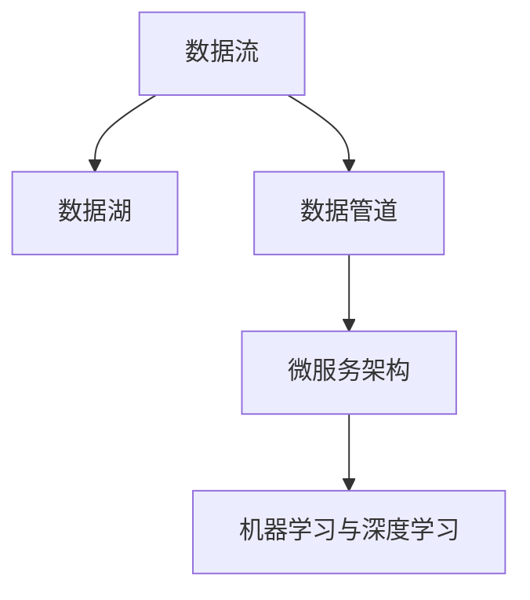
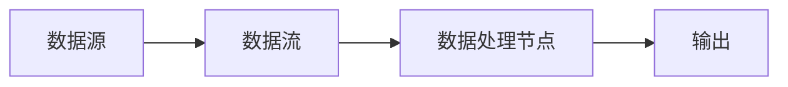
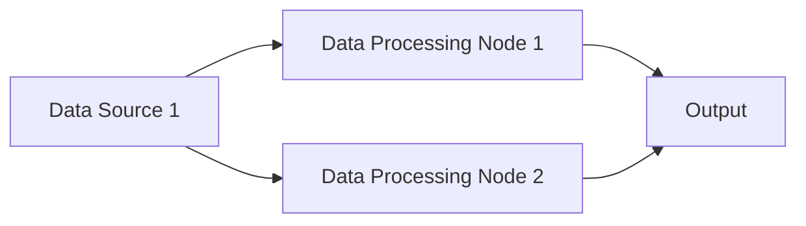
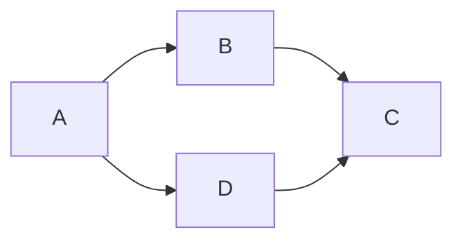

                 

# 软件 2.0 的时代：数据驱动一切

在信息技术日新月异的今天，软件技术正在经历着一场深刻的变革。从传统的以“代码为中心”的软件 1.0 时代，到如今以“数据为中心”的软件 2.0 时代，数据的重要性正在迅速上升，成为了推动技术创新的核心驱动力。本文将详细探讨软件 2.0 的核心概念、算法原理、应用场景及未来趋势，为读者带来深入的技术洞察。

## 1. 背景介绍

### 1.1 问题的由来

自互联网诞生以来，软件技术的发展经历了多次重大飞跃，从早期的瀑布模型、敏捷开发，到如今的云原生、微服务架构，软件系统的设计和实现方式都在不断演进。然而，随着数据量的爆炸式增长和计算能力的不断提升，软件系统在数据处理和利用方面的潜力才真正得以充分释放。

在这一背景下，软件 2.0 的概念应运而生。它强调数据驱动的设计和开发，通过数据流驱动软件系统的高效运行，从而实现更强大的智能决策和自动化处理能力。这种范式不仅改变了软件开发的方法论，更在业务流程、决策支持、人工智能等领域带来了革命性的变化。

### 1.2 问题核心关键点

软件 2.0 的核心在于通过数据流驱动软件系统，实现更智能、更高效、更自动化的业务处理。其主要关键点包括：

1. **数据中心化**：将业务流程重构为数据驱动的流程，让数据成为软件的核心输入和输出。
2. **智能化决策**：通过机器学习、深度学习等技术，利用数据进行复杂的决策和预测。
3. **自动化处理**：通过自动化的数据流和计算过程，实现业务流程的自动化。
4. **实时分析**：利用实时数据流进行分析和处理，提高业务响应的实时性和准确性。

## 2. 核心概念与联系

### 2.1 核心概念概述

为更好地理解软件 2.0 的技术内涵，本节将介绍几个关键概念及其相互联系：

- **数据流**：数据流是软件 2.0 的核心，是实现业务流程自动化的基础。数据流驱动着软件系统的运行，贯穿整个业务流程。
- **数据湖**：数据湖是一个中央化的数据存储和处理平台，用于存储和管理各种类型的数据。数据湖通过ETL（Extract, Transform, Load）过程，将原始数据转化为可用于分析的模型。
- **数据管道**：数据管道是数据流动的通道，通过API或中间件将数据从一个系统传输到另一个系统。数据管道保证了数据的安全性和实时性。
- **微服务架构**：微服务架构是一种灵活、可扩展的软件设计模式，通过将大型系统拆分成多个小服务，每个服务负责独立的功能，使得系统更加模块化和可维护。
- **机器学习与深度学习**：机器学习与深度学习是软件 2.0 中重要的技术手段，通过学习数据模式，提升软件的决策能力和自动化水平。

这些概念之间的逻辑关系可以通过以下Mermaid流程图来展示：



这个流程图展示了数据流在软件 2.0 系统中的核心作用：数据从数据流出发，进入数据湖进行存储和处理，再通过数据管道传输到微服务架构，最终应用机器学习与深度学习技术进行智能化处理。

## 3. 核心算法原理 & 具体操作步骤

### 3.1 算法原理概述

软件 2.0 的数据驱动范式，其核心算法原理可以概括为：

1. **数据收集与清洗**：收集业务相关的原始数据，进行去重、过滤、归一化等清洗处理，确保数据质量。
2. **数据建模与转换**：通过ETL过程，将清洗后的数据转化为可用于分析的模型，如数据表、数据流、数据集等。
3. **数据处理与分析**：利用数据管道进行数据传输和处理，应用机器学习与深度学习技术进行智能化决策和预测。
4. **数据可视化**：通过数据可视化工具，将分析结果转化为直观的图表和报告，辅助业务决策。

这些步骤共同构成了一个完整的数据驱动流程，使得软件系统能够高效、智能地处理业务数据。

### 3.2 算法步骤详解

以一个金融风控系统为例，展示软件 2.0 的核心算法步骤：

**Step 1: 数据收集与清洗**

- 收集金融交易数据、用户行为数据、设备信息等业务相关数据。
- 对数据进行清洗，去除重复、异常和无效数据，保证数据质量。

**Step 2: 数据建模与转换**

- 将清洗后的数据导入数据湖，创建数据表或数据流。
- 应用ETL工具进行数据转换，例如通过SQL或Python脚本，将原始数据转换为可用于分析的模型。

**Step 3: 数据处理与分析**

- 使用数据管道将数据传输到微服务架构，调用机器学习或深度学习模型进行预测和分析。
- 例如，通过预测模型评估交易风险，通过分类模型判断用户信用等级等。

**Step 4: 数据可视化**

- 利用可视化工具将分析结果转化为图表和报告，例如通过Tableau或Power BI。
- 例如，生成交易风险热力图、用户信用等级分布图等，辅助业务决策。

### 3.3 算法优缺点

软件 2.0 的数据驱动范式，其优缺点如下：

**优点**：

- **自动化**：通过数据流驱动软件系统，实现了业务流程的自动化。
- **实时性**：利用实时数据流进行分析和处理，提高了业务响应的实时性和准确性。
- **决策智能**：利用机器学习与深度学习技术，提升了软件的决策能力和智能化水平。

**缺点**：

- **复杂度**：数据驱动流程涉及大量数据处理和转换，增加了系统的复杂度。
- **数据安全**：数据流的实时性和敏感性要求高，数据安全和隐私保护成为重要挑战。
- **技术门槛**：需要掌握数据建模、机器学习等多项技术，技术门槛较高。

### 3.4 算法应用领域

软件 2.0 的应用领域非常广泛，包括但不限于：

- **金融风控**：通过实时数据流和机器学习模型，评估交易风险，进行信用评分等。
- **医疗健康**：通过电子病历数据，进行疾病预测和诊断，优化治疗方案。
- **电商推荐**：通过用户行为数据和商品数据，进行个性化推荐，提升用户体验。
- **智能制造**：通过工业设备数据，进行故障预测和维护优化，提高生产效率。
- **智慧城市**：通过城市交通数据，进行交通流量预测和优化，提升城市管理水平。

## 4. 数学模型和公式 & 详细讲解 & 举例说明

### 4.1 数学模型构建

软件 2.0 的核心数学模型是数据流图（Data Flow Graph），它描述了数据在软件系统中流动和处理的过程。一个典型的数据流图包括数据源、数据流、数据处理节点等元素，如下所示：



在数学上，数据流图可以表示为有向无环图（DAG），其中每个节点表示一个数据处理操作，每个边表示数据流向。例如，可以使用DAG Semantics模型来描述数据流图中的操作和数据依赖关系。

### 4.2 公式推导过程

假设有一个简单的数据流图，包含两个数据源（Data Source 1, Data Source 2），两个数据处理节点（Data Processing Node 1, Data Processing Node 2）和一个输出节点（Output），如下所示：



这个数据流图可以表示为如下的有向无环图：



在DAG Semantics模型中，数据流的传递可以通过数据依赖关系进行推导。例如，假设Data Processing Node 1的输出为Output 1，Data Processing Node 2的输出为Output 2，则数据流图可以表示为：

```mermaid
graph LR
    A --> B --> Output 1
    A --> D --> Output 2
```

通过这种数学模型，可以清晰地描述数据在软件系统中的流动和处理过程，为后续的算法设计和优化提供了理论基础。

### 4.3 案例分析与讲解

以一个电商推荐系统的数据流图为例，展示数据流的具体应用：

- **数据源**：用户行为数据（浏览记录、购买记录等），商品数据（商品描述、价格等）。
- **数据流**：用户行为数据流、商品数据流。
- **数据处理节点**：用户画像生成、商品推荐模型、个性化推荐引擎。
- **输出**：推荐商品列表。

在这个数据流图中，用户行为数据和商品数据通过ETL过程被转换为模型，然后分别传递给用户画像生成和商品推荐模型进行处理。最终，个性化推荐引擎根据处理结果生成推荐商品列表，输出给用户。

## 5. 项目实践：代码实例和详细解释说明

### 5.1 开发环境搭建

在进行软件 2.0 的项目实践前，我们需要准备好开发环境。以下是使用Python进行Kafka和Spark开发的典型环境配置流程：

1. 安装Anaconda：从官网下载并安装Anaconda，用于创建独立的Python环境。

2. 创建并激活虚拟环境：
```bash
conda create -n spark-kafka-env python=3.8 
conda activate spark-kafka-env
```

3. 安装Apache Kafka和Apache Spark：
```bash
conda install kafka-python
conda install apache-spark
```

4. 安装相关工具包：
```bash
pip install numpy pandas scikit-learn PyArrow Hive Metastore PyKafka
```

完成上述步骤后，即可在`spark-kafka-env`环境中开始实践。

### 5.2 源代码详细实现

以下是使用Python和Kafka进行电商推荐系统的数据流处理的完整代码实现：

```python
from pyspark.sql import SparkSession
from pyspark.sql.functions import col, when, expr
from pyspark.sql.types import StructType, StructField, StringType, IntegerType
from pyspark.ml import Pipeline
from pyspark.ml.feature import HashingTF, IDF, Tokenizer, CountVectorizer
from pyspark.ml.classification import LogisticRegression
from pyspark.ml.evaluation import MulticlassEvaluator
from pyspark.ml.linalg import DenseVector
from pykafka import KafkaConsumer

# 创建Spark Session
spark = SparkSession.builder.appName("E-commerce Recommendation System").getOrCreate()

# 创建Kafka消费者，获取电商数据
consumer = KafkaConsumer(
    'ecommerce-topics',
    bootstrap_servers=['localhost:9092'],
    auto_offset_reset='earliest',
    group_id='ecommerce-consumer'
)

# 读取Kafka消息，转换为DataFrame
ecommerce_df = spark.read.json(consumer)

# 数据预处理：去除重复和无效数据
ecommerce_df = ecommerce_df.drop_duplicates()

# 数据建模：用户画像和商品特征提取
tokenizer = Tokenizer(inputCol="item_desc", outputCol="items")
hashingTF = HashingTF(inputCol="items", outputCol="item_ids", numFeatures=100000)
idf = IDF(inputCol="item_ids", outputCol="item_weights")
tokenizer = tokenizer.setInputCol("item_desc")
tokenizer = tokenizer.setOutputCol("items")

# 数据转换：将用户行为数据转换为商品ID和权重
user_behav_df = ecommerce_df.select(col("user_id"), col("item_id"), col("rating"))
user_behav_df = user_behav_df.withColumn("item_ids", tokenizer.transform(col("item_id")))
user_behav_df = user_behav_df.withColumn("item_weights", hashingTF.transform(col("item_ids"))) \
    .withColumn("item_weights", idf.transform(col("item_weights")))
user_behav_df = user_behav_df.drop("item_id")

# 数据合并：将用户画像和商品特征合并
user_behav_df = user_behav_df.join(ecommerce_df.select("user_id", "item_id", "rating"), "user_id")

# 数据处理：训练推荐模型
model = LogisticRegression(maxIter=10, regParam=0.1, elasticNetParam=0.5)
pipeline = Pipeline(stages=[tokenizer, hashingTF, idf, model])
model = pipeline.fit(user_behav_df.select("user_id", "item_ids", "item_weights"), user_behav_df.select("rating"))

# 数据预测：推荐商品
test_df = spark.read.json(consumer)
test_df = test_df.drop_duplicates()
test_df = test_df.select(col("user_id"), tokenizer.transform(col("item_id")))
test_df = test_df.join(user_behav_df.select("user_id", "item_ids", "item_weights"), "user_id")
predictions = model.transform(test_df)
predictions = predictions.select(col("item_ids"), col("item_weights"), col("rating_pred"))

# 数据可视化：生成推荐商品列表
predictions.show()
```

以上代码展示了从Kafka实时获取电商数据，经过数据预处理、建模、转换、合并和预测等步骤，最终生成推荐商品列表的完整流程。

### 5.3 代码解读与分析

让我们再详细解读一下关键代码的实现细节：

**KafkaConsumer**：用于从Kafka主题中实时读取电商数据，将其转换为DataFrame。

**数据预处理**：去除重复和无效数据，确保数据质量。

**数据建模**：通过Tokenizing、HashingTF、IDF等步骤，将商品描述转换为可计算的特征向量，并提取用户行为特征。

**数据转换**：将用户行为数据转换为商品ID和权重，用于后续的推荐模型训练。

**数据合并**：将用户画像和商品特征合并，形成综合的特征向量。

**数据处理**：训练Logistic Regression推荐模型，用于预测用户对商品的评分。

**数据预测**：使用训练好的推荐模型，对测试数据进行预测，生成推荐商品列表。

**数据可视化**：展示推荐商品列表，辅助业务决策。

## 6. 实际应用场景

### 6.1 智能制造

在智能制造领域，软件 2.0 的应用非常广泛。通过实时采集和分析工业设备数据，可以进行故障预测、设备维护优化等。例如，可以使用数据流将传感器数据传输到数据湖，利用机器学习模型进行故障预测，从而及时采取维护措施，减少生产停机时间，提高生产效率。

### 6.2 智慧城市

智慧城市是软件 2.0 应用的另一个重要场景。通过实时采集和分析城市交通、环境、能源等数据，可以进行交通流量预测、环境监测、能源优化等。例如，可以使用数据流将城市交通数据传输到数据湖，利用机器学习模型进行交通流量预测，从而优化交通信号灯设置，减少交通拥堵，提高城市交通效率。

### 6.3 医疗健康

在医疗健康领域，软件 2.0 的应用同样重要。通过实时采集和分析电子病历、医疗影像、生命体征等数据，可以进行疾病预测、诊断、治疗方案优化等。例如，可以使用数据流将电子病历数据传输到数据湖，利用机器学习模型进行疾病预测，从而提前采取预防措施，提高医疗质量。

## 7. 工具和资源推荐

### 7.1 学习资源推荐

为了帮助开发者系统掌握软件 2.0 的理论基础和实践技巧，这里推荐一些优质的学习资源：

1. **《软件2.0：数据驱动的未来》**：详细介绍了软件 2.0 的核心概念和应用实践，适合初学者入门。

2. **Apache Spark官方文档**：Spark社区提供的详细文档，涵盖Spark的各个组件和API使用。

3. **Apache Kafka官方文档**：Kafka社区提供的详细文档，涵盖Kafka的消息传递机制和API使用。

4. **《大数据技术实战》**：通过实战案例，介绍了大数据技术在多个行业的应用，适合工程师提升技能。

5. **《Python数据科学手册》**：介绍了Python在大数据处理和机器学习中的应用，适合数据科学家学习。

通过对这些资源的学习实践，相信你一定能够快速掌握软件 2.0 的精髓，并用于解决实际的业务问题。

### 7.2 开发工具推荐

高效的开发离不开优秀的工具支持。以下是几款用于软件 2.0 开发的关键工具：

1. **Apache Spark**：一个快速的、通用的、可扩展的分布式计算系统，支持大规模数据处理。

2. **Apache Kafka**：一个分布式流处理平台，支持高吞吐量的数据流传输。

3. **Jupyter Notebook**：一个交互式的笔记本环境，支持Python、R等多种编程语言。

4. **Tableau**：一个数据可视化工具，支持复杂的数据分析和报告生成。

5. **PyKafka**：一个Python客户端库，支持Kafka的消息传递和处理。

合理利用这些工具，可以显著提升软件 2.0 的开发效率，加快创新迭代的步伐。

### 7.3 相关论文推荐

软件 2.0 的发展得益于学界的持续研究。以下是几篇奠基性的相关论文，推荐阅读：

1. **《数据驱动的软件系统》**：介绍了数据流驱动的软件系统设计方法，奠定了软件 2.0 的理论基础。

2. **《机器学习在数据流处理中的应用》**：探讨了机器学习在大数据流处理中的应用，展示了其强大的分析能力。

3. **《软件2.0：一个新范式》**：提出软件 2.0 的概念，强调数据在软件系统中的核心作用。

4. **《智能制造中的数据流处理》**：探讨了智能制造中数据流的处理机制，展示了其在工业领域的应用潜力。

这些论文代表了大数据和软件 2.0 技术的发展脉络。通过学习这些前沿成果，可以帮助研究者把握学科前进方向，激发更多的创新灵感。

## 8. 总结：未来发展趋势与挑战

### 8.1 研究成果总结

本文对软件 2.0 的核心概念、算法原理、应用场景及未来趋势进行了全面系统的介绍。首先阐述了数据流驱动的软件系统设计方法，明确了数据在软件系统中的核心作用。其次，从原理到实践，详细讲解了软件 2.0 的数学模型和关键算法步骤，给出了电商推荐系统的完整代码实现。同时，本文还广泛探讨了软件 2.0 在智能制造、智慧城市、医疗健康等多个领域的应用前景，展示了数据驱动范式的巨大潜力。

通过本文的系统梳理，可以看到，软件 2.0 正通过数据流驱动软件系统，实现更智能、更高效、更自动化的业务处理。未来，伴随大数据技术和机器学习算法的持续演进，软件 2.0 必将在更广阔的应用领域大放异彩，深刻影响人类的生产生活方式。

### 8.2 未来发展趋势

展望未来，软件 2.0 将呈现以下几个发展趋势：

1. **数据流自动化**：随着自动化技术的发展，数据流的自动化管理将更加智能化和高效。数据流的自动配置、自动扩展、自动修复等功能，将进一步提升软件系统的稳定性和可靠性。

2. **数据治理与隐私保护**：数据治理和安全隐私保护将成为软件 2.0 发展的重点，通过数据治理平台和隐私保护技术，提升数据质量和安全水平。

3. **边缘计算与物联网**：边缘计算和物联网技术的融合，将进一步拓展数据流的应用场景，实现更加实时、高效的数据处理和分析。

4. **多模态数据处理**：随着数据源的多样化，多模态数据处理技术将不断演进，支持文本、图像、视频、音频等多种类型的数据融合和分析。

5. **联邦学习**：联邦学习技术将通过数据在边缘设备和云端之间的协同训练，实现数据的隐私保护和知识共享。

以上趋势凸显了软件 2.0 的广阔前景。这些方向的探索发展，必将进一步提升软件系统的性能和应用范围，为人类社会的数字化转型带来深远影响。

### 8.3 面临的挑战

尽管软件 2.0 已经取得了瞩目成就，但在迈向更加智能化、普适化应用的过程中，它仍面临着诸多挑战：

1. **数据质量问题**：数据流的实时性和准确性要求高，数据质量问题将成为重要挑战。如何确保数据的完整性、一致性和可靠性，是一个关键问题。

2. **技术门槛高**：软件 2.0 涉及数据流管理、机器学习、分布式计算等多项技术，技术门槛较高。需要跨学科的复合型人才，才能满足实际需求。

3. **数据隐私和安全**：数据流的敏感性和隐私性要求高，如何确保数据的安全和隐私保护，是一个重要挑战。

4. **系统复杂度**：数据流驱动的系统复杂度较高，如何设计高效、可靠的系统架构，是一个重要问题。

5. **实时性要求高**：数据流的实时性要求高，如何设计高效、低延迟的数据流处理机制，是一个关键问题。

6. **业务适配难度大**：不同业务场景的数据流处理需求不同，如何设计灵活、可扩展的架构，是一个重要挑战。

这些挑战凸显了软件 2.0 技术的应用难度和复杂性，需要在实际应用中不断优化和改进。

### 8.4 研究展望

面对软件 2.0 所面临的种种挑战，未来的研究需要在以下几个方面寻求新的突破：

1. **数据质量提升**：研究高效的数据清洗和质量提升技术，确保数据的完整性、一致性和可靠性。

2. **边缘计算优化**：研究边缘计算与数据流融合的优化技术，提升数据流的实时性和效率。

3. **隐私保护技术**：研究数据隐私保护技术，确保数据在流处理过程中的安全性和隐私性。

4. **实时处理算法**：研究高效、低延迟的实时处理算法，提升数据流的处理速度和性能。

5. **系统架构设计**：研究灵活、可扩展的系统架构设计方法，支持不同业务场景的数据流处理需求。

这些研究方向将推动软件 2.0 技术向更加智能化、普适化方向发展，为人类社会的数字化转型带来新的动力。相信随着技术的不断进步，软件 2.0 必将在更广泛的领域得到应用，深刻影响人类的生产生活方式。

## 9. 附录：常见问题与解答

**Q1: 软件 2.0 和传统软件 1.0 的主要区别是什么？**

A: 软件 2.0 和软件 1.0 的主要区别在于数据驱动的设计理念。软件 1.0 以代码为中心，强调代码的模块化和可维护性；而软件 2.0 以数据为中心，强调数据的流动和处理，通过数据流驱动软件系统的高效运行。

**Q2: 如何确保数据流的实时性和准确性？**

A: 确保数据流的实时性和准确性，主要通过以下方法：
1. 使用高性能的消息传递系统，如Apache Kafka，支持高吞吐量的数据流传输。
2. 采用分布式数据处理框架，如Apache Spark，实现数据的并行处理和优化。
3. 使用数据治理平台，进行数据质量管理和监控，确保数据的一致性和完整性。

**Q3: 数据流的自动化管理面临哪些挑战？**

A: 数据流的自动化管理面临以下挑战：
1. 系统复杂度高，需要设计高效、可靠的系统架构。
2. 数据质量问题，需要确保数据的完整性、一致性和可靠性。
3. 实时性要求高，需要设计高效、低延迟的数据流处理机制。
4. 业务适配难度大，需要支持不同业务场景的数据流处理需求。

**Q4: 数据隐私和安全问题如何解决？**

A: 解决数据隐私和安全问题，主要通过以下方法：
1. 采用数据加密技术，确保数据在传输和存储过程中的安全性。
2. 使用联邦学习等隐私保护技术，通过数据在边缘设备和云端之间的协同训练，实现数据的隐私保护和知识共享。
3. 设计合理的权限控制机制，确保数据访问和操作的合法性和安全性。

通过本文的系统梳理，可以看到，软件 2.0 正通过数据流驱动软件系统，实现更智能、更高效、更自动化的业务处理。未来，伴随大数据技术和机器学习算法的持续演进，软件 2.0 必将在更广阔的应用领域大放异彩，深刻影响人类的生产生活方式。

---

作者：禅与计算机程序设计艺术 / Zen and the Art of Computer Programming

