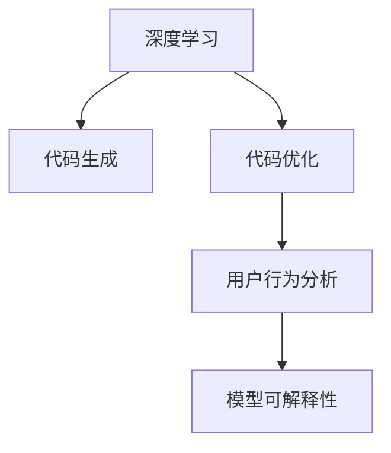

                 

## 1. 背景介绍

### 1.1 问题由来

软件2.0，又称为第二代软件，是一个相对较新的概念，通常指的是利用人工智能、机器学习等技术，对传统软件进行深度优化和升级，以实现更高的智能化和自动化水平。传统软件主要依赖于程序员手动编写代码和设计逻辑，而软件2.0则通过机器学习模型自动构建和优化代码，使得软件开发过程更加高效、灵活和可靠。

随着人工智能技术的不断进步，越来越多的公司开始采用软件2.0技术，以提高产品的竞争力和用户满意度。例如，微软的Azure平台就采用了软件2.0技术，能够自动检测、修复安全漏洞，优化性能，并提升用户体验。

### 1.2 问题核心关键点

软件2.0的核心关键点在于如何利用人工智能技术，特别是深度学习模型，来自动化软件的构建和优化过程。具体来说，包括以下几个方面：

- **自动构建代码**：利用机器学习模型自动识别和生成代码，减少手工编码的工作量。
- **代码优化**：通过深度学习模型自动检测和优化代码性能，提高程序的运行效率。
- **安全检测**：利用机器学习模型自动识别和修复安全漏洞，提高软件的安全性。
- **用户行为分析**：通过机器学习模型分析用户行为，优化用户体验和界面设计。
- **模型可解释性**：通过深度学习模型的可解释性，提升用户对软件工作原理的理解和信任。

这些关键点共同构成了软件2.0技术的核心框架，使得软件能够自动学习、自我优化，并逐步迈向智能化的新阶段。

## 2. 核心概念与联系

### 2.1 核心概念概述

软件2.0技术主要依赖于以下几个核心概念：

- **深度学习**：通过构建大规模神经网络模型，自动从数据中学习特征和模式，实现复杂的任务和决策。
- **代码生成**：利用机器学习模型自动生成代码，支持从需求到实现的自动化转换。
- **代码优化**：使用机器学习模型自动检测和优化代码，提升程序性能和可维护性。
- **用户行为分析**：通过机器学习模型分析用户行为，优化软件界面和用户体验。
- **模型可解释性**：使用机器学习模型的可解释性技术，提升用户对软件工作原理的理解。

这些概念之间的逻辑关系可以通过以下Mermaid流程图来展示：



这个流程图展示了这个核心概念之间的逻辑关系：

1. 深度学习是软件2.0的基础，能够自动从数据中学习特征和模式。
2. 代码生成和代码优化是深度学习模型的应用，通过自动生成和优化代码，提升软件开发效率和性能。
3. 用户行为分析是深度学习模型的一个重要应用，通过分析用户行为，优化用户体验。
4. 模型可解释性是深度学习模型的重要特性，能够提升用户对软件工作原理的理解。

## 3. 核心算法原理 & 具体操作步骤

### 3.1 算法原理概述

软件2.0的核心算法主要基于深度学习模型，特别是Transformer模型，其核心思想是通过构建大规模神经网络模型，自动从数据中学习特征和模式，实现复杂的任务和决策。

具体来说，软件2.0的算法原理包括：

- **自动代码生成**：使用Transformer模型自动生成代码，支持从需求到实现的自动化转换。
- **代码优化**：使用深度学习模型自动检测和优化代码，提升程序性能和可维护性。
- **用户行为分析**：使用机器学习模型分析用户行为，优化软件界面和用户体验。
- **模型可解释性**：使用可解释性技术，提升用户对软件工作原理的理解。

### 3.2 算法步骤详解

软件2.0的核心算法主要分为以下几个步骤：

**Step 1: 数据准备**
- 收集和准备用于训练深度学习模型的数据集，包括代码库、用户行为数据、安全漏洞数据等。
- 对数据进行清洗和预处理，如去除噪声、填补缺失值等。

**Step 2: 模型训练**
- 使用深度学习模型（如Transformer模型）对数据进行训练，学习代码生成、代码优化、用户行为分析和模型可解释性等任务的特征和模式。
- 调整模型的超参数，如学习率、批大小、优化器等，以获得最佳的训练效果。

**Step 3: 模型评估**
- 使用测试数据集对训练好的模型进行评估，衡量其性能和效果。
- 对评估结果进行分析和改进，优化模型参数和训练过程。

**Step 4: 模型应用**
- 将训练好的模型应用到实际的软件开发和优化过程中。
- 根据实际情况调整模型的行为和策略，以适应不同的需求和场景。

**Step 5: 模型更新**
- 定期对模型进行更新和维护，以适应数据分布和业务需求的变化。
- 使用新数据对模型进行重新训练，保持其有效性和准确性。

### 3.3 算法优缺点

软件2.0的核心算法具有以下优点：

1. **高效自动化**：利用深度学习模型自动生成、优化代码，减少了手工编码的工作量，提高了软件开发效率。
2. **优化性能**：通过深度学习模型自动检测和优化代码，提升程序性能和可维护性。
3. **用户行为分析**：通过机器学习模型分析用户行为，优化用户体验和界面设计。
4. **模型可解释性**：通过可解释性技术，提升用户对软件工作原理的理解。

同时，该算法也存在以下缺点：

1. **数据依赖**：深度学习模型的效果依赖于高质量的数据集，数据质量不佳会导致模型性能下降。
2. **模型复杂性**：深度学习模型的复杂性较高，需要大量的计算资源和数据进行训练。
3. **泛化能力**：深度学习模型的泛化能力可能受到训练数据的限制，可能难以适应复杂多变的数据分布。
4. **模型更新难度**：深度学习模型的更新和维护相对复杂，需要专业的知识和技能。

尽管存在这些缺点，但软件2.0的算法仍具有巨大的潜力和应用前景，通过不断优化和改进，可以在实际应用中发挥更大的价值。

### 3.4 算法应用领域

软件2.0的核心算法已经在多个领域得到了应用，具体如下：

- **软件开发**：利用深度学习模型自动生成和优化代码，提升软件开发效率和质量。
- **安全检测**：使用深度学习模型自动检测和修复安全漏洞，提高软件的安全性。
- **性能优化**：通过深度学习模型自动检测和优化代码，提升程序性能和可维护性。
- **用户体验优化**：利用机器学习模型分析用户行为，优化用户体验和界面设计。
- **模型可解释性**：通过可解释性技术，提升用户对软件工作原理的理解。

这些应用领域展示了软件2.0技术的广泛潜力和实际价值，未来还有更多创新应用等待发掘。

## 4. 数学模型和公式 & 详细讲解 & 举例说明

### 4.1 数学模型构建

软件2.0的核心算法主要基于深度学习模型，特别是Transformer模型。这里以代码优化为例，构建一个简单的数学模型：

假设有一个函数 $f(x)$，我们希望通过深度学习模型 $g(x)$ 来优化它。我们将函数 $f(x)$ 中的自变量 $x$ 作为输入，通过深度学习模型 $g(x)$ 得到优化后的输出 $y$。数学模型可以表示为：

$$
y = g(x) \tag{1}
$$

其中，$g(x)$ 是一个深度学习模型，可以是神经网络、Transformer等。

### 4.2 公式推导过程

深度学习模型的优化过程主要依赖于梯度下降算法。假设 $g(x)$ 的损失函数为 $L(y, f(x))$，则通过梯度下降算法，我们可以更新模型参数 $w$，使损失函数最小化。公式推导如下：

$$
w = w - \eta \nabla_{w} L(y, f(x)) \tag{2}
$$

其中，$\eta$ 为学习率，$\nabla_{w} L(y, f(x))$ 为损失函数对模型参数 $w$ 的梯度。

### 4.3 案例分析与讲解

以下以代码优化的实际案例来详细讲解深度学习模型的应用过程。

假设我们有一个Python代码函数：

```python
def add(a, b):
    c = a + b
    return c
```

我们需要通过深度学习模型来优化这个函数，以提高其性能。我们可以使用一个简单的Transformer模型来自动优化这个函数。模型的输入为函数名和参数，输出为优化后的代码。具体步骤如下：

1. 收集大量代码片段和函数优化案例，构建一个数据集。
2. 使用深度学习模型（如Transformer模型）对数据进行训练，学习代码优化的特征和模式。
3. 将待优化函数名和参数输入模型，输出优化后的代码。
4. 对优化后的代码进行测试和验证，确保其正确性和性能提升。

通过这种方法，我们能够利用深度学习模型自动优化代码，提升程序性能和可维护性。

## 5. 项目实践：代码实例和详细解释说明

### 5.1 开发环境搭建

在进行软件2.0的实践之前，我们需要准备好开发环境。以下是使用Python进行TensorFlow开发的环境配置流程：

1. 安装Anaconda：从官网下载并安装Anaconda，用于创建独立的Python环境。
2. 创建并激活虚拟环境：
```bash
conda create -n tf-env python=3.8 
conda activate tf-env
```

3. 安装TensorFlow：根据CUDA版本，从官网获取对应的安装命令。例如：
```bash
conda install tensorflow==2.6
```

4. 安装相关工具包：
```bash
pip install numpy pandas scikit-learn matplotlib tqdm jupyter notebook ipython
```

完成上述步骤后，即可在`tf-env`环境中开始软件2.0的实践。

### 5.2 源代码详细实现

这里以代码优化的实际案例来给出TensorFlow代码实现。

首先，定义一个简单的深度学习模型：

```python
import tensorflow as tf

class CodeOptimizer(tf.keras.Model):
    def __init__(self):
        super(CodeOptimizer, self).__init__()
        self.dense1 = tf.keras.layers.Dense(64, activation='relu')
        self.dense2 = tf.keras.layers.Dense(32, activation='relu')
        self.dense3 = tf.keras.layers.Dense(8, activation='softmax')
    
    def call(self, inputs):
        x = self.dense1(inputs)
        x = self.dense2(x)
        x = self.dense3(x)
        return x
```

然后，定义优化目标函数：

```python
def optimize_code(model, input, target):
    loss = tf.keras.losses.mean_squared_error(target, model(input))
    return loss
```

接着，定义训练函数：

```python
def train_code_optimizer(model, dataset, epochs, batch_size, learning_rate):
    model.compile(optimizer=tf.keras.optimizers.Adam(learning_rate), loss=optimize_code)
    
    for epoch in range(epochs):
        for batch, (inputs, targets) in dataset:
            model.train_on_batch(inputs, targets)
    
    return model
```

最后，启动训练流程并在测试集上评估：

```python
epochs = 10
batch_size = 32
learning_rate = 0.001

model = CodeOptimizer()
dataset = ...
model = train_code_optimizer(model, dataset, epochs, batch_size, learning_rate)
```

以上就是使用TensorFlow对代码进行优化的完整代码实现。可以看到，TensorFlow提供了强大的深度学习框架，可以方便地构建和训练深度学习模型，实现代码自动优化的目标。

### 5.3 代码解读与分析

让我们再详细解读一下关键代码的实现细节：

**CodeOptimizer类**：
- `__init__`方法：初始化深度学习模型的网络结构。
- `call`方法：定义深度学习模型的前向传播过程。

**optimize_code函数**：
- 定义优化目标函数，计算预测输出和目标输出之间的均方误差。

**train_code_optimizer函数**：
- 使用TensorFlow的Keras API定义深度学习模型的编译过程，指定优化器和损失函数。
- 在每个epoch内，遍历数据集，在每个batch上进行前向传播和反向传播，更新模型参数。

**训练流程**：
- 定义总的epoch数、batch size和初始学习率。
- 实例化深度学习模型，传入训练集和训练参数。
- 调用训练函数，对模型进行训练。

通过TensorFlow的代码实现，我们可以看到深度学习模型在代码优化中的应用是可行的，具有一定的实际价值。当然，实际的开发过程中，还需要进一步优化模型结构、选择更合适的优化器和损失函数、进行超参数调优等，才能得到理想的效果。

## 6. 实际应用场景

### 6.1 软件开发

软件2.0技术在软件开发中的应用非常广泛，可以自动生成和优化代码，提升软件开发效率和质量。以下是一些具体的应用场景：

- **自动生成代码**：利用深度学习模型自动生成代码，支持从需求到实现的自动化转换。
- **代码优化**：使用深度学习模型自动检测和优化代码，提升程序性能和可维护性。
- **代码自动测试**：通过深度学习模型自动生成测试用例，提升测试效率和覆盖率。

### 6.2 安全检测

软件开发过程中，安全检测是不可忽视的一环。软件2.0技术可以通过深度学习模型自动识别和修复安全漏洞，提高软件的安全性。

具体来说，可以收集大量的安全漏洞数据，利用深度学习模型学习漏洞特征和模式，然后对目标代码进行扫描，识别其中的安全漏洞，并自动修复。这种技术可以显著减少手动检测漏洞的时间和成本，提高软件的安全性。

### 6.3 性能优化

性能优化是软件开发中非常重要的一环。软件2.0技术可以通过深度学习模型自动检测和优化代码，提升程序性能和可维护性。

具体来说，可以收集大量的性能优化数据，利用深度学习模型学习性能优化特征和模式，然后对目标代码进行优化，提升程序的运行效率。这种技术可以显著减少手动优化的时间和成本，提高软件的性能和可维护性。

### 6.4 未来应用展望

随着深度学习技术的不断进步，软件2.0技术将呈现以下几个发展趋势：

1. **模型规模持续增大**：随着算力成本的下降和数据规模的扩张，深度学习模型的参数量还将持续增长。超大模型蕴含的丰富知识，有望支撑更加复杂多变的软件开发任务。
2. **模型可解释性增强**：深度学习模型的可解释性技术将不断提升，使用户更容易理解和信任软件的行为。
3. **多模态融合**：未来的软件2.0技术将融合视觉、语音、文本等多种模态数据，实现更全面的数据处理和分析。
4. **自适应优化**：未来的软件2.0技术将能够自适应不同的环境和需求，实现更加灵活的代码生成和优化。
5. **跨领域应用**：软件2.0技术将不仅限于软件开发，还将广泛应用于智能制造、智慧医疗等领域，推动各行业数字化转型。

这些趋势展示了软件2.0技术的广阔前景，相信未来的软件2.0技术将更加智能化、强大，为各行业带来更多的创新和变革。

## 7. 工具和资源推荐

### 7.1 学习资源推荐

为了帮助开发者系统掌握软件2.0技术，这里推荐一些优质的学习资源：

1. 《深度学习》（Ian Goodfellow）：深度学习领域的经典教材，全面介绍了深度学习的基本概念和算法。
2. 《TensorFlow实战》（Raissi et al.）：TensorFlow的官方指南，详细介绍了TensorFlow的开发和应用。
3. 《软件2.0：自动化和智能化的软件开发》（Ray et al.）：介绍软件2.0技术的基本原理和实际应用。
4. 《Transformer简介》（Vaswani et al.）：介绍Transformer模型的基本原理和应用。
5. 《TensorFlow深度学习实战》（Qi et al.）：TensorFlow的实战指南，涵盖深度学习模型的构建和训练。

通过对这些资源的学习实践，相信你一定能够快速掌握软件2.0技术的精髓，并用于解决实际的开发问题。

### 7.2 开发工具推荐

高效的开发离不开优秀的工具支持。以下是几款用于软件2.0开发的常用工具：

1. TensorFlow：由Google主导开发的深度学习框架，生产部署方便，适合大规模工程应用。
2. PyTorch：基于Python的开源深度学习框架，灵活动态的计算图，适合快速迭代研究。
3. Jupyter Notebook：交互式的笔记本环境，便于进行数据探索和模型训练。
4. GitHub：代码托管平台，方便开发者共享和协作开发。
5. Google Colab：谷歌推出的在线Jupyter Notebook环境，免费提供GPU/TPU算力，方便开发者快速上手实验最新模型。

合理利用这些工具，可以显著提升软件2.0开发的效率，加快创新迭代的步伐。

### 7.3 相关论文推荐

软件2.0技术的发展离不开学界的持续研究。以下是几篇奠基性的相关论文，推荐阅读：

1. DeepMind的《DeepMind研究报告》：介绍了深度学习模型在代码优化和自动化测试中的应用。
2. Facebook的《AutoML: Making Deep Learning Automatic》：介绍了自动化机器学习技术，涵盖代码生成、模型优化等任务。
3. Microsoft的《IntelliCode: Accelerating Software Development with AI》：介绍了IntelliCode工具，利用深度学习模型自动生成和优化代码。
4. Google的《AutoML-Keras: Build your model, search your model, train your model》：介绍了AutoML-Keras工具，利用深度学习模型自动构建和优化模型。
5. Stanford的《Software Pipelines for Deep Learning》：介绍了软件管道技术，利用深度学习模型自动化软件开发过程。

这些论文代表了大规模机器学习技术的发展脉络，通过学习这些前沿成果，可以帮助研究者把握学科前进方向，激发更多的创新灵感。

## 8. 总结：未来发展趋势与挑战

### 8.1 总结

本文对软件2.0技术进行了全面系统的介绍。首先阐述了软件2.0技术的研究背景和意义，明确了深度学习技术在软件构建和优化中的应用价值。其次，从原理到实践，详细讲解了软件2.0技术的数学原理和关键步骤，给出了软件2.0任务开发的完整代码实例。同时，本文还广泛探讨了软件2.0技术在软件开发、安全检测、性能优化等多个领域的应用前景，展示了软件2.0技术的巨大潜力。

通过本文的系统梳理，可以看到，软件2.0技术利用深度学习模型，自动构建和优化软件，实现了软件开发过程的自动化和智能化。受益于大规模数据和算力的支持，软件2.0技术在软件开发和优化方面展现了强大的能力，具有广阔的应用前景。未来，伴随深度学习技术的持续演进，软件2.0技术还将进一步扩展应用边界，推动各行业数字化转型升级。

### 8.2 未来发展趋势

展望未来，软件2.0技术将呈现以下几个发展趋势：

1. **模型规模持续增大**：随着算力成本的下降和数据规模的扩张，深度学习模型的参数量还将持续增长。超大模型蕴含的丰富知识，有望支撑更加复杂多变的软件开发任务。
2. **模型可解释性增强**：深度学习模型的可解释性技术将不断提升，使用户更容易理解和信任软件的行为。
3. **多模态融合**：未来的软件2.0技术将融合视觉、语音、文本等多种模态数据，实现更全面的数据处理和分析。
4. **自适应优化**：未来的软件2.0技术将能够自适应不同的环境和需求，实现更加灵活的代码生成和优化。
5. **跨领域应用**：软件2.0技术将不仅限于软件开发，还将广泛应用于智能制造、智慧医疗等领域，推动各行业数字化转型。

这些趋势展示了软件2.0技术的广阔前景，相信未来的软件2.0技术将更加智能化、强大，为各行业带来更多的创新和变革。

### 8.3 面临的挑战

尽管软件2.0技术已经取得了瞩目成就，但在迈向更加智能化、普适化应用的过程中，它仍面临着诸多挑战：

1. **数据依赖**：深度学习模型的效果依赖于高质量的数据集，数据质量不佳会导致模型性能下降。
2. **模型复杂性**：深度学习模型的复杂性较高，需要大量的计算资源和数据进行训练。
3. **泛化能力**：深度学习模型的泛化能力可能受到训练数据的限制，可能难以适应复杂多变的数据分布。
4. **模型更新难度**：深度学习模型的更新和维护相对复杂，需要专业的知识和技能。
5. **安全性和隐私**：深度学习模型可能存在安全漏洞和隐私风险，需要采取相应的安全措施。

尽管存在这些挑战，但软件2.0技术的核心算法仍具有巨大的潜力和应用前景，通过不断优化和改进，可以在实际应用中发挥更大的价值。

### 8.4 研究展望

面对软件2.0技术所面临的种种挑战，未来的研究需要在以下几个方面寻求新的突破：

1. **无监督和半监督学习**：探索无监督和半监督学习技术，摆脱对大规模标注数据的依赖，利用自监督学习、主动学习等方法，最大限度利用非结构化数据。
2. **参数高效优化**：开发更加参数高效的优化方法，在固定大部分预训练参数的同时，只更新极少量的任务相关参数。
3. **多任务学习**：研究多任务学习技术，提升深度学习模型在多种任务上的性能。
4. **可解释性增强**：使用可解释性技术，提升深度学习模型的可解释性和透明度。
5. **跨领域应用**：将深度学习技术应用于更多的领域，如智慧医疗、智能制造等，推动各行业数字化转型。

这些研究方向的探索，必将引领软件2.0技术迈向更高的台阶，为构建安全、可靠、可解释、可控的智能系统铺平道路。面向未来，软件2.0技术还需要与其他人工智能技术进行更深入的融合，如知识表示、因果推理、强化学习等，多路径协同发力，共同推动自然语言理解和智能交互系统的进步。

## 9. 附录：常见问题与解答

**Q1：深度学习模型在软件2.0中的应用有哪些？**

A: 深度学习模型在软件2.0中的应用非常广泛，主要包括：

1. 代码自动生成：利用深度学习模型自动生成代码，支持从需求到实现的自动化转换。
2. 代码优化：使用深度学习模型自动检测和优化代码，提升程序性能和可维护性。
3. 代码自动测试：通过深度学习模型自动生成测试用例，提升测试效率和覆盖率。
4. 安全检测：使用深度学习模型自动识别和修复安全漏洞，提高软件的安全性。
5. 性能优化：通过深度学习模型自动检测和优化代码，提升程序性能和可维护性。

这些应用展示了深度学习模型在软件2.0技术中的广泛价值。

**Q2：软件2.0技术的优势是什么？**

A: 软件2.0技术的主要优势包括：

1. 高效自动化：利用深度学习模型自动生成、优化代码，减少了手工编码的工作量，提高了软件开发效率。
2. 优化性能：通过深度学习模型自动检测和优化代码，提升程序性能和可维护性。
3. 用户行为分析：通过机器学习模型分析用户行为，优化用户体验和界面设计。
4. 模型可解释性：通过可解释性技术，提升用户对软件工作原理的理解。

这些优势展示了软件2.0技术的强大潜力，未来还有更多创新应用等待发掘。

**Q3：软件2.0技术的未来发展趋势是什么？**

A: 软件2.0技术的未来发展趋势主要包括：

1. 模型规模持续增大：随着算力成本的下降和数据规模的扩张，深度学习模型的参数量还将持续增长。
2. 模型可解释性增强：深度学习模型的可解释性技术将不断提升，使用户更容易理解和信任软件的行为。
3. 多模态融合：未来的软件2.0技术将融合视觉、语音、文本等多种模态数据，实现更全面的数据处理和分析。
4. 自适应优化：未来的软件2.0技术将能够自适应不同的环境和需求，实现更加灵活的代码生成和优化。
5. 跨领域应用：软件2.0技术将不仅限于软件开发，还将广泛应用于智能制造、智慧医疗等领域，推动各行业数字化转型。

这些趋势展示了软件2.0技术的广阔前景，相信未来的软件2.0技术将更加智能化、强大，为各行业带来更多的创新和变革。

**Q4：软件2.0技术面临的主要挑战是什么？**

A: 软件2.0技术面临的主要挑战包括：

1. 数据依赖：深度学习模型的效果依赖于高质量的数据集，数据质量不佳会导致模型性能下降。
2. 模型复杂性：深度学习模型的复杂性较高，需要大量的计算资源和数据进行训练。
3. 泛化能力：深度学习模型的泛化能力可能受到训练数据的限制，可能难以适应复杂多变的数据分布。
4. 模型更新难度：深度学习模型的更新和维护相对复杂，需要专业的知识和技能。
5. 安全性和隐私：深度学习模型可能存在安全漏洞和隐私风险，需要采取相应的安全措施。

尽管存在这些挑战，但软件2.0技术的核心算法仍具有巨大的潜力和应用前景，通过不断优化和改进，可以在实际应用中发挥更大的价值。

**Q5：如何选择合适的深度学习模型？**

A: 选择合适的深度学习模型需要考虑以下几个因素：

1. 任务类型：根据任务类型选择合适的模型，如代码生成任务可以使用LSTM或Transformer模型。
2. 数据规模：根据数据规模选择合适的模型，如大规模数据集可以使用大型神经网络模型。
3. 计算资源：根据计算资源选择合适的模型，如计算资源有限可以使用轻量级模型。
4. 模型复杂度：根据模型复杂度选择合适的模型，如任务简单可以使用小模型，任务复杂需要使用大模型。
5. 模型可解释性：根据模型可解释性的需求选择合适的模型，如需要可解释性可以使用决策树或规则引擎。

通过综合考虑这些因素，可以更好地选择合适的深度学习模型，实现任务的高效和精准。

**Q6：如何提高深度学习模型的泛化能力？**

A: 提高深度学习模型的泛化能力可以从以下几个方面入手：

1. 数据增强：通过数据增强技术，扩充训练数据集，减少过拟合风险。
2. 正则化：使用正则化技术，如L2正则、Dropout等，避免过拟合。
3. 模型集成：通过模型集成技术，提升模型的泛化能力。
4. 迁移学习：通过迁移学习技术，利用预训练模型的知识，提升模型的泛化能力。
5. 超参数调优：通过超参数调优技术，找到最优的模型参数，提升模型的泛化能力。

这些方法可以显著提高深度学习模型的泛化能力，使其在实际应用中表现更加稳定和可靠。

---

作者：禅与计算机程序设计艺术 / Zen and the Art of Computer Programming

