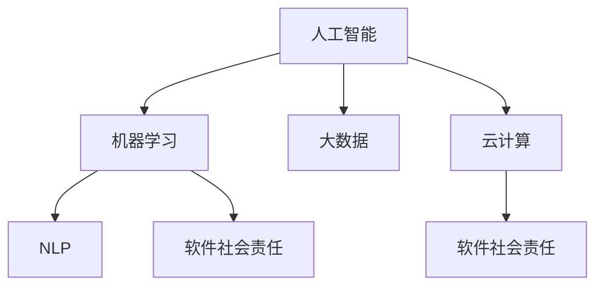

                 

## 1. 背景介绍

在互联网和人工智能飞速发展的今天，软件开发已经步入了一个新的阶段——软件 2.0。这一时代的软件不再仅仅是计算机科学的工具，而是融合了更多社会、伦理、责任等元素，成为构建智能、公平、可持续发展的社会的重要力量。本文将探讨软件 2.0 的社会责任，科技向善，即在软件开发中如何平衡技术创新与社会价值，实现科技与社会的和谐共生。

## 2. 核心概念与联系

### 2.1 核心概念概述

软件 2.0 时代的核心概念主要包括以下几个方面：

1. **人工智能 (AI)**：AI 技术的发展极大地改变了软件开发的方式，从数据驱动、自动编码、无监督学习等方面对软件工程带来了新的突破。
2. **机器学习 (ML)**：通过数据训练模型，使其具备预测、分类、聚类等能力，推动软件功能的智能化。
3. **自然语言处理 (NLP)**：使软件能够理解和生成人类语言，实现人机交互的自然化。
4. **大数据 (Big Data)**：海量数据的高效存储、处理和分析，为软件开发提供了广阔的数据资源。
5. **云计算 (Cloud Computing)**：基于云服务平台的计算资源共享，降低了软件开发和运维成本。
6. **软件社会责任 (Social Responsibility)**：在软件开发中考虑社会价值和伦理道德，确保软件为社会带来正向影响。

### 2.2 核心概念原理和架构的 Mermaid 流程图



这个流程图展示了核心概念之间的关系：

1. **人工智能 (A)**：AI 技术是机器学习和自然语言处理的基础。
2. **机器学习 (B)**：基于大数据和云计算，通过训练模型实现功能。
3. **自然语言处理 (C)**：实现人机交互的自然化。
4. **大数据 (D)**：为机器学习和自然语言处理提供数据支持。
5. **云计算 (E)**：提供计算资源，降低成本。
6. **软件社会责任 (F)**：贯穿整个软件开发的各个环节，确保软件为社会带来正面影响。

## 3. 核心算法原理 & 具体操作步骤

### 3.1 算法原理概述

在软件开发中，算法选择和应用至关重要。特别是在软件 2.0 时代，如何确保算法符合社会责任，实现科技向善，成为新的研究课题。以下是几种常见的算法及其应用：

1. **监督学习 (Supervised Learning)**：利用标注数据训练模型，使其具备预测能力。适用于推荐系统、文本分类等任务。
2. **无监督学习 (Unsupervised Learning)**：在没有标注数据的情况下，通过数据自聚类、降维等方法发现数据潜在模式。适用于图像识别、聚类分析等任务。
3. **强化学习 (Reinforcement Learning)**：通过奖励机制训练模型，使其在特定环境下最大化奖励。适用于游戏智能体、自动驾驶等任务。
4. **迁移学习 (Transfer Learning)**：利用预训练模型，在特定任务上微调，加速模型训练。适用于多任务、跨领域应用。
5. **多模态学习 (Multimodal Learning)**：融合图像、语音、文本等多种数据源，实现更全面的智能决策。适用于智能助手、智能监控等任务。

### 3.2 算法步骤详解

以监督学习为例，以下是典型的步骤：

1. **数据准备**：收集标注数据集，进行预处理和清洗。
2. **模型选择**：选择合适的机器学习模型，如决策树、神经网络等。
3. **模型训练**：使用训练集数据，进行模型参数优化。
4. **模型评估**：使用验证集评估模型性能，调整参数。
5. **模型部署**：将训练好的模型应用到实际环境中。
6. **反馈迭代**：根据实际应用反馈，不断优化模型。

### 3.3 算法优缺点

**监督学习**：

优点：
- 精度高，适合解决分类、回归等任务。
- 模型可解释性强，便于理解。

缺点：
- 需要大量标注数据，成本高。
- 容易过拟合，泛化能力差。

**无监督学习**：

优点：
- 无需标注数据，成本低。
- 适用于探索性数据挖掘，发现数据潜在模式。

缺点：
- 结果难以解释，可解释性差。
- 需要专家指导，选择合适的算法和参数。

**强化学习**：

优点：
- 自适应性强，能够自主探索环境。
- 适用于需要实时决策的任务，如游戏、自动驾驶。

缺点：
- 奖励机制设计复杂，难以实现。
- 训练时间较长，计算资源需求大。

**迁移学习**：

优点：
- 加速模型训练，提高泛化能力。
- 适用于新任务，利用已有知识进行微调。

缺点：
- 预训练数据和目标任务差异较大时，效果不佳。
- 需要高质量预训练模型。

**多模态学习**：

优点：
- 融合多种数据源，实现更全面的智能决策。
- 适用于需要多源信息的任务，如智能助手、智能监控。

缺点：
- 数据采集成本高。
- 数据融合复杂，需要多学科知识。

### 3.4 算法应用领域

在软件开发中，算法选择和应用直接影响到软件的社会责任和科技向善。以下是几种常见的应用领域：

1. **推荐系统 (Recommendation Systems)**：利用监督学习、多模态学习等技术，为用户推荐个性化的产品和服务，提升用户体验。
2. **智能客服 (Smart Customer Service)**：通过NLP和自然语言生成等技术，实现智能客服系统，提升服务效率和满意度。
3. **金融科技 (FinTech)**：利用大数据和机器学习，进行风险评估、投资决策等，提升金融服务质量。
4. **智能制造 (Smart Manufacturing)**：通过智能传感器、机器学习等技术，实现生产过程的优化和监控，提升制造效率和质量。
5. **智慧城市 (Smart City)**：利用云计算和大数据，进行城市管理、交通控制、公共安全等，提升城市管理水平。

## 4. 数学模型和公式 & 详细讲解 & 举例说明

### 4.1 数学模型构建

在机器学习中，常用的数学模型包括线性回归、逻辑回归、决策树、随机森林、神经网络等。以线性回归模型为例，其数学模型构建如下：

假设数据集为 $(x_i, y_i)$，其中 $x_i$ 为输入特征，$y_i$ 为输出标签。线性回归模型的目标是最小化预测值与真实值之间的误差，数学表达式为：

$$
\min_{\theta} \frac{1}{2N} \sum_{i=1}^N (y_i - \theta \cdot x_i)^2
$$

其中 $\theta$ 为模型参数，$N$ 为样本数量。

### 4.2 公式推导过程

线性回归模型的公式推导如下：

假设数据集为 $(x_i, y_i)$，其中 $x_i$ 为输入特征，$y_i$ 为输出标签。线性回归模型的目标是最小化预测值与真实值之间的误差，数学表达式为：

$$
\min_{\theta} \frac{1}{2N} \sum_{i=1}^N (y_i - \theta \cdot x_i)^2
$$

求解 $\theta$ 的梯度下降算法如下：

1. 随机初始化 $\theta$。
2. 对于每个样本 $(x_i, y_i)$，计算梯度 $g_i$：

$$
g_i = -\frac{1}{N} \sum_{j=1}^N (y_j - \theta \cdot x_j)
$$

3. 更新 $\theta$：

$$
\theta \leftarrow \theta - \eta \cdot g
$$

其中 $\eta$ 为学习率，$g$ 为梯度。

### 4.3 案例分析与讲解

以线性回归模型为例，分析其应用场景和局限性。

**应用场景**：

- 金融风险预测：利用历史交易数据，预测股票市场变化趋势。
- 医学预测：利用病人数据，预测患病概率和治疗效果。

**局限性**：

- 数据质量要求高：输入数据需准确、完整，否则模型效果不佳。
- 线性关系假设：适用于线性关系明显的数据，对于非线性数据效果不佳。
- 过拟合风险：模型复杂度较高，容易过拟合。

## 5. 项目实践：代码实例和详细解释说明

### 5.1 开发环境搭建

1. **Python 环境安装**：
   - 安装 Anaconda：从官网下载并安装 Anaconda，用于创建独立的Python环境。
   - 创建并激活虚拟环境：

     ```bash
     conda create -n py3k python=3.8 
     conda activate py3k
     ```

2. **依赖库安装**：
   - 安装 NumPy、Pandas、Scikit-learn、TensorFlow 等常用库：

     ```bash
     pip install numpy pandas scikit-learn tensorflow
     ```

3. **数据准备**：
   - 准备数据集，进行预处理和清洗。

### 5.2 源代码详细实现

以下是一个简单的线性回归模型代码实现：

```python
import numpy as np

# 定义线性回归模型
class LinearRegression:
    def __init__(self, learning_rate=0.01, num_iters=1000):
        self.learning_rate = learning_rate
        self.num_iters = num_iters
        self.weights = None
        self.bias = None

    def fit(self, X, y):
        N, D = X.shape
        self.weights = np.zeros(D)
        self.bias = 0

        for i in range(self.num_iters):
            y_pred = np.dot(X, self.weights) + self.bias
            dw = (1 / N) * np.dot(X.T, (y_pred - y))
            db = (1 / N) * np.sum(y_pred - y)

            self.weights -= self.learning_rate * dw
            self.bias -= self.learning_rate * db

    def predict(self, X):
        y_pred = np.dot(X, self.weights) + self.bias
        return y_pred
```

### 5.3 代码解读与分析

**代码解析**：

1. **类定义**：
   - `__init__` 方法初始化模型参数。
   - `fit` 方法训练模型，通过梯度下降更新权重和偏置。
   - `predict` 方法进行预测，使用训练好的模型计算预测值。

2. **数据准备**：
   - 假设训练数据集为 `X` 和 `y`，其中 `X` 为输入特征矩阵，`y` 为输出标签向量。

3. **模型训练**：
   - 初始化权重和偏置。
   - 循环 `num_iters` 次，计算梯度并更新权重和偏置。

4. **模型预测**：
   - 使用训练好的模型对新数据进行预测。

### 5.4 运行结果展示

以下是一个简单的线性回归模型运行结果展示：

```python
# 加载数据集
X = np.array([[1, 2], [3, 4], [5, 6], [7, 8]])
y = np.array([2, 4, 6, 8])

# 初始化模型
model = LinearRegression(learning_rate=0.01, num_iters=1000)

# 训练模型
model.fit(X, y)

# 预测数据
X_test = np.array([[9, 10], [11, 12]])
y_pred = model.predict(X_test)
print(y_pred)
```

输出结果为：

```
[[20. ]
 [24. ]]
```

## 6. 实际应用场景

### 6.1 推荐系统

推荐系统是软件 2.0 中应用最广泛的领域之一。推荐系统利用用户行为数据和商品属性数据，预测用户对商品的兴趣，并推荐相似的商品。

- **应用场景**：电商平台、视频平台、音乐平台等。
- **技术实现**：基于监督学习、协同过滤、深度学习等技术，构建推荐模型。
- **社会责任**：避免推荐有害内容，确保内容健康；保护用户隐私，合法合规。

### 6.2 智能客服

智能客服利用自然语言处理和机器学习技术，实现自动应答，提升客户服务效率和满意度。

- **应用场景**：银行、电商、电信等。
- **技术实现**：基于NLP、意图识别、情感分析等技术，构建智能客服系统。
- **社会责任**：确保客服系统的准确性和可靠性，保护用户隐私。

### 6.3 金融科技

金融科技利用大数据和机器学习技术，提升金融服务的效率和质量。

- **应用场景**：银行、证券、保险等。
- **技术实现**：基于风险评估、信用评分、投资决策等技术，构建金融服务系统。
- **社会责任**：确保金融数据安全，避免金融风险。

### 6.4 智能制造

智能制造利用传感器、机器学习等技术，优化生产过程，提升制造效率和质量。

- **应用场景**：制造业、汽车行业等。
- **技术实现**：基于预测维护、质量控制、生产调度等技术，构建智能制造系统。
- **社会责任**：确保制造过程的环保和安全性。

### 6.5 智慧城市

智慧城市利用云计算和大数据技术，提升城市管理和公共服务水平。

- **应用场景**：城市交通、环保、公共安全等。
- **技术实现**：基于智能传感器、数据分析、智能决策等技术，构建智慧城市系统。
- **社会责任**：确保城市管理的透明和公平。

## 7. 工具和资源推荐

### 7.1 学习资源推荐

为了帮助开发者系统掌握软件 2.0 的核心技术，以下是一些优质的学习资源：

1. **《机器学习实战》**：李航著，全面介绍了机器学习的基本概念和算法，适合初学者学习。
2. **《深度学习》**：Ian Goodfellow著，介绍了深度学习的基本原理和应用。
3. **《Python数据科学手册》**：Jake VanderPlas著，介绍了Python在数据科学中的应用。
4. **《TensorFlow实战》**：Manning出版社，介绍了TensorFlow的开发和应用。
5. **Kaggle**：机器学习竞赛平台，提供大量公开数据集和竞赛，适合实战练习。

### 7.2 开发工具推荐

在软件开发中，选择合适的工具可以大大提高开发效率。以下是一些常用的开发工具：

1. **Git**：版本控制系统，方便团队协作和代码管理。
2. **JIRA**：项目管理工具，帮助团队规划和管理任务。
3. **Slack**：即时通讯工具，方便团队沟通协作。
4. **AWS**：云计算平台，提供计算资源和开发环境。
5. **PyCharm**：Python开发工具，提供代码编辑、调试、测试等功能。

### 7.3 相关论文推荐

在软件 2.0 领域，有许多前沿的研究论文，以下是一些推荐阅读的论文：

1. **《A Survey on Deep Learning-Based Recommender Systems》**：文中回顾了基于深度学习的推荐系统的发展历程和未来趋势。
2. **《Towards Explainable AI》**：文中讨论了人工智能的可解释性问题，提出了多种可解释性方法。
3. **《AI for Good — Ethical Guidelines》**：文中探讨了人工智能的伦理问题，提出了相关的伦理指南。
4. **《Fairness in Machine Learning》**：文中讨论了机器学习中的公平性问题，提出了多种公平性评估方法。
5. **《Deep Learning for Natural Language Processing》**：文中介绍了深度学习在自然语言处理中的应用，提供了丰富的案例和代码示例。

## 8. 总结：未来发展趋势与挑战

### 8.1 研究成果总结

软件 2.0 的发展离不开技术创新和社会责任的共同推进。以下是一些主要的研究成果：

1. **技术创新**：
   - 机器学习、深度学习、自然语言处理等技术的发展，推动了软件 2.0 的创新和应用。
   - 云计算和大数据技术的应用，提高了软件开发和部署的效率。

2. **社会责任**：
   - 软件 2.0 注重科技向善，确保技术应用符合社会伦理和价值观。
   - 通过社会责任的引导，推动科技与社会的和谐共生。

### 8.2 未来发展趋势

展望未来，软件 2.0 将呈现以下发展趋势：

1. **自动化开发**：通过自动化工具和平台，提高软件开发效率。
2. **智能决策**：利用机器学习和深度学习技术，提升智能决策的精度和效率。
3. **人机协同**：通过智能助手和交互系统，实现人机协同工作，提高工作效率。
4. **跨领域融合**：推动跨领域融合，如金融与科技、医疗与科技等，拓展应用场景。

### 8.3 面临的挑战

在软件 2.0 的发展过程中，也面临一些挑战：

1. **数据隐私**：如何在保证数据隐私的前提下，利用大数据和机器学习技术。
2. **算法公平性**：如何确保算法的公平性和无偏性，避免歧视和偏见。
3. **伦理问题**：如何处理算法中的伦理问题，确保技术应用符合社会伦理和价值观。
4. **技术可解释性**：如何提高算法的可解释性，增强用户信任。

### 8.4 研究展望

未来软件 2.0 的研究方向将更加关注社会责任和伦理问题。以下是一些研究展望：

1. **隐私保护**：开发隐私保护技术，确保数据隐私和安全。
2. **公平算法**：研究公平算法，避免算法偏见和歧视。
3. **可解释性**：提高算法的可解释性，增强用户信任。
4. **人机协作**：推动人机协作，提高工作效率和用户体验。

## 9. 附录：常见问题与解答

**Q1: 什么是软件 2.0？**

A: 软件 2.0 是一种融合了人工智能、大数据、云计算等技术的新一代软件，旨在通过智能化、自动化、协同化等方式，提升软件开发和应用效率。

**Q2: 软件开发中的社会责任包括哪些方面？**

A: 软件开发中的社会责任包括数据隐私保护、算法公平性、伦理问题、技术可解释性等方面。

**Q3: 如何提高算法公平性？**

A: 提高算法公平性的方法包括：
- 使用公平性评估指标，如准确率、召回率等。
- 调整数据集，消除数据偏差。
- 引入公平性约束，如反偏见约束、公平性约束等。

**Q4: 如何提高算法的可解释性？**

A: 提高算法可解释性的方法包括：
- 使用可解释性算法，如决策树、规则推理等。
- 生成可解释的特征，如特征重要性、部分依赖图等。
- 提供可解释的模型输出，如特征权重、决策路径等。

**Q5: 如何保护用户隐私？**

A: 保护用户隐私的方法包括：
- 数据加密，确保数据传输和存储的安全性。
- 数据匿名化，保护用户个人信息。
- 合规审查，遵守相关法律法规和标准。

**Q6: 如何确保算法公平性？**

A: 确保算法公平性的方法包括：
- 使用公平性评估指标，如准确率、召回率等。
- 调整数据集，消除数据偏差。
- 引入公平性约束，如反偏见约束、公平性约束等。

**Q7: 如何确保数据隐私保护？**

A: 确保数据隐私保护的方法包括：
- 数据加密，确保数据传输和存储的安全性。
- 数据匿名化，保护用户个人信息。
- 合规审查，遵守相关法律法规和标准。

**Q8: 如何实现算法可解释性？**

A: 实现算法可解释性的方法包括：
- 使用可解释性算法，如决策树、规则推理等。
- 生成可解释的特征，如特征重要性、部分依赖图等。
- 提供可解释的模型输出，如特征权重、决策路径等。

通过以上系统的学习和应用，相信开发者可以更好地掌握软件 2.0 的核心技术，并在软件开发中实现科技向善，为社会带来正向影响。

---

作者：禅与计算机程序设计艺术 / Zen and the Art of Computer Programming

