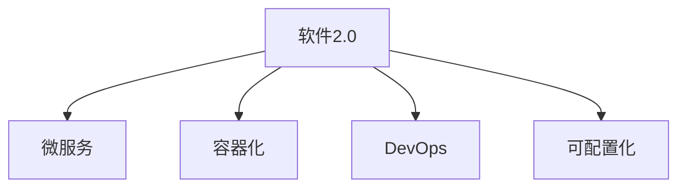

                 

# 软件2.0的可扩展性设计

> 关键词：软件2.0,可扩展性设计,微服务,容器化,DevOps,可配置化,云计算

## 1. 背景介绍

### 1.1 问题由来
随着互联网技术的发展，软件系统变得越来越复杂。传统的单体应用已经无法适应快速变化的市场需求，系统重构、技术栈升级等问题也频繁出现。软件架构的演进势在必行，从单体应用到微服务，再到容器化、DevOps和云计算，软件工程正在经历一场深刻的变革。

### 1.2 问题核心关键点
软件2.0的核心挑战在于构建高效、可扩展、易于维护的软件系统。而可扩展性设计是其中关键一环，它决定了系统能否应对快速变化的需求和复杂的业务逻辑。

具体而言，软件2.0可扩展性设计的主要目标包括：

1. **系统模块化**：将系统划分为独立的、可复用的模块，使各模块能够独立更新和扩展。
2. **服务解耦**：通过微服务等技术，实现不同模块间松耦合，减少模块间的依赖和影响。
3. **弹性伸缩**：系统能够根据负载自动扩展或缩减资源，保持高效运行。
4. **快速迭代**：通过DevOps和CI/CD等实践，实现持续集成和快速部署，提升系统迭代速度。
5. **高可靠性**：通过容器化、负载均衡、故障转移等技术，确保系统的高可用性和稳定性。

### 1.3 问题研究意义
研究软件2.0的可扩展性设计，对于构建高效、可维护的软件系统，提升软件开发效率和质量，具有重要意义：

1. **降低开发成本**：通过模块化和解耦，降低了系统复杂度和开发难度，提升开发效率。
2. **提升系统性能**：通过弹性伸缩和高可靠性设计，确保系统在高峰负载下仍能稳定运行，提升用户体验。
3. **加速系统迭代**：通过DevOps和CI/CD实践，实现了快速迭代和持续交付，提升了软件质量和市场竞争力。
4. **应对业务变化**：通过可配置化和模块化设计，使系统能够快速适应业务变化和需求升级。

## 2. 核心概念与联系

### 2.1 核心概念概述

为更好地理解软件2.0的可扩展性设计，本节将介绍几个关键概念：

- **软件2.0**：指基于云计算、微服务、DevOps等现代技术栈构建的软件系统，具备高可用性、高伸缩性和高扩展性。
- **微服务**：一种架构风格，将应用拆分为多个独立、可部署的服务单元，通过RESTful API或gRPC等通信协议进行通信。
- **容器化**：将应用及其依赖打包在容器中，容器可独立部署和运行，实现了"应用即服务"的思路。
- **DevOps**：一种文化、实践和工具链，强调软件开发和运维的协同合作，实现持续集成和持续交付。
- **可配置化**：指系统可以通过配置文件或环境变量等灵活配置，适应不同的运行环境和业务需求。

这些核心概念之间的逻辑关系可以通过以下Mermaid流程图来展示：



这个流程图展示了几大核心概念之间的联系：

1. **软件2.0**：是现代软件架构的统称，包含微服务、容器化、DevOps和可配置化等技术。
2. **微服务**：是软件2.0的核心组件，通过服务解耦实现系统可扩展性。
3. **容器化**：是实现微服务的重要技术，通过容器实现服务解耦和弹性伸缩。
4. **DevOps**：是实现软件2.0的关键实践，通过持续集成和持续交付提升系统迭代速度。
5. **可配置化**：通过灵活配置实现系统适应不同环境和需求，增强系统的可维护性。

## 3. 核心算法原理 & 具体操作步骤
### 3.1 算法原理概述

软件2.0的可扩展性设计，其核心思想是将复杂的大型系统拆分为多个小而美的微服务，通过服务间松耦合、资源弹性伸缩等技术手段，实现系统的高可用性和可维护性。

具体而言，基于软件2.0的可扩展性设计包括以下几个关键步骤：

1. **系统模块化**：将系统按照业务功能拆分为独立的模块，每个模块负责单一功能，减少模块间的耦合和依赖。
2. **服务解耦**：通过微服务、RESTful API或gRPC等技术，实现不同模块间的松耦合，提升系统的扩展性和灵活性。
3. **弹性伸缩**：通过容器化、Kubernetes等技术，实现服务实例的动态扩展和缩减，确保系统在负载变化时仍能高效运行。
4. **持续集成和持续交付**：通过DevOps和CI/CD实践，实现代码的持续集成和快速部署，提升系统的迭代速度和质量。
5. **高可靠性设计**：通过负载均衡、故障转移、自我修复等技术，提升系统的稳定性和可用性。

### 3.2 算法步骤详解

以下是软件2.0可扩展性设计的详细步骤：

**Step 1: 系统模块化**

- 分析系统功能和业务需求，确定系统的主要模块和子模块。
- 每个模块应具有独立的功能和业务逻辑，模块之间通过RESTful API或gRPC等通信协议进行交互。
- 使用接口定义语言如OpenAPI或Protocol Buffers等，明确模块间的接口契约，减少耦合。

**Step 2: 服务解耦**

- 将模块拆分为多个独立的微服务，每个微服务负责单一功能。
- 使用容器化技术如Docker或Kubernetes，将每个微服务打包为独立的容器实例。
- 使用API网关如Zuul或Kong，管理和路由不同模块间的API请求，实现服务解耦。

**Step 3: 弹性伸缩**

- 在Kubernetes中，通过Deployment和Service等对象，实现服务的动态扩展和缩减。
- 设置AutoScaler或Horizontal Pod Autoscaler，根据系统负载自动调整Pod数量。
- 通过LoadBalancer或NodePort Service等，实现服务的负载均衡和可访问性。

**Step 4: 持续集成和持续交付**

- 使用GitLab CI/CD等工具，配置代码的持续集成和持续交付流程。
- 通过Jenkins、Travis CI等工具，实现自动化测试和构建。
- 将构建好的Docker镜像推送到容器仓库如Docker Hub或Amazon ECR，实现快速部署和回滚。

**Step 5: 高可靠性设计**

- 通过Nginx或HAProxy等负载均衡器，实现服务的高可用性和容错性。
- 使用数据库中间件如Redis或RabbitMQ，实现消息队列的异步通信和故障转移。
- 通过Hystrix或Resilience4j等工具，实现服务的自我修复和异常处理。

### 3.3 算法优缺点

软件2.0的可扩展性设计具有以下优点：

1. **提升系统性能**：通过微服务和服务解耦，减少了模块间的依赖和影响，提升了系统的性能和稳定性。
2. **增强系统扩展性**：通过容器化和弹性伸缩，实现了服务的动态扩展和缩减，确保系统在负载变化时仍能高效运行。
3. **降低开发成本**：通过模块化和DevOps实践，减少了系统复杂度和开发难度，提升了开发效率。
4. **提升系统可靠性**：通过高可靠性设计和持续集成实践，确保系统的高可用性和快速迭代。

但该方法也存在一定的局限性：

1. **部署复杂度增加**：容器化和服务解耦增加了系统的部署和管理复杂度。
2. **网络通信开销增加**：微服务间通过网络通信，可能会增加通信开销，影响系统性能。
3. **故障诊断困难**：系统由多个服务组成，故障定位和诊断变得更为复杂。
4. **资源利用率低**：服务解耦和容器化可能会导致资源利用率低，资源浪费的问题。

尽管存在这些局限性，但就目前而言，基于软件2.0的可扩展性设计方法仍是最主流的系统构建方式。未来相关研究的重点在于如何进一步优化服务解耦和资源利用率，提升系统的性能和可维护性。

### 3.4 算法应用领域

软件2.0的可扩展性设计已经在众多领域得到了广泛应用，例如：

- **电商系统**：通过微服务和容器化，实现高并发的商品推荐、订单处理等功能，提升用户体验。
- **金融系统**：通过微服务和DevOps实践，实现高频交易、风险管理等功能的快速迭代和持续交付。
- **智能客服系统**：通过微服务和API网关，实现分布式部署和负载均衡，提升系统的稳定性和可用性。
- **物联网系统**：通过容器化和弹性伸缩，实现设备管理、数据采集等功能的快速扩展和扩展，提升系统灵活性。
- **智能制造系统**：通过微服务和DevOps实践，实现生产调度、质量控制等功能的快速迭代和持续交付。

除了上述这些经典应用外，软件2.0可扩展性设计也被创新性地应用到更多场景中，如可控文本生成、自然语言处理、自动驾驶等，为各行各业带来了新的技术突破。

## 4. 数学模型和公式 & 详细讲解 & 举例说明
### 4.1 数学模型构建

软件2.0的可扩展性设计，涉及多个模块和服务的协同工作，其数学模型可以通过以下方式构建：

**假设系统由n个模块组成，每个模块的性能为P_i**，服务间的通信延迟为C，总服务数为S，总负载为L，则系统的总体性能P为：

$$
P = \frac{1}{n} \sum_{i=1}^n P_i - \frac{C \times (n-1)}{S} \times L
$$

其中，第一项为模块性能的加权平均，第二项为通信延迟的消耗。通过调整模块数量和部署方式，可以优化系统的总体性能。

### 4.2 公式推导过程

以下我们以电商系统为例，推导负载均衡和高可用性设计的数学模型。

假设电商系统的订单处理模块为Service_A，支付模块为Service_B，库存模块为Service_C，每个模块的性能为P_i，服务间的通信延迟为C，总服务数为S，总负载为L，负载均衡策略为Round Robin，则系统的总体性能P为：

$$
P = \frac{1}{S} \times \left[ \frac{L}{P_A} + \frac{L}{P_B} + \frac{L}{P_C} \right] - \frac{C}{S} \times (S-1) \times L
$$

其中，第一项为各服务模块的性能加权平均，第二项为通信延迟的消耗。通过调整服务数量和服务间的负载均衡策略，可以优化系统的总体性能。

### 4.3 案例分析与讲解

以一个典型的电商系统为例，我们将系统的模块和功能如下划分：

- **订单处理**：负责订单生成、处理、更新等操作。
- **支付处理**：负责支付信息验证、支付结果通知等操作。
- **库存管理**：负责库存状态的查询、更新、同步等操作。
- **商品推荐**：根据用户行为和偏好，推荐相关商品。
- **用户认证**：负责用户登录、注册、权限控制等操作。

使用Docker和Kubernetes进行容器化，每个服务模块分别部署，并通过RESTful API或gRPC进行通信。通过Nginx进行负载均衡，使用Redis实现消息队列的异步通信和故障转移，使用Jenkins实现持续集成和持续交付，最终实现系统的稳定运行和快速迭代。

## 5. 项目实践：代码实例和详细解释说明
### 5.1 开发环境搭建

在进行软件2.0可扩展性设计的实践前，我们需要准备好开发环境。以下是使用Docker和Kubernetes进行实践的环境配置流程：

1. 安装Docker：从官网下载并安装Docker，并配置好相关的镜像仓库。
2. 安装Kubernetes：从官网下载并安装Kubernetes，并配置好相关的主机和集群。
3. 安装相关工具：如Helm、Minikube、Jenkins等。

完成上述步骤后，即可在Kubernetes集群中开始软件2.0的实践。

### 5.2 源代码详细实现

下面以一个电商系统的订单处理模块为例，给出使用Docker和Kubernetes进行容器化实践的代码实现。

**1. 编写Dockerfile**

```dockerfile
# 基础镜像
FROM nginx:latest

# 安装依赖
RUN apt-get update && apt-get install -y nginx

# 设置服务端口
EXPOSE 80

# 启动nginx服务
CMD ["nginx", "-g", "daemon off;"]
```

**2. 构建Docker镜像**

```bash
docker build -t order-service .
```

**3. 部署Docker镜像到Kubernetes**

```yaml
apiVersion: v1
kind: Deployment
metadata:
  name: order-service
spec:
  replicas: 3
  selector:
    matchLabels:
      app: order-service
  template:
    metadata:
      labels:
        app: order-service
    spec:
      containers:
      - name: order-service
        image: order-service:latest
        ports:
        - containerPort: 80
```

**4. 部署Service**

```yaml
apiVersion: v1
kind: Service
metadata:
  name: order-service
spec:
  selector:
    app: order-service
  ports:
    - protocol: TCP
      port: 80
      targetPort: 80
```

**5. 使用Helm进行部署**

```bash
kubectl create -f order-service-deployment.yaml
kubectl create -f order-service-service.yaml
```

以上代码实现了一个基本的订单处理模块的容器化和部署过程，具体步骤如下：

- 编写Dockerfile，定义订单服务的基本镜像和依赖安装。
- 构建Docker镜像，并通过Docker推送到镜像仓库。
- 在Kubernetes中创建Deployment和Service，将Docker镜像部署到集群中，并通过Service进行暴露。
- 最后通过Helm进行统一管理和配置，实现快速部署和回滚。

### 5.3 代码解读与分析

下面是一些关键代码的解读与分析：

**Dockerfile**

```dockerfile
FROM nginx:latest
RUN apt-get update && apt-get install -y nginx
EXPOSE 80
CMD ["nginx", "-g", "daemon off;"]
```

这段代码定义了Docker镜像的基本组成和依赖安装，包括：

- 使用nginx作为基础镜像，保证系统的稳定性。
- 在运行过程中安装nginx服务，启动nginx作为订单服务的代理。
- 将端口80暴露出来，方便外部访问。

**Kubernetes Deployment**

```yaml
apiVersion: v1
kind: Deployment
metadata:
  name: order-service
spec:
  replicas: 3
  selector:
    matchLabels:
      app: order-service
  template:
    metadata:
      labels:
        app: order-service
    spec:
      containers:
      - name: order-service
        image: order-service:latest
        ports:
        - containerPort: 80
```

这段代码定义了Kubernetes中的Deployment对象，包括：

- 定义了Deployment的名称和标签。
- 定义了服务的副本数量，保证高可用性。
- 定义了服务的容器配置，包括容器名称、镜像、端口等。

**Kubernetes Service**

```yaml
apiVersion: v1
kind: Service
metadata:
  name: order-service
spec:
  selector:
    app: order-service
  ports:
    - protocol: TCP
      port: 80
      targetPort: 80
```

这段代码定义了Kubernetes中的Service对象，包括：

- 定义了Service的名称和标签。
- 定义了服务的端口和目标端口，通过Service将订单服务的端口暴露出来。

通过上述代码，我们完成了订单服务的容器化部署，并通过Kubernetes和Helm实现了快速迭代和持续交付，提升了系统的可维护性和扩展性。

## 6. 实际应用场景
### 6.1 智能客服系统

基于软件2.0的可扩展性设计，智能客服系统可以通过微服务和DevOps实践，实现高并发的客户咨询处理和实时对话生成，提升用户体验和满意度。

具体而言，智能客服系统可以将客户咨询、对话记录、情感分析等功能模块化，并通过微服务进行解耦和独立部署。通过Kubernetes和Helm进行容器化和自动化部署，实现系统的快速迭代和持续交付。

### 6.2 金融系统

金融系统通过软件2.0的可扩展性设计，可以实现高频交易、风险管理等功能的快速迭代和持续交付，提升系统的稳定性和安全性。

具体而言，金融系统可以将交易处理、风险评估、合规审计等功能模块化，并通过微服务进行解耦和独立部署。通过Kubernetes和Helm进行容器化和自动化部署，实现系统的快速迭代和持续交付。同时，通过负载均衡和故障转移技术，保证系统的稳定性和可用性。

### 6.3 物联网系统

物联网系统通过软件2.0的可扩展性设计，可以实现设备管理、数据采集等功能的快速扩展和扩展，提升系统的灵活性和可维护性。

具体而言，物联网系统可以将设备管理、数据采集、数据分析等功能模块化，并通过微服务进行解耦和独立部署。通过Kubernetes和Helm进行容器化和自动化部署，实现系统的快速迭代和持续交付。同时，通过容器编排工具如Prometheus和Grafana进行监控和告警，保证系统的稳定性和可用性。

### 6.4 未来应用展望

随着软件2.0技术的不断成熟，可扩展性设计将在更多领域得到应用，为传统行业带来变革性影响。

在智慧医疗领域，基于软件2.0的可扩展性设计，医疗系统可以实现病历记录、诊断分析、药物推荐等功能模块的快速迭代和持续交付，提升医疗服务的智能化水平和患者体验。

在智能制造领域，基于软件2.0的可扩展性设计，智能制造系统可以实现生产调度、质量控制、设备管理等功能的快速迭代和持续交付，提升制造效率和产品质量。

在智慧城市治理中，基于软件2.0的可扩展性设计，城市管理系统可以实现交通管理、环境监测、应急响应等功能模块的快速迭代和持续交付，提升城市管理的自动化和智能化水平。

此外，在企业生产、社会治理、文娱传媒等众多领域，基于软件2.0的可扩展性设计的人工智能应用也将不断涌现，为经济社会发展注入新的动力。相信随着技术的日益成熟，可扩展性设计将成为软件工程的重要方向，推动人工智能技术在各行各业的广泛应用。

## 7. 工具和资源推荐
### 7.1 学习资源推荐

为了帮助开发者系统掌握软件2.0的可扩展性设计理论基础和实践技巧，这里推荐一些优质的学习资源：

1. **《软件2.0：现代软件架构指南》**：本书系统介绍了软件2.0的演进历程、核心概念和关键实践，是理解软件2.0可扩展性设计的必备读物。
2. **《微服务架构设计》**：本书深入讲解了微服务的原理、设计模式和实践技巧，是掌握微服务架构的权威指南。
3. **《DevOps实践指南》**：本书介绍了DevOps文化、工具链和最佳实践，是实现持续集成和持续交付的必读之作。
4. **《Kubernetes实战》**：本书详细介绍了Kubernetes的原理、配置和管理实践，是容器编排技术的权威教程。
5. **《Docker实战》**：本书讲解了Docker的安装、配置和管理实践，是容器技术的入门教程。

通过对这些资源的学习实践，相信你一定能够快速掌握软件2.0的可扩展性设计的精髓，并用于解决实际的系统构建问题。

### 7.2 开发工具推荐

高效的开发离不开优秀的工具支持。以下是几款用于软件2.0可扩展性设计开发的常用工具：

1. **Docker**：基于容器的应用打包和运行工具，支持跨平台部署和灵活配置。
2. **Kubernetes**：基于容器编排的开源平台，支持集群管理和资源调度。
3. **Helm**：Kubernetes的包管理器，支持应用的一键部署和升级。
4. **Jenkins**：开源的持续集成和持续交付工具，支持代码的自动化测试和构建。
5. **GitLab CI/CD**：GitLab集成的持续集成和持续交付工具，支持DevOps实践。
6. **Prometheus**：开源的监控和告警系统，支持多维度数据采集和可视化。
7. **Grafana**：开源的仪表盘工具，支持数据可视化和告警。

合理利用这些工具，可以显著提升软件2.0可扩展性设计的开发效率，加快创新迭代的步伐。

### 7.3 相关论文推荐

软件2.0的可扩展性设计涉及多个领域的研究，以下是几篇奠基性的相关论文，推荐阅读：

1. **《微服务架构设计原则》**：这篇文章深入讲解了微服务架构的核心原则和设计模式，是微服务架构的入门指南。
2. **《DevOps最佳实践》**：这篇文章介绍了DevOps文化、工具链和最佳实践，是实现持续集成和持续交付的权威指南。
3. **《Kubernetes原理与实践》**：这篇文章讲解了Kubernetes的原理、配置和管理实践，是容器编排技术的权威教程。
4. **《软件2.0的演进与未来》**：这篇文章系统介绍了软件2.0的演进历程和未来发展趋势，是理解软件2.0的必读之作。

这些论文代表了大规模软件系统的设计演进和技术演进，对于理解软件2.0的可扩展性设计具有重要意义。通过学习这些前沿成果，可以帮助研究者把握学科前进方向，激发更多的创新灵感。

## 8. 总结：未来发展趋势与挑战
### 8.1 总结

本文对软件2.0的可扩展性设计进行了全面系统的介绍。首先阐述了软件2.0的核心挑战和可扩展性设计的目标，明确了系统模块化、服务解耦、弹性伸缩、持续集成和持续交付等关键点。其次，从原理到实践，详细讲解了可扩展性设计的数学模型和关键步骤，给出了微服务、容器化、DevOps等技术的详细实现。同时，本文还广泛探讨了可扩展性设计在智能客服、金融系统、物联网等多个行业领域的应用前景，展示了软件2.0技术的巨大潜力。

通过本文的系统梳理，可以看到，基于软件2.0的可扩展性设计正在成为现代软件工程的重要方向，极大地拓展了系统的可维护性、可扩展性和性能，为软件开发带来了新的突破。未来，伴随技术的发展，可扩展性设计将变得更加高效、灵活和可配置，为人工智能技术的广泛应用提供有力支撑。

### 8.2 未来发展趋势

展望未来，软件2.0的可扩展性设计将呈现以下几个发展趋势：

1. **微服务生态的繁荣**：微服务将成为更多行业的主流架构风格，通过标准化的API和微服务编排，实现服务的灵活组合和重构。
2. **容器编排技术的成熟**：Kubernetes将不断完善和优化，成为容器编排的事实标准，支持更灵活的资源管理和编排。
3. **DevOps实践的普及**：DevOps文化、工具链和最佳实践将得到更广泛的应用，持续集成和持续交付成为软件开发的标准流程。
4. **云原生应用的发展**：云原生架构将成为软件开发的主流，通过云平台提供的高效资源和自动化部署，实现应用的快速迭代和交付。
5. **可配置化技术的应用**：通过配置化技术，实现系统的灵活配置和动态调整，适应不同的运行环境和业务需求。

以上趋势凸显了软件2.0可扩展性设计的广阔前景。这些方向的探索发展，必将进一步提升软件开发效率和质量，为人工智能技术的广泛应用提供有力支撑。

### 8.3 面临的挑战

尽管软件2.0的可扩展性设计已经取得了瞩目成就，但在迈向更加智能化、普适化应用的过程中，它仍面临着诸多挑战：

1. **部署和管理复杂度增加**：容器化和微服务增加了系统的部署和管理复杂度，需要更多的技术和管理投入。
2. **网络通信开销增加**：微服务间通过网络通信，可能会增加通信开销，影响系统性能。
3. **故障定位困难**：系统由多个服务组成，故障定位和诊断变得更为复杂。
4. **资源利用率低**：服务解耦和容器化可能会导致资源利用率低，资源浪费的问题。
5. **安全性和稳定性**：系统的安全性、稳定性和高可用性仍然面临挑战，需要更多的安全防护和故障转移机制。

尽管存在这些挑战，但就目前而言，基于软件2.0的可扩展性设计方法仍是最主流的系统构建方式。未来相关研究的重点在于如何进一步优化服务解耦和资源利用率，提升系统的性能和可维护性。

### 8.4 研究展望

面对软件2.0可扩展性设计所面临的种种挑战，未来的研究需要在以下几个方面寻求新的突破：

1. **微服务治理的改进**：通过更好的服务治理工具和框架，如Sprung、NATS等，实现服务的灵活组合和动态调整。
2. **容器编排技术的优化**：通过更好的资源管理和调度技术，如Kubeflow、Fargate等，实现应用的灵活部署和弹性伸缩。
3. **持续集成和持续交付的提升**：通过更好的DevOps工具和实践，如GitLab CI/CD、Jenkins等，实现代码的快速迭代和持续交付。
4. **云原生应用的发展**：通过云平台提供的高效资源和自动化部署，实现应用的快速迭代和交付。
5. **可配置化技术的应用**：通过更好的配置化技术和模板，实现系统的灵活配置和动态调整。

这些研究方向的探索，必将引领软件2.0的可扩展性设计技术迈向更高的台阶，为软件开发和人工智能技术的广泛应用提供有力支撑。面向未来，软件2.0的可扩展性设计还需要与其他人工智能技术进行更深入的融合，如知识表示、因果推理、强化学习等，多路径协同发力，共同推动人工智能技术的进步。

## 9. 附录：常见问题与解答

**Q1：如何实现微服务的弹性伸缩？**

A: 通过Kubernetes中的Horizontal Pod Autoscaler(HPA)，可以实现服务的弹性伸缩。HPA根据服务负载自动调整Pod数量，确保服务在高负载下仍能高效运行。

**Q2：微服务解耦后，如何保证服务间的协同？**

A: 通过API网关如Zuul或Kong，管理和路由不同微服务间的API请求，实现服务间的协同。同时，通过消息队列如RabbitMQ或Kafka，实现服务间的异步通信和数据共享。

**Q3：如何保证微服务的可维护性？**

A: 通过DevOps和CI/CD实践，实现代码的持续集成和快速部署，提升系统的迭代速度和质量。同时，通过可配置化技术，实现系统的灵活配置和动态调整，提升系统的可维护性。

**Q4：如何保证微服务的安全性？**

A: 通过网络安全措施如防火墙、负载均衡器等，保护系统不受外部攻击。同时，通过加密技术如SSL/TLS，保护数据传输的安全性。

**Q5：如何保证微服务的稳定性？**

A: 通过高可靠性设计和负载均衡技术，保证服务的稳定性和高可用性。同时，通过自我修复和故障转移技术，确保服务在故障发生时仍能正常运行。

通过这些问题和解答，相信你对软件2.0的可扩展性设计有了更深入的理解。在实践中，还需要根据具体业务场景，灵活应用相关技术，不断优化和提升系统的性能和可维护性。

---

作者：禅与计算机程序设计艺术 / Zen and the Art of Computer Programming

