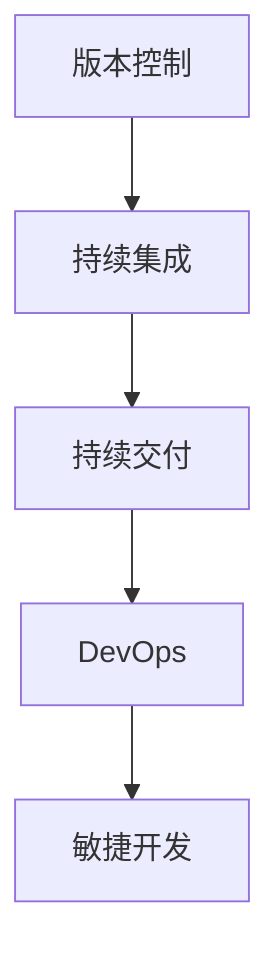

                 

# 软件2.0的版本管理与发布策略

> 关键词：软件工程,版本控制,持续集成,持续交付,DevOps,敏捷开发

## 1. 背景介绍

### 1.1 问题由来

在软件开发领域，软件2.0时代的到来已经势不可挡。软件2.0，即基于云计算、大数据、人工智能等新兴技术构建的智能化、自动化、可自生长的下一代软件形态，正在重新定义软件开发的范式和业务流程。软件开发范式的转变带来了版本管理与发布策略上的根本变革，以往基于线性开发模型的版本管理手段已无法满足软件2.0的灵活需求。如何在软件2.0时代，构建高效、安全、可控的软件版本管理系统，成为每一位软件开发人员和团队都必须面对的重要问题。

### 1.2 问题核心关键点

随着软件2.0的普及，软件开发模式已从传统的瀑布式开发转向敏捷开发、持续集成(CI)、持续交付(CD)等新型模式，这些模式对版本管理提出了更高的要求。版本管理不仅要保障开发人员对代码的控制和追踪，还要在敏捷开发、快速迭代的过程中，提供灵活、安全、高效的版本控制和发布策略支持。

1. **敏捷开发的版本管理**：敏捷开发要求快速迭代、持续交付，版本管理要支持敏捷团队的频繁分支、合并、发布等操作，同时保障代码的稳定性和可追踪性。
2. **持续集成与交付**：CI/CD要求对代码进行自动化的构建、测试和发布，版本管理要支持流水线集成和自动化发布，实现快速交付。
3. **多环境部署**：软件2.0时代，应用部署环境多样化，版本管理要支持跨环境的部署和回滚，确保在各类环境中的应用版本一致性。
4. **安全性与合规性**：版本管理还要关注代码的安全性和合规性，确保代码的审计、监管符合公司要求和法律法规。
5. **灵活性和扩展性**：版本管理系统应具备足够的灵活性和扩展性，支持团队不断变化的需求和技术栈。

## 2. 核心概念与联系

### 2.1 核心概念概述

为更好地理解软件2.0时代版本管理与发布策略，本节将介绍几个密切相关的核心概念：

- **版本控制(Version Control)**：对软件开发过程中的代码变更进行管理和追踪的系统。版本控制可以帮助团队协作、代码追踪、分支合并、版本发布等。
- **持续集成(Continuous Integration, CI)**：通过自动构建和测试，集成开发人员频繁提交的代码变更，确保代码质量。
- **持续交付(Continuous Delivery, CD)**：将代码变更快速、频繁、可靠地交付到生产环境，支持多次发布和回滚，保障软件质量。
- **DevOps**：将软件开发和运维结合的一体化文化、流程和工具，强调协作、沟通和持续交付。
- **敏捷开发(Agile Development)**：通过小规模、迭代式的开发方式，快速响应变化，提高软件适应性和交付效率。

这些核心概念之间的逻辑关系可以通过以下Mermaid流程图来展示：



这个流程图展示了一系列版本的管理与发布流程：

1. 从**版本控制**开始，对代码变更进行管理和追踪。
2. 使用**持续集成**自动构建和测试代码变更，保障代码质量。
3. 在**持续交付**环节，将代码变更频繁、可靠地交付到生产环境。
4. 通过**DevOps**实现软件开发和运维的一体化管理，提升协作效率。
5. 在**敏捷开发**的快速迭代过程中，版本管理策略得到灵活应用。

这些概念共同构成了软件2.0时代版本管理与发布的核心框架，支持敏捷开发、持续集成、持续交付等新型开发模式。

## 3. 核心算法原理 & 具体操作步骤
### 3.1 算法原理概述

在软件2.0时代，版本管理与发布策略的核心在于如何实现代码的自动化集成、测试、部署，同时保障代码变更的快速、安全、可靠。通过引入持续集成和持续交付的理念，版本管理可以更加高效、灵活地支持软件开发的全生命周期。

具体而言，版本管理的核心算法包括以下几个关键步骤：

1. **代码变更管理**：对开发人员提交的代码变更进行记录和追踪，通过分支管理实现不同版本之间的隔离和合并。
2. **自动化构建与测试**：对代码变更进行自动化构建、测试，确保代码质量符合生产标准。
3. **流水线集成与部署**：将代码变更集成到主分支，并自动化部署到生产环境，支持快速迭代和发布。
4. **版本回滚与审计**：在出现问题时，能够快速回滚到之前的版本，并进行代码审计，确保变更的安全性和合规性。

### 3.2 算法步骤详解

**Step 1: 准备版本控制工具**

- **版本控制工具**：选择适合团队需求的版本控制工具，如Git、SVN等。Git以其强大的分支管理和灵活性著称，适合敏捷开发模式。
- **工具安装与配置**：安装版本控制工具，并配置团队用户和权限，保证代码变更的受控和安全。

**Step 2: 搭建持续集成环境**

- **CI服务器**：选择适合CI流程的服务器，如Jenkins、Travis CI、GitHub Actions等。Jenkins以其易用性和可扩展性，被广泛用于CI场景。
- **构建脚本编写**：编写构建脚本，包含代码编译、单元测试、集成测试等内容。脚本应具备自动化和可重用性。
- **CI集成与配置**：将构建脚本集成到CI服务器，并配置触发条件、执行计划和失败处理策略。

**Step 3: 实施持续交付流程**

- **CD流水线**：在CI的基础上，搭建持续交付流水线，支持自动化部署。流水线包括构建、测试、部署、验证等步骤。
- **发布策略**：定义发布策略，支持灰度发布、蓝绿发布、A/B测试等，确保发布过程的安全性和可靠性。
- **回滚机制**：设计回滚机制，在发布出现问题时，能够快速回滚到之前的稳定版本。

**Step 4: 版本审计与合规性检查**

- **代码审计**：定期对代码变更进行审计，确保代码质量和安全合规。
- **合规性检查**：引入合规性检查工具，如SonarQube、Fortify等，保障代码符合公司要求和法律法规。

### 3.3 算法优缺点

**版本控制工具Git的优缺点**

- **优点**：
  - 灵活的分支管理：支持多种分支策略，支持频繁的分支合并。
  - 强大的版本追踪：记录代码变更历史，支持版本回退和追踪。
  - 社区支持和资源丰富：活跃的社区和丰富的资源，可以快速解决问题。

- **缺点**：
  - 学习曲线陡峭：对于新手，需要时间适应和掌握基本操作。
  - 本地操作复杂：本地操作需要建立和维护工作目录，增加管理复杂度。
  - 不支持物理文件管理：只支持文件元数据的跟踪，不适合大文件和物理文件管理。

**持续集成工具Jenkins的优缺点**

- **优点**：
  - 易用性高：界面友好，易于配置和管理。
  - 插件丰富：支持丰富的插件和扩展，满足不同需求。
  - 社区支持活跃：活跃的社区和用户群体，提供丰富的资源和支持。

- **缺点**：
  - 资源消耗较大：需要较重的服务器资源支持。
  - 扩展性有限：基础架构较为固定，扩展和定制较为复杂。
  - 安全性问题：配置不当可能导致安全隐患，需要额外管理。

### 3.4 算法应用领域

基于版本控制和持续集成的版本管理与发布策略，已经被广泛应用于软件开发、云计算、大数据、人工智能等众多领域。具体应用包括：

- **软件开发**：支持敏捷开发、持续集成、持续交付，确保代码质量和安全。
- **云计算**：支持自动化部署、持续集成和持续交付，保障云应用的高可用性。
- **大数据**：支持大数据流水线的自动化构建、测试和部署，确保数据处理的质量和效率。
- **人工智能**：支持AI模型的自动化训练、测试和部署，确保AI应用的稳定性和可靠性。

这些应用领域展示了版本管理与发布策略的广泛适用性和重要性，为软件2.0时代的软件开发提供了有力的保障。

## 4. 数学模型和公式 & 详细讲解 & 举例说明
### 4.1 数学模型构建

在本节中，我们将使用数学语言对软件2.0时代版本管理与发布策略进行更加严格的刻画。

假设软件开发团队使用Git进行版本控制，Jenkins作为持续集成和持续交付的工具。我们定义以下符号：

- $v_t$：版本$t$的版本号。
- $c_t$：版本$t$的代码变更。
- $b_t$：版本$t$的构建结果。
- $r_t$：版本$t$的发布结果。
- $a_t$：版本$t$的审计结果。

版本控制和持续集成模型的基本框架可以表示为：

$$
v_{t+1} = v_t + c_t
$$

$$
b_t = f(c_t)
$$

$$
r_t = g(b_t)
$$

$$
a_t = h(r_t)
$$

其中，$f$表示构建函数，$g$表示部署函数，$h$表示审计函数。

### 4.2 公式推导过程

以下我们以敏捷开发场景为例，推导版本控制和持续交付的基本流程。

**构建流程**：
$$
b_t = f(c_t) = c_t + \text{依赖库}
$$

**部署流程**：
$$
r_t = g(b_t) = b_t + \text{配置文件} + \text{环境变量}
$$

**审计流程**：
$$
a_t = h(r_t) = r_t + \text{审计规则} + \text{代码审查}
$$

在实际操作中，版本管理与发布流程更加复杂，涉及多个版本控制分支、多种构建和测试场景、多环境部署和回滚策略。通过建立清晰的数学模型，我们可以更好地理解和设计版本管理与发布流程，确保代码的稳定性和安全性。

### 4.3 案例分析与讲解

假设我们开发一个在线商城系统，使用Git和Jenkins进行版本管理与发布。具体流程如下：

1. **版本控制流程**：
   - 开发者A提交了功能模块$c_t$到Git仓库。
   - 开发者B通过合并请求将$c_t$合并到主分支。
   - 使用Git标签管理，为$c_t$打上版本号$v_t$。

2. **持续集成流程**：
   - 在Jenkins中配置构建脚本，每次代码提交后自动触发构建任务。
   - 构建脚本包含编译、单元测试、集成测试等步骤。
   - 构建成功后，将构建结果$b_t$推送到服务器。

3. **持续交付流程**：
   - 在Jenkins中配置部署脚本，将构建结果$b_t$部署到测试环境。
   - 测试通过后，将部署结果$r_t$推送到生产环境。
   - 使用灰度发布策略，逐步将新功能推送到生产环境。

4. **版本审计流程**：
   - 定期对部署结果$r_t$进行审计，确保符合安全性和合规性要求。
   - 引入SonarQube工具，对代码变更$c_t$进行静态分析，发现潜在问题。
   - 引入Fortify工具，对部署结果$r_t$进行动态分析，保障安全合规。

通过以上流程，我们能够构建一个高效、灵活、安全的版本管理和发布系统，支持敏捷开发和持续交付，确保软件2.0时代的开发效率和质量。

## 5. 项目实践：代码实例和详细解释说明
### 5.1 开发环境搭建

在进行版本管理与发布实践前，我们需要准备好开发环境。以下是使用Jenkins搭建持续集成环境的流程：

1. 安装Jenkins：从官网下载Jenkins，并按照官方文档进行安装配置。
2. 配置CI服务器：在Jenkins中配置CI服务器地址和用户权限。
3. 安装插件：在Jenkins中安装必要的插件，如Git插件、Maven插件、SonarQube插件等。
4. 编写构建脚本：在Jenkins中创建构建任务，编写构建脚本，包括编译、测试、打包等步骤。
5. 配置触发条件：在构建任务中配置触发条件，支持手动触发和代码变更触发。

完成上述步骤后，即可在Jenkins中开始持续集成和持续交付的实践。

### 5.2 源代码详细实现

下面我们以Git与Jenkins结合的敏捷开发场景为例，给出持续集成和持续交付的Jenkins代码实现。

首先，定义Jenkins构建脚本：

```python
pipeline {
    agent none

    stages {
        stage('Compile') {
            steps {
                sh 'mvn compile'
            }
        }
        stage('Test') {
            steps {
                sh 'mvn test'
            }
        }
        stage('Build') {
            steps {
                sh 'mvn package'
            }
        }
        stage('Deploy') {
            steps {
                sh 'mvn spring-boot:deploy'
            }
        }
    }
}
```

然后，定义Git仓库和持续集成配置：

```bash
# 克隆Git仓库
git clone https://github.com/example/repo.git
cd repo

# 配置JenkinsCI任务
Jenkinsfile: path/to/Jenkinsfile
```

最后，启动JenkinsCI任务并测试：

```bash
java -jar jenkins.war -Dhudson.model.Jenkins=hudson.user.Jenkins
```

这样就可以在Git中进行代码提交，自动触发JenkinsCI任务，完成代码构建和部署，实现持续集成和持续交付。

### 5.3 代码解读与分析

让我们再详细解读一下关键代码的实现细节：

**Jenkinsfile**：
- 定义Jenkins流水线的各个阶段，包括编译、测试、构建和部署。
- 每个阶段包含具体的构建命令，如Maven编译、测试、打包等。

**构建脚本**：
- 在Jenkins中创建构建任务，并设置触发条件。
- 构建脚本以Maven为例，通过配置pom.xml文件，自动执行编译、测试、打包等步骤。
- JenkinsCI任务配置需要在Git仓库中进行，通过Jenkinsfile定义的流水线，实现自动构建和部署。

**Jenkins启动命令**：
- 使用Java启动Jenkins服务器，并指定Jenkins配置文件路径。
- Jenkins服务器启动后，自动加载Git仓库中的Jenkinsfile，并开始执行构建任务。

通过以上代码实现，我们可以在Git中进行代码提交，自动触发JenkinsCI任务，完成代码构建和部署，实现持续集成和持续交付。

## 6. 实际应用场景
### 6.1 软件开发

基于Git和Jenkins的版本管理与发布策略，已经广泛应用于软件开发中，提高了软件开发的效率和质量。具体应用包括：

- **敏捷开发**：支持敏捷开发模式，实现频繁的分支、合并、发布操作，快速响应需求变化。
- **持续集成**：自动构建和测试代码变更，确保代码质量符合生产标准。
- **持续交付**：将代码变更频繁、可靠地交付到生产环境，支持快速迭代和发布。

### 6.2 云计算

在云计算环境中，版本管理与发布策略同样重要。具体应用包括：

- **云应用部署**：支持云应用的自动化部署和回滚，确保云应用的高可用性和稳定性。
- **云平台集成**：将云平台与版本控制系统集成，实现云应用的自动化管理。
- **云安全审计**：对云应用进行审计和合规性检查，保障云应用的安全性和合规性。

### 6.3 大数据

在大数据处理场景中，版本管理与发布策略同样重要。具体应用包括：

- **数据管道构建**：支持大数据流水线的自动化构建、测试和部署，确保数据处理的质量和效率。
- **数据质量保障**：对数据管道进行审计和合规性检查，保障数据处理的质量和安全。
- **数据版本管理**：对数据变更进行版本管理和追踪，确保数据变更的可控和可追溯。

### 6.4 未来应用展望

随着软件2.0时代的到来，版本管理与发布策略将在更多领域得到应用，为软件开发和运维带来变革性影响。

- **智能运维**：引入AI和大数据分析技术，实现更智能、自动化的运维管理。
- **多云管理**：支持跨云平台的版本管理和部署，实现更高效、灵活的云资源管理。
- **DevOps自动化**：将软件开发和运维流程自动化，提高开发效率和系统稳定性。
- **区块链管理**：引入区块链技术，实现代码变更的不可篡改和透明管理。

随着版本管理与发布策略的不断发展，相信软件开发和运维将迎来更高效、更安全、更智能的未来。

## 7. 工具和资源推荐
### 7.1 学习资源推荐

为了帮助开发者系统掌握软件2.0时代的版本管理与发布策略，这里推荐一些优质的学习资源：

1. **《软件2.0革命》**：探讨软件2.0时代的开发范式和应用场景，对软件开发和版本管理策略进行深入分析。
2. **《DevOps实践指南》**：详细讲解DevOps文化、流程和工具，帮助团队实现持续交付和持续集成。
3. **《Jenkins官方文档》**：Jenkins的官方文档，包含详细的配置和使用指南，是学习Jenkins的必备资源。
4. **《Git实战》**：介绍Git的基本概念和实用技巧，帮助开发者掌握版本控制的核心技能。
5. **《持续集成：理念、实践与工具》**：探讨持续集成的理念和实践，介绍常用的持续集成工具和插件。

通过学习这些资源，相信你一定能够全面掌握软件2.0时代的版本管理与发布策略，并用于解决实际的开发问题。

### 7.2 开发工具推荐

高效的开发离不开优秀的工具支持。以下是几款用于版本管理和持续集成/交付的常用工具：

1. **Git**：广泛用于版本控制，支持多种分支策略和协作模式。
2. **Jenkins**：开源的持续集成和持续交付工具，支持丰富的插件和扩展。
3. **SonarQube**：静态代码分析工具，帮助识别代码中的潜在问题和漏洞。
4. **Fortify**：动态应用安全分析工具，保障代码和应用程序的安全性。
5. **Docker**：容器化技术，支持应用在不同环境中的快速部署和迁移。

合理利用这些工具，可以显著提升版本管理和持续集成/交付的开发效率，加快创新迭代的步伐。

### 7.3 相关论文推荐

软件2.0时代的版本管理与发布策略源于学界的持续研究。以下是几篇奠基性的相关论文，推荐阅读：

1. **《分布式版本控制系统》**：探讨Git等分布式版本控制系统的原理和应用，为软件开发提供重要支持。
2. **《持续集成与持续交付实践》**：详细介绍持续集成和持续交付的理念和实践，提供详细的工具和流程指导。
3. **《DevOps工程化》**：讨论DevOps文化、流程和工具的工程化实现，帮助团队实现高效的持续交付。
4. **《软件发布自动化》**：研究软件发布的自动化过程，提出多种自动化发布策略和工具。

这些论文代表了大规模软件部署和版本管理的研究进展，为软件开发提供了重要的理论基础和实践指导。

## 8. 总结：未来发展趋势与挑战
### 8.1 研究成果总结

本文对软件2.0时代版本管理与发布策略进行了全面系统的介绍。首先阐述了版本控制和持续集成、持续交付的重要性，明确了版本管理在敏捷开发和持续交付中的关键作用。其次，从原理到实践，详细讲解了版本管理的数学模型和实现步骤，给出了版本管理任务开发的完整代码实例。同时，本文还广泛探讨了版本管理策略在软件开发、云计算、大数据等众多领域的应用前景，展示了版本管理与发布策略的广泛适用性和重要性。

通过本文的系统梳理，可以看到，软件2.0时代版本管理与发布策略正在成为软件开发的重要范式，极大地提升软件开发和运维的效率和质量。随着持续集成和持续交付的普及，软件2.0的开发模式将进一步深化，带来更加高效、智能的软件开发和管理。

### 8.2 未来发展趋势

展望未来，版本管理与发布策略将呈现以下几个发展趋势：

1. **自动化程度提升**：随着AI和大数据分析技术的应用，版本管理将更加自动化和智能化，实现更高效、智能的软件交付。
2. **多环境管理**：版本管理将支持多云环境、多平台部署，实现更灵活、可扩展的应用部署。
3. **安全性与合规性**：版本管理将引入更严格的安全性和合规性检查，保障软件质量和安全性。
4. **持续集成与持续交付**：CI/CD将更加自动化和灵活，实现更快速、可靠的持续交付。
5. **用户体验优化**：版本管理将关注用户体验和反馈，实现更智能、自动化的运维管理。

以上趋势凸显了版本管理与发布策略的广阔前景，为软件开发和运维带来了新的机遇和挑战。

### 8.3 面临的挑战

尽管版本管理与发布策略已经取得了显著进展，但在迈向更加智能化、普适化应用的过程中，它仍面临着诸多挑战：

1. **版本控制复杂性**：软件2.0时代，版本控制分支和合并的复杂性增加，分支冲突和合并困难。
2. **自动化难度**：自动化构建和测试在复杂应用场景中的难度增加，需要更多的工具和技能支持。
3. **安全性问题**：代码和应用程序的安全性保障需要更加严格和细致的管理。
4. **持续交付风险**：频繁的发布和回滚可能导致系统不稳定，需要更加精细化的管理。
5. **团队协作问题**：敏捷开发和多团队协作的复杂性增加，需要更加灵活和高效的版本管理策略。

这些挑战需要进一步的研究和优化，才能实现软件2.0时代的高效、智能、安全的软件开发和管理。

### 8.4 研究展望

面对版本管理与发布策略所面临的挑战，未来的研究需要在以下几个方面寻求新的突破：

1. **智能分支管理**：引入AI和大数据分析技术，实现更智能、自动化的分支管理。
2. **自动化工具优化**：开发更加智能、灵活的自动化工具，提升持续集成和持续交付的效率和可靠性。
3. **安全性和合规性**：引入更严格的安全性和合规性检查，保障软件质量和安全性。
4. **用户体验优化**：关注用户体验和反馈，实现更智能、自动化的运维管理。
5. **多环境管理**：支持多云环境、多平台部署，实现更灵活、可扩展的应用部署。

这些研究方向的探索，必将引领版本管理与发布策略迈向更高的台阶，为软件开发和运维提供更高效、更智能、更安全的技术保障。

## 9. 附录：常见问题与解答

**Q1：软件2.0时代版本管理与发布策略有哪些优势？**

A: 软件2.0时代版本管理与发布策略的优势包括：

1. **提高开发效率**：通过自动化构建和测试，实现频繁的迭代和快速发布，提升开发效率。
2. **保障代码质量**：持续集成和持续交付确保代码变更的质量符合生产标准。
3. **支持敏捷开发**：支持敏捷开发模式，实现频繁的分支、合并、发布操作。
4. **提升用户体验**：通过持续集成和持续交付，快速响应用户需求，提升用户体验。

**Q2：如何选择合适的版本控制工具？**

A: 选择合适的版本控制工具应考虑以下因素：

1. **开发模式**：敏捷开发推荐使用Git，传统的SVN等集中式版本控制适合保守和静态的项目。
2. **协作需求**：需要多团队协作的项目，推荐使用Git等分布式版本控制工具，支持复杂的分支和合并。
3. **安全性需求**：需要严格安全性和合规性检查的项目，推荐使用Git等支持细粒度权限控制的工具。
4. **扩展性需求**：需要灵活扩展和定制的版本控制工具，推荐使用Git等支持插件和扩展的工具。

**Q3：如何实现持续集成和持续交付？**

A: 实现持续集成和持续交付需要以下几个步骤：

1. **配置CI服务器**：选择适合的CI服务器，并配置构建脚本和触发条件。
2. **自动化构建和测试**：编写自动化构建脚本，并配置CI服务器，实现自动化构建和测试。
3. **自动化部署**：编写自动化部署脚本，并配置CI服务器，实现自动化部署。
4. **持续交付策略**：定义持续交付策略，支持灰度发布、蓝绿发布等，实现快速迭代和发布。

**Q4：版本管理与发布策略在多环境部署中面临哪些挑战？**

A: 版本管理与发布策略在多环境部署中面临以下挑战：

1. **环境不一致**：不同环境中的硬件、软件和配置可能存在差异，导致部署困难。
2. **配置管理复杂**：不同环境中的配置文件和环境变量管理复杂，容易出现配置冲突。
3. **版本回滚困难**：多环境部署中的版本回滚需要详细记录和对比各个环境中的变更，操作复杂。
4. **安全性问题**：多环境部署中的安全性问题需要额外管理和审计。

**Q5：版本管理与发布策略的未来发展方向是什么？**

A: 版本管理与发布策略的未来发展方向包括：

1. **自动化和智能化**：引入AI和大数据分析技术，实现更高效、智能的版本管理。
2. **安全性与合规性**：引入更严格的安全性和合规性检查，保障软件质量和安全性。
3. **用户体验优化**：关注用户体验和反馈，实现更智能、自动化的运维管理。
4. **多环境管理**：支持多云环境、多平台部署，实现更灵活、可扩展的应用部署。
5. **持续交付优化**：优化持续交付流程，支持更快速、可靠的发布和回滚。

这些发展方向将为软件开发和运维带来新的机遇和挑战，需要持续的研究和探索。

---

作者：禅与计算机程序设计艺术 / Zen and the Art of Computer Programming

