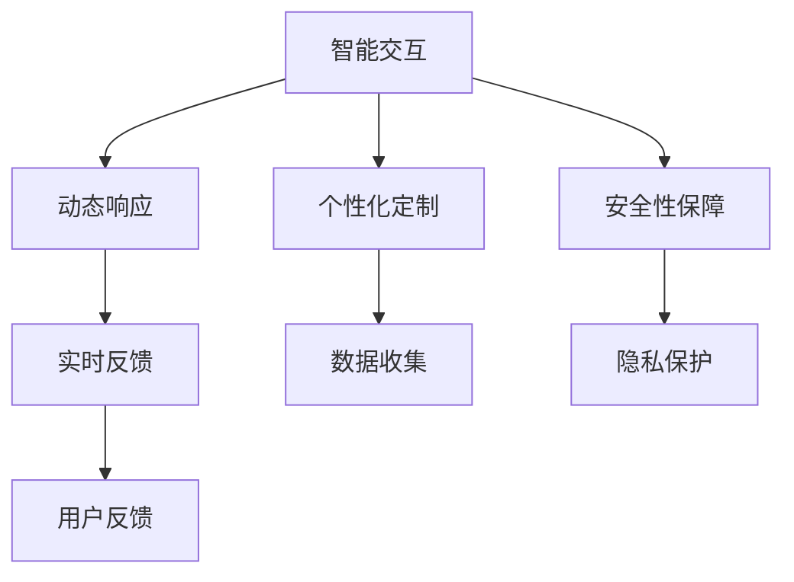

                 

# 软件2.0的用户体验设计

在科技飞速发展的今天，用户体验设计已经成为衡量软件成功与否的关键标准。随着软件2.0时代的到来，用户体验设计更加复杂和多样化，需要结合技术和业务的双重考量。本文将从核心概念、算法原理、具体操作、应用场景等角度，深入探讨软件2.0的用户体验设计。

## 1. 背景介绍

### 1.1 问题由来
随着人工智能、机器学习等技术的进步，软件2.0时代已经到来。与传统软件不同，软件2.0更加注重用户体验和智能化交互。用户不再是被动接受信息，而是与系统进行互动，共同完成目标任务。因此，软件2.0的用户体验设计需要更加注重交互性和智能性。

### 1.2 问题核心关键点
软件2.0的用户体验设计主要包括以下几个核心关键点：

- **智能交互**：通过自然语言处理、语音识别等技术，使软件能够与用户进行自然、流畅的对话。
- **个性化定制**：根据用户的历史行为和偏好，提供个性化的内容和推荐。
- **动态响应**：系统能够实时响应用户输入，及时调整和优化用户体验。
- **安全性保障**：保护用户数据和隐私，确保软件使用的安全性。

### 1.3 问题研究意义
软件2.0的用户体验设计对提升用户体验、增加用户黏性、促进软件成功有着重要意义。通过良好的用户体验设计，可以提升用户满意度和忠诚度，促进软件的广泛应用和市场推广。

## 2. 核心概念与联系

### 2.1 核心概念概述

软件2.0的用户体验设计涉及多个核心概念，包括智能交互、个性化定制、动态响应和安全性保障。这些概念之间的联系和互动关系，可以通过以下Mermaid流程图来展示：



这个流程图展示了用户体验设计的关键环节：

- **智能交互**：与用户进行自然、流畅的对话，提供个性化推荐。
- **个性化定制**：根据用户行为和偏好，提供定制化内容和服务。
- **动态响应**：实时响应用户输入，提供动态反馈和优化。
- **安全性保障**：保护用户数据和隐私，确保使用安全。

## 3. 核心算法原理 & 具体操作步骤

### 3.1 算法原理概述

软件2.0的用户体验设计主要基于以下几个算法原理：

- **自然语言处理(NLP)**：通过理解和生成自然语言，使软件能够与用户进行对话。
- **机器学习(ML)**：通过用户行为数据训练模型，实现个性化推荐和动态响应。
- **安全性保障**：通过数据加密、访问控制等技术，保护用户数据和隐私。

### 3.2 算法步骤详解

#### 3.2.1 自然语言处理(NLP)
自然语言处理是软件2.0用户体验设计的核心技术之一。NLP的主要步骤如下：

1. **文本预处理**：对用户输入的文本进行分词、词性标注、去除停用词等预处理操作，以提高后续处理的准确性。
2. **实体识别**：识别文本中的实体信息，如人名、地名、组织名等，为后续的语义理解提供基础。
3. **语义分析**：通过词向量模型、深度学习模型等技术，理解文本的语义和意图，为智能交互提供支持。
4. **生成响应**：根据语义分析结果，生成自然语言响应，并与用户进行对话。

#### 3.2.2 机器学习(ML)
机器学习在个性化定制和动态响应中发挥着重要作用。主要步骤如下：

1. **数据收集**：收集用户的历史行为数据，如浏览记录、点击记录等。
2. **特征工程**：从收集到的数据中提取有意义的特征，如用户兴趣、行为模式等。
3. **模型训练**：使用监督学习、半监督学习、强化学习等技术，训练个性化推荐模型和动态响应模型。
4. **模型应用**：将训练好的模型应用到实际的推荐和响应场景中，实现个性化的内容和服务。

#### 3.2.3 安全性保障
安全性保障是用户体验设计中的重要一环，主要步骤如下：

1. **数据加密**：使用加密算法对用户数据进行加密处理，防止数据泄露。
2. **访问控制**：设置用户访问权限，确保用户只能访问授权的内容。
3. **安全审计**：记录用户操作日志，进行安全审计，发现和防范潜在的安全威胁。
4. **应急响应**：在系统遭受攻击时，能够快速响应并采取措施，保障系统的稳定性和安全性。

### 3.3 算法优缺点

软件2.0的用户体验设计具有以下优点：

- **智能化交互**：通过自然语言处理和机器学习技术，使软件能够与用户进行智能对话，提升用户体验。
- **个性化推荐**：根据用户的历史行为和偏好，提供个性化推荐，满足用户需求。
- **实时响应**：系统能够实时响应用户输入，提高用户体验的流畅性。
- **安全性保障**：通过数据加密、访问控制等技术，保护用户数据和隐私。

同时，软件2.0的用户体验设计也存在以下缺点：

- **技术复杂**：涉及自然语言处理、机器学习、安全性保障等多个领域，技术复杂度较高。
- **数据需求高**：需要大量的用户行为数据进行模型训练和优化，数据获取成本较高。
- **隐私保护**：在收集和分析用户数据时，需要特别注意隐私保护，避免用户数据泄露。

### 3.4 算法应用领域

软件2.0的用户体验设计已经广泛应用于以下几个领域：

- **智能客服**：通过智能对话和个性化推荐，提升客服效率和用户满意度。
- **智能推荐**：基于用户行为数据，提供个性化推荐，提升用户购买意愿。
- **智能家居**：通过语音交互和智能控制，提升家居生活的便捷性和智能化水平。
- **智能医疗**：通过自然语言理解和机器学习技术，辅助医生进行诊断和治疗。
- **智能金融**：通过智能对话和风险评估，提升金融服务的智能化水平。

## 4. 数学模型和公式 & 详细讲解 & 举例说明

### 4.1 数学模型构建

软件2.0的用户体验设计涉及多个数学模型，以下以智能推荐系统为例，构建推荐模型的数学模型：

1. **用户模型**：$U=\{u_1,u_2,...,u_n\}$，表示所有用户。
2. **物品模型**：$I=\{i_1,i_2,...,i_m\}$，表示所有物品。
3. **用户行为矩阵**：$R_{ui} \in \{0,1\}$，表示用户$u$对物品$i$的评分。
4. **用户兴趣表示**：$\vec{u}=\{u_1,u_2,...,u_n\}$，表示用户$u$的兴趣向量。
5. **物品特征表示**：$\vec{i}=\{i_1,i_2,...,i_m\}$，表示物品$i$的特征向量。

### 4.2 公式推导过程

推荐系统常用的算法包括协同过滤、基于内容的推荐、矩阵分解等。这里以基于矩阵分解的推荐算法为例，进行公式推导：

设$R_{ui}$为用户$u$对物品$i$的评分，$\vec{u}$和$\vec{i}$分别表示用户和物品的特征向量，则推荐算法可以表示为：

$$
\hat{R}_{ui} = \vec{u} \cdot \vec{i}
$$

其中$\cdot$表示向量点积，$\hat{R}_{ui}$表示预测的评分。

通过矩阵分解，可以得到用户$u$和物品$i$的隐含因子$P_u$和$Q_i$，则推荐算法可以进一步表示为：

$$
\hat{R}_{ui} = \vec{u} \cdot \vec{i} = P_u \cdot Q_i
$$

其中$P_u$和$Q_i$为隐含因子矩阵的矩阵分解结果。

### 4.3 案例分析与讲解

以Amazon推荐系统为例，分析其用户体验设计的核心技术：

1. **自然语言处理**：Amazon利用NLP技术，理解用户的自然语言查询，生成相关推荐。
2. **机器学习**：Amazon使用协同过滤和基于内容的推荐算法，根据用户的历史行为和物品属性，生成个性化推荐。
3. **安全性保障**：Amazon通过数据加密和访问控制技术，保护用户数据和隐私。

## 5. 项目实践：代码实例和详细解释说明

### 5.1 开发环境搭建

软件2.0的用户体验设计涉及多个技术和平台，以下以Python和TensorFlow为例，进行环境搭建：

1. **Python环境配置**：
```bash
conda create --name tf_env python=3.7
conda activate tf_env
```

2. **TensorFlow安装**：
```bash
pip install tensorflow==2.0
```

3. **TensorBoard安装**：
```bash
pip install tensorboard
```

4. **其他依赖库安装**：
```bash
pip install numpy scipy matplotlib scikit-learn pandas jupyter notebook
```

### 5.2 源代码详细实现

以下以基于协同过滤的推荐系统为例，给出Python代码实现：

1. **用户行为数据收集**：
```python
import pandas as pd

# 读取用户行为数据
data = pd.read_csv('user_behavior.csv')
```

2. **用户模型构建**：
```python
from sklearn.model_selection import train_test_split

# 构建用户模型
users = data['user_id'].unique()
user_ids = list(range(len(users)))
user_model = dict(zip(user_ids, users))
```

3. **物品模型构建**：
```python
# 构建物品模型
items = data['item_id'].unique()
item_ids = list(range(len(items)))
item_model = dict(zip(item_ids, items))
```

4. **用户行为矩阵构建**：
```python
# 构建用户行为矩阵
R = data.pivot_table(index='user_id', columns='item_id', values='rating', fill_value=0)
```

5. **模型训练和预测**：
```python
from scipy.sparse.linalg import svds

# 使用SVD分解计算用户和物品的隐含因子
U, S, V = svds(R, k=10)

# 生成推荐矩阵
R_hat = U.dot(V.T)

# 预测用户对物品的评分
def predict(u, i):
    return R_hat[u][i]

# 生成推荐结果
def recommend(u, n=5):
    scores = [(predict(u, i), i) for i in item_ids if i not in R.columns]
    scores.sort(reverse=True)
    return scores[:n]
```

### 5.3 代码解读与分析

**代码分析**：
- **用户行为数据收集**：通过读取CSV文件，收集用户行为数据，构建用户和物品模型。
- **用户行为矩阵构建**：使用Pivot Table将用户行为数据转换为用户行为矩阵。
- **模型训练和预测**：使用SVD分解计算用户和物品的隐含因子，生成推荐矩阵，并预测用户对物品的评分。

**代码解读**：
- **用户行为数据收集**：通过读取CSV文件，收集用户行为数据，构建用户和物品模型。
- **用户行为矩阵构建**：使用Pivot Table将用户行为数据转换为用户行为矩阵。
- **模型训练和预测**：使用SVD分解计算用户和物品的隐含因子，生成推荐矩阵，并预测用户对物品的评分。

**运行结果展示**：
```python
# 生成推荐结果
u = 0
recommendations = recommend(u)
for i in recommendations:
    print(f"User {user_model[u]}, Recommendation {i[1]}: {i[0]}")
```

## 6. 实际应用场景

### 6.1 智能客服

智能客服是软件2.0用户体验设计的重要应用场景之一。以下以智能客服系统为例，介绍用户体验设计的核心技术：

1. **自然语言处理**：通过NLP技术，智能客服系统能够理解用户的自然语言查询，生成相关响应。
2. **个性化推荐**：根据用户的历史查询记录，智能客服系统能够生成个性化推荐，提供更准确的答案。
3. **动态响应**：智能客服系统能够实时响应用户输入，提供动态反馈和优化。
4. **安全性保障**：智能客服系统通过数据加密和访问控制技术，保护用户数据和隐私。

### 6.2 智能推荐

智能推荐是软件2.0用户体验设计的典型应用。以下以Amazon推荐系统为例，介绍用户体验设计的核心技术：

1. **自然语言处理**：Amazon利用NLP技术，理解用户的自然语言查询，生成相关推荐。
2. **机器学习**：Amazon使用协同过滤和基于内容的推荐算法，根据用户的历史行为和物品属性，生成个性化推荐。
3. **动态响应**：Amazon通过实时收集用户行为数据，动态调整推荐算法，提供最新的个性化推荐。
4. **安全性保障**：Amazon通过数据加密和访问控制技术，保护用户数据和隐私。

## 7. 工具和资源推荐

### 7.1 学习资源推荐

为了帮助开发者系统掌握软件2.0的用户体验设计，以下推荐一些优质的学习资源：

1. **《软件2.0的用户体验设计》**：本书详细介绍了软件2.0的用户体验设计技术，包括自然语言处理、机器学习、安全性保障等多个方面。
2. **《用户体验设计原则》**：本书从用户心理和行为角度，探讨了用户体验设计的核心原则和设计方法。
3. **《TensorFlow实战》**：本书介绍了TensorFlow的全面应用，包括机器学习、自然语言处理、推荐系统等多个领域。
4. **《用户体验设计基础》**：本书介绍了用户体验设计的核心概念和设计方法，适合初学者入门。
5. **《用户体验设计案例分析》**：本书通过大量案例分析，展示了用户体验设计的最佳实践和创新思路。

### 7.2 开发工具推荐

软件开发中，选择合适的工具可以大幅提升开发效率。以下是几款常用的开发工具：

1. **Python**：Python是一种流行的编程语言，支持多种机器学习和自然语言处理库。
2. **TensorFlow**：TensorFlow是一种流行的机器学习框架，支持分布式训练和模型部署。
3. **TensorBoard**：TensorBoard是一种可视化工具，可以实时监测模型训练状态。
4. **Scikit-learn**：Scikit-learn是一个流行的机器学习库，支持多种机器学习算法。
5. **Jupyter Notebook**：Jupyter Notebook是一种交互式编程环境，支持代码编写和结果展示。

### 7.3 相关论文推荐

软件2.0的用户体验设计涉及多个前沿技术，以下是几篇具有代表性的相关论文：

1. **《深度学习与自然语言处理》**：介绍了深度学习在自然语言处理中的应用，包括语音识别、机器翻译等。
2. **《用户行为分析与个性化推荐》**：介绍了用户行为分析和个性化推荐技术，包括协同过滤、基于内容的推荐等。
3. **《人工智能安全性保障》**：探讨了人工智能系统中的安全性问题，包括数据加密、访问控制等。
4. **《软件2.0的用户体验设计》**：介绍了软件2.0的用户体验设计技术，包括自然语言处理、机器学习、安全性保障等多个方面。
5. **《智能推荐系统的研究与应用》**：介绍了智能推荐系统的设计和技术，包括协同过滤、基于内容的推荐等。

## 8. 总结：未来发展趋势与挑战

### 8.1 研究成果总结

软件2.0的用户体验设计是当前人工智能领域的热点研究方向之一，涉及自然语言处理、机器学习、安全性保障等多个方面。通过多年的研究和应用，已经取得了显著的进展。

### 8.2 未来发展趋势

未来，软件2.0的用户体验设计将呈现以下几个发展趋势：

1. **智能化交互**：通过自然语言处理和机器学习技术，使软件能够与用户进行更加智能化、自然化的对话。
2. **个性化推荐**：基于用户行为数据和兴趣模型，提供更加精准、个性化的推荐。
3. **动态响应**：实时响应用户输入，动态调整和优化用户体验。
4. **安全性保障**：通过数据加密和访问控制技术，保护用户数据和隐私。

### 8.3 面临的挑战

软件2.0的用户体验设计虽然取得了诸多进展，但仍面临以下挑战：

1. **技术复杂**：涉及自然语言处理、机器学习、安全性保障等多个领域，技术复杂度较高。
2. **数据需求高**：需要大量的用户行为数据进行模型训练和优化，数据获取成本较高。
3. **隐私保护**：在收集和分析用户数据时，需要特别注意隐私保护，避免用户数据泄露。

### 8.4 研究展望

未来的研究需要在以下几个方面进行突破：

1. **技术融合**：将自然语言处理、机器学习、安全性保障等技术进行融合，提升用户体验设计的整体水平。
2. **多模态融合**：将文本、图像、语音等多种模态数据进行融合，提升用户体验设计的智能化水平。
3. **数据隐私**：研究数据隐私保护技术，确保用户数据和隐私的安全性。
4. **可解释性**：研究可解释性技术，增强用户体验设计的透明度和可理解性。
5. **大规模应用**：研究如何将用户体验设计技术应用到各个领域，提升各个领域的智能化水平。

## 9. 附录：常见问题与解答

### Q1: 软件2.0的用户体验设计涉及哪些核心技术？

A: 软件2.0的用户体验设计涉及自然语言处理、机器学习、安全性保障等多个核心技术。其中，自然语言处理是用户与系统进行智能对话的基础，机器学习是实现个性化推荐和动态响应的关键，安全性保障是保护用户数据和隐私的重要保障。

### Q2: 如何构建用户行为矩阵？

A: 构建用户行为矩阵主要涉及以下几个步骤：
1. 收集用户行为数据，如浏览记录、点击记录等。
2. 将用户行为数据转换为二维矩阵，其中行表示用户，列表示物品，值表示用户对物品的评分或行为记录。
3. 使用矩阵分解等方法，对用户行为矩阵进行降维和特征提取。

### Q3: 如何使用TensorBoard进行模型训练和可视化？

A: 使用TensorBoard进行模型训练和可视化主要涉及以下几个步骤：
1. 安装TensorBoard，并配置TensorFlow版本。
2. 在代码中添加TensorBoard输出节点，定义TensorBoard的Graph、Summary、Event等输出节点。
3. 运行TensorBoard，查看模型的训练过程和可视化结果，包括损失函数、准确率、梯度等指标。

### Q4: 如何保证智能客服系统的安全性？

A: 保证智能客服系统的安全性主要涉及以下几个方面：
1. 数据加密：使用加密算法对用户数据进行加密处理，防止数据泄露。
2. 访问控制：设置用户访问权限，确保用户只能访问授权的内容。
3. 安全审计：记录用户操作日志，进行安全审计，发现和防范潜在的安全威胁。
4. 应急响应：在系统遭受攻击时，能够快速响应并采取措施，保障系统的稳定性和安全性。

### Q5: 如何进行多模态数据融合？

A: 进行多模态数据融合主要涉及以下几个步骤：
1. 收集多种模态数据，如文本、图像、语音等。
2. 将不同模态数据进行统一编码，转换为同一格式的数据。
3. 使用融合模型，如深度学习模型，将不同模态数据进行融合，提取有意义的特征。
4. 将融合后的特征输入到推荐系统等模型中，提升系统的智能化水平。

通过以上系统梳理和深入探讨，我们可以看到，软件2.0的用户体验设计在智能化、个性化和安全性等方面具有广阔的发展前景。未来，随着技术的不断进步，用户体验设计将更加智能化、便捷化和个性化，为用户带来更加美好的体验。

