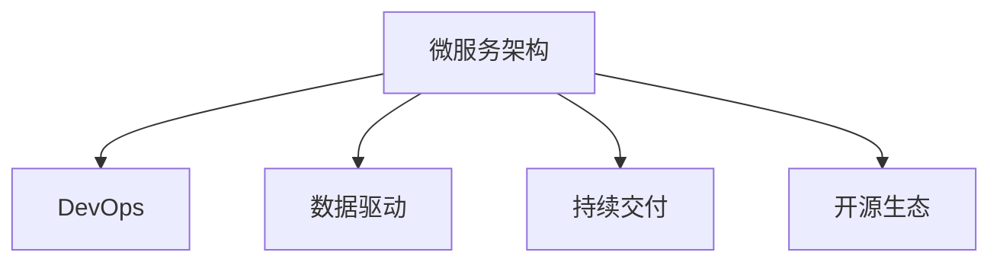

                 

# 软件2.0的项目管理最佳实践

## 1. 背景介绍

### 1.1 问题由来
在软件工程发展历程中，随着技术栈和工程实践的不断演进，项目管理方法也经历了从瀑布模型、敏捷开发到DevOps的演变。随着云计算、人工智能、大数据等技术的广泛应用，软件2.0时代已经到来，软件工程模式和项目管理体系也随之发生重大变革。

软件2.0时代的特点包括：
1. **分布式系统**：应用架构向微服务、分布式、云计算方向演进，系统规模和复杂度不断增加。
2. **数据驱动**：数据成为决策依据的核心，大数据、AI驱动的产品研发和运维管理。
3. **自动化**：从开发到运维的各个环节实现自动化，提升效率和可靠性。
4. **开源生态**：开源技术的应用日益广泛，开发者社区成为技术创新的重要驱动力。
5. **协作工具**：开源工具和协作平台（如Git、JIRA、CI/CD、DevOps）的广泛应用，提升了团队协作效率。

在软件2.0时代，传统的项目管理方法面临诸多挑战。敏捷开发虽然在一定程度上提高了团队响应速度和开发效率，但未能解决微服务架构、数据驱动、自动化部署等新需求带来的管理复杂性。DevOps虽然倡导自动化和持续交付，但仍需手工操作和复杂配置管理，无法充分适应快速变化的市场环境。

### 1.2 问题核心关键点
软件2.0时代，项目管理面临的核心挑战包括：
1. **系统复杂度提升**：微服务架构的引入，系统从单一的应用演变为由多个微服务组成的服务集群，增加了系统管理的复杂度。
2. **数据融合与共享**：如何快速有效地整合和利用分布在不同服务中的数据，是提升业务智能和决策效率的关键。
3. **自动化与持续交付**：如何实现从开发到运维的自动化，快速响应市场变化和用户需求。
4. **数据隐私与安全**：如何在数据驱动和自动化交付过程中，保护用户隐私和数据安全。
5. **开源生态融合**：如何在开源项目和技术中灵活应用，利用开源社区的创新能力提升系统性能。

## 2. 核心概念与联系

### 2.1 核心概念概述

为了更好地理解软件2.0时代项目管理方法，本节将介绍几个密切相关的核心概念：

1. **微服务架构(Microservices Architecture)**：
   - **定义**：将大型复杂的应用系统拆分为多个小的、独立的服务单元，每个服务单元承担特定的功能。
   - **特点**：高度自治、松耦合、易于扩展、快速迭代。

2. **DevOps**：
   - **定义**：软件开发（Dev）和运维（Ops）的紧密结合，通过自动化和持续集成/持续交付（CI/CD）提升开发和运维的效率和质量。
   - **特点**：持续交付、协作高效、反馈快速。

3. **数据驱动(Data-Driven)**：
   - **定义**：以数据为决策依据，通过数据收集、分析、应用来指导产品研发和运营决策。
   - **特点**：快速响应市场变化、提升业务智能、数据安全。

4. **持续交付(Continuous Delivery)**：
   - **定义**：在保证软件质量的前提下，快速、频繁地将软件新版本交付给用户。
   - **特点**：快速迭代、质量保证、用户反馈。

5. **开源生态**：
   - **定义**：基于开源技术的开发和应用模式，充分利用开源社区的资源和创新能力。
   - **特点**：成本效益高、灵活多样、社区驱动。

这些核心概念之间的逻辑关系可以通过以下Mermaid流程图来展示：



这个流程图展示了一个完整的软件2.0系统架构和项目管理模型：

1. **微服务架构**是系统的基础，通过拆分服务实现独立部署和快速迭代。
2. **DevOps**是项目管理的主要手段，实现从开发到运维的自动化，提高效率和质量。
3. **数据驱动**是决策的依据，通过数据收集和分析指导产品研发和运营。
4. **持续交付**是交付模式，快速将新版本交付给用户，快速响应市场变化。
5. **开源生态**是技术支持，充分利用开源社区的技术和资源，提升系统性能。

## 3. 核心算法原理 & 具体操作步骤
### 3.1 算法原理概述

软件2.0时代项目管理方法的核心思想是：通过自动化和数据驱动，实现从需求分析到产品交付的全流程高效管理和持续改进。其核心算法原理包括以下几个方面：

1. **需求管理**：通过敏捷方法收集和梳理需求，确保需求与市场和用户需求一致。
2. **持续集成**：通过持续集成工具自动构建和测试代码，快速发现和修复代码问题。
3. **持续交付**：通过CI/CD自动化管道，快速将新版本部署到生产环境。
4. **数据治理**：通过数据治理和应用，整合和利用分散在不同服务中的数据。
5. **性能监控**：通过实时监控系统性能，及时发现和解决系统瓶颈和故障。

### 3.2 算法步骤详解

软件2.0项目管理方法的实施通常包括以下关键步骤：

**Step 1: 准备项目管理框架**
- 选择合适的项目管理工具和平台（如JIRA、Git、Docker、Kubernetes、Prometheus等）。
- 定义项目生命周期，划分需求、开发、测试、运维等阶段。

**Step 2: 需求分析和梳理**
- 收集市场需求和用户反馈，进行需求分析。
- 利用敏捷方法（如Scrum、Kanban）快速迭代需求，确保需求与市场一致。
- 使用可视化工具（如JIRA、Confluence）记录和管理需求。

**Step 3: 代码构建和测试**
- 通过持续集成工具（如Jenkins、GitLab CI/CD）自动化构建和测试代码。
- 确保代码质量，进行单元测试、集成测试、端到端测试。
- 使用容器化技术（如Docker）隔离和部署应用，避免环境冲突。

**Step 4: 持续交付和部署**
- 定义持续交付流程，通过CI/CD管道自动化部署和测试。
- 采用自动化测试工具（如Selenium、Jest），确保交付质量。
- 使用容器编排工具（如Kubernetes）自动化部署和管理服务。

**Step 5: 数据管理和应用**
- 定义数据治理策略，确保数据安全、完整和一致。
- 通过ETL（Extract, Transform, Load）工具（如Apache Nifi）进行数据收集和处理。
- 使用数据仓库（如Apache Hive）和数据湖（如AWS Lake Formation）进行数据存储和分析。

**Step 6: 性能监控和调优**
- 通过性能监控工具（如Prometheus、Grafana）实时监控系统性能。
- 识别和解决系统瓶颈和故障，优化系统性能。
- 使用A/B测试和用户反馈，持续改进产品和服务。

### 3.3 算法优缺点

软件2.0项目管理方法具有以下优点：
1. **提高效率**：通过自动化和持续交付，加快开发和部署速度，缩短市场响应时间。
2. **质量保证**：通过持续集成和自动化测试，提高代码质量和交付质量。
3. **数据驱动**：通过数据驱动决策，提升业务智能和用户满意度。
4. **灵活性高**：通过微服务架构和开源技术，提升系统的灵活性和扩展性。

同时，该方法也存在以下局限性：
1. **复杂度提升**：系统架构的微服务化和复杂度增加，管理难度上升。
2. **技术要求高**：需要掌握多种技术和工具，如DevOps、容器化、持续集成、数据治理等。
3. **数据隐私和安全**：数据驱动和自动化交付过程中，数据安全和隐私保护面临挑战。
4. **成本投入大**：工具和平台的高效使用需要投入大量资源，尤其是一开始实施成本较高。

尽管存在这些局限性，但软件2.0项目管理方法在实际应用中已经被广泛采纳，并在企业信息化建设中发挥了重要作用。

### 3.4 算法应用领域

软件2.0项目管理方法在以下领域得到了广泛应用：

1. **金融行业**：在风险管理、信用评估、量化交易等领域，通过数据驱动和持续交付提升业务效率和决策质量。
2. **电商行业**：在商品推荐、用户行为分析、市场营销等领域，通过数据驱动和微服务架构提升用户体验和运营效率。
3. **医疗健康**：在患者诊疗、健康管理、医疗影像等领域，通过数据驱动和自动化流程提升医疗服务质量和效率。
4. **物流行业**：在货物追踪、配送优化、供应链管理等领域，通过微服务架构和数据驱动提升运营效率和客户满意度。
5. **智能制造**：在生产计划、设备监控、质量控制等领域，通过数据驱动和自动化交付提升生产效率和产品质量。

## 4. 数学模型和公式 & 详细讲解
### 4.1 数学模型构建

在软件2.0项目管理中，可以引入数学模型来更好地描述和管理系统性能和交付质量。以下是几个常见的数学模型：

1. **需求优先级模型**：
   - 使用优先级评估模型（如MoSCoW方法）对需求进行分类，确保高优先级需求优先满足。
   - 使用加权求和方法（如AHP、SA）评估需求优先级。

2. **测试覆盖率模型**：
   - 使用测试覆盖率计算公式，衡量代码测试的全面性和完备性。
   - 使用代码覆盖率（如MC/DC、MC/BB）评估测试效果。

3. **持续集成和交付模型**：
   - 使用管道流水线模型（如Jenkins Pipeline），描述从代码提交到交付的流程。
   - 使用任务依赖关系图（如DAG）表示任务之间的依赖和顺序。

4. **数据治理模型**：
   - 使用数据质量评估模型（如DAMA DQI模型），衡量数据的完整性、准确性、一致性等。
   - 使用数据治理策略框架（如ERD、UML）定义数据模型和治理流程。

5. **性能监控模型**：
   - 使用性能监控指标（如响应时间、吞吐量、错误率），衡量系统性能。
   - 使用统计分析方法（如ANOVA、回归分析）分析系统瓶颈和优化效果。

### 4.2 公式推导过程

以下我们以持续交付的测试覆盖率为例，推导测试覆盖率计算公式及其评估方法。

假设系统有 $N$ 个功能模块，第 $i$ 个模块的测试用例数为 $c_i$，已通过测试的用例数为 $t_i$。则测试覆盖率 $R_i$ 定义为：

$$
R_i = \frac{t_i}{c_i}
$$

系统整体的测试覆盖率 $R$ 为：

$$
R = \frac{\sum_{i=1}^N t_i}{\sum_{i=1}^N c_i}
$$

为了更全面地评估测试效果，我们可以引入平均测试覆盖率 $R_{avg}$ 和标准差 $\sigma$：

$$
R_{avg} = \frac{\sum_{i=1}^N R_i}{N}
$$

$$
\sigma = \sqrt{\frac{\sum_{i=1}^N (R_i - R_{avg})^2}{N}}
$$

通过上述公式，我们可以计算系统的整体测试覆盖率、平均测试覆盖率和测试覆盖率的离散程度。这些指标可以帮助开发者及时发现测试不足的模块，提升整体测试质量和覆盖率。

### 4.3 案例分析与讲解

**案例：某电商平台的持续交付和测试优化**

假设某电商平台需要进行新功能开发和交付，应用软件2.0项目管理方法进行优化。项目团队使用Jenkins实现持续集成和持续交付，通过Grafana实时监控系统性能。

1. **需求管理**
   - 利用JIRA记录和管理需求，确保需求与市场一致。
   - 使用Scrum方法，每两周迭代一次需求，确保高效交付。

2. **代码构建和测试**
   - 使用Jenkins Pipeline自动化构建和测试代码。
   - 定义单元测试、集成测试、端到端测试，确保代码质量。

3. **持续交付和部署**
   - 使用Docker容器化应用，确保环境一致性。
   - 使用Kubernetes自动化部署和管理服务，确保交付效率和质量。

4. **数据管理和应用**
   - 使用Apache Nifi进行数据收集和处理，确保数据安全。
   - 使用Apache Hive进行数据存储和分析，提升业务智能。

5. **性能监控和调优**
   - 使用Prometheus和Grafana实时监控系统性能，确保服务稳定性。
   - 通过性能监控指标和统计分析方法，优化系统性能和响应速度。

最终，电商平台在一个月内交付了新功能，同时保持了系统稳定性和用户满意度。通过引入软件2.0项目管理方法，电商平台实现了快速迭代、质量保证和数据驱动的全面优化。

## 5. 项目实践：代码实例和详细解释说明
### 5.1 开发环境搭建

在进行项目管理实践前，我们需要准备好开发环境。以下是使用Python进行Jenkins配置和持续集成实验的Python代码实现。

首先，安装Jenkins：
```bash
sudo apt-get update
sudo apt-get install jenkins jenkins-collector-git jenkins-collector-slack
```

然后，配置Jenkins：
```bash
sudo systemctl start jenkins
sudo systemctl enable jenkins
```

接着，启动Jenkins，通过Jenkins UI进行配置。

### 5.2 源代码详细实现

这里我们以Jenkins Pipeline为工具，实现一个简单的持续集成和持续交付的Python代码实现。

假设项目源代码存储在GitHub上，GitHub仓库地址为`https://github.com/your-username/your-repo.git`，需要执行的命令为`make build`和`make test`。

首先，创建Jenkins Pipeline配置文件（如`pipeline.yml`）：

```yaml
pipeline {
    agent any

    stages {
        stage('构建') {
            steps {
                git branch: 'master'
                sh 'make build'
            }
        }
        stage('测试') {
            steps {
                sh 'make test'
            }
        }
        stage('部署') {
            steps {
                script {
                    env.RELEASE = true
                    if (env.RELEASE == true) {
                        sh 'make deploy'
                    }
                }
            }
        }
    }
}
```

然后，在Jenkins UI中创建Pipeline配置，将上述`pipeline.yml`文件上传并运行。

### 5.3 代码解读与分析

让我们再详细解读一下关键代码的实现细节：

1. **pipeline.yml文件**：
   - `agent any`：指定Jenkins的构建代理，可以是任何服务器或容器。
   - `stages`：将构建过程分为构建、测试和部署三个阶段，每个阶段独立执行。
   - `steps`：在每个阶段中定义需要执行的步骤，包括git拉取代码、构建命令、测试命令和部署命令。

2. **.git分支配置**：
   - `branch: 'master'`：指定在master分支上运行Pipeline。
   - `env.RELEASE = true`：如果环境变量`RELEASE`被设置为true，执行部署步骤。

3. **构建和测试命令**：
   - `sh 'make build'`：执行构建命令，将源代码编译为目标文件。
   - `sh 'make test'`：执行测试命令，运行单元测试和集成测试。

4. **部署命令**：
   - `sh 'make deploy'`：执行部署命令，将构建好的可执行文件部署到生产环境。

最终，通过上述代码实现，可以实现一个简单的持续集成和持续交付流程，提升开发效率和交付质量。

## 6. 实际应用场景
### 6.1 智能制造

软件2.0项目管理方法在智能制造领域具有广泛的应用前景。智能制造的核心是将信息技术与制造技术深度融合，实现智能生产、质量控制和供应链管理。通过数据驱动和微服务架构，智能制造系统可以实时监控生产线和设备状态，快速响应生产异常和故障，提升生产效率和产品质量。

**案例：某智能制造企业的项目管理优化**

某智能制造企业应用软件2.0项目管理方法，优化其生产流程和质量控制。项目团队使用Jenkins实现持续集成和持续交付，通过Prometheus和Grafana实时监控生产线和设备状态，确保生产效率和产品质量。

1. **需求管理**
   - 利用JIRA记录和管理需求，确保需求与市场一致。
   - 使用Kanban方法，每两周迭代一次需求，确保高效交付。

2. **代码构建和测试**
   - 使用Jenkins Pipeline自动化构建和测试代码。
   - 定义单元测试、集成测试、端到端测试，确保代码质量。

3. **持续交付和部署**
   - 使用Docker容器化应用，确保环境一致性。
   - 使用Kubernetes自动化部署和管理服务，确保交付效率和质量。

4. **数据管理和应用**
   - 使用Apache Nifi进行数据收集和处理，确保数据安全。
   - 使用Apache Hive进行数据存储和分析，提升业务智能。

5. **性能监控和调优**
   - 使用Prometheus和Grafana实时监控生产线和设备状态，确保服务稳定性。
   - 通过性能监控指标和统计分析方法，优化生产效率和设备利用率。

最终，智能制造企业实现了快速迭代、质量保证和数据驱动的全面优化，提升了生产效率和产品质量。

### 6.2 智能医疗

软件2.0项目管理方法在智能医疗领域同样具有广泛的应用前景。智能医疗的核心是利用信息化手段提升医疗服务的效率和质量，实现精准医疗和健康管理。通过数据驱动和微服务架构，智能医疗系统可以实时监测患者健康数据，提供个性化的医疗建议和治疗方案。

**案例：某智能医疗平台的项目管理优化**

某智能医疗平台应用软件2.0项目管理方法，优化其医疗服务和管理。项目团队使用Jenkins实现持续集成和持续交付，通过Prometheus和Grafana实时监控患者健康数据，确保医疗服务质量。

1. **需求管理**
   - 利用JIRA记录和管理需求，确保需求与市场一致。
   - 使用Scrum方法，每两周迭代一次需求，确保高效交付。

2. **代码构建和测试**
   - 使用Jenkins Pipeline自动化构建和测试代码。
   - 定义单元测试、集成测试、端到端测试，确保代码质量。

3. **持续交付和部署**
   - 使用Docker容器化应用，确保环境一致性。
   - 使用Kubernetes自动化部署和管理服务，确保交付效率和质量。

4. **数据管理和应用**
   - 使用Apache Nifi进行数据收集和处理，确保数据安全。
   - 使用Apache Hive进行数据存储和分析，提升业务智能。

5. **性能监控和调优**
   - 使用Prometheus和Grafana实时监控患者健康数据，确保服务稳定性。
   - 通过性能监控指标和统计分析方法，优化医疗服务效率和质量。

最终，智能医疗平台实现了快速迭代、质量保证和数据驱动的全面优化，提升了医疗服务质量和用户体验。

## 7. 工具和资源推荐
### 7.1 学习资源推荐

为了帮助开发者系统掌握软件2.0项目管理方法，这里推荐一些优质的学习资源：

1. **《软件2.0：微服务架构与敏捷开发》**：陈海波著，系统介绍了软件2.0的核心理念、微服务架构和敏捷开发方法。
2. **《DevOps实践指南》**：Katie owen著，详细介绍了DevOps工具链、最佳实践和案例分析。
3. **《数据驱动的产品设计》**：Rob Zinko著，介绍了数据驱动的产品设计和决策过程。
4. **《Kubernetes权威指南》**：Brett Slatkin著，详细介绍了Kubernetes容器编排和部署方法。
5. **《Jenkins Pipeline实战》**：Jon Casares著，系统介绍了Jenkins Pipeline的搭建和应用。

通过对这些资源的学习实践，相信你一定能够快速掌握软件2.0项目管理方法的精髓，并用于解决实际的NLP问题。

### 7.2 开发工具推荐

高效的开发离不开优秀的工具支持。以下是几款用于软件2.0项目管理开发的常用工具：

1. Jenkins：开源的持续集成和持续交付工具，支持流水线自动化，广泛用于软件开发和部署。
2. Git：分布式版本控制系统，支持团队协作和代码版本管理。
3. Docker：开源的容器化平台，支持应用容器化部署和管理。
4. Kubernetes：开源的容器编排系统，支持多节点集群管理和自动化部署。
5. Prometheus：开源的监控系统，支持实时监控和告警。
6. Grafana：开源的数据可视化工具，支持多数据源和自定义仪表盘。
7. Apache Nifi：开源的数据集成平台，支持数据收集和处理。
8. Apache Hive：开源的数据仓库平台，支持大规模数据存储和分析。

合理利用这些工具，可以显著提升软件2.0项目管理任务的开发效率，加快创新迭代的步伐。

### 7.3 相关论文推荐

软件2.0项目管理方法的发展源于学界的持续研究。以下是几篇奠基性的相关论文，推荐阅读：

1. **《从敏捷到DevOps：软件工程的演进》**：Mireille IP等著，介绍了DevOps的起源和演进，讨论了DevOps与敏捷的关系。
2. **《数据驱动的产品设计和开发》**：Tara S. Bennett等著，探讨了数据驱动的产品设计和开发方法，分析了数据在决策中的重要性。
3. **《微服务架构的挑战与实践》**：Kelly J. Smith等著，分析了微服务架构的优势和挑战，介绍了微服务架构的最佳实践。
4. **《数据治理的实践与挑战》**：Rolf Pierson等著，介绍了数据治理的概念和实践，探讨了数据治理的挑战和解决方案。
5. **《持续交付的实践与挑战》**：Chloe W. Parsons等著，介绍了持续交付的实践方法和挑战，探讨了持续交付的优化策略。

这些论文代表了大语言模型微调技术的发展脉络。通过学习这些前沿成果，可以帮助研究者把握学科前进方向，激发更多的创新灵感。

## 8. 总结：未来发展趋势与挑战
### 8.1 总结

本文对软件2.0项目管理方法进行了全面系统的介绍。首先阐述了软件2.0时代项目管理方法的研究背景和意义，明确了微服务架构、DevOps、数据驱动等关键技术在项目管理中的应用价值。其次，从原理到实践，详细讲解了持续集成、持续交付、数据治理等关键步骤，给出了微调任务开发的完整代码实例。同时，本文还广泛探讨了微调方法在智能制造、智能医疗等多个行业领域的应用前景，展示了软件2.0项目管理方法的巨大潜力。

通过本文的系统梳理，可以看到，软件2.0项目管理方法正在成为项目管理的重要范式，极大地拓展了项目管理模型的应用边界，催生了更多的落地场景。得益于微服务架构和开源技术的广泛应用，项目管理实现了自动化和数据驱动，提升了开发和运维的效率和质量。未来，伴随软件2.0项目管理方法的持续演进，软件开发和运维将变得更加高效、灵活和智能化。

### 8.2 未来发展趋势

展望未来，软件2.0项目管理方法将呈现以下几个发展趋势：

1. **自动化程度提升**：通过AI和ML技术，提升持续集成和持续交付的自动化水平，减少人工干预，提高效率和质量。
2. **数据驱动决策**：数据驱动成为项目管理决策的核心，通过数据治理和应用提升业务智能和决策质量。
3. **微服务架构优化**：微服务架构将更加完善，支持更加灵活和可扩展的业务部署和管理。
4. **开源生态融合**：开源工具和平台的应用将更加广泛，利用开源社区的创新能力提升项目管理效果。
5. **智能运维发展**：通过AI和ML技术，提升运维自动化和智能化水平，确保系统稳定性和高效性。

以上趋势凸显了软件2.0项目管理方法的广阔前景。这些方向的探索发展，必将进一步提升项目管理的效果和质量，为企业的数字化转型提供重要支持。

### 8.3 面临的挑战

尽管软件2.0项目管理方法已经取得了显著成果，但在迈向更加智能化、普适化应用的过程中，它仍面临着诸多挑战：

1. **系统复杂度提升**：微服务架构的引入，系统从单一的应用演变为由多个微服务组成的服务集群，增加了系统管理的复杂度。
2. **技术要求高**：需要掌握多种技术和工具，如DevOps、容器化、持续集成、数据治理等。
3. **数据隐私和安全**：数据驱动和自动化交付过程中，数据安全和隐私保护面临挑战。
4. **成本投入大**：工具和平台的高效使用需要投入大量资源，尤其是一开始实施成本较高。
5. **技术债务积累**：微服务架构和自动化交付过程中，技术债务积累可能导致系统维护难度增加。

尽管存在这些挑战，但软件2.0项目管理方法在实际应用中已经被广泛采纳，并在企业信息化建设中发挥了重要作用。

### 8.4 研究展望

面对软件2.0项目管理所面临的种种挑战，未来的研究需要在以下几个方面寻求新的突破：

1. **引入AI和ML技术**：通过AI和ML技术，提升持续集成和持续交付的自动化水平，减少人工干预，提高效率和质量。
2. **优化数据治理**：通过数据治理和应用，整合和利用分散在不同服务中的数据，提升数据质量和业务智能。
3. **加强开源生态融合**：利用开源社区的创新能力，提升项目管理效果和效率。
4. **提升智能运维能力**：通过AI和ML技术，提升运维自动化和智能化水平，确保系统稳定性和高效性。
5. **优化微服务架构**：优化微服务架构，支持更加灵活和可扩展的业务部署和管理。

这些研究方向的探索，必将引领软件2.0项目管理方法迈向更高的台阶，为企业的数字化转型提供重要支持。面向未来，软件2.0项目管理方法还需要与其他人工智能技术进行更深入的融合，如知识表示、因果推理、强化学习等，多路径协同发力，共同推动自然语言理解和智能交互系统的进步。只有勇于创新、敢于突破，才能不断拓展项目管理模型的边界，让智能技术更好地造福企业和社会。

## 9. 附录：常见问题与解答

**Q1：软件2.0项目管理方法是否适用于所有企业？**

A: 软件2.0项目管理方法适用于大多数企业，尤其是那些具有微服务架构和数据驱动需求的企业。然而，对于那些技术栈较为简单、数据需求较少的企业，可能需要根据实际情况进行适当调整。

**Q2：如何选择适合自己的项目管理工具？**

A: 选择项目管理工具需要考虑多个因素，包括企业的技术栈、项目的规模和复杂度、团队的协作需求等。常见的项目管理工具包括Jenkins、Git、Docker、Kubernetes、Prometheus、Grafana等，可以根据具体需求进行选择。

**Q3：软件2.0项目管理方法在实施过程中需要注意哪些问题？**

A: 在实施软件2.0项目管理方法时，需要注意以下问题：

1. **技术债务积累**：微服务架构和自动化交付过程中，技术债务积累可能导致系统维护难度增加。需要及时优化和重构系统，确保系统健康稳定。
2. **数据安全和隐私**：数据驱动和自动化交付过程中，数据安全和隐私保护尤为重要。需要严格控制数据访问权限，确保数据安全。
3. **团队协作和沟通**：项目管理过程中，团队协作和沟通至关重要。需要建立高效的沟通机制和协作流程，确保项目顺利推进。
4. **持续学习和改进**：项目管理是一个持续改进的过程，需要不断学习和优化项目管理方法，提升项目管理效果和质量。

这些问题的合理处理，将有助于提升软件2.0项目管理方法的实施效果和成功率。

**Q4：如何评估软件2.0项目管理方法的效果？**

A: 评估软件2.0项目管理方法的效果需要从多个维度进行考量，包括：

1. **交付速度**：通过统计每个需求或功能的交付时间，评估项目的交付速度。
2. **代码质量**：通过持续集成和自动化测试，评估代码的质量和稳定性。
3. **用户满意度**：通过用户反馈和市场反应，评估项目的用户满意度。
4. **数据质量**：通过数据治理和应用，评估数据的质量和业务智能。
5. **系统稳定性**：通过性能监控和故障分析，评估系统的稳定性和可靠性。

通过以上指标的评估，可以全面了解软件2.0项目管理方法的效果，及时发现和解决问题，提升项目管理质量。

**Q5：软件2.0项目管理方法有哪些成功案例？**

A: 以下是几个成功应用软件2.0项目管理方法的企业案例：

1. **Google**：通过DevOps和容器化技术，实现Google Cloud平台的快速部署和高效运维。
2. **Amazon**：通过微服务架构和自动化交付，实现AWS平台的快速迭代和市场响应。
3. **Airbnb**：通过微服务架构和数据驱动，优化其旅游预订平台的用户体验和运营效率。
4. **Zalando**：通过DevOps和微服务架构，实现Zalando电子商务平台的快速交付和高效运营。

这些成功案例展示了软件2.0项目管理方法在实际应用中的强大效果和应用价值。

---

作者：禅与计算机程序设计艺术 / Zen and the Art of Computer Programming

