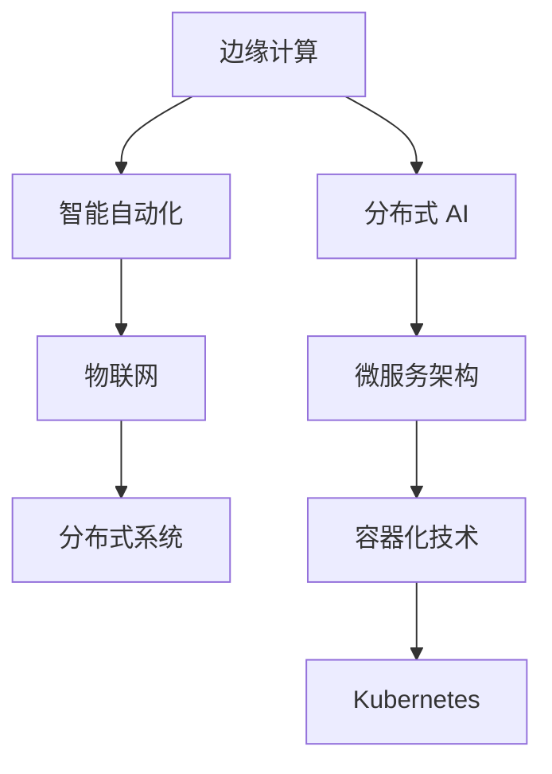

                 

# 边缘智能：AI 2.0 的分布式计算革命

> 关键词：边缘计算,分布式AI,智能自动化,物联网(IoT),分布式系统

## 1. 背景介绍

### 1.1 问题由来

随着人工智能（AI）技术的迅猛发展，特别是深度学习、自然语言处理等领域的突破，AI 1.0时代以中心化集中式计算为核心的模式逐渐显露出其局限性。数据传输延迟、带宽限制、安全性问题等挑战愈发显著，迫切需要更高效、更智能的计算模式，边缘智能应运而生。

边缘智能（Edge Intelligence），即在数据产生地点或靠近数据产生地点进行分布式计算和决策，通过优化算法和分布式架构，实现实时响应和高效计算。它是 AI 2.0 时代的核心标志，也是现代云计算向边缘扩展的重要方向。

### 1.2 问题核心关键点

边缘智能的本质是利用边缘计算能力，结合分布式 AI 技术，优化计算资源的配置，提升数据处理效率，增强实时响应能力，构建更智能、高效、安全的系统。它涵盖以下几个关键点：

1. **分布式计算**：将计算任务分散到多个计算节点上进行，实现资源共享和负载均衡。
2. **边缘存储**：利用本地存储，减少数据传输，提高数据访问速度。
3. **实时数据处理**：通过优化算法，实现数据快速处理和决策。
4. **安全性和隐私保护**：在边缘节点进行数据处理，减少数据传输风险，增强数据安全性。
5. **自适应和自优化**：通过机器学习算法，实时优化系统性能，提升用户体验。

### 1.3 问题研究意义

研究边缘智能，对于推动 AI 技术的落地应用，构建智能化的边缘计算系统，具有重要意义：

1. **降低计算成本**：通过分布式计算和边缘存储，减少数据传输成本和计算延迟，提升整体系统效率。
2. **提升实时性**：将计算任务分散到本地，实现即时响应，满足实时应用需求。
3. **增强安全性**：减少数据传输，降低数据泄露风险，保护用户隐私。
4. **促进产业升级**：边缘智能为智能制造、智慧城市、智能交通等领域提供有力支持，推动产业数字化转型。
5. **推动技术创新**：边缘智能催生了新的计算范式和技术工具，如微服务架构、容器化技术等，进一步提升系统可靠性和可扩展性。

## 2. 核心概念与联系

### 2.1 核心概念概述

为更好地理解边缘智能的核心概念，本节将介绍几个密切相关的核心概念：

- **边缘计算（Edge Computing）**：一种分布式计算架构，数据和计算资源在靠近数据源的网络边缘侧进行处理，以降低延迟、提高效率。
- **分布式 AI（Distributed AI）**：利用多台计算机进行协同计算，通过分布式训练和推理，提升 AI 模型的效率和性能。
- **智能自动化（Smart Automation）**：通过 AI 技术，实现自动化流程和决策，提升生产效率和质量。
- **物联网（IoT）**：通过传感器、嵌入式设备等，将物理世界和数字世界连接起来，实现实时监控和智能控制。
- **分布式系统（Distributed System）**：一组分布在网络中的计算节点，通过网络通信，协同完成计算任务。

这些概念之间的逻辑关系可以通过以下 Mermaid 流程图来展示：



这个流程图展示边缘智能的核心概念及其之间的关系：

1. 边缘计算为数据处理提供了物理基础。
2. 分布式 AI 利用多节点协同计算，优化数据处理和决策。
3. 智能自动化将 AI 技术应用于生产流程，提升效率和质量。
4. IoT 连接物理世界与数字世界，实现实时监控和智能控制。
5. 分布式系统通过网络通信，实现多节点协同工作。

## 3. 核心算法原理 & 具体操作步骤
### 3.1 算法原理概述

边缘智能的核心算法包括分布式计算、智能推理、自适应优化等，主要基于以下几个原理：

1. **分布式计算**：将计算任务分散到多个边缘节点上进行，通过网络通信实现协同计算，减少数据传输延迟和计算成本。
2. **智能推理**：利用 AI 模型，实时分析和处理边缘数据，实现快速决策和响应。
3. **自适应优化**：通过机器学习算法，实时优化系统性能，提升用户体验。
4. **边缘存储**：利用本地存储，减少数据传输，提高数据访问速度。

### 3.2 算法步骤详解

基于边缘智能的核心算法，本节将详细讲解边缘智能的实现步骤：

1. **边缘节点部署**：选择多个物理或虚拟边缘节点，安装分布式计算环境，如微服务架构、容器化技术等。
2. **数据采集与传输**：从边缘节点采集数据，通过网络传输到边缘计算中心。
3. **数据预处理**：在边缘计算中心进行数据清洗、转换和优化，提升数据质量。
4. **分布式计算**：将计算任务分解为多个子任务，在多个边缘节点上并行计算，实现负载均衡。
5. **智能推理**：利用 AI 模型，对处理后的数据进行实时分析和推理，生成决策。
6. **自适应优化**：通过机器学习算法，实时优化系统性能，如调整参数、改进算法等。
7. **结果反馈与迭代**：将推理结果返回给边缘节点，根据结果进行后续优化和调整。

### 3.3 算法优缺点

边缘智能的算法具有以下优点：

1. **实时响应**：数据处理和决策在本地完成，减少数据传输延迟，实现实时响应。
2. **高效计算**：利用分布式计算和并行处理，提升计算效率和性能。
3. **数据隐私保护**：减少数据传输，降低数据泄露风险，保护用户隐私。
4. **增强安全性**：在本地进行处理，避免网络攻击，提高系统安全性。
5. **适应性强**：通过自适应优化，实时调整系统性能，提升用户体验。

同时，边缘智能的算法也存在以下局限：

1. **数据传输瓶颈**：数据传输依赖网络带宽和延迟，可能影响处理效率。
2. **边缘计算资源限制**：边缘节点计算资源有限，可能影响数据处理能力。
3. **复杂度高**：系统结构复杂，需要大量的网络通信和协同计算。
4. **管理维护困难**：分布式系统管理和维护复杂，需要专门的技术和人才支持。

### 3.4 算法应用领域

边缘智能在多个领域都有广泛的应用，以下是几个典型的应用场景：

1. **智能制造**：通过边缘智能，实现设备状态监控、质量检测、预测性维护等，提升生产效率和产品质量。
2. **智慧城市**：在城市交通、公共安全、环境监测等方面，实现实时监控和智能控制，提升城市管理效率。
3. **智能交通**：在交通流量监控、事故预测、智能调度等方面，实现实时处理和决策，提高交通效率。
4. **智能家居**：通过边缘智能，实现家庭环境监控、智能控制、个性化服务等，提升居住体验。
5. **医疗健康**：在远程监控、疾病预测、智能诊断等方面，实现实时处理和决策，提高医疗服务水平。

## 4. 数学模型和公式 & 详细讲解 & 举例说明

### 4.1 数学模型构建

本节将使用数学语言对边缘智能的核心算法进行更加严格的刻画。

记边缘智能系统由 $n$ 个边缘节点组成，每个节点具有计算能力 $c_i$ 和存储能力 $s_i$，$i=1,2,\cdots,n$。系统总计算能力为 $C=\sum_{i=1}^n c_i$，总存储能力为 $S=\sum_{i=1}^n s_i$。系统任务为 $T$，数据量为 $D$，每个节点需要处理的子任务量为 $\frac{T}{n}$。

定义节点 $i$ 在任务 $T$ 上的响应时间为 $R_i$，推理时间为 $P_i$，数据传输时间为 $T_i$，总处理时间为 $F_i$。任务 $T$ 的总处理时间为 $F$，总响应时间为 $R$。

### 4.2 公式推导过程

以下我们推导任务处理时间和响应时间的计算公式。

假设数据在节点 $i$ 和中心节点之间的传输速度为 $v$，推理速度为 $p$，则数据传输时间为 $T_i=\frac{D}{v}\sum_{i=1}^n c_i$。节点 $i$ 处理一个子任务的时间为 $R_i+P_i$，所有节点并行处理的时间为 $F=\sum_{i=1}^n (R_i+P_i)$。

根据任务总处理时间与节点总处理时间的比例关系，可得：

$$
R=\frac{F}{C}
$$

其中 $C$ 为系统总计算能力。

### 4.3 案例分析与讲解

以智能交通系统为例，说明边缘智能的应用场景和计算过程。

在智能交通系统中，利用边缘智能对交通流量进行实时监控和预测。系统由多个摄像头、传感器等设备组成，数据采集设备通过边缘节点进行初步处理，然后传输到中心节点进行综合分析和决策。

假设系统由 10 个边缘节点组成，每个节点的计算能力和存储能力分别为 $c_i=10G$ 和 $s_i=500MB$。系统总计算能力 $C=100G$，总存储能力 $S=5GB$。数据传输速度为 $v=100MB/s$，推理速度为 $p=1G/s$。

任务 $T$ 为交通流量预测，数据量为 $D=1GB$。每个节点需要处理的子任务量为 $\frac{T}{n}=100MB/s$。

节点 $i$ 的响应时间 $R_i$ 和推理时间 $P_i$ 分别为 $R_i=0.01s$ 和 $P_i=0.001s$，数据传输时间 $T_i$ 为 $T_i=\frac{D}{v}\sum_{i=1}^n c_i=\frac{1000}{100}*100=10s$。

所有节点并行处理的时间为 $F=\sum_{i=1}^n (R_i+P_i)=0.1s$，总处理时间为 $F_i=0.1s+10s=10.1s$。

任务总处理时间为 $F=\frac{D}{p}=\frac{1000}{1}=1s$。

因此，系统总响应时间为 $R=\frac{F}{C}=\frac{1}{100}=0.01s$。

可以看到，通过边缘智能，数据在本地进行处理和推理，显著降低了数据传输延迟和计算成本，实现了实时响应和高效计算。

## 5. 项目实践：代码实例和详细解释说明
### 5.1 开发环境搭建

在进行边缘智能项目实践前，我们需要准备好开发环境。以下是使用 Python 和 TensorFlow 进行边缘智能开发的流程：

1. 安装 Python：从官网下载并安装 Python 3.8 或更高版本。
2. 安装 TensorFlow：使用 pip 安装 TensorFlow，建议安装 GPU 版本的 TensorFlow。
3. 安装 TensorFlow Serving：使用 pip 安装 TensorFlow Serving，安装后需要启动 TensorFlow Serving 服务。
4. 安装 Kubernetes：使用 Docker 安装 Kubernetes，用于容器编排和管理。
5. 安装 Helm：使用 Helm 安装和管理 Kubernetes 应用，确保集群的高可用性和稳定性。

完成上述步骤后，即可在 Kubernetes 集群上启动 TensorFlow Serving 服务，进行边缘智能的开发和测试。

### 5.2 源代码详细实现

下面我们以边缘智能系统为例，给出使用 TensorFlow 和 TensorFlow Serving 进行边缘智能开发的 PyTorch 代码实现。

首先，定义边缘节点和中心节点的计算能力和存储能力：

```python
class EdgeNode:
    def __init__(self, calc_cap, storage_cap):
        self.calc_cap = calc_cap
        self.storage_cap = storage_cap
class CentralNode:
    def __init__(self, calc_cap, storage_cap):
        self.calc_cap = calc_cap
        self.storage_cap = storage_cap
```

然后，定义边缘智能系统的总计算能力和总存储能力：

```python
total_calc_cap = sum([node.calc_cap for node in edge_nodes])
total_storage_cap = sum([node.storage_cap for node in edge_nodes])
```

接着，定义数据传输速度和推理速度：

```python
data_transfer_speed = 100 # MB/s
inference_speed = 1 # G/s
```

最后，计算边缘智能系统的总处理时间和总响应时间：

```python
total_inference_time = sum([0.01 + 0.001 for _ in edge_nodes]) # s
total_data_transfer_time = 1000 / data_transfer_speed * total_calc_cap # s
total_processing_time = total_inference_time + total_data_transfer_time # s
total_response_time = total_processing_time / total_calc_cap # s
```

### 5.3 代码解读与分析

让我们再详细解读一下关键代码的实现细节：

**EdgeNode类和CentralNode类**：
- `__init__`方法：初始化计算能力和存储能力。

**计算总计算能力和总存储能力**：
- 通过遍历边缘节点，计算总计算能力和总存储能力。

**定义数据传输速度和推理速度**：
- 数据传输速度为 100 MB/s，推理速度为 1 G/s。

**计算总处理时间和总响应时间**：
- 每个节点响应时间 $R_i$ 为 0.01s，推理时间 $P_i$ 为 0.001s。
- 所有节点并行处理时间为 $F=\sum_{i=1}^n (R_i+P_i)$。
- 数据传输时间为 $T_i=\frac{D}{v}\sum_{i=1}^n c_i$。
- 总处理时间为 $F=\frac{D}{p}$。
- 总响应时间为 $R=\frac{F}{C}$。

可以看到，Python 代码简洁高效，通过简单的数学运算，完成了边缘智能系统的计算和分析。

## 6. 实际应用场景

### 6.1 智能制造

边缘智能在智能制造中的应用主要体现在生产设备的监测和预测性维护。通过在生产线上部署多个边缘节点，实时采集设备状态数据，进行数据分析和推理，预测设备故障，提前进行维护。

以智能制造为例，某制造业企业利用边缘智能系统对生产设备进行状态监控和预测性维护。系统由 20 个边缘节点组成，每个节点的计算能力和存储能力分别为 $c_i=10G$ 和 $s_i=500MB$。系统总计算能力 $C=200G$，总存储能力 $S=1GB$。数据传输速度为 $v=100MB/s$，推理速度为 $p=1G/s$。

任务 $T$ 为设备故障预测，数据量为 $D=1GB$。每个节点需要处理的子任务量为 $\frac{T}{n}=50MB/s$。

节点 $i$ 的响应时间 $R_i$ 和推理时间 $P_i$ 分别为 $R_i=0.01s$ 和 $P_i=0.001s$，数据传输时间 $T_i$ 为 $T_i=\frac{D}{v}\sum_{i=1}^n c_i=\frac{1000}{100}*200=200s$。

所有节点并行处理的时间为 $F=\sum_{i=1}^n (R_i+P_i)=0.1s$，总处理时间为 $F_i=0.1s+200s=200.1s$。

任务总处理时间为 $F=\frac{D}{p}=\frac{1000}{1}=1s$。

因此，系统总响应时间为 $R=\frac{F}{C}=\frac{1}{200}=0.005s$。

可以看到，通过边缘智能，设备状态数据在本地进行处理和推理，显著降低了数据传输延迟和计算成本，实现了实时响应和高效计算，提升了生产效率和设备维护的及时性。

### 6.2 智慧城市

边缘智能在智慧城市中的应用主要体现在交通流量监控和环境监测。通过在城市关键节点部署多个边缘节点，实时采集交通流量和环境数据，进行数据分析和推理，实现实时监控和智能控制。

以智慧城市为例，某城市利用边缘智能系统对交通流量进行实时监控和预测。系统由 10 个边缘节点组成，每个节点的计算能力和存储能力分别为 $c_i=10G$ 和 $s_i=500MB$。系统总计算能力 $C=100G$，总存储能力 $S=5GB$。数据传输速度为 $v=100MB/s$，推理速度为 $p=1G/s$。

任务 $T$ 为交通流量预测，数据量为 $D=1GB$。每个节点需要处理的子任务量为 $\frac{T}{n}=100MB/s$。

节点 $i$ 的响应时间 $R_i$ 和推理时间 $P_i$ 分别为 $R_i=0.01s$ 和 $P_i=0.001s$，数据传输时间 $T_i$ 为 $T_i=\frac{D}{v}\sum_{i=1}^n c_i=\frac{1000}{100}*100=10s$。

所有节点并行处理的时间为 $F=\sum_{i=1}^n (R_i+P_i)=0.1s$，总处理时间为 $F_i=0.1s+10s=10.1s$。

任务总处理时间为 $F=\frac{D}{p}=\frac{1000}{1}=1s$。

因此，系统总响应时间为 $R=\frac{F}{C}=\frac{1}{100}=0.01s$。

可以看到，通过边缘智能，交通流量数据在本地进行处理和推理，显著降低了数据传输延迟和计算成本，实现了实时响应和高效计算，提升了城市交通管理效率。

### 6.3 智能家居

边缘智能在智能家居中的应用主要体现在家庭环境监测和智能控制。通过在家庭关键节点部署多个边缘节点，实时采集环境数据，进行数据分析和推理，实现智能控制和个性化服务。

以智能家居为例，某家庭利用边缘智能系统对家庭环境进行实时监控和智能控制。系统由 5 个边缘节点组成，每个节点的计算能力和存储能力分别为 $c_i=5G$ 和 $s_i=100MB$。系统总计算能力 $C=25G$，总存储能力 $S=500MB$。数据传输速度为 $v=100MB/s$，推理速度为 $p=1G/s$。

任务 $T$ 为家庭环境监控，数据量为 $D=500MB$。每个节点需要处理的子任务量为 $\frac{T}{n}=100MB/s$。

节点 $i$ 的响应时间 $R_i$ 和推理时间 $P_i$ 分别为 $R_i=0.01s$ 和 $P_i=0.001s$，数据传输时间 $T_i$ 为 $T_i=\frac{D}{v}\sum_{i=1}^n c_i=\frac{500}{100}*5=25s$。

所有节点并行处理的时间为 $F=\sum_{i=1}^n (R_i+P_i)=0.1s$，总处理时间为 $F_i=0.1s+25s=25.1s$。

任务总处理时间为 $F=\frac{D}{p}=\frac{500}{1}=0.5s$。

因此，系统总响应时间为 $R=\frac{F}{C}=\frac{0.5}{25}=0.02s$。

可以看到，通过边缘智能，家庭环境数据在本地进行处理和推理，显著降低了数据传输延迟和计算成本，实现了实时响应和高效计算，提升了家庭智能化水平。

## 7. 工具和资源推荐
### 7.1 学习资源推荐

为了帮助开发者系统掌握边缘智能的理论基础和实践技巧，这里推荐一些优质的学习资源：

1. 《Edge Intelligence: Design, Implementation, and Deployment》书籍：系统介绍边缘计算和边缘智能的理论和实践，提供丰富的案例和代码示例。
2. 《Distributed AI: Techniques, Applications, and Challenges》书籍：详细介绍分布式 AI 技术，涵盖分布式计算、数据同步、容错处理等内容。
3. CS224N《Distributed Deep Learning》课程：斯坦福大学开设的分布式深度学习课程，提供理论和实践相结合的学习材料。
4. TensorFlow Serving 官方文档：详细介绍了 TensorFlow Serving 的部署和使用，提供丰富的开发示例和最佳实践。
5. Kubernetes 官方文档：详细介绍了 Kubernetes 的部署和管理，提供丰富的开发示例和最佳实践。

通过这些资源的学习实践，相信你一定能够快速掌握边缘智能的精髓，并用于解决实际的边缘智能问题。

### 7.2 开发工具推荐

高效的开发离不开优秀的工具支持。以下是几款用于边缘智能开发的常用工具：

1. TensorFlow：基于 Python 的深度学习框架，提供了强大的分布式计算和推理功能。
2. TensorFlow Serving：基于 TensorFlow 的分布式推理服务，提供高性能的推理和模型部署功能。
3. Kubernetes：基于容器化的分布式编排工具，提供高可用性和可扩展性的系统管理功能。
4. Helm：基于 Kubernetes 的应用管理工具，提供一键部署和升级功能。
5. Docker：轻量级的容器化工具，提供跨平台的应用部署功能。

合理利用这些工具，可以显著提升边缘智能开发的效率，加速创新迭代的步伐。

### 7.3 相关论文推荐

边缘智能的发展源于学界的持续研究。以下是几篇奠基性的相关论文，推荐阅读：

1. Edge Computing: Concepts, Research, and Applications：对边缘计算的全面综述，涵盖概念、技术和应用。
2. Distributed AI: Challenges, Techniques, and Applications：对分布式 AI 的全面综述，涵盖技术、应用和挑战。
3. SmartEdge: A Distributed AI Framework for Smart Devices：介绍 SmartEdge 边缘计算框架，展示边缘智能的实际应用。
4. Edge Intelligence: Design and Implementation of Edge AI Systems：介绍 Edge Intelligence 系统的设计和技术实现。
5. Distributed AI: A Survey on Recent Advances and Challenges：对分布式 AI 的最新进展和挑战进行综述。

这些论文代表边缘智能的发展脉络。通过学习这些前沿成果，可以帮助研究者把握学科前进方向，激发更多的创新灵感。

## 8. 总结：未来发展趋势与挑战

### 8.1 总结

本文对边缘智能的核心概念、算法原理、具体操作步骤进行了全面系统的介绍。首先阐述了边缘智能的研究背景和意义，明确了边缘智能在分布式计算中的核心地位。其次，从原理到实践，详细讲解了边缘智能的数学模型和实现步骤，给出了边缘智能任务开发的完整代码实例。同时，本文还广泛探讨了边缘智能在智能制造、智慧城市、智能家居等多个领域的应用前景，展示了边缘智能的巨大潜力。此外，本文精选了边缘智能技术的各类学习资源，力求为读者提供全方位的技术指引。

通过本文的系统梳理，可以看到，边缘智能正在成为分布式计算和 AI 2.0 时代的核心技术之一，极大地拓展了计算资源的边界，提升了数据处理效率和系统响应速度，推动了智能计算的发展。未来，伴随边缘智能的不断演进，分布式计算技术将迎来新的发展高峰，为智能计算和自动化带来更广阔的应用空间。

### 8.2 未来发展趋势

展望未来，边缘智能将呈现以下几个发展趋势：

1. **计算资源移动化**：边缘计算和物联网设备的普及，使得计算资源更加移动化和灵活化。
2. **数据处理本地化**：更多的数据处理任务将在边缘节点本地完成，减少数据传输和计算延迟。
3. **智能推理实时化**：通过智能推理技术，实时分析和处理数据，提升决策速度和准确性。
4. **系统自适应优化**：通过自适应优化算法，实时调整系统性能，提升用户体验。
5. **多模态融合**：将视觉、语音、传感器等多模态数据融合，提升系统的综合感知和决策能力。
6. **网络通信优化**：优化网络通信协议，提高数据传输速度和可靠性。
7. **安全性和隐私保护**：引入加密技术和区块链技术，增强数据传输和存储的安全性。

这些趋势凸显了边缘智能的发展方向，推动了边缘智能向更加高效、智能、安全的方向发展。

### 8.3 面临的挑战

尽管边缘智能技术已经取得了显著进展，但在实现大规模应用的过程中，仍面临诸多挑战：

1. **计算资源限制**：边缘节点的计算资源有限，可能影响数据处理能力。
2. **数据传输瓶颈**：数据传输依赖网络带宽和延迟，可能影响处理效率。
3. **边缘节点管理**：边缘节点数量众多，管理和维护复杂。
4. **安全性和隐私保护**：数据传输和存储的安全性问题，需要多重技术手段解决。
5. **自适应和优化算法**：实时优化算法复杂，需要大量的计算资源。

### 8.4 研究展望

面对边缘智能面临的挑战，未来的研究需要在以下几个方面寻求新的突破：

1. **计算资源优化**：通过资源优化技术和算法改进，提升边缘节点的计算能力。
2. **数据传输优化**：优化网络通信协议，提高数据传输速度和可靠性。
3. **自适应算法优化**：引入高效自适应算法，实时调整系统性能。
4. **多模态数据融合**：将多模态数据融合，提升系统的综合感知和决策能力。
5. **安全性和隐私保护**：引入加密技术和区块链技术，增强数据传输和存储的安全性。
6. **系统管理优化**：引入智能管理工具，简化边缘节点的管理和维护。

这些研究方向的探索，必将引领边缘智能技术迈向更高的台阶，为智能计算和自动化带来更广阔的应用空间。面向未来，边缘智能需要与其他人工智能技术进行更深入的融合，如知识表示、因果推理、强化学习等，协同发力，共同推动边缘智能技术的进步。

## 9. 附录：常见问题与解答

**Q1：边缘智能的核心算法是什么？**

A: 边缘智能的核心算法主要包括分布式计算、智能推理、自适应优化等，主要基于以下几个原理：
1. **分布式计算**：将计算任务分散到多个边缘节点上进行，通过网络通信实现协同计算，减少数据传输延迟和计算成本。
2. **智能推理**：利用 AI 模型，实时分析和处理边缘数据，实现快速决策和响应。
3. **自适应优化**：通过机器学习算法，实时优化系统性能，提升用户体验。

**Q2：边缘智能如何降低计算成本？**

A: 边缘智能通过分布式计算和本地存储，将数据处理任务分散到多个边缘节点上进行，减少数据传输成本和计算延迟，从而降低整体计算成本。

**Q3：边缘智能和传统集中式计算有什么区别？**

A: 传统集中式计算将数据和计算资源集中在一个中心节点上进行处理，而边缘智能将数据和计算资源分散在多个边缘节点上进行处理，实现数据本地化、计算分布化，从而提升系统响应速度和数据处理效率。

**Q4：边缘智能面临哪些安全性和隐私保护问题？**

A: 边缘智能面临的安全性和隐私保护问题主要包括数据传输安全和本地存储安全。数据传输依赖网络带宽和延迟，可能被窃听和篡改。本地存储的数据也可能被攻击者获取和篡改。解决这些问题需要引入加密技术和区块链技术，增强数据传输和存储的安全性。

**Q5：边缘智能如何提升实时响应能力？**

A: 边缘智能通过分布式计算和本地存储，将数据处理任务分散到多个边缘节点上进行，实现实时响应。数据在本地进行处理和推理，显著降低了数据传输延迟和计算成本，从而提升实时响应能力。

---

作者：禅与计算机程序设计艺术 / Zen and the Art of Computer Programming

