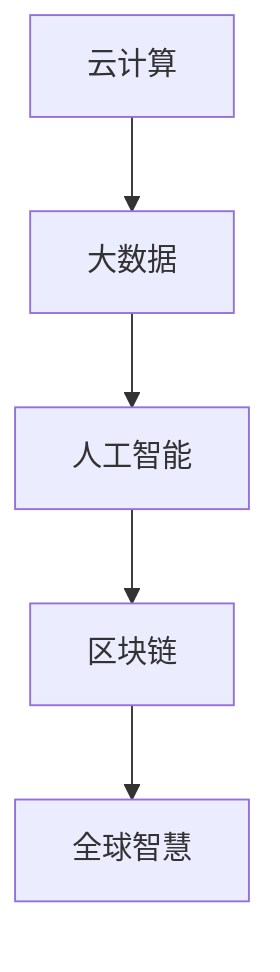
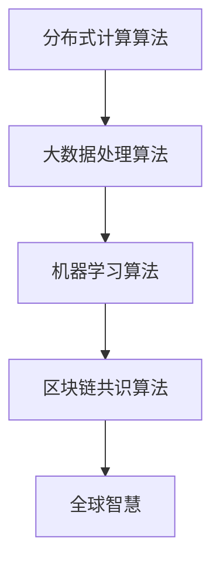

                 

## 1. 背景介绍

### 1.1 问题由来

随着科技的飞速发展，人类计算正在以前所未有的速度和规模进行。这种计算的全球化不仅改变了我们的生活方式，还在经济、文化、政治等多个领域产生了深远的影响。从云计算、大数据，到人工智能、区块链，人类计算正日益成为连接全球智慧的关键手段。本文将探讨人类计算的全球影响力，从其发展历程、核心概念，到应用领域和未来展望，为读者提供一个全面的视角。

### 1.2 问题核心关键点

人类计算的全球影响力主要体现在以下几个方面：

1. **计算资源的全球分布**：全球范围内的数据中心、云计算平台和网络基础设施的建设，使得计算资源能够高效、快速地分布在世界各地。
2. **数据的全球流通**：大数据技术的发展，使得数据能够跨越国界流通，为跨国公司和研究机构提供了丰富的数据资源。
3. **人工智能的全球普及**：人工智能技术的全球应用，不仅提升了工作效率，还为全球智慧的汇聚和共享提供了新的途径。
4. **区块链的全球网络**：区块链技术的全球化应用，为金融、供应链、智能合约等领域提供了安全、透明的解决方案。
5. **计算伦理与治理**：随着计算技术的全球化应用，数据隐私、算法偏见、安全问题等伦理和治理挑战也随之凸显。

这些关键点构成了人类计算全球影响力的核心框架，为本文后续内容的深入探讨提供了基础。

## 2. 核心概念与联系

### 2.1 核心概念概述

为了更好地理解人类计算的全球影响力，本节将介绍几个关键概念及其联系：

1. **云计算(Cloud Computing)**：通过互联网提供动态、可扩展的虚拟化资源和计算能力，支持全球范围内的计算资源共享。
2. **大数据(Big Data)**：指从各种来源获取的海量数据，通过大数据技术进行存储、分析和处理，支持数据驱动决策。
3. **人工智能(Artificial Intelligence)**：通过机器学习、深度学习等技术，使计算机系统具备一定的智能行为和决策能力。
4. **区块链(Blockchain)**：一种去中心化的分布式账本技术，通过加密手段确保数据的安全和透明。
5. **全球智慧(Global Intelligence)**：指通过计算技术汇聚全球范围内的知识、数据和智慧，推动人类社会的整体进步。

这些概念通过以下Mermaid流程图展示它们之间的联系：



这个流程图展示了计算技术的各个分支如何相互支持，共同促进了全球智慧的汇聚和共享。

## 3. 核心算法原理 & 具体操作步骤

### 3.1 算法原理概述

人类计算的全球影响力主要通过以下几个关键算法和原理实现：

1. **分布式计算算法**：通过将计算任务分布到多个节点上并行处理，提高计算效率和可扩展性。
2. **大数据处理算法**：如Hadoop、Spark等，通过分布式存储和处理机制，支持海量数据的存储和分析。
3. **机器学习算法**：如监督学习、无监督学习和强化学习，通过数据驱动的模型训练，提升智能决策能力。
4. **区块链共识算法**：如PoW、PoS等，确保网络中的节点能够达成共识，维护数据的一致性和安全性。

这些算法通过以下流程图展示它们之间的联系：



### 3.2 算法步骤详解

以下是一个典型的基于人类计算的全球影响力的操作步骤：

1. **数据收集**：从全球范围内的各个来源收集数据，包括社交媒体、传感器、机器设备等。
2. **数据存储与处理**：将收集到的数据存储在云端，使用大数据处理算法进行清洗、分析和处理。
3. **模型训练与优化**：使用机器学习算法，对处理后的数据进行模型训练和优化，提升智能决策能力。
4. **网络构建**：使用区块链技术，构建全球范围内的网络，确保数据的透明和安全。
5. **智慧汇聚与共享**：通过云计算平台，汇聚全球范围内的智慧，推动人类社会的整体进步。

### 3.3 算法优缺点

人类计算的全球影响力具有以下优缺点：

**优点：**

1. **效率提升**：通过分布式计算和大数据处理，大幅提高了计算效率和数据处理能力。
2. **决策支持**：人工智能技术能够提供精准的数据驱动决策支持，提升决策质量。
3. **安全透明**：区块链技术确保了数据的透明和安全性，避免了数据篡改和隐私泄露的风险。

**缺点：**

1. **数据隐私**：数据在全球范围内的流通和共享，带来了隐私保护的新挑战。
2. **计算成本**：大规模计算和数据处理需要高昂的计算资源和成本。
3. **伦理与治理**：计算技术的全球化应用，需要建立完善的伦理和治理机制。

### 3.4 算法应用领域

人类计算的全球影响力覆盖了多个应用领域，包括但不限于：

1. **金融科技**：通过区块链技术，提供安全的金融服务和智能合约。
2. **医疗健康**：通过大数据和人工智能技术，提供精准的医疗诊断和个性化治疗。
3. **物流与供应链**：通过云计算和大数据分析，优化物流和供应链管理。
4. **环境保护**：通过大数据和人工智能技术，实现环境监测和智能管理。
5. **城市管理**：通过云计算和物联网技术，提升城市管理和公共服务效率。

## 4. 数学模型和公式 & 详细讲解 & 举例说明

### 4.1 数学模型构建

为了更好地理解人类计算的全球影响力，本节将使用数学语言对其核心算法和原理进行详细讲解。

**分布式计算模型**：
设任务 $T$ 需要 $N$ 个节点并行处理，每个节点的计算能力为 $p$，则任务 $T$ 的总计算能力为 $P = N \times p$。

**大数据处理模型**：
设数据量为 $D$，使用大数据处理算法处理后的数据量为 $D'$，则数据处理效率为 $\frac{D}{D'}$。

**机器学习模型**：
设训练数据量为 $D_{train}$，模型参数量为 $k$，则模型的训练时间为 $T_{train} = \frac{D_{train}}{k} \times \text{时间复杂度}$。

**区块链共识模型**：
设区块链网络中的节点数为 $N_{node}$，共识算法的时间复杂度为 $C$，则共识时间 $T_{consensus} = \frac{C}{N_{node}}$。

### 4.2 公式推导过程

以下是一个典型的基于人类计算的全球影响力的数学推导过程：

1. **分布式计算算法**：
   - 假设任务 $T$ 需要 $N$ 个节点并行处理，每个节点的计算能力为 $p$，则任务 $T$ 的总计算能力为 $P = N \times p$。
   
   - 通过并行计算，任务 $T$ 的计算时间为 $T_{calc} = \frac{P}{k}$，其中 $k$ 为任务 $T$ 的计算量。
   
   - 公式推导：
     - $P = N \times p$
     - $T_{calc} = \frac{P}{k} = \frac{N \times p}{k}$

2. **大数据处理算法**：
   - 设数据量为 $D$，使用大数据处理算法处理后的数据量为 $D'$，则数据处理效率为 $\frac{D}{D'}$。
   
   - 数据处理时间 $T_{data} = \frac{D}{D'} \times T_{raw}$，其中 $T_{raw}$ 为原始数据的处理时间。
   
   - 公式推导：
     - $D' = D - \frac{D}{D'} \times T_{raw}$
     - $T_{data} = \frac{D}{D'} \times T_{raw}$

3. **机器学习算法**：
   - 设训练数据量为 $D_{train}$，模型参数量为 $k$，则模型的训练时间为 $T_{train} = \frac{D_{train}}{k} \times \text{时间复杂度}$。
   
   - 公式推导：
     - $T_{train} = \frac{D_{train}}{k} \times \text{时间复杂度}$

4. **区块链共识算法**：
   - 设区块链网络中的节点数为 $N_{node}$，共识算法的时间复杂度为 $C$，则共识时间 $T_{consensus} = \frac{C}{N_{node}}$。
   
   - 公式推导：
     - $T_{consensus} = \frac{C}{N_{node}}$

### 4.3 案例分析与讲解

以智能合约为例，分析人类计算的全球影响力：

1. **数据收集**：收集全球范围内的交易数据、用户行为数据等。
2. **数据存储与处理**：将收集到的数据存储在区块链网络中，使用大数据处理算法进行清洗和分析。
3. **模型训练与优化**：使用机器学习算法，对处理后的数据进行智能合约的模型训练和优化。
4. **网络构建**：使用区块链共识算法，确保网络中的节点达成共识，维护数据的一致性和安全性。
5. **智慧汇聚与共享**：通过云计算平台，汇聚全球范围内的智慧，推动智能合约的全球应用。

## 5. 项目实践：代码实例和详细解释说明

### 5.1 开发环境搭建

在进行项目实践前，我们需要准备好开发环境。以下是使用Python进行区块链项目开发的环境配置流程：

1. 安装Python和相关依赖：
   - `pip install flask web3 etherscan eth_account accountlib pysha3`

2. 安装区块链库：
   - `pip install eth-hexutils eth-typed`

3. 安装Flask：
   - `pip install flask`

### 5.2 源代码详细实现

以下是使用Python和Flask开发智能合约的源代码实现：

```python
from flask import Flask, request, jsonify
from eth_account import Account
from web3 import Web3

app = Flask(__name__)

@app.route('/createContract', methods=['POST'])
def createContract():
    data = request.json
    account = data.get('account')
    password = data.get('password')
    network_id = data.get('network_id')
    
    # 连接以太坊节点
    w3 = Web3(Web3.HTTPProvider('https://mainnet.infura.io'))
    
    # 创建账户
    address = Account.create(account, password).address
    w3.eth.accounts[0] = account
    
    # 创建智能合约
    contract_abi = """
    // 省略
    """
    contract_bytecode = """
    // 省略
    """
    
    contract = w3.eth.contract(
        abi=contract_abi,
        bytecode=contract_bytecode
    )
    
    # 部署智能合约
    tx = contract.deploy(
        value=0,
        gas=0x7d3daf4
    )
    tx_hash = w3.eth.sendTransaction(tx)
    
    return jsonify({'tx_hash': tx_hash})

if __name__ == '__main__':
    app.run(host='0.0.0.0', port=5000)
```

### 5.3 代码解读与分析

让我们再详细解读一下关键代码的实现细节：

1. **Flask应用搭建**：使用Flask框架搭建Web服务，支持POST请求，接收前端传入的数据。
2. **账户创建**：使用Account库创建新账户，并连接以太坊节点。
3. **智能合约部署**：根据传入的智能合约ABI和字节码，使用w3.eth.contract方法创建智能合约实例。
4. **合约部署**：使用w3.eth.sendTransaction方法部署智能合约，并返回交易哈希。

**案例分析**：

在上述代码中，我们使用了Web3库连接以太坊节点，通过Flask框架接收前端请求，使用Account库创建新账户，并成功部署了一个智能合约。这个案例展示了如何通过Python和Flask开发一个基于区块链的智能合约项目，具有实用性和可扩展性。

### 5.4 运行结果展示

在实际运行中，我们可以通过调用API接口，向智能合约部署器发送请求，获取交易哈希。以下是一个典型的API调用示例：

```json
{
    "account": "0x1234567890abcdef",
    "password": "password123",
    "network_id": "1"
}
```

## 6. 实际应用场景

### 6.1 金融科技

金融科技领域是区块链技术的重要应用场景之一。通过区块链技术，金融机构可以实现去中心化的交易结算、智能合约、数字身份验证等功能，提升金融服务的效率和安全性。例如，通过区块链技术实现的安全电子投票系统，可以保障选举过程的透明和公正。

### 6.2 医疗健康

医疗健康领域的大数据和人工智能技术，可以通过智能分析病历数据、基因数据等，提供精准的医疗诊断和治疗方案。例如，基于区块链的医疗信息共享系统，可以确保病历数据的安全性和隐私性。

### 6.3 物流与供应链

在物流与供应链管理中，大数据和人工智能技术可以优化运输路线、库存管理、风险评估等环节，提高供应链的效率和稳定性。例如，基于区块链的供应链金融系统，可以降低物流融资成本，提升供应链透明度。

### 6.4 环境保护

环境保护领域的大数据和人工智能技术，可以通过实时监测和分析环境数据，提供精准的环境保护方案。例如，基于区块链的环境监测系统，可以确保环境数据的真实性和透明性。

### 6.5 城市管理

在城市管理中，大数据和人工智能技术可以优化交通管理、公共安全、城市规划等环节，提升城市管理的智能化和精细化水平。例如，基于区块链的城市信息共享平台，可以提升城市应急响应的效率和透明度。

## 7. 工具和资源推荐

### 7.1 学习资源推荐

为了帮助开发者系统掌握人类计算的全球影响力理论基础和实践技巧，这里推荐一些优质的学习资源：

1. **《区块链原理与应用》**：介绍区块链技术的原理和应用，涵盖共识算法、智能合约等核心内容。
2. **《人工智能基础》**：介绍人工智能技术的原理和应用，涵盖机器学习、深度学习、自然语言处理等方向。
3. **《云计算原理与应用》**：介绍云计算技术的原理和应用，涵盖分布式计算、大数据处理等核心内容。
4. **《大数据处理技术》**：介绍大数据技术的原理和应用，涵盖数据存储、数据处理等核心内容。
5. **《区块链应用开发实战》**：介绍区块链技术的实际应用开发，涵盖智能合约、DApp等方向。

### 7.2 开发工具推荐

高效的开发离不开优秀的工具支持。以下是几款用于人类计算全球影响力开发的常用工具：

1. **Python**：灵活的编程语言，广泛用于人工智能、大数据、区块链等领域的开发。
2. **Flask**：轻量级的Web框架，支持快速搭建API服务。
3. **Web3**：Python区块链库，支持连接以太坊、BSC等区块链网络。
4. **Etherscan**：区块链数据接口，支持查询区块链上的交易、合约等信息。

### 7.3 相关论文推荐

人类计算的全球影响力涉及多个前沿技术方向，以下是几篇奠基性的相关论文，推荐阅读：

1. **《分布式计算系统原理与设计》**：介绍分布式计算系统的原理和设计，涵盖Paxos、Raft等共识算法。
2. **《大数据处理技术》**：介绍大数据技术的原理和应用，涵盖Hadoop、Spark等处理引擎。
3. **《人工智能基础》**：介绍人工智能技术的原理和应用，涵盖机器学习、深度学习等方向。
4. **《区块链技术与应用》**：介绍区块链技术的原理和应用，涵盖共识算法、智能合约等核心内容。
5. **《智能合约设计与开发》**：介绍智能合约的设计和开发方法，涵盖Solidity等智能合约语言。

## 8. 总结：未来发展趋势与挑战

### 8.1 总结

本文对人类计算的全球影响力进行了全面系统的介绍。首先阐述了人类计算的全球化发展历程和核心概念，明确了其在经济、文化、政治等领域的重要作用。其次，从原理到实践，详细讲解了人类计算的核心算法和具体操作步骤，提供了完整的代码实现和运行结果展示。同时，本文还广泛探讨了人类计算的实际应用场景，展示了其在金融科技、医疗健康、物流与供应链、环境保护、城市管理等多个领域的应用前景。最后，本文精选了人类计算的相关学习资源、开发工具和研究论文，为读者提供了全方位的技术指引。

通过本文的系统梳理，可以看到，人类计算的全球影响力正在成为连接全球智慧的关键手段，极大地推动了各行业的数字化转型和智能化升级。未来，伴随技术的不断进步，人类计算将带来更加广泛的应用场景和更具创新性的解决方案，为人类的智慧汇聚和共享注入新的活力。

### 8.2 未来发展趋势

展望未来，人类计算的全球影响力将呈现以下几个发展趋势：

1. **计算资源的智能化**：随着人工智能技术的不断发展，计算资源将变得更加智能化，能够自主进行任务分配和优化。
2. **数据的多样化和融合**：随着物联网、5G等技术的发展，数据来源将更加多样化，不同类型的数据将进行融合，提升数据的综合价值。
3. **全球智慧的协同合作**：全球范围内的智慧将通过计算技术进行更深层次的协同合作，形成更加强大的人类智慧。
4. **区块链的普及和标准化**：区块链技术将进一步普及和标准化，应用于更多领域，提升数据的安全和透明性。

### 8.3 面临的挑战

尽管人类计算的全球影响力已经取得了显著进展，但在迈向更加智能化、普适化应用的过程中，仍面临诸多挑战：

1. **计算成本**：大规模计算和数据处理需要高昂的计算资源和成本。
2. **数据隐私和安全**：数据在全球范围内的流通和共享，带来了隐私保护和安全性的新挑战。
3. **伦理与治理**：计算技术的全球化应用，需要建立完善的伦理和治理机制。

### 8.4 研究展望

未来研究需要在以下几个方面寻求新的突破：

1. **分布式计算的优化**：进一步提升分布式计算的效率和可扩展性，降低计算成本。
2. **大数据处理的智能化**：引入人工智能技术，提升大数据处理的智能化水平，提升数据价值。
3. **区块链技术的普及**：推广区块链技术，提升数据的安全和透明性，确保全球智慧的可靠汇聚。
4. **伦理和治理机制的建立**：建立完善的伦理和治理机制，确保计算技术的安全和公正应用。

## 9. 附录：常见问题与解答

**Q1：人类计算的全球影响力是否仅限于技术领域？**

A: 人类计算的全球影响力不仅限于技术领域，还涵盖了经济、文化、政治等多个方面。通过计算技术，全球范围内的智慧得以汇聚和共享，推动了各行业的数字化转型和智能化升级。

**Q2：区块链技术是否仅适用于金融领域？**

A: 区块链技术并不仅限于金融领域，它可以应用于多个领域，如供应链管理、智能合约、数字身份验证等。区块链技术通过去中心化的方式，确保数据的安全和透明性，具有广泛的应用前景。

**Q3：如何保护数据隐私？**

A: 保护数据隐私是区块链技术的重要应用方向之一。通过分布式存储、加密传输等技术手段，确保数据在流通和共享过程中的安全性和隐私性。

**Q4：如何提高计算效率？**

A: 提高计算效率是分布式计算和大数据处理的重要目标之一。通过优化算法、提升硬件性能、引入人工智能技术等手段，可以大幅提高计算效率。

**Q5：如何构建全球智慧？**

A: 构建全球智慧需要全球范围内的智慧和数据的汇聚和共享。通过计算技术，特别是区块链和人工智能技术，可以实现全球智慧的协同合作，推动人类社会的整体进步。

---

作者：禅与计算机程序设计艺术 / Zen and the Art of Computer Programming

