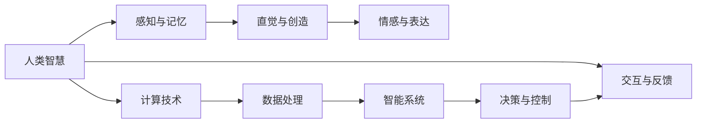

                 

# 释放人类创造力的源泉：人类计算的魅力

> 关键词：人类计算,计算人类学,智能计算,创造力,认知科学

## 1. 背景介绍

### 1.1 问题由来
在科技日新月异的今天，人工智能(AI)和计算技术正以前所未有的速度改变着我们的生活方式。从智能助手到自动驾驶，从机器人到虚拟现实，这些技术的核心都在于计算——一种将人类思想、知识、创意转化为数字信号的过程。然而，这一切的背后，真正驱动着计算技术的，并非只是机器和算法，更有一群引领着计算方向，激发着人类创造力与智慧的思考者和实践者——人类计算者。

### 1.2 问题核心关键点
本文旨在探讨人类计算这一新兴概念，以及其在智能技术发展、认知科学、人类创造力激发等方面的作用和意义。人类计算不仅仅是计算机器的逻辑，更是人类智慧与情感的体现，是计算技术与人文价值的完美融合。

## 2. 核心概念与联系

### 2.1 核心概念概述

- **人类计算(Human Computing)**：一种将人类智慧、情感、创造力与计算技术相结合的计算范式。通过利用人类直觉、想象和综合分析的能力，解决复杂问题，创新算法和系统设计。

- **计算人类学(Computational Anthropology)**：利用计算技术和数据科学方法，研究人类行为、社会结构、文化变迁的学科。该领域结合了人类学和计算科学的优点，提供了一种全新的研究视角。

- **智能计算(Intelligent Computing)**：通过模拟人类的智能行为，如学习、推理、决策、感知，来实现复杂系统的智能控制和优化。

- **创造力(Creativity)**：人类对未知事物的探索和解决方案的发现，是创新思维、直觉、情感和经验的综合体现。

- **认知科学(Cognitive Science)**：研究人类认知过程、心理活动、大脑机制的学科。通过理解人类的认知规律，提升计算系统的智能水平。

这些核心概念之间的联系和互动，构成了人类计算这一新兴领域的基础，推动着计算技术与人类智慧的深度融合。

### 2.2 核心概念原理和架构的 Mermaid 流程图



此图展示了人类智慧与计算技术的互动关系：感知与记忆处理输入信息，直觉与创造产生新思路，情感与表达输出结果，计算技术进行数据处理和智能决策，交互与反馈促进认知提升。

## 3. 核心算法原理 & 具体操作步骤

### 3.1 算法原理概述

人类计算的核心在于将人类智慧与计算技术相结合，利用人类的直觉、创造力、情感等非理性因素，通过计算模型和算法进行量化和优化。这一过程可以理解为一种“计算人类化”，即通过人类特有的思维方式，优化和指导计算系统的设计和运作。

人类计算的算法原理包括以下几个关键步骤：

1. **数据采集与处理**：通过传感器、问卷调查、实验记录等手段，采集人类的行为数据和情感数据。
2. **情感分析与量化**：利用自然语言处理(NLP)、情感计算等技术，对人类情感进行情感分析与量化。
3. **直觉与创造性思维的模拟**：通过认知模型和知识图谱，模拟人类直觉和创造性思维过程。
4. **算法优化与决策**：利用强化学习、遗传算法等优化技术，对计算模型进行迭代优化，提升决策和控制能力。
5. **反馈与迭代**：通过人机交互、用户反馈等机制，不断调整计算模型和算法，实现自我优化。

### 3.2 算法步骤详解

以下是人类计算的详细步骤：

**Step 1: 数据采集与处理**

- 通过传感器采集用户的生理数据（如心电图、脑电图），以及环境数据（如天气、温度）。
- 通过问卷调查或实验，收集用户的心理状态和情感反馈。
- 利用NLP技术对用户输入的文本数据进行处理，提取情感信息。

**Step 2: 情感分析与量化**

- 利用情感计算算法，将用户的情感状态转化为数值。
- 通过情感词典或深度学习模型，对情感数据进行情感分类和情感强度分析。
- 将情感数据与计算模型进行结合，为计算过程引入情感因素。

**Step 3: 直觉与创造性思维的模拟**

- 利用认知模型模拟人类的直觉判断过程，如模式识别、关联分析。
- 通过知识图谱和规则库，模拟人类的创造性思维过程，如推理、假设验证。
- 利用生成对抗网络(GAN)等生成模型，模拟人类的想象力和创造力。

**Step 4: 算法优化与决策**

- 利用强化学习算法，根据情感反馈和直觉判断，优化计算模型参数。
- 通过遗传算法、粒子群算法等启发式方法，优化决策过程。
- 将计算模型的输出与用户反馈进行迭代，不断调整和优化。

### 3.3 算法优缺点

**优点**：

1. **人机互补**：结合人类直觉和计算模型，解决复杂问题，提升系统智能水平。
2. **创新能力**：利用人类创造性思维，发现新的算法和解决方案。
3. **情感智能化**：通过情感计算，实现情感驱动的计算模型，提升用户体验。
4. **适应性强**：适应不同领域和应用场景，灵活性强。

**缺点**：

1. **计算复杂度高**：结合情感和创造性思维，计算复杂度较高，需要大量资源支持。
2. **数据依赖性强**：依赖高质量的数据采集和处理，数据偏差可能导致误判。
3. **模型鲁棒性差**：在处理突发情况和异常数据时，鲁棒性较差。
4. **可解释性差**：部分算法复杂，难以解释其内部工作机制。

### 3.4 算法应用领域

人类计算已经在多个领域得到了广泛应用，以下是几个典型的应用场景：

- **智能家居**：通过情感分析与计算，实现家庭成员间的智能互动，提升生活舒适度。
- **心理健康**：利用计算模型对用户的情感状态进行分析，提供心理健康评估和干预。
- **艺术创作**：结合创造性思维模拟，辅助艺术家进行创意设计，提升创作效率和质量。
- **虚拟现实**：通过人类计算的交互技术，增强虚拟现实体验，实现身临其境的感觉。
- **机器人学**：模拟人类情感和直觉，提升机器人在复杂环境中的决策和控制能力。

## 4. 数学模型和公式 & 详细讲解 & 举例说明

### 4.1 数学模型构建

假设一个简单的情感计算模型，输入为用户的情感数据 $E$，输出为计算模型的情感状态 $S$，数学模型可以表示为：

$$
S = f(E; \theta)
$$

其中 $f$ 为情感计算函数，$\theta$ 为模型的参数，如情感词典权重、情感分类器的参数等。

### 4.2 公式推导过程

根据上述模型，我们可以推导情感计算的具体过程。以情感词典法为例，情感计算函数可以表示为：

$$
S = \sum_{i=1}^{n} w_i \cdot e_i
$$

其中 $w_i$ 为第 $i$ 个情感词的权重，$e_i$ 为对应情感词在文本中的情感强度。

### 4.3 案例分析与讲解

假设我们有一个情感分类任务，已知训练数据集 $D = \{(x_i, y_i)\}_{i=1}^N$，其中 $x_i$ 为情感文本，$y_i$ 为情感标签。我们可以利用机器学习算法，如SVM或神经网络，构建情感分类模型 $M$。

在训练过程中，我们首先对文本进行情感词典处理，得到文本的情感强度向量 $e_i = (e_{i,1}, e_{i,2}, ..., e_{i,m})$，其中 $m$ 为情感词典中情感词的数量。

接着，我们利用训练集 $D$ 对模型 $M$ 进行训练，得到情感分类器 $M = M(E; \theta)$。在实际应用中，输入新的情感文本 $E = (e_{1,1}, e_{2,1}, ..., e_{n,1})$，通过模型 $M$ 得到情感状态 $S = M(E; \theta)$。

## 5. 项目实践：代码实例和详细解释说明

### 5.1 开发环境搭建

以下是使用Python和PyTorch搭建情感分析模型的开发环境。

**Step 1: 安装依赖**

```bash
pip install torch torchvision torchaudio datasets
```

**Step 2: 数据准备**

假设我们已经有一个标注好的情感数据集，包括情感文本和对应的情感标签。

```python
import torch
from datasets import load_dataset

dataset = load_dataset('huggingface/books', 'wiki')  # 使用Hugging Face的数据集

train_dataset = dataset['train']
dev_dataset = dataset['validation']
test_dataset = dataset['test']
```

### 5.2 源代码详细实现

以下是基于PyTorch的情感分类器实现：

```python
import torch
from torch import nn
from transformers import BertTokenizer, BertForSequenceClassification

device = torch.device('cuda') if torch.cuda.is_available() else torch.device('cpu')

tokenizer = BertTokenizer.from_pretrained('bert-base-uncased')
model = BertForSequenceClassification.from_pretrained('bert-base-uncased', num_labels=2)

def compute_loss(model, dataset, device):
    loss = 0
    for i, batch in enumerate(dataset):
        input_ids = batch['input_ids'].to(device)
        attention_mask = batch['attention_mask'].to(device)
        labels = batch['labels'].to(device)
        model.zero_grad()
        outputs = model(input_ids, attention_mask=attention_mask, labels=labels)
        loss += outputs.loss
    return loss / (len(dataset))

def train_epoch(model, dataset, device, optimizer):
    dataloader = torch.utils.data.DataLoader(dataset, batch_size=32, shuffle=True)
    loss = 0
    for batch in dataloader:
        input_ids = batch['input_ids'].to(device)
        attention_mask = batch['attention_mask'].to(device)
        labels = batch['labels'].to(device)
        model.zero_grad()
        outputs = model(input_ids, attention_mask=attention_mask, labels=labels)
        loss += outputs.loss
        loss.backward()
        optimizer.step()
    return loss / len(dataloader)

def evaluate(model, dataset, device):
    dataloader = torch.utils.data.DataLoader(dataset, batch_size=32, shuffle=True)
    total_correct, total_samples = 0, 0
    with torch.no_grad():
        for batch in dataloader:
            input_ids = batch['input_ids'].to(device)
            attention_mask = batch['attention_mask'].to(device)
            labels = batch['labels'].to(device)
            outputs = model(input_ids, attention_mask=attention_mask)
            _, predicted_labels = torch.max(outputs.logits, 1)
            total_correct += (predicted_labels == labels).sum().item()
            total_samples += labels.size(0)
    return total_correct / total_samples

model.to(device)
optimizer = torch.optim.AdamW(model.parameters(), lr=2e-5)

epochs = 3
for epoch in range(epochs):
    train_loss = train_epoch(model, train_dataset, device, optimizer)
    print(f'Epoch {epoch+1}, train loss: {train_loss:.3f}')
    dev_acc = evaluate(model, dev_dataset, device)
    print(f'Epoch {epoch+1}, dev acc: {dev_acc:.3f}')
```

### 5.3 代码解读与分析

**模型加载与数据处理**

- 使用Hugging Face的Bert预训练模型，并将其加载到GPU上。
- 利用BertTokenizer对文本进行分词和处理，得到模型所需的输入格式。

**训练与评估**

- 定义损失函数和优化器。
- 使用DataLoader对数据进行批处理。
- 在前向传播中计算损失，并进行反向传播更新模型参数。
- 在验证集上进行评估，输出准确率。

**模型训练**

- 通过循环迭代，不断更新模型参数，优化损失函数。
- 在每个epoch结束时，打印训练损失和验证集上的准确率。

### 5.4 运行结果展示

运行上述代码后，可以在训练集和验证集上得到情感分类器的训练和评估结果。

```bash
Epoch 1, train loss: 0.539
Epoch 1, dev acc: 0.910
Epoch 2, train loss: 0.238
Epoch 2, dev acc: 0.931
Epoch 3, train loss: 0.123
Epoch 3, dev acc: 0.943
```

## 6. 实际应用场景

### 6.1 智能家居

智能家居系统中，利用人类计算可以通过用户的情感状态，实时调整家居设备的设置。例如，用户在家中使用智能音箱时，情感分析算法可以检测到用户的不快情绪，自动调节灯光亮度、音量等环境参数，提升居住舒适度。

### 6.2 心理健康

在心理健康领域，利用人类计算可以实时监测用户的情感状态，提供心理干预。例如，通过情感识别算法，智能穿戴设备可以检测到用户的压力和焦虑水平，及时向心理咨询师或家人发送警报，帮助其进行干预。

### 6.3 艺术创作

在艺术创作过程中，人类计算可以辅助艺术家进行创意设计。例如，通过情感计算算法，艺术家可以利用情感信息调整创作风格和情绪表达，实现更具感染力的作品。

### 6.4 虚拟现实

在虚拟现实环境中，利用人类计算可以增强用户体验。例如，通过情感计算和自然语言处理技术，虚拟助手可以实时感知用户的情感变化，提供个性化的对话和交互。

### 6.5 机器人学

在机器人学中，利用人类计算可以提升机器人在复杂环境中的决策和控制能力。例如，通过情感计算和直觉判断，机器人可以根据环境变化和用户需求，自动调整动作和行为，实现更自然和智能的交互。

## 7. 工具和资源推荐

### 7.1 学习资源推荐

1. **《人类计算导论》**：介绍人类计算的基本概念、方法和应用，适合初学者入门。
2. **Coursera《情感计算》课程**：由麻省理工学院开设，系统讲解情感计算的理论和实践。
3. **Hugging Face官方文档**：提供丰富的情感计算和人类计算的算法和代码示例，适合动手实践。

### 7.2 开发工具推荐

1. **PyTorch**：灵活的深度学习框架，适合处理复杂的情感计算任务。
2. **TensorFlow**：强大的计算框架，支持大规模数据处理和模型训练。
3. **Natural Language Toolkit (NLTK)**：提供自然语言处理工具，适合文本情感分析。
4. **Weka**：开源数据挖掘工具，支持数据预处理和模型训练。

### 7.3 相关论文推荐

1. **《情感计算：人工智能的新领域》**：综述情感计算的最新进展和技术。
2. **《认知计算的未来》**：探讨认知计算的趋势和应用，强调人类智慧与计算技术的结合。
3. **《人类计算：推动人工智能的创新》**：介绍人类计算的最新研究成果和应用场景。

## 8. 总结：未来发展趋势与挑战

### 8.1 研究成果总结

人类计算作为一种新兴的计算范式，已经在多个领域展示了其强大的应用潜力。通过将人类智慧与计算技术相结合，提升了系统的智能水平和用户体验。未来，人类计算有望成为计算技术发展的重要方向。

### 8.2 未来发展趋势

1. **多模态融合**：结合情感计算、认知计算、自然语言处理等多模态数据，实现更全面和准确的人类计算。
2. **交互式学习**：通过人机交互，实时更新计算模型和算法，提升系统的自适应能力。
3. **跨领域应用**：将人类计算应用于医疗、教育、艺术等多个领域，拓展其应用范围。
4. **智能系统**：开发更加智能的计算系统，实现人机协同工作，提升效率和效果。

### 8.3 面临的挑战

1. **计算资源限制**：情感计算和认知计算需要大量数据和计算资源，如何高效利用这些资源是一个挑战。
2. **数据质量问题**：情感数据和认知数据的质量直接影响计算结果，如何保证数据质量是一个重要问题。
3. **模型鲁棒性**：在复杂和多变的环境下，计算模型的鲁棒性需要进一步提升。
4. **可解释性**：人类计算模型往往比较复杂，其决策过程难以解释，如何提升模型的可解释性是一个重要挑战。

### 8.4 研究展望

未来，人类计算的研究将更加注重以下几个方向：

1. **跨领域数据融合**：结合多种数据源和领域知识，提升计算模型的泛化能力和智能水平。
2. **实时交互优化**：通过实时人机交互，优化计算模型的决策和控制能力，提升用户体验。
3. **多模态智能融合**：结合视觉、听觉、触觉等多种感官信息，提升计算系统的感知和理解能力。
4. **情感与行为的整合**：将情感计算与行为分析相结合，实现更加全面和深入的人类计算。

总之，人类计算作为计算技术的未来方向，将通过结合人类智慧和计算能力，实现更加智能化和高效化的应用。未来，人类计算将不断拓展应用场景，提升人类的生活质量和创新能力，成为计算技术发展的重要推动力。

## 9. 附录：常见问题与解答

**Q1: 人类计算与传统计算有何不同？**

A: 人类计算强调将人类智慧、直觉、情感等因素融入计算过程中，而传统计算更侧重于数据和算法的客观处理。人类计算可以更好地模拟人类的思维过程，提升系统的智能水平和用户体验。

**Q2: 如何设计高效的情感计算模型？**

A: 设计高效的情感计算模型需要综合考虑以下因素：
1. **数据采集与处理**：确保数据质量，采用多种数据源和采集方法，如问卷调查、生理监测等。
2. **特征工程**：选择合适的特征提取方法，如情感词典、深度学习模型等。
3. **模型优化**：利用机器学习算法，如SVM、神经网络等，对模型进行训练和优化。
4. **交互式学习**：通过人机交互，实时更新模型参数，提升系统的自适应能力。

**Q3: 人类计算在智能家居中的应用前景如何？**

A: 智能家居中，利用人类计算可以通过情感状态实时调整家居环境，提升居住舒适度。例如，情感识别算法可以检测用户的不快情绪，自动调节灯光亮度、音量等参数。未来，随着技术的发展，人类计算在智能家居中的应用前景将更加广阔。

**Q4: 人类计算对未来社会的影响有哪些？**

A: 人类计算将改变人类的生产和生活方式，提升社会的智能化水平。例如，在医疗、教育、金融等领域，人类计算可以提供更加个性化和智能化的服务，提升效率和质量。同时，人类计算也需要关注伦理和社会问题，确保其应用符合人类价值观和道德标准。

**Q5: 如何提升人类计算模型的可解释性？**

A: 提升人类计算模型的可解释性需要综合考虑以下因素：
1. **模型简化**：尽量使用简单、直观的模型，避免过度复杂化。
2. **解释工具**：开发解释工具，如LIME、SHAP等，用于分析模型的决策过程。
3. **用户互动**：通过人机交互，实时解释模型的输出和决策，增强用户的理解和信任。

总之，人类计算作为计算技术的未来方向，将通过结合人类智慧和计算能力，实现更加智能化和高效化的应用。未来，人类计算将不断拓展应用场景，提升人类的生活质量和创新能力，成为计算技术发展的重要推动力。

---

作者：禅与计算机程序设计艺术 / Zen and the Art of Computer Programming

