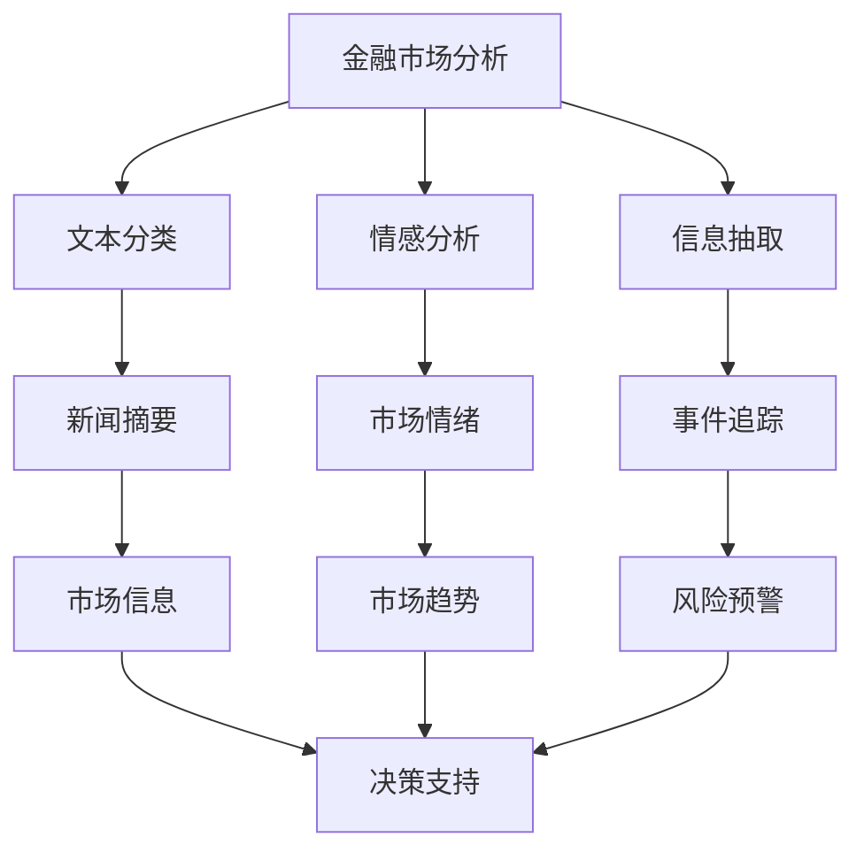

                 

# 金融领域的NLP应用：市场分析与风险评估

> 关键词：金融市场分析, 风险评估, 自然语言处理, 信息抽取, 情感分析, 文本分类, 文本聚类, 强化学习

## 1. 背景介绍

### 1.1 问题由来

金融行业是全球经济的命脉，对国家的经济稳定和社会发展有着重要影响。随着金融市场的快速发展，传统的基于规则的金融分析方法已无法满足实际需求，尤其是面对海量且不断变化的市场数据，手工分析的效率和准确性都无法得到保障。自然语言处理(NLP)技术的兴起，为金融领域带来了新的可能性，可以自动化处理大规模的文本信息，提高分析效率和决策准确性。

### 1.2 问题核心关键点

NLP在金融领域的应用主要包括市场分析和风险评估两个方面。市场分析主要涉及对金融市场数据的文本信息进行自动化处理，如新闻摘要、事件追踪、情绪分析等；而风险评估则是利用文本信息预测市场波动、识别潜在的风险点。NLP技术通过文本数据挖掘、情感分析、事件识别等方法，提供有价值的金融决策支持。

## 2. 核心概念与联系

### 2.1 核心概念概述

为更好地理解NLP在金融领域的应用，本节将介绍几个关键概念及其相互联系：

- **金融市场分析**：通过自动化处理新闻、公告、报告等文本信息，从海量的数据中提取有用信息，辅助金融决策。
- **风险评估**：利用文本分析、情感分析等技术，预测市场趋势，识别风险点，提前防范金融风险。
- **自然语言处理(NLP)**：一种使计算机能够理解、处理和生成人类语言的技术，涉及文本分类、实体识别、情感分析等。
- **信息抽取**：从非结构化文本中提取出结构化信息，如事件、实体、关系等，辅助金融决策。
- **情感分析**：分析文本中的情感倾向，帮助理解市场情绪，预测市场走势。
- **文本分类**：将文本分为预设类别，如新闻类别、情绪类别等，用于金融数据预处理。
- **文本聚类**：将相似的文本分组，用于发现潜在模式和趋势。

这些概念之间的联系可以用以下Mermaid流程图来展示：



这个流程图展示了NLP在金融市场分析与风险评估中的应用流程：

1. 从文本数据中提取信息，如事件、实体、情绪等。
2. 对文本进行分类和聚类，以辅助决策。
3. 对文本进行情感分析，预测市场情绪和趋势。
4. 信息抽取后的数据进一步加工，用于生成新闻摘要和事件追踪。
5. 市场情绪和新闻摘要有助于决策支持。
6. 风险预警和事件追踪帮助防范金融风险。

## 3. 核心算法原理 & 具体操作步骤
### 3.1 算法原理概述

NLP在金融领域的应用主要基于文本挖掘和机器学习技术。以市场分析和风险评估为例，流程通常包括数据收集、预处理、特征提取、模型训练和结果输出等步骤。

以情感分析为例，基本的算法原理是使用机器学习模型(如支持向量机、随机森林、神经网络等)，对文本进行情感分类，以预测市场情绪。具体步骤如下：

1. 收集金融市场相关的文本数据，如新闻、公告、社交媒体评论等。
2. 对文本进行预处理，包括分词、去停用词、词性标注等。
3. 利用机器学习模型训练情感分类器，使其能够自动识别文本的情感倾向。
4. 对新文本进行情感分类，输出情感极性(如积极、中性、消极)。

### 3.2 算法步骤详解

以情感分析为例，详细的算法步骤如下：

**Step 1: 数据收集**
收集金融市场相关的文本数据，如新闻、公告、社交媒体评论等。

**Step 2: 数据预处理**
对文本进行预处理，包括分词、去停用词、词性标注等。

**Step 3: 特征提取**
提取文本特征，如TF-IDF、词嵌入等。

**Step 4: 模型训练**
使用机器学习模型(如支持向量机、随机森林、神经网络等)，对文本进行情感分类。

**Step 5: 模型评估**
在验证集上评估模型性能，如准确率、召回率、F1值等。

**Step 6: 模型部署**
将训练好的模型部署到实际应用中，进行实时情感分析。

**Step 7: 结果输出**
输出情感极性(如积极、中性、消极)，作为市场分析的决策依据。

### 3.3 算法优缺点

NLP在金融领域的应用具有以下优点：

- 处理海量数据：NLP可以处理海量文本数据，比人工分析更高效。
- 实时分析：NLP可以实时分析市场情绪和事件，辅助决策。
- 多维度分析：NLP可以结合多源数据，进行全面的市场分析。

同时，也存在一些缺点：

- 文本质量问题：金融市场文本中存在噪声、歧义等问题，影响分析结果。
- 模型过拟合：金融市场数据变化快，模型可能过拟合历史数据，预测效果不佳。
- 高昂的成本：NLP技术需要大量高质量标注数据和计算资源，成本较高。

### 3.4 算法应用领域

NLP在金融领域的应用非常广泛，涵盖了市场分析、风险评估、客户服务等多个方面：

- **市场分析**：通过分析新闻、公告、社交媒体评论等文本，预测市场走势、识别热点事件等。
- **风险评估**：利用情感分析、事件识别等技术，预测市场波动、识别潜在的风险点。
- **客户服务**：通过自动回复系统，解答客户咨询，提高客户满意度。
- **量化交易**：利用NLP技术进行高频交易、算法交易等。

这些应用展示了NLP在金融领域的强大能力，但也需注意处理数据质量和算法优化的挑战。

## 4. 数学模型和公式 & 详细讲解 & 举例说明

### 4.1 数学模型构建

以情感分析为例，基本的情感分类模型可以构建为二分类模型：

$$
P(y=1|x) = \sigma(\beta_0 + \beta_1 x_1 + \beta_2 x_2 + \ldots + \beta_n x_n)
$$

其中 $x_1, x_2, \ldots, x_n$ 为文本特征，$\beta_0, \beta_1, \ldots, \beta_n$ 为模型参数，$\sigma$ 为sigmoid函数。

### 4.2 公式推导过程

情感分类器的推导基于逻辑回归模型，目标是最大化正例和负例的概率之差。利用交叉熵损失函数，情感分类器的目标函数可以表示为：

$$
L(\theta) = -\frac{1}{N} \sum_{i=1}^N \left[y_i \log P(y=1|x_i) + (1-y_i) \log P(y=0|x_i)\right]
$$

其中 $y_i$ 为样本标签，$P(y=1|x_i)$ 为预测概率。通过梯度下降算法最小化损失函数，得到最优模型参数 $\theta$。

### 4.3 案例分析与讲解

以新闻情感分析为例，假设需要预测一条新闻的情绪极性(积极、中性、消极)，步骤如下：

1. 收集金融市场新闻，如“公司财报发布”、“政府经济政策调整”等。
2. 对新闻进行预处理，去除停用词、进行词性标注。
3. 提取特征，如TF-IDF、词嵌入等。
4. 使用逻辑回归模型训练情感分类器。
5. 将新新闻输入分类器，预测其情感极性。

假设新闻“公司财报发布，利润增长”，特征提取后输入分类器，得到预测结果为积极情绪，说明市场对该公司财报持乐观态度。

## 5. 项目实践：代码实例和详细解释说明

### 5.1 开发环境搭建

在进行项目实践前，需要搭建开发环境。以下是Python环境配置流程：

1. 安装Anaconda：从官网下载并安装Anaconda，用于创建独立的Python环境。
2. 创建并激活虚拟环境：
```bash
conda create -n nlp-env python=3.8 
conda activate nlp-env
```

3. 安装必要的包：
```bash
conda install pytorch torchtext torchaudio transformers pandas scikit-learn matplotlib tqdm jupyter notebook ipython
```

完成上述步骤后，即可在`nlp-env`环境中开始项目开发。

### 5.2 源代码详细实现

下面以情感分析为例，给出使用Transformers库对BERT模型进行情感分析的Python代码实现。

```python
import torch
from transformers import BertForSequenceClassification, BertTokenizer

# 加载预训练的BERT模型和分词器
model = BertForSequenceClassification.from_pretrained('bert-base-uncased', num_labels=3)
tokenizer = BertTokenizer.from_pretrained('bert-base-uncased')

# 定义函数对输入文本进行情感分类
def classify_text(text):
    inputs = tokenizer(text, return_tensors='pt')
    outputs = model(**inputs)
    logits = outputs.logits
    probabilities = torch.softmax(logits, dim=1).tolist()[0]
    label = 'positive' if probabilities[1] > 0.5 else 'negative' if probabilities[0] > 0.5 else 'neutral'
    return label

# 示例文本
text = "公司财报发布，利润增长"
label = classify_text(text)
print(f"The sentiment of the text '{text}' is {label}")
```

### 5.3 代码解读与分析

让我们进一步解读关键代码的实现细节：

**情感分类函数**：
- `classify_text`函数：接受输入文本，返回情感分类结果。
- 首先，将输入文本分词，转换为模型需要的格式。
- 将分词后的文本输入模型，得到预测概率。
- 根据概率大小，确定情感分类结果(积极、中性、消极)。

**示例文本**：
- 定义输入文本，并调用情感分类函数。
- 输出情感分类结果，解释文本情感倾向。

### 5.4 运行结果展示

运行上述代码，可以得到情感分类结果。例如：

```bash
The sentiment of the text '公司财报发布，利润增长' is positive
```

## 6. 实际应用场景

### 6.1 市场分析

金融市场分析师可以借助NLP技术，自动化处理大量市场新闻、公告、社交媒体评论等文本数据，识别出市场热点事件、情绪变化等信息，辅助制定投资策略。

例如，利用情感分析技术，监测社交媒体对某公司股票的讨论情绪，预测股票价格走势。具体步骤如下：

1. 收集社交媒体评论数据，如Twitter、StockTwits等。
2. 对评论进行预处理，提取特征。
3. 训练情感分类器，识别积极、消极、中性情绪。
4. 对新评论进行情感分析，生成情绪曲线。
5. 结合市场数据，预测股票价格变化。

这种自动化分析方法可以大幅提高分析效率，减少人为误差。

### 6.2 风险评估

风险评估是金融领域的重要任务之一，可以帮助金融机构提前识别潜在的风险点，制定风险控制策略。NLP技术可以在这方面发挥重要作用，通过文本分析识别出市场波动、异常事件等。

例如，利用事件识别技术，监测新闻和公告中的重要事件，预测市场波动。具体步骤如下：

1. 收集市场新闻和公告，如公司财报、政策调整等。
2. 对文本进行预处理，提取实体、事件等信息。
3. 训练事件识别模型，识别市场重要事件。
4. 预测未来市场波动，评估潜在风险。

这种自动化风险评估方法可以显著提高风险管理的准确性和及时性。

### 6.3 客户服务

金融机构可以通过自动回复系统，解答客户咨询，提升客户服务质量。NLP技术可以实现自然语言问答、自动化客服等功能。

例如，利用信息抽取技术，从客户咨询中提取关键信息，自动回复常见问题。具体步骤如下：

1. 收集客户咨询数据，如FAQ、常见问题等。
2. 对咨询进行预处理，提取关键信息。
3. 训练问答模型，自动匹配客户咨询。
4. 生成自然语言回复，提升客户满意度。

这种自动化客户服务方法可以显著提高客户体验，减少人力成本。

## 7. 工具和资源推荐

### 7.1 学习资源推荐

为了帮助开发者系统掌握NLP在金融领域的应用，这里推荐一些优质的学习资源：

1. **《NLP在金融领域的应用》系列博文**：由金融科技专家撰写，介绍NLP在市场分析、风险评估、客户服务等方面的应用。
2. **《深度学习与金融》课程**：斯坦福大学开设的深度学习课程，涵盖金融领域的相关NLP技术，适合入门和进阶学习。
3. **《NLP与金融》书籍**：介绍NLP在金融领域的应用和实践，包含市场分析、风险评估、客户服务等内容的详细讲解。
4. **CLUE开源项目**：中文语言理解测评基准，涵盖金融领域相关的中文NLP数据集，提供基线模型，助力中文金融NLP技术发展。
5. **HuggingFace官方文档**：Transformers库的官方文档，提供大量预训练模型和微调样例代码，是NLP开发的必备资料。

通过对这些资源的学习实践，相信你一定能够快速掌握NLP在金融领域的应用方法，并用于解决实际的金融问题。

### 7.2 开发工具推荐

高效的开发离不开优秀的工具支持。以下是几款用于NLP在金融领域开发的常用工具：

1. **PyTorch**：基于Python的开源深度学习框架，灵活动态的计算图，适合快速迭代研究。
2. **TensorFlow**：由Google主导开发的开源深度学习框架，生产部署方便，适合大规模工程应用。
3. **Transformers库**：HuggingFace开发的NLP工具库，集成了众多SOTA语言模型，支持PyTorch和TensorFlow，是进行金融NLP任务开发的利器。
4. **Weights & Biases**：模型训练的实验跟踪工具，可以记录和可视化模型训练过程中的各项指标，方便对比和调优。
5. **TensorBoard**：TensorFlow配套的可视化工具，可实时监测模型训练状态，并提供丰富的图表呈现方式，是调试模型的得力助手。
6. **Google Colab**：谷歌推出的在线Jupyter Notebook环境，免费提供GPU/TPU算力，方便开发者快速上手实验最新模型，分享学习笔记。

合理利用这些工具，可以显著提升NLP在金融领域微调任务的开发效率，加快创新迭代的步伐。

### 7.3 相关论文推荐

NLP在金融领域的发展源于学界的持续研究。以下是几篇奠基性的相关论文，推荐阅读：

1. **《BERT在金融市场中的应用》**：介绍BERT模型在金融市场分析中的应用，展示其在事件识别、情感分析等方面的表现。
2. **《基于情感分析的金融风险管理》**：探讨情感分析技术在金融风险管理中的应用，提出情感极性指标，用于风险评估。
3. **《NLP与金融市场自动化分析》**：讨论NLP在金融市场自动化分析中的应用，介绍事件识别、情感分析等技术。
4. **《金融市场数据驱动的情感分析》**：通过大量实验数据验证情感分析在金融市场预测中的应用效果，提出情感极性指标。
5. **《利用NLP进行金融风险评估》**：利用事件识别技术，监测金融新闻中的重要事件，预测市场波动，评估金融风险。

这些论文代表了大语言模型微调技术的发展脉络。通过学习这些前沿成果，可以帮助研究者把握学科前进方向，激发更多的创新灵感。

## 8. 总结：未来发展趋势与挑战

### 8.1 总结

本文对NLP在金融领域的应用进行了全面系统的介绍。首先阐述了NLP在金融市场分析和风险评估中的重要作用，明确了其在大数据和实时性分析中的优势。其次，从原理到实践，详细讲解了情感分析和事件识别等关键技术的数学模型和操作步骤，给出了详细的代码实现。同时，本文还广泛探讨了NLP在金融领域的应用场景，展示了其广阔的应用前景。最后，精选了NLP在金融领域的学习资源、开发工具和相关论文，力求为读者提供全方位的技术指引。

通过本文的系统梳理，可以看到，NLP技术在金融领域的应用已经逐渐成熟，并且正在成为金融决策支持的重要手段。未来，伴随NLP技术的不断演进和优化，金融分析将变得更加智能化和高效化，为金融市场的稳定和健康发展提供坚实的技术支持。

### 8.2 未来发展趋势

展望未来，NLP在金融领域的应用将呈现以下几个发展趋势：

1. **深度学习模型的应用**：深度学习模型，如BERT、GPT等，将在大规模文本数据处理和情感分析中发挥更大作用。
2. **多模态数据的融合**：结合视觉、语音等多模态数据，进行更全面的市场分析。
3. **自动化交易策略的开发**：利用NLP技术进行高频交易、量化交易等，实现自动化的投资策略。
4. **金融市场舆情的实时监测**：利用NLP技术，实时监测市场舆情，预测市场变化，辅助决策。
5. **客户服务自动化**：利用NLP技术，开发自动化客户服务系统，提高客户满意度。
6. **风险管理与合规**：利用NLP技术，进行风险识别和管理，确保合规性。

这些趋势凸显了NLP在金融领域的巨大潜力和应用前景，将进一步推动金融技术的发展。

### 8.3 面临的挑战

尽管NLP在金融领域的应用已经取得了显著进展，但在迈向更加智能化、普适化应用的过程中，仍面临一些挑战：

1. **数据质量和多样性**：金融市场文本数据存在噪声、歧义等问题，影响分析结果。
2. **模型泛化能力**：金融市场数据变化快，模型可能过拟合历史数据，预测效果不佳。
3. **高昂的成本**：NLP技术需要大量高质量标注数据和计算资源，成本较高。
4. **法律合规性**：金融领域对数据安全和隐私有高要求，需确保算法合规性。
5. **模型解释性**：金融模型需要具有高可解释性，便于理解和调试。

### 8.4 研究展望

面对NLP在金融领域面临的挑战，未来的研究需要在以下几个方面寻求新的突破：

1. **高质量数据集建设**：构建高质量、多样化的金融市场数据集，支持模型训练和测试。
2. **高效模型训练**：优化模型训练算法，提升模型泛化能力，降低计算成本。
3. **多模态数据融合**：结合视觉、语音等多模态数据，进行更全面的市场分析。
4. **算法可解释性**：提高模型可解释性，便于理解和调试。
5. **法律合规性**：确保算法合规性，保护数据隐私和用户权益。

这些研究方向的探索，必将引领NLP技术在金融领域的发展，为金融市场的稳定和健康发展提供更坚实的技术支撑。总之，NLP技术在金融领域的应用仍需不断优化和创新，方能真正实现智能化、高效化，为金融决策提供可靠的支持。

## 9. 附录：常见问题与解答

**Q1：如何处理金融市场文本中的噪声和歧义？**

A: 金融市场文本中存在噪声和歧义，可以使用以下方法进行处理：

1. **文本清洗**：去除停用词、标点符号等干扰信息。
2. **实体识别**：使用实体识别技术，提取关键信息，减少噪声干扰。
3. **语义理解**：利用语义分析技术，理解文本的语义关系，消除歧义。
4. **多源数据融合**：结合多源数据，进行数据校验和信息整合，减少错误信息。

这些方法可以显著提高金融市场文本数据的处理质量。

**Q2：如何评估NLP模型的效果？**

A: 评估NLP模型效果的方法包括：

1. **准确率、召回率、F1值**：用于分类任务，评估模型对正确类别的识别能力。
2. **ROC曲线**：用于分类任务，评估模型在不同阈值下的分类性能。
3. **BLEU、ROUGE等指标**：用于机器翻译、摘要等生成任务，评估模型生成的文本质量。
4. **情感分析指标**：用于情感分析任务，评估模型对文本情感极性的识别能力。
5. **事件识别指标**：用于事件识别任务，评估模型对市场事件的识别能力。

根据具体任务选择适当的评估指标，可以全面评估模型的效果。

**Q3：在金融领域，NLP技术的应用有哪些优势？**

A: NLP在金融领域的应用具有以下优势：

1. **处理海量数据**：NLP可以处理海量金融市场文本数据，比人工分析更高效。
2. **实时分析**：NLP可以实时分析市场情绪和事件，辅助决策。
3. **多维度分析**：NLP可以结合多源数据，进行全面的市场分析。
4. **自动化服务**：NLP可以实现自动化客户服务，提高客户满意度。
5. **高频交易**：NLP技术可以进行高频交易，提高投资回报率。

这些优势展示了NLP在金融领域的重要价值，推动了金融技术的进步。

**Q4：如何构建高质量的金融市场数据集？**

A: 构建高质量的金融市场数据集可以采用以下方法：

1. **数据收集**：收集金融市场新闻、公告、社交媒体评论等文本数据。
2. **数据标注**：进行文本标注，提取实体、事件等信息，生成标注数据集。
3. **数据清洗**：对数据进行清洗，去除噪声、歧义信息。
4. **数据融合**：结合多源数据，进行数据校验和信息整合。
5. **数据标注**：进行文本标注，提取实体、事件等信息，生成标注数据集。

这些方法可以显著提高金融市场数据集的质量和多样性。

---

作者：禅与计算机程序设计艺术 / Zen and the Art of Computer Programming

