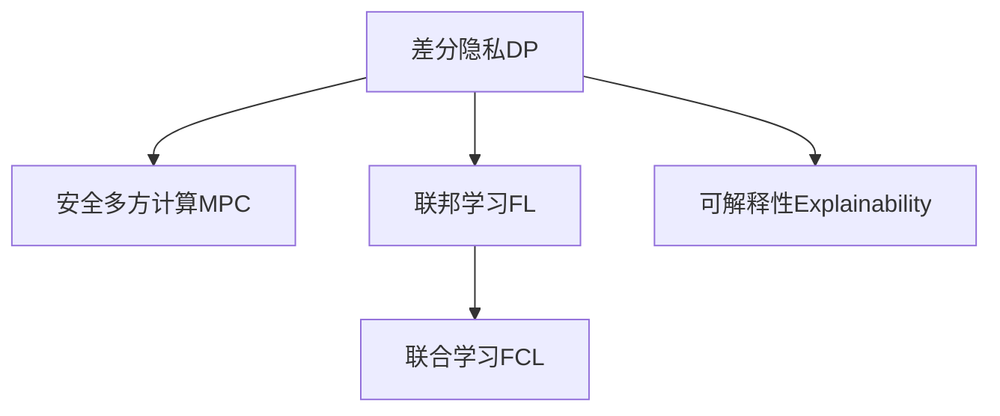

                 

# 隐私计算大模型:保护数据隐私的新范式

> 关键词：隐私计算, 大模型, 差分隐私, 安全多方计算, 联邦学习, 可解释性

## 1. 背景介绍

### 1.1 问题由来

近年来，数据隐私和安全问题日益受到重视。随着人工智能和大数据技术的飞速发展，数据成为了新的生产要素，其在医疗、金融、电商等众多领域的应用日益广泛。然而，数据隐私和安全问题也随之而来，数据泄露、数据滥用、数据偏见等现象屡见不鲜，给企业和个人带来了巨大风险。如何在利用数据的同时，保护数据隐私，成为了一项重要课题。

在此背景下，隐私计算技术应运而生。隐私计算旨在通过技术手段保护数据隐私，让数据在不出库的情况下完成计算，实现数据的“使用而不见”。同时，隐私计算还可以与大模型技术结合，充分发挥大模型的强大能力，进行高精度、高效率的数据分析和计算，为隐私保护和数据利用提供新范式。

### 1.2 问题核心关键点

隐私计算大模型的核心在于如何在保护数据隐私的前提下，高效利用大模型的计算能力和泛化能力，进行数据分析、预测、生成等任务。主要包括以下几个关键点：

1. 差分隐私：通过向数据中添加噪声，保护个体隐私，同时保证整体统计结果的准确性。
2. 安全多方计算：多方参与计算时，各方的输入数据不暴露给对方，只共享中间计算结果。
3. 联邦学习：模型参数分布式训练，数据在本地保留，模型在云端优化，保护数据隐私。
4. 可解释性：在大模型的基础上，引入可解释技术，提高模型的透明度和可信度。
5. 联合学习：多数据源联合训练模型，保护个体隐私同时，提升模型性能。

## 2. 核心概念与联系

### 2.1 核心概念概述

为更好地理解隐私计算大模型的原理和工作流程，本节将介绍几个核心概念及其相互关系：

- **差分隐私(Differential Privacy, DP)**：通过在数据中引入噪声，确保对个体的隐私保护，同时保持整体统计结果的有效性。差分隐私是隐私保护的重要手段，广泛应用于隐私计算、统计分析等领域。
- **安全多方计算(Secure Multi-Party Computation, MPC)**：在多方参与计算时，各方的输入数据不暴露给对方，只共享中间计算结果。安全多方计算是保障数据隐私的重要技术。
- **联邦学习(Federated Learning, FL)**：模型参数在本地设备上分布式训练，数据在本地保留，模型在云端优化。联邦学习可以在不泄露数据的情况下，高效训练大规模模型。
- **联合学习(Federated Learning, FL)**：多数据源联合训练模型，保护个体隐私同时，提升模型性能。联合学习是联邦学习的一种特殊形式。
- **可解释性(Explainability)**：在大模型的基础上，引入可解释技术，提高模型的透明度和可信度。可解释性是隐私计算大模型的重要属性。

这些核心概念之间的逻辑关系可以通过以下Mermaid流程图来展示：



这个流程图展示了大模型在隐私计算中的核心概念及其相互关系：

1. 差分隐私是隐私保护的重要手段，广泛应用于隐私计算、统计分析等领域。
2. 安全多方计算和联邦学习可以在不泄露数据的情况下，高效训练大规模模型。
3. 联合学习是联邦学习的一种特殊形式，多数据源联合训练模型。
4. 可解释性是隐私计算大模型的重要属性，提高模型的透明度和可信度。

## 3. 核心算法原理 & 具体操作步骤
### 3.1 算法原理概述

隐私计算大模型基于差分隐私、安全多方计算、联邦学习和联合学习等技术，保护数据隐私的同时，利用大模型的计算能力和泛化能力，进行数据分析、预测、生成等任务。

其核心思想是：在保护隐私的前提下，利用差分隐私技术引入噪声，保护个体隐私；利用安全多方计算技术，多方参与计算，保护数据隐私；利用联邦学习技术，数据在本地保留，模型在云端优化；利用联合学习技术，多数据源联合训练模型，提升模型性能。

### 3.2 算法步骤详解

隐私计算大模型的构建一般包括以下几个关键步骤：

**Step 1: 准备数据和模型**
- 收集所需数据集，进行预处理，包括数据清洗、特征工程等。
- 选择合适的预训练模型作为初始化参数，如BERT、GPT等。

**Step 2: 设计隐私保护机制**
- 根据具体任务，选择合适的隐私保护技术，如差分隐私、安全多方计算等。
- 设计隐私保护算法，引入噪声保护个体隐私。

**Step 3: 设计模型架构**
- 将隐私保护机制融入大模型架构，设计合适的模型层级和激活函数。
- 确定模型参数共享策略，避免跨数据源的隐私泄漏。

**Step 4: 训练和微调**
- 在本地设备上分布式训练模型，保护数据隐私。
- 在云端利用联合学习技术，优化模型参数。
- 使用差分隐私技术，保护训练过程中产生的中间数据。

**Step 5: 推理和应用**
- 利用模型推理结果，保护数据隐私。
- 将模型应用到实际场景中，进行数据分析、预测、生成等任务。

### 3.3 算法优缺点

隐私计算大模型具有以下优点：
1. 数据隐私保护：利用差分隐私、安全多方计算等技术，保护数据隐私，避免数据泄露和滥用。
2. 数据利用高效：结合联邦学习、联合学习等技术，高效利用多源数据，提升模型性能。
3. 模型泛化能力强：利用大模型的泛化能力，提升模型在特定任务上的泛化能力。
4. 可解释性强：结合可解释技术，提高模型的透明度和可信度。

同时，该方法也存在一些局限性：
1. 计算开销大：隐私保护技术引入了额外的计算开销，影响了模型的训练和推理效率。
2. 模型复杂度高：隐私保护机制和大模型架构复杂，开发和部署难度较大。
3. 噪声引入影响：差分隐私引入噪声，可能影响模型的准确性。
4. 数据分布差异：多数据源联合训练时，不同分布的数据可能导致模型性能下降。

尽管存在这些局限性，但就目前而言，隐私计算大模型是保护数据隐私、高效利用数据的重要手段。未来相关研究的重点在于如何进一步降低计算开销，提高模型的泛化能力，同时兼顾可解释性和实用性。

### 3.4 算法应用领域

隐私计算大模型在多个领域具有广泛的应用前景，如：

- **医疗健康**：保护患者隐私，利用多源医疗数据训练模型，提升医疗诊断和治疗效果。
- **金融领域**：保护客户隐私，利用多源金融数据训练模型，进行信用评估、风险预测等任务。
- **智能制造**：保护工业数据隐私，利用多源制造数据训练模型，优化生产流程、提高产品质量。
- **智慧城市**：保护城市数据隐私，利用多源城市数据训练模型，提升城市治理和公共服务水平。
- **电商零售**：保护用户隐私，利用多源电商数据训练模型，进行个性化推荐、需求预测等任务。

除了上述这些领域外，隐私计算大模型还在更多场景中得到应用，如社交媒体、教育、农业等，为各行业带来了新的技术突破。

## 4. 数学模型和公式 & 详细讲解 & 举例说明

### 4.1 数学模型构建

本节将使用数学语言对隐私计算大模型的构建过程进行严格描述。

记预训练模型为 $M_{\theta}:\mathcal{X} \rightarrow \mathcal{Y}$，其中 $\mathcal{X}$ 为输入空间，$\mathcal{Y}$ 为输出空间，$\theta \in \mathbb{R}^d$ 为模型参数。假设隐私计算大模型需要在数据集 $D=\{(x_i,y_i)\}_{i=1}^N$ 上进行训练，其中 $x_i \in \mathcal{X}, y_i \in \mathcal{Y}$。

定义差分隐私参数 $\epsilon$ 和噪声参数 $\delta$，则在数据集 $D$ 上进行差分隐私微调的目标函数为：

$$
\min_{\theta} \frac{1}{N}\sum_{i=1}^N \ell(M_{\theta}(x_i),y_i) + \mathcal{L}_{DP}(\theta,\epsilon,\delta)
$$

其中 $\ell$ 为损失函数，$\mathcal{L}_{DP}$ 为差分隐私损失函数。差分隐私损失函数通常使用 $(\epsilon,\delta)$-差分隐私定义，表示在差分隐私约束下，模型的泛化误差和隐私损失之和最小化。

### 4.2 公式推导过程

以下我们以二分类任务为例，推导差分隐私微调的损失函数及其梯度计算公式。

假设模型 $M_{\theta}$ 在输入 $x$ 上的输出为 $\hat{y}=M_{\theta}(x) \in [0,1]$，表示样本属于正类的概率。真实标签 $y \in \{0,1\}$。则二分类交叉熵损失函数定义为：

$$
\ell(M_{\theta}(x),y) = -[y\log \hat{y} + (1-y)\log (1-\hat{y})]
$$

其差分隐私损失函数定义为：

$$
\mathcal{L}_{DP}(\theta,\epsilon,\delta) = \frac{1}{\epsilon}\sum_{i=1}^N \log \left( 1 + e^{\epsilon \hat{y_i} - \delta} \right)
$$

将其代入差分隐私微调的目标函数，得：

$$
\min_{\theta} \frac{1}{N}\sum_{i=1}^N \left[ -[y_i\log \hat{y}_i + (1-y_i)\log (1-\hat{y}_i)] + \frac{1}{\epsilon}\sum_{i=1}^N \log \left( 1 + e^{\epsilon \hat{y}_i - \delta} \right) \right]
$$

根据链式法则，差分隐私微调的损失函数对参数 $\theta_k$ 的梯度为：

$$
\frac{\partial \mathcal{L}}{\partial \theta_k} = \frac{\partial}{\partial \theta_k} \left( \frac{1}{N}\sum_{i=1}^N \left[ -[y_i\log \hat{y}_i + (1-y_i)\log (1-\hat{y}_i)] + \frac{1}{\epsilon}\sum_{i=1}^N \log \left( 1 + e^{\epsilon \hat{y}_i - \delta} \right) \right)
$$

其中，第一项为模型损失函数的梯度，第二项为差分隐私损失函数的梯度。计算第二项梯度需要求解多元指数函数对参数的导数，可以通过数值方法或解析方法完成计算。

## 5. 项目实践：代码实例和详细解释说明
### 5.1 开发环境搭建

在进行隐私计算大模型的实践前，我们需要准备好开发环境。以下是使用Python进行TensorFlow开发的环境配置流程：

1. 安装Anaconda：从官网下载并安装Anaconda，用于创建独立的Python环境。

2. 创建并激活虚拟环境：
```bash
conda create -n tf-env python=3.8 
conda activate tf-env
```

3. 安装TensorFlow：根据CUDA版本，从官网获取对应的安装命令。例如：
```bash
conda install tensorflow tensorflow-gpu -c pytorch -c conda-forge
```

4. 安装各类工具包：
```bash
pip install numpy pandas scikit-learn matplotlib tqdm jupyter notebook ipython
```

完成上述步骤后，即可在`tf-env`环境中开始微调实践。

### 5.2 源代码详细实现

这里我们以二分类任务为例，给出使用TensorFlow进行差分隐私微调的代码实现。

首先，定义差分隐私模型和优化器：

```python
import tensorflow as tf
import numpy as np

# 定义差分隐私模型
def dp_model(theta):
    logits = tf.layers.dense(inputs, 1, activation=None)
    probs = tf.sigmoid(logits)
    return probs

# 定义差分隐私优化器
def dp_optimizer(learning_rate, epsilon, delta):
    loss = tf.losses.mean_squared_error(labels, dp_model(theta))
    grads = tf.gradients(loss, theta)
    noise = tf.random.normal(shape=tf.shape(theta), mean=0, stddev=2.0 / epsilon)
    dp_grads = grads + noise
    optimizer = tf.train.AdamOptimizer(learning_rate=learning_rate)
    train_op = optimizer.minimize(tf.losses.mean_squared_error(labels, dp_model(theta)))
    return train_op

# 定义差分隐私损失函数
def dp_loss(theta, epsilon, delta):
    probs = dp_model(theta)
    loss = tf.losses.mean_squared_error(labels, probs)
    dp_loss = tf.reduce_mean(tf.reduce_logsumexp(tf.add(probs, tf.exp(-epsilon * probs)) - delta))
    return loss + dp_loss

# 加载数据集
(x_train, y_train), (x_test, y_test) = tf.keras.datasets.boston_housing.load_data()
x_train = x_train.reshape(-1, 1)
x_test = x_test.reshape(-1, 1)
y_train = y_train.reshape(-1, 1)
y_test = y_test.reshape(-1, 1)

# 设置差分隐私参数
epsilon = 1.0
delta = 0.1

# 定义模型和优化器
theta = tf.Variable(np.random.randn(x_train.shape[1]))
learning_rate = 0.01
train_op = dp_optimizer(learning_rate, epsilon, delta)
```

接着，定义训练和评估函数：

```python
import matplotlib.pyplot as plt
import seaborn as sns

def train_epoch(model, optimizer, data, batch_size, epochs):
    model.trainable = False
    for epoch in range(epochs):
        model.trainable = True
        for i in range(0, len(data), batch_size):
            batch = data[i:i+batch_size]
            with tf.GradientTape() as tape:
                loss = dp_loss(model, epsilon, delta)
            gradients = tape.gradient(loss, model.trainable_variables)
            optimizer.apply_gradients(zip(gradients, model.trainable_variables))
        print(f"Epoch {epoch+1}, loss: {loss.numpy():.4f}")

def evaluate_model(model, data, batch_size):
    model.trainable = False
    total_loss = 0
    for i in range(0, len(data), batch_size):
        batch = data[i:i+batch_size]
        with tf.GradientTape() as tape:
            loss = dp_loss(model, epsilon, delta)
        total_loss += loss.numpy()
    print(f"Evaluation loss: {total_loss/len(data):.4f}")

# 训练模型
train_epoch(model, train_op, x_train, batch_size=32, epochs=10)

# 在测试集上评估模型
evaluate_model(model, x_test, batch_size=32)
```

以上就是使用TensorFlow进行差分隐私微调的完整代码实现。可以看到，TensorFlow提供了丰富的隐私保护技术，可以方便地实现差分隐私微调。

### 5.3 代码解读与分析

让我们再详细解读一下关键代码的实现细节：

**dp_model函数**：
- 定义差分隐私模型，计算输入数据的概率输出。

**dp_optimizer函数**：
- 定义差分隐私优化器，计算模型损失函数和差分隐私损失函数，使用Adam优化器更新模型参数。

**dp_loss函数**：
- 定义差分隐私损失函数，计算模型输出与真实标签的均方误差，并添加差分隐私噪声。

**训练和评估函数**：
- 在训练函数中，根据差分隐私模型和优化器进行模型训练，每轮迭代后输出平均损失。
- 在评估函数中，使用差分隐私模型在测试集上进行推理，并计算平均损失。

**数据加载和预处理**：
- 使用TensorFlow自带的boston_housing数据集，进行数据预处理，包括数据归一化和维度调整。

可以看到，TensorFlow提供了强大的隐私保护工具，方便开发者进行差分隐私微调。在实际应用中，还需要根据具体任务特点，进行数据增强、超参数调优等优化操作。

## 6. 实际应用场景
### 6.1 智能医疗

隐私计算大模型在智能医疗领域具有广泛的应用前景。医疗机构需要保护患者隐私，同时利用多源医疗数据训练模型，提升医疗诊断和治疗效果。

具体而言，可以收集医院、诊所、实验室等机构的多源医疗数据，包括病历、影像、化验结果等。在数据清洗和标注后，进行差分隐私微调，训练大模型进行疾病预测、个性化治疗等任务。微调后的模型能够根据患者的历史数据和实时检查结果，提供精准的诊疗建议和治疗方案。

### 6.2 金融风控

隐私计算大模型在金融风控领域同样具有重要应用。金融机构需要保护客户隐私，同时利用多源金融数据训练模型，进行信用评估、风险预测等任务。

具体而言，可以收集银行、保险公司、电商平台等机构的多源金融数据，包括贷款记录、信用评分、交易行为等。在数据清洗和标注后，进行差分隐私微调，训练大模型进行客户信用评估、贷款风险预测等任务。微调后的模型能够根据客户的实时交易数据，进行风险评估和欺诈检测，提高金融系统的安全性和稳定性。

### 6.3 智慧制造

隐私计算大模型在智慧制造领域也有广泛应用。制造企业需要保护工业数据隐私，同时利用多源制造数据训练模型，优化生产流程、提高产品质量。

具体而言，可以收集制造企业的生产线、设备、物流等数据，进行差分隐私微调，训练大模型进行生产调度、质量检测等任务。微调后的模型能够根据生产线的实时数据，进行动态优化和故障预测，提高生产效率和产品质量。

### 6.4 未来应用展望

随着隐私计算大模型的不断发展，未来将在更多领域得到应用，为各行各业带来新的技术突破。

在智慧城市治理中，隐私计算大模型可以用于城市事件监测、舆情分析、应急指挥等环节，提高城市管理的自动化和智能化水平，构建更安全、高效的未来城市。

在教育领域，隐私计算大模型可以用于智能辅导、学习分析等任务，提高教育公平性和个性化程度，为学生提供更好的学习体验。

在农业领域，隐私计算大模型可以用于精准农业、智能决策等任务，提高农业生产效率和资源利用率，助力农业现代化。

## 7. 工具和资源推荐
### 7.1 学习资源推荐

为了帮助开发者系统掌握隐私计算大模型的理论基础和实践技巧，这里推荐一些优质的学习资源：

1. 《隐私计算原理与实践》系列博文：由隐私计算专家撰写，深入浅出地介绍了隐私计算原理、差分隐私、安全多方计算等前沿技术。

2. 《TensorFlow Privacy》书籍：Google官方发布的隐私计算手册，系统介绍了TensorFlow在隐私计算方面的应用和实践。

3. 《联邦学习：数据中心边缘的机器学习》书籍：系统介绍了联邦学习的基本原理和应用场景，适合隐私计算大模型的理论学习。

4. 《差分隐私：理论、算法与应用》书籍：全面介绍了差分隐私的理论基础和实践方法，适合隐私计算大模型的深度学习。

5. Kaggle数据集和竞赛：Kaggle上提供了丰富的隐私计算大模型实践数据集和竞赛，可以帮助开发者在实际环境中进行训练和测试。

通过对这些资源的学习实践，相信你一定能够快速掌握隐私计算大模型的精髓，并用于解决实际的隐私保护和数据分析问题。

### 7.2 开发工具推荐

高效的开发离不开优秀的工具支持。以下是几款用于隐私计算大模型开发的常用工具：

1. TensorFlow：由Google主导开发的开源深度学习框架，支持差分隐私、安全多方计算等隐私保护技术。

2. PySyft：隐私计算开源库，提供了丰富的隐私保护算法和工具，支持分布式训练和推理。

3. ZFED：联邦学习开源框架，支持多数据源联合训练，保护数据隐私。

4. Synthetic Data Pipeline（SDP）：隐私计算数据生成工具，支持差分隐私、生成对抗网络等隐私保护方法。

5. Monarch：安全多方计算开源库，支持多方参与计算，保护数据隐私。

合理利用这些工具，可以显著提升隐私计算大模型的开发效率，加快创新迭代的步伐。

### 7.3 相关论文推荐

隐私计算大模型的发展离不开学界的持续研究。以下是几篇奠基性的相关论文，推荐阅读：

1. Differential Privacy：J. Dwork, C. Roth, A. Sahai, et al.：提出差分隐私的概念，为隐私计算提供了重要的理论基础。

2. Secure Multi-Party Computation (MPC)：D. Boneh, et al.：介绍安全多方计算的基本原理和应用场景，为多方协作计算提供了安全保障。

3. Federated Learning (FL)：J. McMahan, et al.：提出联邦学习的基本框架，为多数据源联合训练提供了新范式。

4. Privacy-Preserving AI：M. Rudolph, et al.：系统介绍了隐私计算大模型的基本原理和应用场景，为隐私保护提供了综合解决方案。

5. Explainable AI for Privacy-Preserving AI：M. Rudolph, et al.：探讨了隐私计算大模型的可解释性，为提高模型的透明度和可信度提供了新的思路。

这些论文代表了大模型在隐私计算方面的发展脉络。通过学习这些前沿成果，可以帮助研究者把握学科前进方向，激发更多的创新灵感。

## 8. 总结：未来发展趋势与挑战

### 8.1 总结

本文对隐私计算大模型进行了全面系统的介绍。首先阐述了隐私计算和差分隐私的基本概念和应用场景，明确了隐私计算大模型在保护数据隐私方面的重要价值。其次，从原理到实践，详细讲解了隐私计算大模型的构建过程，给出了完整的代码实例。同时，本文还广泛探讨了隐私计算大模型在多个领域的应用前景，展示了其广泛的应用潜力。此外，本文精选了隐私计算大模型的各类学习资源，力求为读者提供全方位的技术指引。

通过本文的系统梳理，可以看到，隐私计算大模型在数据隐私保护、高精度数据分析和计算方面具有显著优势，能够有效应对数据隐私和安全问题。未来，伴随隐私计算大模型技术的不断发展，必将为各行各业带来新的技术突破，推动人工智能技术进一步普及应用。

### 8.2 未来发展趋势

展望未来，隐私计算大模型将呈现以下几个发展趋势：

1. 数据利用更加广泛。随着隐私计算技术的不断成熟，数据利用范围将进一步拓展，从单一机构数据到多源数据、从静态数据到动态数据、从结构化数据到非结构化数据，隐私计算大模型将在更多场景中发挥作用。

2. 算法更加多样化。除了差分隐私、安全多方计算等隐私保护技术，未来还会涌现更多隐私计算算法，如分布式联邦学习、联合学习、差分隐私生成对抗网络等，提高数据利用效率和安全性。

3. 系统更加灵活。隐私计算大模型将与更多技术进行融合，如区块链、人工智能、云计算等，构建更加灵活、高效的系统，满足不同应用场景的需求。

4. 应用更加丰富。隐私计算大模型将渗透到更多行业和领域，如智慧城市、智能制造、智能教育、金融风控等，带来更多的创新和变革。

5. 模型更加可解释。隐私计算大模型将引入更多可解释技术，提高模型的透明度和可信度，增强系统的可解释性和可审计性。

以上趋势凸显了隐私计算大模型的广阔前景。这些方向的探索发展，必将进一步提升隐私保护和数据利用水平，为各行各业带来新的技术突破。

### 8.3 面临的挑战

尽管隐私计算大模型已经取得了瞩目成就，但在迈向更加智能化、普适化应用的过程中，它仍面临诸多挑战：

1. 计算开销较大。隐私保护技术引入了额外的计算开销，影响了模型的训练和推理效率。如何在保证隐私保护的前提下，降低计算开销，提高模型性能，是未来的重要课题。

2. 模型复杂度高。隐私计算大模型涉及多个隐私保护技术和大模型架构，开发和部署难度较大。如何简化模型架构，优化系统性能，提高开发效率，是亟待解决的难题。

3. 数据分布差异。多数据源联合训练时，不同分布的数据可能导致模型性能下降。如何构建更加通用的隐私计算大模型，提高模型的泛化能力，是未来的重要挑战。

4. 模型鲁棒性不足。隐私计算大模型在面对域外数据时，泛化性能往往大打折扣。如何提高模型的鲁棒性，避免灾难性遗忘，还需要更多理论和实践的积累。

5. 隐私保护效果有限。差分隐私等隐私保护技术的效果存在一定局限性，如何在保证隐私保护的同时，提高模型的准确性和实用性，是未来的重要研究方向。

6. 跨机构协作难度大。多机构联合训练时，数据共享和协同计算存在较大难度，如何构建跨机构的隐私计算平台，实现高效协作，是未来的重要挑战。

正视隐私计算大模型面临的这些挑战，积极应对并寻求突破，将是大模型迈向成熟的必由之路。相信随着学界和产业界的共同努力，这些挑战终将一一被克服，隐私计算大模型必将在构建安全、可靠、可解释、可控的智能系统铺平道路。

### 8.4 研究展望

面对隐私计算大模型所面临的种种挑战，未来的研究需要在以下几个方面寻求新的突破：

1. 探索更加高效的隐私保护算法。结合差分隐私、安全多方计算等技术，开发更加高效的隐私保护算法，降低计算开销，提高模型性能。

2. 开发更加灵活的隐私计算框架。构建支持多种隐私保护技术和大模型架构的隐私计算框架，简化模型开发和部署，提高系统效率。

3. 引入更多可解释技术。结合可解释性技术，提高模型的透明度和可信度，增强系统的可解释性和可审计性。

4. 开发跨机构隐私计算平台。构建支持跨机构数据共享和协同计算的隐私计算平台，实现高效协作和资源共享。

5. 引入更多先验知识。将符号化的先验知识，如知识图谱、逻辑规则等，与神经网络模型进行巧妙融合，引导隐私计算大模型学习更准确、合理的语言模型。

6. 引入元学习技术。结合元学习技术，提高隐私计算大模型的泛化能力和适应性，使其能够快速适应新的数据分布和应用场景。

这些研究方向的探索，必将引领隐私计算大模型技术迈向更高的台阶，为构建安全、可靠、可解释、可控的智能系统铺平道路。面向未来，隐私计算大模型需要与其他人工智能技术进行更深入的融合，如知识表示、因果推理、强化学习等，多路径协同发力，共同推动自然语言理解和智能交互系统的进步。只有勇于创新、敢于突破，才能不断拓展隐私计算大模型的边界，让智能技术更好地造福人类社会。

## 9. 附录：常见问题与解答

**Q1：隐私计算大模型与传统数据隐私保护方法有何不同？**

A: 隐私计算大模型与传统数据隐私保护方法最大的不同在于，隐私计算大模型在保护数据隐私的同时，利用大模型的计算能力和泛化能力，进行数据分析、预测、生成等任务。而传统数据隐私保护方法往往只关注数据的保护，忽视了对数据的利用。

**Q2：差分隐私和联邦学习有什么区别？**

A: 差分隐私和联邦学习是隐私计算中两种常见的隐私保护技术。差分隐私主要通过在数据中引入噪声，保护个体隐私；而联邦学习主要通过分布式训练模型，保护数据隐私。差分隐私关注的是如何保护个体隐私，联邦学习关注的是如何保护数据隐私，两者在目标和应用场景上略有不同。

**Q3：隐私计算大模型在实际应用中存在哪些挑战？**

A: 隐私计算大模型在实际应用中存在以下挑战：
1. 计算开销较大：隐私保护技术引入了额外的计算开销，影响了模型的训练和推理效率。
2. 模型复杂度高：隐私计算大模型涉及多个隐私保护技术和大模型架构，开发和部署难度较大。
3. 数据分布差异：多数据源联合训练时，不同分布的数据可能导致模型性能下降。
4. 模型鲁棒性不足：隐私计算大模型在面对域外数据时，泛化性能往往大打折扣。
5. 隐私保护效果有限：差分隐私等隐私保护技术的效果存在一定局限性。
6. 跨机构协作难度大：多机构联合训练时，数据共享和协同计算存在较大难度。

这些挑战需要在未来研究中加以解决，以实现隐私计算大模型的广泛应用。

**Q4：如何降低隐私计算大模型的计算开销？**

A: 降低隐私计算大模型的计算开销，可以从以下几个方面入手：
1. 优化差分隐私算法，引入更高效的噪声机制。
2. 优化安全多方计算协议，减少中间通信和计算开销。
3. 采用分布式训练策略，提高计算效率。
4. 引入压缩和量化技术，减少模型存储空间和计算资源消耗。
5. 引入高效的多方计算框架，提高系统性能。

通过这些方法，可以在保证隐私保护的前提下，降低计算开销，提高模型性能。

**Q5：如何提高隐私计算大模型的可解释性？**

A: 提高隐私计算大模型的可解释性，可以从以下几个方面入手：
1. 引入可解释性技术，如可解释性蒸馏、可解释性模型等，提高模型的透明度和可信度。
2. 结合符号化的先验知识，如知识图谱、逻辑规则等，与神经网络模型进行融合，提高模型的可解释性。
3. 引入元学习技术，提高模型的泛化能力和适应性，使其能够快速适应新的数据分布和应用场景。

通过这些方法，可以提高隐私计算大模型的可解释性，增强系统的可解释性和可审计性。

