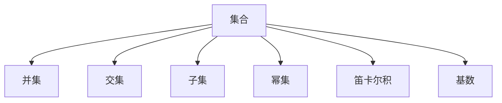

                 

## 1. 背景介绍

### 1.1 问题由来
集合论是现代数学的基础，其核心思想是将研究对象抽象成无序的元素集合，研究元素之间的关系和操作。集合论广泛应用于计算机科学，尤其是在数据结构、算法设计和数据库管理等领域。然而，集合论的抽象性和理论深度，往往令初学者望而却步。本文旨在导引读者深入理解集合论的基本概念和应用模型，帮助其系统掌握这一重要数学工具。

### 1.2 问题核心关键点
本文将围绕集合论的核心概念和应用模型进行系统讲解，重点包括以下几个方面：
- 集合的定义与操作
- 集合的表示方法与实例
- 集合论在计算机科学中的应用
- 集合的高级理论与实例分析

## 2. 核心概念与联系

### 2.1 核心概念概述

为更好地理解集合论的框架和应用，本节将介绍几个关键概念：

- 集合（Set）：由明确元素组成的抽象概念，其中元素间无序且唯一。
- 元素（Element）：集合中的基本单位，可以是数字、字符、图像等任意对象。
- 并集（Union）：将两个集合中的元素合并，去重后的结果集合。
- 交集（Intersection）：两个集合中共同元素组成的集合。
- 子集（Subset）：一个集合中的所有元素都属于另一个集合，称前者是后者的子集。
- 幂集（Power Set）：一个集合中所有可能子集的集合，包含自身和空集。
- 笛卡尔积（Cartesian Product）：将两个集合中的元素一一配对，构成新的有序对集合。
- 基数（Cardinality）：集合中元素的数量。

这些核心概念之间的逻辑关系可以通过以下Mermaid流程图来展示：



这个流程图展示了一系列集合论的基本概念及其之间的关系：

1. 集合是集合论研究的基本单位。
2. 并集、交集和子集是集合之间重要的操作关系。
3. 幂集和笛卡尔积分别体现了集合的自操作和多集合操作。
4. 基数是衡量集合大小的数学工具。

## 3. 核心算法原理 & 具体操作步骤
### 3.1 算法原理概述

集合论的算法原理主要围绕集合的基本操作和运算规则进行设计。其核心思想是通过对集合的元素进行合理的组合、合并、筛选等操作，构建新的集合结构，从而解决实际问题。

### 3.2 算法步骤详解

以下是集合论算法的典型步骤：

1. **定义集合**：首先确定集合的元素，例如{1, 2, 3}。
2. **元素运算**：对集合中的元素进行组合、筛选等操作，如求并集{1, 2, 3} ∪ {2, 3, 4} = {1, 2, 3, 4}。
3. **集合操作**：对集合进行常见操作，如交集、子集、幂集等。例如A ∩ B = {2, 3}，A ⊆ B。
4. **数值化表示**：通过数学函数或算法实现集合运算，如集合A的大小为3，A × B = {(1, 2), (1, 3), (2, 2), (2, 3), (3, 2), (3, 3)}。

### 3.3 算法优缺点

集合论算法的优点在于：

- 集合操作简单直观，易于理解和实现。
- 集合论在数据结构、算法设计和数据库管理中有着广泛的应用，是现代计算机科学的重要基础。

其缺点包括：

- 集合论的理论深度较高，对于初学者可能理解困难。
- 在处理具体问题时，集合运算的效率可能不如其他数据结构。

### 3.4 算法应用领域

集合论在计算机科学中的应用领域广泛，以下是几个典型例子：

- **数据结构**：如数组、链表、栈、队列等，底层都是基于集合的操作实现。
- **算法设计**：如排序算法、查找算法、图算法等，集合论是其核心工具。
- **数据库管理**：如关系型数据库的表操作，本质上是对集合的查询和操作。
- **人工智能**：如神经网络中的权重集合、特征集合等，集合论是重要的理论基础。

## 4. 数学模型和公式 & 详细讲解  
### 4.1 数学模型构建

集合论的数学模型构建主要涉及集合的定义、元素运算和集合操作。

- **集合的定义**：设U为一个全集，A、B、C为U的子集。A定义为B的子集，记作A ⊆ B。
- **元素运算**：并集定义为A ∪ B = {x | x ∈ A ∨ x ∈ B}，交集定义为A ∩ B = {x | x ∈ A ∧ x ∈ B}。
- **集合操作**：子集定义为A ⊆ B，幂集定义为P(A) = {X | X ⊆ A}，笛卡尔积定义为A × B = {(x, y) | x ∈ A ∧ y ∈ B}。

### 4.2 公式推导过程

以下对集合运算的基本公式进行推导：

- **并集公式**：A ∪ B = {x | x ∈ A ∨ x ∈ B} = {x | x ∈ A} ∪ {x | x ∈ B}
- **交集公式**：A ∩ B = {x | x ∈ A ∧ x ∈ B} = {x | x ∈ A} ∩ {x | x ∈ B}
- **子集公式**：A ⊆ B ⇔ {x | x ∈ A} ⊆ {x | x ∈ B}
- **幂集公式**：P(A) = {X | X ⊆ A} = 2^|A|
- **笛卡尔积公式**：A × B = {(x, y) | x ∈ A ∧ y ∈ B} = ∏_{x ∈ A} {y | y ∈ B}

### 4.3 案例分析与讲解

以下通过具体案例，深入分析集合论的应用：

**案例1：集合运算的实际应用**

已知集合A = {1, 2, 3}, B = {2, 3, 4}, 求A ∪ B和A ∩ B。

- **并集**：A ∪ B = {1, 2, 3, 4}
- **交集**：A ∩ B = {2, 3}

**案例2：子集与幂集的计算**

已知集合X = {a, b, c}, 求X的所有子集。

- **子集**：X的所有子集为∅, {a}, {b}, {c}, {a, b}, {a, c}, {b, c}, {a, b, c}。
- **幂集**：P(X) = {∅, {a}, {b}, {c}, {a, b}, {a, c}, {b, c}, {a, b, c}}

**案例3：笛卡尔积的应用**

已知集合A = {1, 2}, B = {a, b}, 求A × B。

- **笛卡尔积**：A × B = {(1, a), (1, b), (2, a), (2, b)}

## 5. 项目实践：代码实例和详细解释说明
### 5.1 开发环境搭建

在进行集合论算法实践前，我们需要准备好开发环境。以下是使用Python进行集合论开发的典型环境配置：

1. 安装Anaconda：从官网下载并安装Anaconda，用于创建独立的Python环境。

2. 创建并激活虚拟环境：
```bash
conda create -n set_learning python=3.8 
conda activate set_learning
```

3. 安装必要的Python包：
```bash
pip install sympy numpy
```

4. 引入必要的库：
```python
from sympy import FiniteSet
```

### 5.2 源代码详细实现

以下是一个使用Sympy库实现集合论基本运算的Python代码示例：

```python
from sympy import FiniteSet

# 定义集合
A = FiniteSet(1, 2, 3)
B = FiniteSet(2, 3, 4)

# 并集运算
union_set = A.union(B)
print("并集 A ∪ B:", union_set)

# 交集运算
intersection_set = A.intersect(B)
print("交集 A ∩ B:", intersection_set)

# 子集判断
subset_check = A.is_subset(B)
print("A ⊆ B:", subset_check)

# 幂集运算
power_set = A.powerset()
print("幂集 P(A):", power_set)

# 笛卡尔积运算
cartesian_product = A.cartesian_product(B)
print("笛卡尔积 A × B:", cartesian_product)
```

### 5.3 代码解读与分析

让我们再详细解读一下关键代码的实现细节：

**FiniteSet类**：
- `FiniteSet`类是Sympy库中用于表示有限集合的数据结构。
- 可以创建包含具体元素的集合，如`FiniteSet(1, 2, 3)`表示集合{1, 2, 3}。

**并集与交集运算**：
- 使用`union()`方法计算并集，使用`intersect()`方法计算交集。
- 并集运算返回一个新的集合，包含A和B的所有元素，并去重。
- 交集运算返回一个新的集合，仅包含A和B共有的元素。

**子集判断**：
- 使用`is_subset()`方法判断A是否是B的子集。
- 如果A是B的子集，则返回True，否则返回False。

**幂集运算**：
- 使用`powerset()`方法计算幂集。
- 幂集是一个集合的集合，包含该集合的所有子集。

**笛卡尔积运算**：
- 使用`cartesian_product()`方法计算笛卡尔积。
- 笛卡尔积返回一个新的集合，包含所有可能的元素对，即A中每个元素与B中每个元素的组合。

## 6. 实际应用场景
### 6.1 数据结构设计

集合论在大数据结构和算法设计中有着广泛的应用。以下通过几个例子说明其在实际应用中的作用：

**数组和列表**

数组和列表是编程中最常见的数据结构，其实现基础就是集合论的元素集合。

**栈和队列**

栈和队列都是基于集合的元素插入和删除操作实现的。

**图算法**

图算法中的邻接表和邻接矩阵，本质上是基于集合的顶点和边组成的集合。

**排序算法**

排序算法中的快速排序和归并排序，均涉及集合的排序和合并操作。

### 6.2 数据库管理

数据库中的表操作，本质上是对集合的查询和操作。

- **插入操作**：将新记录插入到表中，相当于向集合中添加新元素。
- **删除操作**：从表中删除记录，相当于从集合中删除元素。
- **查询操作**：根据条件查询表中的记录，相当于集合的过滤操作。

### 6.3 人工智能

集合论在人工智能中的应用非常广泛，以下列举几个典型例子：

**神经网络**

神经网络中的权重矩阵和特征矩阵，本质上都是集合。

**特征提取**

特征提取的过程，本质上是对输入数据进行集合的过滤和操作。

**知识表示**

知识表示中的规则库和概念图，本质上都是集合的扩展和组合。

## 7. 工具和资源推荐
### 7.1 学习资源推荐

为了帮助开发者系统掌握集合论的理论基础和实践技巧，这里推荐一些优质的学习资源：

1. 《离散数学》系列课程：北京大学数学系的离散数学课程，深入浅出地介绍了集合论的基本概念和应用。

2. 《算法导论》书籍：MIT计算机科学系的经典教材，详细讲解了集合论在算法设计和数据结构中的应用。

3. 《集合论与数学分析》书籍：清华大学数学系的经典教材，详细讲解了集合论的数学基础和应用实例。

4. 《Set Theory》在线课程：Coursera上的集合论课程，适合初学者和进阶者。

5. 《Set Theory and Logic》书籍：MIT OpenCourseWare上的集合论教材，讲解了集合论的基本概念和逻辑学基础。

通过对这些资源的学习实践，相信你一定能够快速掌握集合论的核心思想和应用方法。

### 7.2 开发工具推荐

高效的开发离不开优秀的工具支持。以下是几款用于集合论开发的常用工具：

1. Python：Python是最常用的集合论算法实现语言，Sympy和NumPy等库提供了丰富的集合论操作。

2. Java：Java语言中也有丰富的集合框架，如HashMap、HashSet等，方便实现集合论的基本操作。

3. C++：C++语言中也有标准库提供集合操作，如std::set和std::map。

4. Mathematica：Mathematica是一款强大的数学软件，提供了丰富的集合论操作和图形化展示。

5. MATLAB：MATLAB是一款工程计算软件，提供了丰富的集合论操作和数据可视化功能。

合理利用这些工具，可以显著提升集合论算法的开发效率，加快创新迭代的步伐。

### 7.3 相关论文推荐

集合论作为数学和计算机科学的基础，其研究论文众多。以下是几篇奠基性的相关论文，推荐阅读：

1. "Set Theory and Logic" by Ernst Zermelo and Abraham Fraenkel（《集合论与逻辑》）：介绍了集合论的基本概念和逻辑基础。

2. "Naive Set Theory" by Halmos（《朴素集合论》）：讲解了集合论的基本定义和操作。

3. "Mathematical Logic" by Peter Selman（《数学逻辑》）：介绍了集合论和逻辑学的关系，适合深入理解集合论的数学基础。

4. "Set Theory and Its Philosophy" by James H. Schmid（《集合论与哲学》）：探讨了集合论的哲学意义和应用。

5. "The Axiomatic Method in Set Theory" by Paul Cohen（《集合论的公理化方法》）：介绍了集合论的公理化方法和相关定理。

这些论文代表了大集合论的发展脉络。通过学习这些前沿成果，可以帮助研究者把握学科前进方向，激发更多的创新灵感。

## 8. 总结：未来发展趋势与挑战
### 8.1 总结

本文对集合论的基本概念和应用模型进行了全面系统的介绍。首先阐述了集合论的定义与核心概念，明确了集合论在计算机科学中的重要地位。其次，从原理到实践，详细讲解了集合论的数学模型和算法流程，给出了集合论算法开发的完整代码实例。同时，本文还广泛探讨了集合论在数据结构、数据库管理、人工智能等多个领域的应用前景，展示了集合论的巨大潜力。此外，本文精选了集合论的相关学习资源和工具，力求为读者提供全方位的技术指引。

通过本文的系统梳理，可以看到，集合论作为现代数学和计算机科学的基础，其应用广泛而深远。无论是在算法设计、数据结构优化还是人工智能建模，集合论都发挥着不可或缺的作用。未来，随着计算机科学的发展，集合论的应用领域还将进一步扩大，为各行各业带来新的变革。

### 8.2 未来发展趋势

展望未来，集合论的应用和研究将呈现以下几个发展趋势：

1. **集合论与人工智能的结合**：集合论在人工智能中的应用将越来越广泛，如知识图谱构建、自然语言处理等领域。

2. **分布式计算中的集合论应用**：随着大数据和云计算的发展，集合论将更多地应用于分布式计算和并行算法中。

3. **集合论的跨学科应用**：集合论与其他学科的交叉应用将越来越深入，如集合论与生物信息学、社会科学等领域。

4. **集合论在区块链技术中的应用**：集合论在区块链的共识算法、智能合约设计等方面有重要的应用前景。

5. **集合论在机器学习和深度学习中的应用**：集合论的理论与方法可以用于优化机器学习算法，提升模型性能。

这些趋势展示了集合论的未来发展方向，其应用领域将更加广泛，为各行各业带来更多的创新机遇。

### 8.3 面临的挑战

尽管集合论在计算机科学中有着广泛的应用，但在发展过程中也面临着诸多挑战：

1. **理论深度与实践应用之间的鸿沟**：集合论的理论深度较高，其理论成果往往难以直接应用到实际问题中。

2. **算法效率问题**：某些集合论算法的时间复杂度较高，在处理大规模数据时效率较低。

3. **跨学科整合的难度**：集合论与其他学科的整合应用，需要跨学科的知识和技能。

4. **实际应用场景的复杂性**：集合论在实际应用中，往往需要与具体的业务场景结合，设计复杂且高效的算法。

5. **数据安全和隐私问题**：集合论在处理数据时，需要考虑数据安全和隐私保护问题，特别是涉及敏感数据的场合。

6. **编程实现的难度**：集合论的算法实现可能较为复杂，需要较强的编程技能和数学基础。

这些挑战需要研究者和实践者在理论、实践和工程等多个层面进行综合考虑和应对，以确保集合论的广泛应用。

### 8.4 研究展望

面对集合论面临的挑战，未来的研究需要在以下几个方面寻求新的突破：

1. **理论与实践的结合**：加强理论研究与实际应用的结合，促进理论成果的转化和应用。

2. **算法优化**：开发更加高效和实用的集合论算法，提升其在实际问题中的效率。

3. **跨学科应用**：加强集合论与其他学科的整合应用，拓展其应用范围和深度。

4. **数据隐私保护**：在设计集合论算法时，考虑数据安全和隐私保护问题，确保数据使用的合规性和安全性。

5. **工程实现**：开发更加易于实现和部署的集合论算法，降低编程难度和实现复杂度。

这些研究方向的探索，必将引领集合论技术迈向更高的台阶，为各行各业带来更多的创新机遇。未来，随着集合论的不断发展和演进，其应用领域将更加广泛，为人类社会的进步贡献更大的力量。

## 9. 附录：常见问题与解答

**Q1：集合论中的元素和集合有什么区别？**

A: 集合是由元素组成的无序集合，其中每个元素都是唯一的。而元素是集合中的基本单位，可以是数字、字符、图像等任意对象。

**Q2：集合论中如何判断两个集合是否相等？**

A: 两个集合相等，当且仅当它们的元素完全相同。

**Q3：如何理解集合的幂集？**

A: 幂集是指一个集合中所有可能子集的集合，包括自身和空集。例如，集合{1, 2}的幂集为{∅, {1}, {2}, {1, 2}}。

**Q4：如何理解集合的笛卡尔积？**

A: 笛卡尔积是将两个集合中的元素一一配对，构成新的有序对集合。例如，集合A={1, 2}, B={a, b}的笛卡尔积为{(1, a), (1, b), (2, a), (2, b)}。

**Q5：如何理解集合的子集关系？**

A: 一个集合中的所有元素都属于另一个集合，称前者是后者的子集。例如，集合{1, 2}是集合{1, 2, 3}的子集，记作{1, 2} ⊆ {1, 2, 3}。

---

作者：禅与计算机程序设计艺术 / Zen and the Art of Computer Programming

