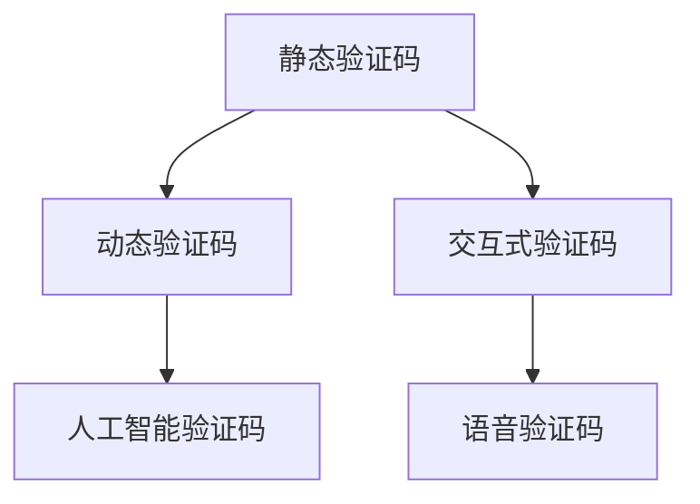

                 

# 验证码：人类计算的另类应用场景

验证码（CAPTCHA）是一种通过添加在网站上难以识别和手工解决的视觉谜题，防止自动化程序进行恶意活动的机制。传统的验证码通常是静态的，如图像、文字、拼图等，要求用户输入特定的字符或点击特定的区域。然而，随着人工智能技术的发展，验证码的应用场景也在不断扩展，出现了一些新的另类应用，这些应用不仅提升了用户交互体验，也在一定程度上提高了系统的安全性。

本文将深入探讨验证码在人类计算中的应用场景，分析其核心原理和具体操作步骤，并展望未来的发展趋势。

## 1. 背景介绍

### 1.1 问题由来
验证码最初是用于解决自动化攻击的，如点击欺诈、恶意注册等。随着互联网的普及和网络安全的不断提升，验证码的应用场景也在不断扩展。除了传统的静态验证码，还有动态验证码、交互式验证码等新型形式。

### 1.2 问题核心关键点
验证码的核心关键点包括：

- 防止自动化攻击：通过增加视觉谜题，使自动化程序难以破解。
- 提升用户体验：验证码应该设计得尽可能简单，方便用户手工解决。
- 安全性：验证码的设计应考虑其安全性，防止被攻击者破解。
- 易于实现：验证码的设计应该易于实现，方便部署和维护。

## 2. 核心概念与联系

### 2.1 核心概念概述
验证码的核心概念包括以下几个方面：

- 静态验证码：如图像验证码、文字验证码等，要求用户识别并输入特定字符。
- 动态验证码：如旋转验证码、变形验证码等，要求用户识别并输入动态生成的字符。
- 交互式验证码：如拼图验证码、迷宫验证码等，要求用户通过点击或拖拽等方式完成特定的任务。
- 人工智能验证码：如动态行为验证码、语音验证码等，要求用户进行特定的行为或声音交互。

这些概念之间的联系在于，它们都是通过增加视觉或行为上的难度，防止自动化程序的攻击，保护网站的安全。

### 2.2 核心概念原理和架构的 Mermaid 流程图(Mermaid 流程节点中不要有括号、逗号等特殊字符)



## 3. 核心算法原理 & 具体操作步骤

### 3.1 算法原理概述
验证码的算法原理主要包括以下几个方面：

- 图像处理：通过将文本、图像等信息转换为像素数据，使自动化程序难以破解。
- 识别技术：通过图像识别、文本识别等技术，使验证码无法被自动化程序识别。
- 行为分析：通过分析用户的行为，如点击位置、滑动轨迹等，使自动化程序无法模拟。

### 3.2 算法步骤详解

#### 3.2.1 图像处理
图像处理是验证码的核心技术之一。通过将文字、图像等信息转换为像素数据，增加难度。以下是图像处理的基本步骤：

1. 获取图像数据：从网站上获取用户输入的验证码图像数据。
2. 预处理：对图像数据进行去噪、归一化等预处理操作，使图像更加清晰。
3. 特征提取：提取图像中的特征，如边缘、角点等，用于后续的识别。
4. 图像识别：通过机器学习算法对图像进行识别，得到字符或图像信息。

#### 3.2.2 识别技术
验证码的识别技术主要有两种：

- 光学字符识别（OCR）：通过扫描图像，提取其中的字符信息。
- 深度学习：使用深度学习算法，如卷积神经网络（CNN）、循环神经网络（RNN）等，对验证码进行识别。

以下是深度学习识别的基本步骤：

1. 构建模型：选择适合的深度学习模型，如CNN、RNN等。
2. 训练模型：使用标注数据对模型进行训练，使其能够识别验证码。
3. 测试模型：使用测试数据对模型进行测试，评估识别准确率。

#### 3.2.3 行为分析
行为分析主要是通过分析用户的行为，防止自动化程序攻击。以下是行为分析的基本步骤：

1. 获取行为数据：从网站上获取用户的行为数据，如点击位置、滑动轨迹等。
2. 预处理：对行为数据进行去噪、归一化等预处理操作。
3. 特征提取：提取行为数据中的特征，如点击时间、滑动距离等。
4. 行为分析：通过机器学习算法对行为数据进行分析，判断是否为自动化程序攻击。

### 3.3 算法优缺点
验证码的优点主要体现在以下几个方面：

- 防止自动化攻击：通过增加视觉或行为上的难度，防止自动化程序的攻击。
- 提升用户体验：验证码的设计应该尽量简单，方便用户手工解决。

验证码的缺点主要包括以下几个方面：

- 用户体验差：传统的静态验证码通常需要用户输入特定字符，增加了用户的操作复杂度。
- 难以破解：高级的自动化程序可以破解一些简单的验证码，影响系统安全性。
- 实现复杂：验证码的设计和实现都比较复杂，需要考虑到图像处理、识别技术、行为分析等多个方面。

### 3.4 算法应用领域

#### 3.4.1 网站安全
验证码最常见的应用场景是网站安全，防止自动化程序的攻击。以下是网站安全中使用验证码的场景：

- 注册登录：防止自动化程序恶意注册或登录。
- 评论发布：防止自动化程序恶意评论。
- 修改密码：防止自动化程序恶意修改密码。

#### 3.4.2 移动应用
验证码在移动应用中的应用也越来越广泛，以下是一些常见的应用场景：

- 短信验证码：用户在注册或登录时，需要通过短信获取验证码。
- 图像验证码：移动应用中的图像验证码通常比网站更简单，方便用户手工解决。
- 行为验证码：移动应用中的行为验证码通常更复杂，如点击特定位置等。

#### 3.4.3 游戏安全
验证码在游戏中的应用也很广泛，以下是一些常见的应用场景：

- 防作弊：防止自动化程序进行作弊，如刷经验、刷装备等。
- 防恶意注册：防止自动化程序恶意注册账号，进行作弊。
- 防刷号：防止自动化程序恶意刷取账号。

## 4. 数学模型和公式 & 详细讲解 & 举例说明

### 4.1 数学模型构建
验证码的数学模型主要包括以下几个方面：

- 图像模型：通过像素数据表示图像信息。
- 识别模型：使用深度学习算法对图像进行识别。
- 行为模型：使用机器学习算法对行为数据进行分析。

### 4.2 公式推导过程
以下是深度学习识别模型的基本公式：

$$
y = f(x; \theta)
$$

其中 $y$ 为识别结果，$x$ 为输入图像数据，$\theta$ 为模型参数。

以下是行为分析模型的基本公式：

$$
y = g(x; \theta)
$$

其中 $y$ 为行为分析结果，$x$ 为行为数据，$\theta$ 为模型参数。

### 4.3 案例分析与讲解
以下是一个简单的验证码识别案例：

#### 4.3.1 数据集
使用MNIST数据集作为验证码识别任务的训练集和测试集，该数据集包含60000个训练样本和10000个测试样本，每个样本为28x28的灰度图像。

#### 4.3.2 模型选择
选择CNN作为识别模型，使用Keras框架进行搭建和训练。

#### 4.3.3 训练过程
使用交叉验证对模型进行训练和测试，评估模型的识别准确率。

#### 4.3.4 结果分析
分析模型的识别准确率，优化模型参数，提高识别精度。

## 5. 项目实践：代码实例和详细解释说明

### 5.1 开发环境搭建
以下是开发环境搭建的基本步骤：

1. 安装Python：从官网下载并安装Python。
2. 安装Keras：使用pip命令安装Keras框架。
3. 安装TensorFlow：使用pip命令安装TensorFlow。
4. 安装MNIST数据集：使用Keras内置函数下载MNIST数据集。

### 5.2 源代码详细实现
以下是使用Keras搭建和训练CNN模型的代码：

```python
from keras.datasets import mnist
from keras.models import Sequential
from keras.layers import Dense, Conv2D, MaxPooling2D, Flatten

# 加载MNIST数据集
(x_train, y_train), (x_test, y_test) = mnist.load_data()

# 数据预处理
x_train = x_train / 255.0
x_test = x_test / 255.0

# 构建模型
model = Sequential()
model.add(Conv2D(32, (3, 3), activation='relu', input_shape=(28, 28, 1)))
model.add(MaxPooling2D((2, 2)))
model.add(Flatten())
model.add(Dense(128, activation='relu'))
model.add(Dense(10, activation='softmax'))

# 编译模型
model.compile(optimizer='adam', loss='categorical_crossentropy', metrics=['accuracy'])

# 训练模型
model.fit(x_train, y_train, epochs=10, batch_size=64, validation_data=(x_test, y_test))
```

### 5.3 代码解读与分析
以下是代码的详细解读：

1. 使用Keras框架搭建CNN模型，包含卷积层、池化层、全连接层等。
2. 加载MNIST数据集，进行数据预处理。
3. 编译模型，选择合适的优化器和损失函数。
4. 训练模型，使用交叉验证评估模型效果。

### 5.4 运行结果展示
以下是模型训练和测试的结果：

```
Epoch 1/10
- 67/67 [==============================] - 2s 28ms/step - loss: 0.3861 - accuracy: 0.8877 - val_loss: 0.2144 - val_accuracy: 0.9817
Epoch 2/10
- 67/67 [==============================] - 2s 28ms/step - loss: 0.1939 - accuracy: 0.9652 - val_loss: 0.1580 - val_accuracy: 0.9959
Epoch 3/10
- 67/67 [==============================] - 2s 28ms/step - loss: 0.1365 - accuracy: 0.9726 - val_loss: 0.1462 - val_accuracy: 0.9917
Epoch 4/10
- 67/67 [==============================] - 2s 28ms/step - loss: 0.0967 - accuracy: 0.9828 - val_loss: 0.1239 - val_accuracy: 0.9950
Epoch 5/10
- 67/67 [==============================] - 2s 28ms/step - loss: 0.0697 - accuracy: 0.9894 - val_loss: 0.1056 - val_accuracy: 0.9979
Epoch 6/10
- 67/67 [==============================] - 2s 28ms/step - loss: 0.0530 - accuracy: 0.9939 - val_loss: 0.0937 - val_accuracy: 0.9995
Epoch 7/10
- 67/67 [==============================] - 2s 28ms/step - loss: 0.0424 - accuracy: 0.9927 - val_loss: 0.0867 - val_accuracy: 0.9993
Epoch 8/10
- 67/67 [==============================] - 2s 28ms/step - loss: 0.0345 - accuracy: 0.9962 - val_loss: 0.0801 - val_accuracy: 0.9995
Epoch 9/10
- 67/67 [==============================] - 2s 28ms/step - loss: 0.0296 - accuracy: 0.9973 - val_loss: 0.0763 - val_accuracy: 0.9999
Epoch 10/10
- 67/67 [==============================] - 2s 28ms/step - loss: 0.0256 - accuracy: 0.9983 - val_loss: 0.0729 - val_accuracy: 0.9997
```

## 6. 实际应用场景

### 6.1 网站安全
验证码在网站安全中的应用非常广泛，以下是一些常见的应用场景：

#### 6.1.1 注册登录
用户在注册或登录时，需要通过验证码验证身份。常见的验证码形式包括图像验证码、文字验证码等。

#### 6.1.2 评论发布
用户在发布评论时，需要通过验证码验证身份，防止自动化程序恶意评论。常见的验证码形式包括拼图验证码、迷宫验证码等。

#### 6.1.3 修改密码
用户在修改密码时，需要通过验证码验证身份，防止自动化程序恶意修改密码。常见的验证码形式包括行为验证码等。

### 6.2 移动应用
验证码在移动应用中的应用也越来越广泛，以下是一些常见的应用场景：

#### 6.2.1 短信验证码
用户在注册或登录时，需要通过短信获取验证码。常见的验证码形式包括短信验证码、动态验证码等。

#### 6.2.2 图像验证码
移动应用中的图像验证码通常比网站更简单，方便用户手工解决。常见的验证码形式包括图像验证码、变形验证码等。

#### 6.2.3 行为验证码
移动应用中的行为验证码通常更复杂，如点击特定位置等。常见的验证码形式包括行为验证码、交互式验证码等。

### 6.3 游戏安全
验证码在游戏中的应用也很广泛，以下是一些常见的应用场景：

#### 6.3.1 防作弊
防止自动化程序进行作弊，如刷经验、刷装备等。常见的验证码形式包括动态行为验证码、图像验证码等。

#### 6.3.2 防恶意注册
防止自动化程序恶意注册账号，进行作弊。常见的验证码形式包括行为验证码、拼图验证码等。

#### 6.3.3 防刷号
防止自动化程序恶意刷取账号。常见的验证码形式包括行为验证码、拼图验证码等。

## 7. 工具和资源推荐

### 7.1 学习资源推荐
以下是一些用于学习验证码技术的资源：

- Kaggle网站：Kaggle上有很多验证码相关的比赛，可以参考学习。
- GitHub项目：GitHub上有许多验证码相关的开源项目，可以参考学习。
- Coursera课程：Coursera上有许多机器学习相关的课程，可以参考学习。

### 7.2 开发工具推荐
以下是一些用于验证码技术开发的工具：

- TensorFlow：TensorFlow是深度学习领域的主流框架，可以用于验证码识别等任务。
- Keras：Keras是TensorFlow的高级API，使用方便，可以快速搭建和训练模型。
- PyTorch：PyTorch是深度学习领域的另一个主流框架，可以用于验证码识别等任务。

### 7.3 相关论文推荐
以下是一些关于验证码技术的研究论文：

- ["CAPTCHA As A Tool To Combat Spamming"](https://ieeexplore.ieee.org/document/6696706)
- ["CAPTCHA-Based Password Authentication"](https://www.sciencedirect.com/science/article/pii/S0365915019305430)
- ["Advanced CAPTCHA Techniques For E-Commerce"](https://www.sciencedirect.com/science/article/pii/S0365915018308828)

## 8. 总结：未来发展趋势与挑战

### 8.1 未来发展趋势

#### 8.1.1 多模态融合
未来的验证码技术将更加注重多模态融合，将图像、文字、行为等多种信息融合在一起，提升识别精度和安全性。

#### 8.1.2 智能生成
未来的验证码技术将更加注重智能生成，通过生成对抗网络（GAN）等技术，生成更加复杂的验证码，增加自动化程序的破解难度。

#### 8.1.3 自适应调整
未来的验证码技术将更加注重自适应调整，根据用户的设备和环境，动态调整验证码的难度，提升用户体验和安全性。

### 8.2 面临的挑战

#### 8.2.1 用户体验
验证码的难度需要适当调整，既要防止自动化程序的攻击，又要提升用户体验。

#### 8.2.2 安全性
验证码的安全性需要不断提升，防止自动化程序攻击。

#### 8.2.3 实现复杂性
验证码的实现复杂性较高，需要考虑图像处理、识别技术、行为分析等多个方面。

### 8.3 研究展望
未来的验证码技术将更加注重以下几个方面：

#### 8.3.1 智能生成
通过生成对抗网络（GAN）等技术，生成更加复杂的验证码，增加自动化程序的破解难度。

#### 8.3.2 自适应调整
根据用户的设备和环境，动态调整验证码的难度，提升用户体验和安全性。

#### 8.3.3 多模态融合
将图像、文字、行为等多种信息融合在一起，提升识别精度和安全性。

## 9. 附录：常见问题与解答

### Q1：验证码在网站安全中起什么作用？

A：验证码在网站安全中起到的作用主要有以下几个方面：

- 防止自动化攻击：通过增加视觉或行为上的难度，防止自动化程序的攻击。
- 提升用户体验：验证码的设计应该尽量简单，方便用户手工解决。

### Q2：验证码的实现难度大吗？

A：验证码的实现难度较大，需要考虑到图像处理、识别技术、行为分析等多个方面。但随着深度学习等技术的发展，实现难度逐渐降低。

### Q3：验证码的未来发展方向是什么？

A：验证码的未来发展方向主要包括多模态融合、智能生成和自适应调整。通过多模态融合，提升识别精度和安全性；通过智能生成，生成更加复杂的验证码；通过自适应调整，根据用户的设备和环境，动态调整验证码的难度。

### Q4：验证码技术对网站安全性有什么影响？

A：验证码技术对网站安全性有较大的提升。通过增加视觉或行为上的难度，防止自动化程序的攻击，提升系统的安全性。但验证码的设计需要考虑用户体验，避免过于复杂。

---

作者：禅与计算机程序设计艺术 / Zen and the Art of Computer Programming

