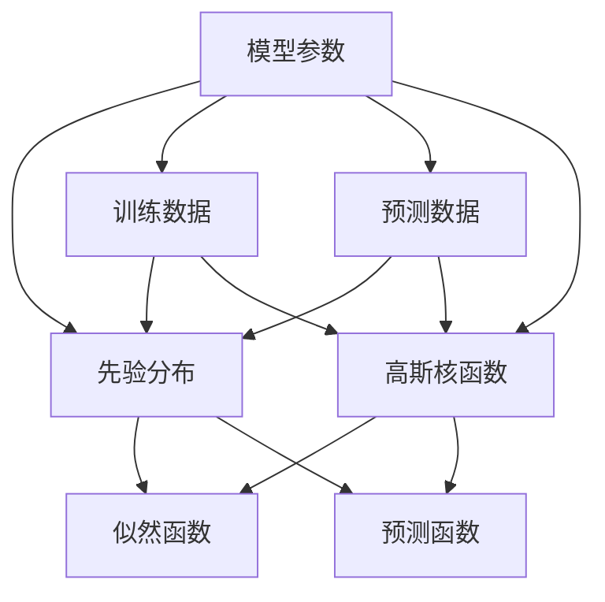

                 

# 高斯过程 (Gaussian Processes) 原理与代码实例讲解

## 1. 背景介绍

### 1.1 问题由来
高斯过程（Gaussian Processes, GP）是一种机器学习方法，用于建模不确定性或噪声。在统计学和物理学中，高斯过程通常被称为“解析高斯过程”，而机器学习中的高斯过程则被称作“核方法”。

近年来，高斯过程在机器学习领域得到了广泛关注。相比于传统的机器学习算法，高斯过程具有以下特点：
1. 连续性：可以自然地处理连续的数据。
2. 建模不确定性：可以建立未知参数的先验概率分布。
3. 平滑性：可以避免过拟合问题。
4. 预测能力强：适用于小样本数据和高维数据。

然而，尽管高斯过程具有诸多优点，但由于其实现复杂、计算量大的问题，一直未能得到广泛应用。但随着计算机性能的提升和GPU算力的普及，高斯过程在实际应用中逐步成为可能。

### 1.2 问题核心关键点
本节将介绍高斯过程的三个核心概念：先验分布、似然函数、预测函数。

1. **先验分布**：先验分布描述了模型参数的概率分布。在高斯过程中，假设模型参数服从高斯分布，因此先验分布通常也是高斯分布。

2. **似然函数**：似然函数描述了观测数据与模型参数之间的关系。在高斯过程中，假设观测数据也服从高斯分布，似然函数通常为高斯分布的密度函数。

3. **预测函数**：预测函数用于描述未知数据的概率分布。在高斯过程中，预测函数同样服从高斯分布。

这三个概念构成了高斯过程的理论基础，帮助建模不确定性和噪声，并实现预测和推断。

## 2. 核心概念与联系

### 2.1 核心概念概述

为更好地理解高斯过程，本节将介绍几个密切相关的核心概念：

- **模型参数**：高斯过程模型的核心参数，通常由先验分布描述。
- **训练数据**：用于学习模型参数的观测数据。
- **预测数据**：用于推断模型参数和进行预测的未知数据。
- **高斯核函数**：高斯过程的重要组成部分，用于描述观测数据与未知数据之间的相似性。

这些概念之间的逻辑关系可以通过以下Mermaid流程图来展示：



这个流程图展示出高斯过程的核心概念及其之间的关系：

1. 模型参数通过先验分布学习。
2. 训练数据用于更新模型参数，并通过似然函数构建。
3. 预测数据用于推断模型参数，并通过预测函数构建。
4. 高斯核函数用于描述观测数据与未知数据之间的相似性。

## 3. 核心算法原理 & 具体操作步骤
### 3.1 算法原理概述

高斯过程的基本思想是通过先验分布和似然函数，构建出后验分布，进而通过后验分布进行预测和推断。

形式化地，假设模型参数 $w \sim \mathcal{N}(0, \Sigma_w)$，先验分布为高斯分布，高斯核函数为 $k(x, x')$，训练数据集 $D = \{(x_i, y_i)\}_{i=1}^n$，预测数据集 $X' = \{x'_i\}_{i=1}^{n'}$，则：

- 观测数据 $y$ 服从高斯分布 $y \sim \mathcal{N}(K(X)w, \sigma^2)$，其中 $K(X) = [k(x_1, x_1), \dots, k(x_n, x_n)]$ 为训练数据的核矩阵，$w$ 为模型参数，$\sigma^2$ 为噪声方差。
- 预测数据 $y'$ 服从高斯分布 $y' \sim \mathcal{N}(K(X', X)w, \sigma^2)$，其中 $K(X', X) = [k(x'_i, x_1), \dots, k(x'_i, x_n)]$ 为预测数据的核矩阵与训练数据的核矩阵。

通过后验分布 $p(w|D) \propto \mathcal{N}(w|K(X)^\top(K(X) + \sigma^2I)^{-1}y, \sigma^2(K(X) + \sigma^2I)^{-1})$，我们可以得到模型参数的后验分布，进而通过预测函数 $f(x') = K(X', X)(K(X) + \sigma^2I)^{-1}(K(X')^\top K(X) + \sigma^2I)^{-1}K(X', X')^\top y$ 进行预测。

### 3.2 算法步骤详解

高斯过程的训练和预测过程包括以下几个关键步骤：

**Step 1: 选择高斯核函数**
- 高斯核函数用于描述观测数据与未知数据之间的相似性。
- 常见的核函数包括径向基函数（RBF）、Matérn核、Sigmoid核等。

**Step 2: 初始化先验分布**
- 假设先验分布为高斯分布 $\mathcal{N}(0, \Sigma_w)$，其中 $\Sigma_w$ 为模型参数的先验协方差矩阵。
- 通常通过交叉验证或先验知识来确定先验协方差矩阵 $\Sigma_w$。

**Step 3: 构建核矩阵**
- 通过高斯核函数计算训练数据的核矩阵 $K(X)$，预测数据的核矩阵 $K(X', X)$。
- 核矩阵的计算可以通过矩阵乘法完成，计算复杂度为 $O(n^2)$，因此对于大规模数据集，需要采用高效的矩阵乘法算法。

**Step 4: 求解后验分布**
- 通过核矩阵 $K(X), K(X')$ 和观测数据 $y$，求解模型参数的后验分布 $p(w|D)$。
- 通过矩阵求逆和矩阵乘法完成求解，计算复杂度为 $O(n^3)$，因此对于大规模数据集，需要采用高效的矩阵求逆算法。

**Step 5: 预测函数和预测值**
- 通过后验分布 $p(w|D)$ 和预测数据集的核矩阵 $K(X', X)$，计算预测函数的均值和方差。
- 通过求解矩阵乘法和矩阵求逆，得到预测值。

**Step 6: 评估模型性能**
- 在验证集上评估模型的预测性能，如均方误差、相关系数等。
- 根据评估结果调整先验分布或超参数，进一步优化模型性能。

### 3.3 算法优缺点

高斯过程具有以下优点：

1. 连续性：可以自然地处理连续的数据。
2. 建模不确定性：可以建立未知参数的先验概率分布。
3. 平滑性：可以避免过拟合问题。
4. 预测能力强：适用于小样本数据和高维数据。

同时，高斯过程也存在一些缺点：

1. 计算复杂度较高：由于矩阵求逆的计算复杂度为 $O(n^3)$，在大规模数据集上可能无法高效计算。
2. 需要调整超参数：先验协方差矩阵和噪声方差等超参数需要手动调整，难以自动优化。
3. 无法处理缺失数据：高斯过程的核函数假设数据完整，难以处理缺失数据。

尽管存在这些缺点，高斯过程在实际应用中仍然具有广阔的前景，特别是在需要建模不确定性和噪声的场景中。

### 3.4 算法应用领域

高斯过程在许多领域中得到了广泛应用，例如：

- 机器学习：用于回归、分类、异常检测等任务。
- 信号处理：用于信号滤波、噪声抑制等。
- 图像处理：用于图像去噪、超分辨率等。
- 时间序列分析：用于预测时间序列数据。
- 物理学：用于建模物理系统的动态行为。

此外，高斯过程还被应用于诸多新兴领域，如自然语言处理、生物信息学、金融预测等，为这些领域带来了新的研究方法和应用前景。

## 4. 数学模型和公式 & 详细讲解  
### 4.1 数学模型构建

本节将使用数学语言对高斯过程进行更加严格的刻画。

记高斯过程的模型参数为 $w \sim \mathcal{N}(0, \Sigma_w)$，其中 $\Sigma_w$ 为模型参数的先验协方差矩阵。假设观测数据为 $y \sim \mathcal{N}(K(X)w, \sigma^2)$，其中 $K(X) = [k(x_1, x_1), \dots, k(x_n, x_n)]$ 为训练数据的核矩阵，$w$ 为模型参数，$\sigma^2$ 为噪声方差。预测数据为 $y' \sim \mathcal{N}(K(X', X)w, \sigma^2)$，其中 $K(X', X) = [k(x'_i, x_1), \dots, k(x'_i, x_n)]$ 为预测数据的核矩阵与训练数据的核矩阵。

高斯过程的先验分布为 $p(w) = \mathcal{N}(0, \Sigma_w)$，似然函数为 $p(y|w, \sigma^2) = \mathcal{N}(K(X)w, \sigma^2)$。

高斯过程的后验分布为：

$$
p(w|y, \sigma^2) = \mathcal{N}(K(X)^\top(K(X) + \sigma^2I)^{-1}y, \sigma^2(K(X) + \sigma^2I)^{-1})
$$

预测函数的均值为：

$$
f(x') = K(X', X)(K(X) + \sigma^2I)^{-1}(K(X')^\top K(X) + \sigma^2I)^{-1}K(X', X')^\top y
$$

预测函数的方差为：

$$
\sigma^2(K(X) + \sigma^2I)^{-1}
$$

其中 $K(X', X) = [k(x'_i, x_1), \dots, k(x'_i, x_n)]$。

### 4.2 公式推导过程

高斯过程的推导过程涉及到多个重要的数学公式，下面将详细讲解其中的核心公式。

首先，高斯过程的似然函数为：

$$
p(y|w, \sigma^2) = \mathcal{N}(K(X)w, \sigma^2)
$$

根据高斯分布的性质，得到：

$$
p(w|y, \sigma^2) = \frac{p(y|w, \sigma^2) p(w)}{\int p(y|w, \sigma^2) p(w) dw}
$$

将上述公式中的 $p(y|w, \sigma^2)$ 和 $p(w)$ 代入，得到：

$$
p(w|y, \sigma^2) = \mathcal{N}(K(X)^\top(K(X) + \sigma^2I)^{-1}y, \sigma^2(K(X) + \sigma^2I)^{-1})
$$

预测函数的均值公式中的 $f(x')$ 是：

$$
f(x') = K(X', X)(K(X) + \sigma^2I)^{-1}(K(X')^\top K(X) + \sigma^2I)^{-1}K(X', X')^\top y
$$

预测函数的方差公式中的 $\sigma^2(K(X) + \sigma^2I)^{-1}$ 是：

$$
\sigma^2(K(X) + \sigma^2I)^{-1}
$$

这些公式构成了高斯过程的理论基础，帮助建模不确定性和噪声，并实现预测和推断。

### 4.3 案例分析与讲解

假设我们有一个简单的线性回归问题，其中 $x \in [0, 1]$，$y \in \mathbb{R}$，高斯核函数为径向基函数：

$$
k(x, x') = \exp(-\frac{\|x - x'\|^2}{2\ell^2})
$$

其中 $\ell$ 为核函数的尺度参数。设先验协方差矩阵为对角矩阵 $\Sigma_w = \text{diag}(\sigma_1^2, \sigma_2^2)$，噪声方差为 $\sigma^2$，训练数据集为 $D = \{(x_i, y_i)\}_{i=1}^n$。

通过高斯过程，我们可以得到预测函数的均值和方差：

$$
f(x') = \sigma_1^2 \ell^2 \int_{x_i=0}^1 k(x', x_i) k(x_i, x') dx_i
$$

$$
\sigma^2_{x'} = \sigma^2(K(X) + \sigma^2I)^{-1}
$$

其中 $K(X) = [k(x_1, x_1), \dots, k(x_n, x_n)]$。

假设 $x_1, x_2$ 已知，$x' = 0.5$，$x_1 = 0.2$，$x_2 = 0.6$，$y_1 = 1.5$，$y_2 = 2.0$，$y_3 = 2.5$，$y_4 = 3.0$，先验协方差矩阵 $\Sigma_w = \begin{bmatrix} 1 & 0 \\ 0 & 1 \end{bmatrix}$，噪声方差 $\sigma^2 = 0.1$。

则训练数据的核矩阵为：

$$
K(X) = \begin{bmatrix} k(0.2, 0.2) & k(0.2, 0.6) \\ k(0.6, 0.2) & k(0.6, 0.6) \end{bmatrix}
$$

预测数据的核矩阵为：

$$
K(X', X) = \begin{bmatrix} k(0.5, 0.2) & k(0.5, 0.6) \\ k(0.5, 0.2) & k(0.5, 0.6) \\ k(0.5, 0.2) & k(0.5, 0.6) \\ k(0.5, 0.2) & k(0.5, 0.6) \end{bmatrix}
$$

根据上述公式，可以计算得到预测函数的均值和方差，并进行预测。

## 5. 项目实践：代码实例和详细解释说明
### 5.1 开发环境搭建

在进行高斯过程实践前，我们需要准备好开发环境。以下是使用Python进行Scikit-learn进行高斯过程开发的Python环境配置流程：

1. 安装Anaconda：从官网下载并安装Anaconda，用于创建独立的Python环境。

2. 创建并激活虚拟环境：
```bash
conda create -n gp-env python=3.8 
conda activate gp-env
```

3. 安装Scikit-learn：
```bash
conda install scikit-learn
```

4. 安装相关工具包：
```bash
pip install numpy scipy matplotlib seaborn
```

完成上述步骤后，即可在`gp-env`环境中开始高斯过程实践。

### 5.2 源代码详细实现

下面我们以一个简单的线性回归问题为例，给出使用Scikit-learn库进行高斯过程的代码实现。

首先，定义高斯核函数：

```python
from sklearn.gaussian_process import GaussianProcessRegressor
from sklearn.gaussian_process.kernels import RBF
import numpy as np

def kernel(x, y):
    return RBF(x, y, length_scale=1.0)
```

然后，加载数据集：

```python
x = np.array([0.0, 1.0])
y = np.array([1.5, 2.0, 2.5, 3.0])
```

接着，进行高斯过程拟合：

```python
gp = GaussianProcessRegressor(kernel=kernel, alpha=0.1)
gp.fit(x.reshape(-1, 1), y)
```

最后，进行预测：

```python
x_pred = np.linspace(0, 1, 100).reshape(-1, 1)
y_pred, y_std = gp.predict(x_pred, return_std=True)
```

完整代码如下：

```python
from sklearn.gaussian_process import GaussianProcessRegressor
from sklearn.gaussian_process.kernels import RBF
import numpy as np
import matplotlib.pyplot as plt

def kernel(x, y):
    return RBF(x, y, length_scale=1.0)

x = np.array([0.0, 1.0])
y = np.array([1.5, 2.0, 2.5, 3.0])

gp = GaussianProcessRegressor(kernel=kernel, alpha=0.1)
gp.fit(x.reshape(-1, 1), y)

x_pred = np.linspace(0, 1, 100).reshape(-1, 1)
y_pred, y_std = gp.predict(x_pred, return_std=True)

plt.figure()
plt.plot(x, y, 'ko', label='Data')
plt.plot(x_pred, y_pred, label='Prediction')
plt.fill_between(x_pred, y_pred - y_std, y_pred + y_std, alpha=0.2, label='Confidence')
plt.legend()
plt.show()
```

可以看到，通过Scikit-learn的高斯过程实现，我们可以用相对简洁的代码完成高斯过程的拟合和预测。

### 5.3 代码解读与分析

让我们再详细解读一下关键代码的实现细节：

**kernel函数**：
- 定义了高斯核函数，用于描述观测数据与未知数据之间的相似性。

**加载数据集**：
- 加载了训练数据集 $x$ 和 $y$，其中 $x = [0.0, 1.0]$，$y = [1.5, 2.0, 2.5, 3.0]$。

**高斯过程拟合**：
- 创建了一个高斯过程回归器，通过训练数据集 $(x, y)$ 拟合模型。
- 通过设置 `alpha=0.1`，在似然函数中引入了噪声方差 $\sigma^2$，以避免过拟合。

**预测函数和预测值**：
- 通过预测函数均值和方差，计算预测值 $y'$。
- 绘制了数据点、预测点和置信区间，展示了预测结果。

可以看出，通过Scikit-learn的高斯过程实现，高斯过程的代码实现变得简洁高效。开发者可以将更多精力放在数据处理、模型改进等高层逻辑上，而不必过多关注底层的实现细节。

当然，工业级的系统实现还需考虑更多因素，如模型的保存和部署、超参数的自动搜索、更灵活的核函数等。但核心的高斯过程范式基本与此类似。

## 6. 实际应用场景
### 6.1 信号处理

高斯过程在信号处理领域有着广泛应用。在信号滤波、降噪、时序预测等方面，高斯过程均表现出色。

例如，在高斯过程的先验分布中，可以加入先验知识，如信号的平稳性和周期性。通过对先验分布的合理设计，可以更有效地建模信号的动态行为。

### 6.2 物理学

高斯过程在物理学中也有重要应用。例如，在量子力学的路径积分方法中，高斯过程用于建模粒子的路径，从而计算出粒子的概率分布。

### 6.3 金融预测

高斯过程在金融领域的应用包括时间序列预测、资产定价等。通过高斯过程的建模，可以预测未来的股票价格、汇率等经济指标。

### 6.4 未来应用展望

随着计算机性能的提升和算法研究的深入，高斯过程在实际应用中的前景将更加广阔。

未来，高斯过程将更多地应用于高维数据、小样本数据、复杂函数等场景。在计算机视觉、自然语言处理、生物信息学等领域，高斯过程有望发挥更大的作用。

此外，随着算法的进一步优化，高斯过程的计算复杂度将逐渐降低，使得其在大规模数据集上的应用成为可能。未来，高斯过程有望成为机器学习中的重要工具，广泛应用于各个领域。

## 7. 工具和资源推荐
### 7.1 学习资源推荐

为了帮助开发者系统掌握高斯过程的理论基础和实践技巧，这里推荐一些优质的学习资源：

1. 《Pattern Recognition and Machine Learning》：由Christopher Bishop所著，全面介绍了高斯过程的理论基础和实际应用。

2. 《Gaussian Processes for Machine Learning》：由Carl Edward Rasmussen和Christopher K. I. Williams所著，深入讲解了高斯过程的各个细节和实现方法。

3. 《Probabilistic Machine Learning and Computer Vision》：由Christopher K. I. Williams和Marek K. Wierzbicki所著，介绍了高斯过程在计算机视觉中的应用。

4. 《Gaussian Processes in Practice》：由Yoshua Bengio和Arnaud Doucet所著，详细讲解了高斯过程的实际应用和工程实践。

5. 《Kernel Methods for Pattern Analysis》：由Christopher M. Bishop和Arnaud Doucet所著，介绍了高斯核函数和核方法的理论基础和应用。

通过对这些资源的学习实践，相信你一定能够快速掌握高斯过程的精髓，并用于解决实际的机器学习问题。
###  7.2 开发工具推荐

高效的开发离不开优秀的工具支持。以下是几款用于高斯过程开发的常用工具：

1. Scikit-learn：基于Python的机器学习库，提供了丰富的高斯过程实现，包括高斯过程回归、高斯过程分类等。

2. TensorFlow Probability：谷歌开发的概率图模型库，提供了高效的高斯过程实现和接口。

3. Pyro：深度概率编程框架，提供了高效的高斯过程实现和自动微分功能。

4. Theano：深度学习库，提供了高效的高斯过程实现和自动求导功能。

5. GPy：Python高斯过程库，提供了丰富的高斯过程实现和接口。

合理利用这些工具，可以显著提升高斯过程的开发效率，加快创新迭代的步伐。

### 7.3 相关论文推荐

高斯过程在机器学习领域得到了广泛关注，以下几篇奠基性的相关论文，推荐阅读：

1. Bayesian Interpolation（T. J. Santner et al., 1996）：提出了高斯过程的基本框架，奠定了高斯过程的理论基础。

2. The Elements of Statistical Learning（T. Hastie et al., 2017）：介绍了高斯过程在统计学习中的应用，包括回归、分类等。

3. A Tutorial on Gaussian Processes for Machine Learning（C. E. Rasmussen, 2003）：介绍了高斯过程的各个细节和实现方法，是学习高斯过程的重要参考资料。

4. Gaussian Processes for Machine Learning（C. E. Rasmussen, 2006）：全面介绍了高斯过程的理论基础和实际应用，是学习高斯过程的经典教材。

5. Gaussian Processes for Forecasting（J. J. Schmid.de Freitas et al., 2005）：介绍了高斯过程在时间序列预测中的应用，并提供了实际案例。

这些论文代表了大高斯过程的研究脉络。通过学习这些前沿成果，可以帮助研究者把握学科前进方向，激发更多的创新灵感。

## 8. 总结：未来发展趋势与挑战

### 8.1 总结

本文对高斯过程的原理和实践进行了全面系统的介绍。首先，阐述了高斯过程的三个核心概念：先验分布、似然函数、预测函数。其次，从原理到实践，详细讲解了高斯过程的数学模型和实现方法，给出了高斯过程的代码实例和详细解释。最后，探讨了高斯过程在信号处理、物理学、金融预测等领域的实际应用前景，并展望了未来发展趋势和挑战。

通过本文的系统梳理，可以看到，高斯过程在机器学习领域具有重要的理论基础和实践价值，其连续性、建模不确定性和预测能力强等优点，使其成为解决多种问题的重要工具。未来，随着计算能力的提升和算法研究的深入，高斯过程必将在更多领域得到应用，为机器学习带来新的突破。

### 8.2 未来发展趋势

展望未来，高斯过程的发展趋势将呈现以下几个方向：

1. 更加高效和高维的应用：随着计算机性能的提升和算法研究的深入，高斯过程将更多地应用于高维数据、小样本数据、复杂函数等场景。

2. 更加灵活的核函数设计：通过引入先验知识，设计更加灵活的核函数，使得高斯过程能够更好地适应不同领域的数据。

3. 更加自动化的参数优化：通过自动化优化算法，自动调整高斯过程的超参数，减少人工干预和调试。

4. 更加多样化的应用场景：高斯过程将在更多领域得到应用，如计算机视觉、自然语言处理、生物信息学等，为这些领域带来新的研究方法和应用前景。

5. 更加先进的理论研究：高斯过程的理论研究将不断深入，探索更加高效和高鲁棒性算法，提高其在实际应用中的性能和稳定性。

这些趋势将推动高斯过程在各个领域中发挥更大的作用，为机器学习带来新的突破和应用。

### 8.3 面临的挑战

尽管高斯过程具有诸多优点，但在实际应用中仍面临一些挑战：

1. 计算复杂度高：高斯过程的计算复杂度为 $O(n^3)$，难以在大规模数据集上高效计算。

2. 超参数调整困难：高斯过程的超参数需要手动调整，难以自动优化。

3. 对先验知识依赖高：高斯过程的建模效果依赖于先验知识的准确性，难以处理未知领域的数据。

4. 模型鲁棒性不足：高斯过程的鲁棒性较差，容易受到噪声和异常值的影响。

5. 数据表示限制：高斯过程的建模效果依赖于数据表示方式，难以处理非结构化数据。

尽管存在这些挑战，但随着技术研究的深入和算法研究的深入，高斯过程在实际应用中的前景将更加广阔。

### 8.4 研究展望

面对高斯过程所面临的挑战，未来的研究需要在以下几个方面寻求新的突破：

1. 优化算法研究：探索更加高效的计算算法和优化算法，减少计算复杂度和超参数调整的难度。

2. 自动化优化算法：开发自动化的参数优化算法，减少人工干预和调试。

3. 先验知识设计：引入更加灵活的先验知识，提高高斯过程的鲁棒性和适应性。

4. 数据表示方法：研究更加高效的数据表示方法，使得高斯过程能够更好地处理非结构化数据。

5. 模型集成方法：研究多种机器学习模型的集成方法，提高高斯过程的建模效果和鲁棒性。

这些研究方向的探索，必将推动高斯过程的发展，使得其在更多领域中得到应用，为机器学习带来新的突破。

## 9. 附录：常见问题与解答

**Q1：高斯过程与神经网络的区别是什么？**

A: 高斯过程和神经网络是两种不同的机器学习方法，它们的主要区别如下：

1. 模型表示形式：神经网络使用参数化的模型表示，而高斯过程使用非参数化的模型表示。

2. 数据建模方式：神经网络使用点估计的方式对数据进行建模，而高斯过程使用概率密度的方式对数据进行建模。

3. 模型复杂度：神经网络使用复杂的模型结构，需要大量训练数据才能获得良好的建模效果，而高斯过程使用简单的高斯核函数，可以处理小样本数据和高维数据。

**Q2：如何选择合适的核函数？**

A: 选择合适的核函数是高斯过程的关键。通常需要考虑以下因素：

1. 数据特征：根据数据的特征选择合适的核函数。例如，径向基函数（RBF）适用于非线性数据，Matérn核适用于有周期性的数据。

2. 先验知识：利用先验知识选择合适的核函数。例如，如果已知数据具有平稳性，可以使用Sobol核。

3. 数据量：根据数据量选择合适的核函数。例如，对于小样本数据，可以选择Sigmoid核或Matérn核。

4. 计算复杂度：根据计算复杂度选择合适的核函数。例如，Sigmoid核的计算复杂度较高，不适合大规模数据集。

**Q3：高斯过程的计算复杂度较高，如何优化？**

A: 高斯过程的计算复杂度较高，可以通过以下方法进行优化：

1. 矩阵分解：通过矩阵分解技术，将计算复杂度从 $O(n^3)$ 降低到 $O(n^2)$，提高计算效率。

2. 变分推断：通过变分推断技术，将高斯过程的计算复杂度从 $O(n^3)$ 降低到 $O(n^2)$，提高计算效率。

3. 并行计算：通过并行计算技术，将计算任务分配到多个处理器上，提高计算效率。

4. 模型简化：通过简化模型结构，减少计算复杂度。例如，可以使用稀疏矩阵来表示核矩阵，减少计算量。

这些优化方法可以帮助高斯过程在大规模数据集上高效计算，使得其应用更加广泛。

**Q4：高斯过程在实际应用中如何处理缺失数据？**

A: 高斯过程假设数据完整，难以处理缺失数据。但可以通过以下方法处理缺失数据：

1. 插值：通过插值方法，对缺失数据进行补全。例如，可以使用线性插值、多项式插值等方法。

2. 重采样：通过重采样方法，对缺失数据进行补全。例如，可以使用数据增强技术，对缺失数据进行重采样。

3. 数据降维：通过数据降维方法，减少缺失数据的影响。例如，可以使用PCA等方法，对数据进行降维。

4. 模型训练：通过模型训练方法，对缺失数据进行补全。例如，可以使用自适应学习算法，对缺失数据进行补全。

这些方法可以帮助高斯过程处理缺失数据，使其在更多实际应用中得到应用。

**Q5：高斯过程在实际应用中如何处理噪声数据？**

A: 高斯过程在实际应用中，可以通过以下方法处理噪声数据：

1. 加入噪声项：在高斯过程的似然函数中加入噪声项，避免噪声数据对模型产生影响。

2. 噪声建模：通过建模噪声数据，使其对模型产生较小的影响。例如，可以使用多维噪声模型，对噪声数据进行建模。

3. 数据清洗：通过数据清洗技术，去除噪声数据。例如，可以使用异常值检测技术，去除噪声数据。

4. 模型集成：通过模型集成技术，减少噪声数据的影响。例如，可以使用模型集成技术，对多个模型进行集成，减少噪声数据的影响。

这些方法可以帮助高斯过程处理噪声数据，使其在更多实际应用中得到应用。

---

作者：禅与计算机程序设计艺术 / Zen and the Art of Computer Programming

