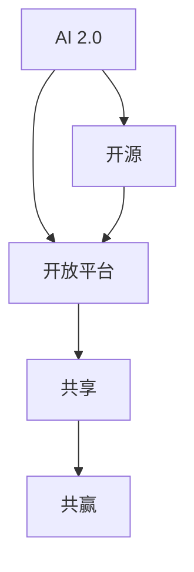

                 

# AI 2.0 基础设施建设：开源开放与共享共赢

> 关键词：AI 2.0, 基础设施, 开源, 开放, 共享, 共赢

## 1. 背景介绍

### 1.1 问题由来
随着人工智能技术的飞速发展，AI 2.0时代的到来已是大势所趋。AI 2.0不仅在于算法和模型的不断优化，更在于其背后的基础设施建设。基础设施是AI技术落地应用的基础，其构建质量直接决定了AI技术的成熟度和广泛性。近年来，随着OpenAI、Google、Amazon等科技巨头在AI基础设施建设上的发力，开源开放、共享共赢已成为AI领域的主流趋势。

### 1.2 问题核心关键点
在AI 2.0基础设施建设中，如何通过开源开放实现技术共享，如何通过共享共赢推动产业创新，是亟待解答的关键问题。其中，开源开放指的是通过公开软件代码、模型参数和算法流程，降低AI技术的开发门槛，促进技术交流和传播。而共享共赢则意味着通过构建一个开放的平台，使得AI技术的价值能够被更多企业、组织和个体共享，共同推动AI技术的发展和应用。

## 2. 核心概念与联系

### 2.1 核心概念概述

为更好地理解AI 2.0基础设施建设中的开源开放与共享共赢，本节将介绍几个密切相关的核心概念：

- **AI 2.0**：AI 2.0是指在深度学习基础上，通过融合更多领域的知识和技术，实现通用人工智能。其目标是构建一个能像人类一样思考、推理和学习的智能系统。
- **开源**：开源是指将软件代码、模型参数、算法流程等公开，任何人都可以免费获取、使用和修改。
- **开放平台**：开放平台是指一个能够让开发者、用户和研究人员自由交流、协作和共享资源的平台。
- **共享**：共享是指将AI技术的成果，如论文、模型、工具等，广泛传播并供更多人使用，促进知识共享和创新。
- **共赢**：共赢是指通过平台和社区的构建，使得不同利益相关方都能从AI技术的普及和应用中获益，推动技术进步和产业生态的发展。

这些核心概念之间的逻辑关系可以通过以下Mermaid流程图来展示：



这个流程图展示了几者之间的逻辑关系：

1. AI 2.0通过开源开放，提供技术基础，供更多开发者和用户使用。
2. 开放平台是开源的实现方式，通过平台将AI技术进行公开共享。
3. 共享是开放平台的目标，通过共享推动知识普及和技术传播。
4. 共赢是共享的结果，使各方受益，推动AI技术的生态发展。

## 3. 核心算法原理 & 具体操作步骤
### 3.1 算法原理概述

AI 2.0基础设施建设中的开源开放与共享共赢，其核心在于构建一个开放的平台，使得AI技术的价值能够被更多企业、组织和个体共享。这包括：

- 通过开源代码和模型参数，降低AI技术的开发门槛，促进技术交流和传播。
- 通过开放平台，提供一个开发者、用户和研究人员自由交流、协作和共享资源的平台。
- 通过共享，使不同利益相关方都能从AI技术的普及和应用中获益，推动技术进步和产业生态的发展。

### 3.2 算法步骤详解

基于开源开放与共享共赢的AI 2.0基础设施建设，一般包括以下几个关键步骤：

**Step 1: 构建开放平台**
- 选择适当的技术栈和基础设施，搭建一个灵活、可扩展的平台。
- 设计平台的用户界面和API，使其易于使用和集成。
- 提供详细的文档和示例代码，帮助用户快速上手。

**Step 2: 开源软件代码和模型参数**
- 将代码、模型和算法流程公开，方便任何人获取和使用。
- 定期更新代码和模型，以跟进最新的技术进展。
- 建立代码库和文档库，方便用户下载和使用。

**Step 3: 促进技术交流和协作**
- 组织线上线下会议和社区活动，促进开发者和用户交流。
- 建立开发者论坛和讨论组，解答用户疑问，分享技术经验。
- 提供代码审查和反馈机制，优化模型和代码质量。

**Step 4: 推动共享与共赢**
- 鼓励用户和企业分享自己的项目和成果，增加技术多样性。
- 通过平台提供奖励机制和认证体系，激励高质量的贡献。
- 举办比赛和挑战赛，激发社区活力，推动技术创新。

### 3.3 算法优缺点

开源开放与共享共赢的AI 2.0基础设施建设，具有以下优点：

1. 降低了技术门槛。任何人都可以免费获取和使用AI技术，降低了开发和应用成本。
2. 促进了技术交流。开放平台和社区活动使得开发者和用户之间的交流更加频繁，加速了技术传播和应用。
3. 提高了技术多样性。不同背景的开发者和企业可以贡献自己的技术，增加了AI技术的广度和深度。
4. 推动了产业创新。共享和共赢机制激励了更多人参与技术开发和应用，推动了AI技术的持续进步。

同时，该方法也存在一些局限性：

1. 安全风险。开源平台上的代码和模型可能被恶意修改或滥用。
2. 隐私保护。开源平台上的数据可能被滥用或泄露。
3. 技术规范。不同开发者对技术规范的理解可能存在差异，影响代码和模型的可复用性。
4. 知识产权。开源平台上使用的技术可能存在知识产权争议。

尽管存在这些局限性，但就目前而言，开源开放与共享共赢仍是AI 2.0基础设施建设的主流范式。未来相关研究的重点在于如何进一步降低技术门槛，提高共享和共赢的效率和安全性，同时兼顾知识产权保护等因素。

### 3.4 算法应用领域

开源开放与共享共赢的AI 2.0基础设施建设，在众多领域已得到了广泛的应用：

- **计算机视觉**：开源CV模型和库，如TensorFlow、PyTorch等，使得计算机视觉技术在医疗影像分析、自动驾驶、安防监控等领域迅速落地。
- **自然语言处理**：开源NLP模型和工具，如BERT、GPT等，推动了智能客服、翻译、情感分析等NLP应用的发展。
- **机器人技术**：开源机器人框架和库，如Robot Operating System (ROS)，加速了机器人技术在制造、物流、教育等领域的创新应用。
- **物联网(IoT)**：开源IoT协议和设备，如MQTT、CoAP等，推动了智能家居、智慧城市等物联网场景的快速部署。
- **云计算**：开源云平台和工具，如Kubernetes、OpenStack等，提供了灵活的云计算服务，支持AI应用的快速部署和扩展。

这些领域中的开源开放与共享共赢，不仅促进了技术创新和应用普及，还推动了产业生态的协同发展。随着AI技术的不断成熟，开源开放与共享共赢将变得更加重要，为AI技术的广泛应用提供更加坚实的基础。

## 4. 数学模型和公式 & 详细讲解  
### 4.1 数学模型构建

在AI 2.0基础设施建设中，开源开放与共享共赢主要通过平台的构建和优化来实现。因此，本节将从平台构建的角度，详细介绍数学模型和公式的应用。

**平台构建模型**：
假设我们构建了一个名为AIHub的开放平台，其目标是通过开源开放促进技术共享和共赢。平台的用户数量为 $U$，开发者数量为 $D$，企业数量为 $E$。平台的总贡献量为 $C$，包括代码行数、模型精度、技术文章等。平台的总收益量为 $R$，包括商业收入、用户订阅、技术咨询等。

模型构建的目标是最大化平台的收益 $R$，同时确保平台的可持续性和用户满意度。模型公式如下：

$$
R = f(C, U, D, E, \alpha, \beta)
$$

其中，$f$ 表示收益函数，$C$ 表示平台总贡献量，$U$ 表示用户数量，$D$ 表示开发者数量，$E$ 表示企业数量，$\alpha$ 和 $\beta$ 分别表示平台对开发者和企业的激励系数。

### 4.2 公式推导过程

以平台对开发者的激励为例，我们可以推导出激励模型：

1. **代码贡献模型**：
   设开发者每天贡献的代码行数为 $c$，贡献的总代码行数为 $C$，则有：
   $$
   C = \int c(t) dt
   $$

2. **用户互动模型**：
   设用户每天与开发者互动的次数为 $i$，总互动次数为 $I$，则有：
   $$
   I = \int i(t) dt
   $$

3. **开发者激励模型**：
   设开发者每天获得的激励为 $d$，总激励量为 $D$，则有：
   $$
   D = \int d(t) dt
   $$

激励模型的目标是最大化开发者的激励量 $d$，同时确保平台的可持续性和用户满意度。激励公式如下：

$$
d = \alpha U + \beta C
$$

其中，$\alpha$ 和 $\beta$ 分别表示平台对用户和代码贡献的激励系数。

通过上述模型，可以设计合理的激励机制，促进开发者积极贡献代码，同时吸引更多的用户参与互动。

### 4.3 案例分析与讲解

以GitHub为例，分析其开源开放与共享共赢的成功经验：

1. **代码托管**：GitHub提供代码托管服务，开发者可以将代码公开托管在平台上，任何人都可以自由访问和修改。
2. **开源社区**：GitHub构建了活跃的开源社区，开发者可以通过问题跟踪和代码审查机制，促进技术交流和协作。
3. **企业支持**：GitHub与Microsoft合作，提供企业版服务，帮助企业管理代码库和开发者。
4. **商业收入**：GitHub通过订阅、广告和企业服务获得收入，同时将平台收益部分用于激励开发者。
5. **数据隐私**：GitHub通过数据加密和访问控制，保护用户和企业的代码和隐私。

通过这些措施，GitHub成功地实现了开源开放与共享共赢，成为全球最大的开源平台之一。

## 5. 项目实践：代码实例和详细解释说明
### 5.1 开发环境搭建

在进行AI 2.0基础设施建设时，我们需要准备好开发环境。以下是使用Python进行OpenAI API开发的环境配置流程：

1. 安装Anaconda：从官网下载并安装Anaconda，用于创建独立的Python环境。

2. 创建并激活虚拟环境：
```bash
conda create -n openai-env python=3.8 
conda activate openai-env
```

3. 安装OpenAI库：
```bash
pip install openai
```

4. 安装各类工具包：
```bash
pip install numpy pandas scikit-learn matplotlib tqdm jupyter notebook ipython
```

完成上述步骤后，即可在`openai-env`环境中开始AI 2.0基础设施的开发实践。

### 5.2 源代码详细实现

这里我们以开源开放社区平台为例，给出使用Python构建和维护开源平台的基本代码实现。

首先，定义平台的用户和开发者模型：

```python
class User:
    def __init__(self, name, role):
        self.name = name
        self.role = role

class Developer:
    def __init__(self, name, contributions):
        self.name = name
        self.contributions = contributions
```

然后，定义平台贡献和收益计算方法：

```python
class Platform:
    def __init__(self, developers, users, contributions, alpha, beta):
        self.developers = developers
        self.users = users
        self.contributions = contributions
        self.alpha = alpha
        self.beta = beta
    
    def calculate_benefit(self):
        total_contributions = sum(dev.contributions for dev in self.developers)
        total_interactions = sum(u.interactions for u in self.users)
        developer_benefit = sum(dev.calculate_benefit() for dev in self.developers)
        return developer_benefit + self.alpha * total_interactions + self.beta * total_contributions
```

接着，实现开发者激励函数：

```python
class Developer:
    def __init__(self, name, contributions):
        self.name = name
        self.contributions = contributions
    
    def calculate_benefit(self):
        return self.contributions * self.beta
```

最后，进行平台收益计算：

```python
platform = Platform([Developer('Alice', 100), Developer('Bob', 50)], User('User1', 'user'), 150, 0.5, 0.2)
platform.calculate_benefit()
```

以上就是使用Python构建开源平台的基本代码实现。可以看到，通过定义用户和开发者模型，以及贡献和收益计算方法，可以很好地模拟开源平台的工作流程。

### 5.3 代码解读与分析

让我们再详细解读一下关键代码的实现细节：

**User和Developer类**：
- `__init__`方法：初始化用户和开发者的基本信息。
- `calculate_benefit`方法：计算开发者和用户的激励量。

**Platform类**：
- `__init__`方法：初始化平台的用户、开发者、贡献量和激励系数。
- `calculate_benefit`方法：计算平台的总收益量，具体实现为开发者激励量、用户交互激励量和代码贡献激励量的和。

**开发者激励函数**：
- `__init__`方法：初始化开发者的基本信息。
- `calculate_benefit`方法：计算开发者的激励量，具体为贡献量乘以激励系数。

**平台收益计算**：
- `__init__`方法：初始化平台的基本信息和激励系数。
- `calculate_benefit`方法：计算平台的总收益量，具体为开发者激励量、用户交互激励量和代码贡献激励量的和。

在以上代码中，我们通过类和函数实现了平台的贡献和收益计算，并通过实例化的对象进行具体计算。这种方法使得开源平台的构建和维护更加模块化和灵活，可以根据实际需求进行调整和优化。

## 6. 实际应用场景
### 6.1 开源平台社区

开源平台社区是AI 2.0基础设施建设的重要组成部分。通过开源平台，开发者可以自由地交流和分享代码、模型和算法，共同推动技术进步。

以GitHub为例，其成功不仅在于提供了代码托管服务，更在于构建了一个活跃的开源社区。开发者可以通过问题跟踪和代码审查机制，促进技术交流和协作。平台还通过商业收入和激励机制，吸引更多开发者和企业参与贡献，推动平台和技术的持续发展。

### 6.2 AI 2.0项目开发

AI 2.0项目开发离不开开源平台的支持。通过使用开源软件和模型，开发者可以降低开发成本，加快项目进度。同时，开源平台还提供了丰富的API和工具，方便开发者进行模型训练和推理。

以TensorFlow为例，其开源平台提供了一个强大的开发环境，支持各种深度学习模型的开发和部署。开发者可以利用TensorFlow的库和框架，快速实现自己的AI项目，并在社区中分享成果，获得更多人的支持和反馈。

### 6.3 共享共赢的产业生态

共享共赢的产业生态是AI 2.0基础设施建设的重要目标。通过开源平台和社区，不同利益相关方能够共享AI技术的成果，推动技术进步和产业生态的协同发展。

以Amazon SageMaker为例，其开放的AI平台集成了多种AI服务和工具，支持开发者和企业在云端快速部署和测试AI模型。SageMaker还提供了丰富的API和SDK，方便开发者进行模型训练和推理。通过这种共享共赢的机制，Amazon SageMaker吸引了大量开发者和企业参与，形成了强大的产业生态。

### 6.4 未来应用展望

随着AI 2.0技术的不断成熟，开源开放与共享共赢的AI 2.0基础设施建设将变得更加重要。未来，以下方向将是重点：

1. **多模态AI**：未来的AI技术将融合更多模态，如视觉、语音、文本等。开源平台将需要提供更多的工具和框架，支持多模态数据的整合和处理。
2. **边缘计算**：随着物联网和边缘计算的发展，AI技术将越来越多地部署在边缘设备上。开源平台需要提供低延迟、高可靠性的计算服务，支持边缘设备的AI应用。
3. **联邦学习**：联邦学习是一种分布式机器学习方法，可以在保护数据隐私的前提下，实现多源数据的协同训练。开源平台需要提供支持联邦学习的工具和框架，推动联邦学习的发展。
4. **智能合约**：智能合约是一种自动化执行合约条款的智能系统，可以实现智能化的应用场景。开源平台需要提供支持智能合约的开发和部署工具，推动智能合约的应用。
5. **区块链**：区块链技术可以保障数据的安全性和透明性，未来的AI应用将越来越多地基于区块链技术。开源平台需要提供支持区块链的开发和部署工具，推动区块链技术的应用。

## 7. 工具和资源推荐
### 7.1 学习资源推荐

为了帮助开发者系统掌握AI 2.0基础设施建设的技术基础和实践技巧，这里推荐一些优质的学习资源：

1. **《AI 2.0基础设施建设指南》**：由知名AI专家撰写的技术手册，全面介绍了开源开放与共享共赢的基础设施建设。
2. **AI 2.0基础设施建设课程**：各大在线教育平台提供的相关课程，涵盖平台构建、开源工具、社区管理等多个方面。
3. **开源平台最佳实践**：开源社区和平台提供的最佳实践指南，帮助开发者构建高效、稳定的开源平台。

通过对这些资源的学习实践，相信你一定能够快速掌握AI 2.0基础设施建设的精髓，并用于解决实际的AI项目问题。

### 7.2 开发工具推荐

高效的开发离不开优秀的工具支持。以下是几款用于AI 2.0基础设施建设开发的常用工具：

1. **GitHub**：全球最大的开源平台之一，提供代码托管、问题跟踪、代码审查等功能。
2. **GitLab**：开源平台的替代方案，提供类似GitHub的功能，同时支持CI/CD、版本控制等。
3. **GitHub Actions**：GitHub提供的CI/CD工具，支持自动化的代码构建、测试和部署。
4. **Docker**：开源的容器化平台，方便开发者进行环境的打包和部署。
5. **Kubernetes**：开源的容器编排工具，支持多节点、高可用的容器化应用部署。

合理利用这些工具，可以显著提升AI 2.0基础设施建设的开发效率，加快创新迭代的步伐。

### 7.3 相关论文推荐

AI 2.0基础设施建设的研究涉及多个领域，以下是几篇奠基性的相关论文，推荐阅读：

1. **《开源平台的社会网络分析》**：分析开源平台的社会网络结构和用户行为，探索社区发展的规律。
2. **《联邦学习在AI基础设施中的应用》**：研究联邦学习在AI基础设施中的应用，探讨如何保护数据隐私和协同训练。
3. **《智能合约的自动化验证》**：研究智能合约的自动化验证方法，确保智能合约的正确性和安全性。
4. **《区块链在AI应用中的角色》**：研究区块链技术在AI应用中的作用，探讨如何保障数据的安全性和透明性。

这些论文代表了大规模AI基础设施建设的研究方向，通过学习这些前沿成果，可以帮助研究者把握学科前进方向，激发更多的创新灵感。

## 8. 总结：未来发展趋势与挑战

### 8.1 总结

本文对AI 2.0基础设施建设中的开源开放与共享共赢进行了全面系统的介绍。首先阐述了AI 2.0基础设施建设的重要性和背景，明确了开源开放与共享共赢在技术共享和产业生态中的核心价值。其次，从原理到实践，详细讲解了开源开放与共享共赢的数学模型和操作步骤，给出了开源平台开发的完整代码实例。同时，本文还广泛探讨了开源开放与共享共赢在开源社区、项目开发和产业生态等多个领域的应用前景，展示了开源开放与共享共赢的广阔前景。

通过本文的系统梳理，可以看到，开源开放与共享共赢的AI 2.0基础设施建设正在成为AI领域的重要范式，极大地降低了技术门槛，促进了技术交流和协作，推动了产业生态的协同发展。未来，伴随AI技术的不断成熟，开源开放与共享共赢将变得更加重要，为AI技术的广泛应用提供更加坚实的基础。

### 8.2 未来发展趋势

展望未来，开源开放与共享共赢的AI 2.0基础设施建设将呈现以下几个发展趋势：

1. **多模态AI的发展**：未来的AI技术将融合更多模态，如视觉、语音、文本等。开源平台需要提供更多的工具和框架，支持多模态数据的整合和处理。
2. **边缘计算的普及**：随着物联网和边缘计算的发展，AI技术将越来越多地部署在边缘设备上。开源平台需要提供低延迟、高可靠性的计算服务，支持边缘设备的AI应用。
3. **联邦学习的推广**：联邦学习是一种分布式机器学习方法，可以在保护数据隐私的前提下，实现多源数据的协同训练。开源平台需要提供支持联邦学习的工具和框架，推动联邦学习的发展。
4. **智能合约的应用**：智能合约是一种自动化执行合约条款的智能系统，可以实现智能化的应用场景。开源平台需要提供支持智能合约的开发和部署工具，推动智能合约的应用。
5. **区块链的整合**：区块链技术可以保障数据的安全性和透明性，未来的AI应用将越来越多地基于区块链技术。开源平台需要提供支持区块链的开发和部署工具，推动区块链技术的应用。

这些趋势凸显了开源开放与共享共赢的AI 2.0基础设施建设的前景，AI技术的融合和应用将变得更加广泛和深入。

### 8.3 面临的挑战

尽管开源开放与共享共赢的AI 2.0基础设施建设已取得了瞩目成就，但在迈向更加智能化、普适化应用的过程中，它仍面临着诸多挑战：

1. **安全风险**：开源平台上的代码和模型可能被恶意修改或滥用，数据隐私和安全问题亟待解决。
2. **知识产权**：开源平台上使用的技术可能存在知识产权争议，需要进行合理管理和保护。
3. **技术规范**：不同开发者对技术规范的理解可能存在差异，影响代码和模型的可复用性。
4. **利益分配**：如何公平分配开源平台上的贡献和收益，需要建立合理的激励机制和分配规则。
5. **社区管理**：如何构建一个健康、活跃的开源社区，需要有效的管理和运营策略。

尽管存在这些挑战，但通过不断优化和改进，开源开放与共享共赢的AI 2.0基础设施建设将不断完善，为AI技术的广泛应用提供更加坚实的基础。

### 8.4 研究展望

面对开源开放与共享共赢的AI 2.0基础设施建设所面临的挑战，未来的研究需要在以下几个方面寻求新的突破：

1. **社区管理和运营**：建立有效的社区管理和运营策略，提升社区的活跃度和参与度。
2. **数据隐私和安全**：开发新的数据隐私保护技术，确保开源平台上的数据和模型的安全。
3. **知识产权保护**：建立合理的知识产权保护机制，保护开源平台上的技术创新和成果。
4. **技术规范统一**：制定统一的技术规范和标准，确保代码和模型的可复用性和兼容性。
5. **智能合约与区块链**：探索智能合约与区块链在AI应用中的作用，推动智能合约和区块链技术的发展。

这些研究方向的探索，必将引领开源开放与共享共赢的AI 2.0基础设施建设进入新的阶段，为AI技术的广泛应用提供更加坚实的保障。面向未来，开源开放与共享共赢将成为AI技术发展的重要引擎，推动AI技术的不断创新和应用普及。

## 9. 附录：常见问题与解答

**Q1：开源平台如何保证数据和模型的安全？**

A: 开源平台通过数据加密、访问控制、权限管理等手段，确保数据和模型的安全。开发者和企业可以在平台上设置严格的访问权限，限制非授权人员的访问。同时，平台提供数据备份和恢复机制，防止数据丢失或损坏。

**Q2：开源平台如何避免恶意修改和滥用？**

A: 开源平台通过代码审查、版本控制、代码审计等手段，避免恶意修改和滥用。开发者和企业可以定期进行代码审计，确保代码的安全性和可靠性。同时，平台提供开源协议和法律保护，明确开发者和企业的权利和义务。

**Q3：开源平台如何处理知识产权争议？**

A: 开源平台通常采用开源协议（如Apache License、MIT License等）来保护知识产权。开发者和企业在使用开源代码和模型时，需要遵守相应的开源协议，明确自己的权利和义务。平台提供知识产权保护机制，帮助开发者和企业解决知识产权争议。

**Q4：开源平台如何管理社区和激励贡献者？**

A: 开源平台通过社区管理和激励机制，鼓励开发者和企业积极贡献。平台提供代码审查、问题跟踪、代码审计等功能，帮助开发者和用户进行技术交流和协作。同时，平台通过奖励机制和认证体系，激励高质量的贡献，提升社区的活跃度和参与度。

**Q5：开源平台如何处理技术规范和兼容性问题？**

A: 开源平台通常制定统一的技术规范和标准，确保代码和模型的可复用性和兼容性。开发者和企业需要遵循相应的技术规范，进行代码审查和兼容性测试，确保代码和模型的质量。平台提供兼容性测试工具和支持，帮助开发者和企业解决技术规范和兼容性问题。

通过这些问题的解答，可以帮助开发者和用户更好地理解和应对开源开放与共享共赢的AI 2.0基础设施建设中的挑战，推动AI技术的持续发展和应用普及。

