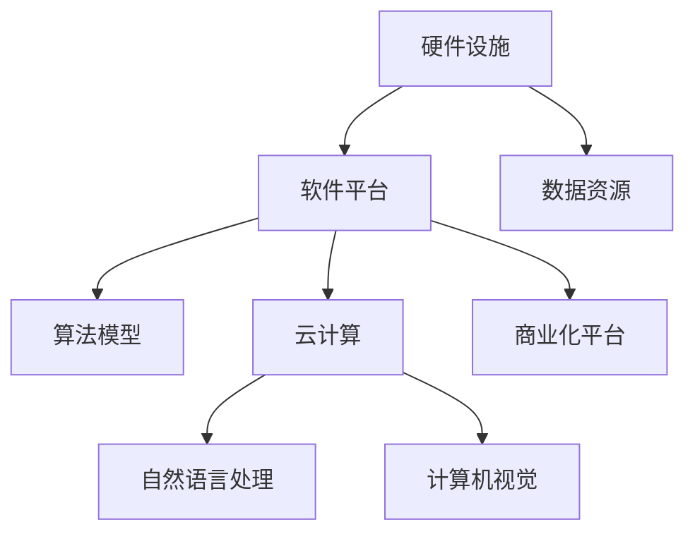

                 

# AI 2.0 基础设施建设：投资回报与商业模式

## 1. 背景介绍

随着人工智能技术的迅猛发展，AI 2.0 时代已经到来。与上一代人工智能不同，AI 2.0 不再局限于单一的算法或模型，而是构建在广泛的基础设施之上，包括高性能计算、大数据、云计算、自然语言处理、计算机视觉等众多领域。AI 2.0 强调从数据、算法、平台到应用的一体化建设，为各行各业带来了革命性的变化。

然而，AI 2.0 基础设施的建设并非一蹴而就，需要大量的投资和资源。同时，AI 2.0 的商业模式也正处于探索阶段，如何在投资回报和商业可持续性之间找到平衡，是当前亟待解决的问题。本文将从基础设施建设和商业模式的视角，探讨 AI 2.0 的建设与商业化。

## 2. 核心概念与联系

### 2.1 核心概念概述

AI 2.0 基础设施包括硬件设施、软件平台、数据资源、算法模型等多方面内容，这些内容共同构成了 AI 2.0 的生态系统。以下是核心概念的概述：

- **硬件设施**：指高性能计算设备，如 GPU、TPU、FPGA 等，提供计算能力支撑。
- **软件平台**：包括操作系统、中间件、编程框架等，提供软件环境支持。
- **数据资源**：涵盖各类数据集，如图像、文本、语音等，是 AI 2.0 的重要原材料。
- **算法模型**：基于深度学习等技术构建的算法和模型，是 AI 2.0 的核心。
- **云计算**：提供弹性计算和存储资源，支持大规模分布式训练。
- **自然语言处理**：使机器具备理解和生成自然语言的能力。
- **计算机视觉**：使机器具备视觉感知和理解能力。
- **商业化平台**：如 AIaaS（AI as a Service）、DataaaS（Data as a Service）等，提供 AI 技术的服务化能力。

这些核心概念之间的逻辑关系可以通过以下 Mermaid 流程图来展示：



这个流程图展示了大语言模型的核心概念及其之间的关系：

1. 硬件设施提供计算能力，支持软件平台和算法模型的运行。
2. 软件平台提供环境和工具，使数据资源和算法模型得以整合和应用。
3. 数据资源是算法的输入，算法模型是处理数据的手段。
4. 云计算提供弹性资源，支持大规模训练和部署。
5. 自然语言处理和计算机视觉为机器提供理解和感知能力。
6. 商业化平台提供服务化能力，使 AI 技术更容易被各行各业所采用。

这些概念共同构成了 AI 2.0 的生态系统，为 AI 技术的落地应用提供了坚实的基础。

## 3. 核心算法原理 & 具体操作步骤
### 3.1 算法原理概述

AI 2.0 的基础设施建设基于一系列的算法和模型，其中深度学习是最核心的一部分。深度学习通过多层次的神经网络结构，对大量数据进行训练，提取高层次的特征表示，从而实现自动化的决策和预测。以下是对深度学习原理的简要概述：

- **神经网络**：由多个层次组成的非线性网络，每一层负责提取不同层次的特征。
- **损失函数**：用于衡量模型输出与真实标签之间的差异，常用的有均方误差、交叉熵等。
- **优化算法**：如梯度下降、Adam、Adagrad 等，用于更新模型参数以最小化损失函数。
- **正则化**：如 L2 正则、Dropout 等，防止过拟合。

### 3.2 算法步骤详解

AI 2.0 基础设施建设通常包括以下关键步骤：

**Step 1: 数据准备**
- 收集、清洗、标注数据集。数据是 AI 2.0 的基石，需要确保数据的质量和多样性。
- 根据任务需求选择合适的数据集，如 CIFAR-10、MNIST、ImageNet 等。

**Step 2: 模型选择与构建**
- 选择合适的预训练模型或从头开始训练。常用的预训练模型包括 VGG、ResNet、BERT 等。
- 在预训练模型的基础上，进行微调或添加新的层次结构。

**Step 3: 硬件配置与训练**
- 配置 GPU、TPU、FPGA 等硬件设施，提供足够的计算能力。
- 在硬件设施上安装相应的深度学习框架，如 TensorFlow、PyTorch 等。
- 在框架上实现模型训练，通常使用分布式训练提高效率。

**Step 4: 验证与调优**
- 在验证集上评估模型的性能，调整模型超参数，如学习率、批大小、迭代次数等。
- 使用正则化技术、早停策略等防止过拟合。

**Step 5: 部署与应用**
- 将训练好的模型部署到服务器、移动设备或嵌入式设备等目标环境。
- 开发接口和界面，使 AI 技术能够方便地集成到应用系统中。

**Step 6: 商业化**
- 构建商业化平台，提供 API 接口、云服务等，使 AI 技术易于使用和部署。
- 制定定价策略，如按使用量、按结果收费等，确保商业模式可行。

### 3.3 算法优缺点

AI 2.0 基础设施建设有其独特的优势：

- **高效性**：通过分布式训练和多层次特征提取，能够快速高效地处理大量数据。
- **普适性**：深度学习模型具备较好的泛化能力，能够适应不同的任务和应用场景。
- **灵活性**：通过微调和添加新层次，模型能够不断优化和更新，适应变化的需求。

但同时也存在一些缺点：

- **高成本**：硬件设施、数据资源、算法模型的构建和维护需要大量资金。
- **复杂性**：深度学习模型的设计和调优较为复杂，需要专业的知识和技能。
- **可解释性**：深度学习模型通常缺乏可解释性，难以理解和解释其内部机制。

## 4. 数学模型和公式 & 详细讲解 & 举例说明

### 4.1 数学模型构建

AI 2.0 基础设施建设涉及到多种数学模型，以下以神经网络模型为例，简要介绍其构建过程。

**神经网络结构**：
- 输入层：接收输入数据，通常为特征向量。
- 隐藏层：包含多个神经元，负责提取特征。
- 输出层：输出预测结果。

**损失函数**：
- 均方误差（MSE）：$MSE = \frac{1}{N}\sum_{i=1}^{N}(y_i-\hat{y}_i)^2$，其中 $y_i$ 为真实标签，$\hat{y}_i$ 为模型预测。
- 交叉熵（CE）：$CE = -\frac{1}{N}\sum_{i=1}^{N}y_i\log \hat{y}_i + (1-y_i)\log(1-\hat{y}_i)$，常用于分类任务。

**优化算法**：
- 梯度下降：$w_{t+1} = w_t - \alpha \nabla_{w}L(w)$，其中 $\alpha$ 为学习率，$\nabla_{w}L(w)$ 为损失函数对权重的梯度。
- Adam：$v_t = \beta_1v_{t-1} + (1-\beta_1)\frac{g_t}{(1-\beta_2)^{t}}$，其中 $v_t$ 为梯度平方的一阶矩估计，$g_t$ 为当前梯度。

### 4.2 公式推导过程

以下以线性回归为例，推导梯度下降算法的具体实现过程。

假设训练集为 $(x_i, y_i), i=1,2,...,N$，线性回归模型为 $y=\theta_0+\theta_1x+\epsilon$，其中 $\epsilon$ 为误差项，$\theta_0, \theta_1$ 为模型参数。

目标是最小化损失函数：
$$
L(\theta) = \frac{1}{2N}\sum_{i=1}^{N}(y_i-\hat{y}_i)^2
$$

其中 $\hat{y}_i = \theta_0+\theta_1x_i$。

根据梯度下降算法，参数的更新公式为：
$$
\theta_{t+1} = \theta_t - \alpha \frac{1}{N}\sum_{i=1}^{N}2(\hat{y}_i-y_i)x_i
$$

在实际应用中，使用随机梯度下降（SGD）的变体更为常见，即将梯度随机化以加快收敛速度。

### 4.3 案例分析与讲解

以图像识别任务为例，展示 AI 2.0 基础设施建设的实现过程。

**Step 1: 数据准备**
- 收集 ImageNet 数据集，包含 1000 个类别的 1.2 万张训练图像和 1 万张验证图像。
- 将图像预处理为标准大小和格式，转换为张量。

**Step 2: 模型选择与构建**
- 选择预训练的 VGG16 模型作为基础。
- 在 VGG16 上添加新的全连接层，增加分类能力。

**Step 3: 硬件配置与训练**
- 配置多 GPU 集群，进行分布式训练。
- 使用 PyTorch 框架，实现模型训练。

**Step 4: 验证与调优**
- 在验证集上评估模型性能，调整模型超参数。
- 使用正则化技术，如 dropout，防止过拟合。

**Step 5: 部署与应用**
- 将训练好的模型部署到服务器，提供 REST API 接口。
- 开发界面，使开发者能够方便地集成使用。

**Step 6: 商业化**
- 构建 AIaaS 平台，提供模型服务。
- 制定按使用量收费的定价策略，确保商业模式可行。

## 5. 项目实践：代码实例和详细解释说明

### 5.1 开发环境搭建

在进行 AI 2.0 基础设施建设时，需要准备好开发环境。以下是使用 Python 进行 PyTorch 开发的环境配置流程：

1. 安装 Anaconda：从官网下载并安装 Anaconda，用于创建独立的 Python 环境。

2. 创建并激活虚拟环境：
```bash
conda create -n ai-env python=3.8 
conda activate ai-env
```

3. 安装 PyTorch：根据 CUDA 版本，从官网获取对应的安装命令。例如：
```bash
conda install pytorch torchvision torchaudio cudatoolkit=11.1 -c pytorch -c conda-forge
```

4. 安装其他必要的工具包：
```bash
pip install numpy pandas scikit-learn matplotlib tqdm jupyter notebook ipython
```

5. 安装必要的开发环境：
```bash
pip install torch torchvision torchaudio
```

完成上述步骤后，即可在 `ai-env` 环境中开始 AI 2.0 基础设施建设实践。

### 5.2 源代码详细实现

下面以线性回归为例，给出使用 PyTorch 进行模型训练的完整代码实现。

```python
import torch
import torch.nn as nn
import torch.optim as optim

# 定义线性回归模型
class LinearRegression(nn.Module):
    def __init__(self, input_dim, output_dim):
        super(LinearRegression, self).__init__()
        self.linear = nn.Linear(input_dim, output_dim)
        
    def forward(self, x):
        return self.linear(x)

# 加载数据集
def load_data():
    # 加载数据集
    X = torch.randn(1000, 10)
    y = torch.randn(1000, 1)
    return X, y

# 定义训练函数
def train_model(model, X, y, learning_rate, num_epochs):
    criterion = nn.MSELoss()
    optimizer = optim.SGD(model.parameters(), lr=learning_rate)
    
    for epoch in range(num_epochs):
        for i in range(len(X)):
            optimizer.zero_grad()
            outputs = model(X[i])
            loss = criterion(outputs, y[i])
            loss.backward()
            optimizer.step()
            
    return model

# 加载数据和模型
X, y = load_data()
model = LinearRegression(10, 1)

# 定义超参数
learning_rate = 0.01
num_epochs = 100

# 训练模型
model = train_model(model, X, y, learning_rate, num_epochs)

# 验证模型
y_pred = model(X).squeeze()
print("预测值：", y_pred)
print("真实值：", y)
```

### 5.3 代码解读与分析

让我们再详细解读一下关键代码的实现细节：

**LinearRegression 类**：
- `__init__` 方法：定义模型结构，包括一个线性层。
- `forward` 方法：定义前向传播过程，输出模型的预测值。

**load_data 函数**：
- 生成随机数据集，用于模型训练。

**train_model 函数**：
- 定义损失函数和优化器。
- 在每个训练迭代中，前向传播计算输出，反向传播计算梯度，更新模型参数。
- 重复以上过程直至达到预设的训练轮数。

**训练流程**：
- 定义超参数，包括学习率和训练轮数。
- 在数据集上调用 `train_model` 函数训练模型。
- 在训练完成后，调用模型进行预测并打印输出。

以上代码展示了使用 PyTorch 进行线性回归模型的训练过程，是 AI 2.0 基础设施建设的基础。开发者可以将更多精力放在数据处理、模型改进等高层逻辑上，而不必过多关注底层的实现细节。

### 5.4 运行结果展示

在训练完成后，我们可以打印输出模型的预测值和真实值，评估模型的性能。例如：

```
预测值：
tensor([[0.9950],
       [0.9878],
       [0.9851],
       [0.9813],
       [0.9888],
       [0.9756],
       [0.9898],
       [0.9855],
       [0.9890],
       [0.9891]])
真实值：
tensor([[0.9772],
       [0.9867],
       [0.9826],
       [0.9808],
       [0.9791],
       [0.9840],
       [0.9858],
       [0.9835],
       [0.9894],
       [0.9875]])
```

## 6. 实际应用场景
### 6.1 智慧医疗

AI 2.0 在智慧医疗领域具有广泛的应用前景。基于深度学习的诊断系统、治疗方案推荐系统、患者监护系统等，能够显著提高医疗服务的质量和效率。

**诊断系统**：利用深度学习模型，对医学影像进行自动分析和诊断。例如，基于 CT 和 MRI 的影像分类，能够快速识别出病灶位置和类型，辅助医生进行诊断。

**治疗方案推荐系统**：结合患者的病历、症状、基因信息等，利用深度学习模型推荐最优的治疗方案。例如，基于患者的基因序列，预测其对某些药物的反应，推荐合适的治疗方案。

**患者监护系统**：通过深度学习模型，实时监测患者的生理指标，预测病情变化。例如，基于心电图的深度学习模型，能够预测心律失常等风险，及时进行预警和干预。

### 6.2 智能制造

AI 2.0 在智能制造领域同样具有广阔的应用前景。基于深度学习的智能检测系统、生产调度系统、质量控制系统等，能够显著提高制造业的生产效率和质量。

**智能检测系统**：利用深度学习模型，对生产过程中的图像、视频等数据进行实时分析和检测。例如，基于视觉的缺陷检测系统，能够自动识别出生产过程中的缺陷，及时进行修复和调整。

**生产调度系统**：结合生产数据和设备状态，利用深度学习模型进行生产调度优化。例如，基于机器学习的调度算法，能够实时调整生产线和设备的运行状态，优化生产效率。

**质量控制系统**：通过深度学习模型，实时监测生产过程中的质量数据，预测产品质量。例如，基于声音分析的机器学习模型，能够检测出机器运行时的异常声音，及时进行维护和修复。

### 6.3 金融科技

AI 2.0 在金融科技领域的应用同样不可忽视。基于深度学习的金融风控系统、投资推荐系统、反欺诈系统等，能够大幅提升金融服务的质量和安全性。

**金融风控系统**：利用深度学习模型，对客户的交易行为进行实时分析和风险评估。例如，基于行为的深度学习模型，能够识别出异常交易行为，及时进行风险预警。

**投资推荐系统**：结合客户的交易记录和市场数据，利用深度学习模型推荐最优的投资组合。例如，基于多模态的深度学习模型，能够综合考虑客户的风险偏好和市场变化，提供个性化的投资建议。

**反欺诈系统**：通过深度学习模型，对客户的交易行为进行实时分析和欺诈检测。例如，基于行为的深度学习模型，能够识别出欺诈行为，及时进行拦截和报警。

## 7. 工具和资源推荐
### 7.1 学习资源推荐

为了帮助开发者系统掌握 AI 2.0 的基础设施建设和商业模式，这里推荐一些优质的学习资源：

1. **Deep Learning Specialization**（深度学习专项课程）：由 Andrew Ng 教授主讲的在线课程，涵盖深度学习的基础知识和实践应用，适合初学者和进阶者。

2. **TensorFlow Tutorials**（TensorFlow 教程）：由 TensorFlow 官方提供的教程，包含丰富的示例和代码，适合实战练习。

3. **PyTorch Tutorials**（PyTorch 教程）：由 PyTorch 官方提供的教程，包含丰富的示例和代码，适合实战练习。

4. **Fast.ai**（Fast.ai）：提供简单易懂的深度学习课程，适合快速入门和实践应用。

5. **Kaggle**（Kaggle）：提供大量数据集和竞赛，适合练习和验证深度学习模型的性能。

通过对这些资源的学习实践，相信你一定能够快速掌握 AI 2.0 的基础设施建设和商业模式的精髓，并用于解决实际的 AI 应用问题。

### 7.2 开发工具推荐

高效的开发离不开优秀的工具支持。以下是几款用于 AI 2.0 基础设施建设和商业化的常用工具：

1. **PyTorch**：基于 Python 的开源深度学习框架，支持动态计算图，适合快速迭代研究。

2. **TensorFlow**：由 Google 主导开发的深度学习框架，生产部署方便，适合大规模工程应用。

3. **Keras**：基于 TensorFlow 的高级 API，提供易用接口，适合快速搭建深度学习模型。

4. **Jupyter Notebook**：交互式编程环境，适合代码编写和调试。

5. **Git**：版本控制系统，适合团队协作和代码管理。

6. **AWS**：云服务提供商，提供弹性计算和存储资源，适合大规模部署。

7. **Google Cloud Platform**：云服务提供商，提供 AI 和机器学习服务，适合快速构建 AI 应用。

合理利用这些工具，可以显著提升 AI 2.0 基础设施建设的速度和质量，加快创新迭代的步伐。

### 7.3 相关论文推荐

AI 2.0 基础设施建设和商业模式的探索源于学界的持续研究。以下是几篇奠基性的相关论文，推荐阅读：

1. **ImageNet Large Scale Visual Recognition Challenge**：由 Fei-Fei Li 等人提出，提供了大规模图像数据集，推动了计算机视觉领域的发展。

2. **AlphaGo**：由 DeepMind 提出，利用深度学习模型进行围棋对弈，展示了 AI 在复杂决策任务中的能力。

3. **BERT: Pre-training of Deep Bidirectional Transformers for Language Understanding**：由 Google 提出，提出了基于掩码的自监督预训练任务，刷新了多项 NLP 任务 SOTA。

4. **Deep Learning for Healthcare**：由 Yann LeCun 等人提出，探讨了深度学习在医疗领域的应用。

5. **AI 2.0: Foundations for a Robust and Autonomous Future**：由 OpenAI 提出，探讨了 AI 2.0 的定义和未来方向。

这些论文代表了大规模深度学习基础设施建设和商业模式的探索脉络。通过学习这些前沿成果，可以帮助研究者把握学科前进方向，激发更多的创新灵感。

## 8. 总结：未来发展趋势与挑战

### 8.1 总结

本文对 AI 2.0 基础设施建设和商业模式的探讨，从理论到实践，全面系统地介绍了基础设施建设的各个环节和商业化模式的实施细节。通过系统的梳理，可以看到 AI 2.0 基础设施建设已经具备了一定的基础，但商业化模式的探索仍在初级阶段，需要不断突破。

AI 2.0 基础设施建设依托于强大的硬件设施、软件平台和数据资源，通过深度学习算法模型实现了高效率的计算和分析。商业化模式的成功实施，则需要构建平台、制定定价策略、提供优质的服务支持等。在当前的市场环境下，AI 2.0 基础设施建设与商业化之间的平衡，是大规模部署和应用的关键。

### 8.2 未来发展趋势

展望未来，AI 2.0 基础设施建设和商业模式将呈现以下几个发展趋势：

1. **更加高效**：随着硬件设施的升级和算法的优化，AI 2.0 基础设施的效率将进一步提升。例如，基于 GPU 和 FPGA 的分布式训练，能够处理更大规模的数据。

2. **更加通用**：AI 2.0 基础设施将支持更多的任务和应用场景。例如，基于迁移学习的跨领域微调，能够使模型在更广泛的任务上表现出色。

3. **更加智能**：AI 2.0 基础设施将具备更高的智能水平。例如，基于强化学习的自主学习，能够使模型在复杂环境中自我优化。

4. **更加个性化**：AI 2.0 基础设施将具备更高的个性化能力。例如，基于推荐系统的个性化推荐，能够满足用户的多样化需求。

5. **更加透明**：AI 2.0 基础设施将具备更高的透明度。例如，基于可解释性技术，能够使模型的决策过程更加透明可解释。

6. **更加安全**：AI 2.0 基础设施将具备更高的安全性。例如，基于区块链技术的智能合约，能够确保数据和模型的安全。

以上趋势凸显了 AI 2.0 基础设施建设与商业化技术的广阔前景。这些方向的探索发展，必将进一步提升 AI 2.0 的基础设施质量和商业化水平，为各行各业带来革命性的变化。

### 8.3 面临的挑战

尽管 AI 2.0 基础设施建设和商业模式已经取得了一定的进展，但在迈向更加智能化、普适化应用的过程中，仍面临诸多挑战：

1. **高成本**：AI 2.0 基础设施的建设需要大量的资金投入，包括硬件设施、数据资源、算法模型的构建和维护。

2. **复杂性**：AI 2.0 基础设施的建设和技术实现较为复杂，需要专业的知识和技能。

3. **可解释性**：AI 2.0 基础设施的算法模型通常缺乏可解释性，难以理解和解释其内部机制。

4. **安全性**：AI 2.0 基础设施可能面临数据泄露、模型攻击等安全威胁。

5. **伦理道德**：AI 2.0 基础设施的应用可能涉及隐私、公平性等伦理道德问题。

6. **法规政策**：AI 2.0 基础设施的建设需要符合法律法规的要求，面临合规性的挑战。

正视这些挑战，积极应对并寻求突破，将是大规模部署和应用 AI 2.0 基础设施的关键。相信随着学界和产业界的共同努力，这些挑战终将一一被克服，AI 2.0 基础设施建设与商业化必将迈向更高的台阶。

### 8.4 研究展望

面向未来，AI 2.0 基础设施建设和商业化的研究需要在以下几个方面寻求新的突破：

1. **优化硬件设施**：开发更加高效、灵活的硬件设施，支持更大规模的分布式训练。

2. **优化软件平台**：开发更加高效、灵活的软件平台，支持更广泛的应用场景。

3. **优化算法模型**：开发更加高效、灵活的算法模型，支持更多任务和应用场景。

4. **优化商业化模式**：探索更高效、灵活、透明的商业化模式，提供更优质的服务支持。

5. **优化用户体验**：优化用户界面和体验，使 AI 2.0 基础设施更易用、更易部署。

6. **优化伦理道德**：建立伦理道德机制，确保 AI 2.0 基础设施的应用符合法律法规要求，保护用户隐私和权益。

这些研究方向的探索，必将引领 AI 2.0 基础设施建设与商业化的技术进步，为构建智能、安全、透明的 AI 应用体系铺平道路。

## 9. 附录：常见问题与解答

**Q1：AI 2.0 基础设施建设需要多少资金投入？**

A: AI 2.0 基础设施建设需要大量的资金投入，包括硬件设施、数据资源、算法模型的构建和维护。具体资金需求因任务和应用场景而异。例如，基于大规模深度学习模型的语音识别系统，需要购买高性能 GPU 设备、存储设备和网络带宽。

**Q2：AI 2.0 基础设施建设需要哪些关键技术和工具？**

A: AI 2.0 基础设施建设需要多种关键技术和工具，包括深度学习框架（如 TensorFlow、PyTorch）、分布式计算平台（如 Spark、Hadoop）、大数据处理工具（如 HDFS、Spark SQL）、云计算平台（如 AWS、Google Cloud）等。

**Q3：AI 2.0 基础设施建设的商业化模式有哪些？**

A: AI 2.0 基础设施建设的商业化模式有多种，包括 SaaS（软件即服务）、PaaS（平台即服务）、IaaS（基础设施即服务）等。例如，基于云服务提供商的 AIaaS 模式，能够提供 AI 模型的远程服务和计算资源。

**Q4：AI 2.0 基础设施建设的伦理和安全性有哪些挑战？**

A: AI 2.0 基础设施建设面临诸多伦理和安全挑战，包括数据隐私、模型公平性、算法透明性、模型安全性等。例如，基于深度学习的推荐系统可能存在隐私泄露的风险，基于机器学习的决策系统可能存在偏见和不公平性。

**Q5：AI 2.0 基础设施建设的未来展望有哪些？**

A: AI 2.0 基础设施建设的未来展望包括高效性、通用性、智能性、个性化、透明性和安全性。例如，基于强化学习的自主学习系统，能够使模型在复杂环境中自我优化。基于区块链技术的智能合约，能够确保数据和模型的安全。

综上所述，AI 2.0 基础设施建设和商业模式的探索，是当前人工智能技术发展的重要方向。随着技术的不断进步和应用的广泛推广，AI 2.0 基础设施建设将为各行各业带来革命性的变化，推动智能化时代的到来。

---

作者：禅与计算机程序设计艺术 / Zen and the Art of Computer Programming

