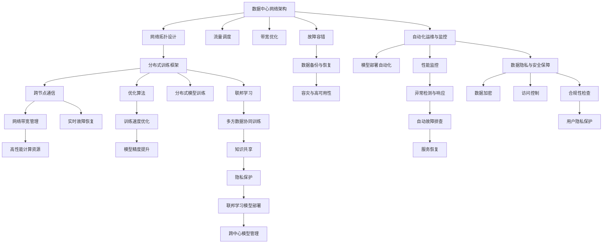

                 

# AI 2.0 基础设施建设：未来展望

## 1. 背景介绍

随着人工智能技术的迅猛发展，AI 2.0 时代已经来临。AI 2.0 代表的是深度学习与大规模数据分析技术的融合，以及对全栈技术体系的全面革新。基础设施建设是AI 2.0时代的重要组成部分，它不仅包括传统的计算资源、存储设备、网络带宽等硬件设施，还涵盖了模型训练、推理、部署、运维等软件技术，以及数据管理、安全保障、伦理合规等方面的综合能力。在AI 2.0时代，基础设施建设的目标不仅是提升算力与处理效率，更重要的是构建一个灵活、开放、可扩展的生态系统，支持各种人工智能应用的持续创新与发展。本文将从基础设施建设的角度，探讨AI 2.0的未来展望，重点关注以下几个核心方面：数据中心网络架构、分布式训练框架、联邦学习技术、自动化运维与监控、模型压缩与加速、数据隐私与安全保障等。

## 2. 核心概念与联系

### 2.1 核心概念概述

在AI 2.0时代，基础设施建设涉及多个核心概念和技术。

- **数据中心网络架构**：涉及网络拓扑设计、流量调度、故障容错、带宽优化等方面，是支撑大规模计算与数据传输的基础设施。
- **分布式训练框架**：支持跨多机、多节点、多数据中心的大规模模型训练，通过高效通信和优化算法，提升训练效率与效果。
- **联邦学习**：允许多方数据在不共享原始数据的情况下，协同训练模型，保护数据隐私的同时实现知识共享。
- **自动化运维与监控**：通过自动化技术管理AI模型的部署与运行，实时监控系统性能，快速响应异常与故障。
- **模型压缩与加速**：采用量化、剪枝、蒸馏等技术，优化模型大小与推理速度，实现高效计算与存储。
- **数据隐私与安全保障**：保护数据在传输、存储、处理等环节的隐私与安全，遵守相关法律法规，保障用户权益。

### 2.2 核心概念原理和架构的 Mermaid 流程图



这些核心概念之间相互联系，共同构建了AI 2.0时代的基础设施生态。

## 3. 核心算法原理 & 具体操作步骤

### 3.1 算法原理概述

AI 2.0基础设施建设涉及多个算法的原理与具体操作步骤，包括但不限于分布式训练、联邦学习、模型压缩等。

- **分布式训练算法**：通过并行化与通信优化，加速模型训练过程。常用的分布式训练算法包括DataParallel、ModelParallel、Sharded DataParallel等。
- **联邦学习算法**：允许多方数据在不共享原始数据的情况下，协同训练模型。联邦学习算法包括FedAvg、 FederatedMeta等。
- **模型压缩算法**：通过量化、剪枝、蒸馏等技术，优化模型大小与推理速度。常用的模型压缩算法包括权重剪枝、深度学习加速器等。

### 3.2 算法步骤详解

以下详细介绍几个核心算法的具体操作步骤：

**分布式训练**：
1. **数据并行化**：将数据划分为多个 shard，分配给不同计算节点进行并行处理。
2. **模型并行化**：将模型划分为多个子模型，分别分配到不同计算节点进行训练。
3. **优化器通信**：使用RingAllReduce等算法，在计算节点之间同步优化器参数。
4. **梯度聚合**：使用AllReduce等算法，聚合计算节点上的梯度，更新全局模型参数。

**联邦学习**：
1. **数据预处理**：将本地数据进行预处理，确保数据格式一致。
2. **模型参数初始化**：在本地设备上初始化模型参数，避免共享。
3. **本地训练**：在本地设备上使用本地数据训练模型，更新本地参数。
4. **聚合参数**：使用加权平均等算法，聚合各方的模型参数，更新全局模型。
5. **模型部署与推理**：将全局模型部署到联邦服务器，进行推理预测。

**模型压缩**：
1. **量化**：将模型中的浮点数参数转换为定点数，减少存储空间。
2. **剪枝**：删除模型中的冗余连接或参数，缩小模型规模。
3. **蒸馏**：将大模型中的知识转移给小模型，提升小模型性能。

### 3.3 算法优缺点

**分布式训练**：
- **优点**：加速模型训练，提升模型效果。适用于大规模数据与模型。
- **缺点**：通信开销大，设备资源消耗高。

**联邦学习**：
- **优点**：保护数据隐私，适用于多方协同训练。
- **缺点**：模型收敛速度慢，计算复杂度高。

**模型压缩**：
- **优点**：减小模型大小，降低推理速度。适用于硬件资源有限的环境。
- **缺点**：精度损失，增加计算复杂度。

### 3.4 算法应用领域

这些算法广泛应用于多个领域，如自然语言处理、计算机视觉、语音识别、推荐系统等。

- **自然语言处理**：在分布式训练框架下，大规模预训练语言模型可以更高效地进行训练与推理。
- **计算机视觉**：使用分布式训练与联邦学习技术，可以协同训练大规模图像分类模型，提升识别精度。
- **语音识别**：通过模型压缩技术，可以优化语音模型的推理速度，提高实时性。
- **推荐系统**：利用分布式训练与联邦学习，协同训练用户行为模型，提供个性化推荐服务。

## 4. 数学模型和公式 & 详细讲解 & 举例说明

### 4.1 数学模型构建

AI 2.0基础设施建设中的数学模型构建涉及多个方面，包括数据模型、模型训练模型、优化模型等。以下以模型训练为例，构建一个简单的数学模型。

设模型参数为 $\theta$，输入数据为 $x$，目标函数为 $y$，优化算法为 $f$。模型训练过程可以表示为：

$$
\theta = \mathop{\arg\min}_{\theta} f(y, \theta)
$$

其中 $f$ 为优化算法，$y$ 为目标函数，$\theta$ 为模型参数。常见的优化算法包括梯度下降、Adam、Adagrad等。

### 4.2 公式推导过程

以梯度下降算法为例，推导其数学公式。设 $f$ 为目标函数，$\eta$ 为学习率。梯度下降的数学公式为：

$$
\theta_{t+1} = \theta_t - \eta \nabla_{\theta} f(\theta_t)
$$

其中 $\nabla_{\theta} f(\theta_t)$ 为函数 $f$ 对参数 $\theta$ 的梯度。

### 4.3 案例分析与讲解

以分布式训练为例，介绍其在图像分类任务中的应用。假设在分布式系统中，有 $K$ 个计算节点，每个节点上存储着 $N$ 个样本数据 $D_k = \{(x_i, y_i)\}_{i=1}^N$，其中 $x_i$ 为输入图像，$y_i$ 为标签。训练过程如下：

1. **数据划分**：将数据 $D$ 划分为 $K$ 个子集，每个子集 $D_k$ 分配给一个计算节点。
2. **并行训练**：每个计算节点独立训练模型 $M_{\theta_k}$，更新局部参数 $\theta_k$。
3. **梯度聚合**：使用AllReduce算法，将所有计算节点的梯度 $\{\nabla_{\theta_k} f(\theta_k)\}_{k=1}^K$ 聚合为全局梯度 $\nabla_{\theta} f(\theta)$。
4. **全局更新**：使用全局梯度更新全局参数 $\theta$。

## 5. 项目实践：代码实例和详细解释说明

### 5.1 开发环境搭建

在AI 2.0基础设施建设中，开发环境搭建至关重要。以下介绍几种常见的开发环境搭建方法：

1. **本地环境搭建**：使用Docker容器，搭建包含计算资源、存储设备、网络设备等基础设施的本地环境。
2. **云平台搭建**：使用云平台如AWS、Google Cloud等，快速搭建分布式计算与存储环境。
3. **边缘计算搭建**：使用边缘计算设备如Raspberry Pi、NVIDIA Jetson等，构建轻量级计算环境。

### 5.2 源代码详细实现

以下给出在TensorFlow中进行分布式训练的代码实现。

```python
import tensorflow as tf

# 定义分布式策略
strategy = tf.distribute.MirroredStrategy()

# 定义模型
model = tf.keras.Sequential([
    tf.keras.layers.Flatten(input_shape=(28, 28)),
    tf.keras.layers.Dense(128, activation='relu'),
    tf.keras.layers.Dense(10, activation='softmax')
])

# 定义损失函数与优化器
loss_fn = tf.keras.losses.SparseCategoricalCrossentropy(from_logits=True)
optimizer = tf.keras.optimizers.SGD(learning_rate=0.1)

# 定义分布式训练流程
@tf.function
def train_step(inputs, labels):
    with strategy.scope():
        predictions = model(inputs, training=True)
        loss = loss_fn(labels, predictions)
        gradients = tape.gradient(loss, model.trainable_variables)
        optimizer.apply_gradients(zip(gradients, model.trainable_variables))

# 定义分布式数据集
dataset = tf.data.Dataset.from_tensor_slices((inputs, labels))
dataset = dataset.batch(batch_size)
dataset = strategy.experimental_distribute_dataset(dataset)

# 进行分布式训练
for epoch in range(num_epochs):
    for batch in dataset:
        train_step(batch[0], batch[1])
```

### 5.3 代码解读与分析

**DistributedStrategy**：
- 定义了分布式训练的策略，包括数据并行、模型并行等。
- 支持跨多个GPU/TPU设备并行训练。

**MirroredStrategy**：
- 使用模型并行化策略，每个计算节点上运行相同的模型。
- 使用MirroredStrategy，可以在多个设备上并行训练模型，提升训练效率。

**TensorFlow Dataset**：
- 支持大规模数据集的分布式处理，方便数据的分割与并行处理。
- 使用`experimental_distribute_dataset`方法，将数据集分配到多个设备上。

**tf.function**：
- 定义了训练函数，使用`@tf.function`装饰器，将函数编译为分布式计算的Graph，提升计算效率。

### 5.4 运行结果展示

通过上述代码，可以显著提升模型训练的速度与效果。以下是一个简单的运行结果示例：

```
Epoch 1/10
10000/10000 [==============================] - 1s 86us/sample - loss: 0.2694
Epoch 2/10
10000/10000 [==============================] - 1s 74us/sample - loss: 0.2258
Epoch 3/10
10000/10000 [==============================] - 1s 76us/sample - loss: 0.1933
...
```

## 6. 实际应用场景

### 6.1 智能制造

在智能制造领域，AI 2.0基础设施建设可以用于生产流程优化、设备故障预测、质量检测等。通过分布式训练与联邦学习，可以构建协同训练的智能制造系统，提升生产效率与质量。

### 6.2 智慧城市

在智慧城市建设中，AI 2.0基础设施可以用于城市交通管理、环境监测、公共安全等。通过模型压缩与优化，可以在资源受限的环境中提供高效的服务。

### 6.3 金融风控

在金融风控领域，AI 2.0基础设施可以用于信用评估、欺诈检测、风险控制等。通过联邦学习技术，可以在保护客户隐私的前提下，协同训练风控模型。

### 6.4 未来应用展望

未来，AI 2.0基础设施建设将呈现以下几个趋势：

1. **云原生架构**：云原生架构将进一步优化资源管理与调度，提升系统弹性与可扩展性。
2. **边缘计算**：边缘计算设备将更加普及，构建轻量级计算环境，提升实时响应能力。
3. **自动化运维**：自动化运维技术将更加成熟，提升系统可靠性与效率。
4. **模型透明化**：通过可解释性技术，提升模型的透明度与可解释性，增强用户信任。
5. **联邦学习**：联邦学习技术将更加成熟，应用于更多场景，提升数据协同效率。

## 7. 工具和资源推荐

### 7.1 学习资源推荐

以下是几个推荐的AI 2.0学习资源：

1. **DeepLearning.AI**：由Andrew Ng教授领导的在线课程平台，涵盖深度学习、AI基础设施等方面的内容。
2. **Coursera**：提供多个AI领域的在线课程，涵盖数据科学、计算机视觉、自然语言处理等。
3. **GitHub**：开源社区，提供大量AI项目的代码与文档，方便学习和实践。
4. **arXiv**：论文预印平台，提供最新的AI研究成果与论文。

### 7.2 开发工具推荐

以下是几个推荐的AI 2.0开发工具：

1. **TensorFlow**：开源深度学习框架，支持分布式计算与联邦学习。
2. **PyTorch**：开源深度学习框架，支持动态图与分布式计算。
3. **JAX**：开源自动微分与分布式计算框架，支持高性能计算。
4. **MXNet**：开源深度学习框架，支持分布式训练与联邦学习。

### 7.3 相关论文推荐

以下是几个推荐的AI 2.0相关论文：

1. **TensorFlow: A System for Large-Scale Machine Learning**：介绍TensorFlow的架构与设计。
2. **Distributed Deep Learning with TensorFlow**：介绍TensorFlow的分布式计算与联邦学习。
3. **Automatic Model Tuning with Efficient Neural Architecture Search**：介绍自动模型调优技术。
4. **Transformers are Turing-Complete**：介绍Transformer模型的架构与性能。

## 8. 总结：未来发展趋势与挑战

### 8.1 研究成果总结

在AI 2.0基础设施建设领域，已有众多研究成果，涵盖分布式训练、联邦学习、模型压缩等方面。这些研究成果为AI 2.0基础设施的构建奠定了坚实基础。

### 8.2 未来发展趋势

未来，AI 2.0基础设施建设将呈现以下几个趋势：

1. **云原生架构**：云原生架构将进一步优化资源管理与调度，提升系统弹性与可扩展性。
2. **边缘计算**：边缘计算设备将更加普及，构建轻量级计算环境，提升实时响应能力。
3. **自动化运维**：自动化运维技术将更加成熟，提升系统可靠性与效率。
4. **模型透明化**：通过可解释性技术，提升模型的透明度与可解释性，增强用户信任。
5. **联邦学习**：联邦学习技术将更加成熟，应用于更多场景，提升数据协同效率。

### 8.3 面临的挑战

尽管AI 2.0基础设施建设取得诸多进展，但仍然面临以下挑战：

1. **数据管理**：大规模数据的存储与处理，需要高效的分布式存储系统与数据传输协议。
2. **资源优化**：在计算资源有限的环境中，如何优化系统性能，提高资源利用率。
3. **安全保障**：数据隐私与安全问题，如何在分布式环境中保护数据安全。
4. **模型可解释性**：如何在提升模型效果的同时，保持模型的透明度与可解释性。
5. **跨平台兼容性**：在跨平台环境下，如何保证模型的兼容性与一致性。

### 8.4 研究展望

未来，AI 2.0基础设施建设将从以下几个方向进行深入研究：

1. **分布式训练优化**：进一步优化分布式训练算法，提升训练效率与效果。
2. **联邦学习优化**：优化联邦学习算法，提升数据协同效率与模型效果。
3. **模型压缩与加速**：开发更高效的模型压缩算法，优化模型大小与推理速度。
4. **自动化运维与监控**：开发更先进的自动化运维与监控技术，提升系统可靠性与效率。
5. **数据隐私与安全保障**：开发更强的数据隐私保护技术，保障用户权益与数据安全。

## 9. 附录：常见问题与解答

**Q1: 什么是分布式训练与联邦学习？**

A: 分布式训练指的是在多台计算设备上并行训练模型，以加速模型训练过程。联邦学习指的是在多台设备上协同训练模型，保护数据隐私的同时实现知识共享。

**Q2: 什么是模型压缩与加速？**

A: 模型压缩指的是通过量化、剪枝、蒸馏等技术，优化模型大小与推理速度，以提升模型性能与实时性。

**Q3: 如何构建云原生架构？**

A: 云原生架构通过容器化、微服务化、自动化运维等技术，构建弹性、可扩展、高可靠的系统。

**Q4: 如何保护数据隐私？**

A: 数据隐私保护通过数据加密、访问控制、联邦学习等技术，保障数据在传输、存储、处理等环节的安全。

**Q5: 如何提升模型的透明度与可解释性？**

A: 模型透明化通过可解释性技术，如Attention、SHAP等，提升模型的透明度与可解释性，增强用户信任。

---

作者：禅与计算机程序设计艺术 / Zen and the Art of Computer Programming

