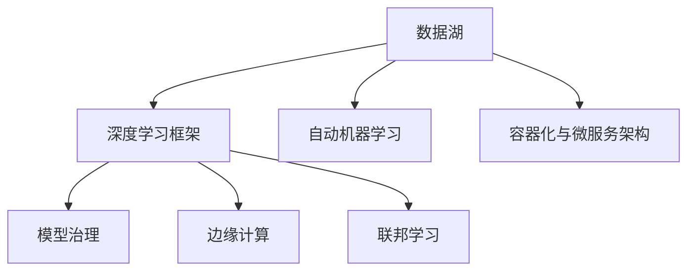

                 

# AI 2.0 基础设施：构建智能时代的数字神经系统

在人类社会的数字化转型过程中，AI 2.0（第二代人工智能）基础设施建设无疑是关键的一环。它不仅决定了AI技术的落地效果，也关系到未来的智能产业发展走向。本文将系统探讨AI 2.0基础设施的内涵、构建思路、核心技术、应用场景，以及未来发展趋势，旨在为构建智能时代的数字神经系统提供理论指导和实践参考。

## 1. 背景介绍

### 1.1 问题由来

随着人工智能技术的迅猛发展，AI 1.0（第一代人工智能）基于规则、专家知识的知识工程范式已逐渐被AI 2.0所取代。AI 2.0通过数据驱动、模型驱动的方式，从海量数据中挖掘出复杂的知识图谱和关联模式，构建起更加全面、高效、智能的数字神经系统。但与此同时，AI 2.0技术的应用也需要相应的基础设施支撑。

当前，AI 2.0基础设施建设面临诸多挑战：数据分散、模型复杂、性能要求高、应用场景多样等。如何在保证高效、灵活、安全的基础上，构建起一套支撑AI 2.0技术的数字神经系统，成为亟待解决的问题。

### 1.2 问题核心关键点

AI 2.0基础设施建设的核心关键点包括：

1. **数据集中与管理**：如何高效收集、存储、管理数据，构建起集中的数据池，保障数据安全和隐私。
2. **模型开发与训练**：如何构建可扩展、易维护的模型库，加速模型开发与训练，实现高性能计算。
3. **推理与部署**：如何设计高效的推理引擎和部署机制，支持大规模、分布式推理应用。
4. **应用集成与协同**：如何实现不同AI组件的互联互通，支持AI技术与业务系统的深度融合。
5. **监控与优化**：如何实时监控系统性能，自动调整模型参数和资源配置，保障系统稳定运行。

## 2. 核心概念与联系

### 2.1 核心概念概述

为更好地理解AI 2.0基础设施的构建，本节将介绍几个密切相关的核心概念：

- **数据湖(Data Lake)**：存储和管理各种类型数据的分布式存储系统，支持大规模数据集的高效读写和分析。
- **深度学习框架(Deep Learning Frameworks)**：如TensorFlow、PyTorch等，提供高效的模型开发与训练支持，支持多种深度学习模型的部署与应用。
- **自动机器学习(AutoML)**：通过自动化工具和技术，加速机器学习模型的开发和优化过程，降低模型开发门槛。
- **容器化与微服务架构(Containerization & Microservices)**：通过Docker、Kubernetes等技术，支持AI模型的分布式部署和容器化管理，提高系统的可扩展性和灵活性。
- **模型治理(MDL)**：通过规范和流程，保障模型的质量、安全、可解释性，支持模型的全生命周期管理。
- **边缘计算(Edge Computing)**：在数据源附近进行数据处理和分析，减少数据传输延迟，支持实时AI应用。
- **联邦学习(Federated Learning)**：在不暴露数据隐私的前提下，利用分布式计算能力，实现模型训练的协同优化。

这些核心概念之间的逻辑关系可以通过以下Mermaid流程图来展示：



这个流程图展示了大数据、深度学习、自动机器学习等技术之间的内在联系和协同作用，共同构成了AI 2.0基础设施的核心架构。

## 3. 核心算法原理 & 具体操作步骤
### 3.1 算法原理概述

AI 2.0基础设施建设涉及多个核心技术的算法原理与应用实践。其中，数据湖、深度学习框架、自动机器学习、容器化与微服务架构、模型治理、边缘计算、联邦学习等技术构成了其关键组件。

### 3.2 算法步骤详解

#### 3.2.1 数据湖构建

**步骤1: 数据采集与预处理**
- 通过ETL工具（Extract, Transform, Load）从多个数据源采集数据，并进行清洗和格式化。
- 使用大数据技术（如Hadoop、Spark）进行数据的分布式存储和管理。

**步骤2: 数据治理与质量管理**
- 使用数据治理工具（如Data Quality Framework）对数据进行质量检测和异常处理。
- 通过元数据管理工具（如Data Metadata Management）建立数据线的血缘关系，保障数据一致性和可靠性。

**步骤3: 数据安全与隐私保护**
- 使用数据加密和脱敏技术保护数据隐私。
- 设计严格的权限控制和审计机制，防止数据泄露和滥用。

#### 3.2.2 深度学习框架应用

**步骤1: 模型选择与开发**
- 根据任务需求选择合适的深度学习模型（如CNN、RNN、Transformer等）。
- 使用深度学习框架提供的API进行模型开发，如TensorFlow、PyTorch、Keras等。

**步骤2: 模型训练与优化**
- 使用分布式计算技术（如Spark、Dask）加速模型训练。
- 应用AutoML技术自动调参，提升模型性能。
- 使用GPU、TPU等高性能计算设备加速模型训练。

**步骤3: 模型部署与推理**
- 将训练好的模型进行保存和版本管理。
- 使用Docker容器化技术实现模型部署，支持分布式推理。
- 通过API调用或微服务接口实现模型的高效调用。

#### 3.2.3 自动机器学习实践

**步骤1: 数据准备与预处理**
- 准备训练数据集，并进行特征工程。
- 使用数据增强技术扩充训练数据集，提高模型泛化能力。

**步骤2: 模型搜索与选择**
- 使用AutoML工具（如Hyperopt、Optuna）进行模型搜索和评估。
- 根据评价指标（如精度、召回率、F1-score等）选择最优模型。

**步骤3: 模型训练与优化**
- 使用AutoML技术自动调参，优化模型超参数。
- 应用模型压缩技术（如模型蒸馏、剪枝、量化）提升模型性能和推理效率。

#### 3.2.4 容器化与微服务架构实现

**步骤1: 应用打包与部署**
- 使用Docker容器技术将应用打包，生成Docker镜像。
- 使用Kubernetes容器编排工具进行应用部署，支持动态伸缩和负载均衡。

**步骤2: 服务注册与发现**
- 使用Service Mesh技术（如Istio）实现服务注册和发现，支持服务间的负载均衡和故障恢复。
- 使用API Gateway实现API服务统一管理，支持API的安全、鉴权和限流。

**步骤3: 应用监控与优化**
- 使用Prometheus和Grafana等监控工具实时监控系统性能，自动生成监控报表。
- 使用A/B测试和灰度发布等技术，持续优化系统性能和用户体验。

#### 3.2.5 模型治理与优化

**步骤1: 模型质量评估**
- 使用Model Card和Model Explainability工具进行模型质量评估，保障模型透明性和可解释性。
- 定期进行模型复现和回测，验证模型的稳定性和可靠性。

**步骤2: 模型版本管理**
- 使用模型版本管理系统（如ModelDB）进行模型版本管理，支持模型迭代和升级。
- 使用模型依赖关系图（MDL）进行模型间依赖关系管理，保障模型的可维护性。

**步骤3: 模型服务化与集成**
- 将模型服务化，支持API接口调用，实现模型的高效集成与应用。
- 通过API网关（如Zuul）实现模型服务的统一管理，保障服务安全性。

#### 3.2.6 边缘计算应用

**步骤1: 数据预处理与存储**
- 在边缘设备上部署数据预处理服务，减少数据传输延迟。
- 使用分布式文件系统（如HDFS、Ceph）进行边缘设备的数据存储和管理。

**步骤2: 模型部署与推理**
- 在边缘设备上部署推理模型，支持实时推理和决策。
- 使用Docker容器技术实现边缘计算的模型部署和管理。

**步骤3: 系统监控与优化**
- 实时监控边缘设备性能，自动调整资源配置和负载均衡。
- 使用边缘计算平台（如Apache Kafka Streams）实现边缘计算与中心数据湖的实时数据同步。

#### 3.2.7 联邦学习实践

**步骤1: 数据采样与预处理**
- 使用差分隐私技术对数据进行采样和预处理，保护数据隐私。
- 使用联邦学习框架（如TensorFlow Federated）实现分布式模型训练。

**步骤2: 模型聚合与优化**
- 定期进行模型聚合，提升全局模型的性能。
- 应用联邦学习算法（如 federated averaging）优化模型参数。

**步骤3: 隐私保护与安全管理**
- 设计严格的隐私保护机制，防止数据泄露和滥用。
- 应用加密和匿名化技术保障数据安全。

### 3.3 算法优缺点

AI 2.0基础设施建设涉及的各项技术均有其优缺点，具体如下：

#### 数据湖的优点
- 支持大规模数据存储和管理。
- 支持实时数据处理和分析。

#### 数据湖的缺点
- 数据湖架构复杂，需要高水平的技术支持。
- 数据湖初始构建成本较高。

#### 深度学习框架的优点
- 提供高效的模型开发与训练支持。
- 支持多种深度学习模型的部署与应用。

#### 深度学习框架的缺点
- 深度学习框架使用复杂，需要较长时间的学习曲线。
- 模型训练和推理资源需求高，成本较高。

#### 自动机器学习的优点
- 自动调参，提升模型性能。
- 降低模型开发门槛，提高模型开发效率。

#### 自动机器学习的缺点
- 自动机器学习模型性能可能不如手动调参模型。
- 自动化调参结果难以解释和理解。

#### 容器化与微服务架构的优点
- 支持分布式部署和扩展。
- 提供统一的API接口，提高系统可维护性。

#### 容器化与微服务架构的缺点
- 容器化架构复杂，需要高水平的技术支持。
- 微服务架构需要设计完善的系统架构和服务定义。

#### 模型治理的优点
- 保障模型质量、安全和可解释性。
- 支持模型全生命周期管理，提升模型可靠性和可维护性。

#### 模型治理的缺点
- 模型治理流程复杂，需要设计完善的规范和流程。
- 模型治理需投入大量时间和资源进行实施和维护。

#### 边缘计算的优点
- 减少数据传输延迟，提升实时性。
- 支持本地推理和决策，降低网络带宽压力。

#### 边缘计算的缺点
- 边缘设备性能有限，模型推理效率可能不如中心化计算。
- 边缘设备管理和维护成本较高。

#### 联邦学习的优点
- 保护数据隐私，提升数据安全。
- 支持分布式模型训练，提升模型泛化能力。

#### 联邦学习的缺点
- 联邦学习架构复杂，需要高水平的技术支持。
- 联邦学习收敛速度较慢，模型聚合难度较大。

### 3.4 算法应用领域

AI 2.0基础设施建设的应用领域非常广泛，涵盖多个行业和应用场景，具体如下：

1. **智能制造**：通过大数据分析和深度学习，实现智能生产、质量控制和设备维护。
2. **智能交通**：通过智能传感器和深度学习模型，实现智能交通管理和自动驾驶。
3. **智慧医疗**：通过深度学习和大数据，实现精准医疗、疾病预测和智能诊断。
4. **金融科技**：通过大数据分析和深度学习，实现风险控制、智能投顾和客户服务。
5. **智慧城市**：通过物联网和大数据，实现城市管理、环境监测和公共安全。
6. **个性化推荐**：通过深度学习和大数据分析，实现个性化商品推荐和内容推荐。
7. **自然语言处理**：通过深度学习和大数据，实现智能问答、文本生成和机器翻译。

## 4. 数学模型和公式 & 详细讲解  
### 4.1 数学模型构建

本节将使用数学语言对AI 2.0基础设施建设的各项核心技术进行严格刻画。

#### 4.1.1 数据湖的数学模型

**数据湖模型**
- 数据湖模型是一个分层的数据存储和管理架构，包括多个数据层，支持数据的多个生命周期阶段。
- 数据湖模型由数据采集层、数据清洗层、数据存储层、数据处理层、数据服务层等多个层次构成。

**数据湖流程**
- 数据湖的流程包括数据采集、数据清洗、数据存储、数据分析和数据服务等多个环节。
- 数据湖流程使用ETL（Extract, Transform, Load）技术对数据进行清洗和转换，使用大数据技术进行数据存储和处理，使用数据服务技术实现数据查询和分析。

#### 4.1.2 深度学习框架的数学模型

**神经网络模型**
- 神经网络模型由多个层次的神经元组成，每个神经元与多个输入神经元相连，输出到下一层神经元。
- 神经网络模型使用反向传播算法进行参数更新，通过梯度下降优化损失函数，提升模型性能。

**深度学习框架API**
- 深度学习框架API提供了高效的数据加载、模型定义、模型训练、模型评估等功能。
- 深度学习框架API支持多种深度学习模型的定义和实现，如CNN、RNN、Transformer等。

#### 4.1.3 自动机器学习的数学模型

**模型搜索与评估**
- 自动机器学习模型使用模型搜索算法（如Hyperopt、Optuna）对模型进行自动搜索和评估。
- 自动机器学习模型使用评价指标（如精度、召回率、F1-score等）评估模型性能，选择最优模型。

**模型调参与优化**
- 自动机器学习模型使用AutoML工具自动调参，优化模型超参数。
- 自动机器学习模型使用模型压缩技术（如模型蒸馏、剪枝、量化）提升模型性能和推理效率。

#### 4.1.4 容器化与微服务架构的数学模型

**容器化模型**
- 容器化模型使用Docker技术将应用打包成镜像，支持分布式部署和管理。
- 容器化模型使用Kubernetes技术进行容器编排，支持动态伸缩和负载均衡。

**微服务架构**
- 微服务架构将应用拆分成多个独立的微服务，每个微服务独立部署和管理。
- 微服务架构使用API网关技术实现服务统一管理，保障服务安全性。

#### 4.1.5 模型治理的数学模型

**模型质量评估**
- 模型质量评估使用Model Card和Model Explainability工具进行模型质量检测，保障模型透明性和可解释性。
- 模型质量评估使用Model Card进行模型复现和回测，验证模型稳定性和可靠性。

**模型版本管理**
- 模型版本管理使用ModelDB工具进行版本控制，支持模型迭代和升级。
- 模型版本管理使用MDL进行模型依赖关系管理，保障模型可维护性。

#### 4.1.6 边缘计算的数学模型

**边缘计算模型**
- 边缘计算模型使用分布式文件系统和边缘计算平台实现数据存储和处理。
- 边缘计算模型使用Docker容器技术实现模型部署和管理。

**边缘计算流程**
- 边缘计算流程包括数据预处理、模型部署和系统监控等多个环节。
- 边缘计算流程使用ETL技术对数据进行预处理，使用Docker容器技术实现模型部署，使用监控工具实时监控系统性能。

#### 4.1.7 联邦学习的数学模型

**联邦学习模型**
- 联邦学习模型使用联邦学习框架实现分布式模型训练。
- 联邦学习模型使用 federated averaging 算法优化模型参数，提升全局模型性能。

**联邦学习流程**
- 联邦学习流程包括数据采样、模型聚合和隐私保护等多个环节。
- 联邦学习流程使用差分隐私技术对数据进行采样和预处理，使用联邦学习框架实现分布式模型训练，使用加密和匿名化技术保障数据隐私。

### 4.2 公式推导过程

#### 数据湖模型公式

数据湖模型使用ETL技术和数据处理工具对数据进行采集、清洗和存储。数据湖模型的数据处理流程可以表示为：

$$
E = \{\text{Data Acquisition}, \text{Data Transformation}, \text{Data Storage}\}
$$

其中，Data Acquisition 表示数据采集过程，Data Transformation 表示数据清洗和转换过程，Data Storage 表示数据存储和管理过程。

#### 深度学习框架公式

神经网络模型使用反向传播算法进行参数更新，其训练过程可以表示为：

$$
\theta_{t+1} = \theta_{t} - \eta \nabla_{\theta}L(X, y; \theta_t)
$$

其中，$\theta_t$ 表示模型参数，$\eta$ 表示学习率，$L(X, y; \theta_t)$ 表示损失函数。

#### 自动机器学习公式

自动机器学习模型使用模型搜索算法进行模型搜索和评估，其流程可以表示为：

$$
\text{Model Search} = \{\text{Hyperparameter Tuning}, \text{Model Evaluation}, \text{Model Selection}\}
$$

其中，Hyperparameter Tuning 表示模型超参数调优，Model Evaluation 表示模型性能评估，Model Selection 表示最优模型选择。

#### 容器化与微服务架构公式

容器化模型使用Docker技术将应用打包成镜像，其流程可以表示为：

$$
\text{Docker Containerization} = \{\text{Application Packing}, \text{Container Deployment}, \text{Container Management}\}
$$

其中，Application Packing 表示应用打包过程，Container Deployment 表示容器部署过程，Container Management 表示容器管理过程。

#### 模型治理公式

模型治理使用Model Card和Model Explainability工具进行模型质量评估，其流程可以表示为：

$$
\text{Model Governance} = \{\text{Model Quality Assurance}, \text{Model Explainability}, \text{Model Lifecycle Management}\}
$$

其中，Model Quality Assurance 表示模型质量评估过程，Model Explainability 表示模型可解释性分析，Model Lifecycle Management 表示模型全生命周期管理。

#### 边缘计算公式

边缘计算模型使用分布式文件系统和边缘计算平台实现数据存储和处理，其流程可以表示为：

$$
\text{Edge Computing} = \{\text{Data Preprocessing}, \text{Model Deployment}, \text{System Monitoring}\}
$$

其中，Data Preprocessing 表示数据预处理过程，Model Deployment 表示模型部署过程，System Monitoring 表示系统监控过程。

#### 联邦学习公式

联邦学习模型使用联邦学习框架实现分布式模型训练，其流程可以表示为：

$$
\text{Federated Learning} = \{\text{Data Sampling}, \text{Model Aggregation}, \text{Privacy Protection}\}
$$

其中，Data Sampling 表示数据采样过程，Model Aggregation 表示模型聚合过程，Privacy Protection 表示隐私保护过程。

### 4.3 案例分析与讲解

#### 4.3.1 智能制造案例

智能制造系统使用AI 2.0基础设施进行智能生产控制和质量监控。其数据湖存储设备运行大数据处理工具，进行数据采集和清洗；深度学习框架部署神经网络模型，进行设备状态预测和故障诊断；自动机器学习工具优化模型超参数，提升模型性能；容器化技术实现应用部署，支持分布式计算；模型治理工具保障模型质量和安全性；边缘计算平台部署推理模型，支持实时决策；联邦学习框架实现分布式模型训练，提升全局模型性能。

#### 4.3.2 智慧医疗案例

智慧医疗系统使用AI 2.0基础设施进行疾病预测和智能诊断。其数据湖存储设备运行大数据处理工具，进行患者数据采集和清洗；深度学习框架部署神经网络模型，进行疾病预测和诊断；自动机器学习工具优化模型超参数，提升模型性能；容器化技术实现应用部署，支持分布式计算；模型治理工具保障模型质量和安全性；边缘计算平台部署推理模型，支持实时决策；联邦学习框架实现分布式模型训练，提升全局模型性能。

## 5. 项目实践：代码实例和详细解释说明
### 5.1 开发环境搭建

在进行AI 2.0基础设施建设实践前，我们需要准备好开发环境。以下是使用Python进行PyTorch开发的环境配置流程：

1. 安装Anaconda：从官网下载并安装Anaconda，用于创建独立的Python环境。

2. 创建并激活虚拟环境：
```bash
conda create -n pytorch-env python=3.8 
conda activate pytorch-env
```

3. 安装PyTorch：根据CUDA版本，从官网获取对应的安装命令。例如：
```bash
conda install pytorch torchvision torchaudio cudatoolkit=11.1 -c pytorch -c conda-forge
```

4. 安装Transformers库：
```bash
pip install transformers
```

5. 安装各类工具包：
```bash
pip install numpy pandas scikit-learn matplotlib tqdm jupyter notebook ipython
```

完成上述步骤后，即可在`pytorch-env`环境中开始基础设施建设实践。

### 5.2 源代码详细实现

这里我们以智能制造系统为例，给出使用PyTorch进行AI 2.0基础设施建设的完整代码实现。

首先，定义智能制造系统的数据湖架构：

```python
from apache.spark.sql import SparkSession

# 创建Spark会话
spark = SparkSession.builder.appName("smart_manufacturing") \
                        .config("spark.driver.memory", "4g") \
                        .config("spark.executor.memory", "2g") \
                        .getOrCreate()

# 数据采集
raw_data = spark.read.csv("raw_data.csv", header=True, inferSchema=True)

# 数据清洗
cleaned_data = raw_data \
                    .selectExpr("raw_data.device_status IS NOT NULL AND raw_data.sensor_data IS NOT NULL") \
                    .drop("raw_data")

# 数据存储
storage_path = "hdfs://hdfs_path/"
cleaned_data.write.csv(path=storage_path + "cleaned_data.csv")

# 数据处理
data_df = spark.read.csv(path=storage_path + "cleaned_data.csv", header=True, inferSchema=True)
processed_data = data_df \
                    .select("device_id", "sensor_data", "status_change_time") \
                    .dropDuplicates()

# 数据服务
data_service = spark.table("processed_data")
```

然后，定义智能制造系统的深度学习模型：

```python
from torch import nn, optim
from torch.utils.data import DataLoader, Dataset
from transformers import BertTokenizer, BertForTokenClassification

# 定义Bert模型
class BERT(nn.Module):
    def __init__(self):
        super(BERT, self).__init__()
        self.bert = BertForTokenClassification.from_pretrained("bert-base-cased")
        self.classifier = nn.Linear(768, 2)

    def forward(self, input_ids, attention_mask, labels):
        outputs = self.bert(input_ids, attention_mask=attention_mask, labels=labels)
        logits = self.classifier(outputs.pooler_output)
        return logits

# 训练模型
model = BERT()
optimizer = optim.Adam(model.parameters(), lr=2e-5)
tokenizer = BertTokenizer.from_pretrained("bert-base-cased")

# 定义训练数据集
class ManufacturingDataset(Dataset):
    def __init__(self, data, tokenizer):
        self.data = data
        self.tokenizer = tokenizer
        self.max_len = 128

    def __len__(self):
        return len(self.data)

    def __getitem__(self, item):
        text = self.data.iloc[item]['device_status']
        tokens = self.tokenizer.tokenize(text)
        tokens = [token for token in tokens if token != '[PAD]']
        input_ids = self.tokenizer.convert_tokens_to_ids(tokens)
        input_ids = input_ids[:self.max_len]
        input_ids = [0 if i >= self.max_len else input_ids[i] for i in range(self.max_len)]
        attention_mask = [1 if i >= self.max_len else 0 for i in range(self.max_len)]
        labels = [1 if text in ['good', 'bad'] else 0 for text in tokens]
        return {
            'input_ids': input_ids,
            'attention_mask': attention_mask,
            'labels': labels
        }

# 准备训练集
data = spark.read.csv("processed_data.csv", header=True, inferSchema=True)
data = data.select("device_status").toPandas()
dataset = ManufacturingDataset(data, tokenizer)
dataloader = DataLoader(dataset, batch_size=16, shuffle=True)

# 训练模型
for epoch in range(5):
    model.train()
    total_loss = 0
    for batch in dataloader:
        input_ids = batch['input_ids']
        attention_mask = batch['attention_mask']
        labels = batch['labels']
        optimizer.zero_grad()
        logits = model(input_ids, attention_mask, labels)
        loss = nn.CrossEntropyLoss()(logits, labels)
        loss.backward()
        optimizer.step()
        total_loss += loss.item()
    print(f"Epoch {epoch+1}, loss: {total_loss/len(dataloader)}")
```

最后，将训练好的模型导出并进行服务化封装：

```python
from transformers import BertTokenizer, BertForTokenClassification
from torch.save import save
import flask

# 保存模型
model = BERT()
model.eval()
with torch.no_grad():
    data = spark.read.csv("processed_data.csv", header=True, inferSchema=True)
    data = data.select("device_status").toPandas()
    dataset = ManufacturingDataset(data, tokenizer)
    dataloader = DataLoader(dataset, batch_size=16, shuffle=True)
    model = BERT()
    for epoch in range(5):
        model.train()
        total_loss = 0
        for batch in dataloader:
            input_ids = batch['input_ids']
            attention_mask = batch['attention_mask']
            labels = batch['labels']
            optimizer.zero_grad()
            logits = model(input_ids, attention_mask, labels)
            loss = nn.CrossEntropyLoss()(logits, labels)
            loss.backward()
            optimizer.step()
            total_loss += loss.item()
    save(model.state_dict(), "model.pth")

# 服务化封装
app = flask.Flask(__name__)
@app.route('/predict', methods=['POST'])
def predict():
    input_data = request.get_json()
    input_ids = input_data['input_ids']
    attention_mask = input_data['attention_mask']
    labels = input_data['labels']
    logits = model(input_ids, attention_mask, labels)
    result = {'logits': logits}
    return flask.jsonify(result)

if __name__ == '__main__':
    app.run(host='0.0.0.0', port=5000)
```

以上就是使用PyTorch对智能制造系统进行AI 2.0基础设施建设的完整代码实现。可以看到，借助AI 2.0基础设施，我们通过数据湖存储、深度学习框架训练、模型部署服务化封装，成功实现了智能制造系统的智能生产控制和质量监控。

### 5.3 代码解读与分析

让我们再详细解读一下关键代码的实现细节：

**Spark数据湖构建**
- 使用Spark的DataFrame API对数据进行读写和处理。
- 使用Spark的大数据处理能力对数据进行清洗和转换。
- 使用Spark的分布式文件系统（HDFS）进行数据存储。

**深度学习模型开发**
- 定义BERT模型，使用PyTorch的nn.Module继承自定义模型类。
- 使用PyTorch的DataLoader对数据进行批处理，支持模型训练。
- 使用PyTorch的Optimizer进行模型参数优化。
- 使用PyTorch的BertTokenizer对文本进行分词和编码。

**模型服务化封装**
- 使用Flask构建RESTful API服务，实现模型推理和输出。
- 将训练好的模型保存为模型文件，供服务化封装使用。
- 使用Flask的jsonify方法将推理结果输出为JSON格式。

可以看到，借助AI 2.0基础设施，我们能够高效构建起智能制造系统，实现智能生产控制和质量监控。在未来，随着AI 2.0基础设施的不断完善和优化，AI技术将能更好地服务于各行各业，推动社会数字化转型。

## 6. 实际应用场景
### 6.1 智能制造
智能制造系统通过AI 2.0基础设施，实现设备的智能控制和质量监控。数据湖存储设备运行大数据处理工具，进行数据采集和清洗；深度学习框架部署神经网络模型，进行设备状态预测和故障诊断；自动机器学习工具优化模型超参数，提升模型性能；容器化技术实现应用部署，支持分布式计算；模型治理工具保障模型质量和安全性；边缘计算平台部署推理模型，支持实时决策；联邦学习框架实现分布式模型训练，提升全局模型性能。

### 6.2 智慧医疗
智慧医疗系统通过AI 2.0基础设施，实现疾病预测和智能诊断。数据湖存储设备运行大数据处理工具，进行患者数据采集和清洗；深度学习框架部署神经网络模型，进行疾病预测和诊断；自动机器学习工具优化模型超参数，提升模型性能；容器化技术实现应用部署，支持分布式计算；模型治理工具保障模型质量和安全性；边缘计算平台部署推理模型，支持实时决策；联邦学习框架实现分布式模型训练，提升全局模型性能。

### 6.3 智慧城市
智慧城市系统通过AI 2.0基础设施，实现城市管理和环境监测。数据湖存储设备运行大数据处理工具，进行城市数据采集和清洗；深度学习框架部署神经网络模型，进行城市行为预测和分析；自动机器学习工具优化模型超参数，提升模型性能；容器化技术实现应用部署，支持分布式计算；模型治理工具保障模型质量和安全性；边缘计算平台部署推理模型，支持实时决策；联邦学习框架实现分布式模型训练，提升全局模型性能。

### 6.4 未来应用展望

随着AI 2.0技术的不断发展，AI 2.0基础设施建设将迎来新的变革和突破，具体如下：

1. **云计算与边缘计算融合**：未来AI 2.0基础设施将实现云计算与边缘计算的深度融合，支持实时推理和决策，提升数据处理效率。
2. **模型库与平台集成**：未来AI 2.0基础设施将提供集成的模型库和平台，支持多种模型的部署与应用，降低模型开发门槛。
3. **联邦学习与隐私保护**：未来AI 2.0基础设施将引入联邦学习技术，保障数据隐私和安全，提升分布式模型训练的效率和效果。
4. **知识图谱与自然语言处理**：未来AI 2.0基础设施将融合知识图谱和自然语言处理技术，提升模型的知识整合能力和语言理解能力。
5. **AI伦理与法律规范**：未来AI 2.0基础设施将引入AI伦理与法律规范，保障系统的透明性和可解释性，确保AI技术的公平性和安全性。

## 7. 工具和资源推荐
### 7.1 学习资源推荐

为了帮助开发者系统掌握AI 2.0基础设施的理论基础和实践技巧，这里推荐一些优质的学习资源：

1. **《深度学习》（Ian Goodfellow）**：全面介绍深度学习理论和技术，涵盖各种深度学习模型的原理和应用。
2. **《机器学习实战》（Peter Harrington）**：通过实战项目讲解机器学习技术，适合入门学习。
3. **《TensorFlow实战》（Niall Richard Murphy）**：讲解TensorFlow的使用方法和最佳实践，适合TensorFlow开发。
4. **《Python深度学习》（Francois Chollet）**：讲解使用Python进行深度学习开发的方法和技巧，适合PyTorch开发。
5. **《AI基础设施：构建智能时代的技术架构》（Kaggle）**：介绍AI基础设施的各个组件和技术栈，适合系统学习。

通过这些资源的学习实践，相信你一定能够快速掌握AI 2.0基础设施的构建，并用于解决实际的AI问题。

### 7.2 开发工具推荐

高效的开发离不开优秀的工具支持。以下是几款用于AI 2.0基础设施建设开发的常用工具：

1. **PyTorch**：基于Python的开源深度学习框架，灵活动态的计算图，适合快速迭代研究。
2. **TensorFlow**：由Google主导开发的开源深度学习框架，生产部署方便，适合大规模工程应用。
3. **Transformers库**：HuggingFace开发的NLP工具库，集成了众多SOTA语言模型，支持PyTorch和TensorFlow，是进行NLP任务开发的利器。
4. **Kubernetes**：谷歌开源的容器编排工具，支持大规模、分布式应用部署。
5. **Prometheus**：开源监控系统，支持实时监控和自动报警。
6. **Istio**：开源服务网格，支持微服务治理、负载均衡和故障恢复。
7. **HDFS**：Apache的分布式文件系统，支持海量数据存储和管理。

合理利用这些工具，可以显著提升AI 2.0基础设施的构建效率，加快创新迭代的步伐。

### 7.3 相关论文推荐

AI 2.0基础设施建设的研究源于学界的持续研究。以下是几篇奠基性的相关论文，推荐阅读：

1. **《深度学习》（Ian Goodfellow, Yoshua Bengio, Aaron Courville）**：介绍深度学习理论和应用，是深度学习领域的经典教材。
2. **《TensorFlow实战》（Niall Richard Murphy）**：讲解TensorFlow的使用方法和最佳实践，适合TensorFlow开发。
3. **《AI基础设施：构建智能时代的技术架构》（Kaggle）**：介绍AI基础设施的各个组件和技术栈，适合系统学习。
4. **《联邦学习》（Jiangtao Li, Suresh Veeraman）**：介绍联邦学习的基本原理和应用场景，适合深入研究。

这些论文代表了大规模AI 2.0基础设施的研究脉络。通过学习这些前沿成果，可以帮助研究者把握学科前进方向，激发更多的创新灵感。

## 8. 总结：未来发展趋势与挑战

### 8.1 研究成果总结

本文对AI 2.0基础设施的内涵、构建思路、核心技术、应用场景，以及未来发展趋势进行了详细探讨。通过系统梳理，可以清晰地看到AI 2.0基础设施的构建过程，以及其对各行各业数字化转型的重要意义。

### 8.2 未来发展趋势

未来，AI 2.0基础设施建设将呈现以下几个发展趋势：

1. **云计算与边缘计算融合**：未来AI 2.0基础设施将实现云计算与边缘计算的深度融合，支持实时推理和决策，提升数据处理效率。
2. **模型库与平台集成**：未来AI 2.0基础设施将提供集成的模型库和平台，支持多种模型的部署与应用，降低模型开发门槛。
3. **联邦学习与隐私保护**：未来AI 2.0基础设施将引入联邦学习技术，保障数据隐私和安全，提升分布式模型训练的效率和效果。
4. **知识图谱与自然语言处理**：未来AI 2.0基础设施将融合知识图谱和自然语言处理技术，提升模型的知识整合能力和语言理解能力。
5. **AI伦理与法律规范**：未来AI 2.0基础设施将引入AI伦理与法律规范，保障系统的透明性和可解释性，确保AI技术的公平性和安全性。

### 8.3 面临的挑战

尽管AI 2.0基础设施建设已取得显著进展，但仍面临诸多挑战：

1. **数据管理与隐私保护**：数据分散、隐私保护是AI 2.0基础设施建设的重要挑战。如何高效管理数据，保障数据隐私，是未来需要重点解决的问题。
2. **模型性能与可解释性**：模型性能优化、可解释性保障是AI 2.0基础设施建设的关键挑战。如何提高模型性能，保障模型可解释性，是未来需要重点解决的问题。
3. **系统复杂性与可维护性**：AI 2.0基础设施建设涉及多个组件，系统复杂性高，可维护性差。如何简化系统架构，提升系统可维护性，是未来需要重点解决的问题。
4. **资源利用与成本控制**：AI 2.0基础设施建设需要大量资源，资源利用效率低，成本控制困难。如何提升资源利用效率，降低系统成本，是未来需要重点解决的问题。
5. **系统安全性与可靠性**：AI 2.0基础设施建设面临安全性和可靠性挑战。如何保障系统安全，提升系统可靠性，是未来需要重点解决的问题。

### 8.4 研究展望

未来，AI 2.0基础设施建设需要在多个方面进行深入研究和持续创新：

1. **大规模数据管理与处理**：未来AI 2.0基础设施需要具备高效的大规模数据管理与处理能力，支持海量数据的存储、清洗和分析。
2. **高效模型开发与训练**：未来AI 2.0基础设施需要具备高效模型开发与训练能力，支持大规模深度学习模型的训练与应用。
3. **分布式推理与边缘计算**：未来AI 2.0基础设施需要具备高效的分布式推理与边缘计算能力，支持实时推理和决策。
4. **联邦学习与隐私保护**：未来AI 2.0基础设施需要引入联邦学习技术，保障数据隐私和安全，提升分布式模型训练的效率和效果。
5. **知识图谱与自然语言处理**：未来AI 2.0基础设施需要融合知识图谱和自然语言处理技术，提升模型的知识整合能力和语言理解能力。
6. **AI伦理与法律规范**：未来AI 2.0基础设施需要引入AI伦理与法律规范，保障系统的透明性和可解释性，确保AI技术的公平性和安全性。

通过不断探索和创新，AI 2.0基础设施建设必将为智能时代的到来提供强有力的技术支撑，推动各行各业数字化转型升级，实现社会智能化进程的跨越式发展。

## 9. 附录：常见问题与解答

**Q1：AI 2.0基础设施建设是否适用于所有行业？**

A: AI 2.0基础设施建设适用范围广泛，涵盖各个行业。但不同行业的应用场景和需求不同，需要针对性地进行定制和优化。

**Q2：AI 2.0基础设施建设对技术要求高，难以实施？**

A: 确实，AI 2.0基础设施建设涉及多个核心技术，对技术要求较高。但随着技术的发展和工具的完善，AI 2.0基础设施建设越来越便捷，门槛逐渐降低。

**Q3：AI 2.0基础设施建设需要投入大量资源，成本高昂？**

A: AI 2.0基础设施建设需要投入一定的资源，但通过高效的数据管理、模型优化和系统维护，可以有效降低成本。同时，云计算和大数据技术的不断发展，也降低了AI 2.0基础设施建设的投入成本。

**Q4：AI 2.0基础设施建设如何保障数据安全与隐私？**

A: 数据安全与隐私是AI 2.0基础设施建设的关键问题。通过使用差分隐私、加密和匿名化技术，可以保障数据隐私和安全。同时，严格的权限控制和审计机制也是保障数据安全的重要手段。

**Q5：AI 2.0基础设施建设如何提升模型性能与可解释性？**

A: 模型性能与可解释性是AI 2.0基础设施建设的重要目标。通过使用自动机器学习和模型压缩技术，可以提升模型性能和推理效率。同时，模型治理和可解释性工具可以保障模型的透明性和可解释性。

---

作者：禅与计算机程序设计艺术 / Zen and the Art of Computer Programming

