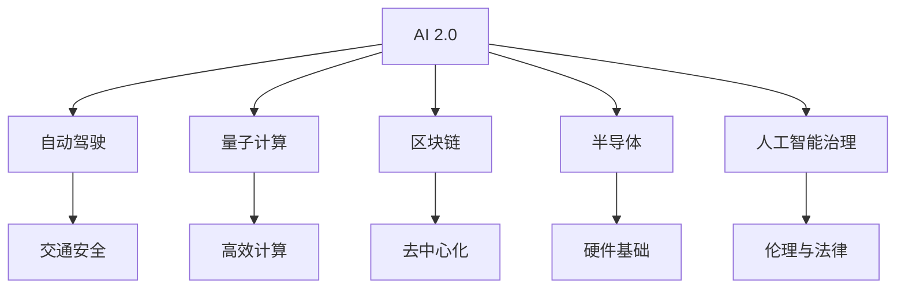

                 

# AI 2.0 时代的投资机会

> 关键词：人工智能, 自动驾驶, 量子计算, 区块链, 半导体, 人工智能治理

## 1. 背景介绍

### 1.1 问题由来
随着技术的不断进步，我们正处于AI 2.0时代的开端。这一时代的显著特征是AI技术的快速发展和广泛应用，正在重塑我们的工作和生活方式。AI 2.0不再局限于学术研究，而是开始大规模商业化应用，对各个行业产生了深远的影响。然而，这一进程也带来了新的投资机会和挑战。

### 1.2 问题核心关键点
AI 2.0时代的核心关键点包括：

- **技术驱动：** 深度学习、自然语言处理、计算机视觉等技术的进步，使得AI算法不断突破瓶颈。
- **应用广泛：** AI技术在自动驾驶、智能医疗、金融科技等领域的应用日益成熟，催生了新的商业模式。
- **跨界融合：** AI技术与其他领域的融合，如量子计算、区块链、物联网等，带来更多创新点。
- **伦理与法律：** AI技术的普及也带来了数据隐私、算法偏见等伦理与法律问题，需要业界共同解决。

## 2. 核心概念与联系

### 2.1 核心概念概述

为更好地理解AI 2.0时代的投资机会，本节将介绍几个密切相关的核心概念：

- **AI 2.0：** 指利用深度学习、强化学习等先进技术，实现智能系统与人类智能并驾齐驱的AI时代。
- **自动驾驶：** 通过AI技术实现汽车自动驾驶，提高交通安全性和效率。
- **量子计算：** 利用量子力学的原理，实现高效的计算和信息处理。
- **区块链：** 一种去中心化的分布式账本技术，具有去信任、安全等特性。
- **半导体：** 微电子设备的核心，是AI硬件基础。
- **人工智能治理：** 包括数据隐私保护、算法透明度、公平性等在内的AI伦理与法律问题。

这些核心概念之间的逻辑关系可以通过以下Mermaid流程图来展示：



这个流程图展示了几大核心概念及其之间的关系：

1. AI 2.0作为核心，驱动了自动驾驶、量子计算、区块链、半导体等多个领域的发展。
2. 自动驾驶是AI 2.0在交通领域的应用，提升了交通安全性和效率。
3. 量子计算利用量子力学的原理，实现了高效的计算和信息处理。
4. 区块链提供了去中心化的分布式账本技术，提升了交易的安全性和透明性。
5. 半导体是AI硬件的基础，提供了算力和存储支持。
6. 人工智能治理则涉及AI技术的伦理与法律问题，确保技术的安全和公平。

这些概念共同构成了AI 2.0时代的宏观框架，为我们提供了理解这一时代的视角和方向。

## 3. 核心算法原理 & 具体操作步骤
### 3.1 算法原理概述

AI 2.0时代，众多技术如深度学习、强化学习等被广泛应用于各个领域。例如，自动驾驶中的驾驶决策算法、自然语言处理中的语言模型等，都依赖于深度学习模型。

以深度学习为例，其核心原理是通过构建多层神经网络，对数据进行特征提取和分类，实现复杂的非线性映射。在训练过程中，模型通过反向传播算法，不断调整权重，最小化损失函数，最终得到一个最优的权重矩阵。

### 3.2 算法步骤详解

以下我们以自动驾驶中的驾驶决策算法为例，阐述深度学习模型在AI 2.0时代的具体应用步骤：

**Step 1: 数据准备**
- 收集自动驾驶汽车所处的路况数据，包括传感器数据、摄像头数据、GPS数据等。
- 对数据进行标注，将真实驾驶路径、决策点作为监督信号。

**Step 2: 模型选择**
- 选择适合自动驾驶任务的深度学习模型，如卷积神经网络(CNN)、循环神经网络(RNN)、长短期记忆网络(LSTM)等。
- 根据具体任务需求，设计模型架构，如输入层、隐藏层、输出层等。

**Step 3: 模型训练**
- 将数据划分为训练集、验证集和测试集，一般采用交叉验证的方法。
- 使用训练集进行模型训练，调整超参数，如学习率、批大小、迭代次数等。
- 在验证集上评估模型性能，防止过拟合。
- 在测试集上最终评估模型效果，优化模型参数。

**Step 4: 模型部署**
- 将训练好的模型部署到自动驾驶系统中，实现实时驾驶决策。
- 定期更新模型参数，保持模型性能。

### 3.3 算法优缺点

深度学习算法在AI 2.0时代的应用，具有以下优点：
1. 强大的学习能力：深度学习模型可以自动学习数据的特征表示，适应复杂数据分布。
2. 高泛化能力：通过大量数据训练，深度学习模型可以泛化到新的数据上。
3. 可解释性强：通过可视化技术，如卷积核可视化、梯度图等，可以揭示模型的决策过程。

但同时，深度学习算法也存在一些缺点：
1. 需要大量数据：深度学习模型通常需要大量标注数据进行训练，数据获取成本较高。
2. 计算资源消耗大：深度学习模型参数众多，训练和推理耗时较长。
3. 模型易过拟合：深度学习模型容易出现过拟合现象，需要采取正则化等方法。
4. 模型复杂度高：深度学习模型的复杂度高，难以理解和调试。

尽管存在这些局限性，但深度学习在AI 2.0时代依然是最为重要的技术之一，广泛应用于自动驾驶、医疗影像分析、自然语言处理等领域。

### 3.4 算法应用领域

深度学习在AI 2.0时代的应用领域广泛，涵盖多个重要领域：

- **自动驾驶：** 通过感知、决策、控制等算法，实现车辆自主驾驶。
- **医疗影像：** 利用深度学习对医学影像进行分类、分割、诊断等。
- **自然语言处理：** 通过语言模型、机器翻译等技术，实现文本生成、语义理解等。
- **金融科技：** 在金融风控、量化交易、智能投顾等方面应用深度学习技术。
- **智能制造：** 利用深度学习进行质量检测、生产优化、机器人控制等。
- **智慧城市：** 在城市管理、公共安全、交通控制等方面应用深度学习技术。

除了这些领域，深度学习还被应用于更多新兴技术中，如量子计算、区块链等，展示出其强大的跨界应用能力。

## 4. 数学模型和公式 & 详细讲解  
### 4.1 数学模型构建

在深度学习中，通常使用反向传播算法进行模型训练。以卷积神经网络(CNN)为例，其数学模型如下：

$$
L = \frac{1}{N}\sum_{i=1}^{N} loss(x_i, \hat{y}_i)
$$

其中 $L$ 为损失函数，$N$ 为样本数量，$x_i$ 为输入样本，$\hat{y}_i$ 为模型预测输出。

在反向传播算法中，模型参数 $w$ 的更新公式为：

$$
\frac{\partial L}{\partial w} = \frac{1}{N}\sum_{i=1}^{N} \frac{\partial loss(x_i, \hat{y}_i)}{\partial w}
$$

通过梯度下降等优化算法，不断调整模型参数，最小化损失函数。

### 4.2 公式推导过程

在卷积神经网络中，通过多层卷积、池化、全连接等操作，逐步提取输入数据的特征。以一个简单的卷积神经网络为例：

$$
x = W_1x + b_1
$$

$$
y = f(W_2x + b_2)
$$

其中 $W_1, W_2$ 为卷积核矩阵，$b_1, b_2$ 为偏置项，$f$ 为激活函数，$x$ 为输入数据，$y$ 为输出数据。

通过多层卷积和池化，可以逐步提取出输入数据的高级特征，最终输入到全连接层进行分类。

### 4.3 案例分析与讲解

以自动驾驶中的目标检测为例，可以利用卷积神经网络进行训练和推理。具体步骤如下：

**Step 1: 数据准备**
- 收集自动驾驶汽车所处的路况数据，如摄像头拍摄的图像数据。
- 对图像进行标注，标记出感兴趣的目标区域，如行人、车辆、交通标志等。

**Step 2: 模型选择**
- 选择适合目标检测任务的卷积神经网络模型，如Faster R-CNN、YOLO等。
- 设计模型架构，如特征提取、区域提议、分类等。

**Step 3: 模型训练**
- 将数据划分为训练集、验证集和测试集，使用交叉验证的方法。
- 使用训练集进行模型训练，调整超参数，如学习率、批大小、迭代次数等。
- 在验证集上评估模型性能，防止过拟合。
- 在测试集上最终评估模型效果，优化模型参数。

**Step 4: 模型部署**
- 将训练好的模型部署到自动驾驶系统中，实现实时目标检测。
- 定期更新模型参数，保持模型性能。

通过目标检测技术，自动驾驶系统可以实时识别和跟踪道路上的各种目标，为驾驶决策提供重要信息。

## 5. 项目实践：代码实例和详细解释说明
### 5.1 开发环境搭建

在进行自动驾驶目标检测的深度学习实践前，我们需要准备好开发环境。以下是使用Python进行TensorFlow开发的环境配置流程：

1. 安装Anaconda：从官网下载并安装Anaconda，用于创建独立的Python环境。

2. 创建并激活虚拟环境：
```bash
conda create -n tf-env python=3.8 
conda activate tf-env
```

3. 安装TensorFlow：根据CUDA版本，从官网获取对应的安装命令。例如：
```bash
conda install tensorflow=2.4 -c pytorch -c conda-forge
```

4. 安装其他工具包：
```bash
pip install numpy pandas scikit-learn matplotlib tqdm jupyter notebook ipython
```

完成上述步骤后，即可在`tf-env`环境中开始深度学习实践。

### 5.2 源代码详细实现

这里我们以Faster R-CNN目标检测为例，给出使用TensorFlow进行自动驾驶目标检测的代码实现。

首先，定义目标检测的数据处理函数：

```python
import tensorflow as tf
from tensorflow.keras.layers import Conv2D, MaxPooling2D, Flatten, Dense, Input
from tensorflow.keras.models import Model
import numpy as np

def process_data(data):
    # 数据预处理，如归一化、裁剪、增强等
    # 返回处理后的输入数据和标签
    pass

# 定义模型架构
def create_model():
    input = Input(shape=(None, None, 3))
    conv1 = Conv2D(64, (3, 3), activation='relu', padding='same')(input)
    pool1 = MaxPooling2D((2, 2))(conv1)
    conv2 = Conv2D(128, (3, 3), activation='relu', padding='same')(pool1)
    pool2 = MaxPooling2D((2, 2))(conv2)
    conv3 = Conv2D(256, (3, 3), activation='relu', padding='same')(pool2)
    pool3 = MaxPooling2D((2, 2))(conv3)
    conv4 = Conv2D(512, (3, 3), activation='relu', padding='same')(pool3)
    pool4 = MaxPooling2D((2, 2))(conv4)
    flatten = Flatten()(pool4)
    dense1 = Dense(4096, activation='relu')(flatten)
    dense2 = Dense(4096, activation='relu')(dense1)
    output = Dense(5, activation='softmax')(dense2)
    model = Model(inputs=input, outputs=output)
    return model

# 加载数据并进行模型训练
model = create_model()
model.compile(optimizer='adam', loss='categorical_crossentropy', metrics=['accuracy'])
data = process_data(train_dataset)
model.fit(data['input'], data['label'], epochs=50, batch_size=32, validation_data=(process_data(dev_dataset)['input'], process_data(dev_dataset)['label']))
```

接下来，训练并测试模型：

```python
# 在测试集上评估模型性能
test_data = process_data(test_dataset)
test_loss, test_acc = model.evaluate(test_data['input'], test_data['label'])
print(f'Test accuracy: {test_acc:.2f}%')
```

以上就是使用TensorFlow进行自动驾驶目标检测的完整代码实现。可以看到，TensorFlow提供了强大的工具链，使得深度学习模型的开发和训练变得简单高效。

### 5.3 代码解读与分析

让我们再详细解读一下关键代码的实现细节：

**process_data函数**：
- 定义了数据预处理函数，包括图像归一化、裁剪、增强等操作。

**create_model函数**：
- 定义了卷积神经网络的模型架构，包括卷积、池化、全连接等层。

**训练函数**：
- 使用交叉验证的方法对数据集进行划分，训练模型并评估性能。

**测试函数**：
- 在测试集上评估模型性能，并输出结果。

**训练流程**：
- 定义总的迭代次数和批次大小，开始循环迭代
- 每个epoch内，在训练集上进行训练，并在验证集上评估性能
- 所有epoch结束后，在测试集上评估最终结果

可以看到，TensorFlow提供了强大的工具链，使得深度学习模型的开发和训练变得简单高效。开发者可以将更多精力放在数据处理、模型改进等高层逻辑上，而不必过多关注底层的实现细节。

当然，工业级的系统实现还需考虑更多因素，如模型的保存和部署、超参数的自动搜索、更灵活的任务适配层等。但核心的深度学习范式基本与此类似。

## 6. 实际应用场景
### 6.1 智能医疗

基于深度学习的医疗影像分析技术，可以为医疗行业带来巨大的变革。例如，利用深度学习对医学影像进行分类、分割、诊断等，可以辅助医生进行疾病诊断和治疗。

在实践应用中，可以通过收集大量的医学影像数据，对深度学习模型进行训练。模型能够自动学习医学影像的特征表示，并对新的影像数据进行分类和诊断。在实际应用中，医生可以通过输入医学影像，由深度学习模型提供初步诊断结果，减少工作量，提高诊断效率和准确性。

### 6.2 金融科技

深度学习在金融科技领域的应用也日益成熟，如风险控制、量化交易、智能投顾等。通过深度学习技术，金融机构可以更加准确地评估风险，提高投资决策的精准度。

在实际应用中，可以收集金融市场的各类数据，对深度学习模型进行训练。模型能够自动学习市场的特征和规律，并根据历史数据和实时数据进行预测和决策。通过深度学习技术，金融机构可以构建更加智能、高效的金融服务体系，提升用户体验和市场竞争力。

### 6.3 智慧城市

在智慧城市建设中，深度学习技术的应用也非常广泛。例如，通过深度学习对城市交通数据进行分析，可以实现智能交通管理，提升城市交通效率。

在实际应用中，可以收集城市交通的各种数据，对深度学习模型进行训练。模型能够自动学习交通数据的特点和规律，并实时调整交通信号灯、优化交通路线，提高城市的交通管理水平。通过深度学习技术，智慧城市可以更加智能、高效地运行，提高城市居民的生活质量。

### 6.4 未来应用展望

未来，深度学习技术在AI 2.0时代将有更广泛的应用前景。以下列举几个未来应用方向：

- **自动驾驶：** 随着技术进步，自动驾驶系统将更加成熟，能够实现更复杂的驾驶任务。
- **医疗影像：** 深度学习在医疗影像分析中的应用将更加深入，辅助医生进行更精准的诊断。
- **金融科技：** 深度学习技术将进一步提升金融机构的决策水平，实现更加智能的金融服务。
- **智慧城市：** 深度学习技术将进一步优化城市管理，提高城市运行效率和居民生活质量。
- **教育科技：** 深度学习在教育中的应用也将更加广泛，如智能辅导、个性化学习等。

## 7. 工具和资源推荐
### 7.1 学习资源推荐

为了帮助开发者系统掌握深度学习技术的理论基础和实践技巧，这里推荐一些优质的学习资源：

1. 《深度学习》书籍：Ian Goodfellow等人所著，系统介绍了深度学习的基本原理和应用实例。
2. CS231n《卷积神经网络》课程：斯坦福大学开设的计算机视觉课程，有Lecture视频和配套作业，是入门深度学习的重要资源。
3. PyTorch官方文档：PyTorch的官方文档，提供了丰富的教程和样例代码，是快速上手深度学习的重要工具。
4. TensorFlow官方文档：TensorFlow的官方文档，提供了详细的使用指南和实例，是深度学习开发的强大工具。
5. Kaggle平台：一个数据科学竞赛平台，提供了大量的深度学习比赛和数据集，是提升深度学习技能的有效途径。

通过对这些资源的学习实践，相信你一定能够快速掌握深度学习技术的精髓，并用于解决实际的AI 2.0问题。

### 7.2 开发工具推荐

高效的深度学习开发离不开优秀的工具支持。以下是几款用于深度学习开发的常用工具：

1. PyTorch：由Facebook开发的开源深度学习框架，灵活高效，支持动态计算图。
2. TensorFlow：由Google主导开发的开源深度学习框架，生产部署方便，支持静态计算图。
3. Keras：一个高层神经网络API，封装了TensorFlow等底层框架，易于使用。
4. Jupyter Notebook：一个交互式开发环境，支持多种语言和库，是深度学习开发的强大工具。
5. Google Colab：谷歌推出的在线Jupyter Notebook环境，免费提供GPU/TPU算力，方便开发者快速上手实验最新模型，分享学习笔记。

合理利用这些工具，可以显著提升深度学习开发的效率，加快创新迭代的步伐。

### 7.3 相关论文推荐

深度学习技术的发展源于学界的持续研究。以下是几篇奠基性的相关论文，推荐阅读：

1. ImageNet Classification with Deep Convolutional Neural Networks（AlexNet论文）：提出了卷积神经网络架构，开启了深度学习在计算机视觉领域的应用。
2. Deep Residual Learning for Image Recognition（ResNet论文）：提出了残差网络，解决了深度网络训练中梯度消失的问题。
3. Attention is All You Need（Transformer论文）：提出了Transformer架构，开启了深度学习在自然语言处理领域的应用。
4. GANs Trained by a Two Time-Scale Update Rule Converge to the Fixed Points of Their Limiting Mode（GAN论文）：提出了生成对抗网络，解决了生成模型难以训练的问题。
5. Generative Adversarial Nets（GAN论文）：提出了生成对抗网络，解决了生成模型难以训练的问题。

这些论文代表了大深度学习领域的发展脉络。通过学习这些前沿成果，可以帮助研究者把握学科前进方向，激发更多的创新灵感。

## 8. 总结：未来发展趋势与挑战
### 8.1 总结

本文对AI 2.0时代的投资机会进行了全面系统的介绍。首先阐述了AI 2.0时代的背景和意义，明确了深度学习技术在这一时代的核心地位。其次，从原理到实践，详细讲解了深度学习算法在自动驾驶、医疗影像、金融科技等领域的实际应用，并给出了具体的代码实现。同时，本文还探讨了深度学习技术的未来发展趋势和面临的挑战，提出了相应的解决方案和展望。

通过本文的系统梳理，可以看到，AI 2.0时代，深度学习技术正广泛应用于各个领域，带来广泛的投资机会。未来，深度学习技术将在自动驾驶、医疗影像、智慧城市等方面继续发挥重要作用，推动社会进步和经济发展。

### 8.2 未来发展趋势

展望未来，深度学习技术在AI 2.0时代将呈现以下几个发展趋势：

1. **模型规模持续增大：** 随着算力成本的下降和数据规模的扩张，深度学习模型的参数量还将持续增长。超大规模模型蕴含的丰富语言知识，有望支撑更加复杂多变的下游任务。
2. **模型结构更加多样化：** 未来的深度学习模型将更加灵活多样，结合不同的任务需求和数据特征，设计出更适合的模型结构。
3. **多模态融合：** 未来的深度学习模型将融合视觉、语音、文本等多种模态信息，实现更全面、准确的信息理解。
4. **跨领域应用：** 深度学习技术将在更多领域得到应用，如教育、医疗、金融等，带来更多创新点。
5. **自适应学习：** 未来的深度学习模型将具备自适应学习能力，能够动态调整模型参数，提升模型性能。
6. **透明性与可解释性：** 未来的深度学习模型将更加透明可解释，便于理解和调试。

这些趋势将进一步提升深度学习技术的性能和应用范围，为AI 2.0时代带来更多创新和突破。

### 8.3 面临的挑战

尽管深度学习技术在AI 2.0时代取得了瞩目成就，但在迈向更加智能化、普适化应用的过程中，它仍面临着诸多挑战：

1. **数据获取与标注成本高：** 深度学习模型通常需要大量标注数据进行训练，数据获取和标注成本较高。
2. **模型复杂度高：** 深度学习模型参数众多，训练和推理耗时较长。
3. **模型易过拟合：** 深度学习模型容易出现过拟合现象，需要采取正则化等方法。
4. **模型解释性不足：** 深度学习模型更像是"黑盒"系统，难以解释其内部工作机制和决策逻辑。
5. **数据隐私与安全问题：** 深度学习模型可能涉及敏感数据，需要保护用户隐私和安全。
6. **伦理与法律问题：** 深度学习技术的广泛应用，可能带来算法偏见、决策不透明等伦理与法律问题。

这些挑战需要在技术、应用和法律等各个层面进行全面应对，才能推动深度学习技术的健康发展。

### 8.4 研究展望

面对深度学习技术面临的挑战，未来的研究需要在以下几个方面寻求新的突破：

1. **无监督与半监督学习：** 摆脱对大规模标注数据的依赖，利用自监督学习、主动学习等无监督和半监督范式，最大限度利用非结构化数据，实现更加灵活高效的深度学习模型。
2. **模型压缩与优化：** 开发更加轻量级、高效化的深度学习模型，如剪枝、量化、稀疏化等，提高模型的推理速度和资源利用率。
3. **跨领域知识融合：** 将符号化的先验知识，如知识图谱、逻辑规则等，与深度学习模型进行融合，增强模型的智能性和普适性。
4. **透明性与可解释性：** 利用可视化技术、因果分析方法等，增强深度学习模型的透明性与可解释性，便于理解和调试。
5. **伦理与法律约束：** 在深度学习模型设计中引入伦理导向的评估指标，过滤和惩罚有偏见、有害的输出倾向，确保模型行为符合人类价值观和伦理道德。

这些研究方向将引领深度学习技术迈向更高的台阶，为构建安全、可靠、可解释、可控的智能系统铺平道路。

## 9. 附录：常见问题与解答

**Q1：深度学习是否适用于所有NLP任务？**

A: 深度学习在自然语言处理领域有广泛应用，如文本分类、机器翻译、文本生成等，但在某些特定领域，如法律、医学等，可能需要结合领域知识进行进一步优化。

**Q2：深度学习模型在训练过程中如何避免过拟合？**

A: 深度学习模型容易出现过拟合现象，一般采用以下方法：
1. 数据增强：通过数据扩充、数据增强等技术，增加数据多样性。
2. 正则化：如L2正则、Dropout等，限制模型的复杂度。
3. 早期停止：在验证集上监测模型性能，一旦性能不再提升，停止训练。
4. 模型简化：减小模型规模，简化模型结构。
5. 集成学习：通过多个模型的集成，提升模型的泛化能力。

**Q3：如何选择合适的深度学习框架进行开发？**

A: 选择合适的深度学习框架需考虑以下因素：
1. 易用性：框架是否易于上手和使用，是否提供了丰富的API和工具。
2. 性能：框架的计算速度、内存占用等性能是否满足需求。
3. 社区支持：框架是否有活跃的社区和丰富的资源，便于学习交流和问题解决。
4. 开源性与灵活性：框架是否开源，是否支持自定义模型架构和训练流程。

常用的深度学习框架包括PyTorch、TensorFlow、Keras等，开发者可根据项目需求进行选择。

**Q4：深度学习技术在未来有哪些新的发展方向？**

A: 未来深度学习技术的发展方向包括：
1. 无监督与半监督学习：利用非结构化数据进行训练，摆脱对大规模标注数据的依赖。
2. 自适应学习：能够动态调整模型参数，提升模型性能和适应性。
3. 多模态融合：融合视觉、语音、文本等多种模态信息，实现更全面、准确的信息理解。
4. 透明性与可解释性：增强深度学习模型的透明性与可解释性，便于理解和调试。
5. 跨领域应用：将深度学习技术应用于更多领域，如教育、医疗、金融等，带来更多创新点。

这些方向将引领深度学习技术迈向更高的台阶，为构建安全、可靠、可解释、可控的智能系统铺平道路。

---

作者：禅与计算机程序设计艺术 / Zen and the Art of Computer Programming

