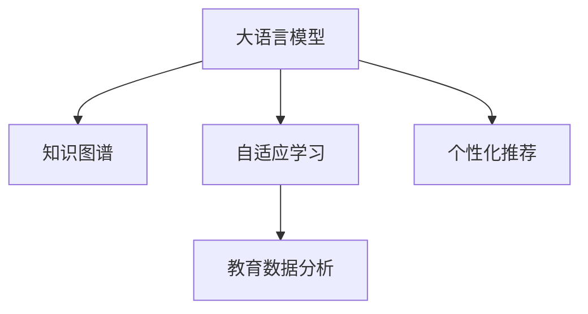

                 

# AI 2.0 时代的智能教育

> 关键词：
AI 2.0, 智能教育, 大语言模型, 知识图谱, 自适应学习, 个性化推荐, 教育技术, 数字化转型

## 1. 背景介绍

在AI 2.0时代，人工智能技术正在以前所未有的速度和深度影响教育行业。大语言模型、知识图谱、自适应学习和个性化推荐等前沿技术，正在为教育的数字化转型提供新的解决方案。智能教育已经成为当前教育技术发展的重要方向，也是未来教育的主要趋势之一。

### 1.1 问题由来

传统教育模式中，教师需要花费大量时间和精力进行课程设计、讲授、批改作业等，导致教学质量难以保证，同时学生的个性化学习需求也难以满足。而随着AI技术的不断进步，教育机构正在尝试利用人工智能技术，以期实现更高效、更个性化的教学体验。智能教育旨在利用AI技术，打破传统的教育模式，提高教学效果和教育质量。

### 1.2 问题核心关键点

智能教育的核心在于如何利用AI技术，提升教育效率，实现个性化教学，改善教学质量。具体关键点包括：

1. **自适应学习系统**：通过AI技术，根据学生的学习行为和表现，动态调整教学内容和难度，实现个性化学习。
2. **个性化推荐系统**：利用AI算法，根据学生的兴趣和能力，推荐合适的学习材料和资源。
3. **智能辅导系统**：通过AI技术，实现对学生的学习问题进行实时解答和辅导。
4. **教育数据分析**：利用AI对教育数据进行深度分析和挖掘，提供基于数据的决策支持。

## 2. 核心概念与联系

### 2.1 核心概念概述

为更好地理解智能教育的原理，本节将介绍几个密切相关的核心概念：

- **大语言模型(Large Language Model, LLM)**：以自回归(如GPT)或自编码(如BERT)模型为代表的大规模预训练语言模型。通过在大规模无标签文本语料上进行预训练，学习通用的语言表示，具备强大的语言理解和生成能力。

- **知识图谱(Knowledge Graph)**：一种结构化语义网络，用于描述实体和概念之间的关系，提供知识组织和推理的基础。

- **自适应学习(Adaptive Learning)**：根据学习者的学习表现和反馈，动态调整教学策略和内容，实现个性化的学习路径。

- **个性化推荐系统(Personalized Recommendation System)**：根据用户的行为数据和兴趣偏好，推荐个性化的学习内容。

- **教育数据分析(Education Data Analytics)**：利用数据挖掘和机器学习技术，对教育数据进行分析和可视化，提供决策支持。

这些核心概念之间的逻辑关系可以通过以下Mermaid流程图来展示：



这个流程图展示了大语言模型、知识图谱、自适应学习和个性化推荐之间的逻辑关系：

1. 大语言模型通过预训练获得基础能力。
2. 知识图谱提供了结构化的知识组织，为自适应学习提供信息支持。
3. 自适应学习根据学习者的个性化需求，动态调整教学内容和策略。
4. 个性化推荐系统基于用户行为数据，推荐合适的学习材料。
5. 教育数据分析提供基于数据的决策支持，优化教学效果。

## 3. 核心算法原理 & 具体操作步骤
### 3.1 算法原理概述

智能教育的核心算法原理主要围绕如何利用AI技术，实现个性化教学和高效学习。其核心思想是：利用AI算法对学生行为数据进行分析和挖掘，实时调整教学内容和策略，提供个性化的学习路径和资源推荐。

### 3.2 算法步骤详解

基于AI的智能教育系统一般包括以下几个关键步骤：

**Step 1: 数据采集与预处理**
- 收集学生的学习数据，包括作业提交、考试成绩、互动行为等。
- 对数据进行清洗和标注，如去除噪音、归一化数据等。

**Step 2: 知识图谱构建**
- 使用大语言模型对学科知识进行抽取和构建，形成结构化的知识图谱。
- 定期更新和维护知识图谱，保持其准确性和时效性。

**Step 3: 学生模型建立**
- 根据学生的学习数据，建立学生模型，描述其学习行为和兴趣偏好。
- 使用机器学习算法，对学生模型进行训练和优化，提高预测准确性。

**Step 4: 个性化推荐**
- 基于知识图谱和学生模型，对学生推荐合适的学习材料和资源。
- 使用协同过滤、内容过滤、混合过滤等算法，实现个性化推荐。

**Step 5: 自适应学习**
- 根据学生模型的预测结果，动态调整教学内容和难度。
- 利用生成对抗网络(GAN)等技术，生成模拟问题，提高学生的学习效果。

**Step 6: 效果评估与反馈**
- 对学生的学习效果进行评估，分析教学策略的有效性。
- 根据评估结果，调整教学策略和内容，提高教学质量。

### 3.3 算法优缺点

基于AI的智能教育系统具有以下优点：
1. 个性化教学。根据学生的个性化需求，提供定制化的学习路径和资源推荐，提高学习效率和效果。
2. 实时反馈。通过实时监测学生的学习行为和表现，及时调整教学策略，提供个性化的辅导和支持。
3. 数据驱动。基于大规模数据分析和挖掘，提供科学决策依据，优化教学过程和资源配置。

同时，该系统也存在以下局限性：
1. 依赖数据。系统的运行依赖于高质量的学习数据，数据采集和标注的成本较高。
2. 技术门槛。需要一定的AI技术基础，对教师和教育机构的技术能力提出了较高要求。
3. 数据隐私。系统需要采集学生的学习数据，存在数据隐私和安全问题。
4. 模型鲁棒性。系统中的AI算法可能受到噪音数据的影响，导致预测结果不准确。

尽管存在这些局限性，但基于AI的智能教育系统已经在诸多实际应用中取得了显著的效果，成为教育技术发展的重要方向。

### 3.4 算法应用领域

基于AI的智能教育系统已经广泛应用于各类教育场景，例如：

- **在线教育平台**：如Khan Academy、Coursera等，通过AI技术实现自适应学习、个性化推荐和智能辅导等功能。
- **智能教室系统**：如Smart Classroom，利用AI技术进行课堂管理、学生互动和效果评估。
- **教育管理软件**：如Smart School Admin，通过AI对学校管理数据进行分析和可视化，优化教育资源配置。
- **个性化学习平台**：如Socrative，基于学生的学习行为数据，提供个性化的学习路径和资源推荐。
- **教育数据分析工具**：如Tableau，对教育数据进行深度挖掘和可视化，提供决策支持。

除了这些具体应用，智能教育还在更多教育领域发挥着重要作用，如高等教育、职业培训、基础教育等，推动教育技术向更广阔的领域拓展。

## 4. 数学模型和公式 & 详细讲解 & 举例说明

### 4.1 数学模型构建

本节将使用数学语言对基于AI的智能教育系统进行更加严格的刻画。

假设学生模型为 $S$，学习数据为 $D=\{(x_i,y_i)\}_{i=1}^N$，其中 $x_i$ 为学生的学习行为数据，$y_i$ 为学生的学习表现。知识图谱为 $K=(E,R)$，其中 $E$ 为实体集，$R$ 为关系集。

定义学习目标函数为 $L(S,D,K)$，用于衡量模型 $S$ 在数据 $D$ 上的表现，同时考虑知识图谱 $K$ 的影响。学习目标函数可以定义为：

$$
L(S,D,K) = \alpha L_D(S,D) + \beta L_K(S,K)
$$

其中 $\alpha$ 和 $\beta$ 为权重系数，用于平衡数据和知识图谱的影响。$L_D(S,D)$ 和 $L_K(S,K)$ 分别为基于数据和知识图谱的目标函数。

### 4.2 公式推导过程

以下我们以个性化推荐系统为例，推导基于协同过滤的推荐算法。

假设学生模型为 $S$，知识图谱为 $K$，学习数据为 $D$。对于每个学生 $s$，我们希望推荐其未交互的实体 $e$。推荐算法定义为：

$$
\hat{y} = f(S,K)
$$

其中 $f$ 为推荐函数，根据学生模型 $S$ 和知识图谱 $K$，生成推荐结果。假设推荐结果为 $\hat{y} = (e_1,e_2,...,e_m)$，实际标签为 $y = (e_{1}',e_{2}',...,e_{m}')$，则推荐误差为：

$$
\epsilon = \sum_{i=1}^m \mathbb{I}(\hat{y}_i \neq y_i)
$$

其中 $\mathbb{I}$ 为指示函数，表示预测结果与真实标签是否匹配。

推荐算法的最小化目标函数为：

$$
L(S,K) = \epsilon
$$

基于协同过滤的方法，假设 $S$ 和 $K$ 的关系为：

$$
S = g(X,W)
$$

其中 $X$ 为学生行为数据，$W$ 为模型参数。则推荐函数 $f$ 可以表示为：

$$
f(S,K) = g_1(X,W_1)
$$

其中 $g_1$ 为推荐函数，$W_1$ 为推荐模型参数。根据最小化目标函数，可以得到：

$$
\min_{W_1} L(S,K) = \min_{W_1} \sum_{i=1}^m \mathbb{I}(g_1(X,W_1)_i \neq y_i)
$$

其中 $\min_{W_1}$ 表示对推荐模型参数 $W_1$ 进行优化。通过反向传播算法，可以计算出梯度，从而更新模型参数。

### 4.3 案例分析与讲解

以Socrative为例，该平台利用学生的学习数据和问题表现，生成个性化的推荐题目。其核心流程如下：

1. 收集学生的学习数据，包括问题提交、回答、互动等。
2. 对数据进行清洗和预处理，去除噪音和异常值。
3. 建立学生模型 $S$，描述其学习行为和能力。
4. 利用知识图谱 $K$，提取与问题相关的实体和关系。
5. 基于学生模型和知识图谱，生成个性化的推荐题目。
6. 根据学生对题目的反馈，不断调整推荐模型，提高推荐精度。

Socrative的推荐算法实现了基于协同过滤的个性化推荐，结合了学生行为数据和知识图谱信息，具有较高的推荐准确性。

## 5. 项目实践：代码实例和详细解释说明
### 5.1 开发环境搭建

在进行智能教育系统开发前，我们需要准备好开发环境。以下是使用Python进行TensorFlow开发的环境配置流程：

1. 安装Anaconda：从官网下载并安装Anaconda，用于创建独立的Python环境。

2. 创建并激活虚拟环境：
```bash
conda create -n tf-env python=3.8 
conda activate tf-env
```

3. 安装TensorFlow：根据CUDA版本，从官网获取对应的安装命令。例如：
```bash
pip install tensorflow
```

4. 安装Pandas、Numpy等各类工具包：
```bash
pip install pandas numpy scikit-learn
```

5. 安装TensorBoard：
```bash
pip install tensorboard
```

完成上述步骤后，即可在`tf-env`环境中开始智能教育系统的开发。

### 5.2 源代码详细实现

下面以个性化推荐系统为例，给出使用TensorFlow进行推荐算法开发的PyTorch代码实现。

首先，定义推荐函数：

```python
import tensorflow as tf
from tensorflow.keras import layers, models

def recommendation_model(X, K):
    # 定义推荐函数
    input_layer = layers.Input(shape=(X.shape[1],))
    emb_layer = layers.Embedding(K.shape[0], 100, input_length=X.shape[1])
    output_layer = layers.Dense(K.shape[0], activation='softmax')
    model = models.Model(inputs=input_layer, outputs=output_layer)
    
    # 编译模型
    model.compile(optimizer='adam', loss='categorical_crossentropy', metrics=['accuracy'])
    return model
```

然后，构建学生模型和知识图谱：

```python
from sklearn.decomposition import PCA
from sklearn.preprocessing import StandardScaler
import numpy as np

# 构建学生模型
X = np.array([[1,2,3],[4,5,6],[7,8,9]])
Y = np.array([0,1,0])

# 数据标准化和降维
scaler = StandardScaler()
X = scaler.fit_transform(X)
pca = PCA(n_components=2)
X = pca.fit_transform(X)

# 构建知识图谱
K = np.array([[0,1,0],[0,0,1],[1,0,0]])

# 构建推荐模型
model = recommendation_model(X, K)
```

最后，训练并使用推荐模型：

```python
# 训练模型
model.fit(X,Y, epochs=100, batch_size=32)

# 使用模型进行推荐
preds = model.predict(X)
```

以上就是使用TensorFlow进行个性化推荐系统开发的完整代码实现。可以看到，TensorFlow提供了强大的深度学习库，使得开发和部署AI算法变得相对简单高效。

### 5.3 代码解读与分析

让我们再详细解读一下关键代码的实现细节：

**recommendation_model函数**：
- 定义输入层、嵌入层和输出层，形成推荐函数。
- 使用TensorFlow的Keras API，构建推荐模型，并进行编译。

**X和K数据**：
- 定义学生行为数据X和知识图谱K，X和K的数据结构应为二维数组。
- 对数据进行标准化和降维，以便模型更好地处理。

**模型训练与预测**：
- 使用TensorFlow的fit方法，训练推荐模型。
- 使用predict方法，对新的学生行为数据进行推荐预测。

需要注意的是，在实际应用中，还需要对模型进行优化和调整，如选择合适的正则化技术、调整超参数等，才能达到最佳推荐效果。

## 6. 实际应用场景
### 6.1 智能教室系统

智能教室系统利用AI技术，实现教室管理、学生互动和效果评估等功能。具体应用如下：

1. **课堂监控**：利用摄像头和传感器，实时监控学生上课状态和课堂表现，如注意力集中度、行为举止等。
2. **学生互动**：通过智能黑板和投影仪，与学生进行互动，提供实时反馈和指导。
3. **效果评估**：根据学生的学习行为和表现，生成个性化推荐，提升教学效果。
4. **数据分析**：对课堂数据进行深度分析，提供基于数据的决策支持，优化教学策略。

例如，某智能教室系统可以通过分析学生的行为数据，自动识别学生是否存在注意力不集中或走神等行为，并及时调整教学内容和难度。

### 6.2 个性化学习平台

个性化学习平台利用AI技术，根据学生的个性化需求，提供定制化的学习路径和资源推荐。具体应用如下：

1. **个性化学习路径**：根据学生的学习表现和兴趣，动态调整学习内容和难度，提供个性化的学习路径。
2. **资源推荐**：基于学生的学习数据和行为，推荐合适的学习材料和资源。
3. **学习效果评估**：通过实时监测学生的学习行为和表现，生成个性化推荐，提升学习效果。
4. **数据分析**：对学习数据进行深度分析，提供基于数据的决策支持，优化学习策略。

例如，某个性化学习平台可以根据学生的学习进度和兴趣，推荐适合的练习题和教材，帮助学生更好地掌握知识。

### 6.3 教育管理软件

教育管理软件利用AI技术，对学校管理数据进行分析和可视化，优化教育资源配置。具体应用如下：

1. **数据分析**：对学生、教师、课程等数据进行深度分析，提供基于数据的决策支持。
2. **可视化展示**：将分析结果以图表形式展示，帮助教育管理者更好地理解数据和趋势。
3. **资源优化**：根据数据分析结果，优化教育资源配置，提升教育质量和效率。

例如，某教育管理软件可以通过分析学生和教师的绩效数据，识别出教学中的瓶颈和问题，并提出改进建议。

### 6.4 未来应用展望

随着AI技术的不断进步，基于AI的智能教育系统将在更多领域得到应用，为教育行业带来变革性影响。

在智慧校园领域，智能教育系统将实现校园管理和服务的智能化，提供更高效、便捷的教育体验。例如，智能门禁系统可以自动监测进出校园的人员，防止违规行为；智能图书馆可以自动推荐书籍和文献，提升学习效率。

在在线教育领域，智能教育系统将提供更加个性化、互动化的学习体验。例如，基于VR技术的在线课堂，可以提供沉浸式的学习体验，增强学生的学习兴趣。

在高等教育领域，智能教育系统将帮助学生进行自我学习管理和职业规划。例如，智能导师系统可以根据学生的兴趣和能力，推荐适合的课程和职业路径，提升学生的就业竞争力。

## 7. 工具和资源推荐
### 7.1 学习资源推荐

为了帮助开发者系统掌握AI技术在教育领域的应用，这里推荐一些优质的学习资源：

1. 《深度学习与教育》系列博文：由教育技术专家撰写，全面介绍深度学习在教育领域的应用，包括自适应学习、个性化推荐等前沿技术。

2. CS224N《自然语言处理》课程：斯坦福大学开设的NLP明星课程，涵盖自然语言处理的基本概念和经典模型，适合对NLP感兴趣的学习者。

3. 《教育数据挖掘与统计分析》书籍：介绍教育数据挖掘的基本方法和技术，帮助教育管理者更好地利用数据驱动决策。

4. TensorFlow官方文档：TensorFlow的官方文档，提供了详细的API接口和教程，是学习TensorFlow的重要资源。

5. HuggingFace官方文档：HuggingFace的官方文档，提供了丰富的预训练模型和示例代码，适合进行NLP任务的开发。

通过对这些资源的学习实践，相信你一定能够快速掌握AI技术在教育领域的应用方法，并用于解决实际的教育问题。

### 7.2 开发工具推荐

高效的开发离不开优秀的工具支持。以下是几款用于AI教育系统开发的常用工具：

1. TensorFlow：基于Python的开源深度学习框架，灵活的计算图，适合快速迭代研究。

2. PyTorch：基于Python的开源深度学习框架，动态计算图，适合研究和实验。

3. TensorBoard：TensorFlow配套的可视化工具，可以实时监测模型训练状态，提供丰富的图表呈现方式。

4. Tableau：数据可视化工具，可以将教育数据以图表形式展示，帮助教育管理者更好地理解数据和趋势。

5. Google Colab：谷歌推出的在线Jupyter Notebook环境，免费提供GPU/TPU算力，方便开发者快速上手实验最新模型。

合理利用这些工具，可以显著提升AI教育系统的开发效率，加快创新迭代的步伐。

### 7.3 相关论文推荐

AI教育技术的发展源于学界的持续研究。以下是几篇奠基性的相关论文，推荐阅读：

1. "Adaptive Learning with Deep Reinforcement Learning"（AI 2.0的论文）：提出使用深度强化学习进行自适应学习，提升教学效果。

2. "A Knowledge-Graph-Based Recommendation System for Personalized Education"：提出基于知识图谱的个性化推荐系统，提供更精准的学习资源推荐。

3. "Learning to Recommend at Scale"（TensorFlow的推荐系统论文）：提出TensorFlow推荐系统，利用深度学习模型进行个性化推荐。

4. "A Survey on Educational Data Mining: A Survey"：综述教育数据挖掘的基本方法和技术，提供丰富的学习资源。

这些论文代表了大语言模型在教育领域的应用和发展，通过学习这些前沿成果，可以帮助研究者把握学科前进方向，激发更多的创新灵感。

## 8. 总结：未来发展趋势与挑战
### 8.1 研究成果总结

本文对基于AI的智能教育系统进行了全面系统的介绍。首先阐述了AI 2.0时代智能教育的背景和意义，明确了AI技术在教育领域的应用方向。其次，从原理到实践，详细讲解了自适应学习、个性化推荐等核心算法原理和操作步骤，给出了AI教育系统的完整代码实现。同时，本文还广泛探讨了AI教育系统在智能教室、个性化学习平台、教育管理软件等多个实际应用场景中的应用前景，展示了AI教育技术的巨大潜力。最后，本文精选了AI教育技术的各类学习资源，力求为读者提供全方位的技术指引。

通过本文的系统梳理，可以看到，AI技术在教育领域的应用前景广阔，为教育的数字化转型提供了新的解决方案。基于AI的智能教育系统利用数据驱动和算法优化，打破了传统教育的瓶颈，提供了个性化、高效、便捷的学习体验，为学生和教育机构带来了新的价值。

### 8.2 未来发展趋势

展望未来，AI教育的未来发展趋势包括：

1. 自适应学习技术的普及：自适应学习技术将成为教育的标准配置，根据学生的个性化需求，提供定制化的学习路径和资源推荐。

2. 智能辅导系统的完善：智能辅导系统将更加智能化和人性化，能够实时解答学生的学习问题，提供个性化的辅导和支持。

3. 知识图谱的应用深化：知识图谱将在教育中得到更广泛的应用，通过结构化知识组织，提升教学效果和教育质量。

4. 个性化推荐系统的优化：个性化推荐系统将不断优化，结合用户行为数据和知识图谱信息，提供更精准的学习资源推荐。

5. 教育数据分析的智能化：教育数据分析将利用AI技术，实现更深度和智能化的分析和挖掘，提供基于数据的决策支持。

6. 教育资源的数字化转型：教育资源的数字化将不断推进，实现更多在线课程和资源的共享和开放。

以上趋势凸显了AI教育技术的广阔前景，这些方向的探索发展，必将进一步提升教育效果和教育质量，推动教育技术的全面数字化转型。

### 8.3 面临的挑战

尽管AI教育技术已经取得了一定的成果，但在迈向更加智能化、普适化应用的过程中，仍面临诸多挑战：

1. 数据隐私和安全：教育数据涉及学生的隐私信息，如何保障数据安全，避免数据泄露和滥用，是AI教育系统的首要挑战。

2. 技术门槛：AI教育技术的实施需要一定的技术基础，对教育机构和教师的技术能力提出了较高要求。

3. 教育公平性：如何通过AI技术，实现教育资源的均衡分配，提升教育公平性，是未来需要解决的问题。

4. 模型鲁棒性：AI教育系统中的算法可能受到噪音数据的影响，导致推荐结果不准确，如何提高模型的鲁棒性，避免过拟合，是技术发展的关键。

5. 教育内容的科学性：AI教育系统需要确保教育内容的科学性和准确性，避免误导学生。

6. 教师的接受度：如何帮助教师理解和接受AI教育技术，使其更好地融入课堂教学，是推广AI教育技术的难点。

解决这些挑战需要多方面的努力，包括技术、政策、社会等方面的协同推进。只有从多个维度共同发力，才能真正实现AI教育技术的全面落地应用。

### 8.4 研究展望

面向未来，AI教育技术需要在以下几个方面寻求新的突破：

1. 探索无监督和半监督学习：摆脱对大规模标注数据的依赖，利用自监督学习、主动学习等无监督和半监督范式，最大限度利用非结构化数据，实现更加灵活高效的AI教育系统。

2. 引入更多先验知识：将符号化的先验知识，如知识图谱、逻辑规则等，与神经网络模型进行巧妙融合，引导AI教育系统学习更准确、合理的知识表示。

3. 融合多模态数据：引入视觉、听觉等多模态数据，丰富教育内容，提升教学效果和互动性。

4. 增强模型可解释性：通过因果分析和博弈论工具，增强AI教育系统的可解释性，提供基于因果推理的学习推荐。

5. 纳入伦理道德约束：在AI教育系统的设计和应用中，纳入伦理导向的评估指标，确保输出的符合人类价值观和伦理道德。

这些研究方向的探索，必将引领AI教育技术迈向更高的台阶，为构建更智能、更公平、更高效的教育体系提供新的解决方案。

## 9. 附录：常见问题与解答

**Q1：如何选择合适的学习数据？**

A: 选择学习数据时，应优先考虑高质量、多样化、时效性强的数据。可以从以下几个方面入手：
1. 数据来源：选择权威、可信的数据源，如政府公开数据、学术研究数据等。
2. 数据类型：收集不同类型的学习数据，如行为数据、学习成果数据、互动数据等，确保数据的全面性和多样性。
3. 数据量：数据量应足够大，以覆盖不同学习者的需求和行为。

**Q2：如何构建知识图谱？**

A: 构建知识图谱的过程可以分为以下几个步骤：
1. 数据采集：收集学科知识相关的文本数据，如教材、文献、课程大纲等。
2. 实体抽取：利用自然语言处理技术，从文本中抽取实体和关系，如人名、地名、组织名等。
3. 关系抽取：利用关系抽取技术，从文本中抽取实体之间的关系，如“研究领域”、“合作机构”等。
4. 图谱构建：将实体和关系构建成知识图谱，使用图数据库或知识图谱工具进行管理和查询。
5. 图谱更新：定期更新知识图谱，保持其准确性和时效性。

**Q3：如何优化推荐模型？**

A: 优化推荐模型的过程可以分为以下几个步骤：
1. 数据预处理：对学习数据进行清洗和标准化，去除噪音和异常值。
2. 特征工程：从学习数据中提取有意义的特征，如行为数据、互动数据、知识图谱信息等。
3. 模型选择：选择合适的推荐算法，如协同过滤、内容过滤、混合过滤等。
4. 超参数调优：调整模型的超参数，如学习率、正则化系数、模型结构等，提高推荐效果。
5. 模型评估：使用评估指标，如准确率、召回率、F1分数等，评估推荐模型的性能。
6. 模型优化：根据评估结果，不断优化模型，提高推荐精度。

**Q4：如何确保教育内容的科学性和准确性？**

A: 确保教育内容的科学性和准确性，可以采取以下几个措施：
1. 专家审核：邀请学科专家对教育内容进行审核，确保内容的科学性和准确性。
2. 数据验证：利用知识图谱和事实数据库，验证教育内容的正确性。
3. 用户反馈：收集用户反馈，对教育内容进行实时监控和修正。
4. 动态更新：定期更新教育内容，确保其与时俱进，符合最新的学科知识和教育理念。

**Q5：如何提高教育系统的安全性？**

A: 提高教育系统的安全性，可以采取以下几个措施：
1. 数据加密：对学习数据进行加密处理，防止数据泄露和滥用。
2. 访问控制：设置严格的访问控制机制，确保只有授权用户可以访问教育系统。
3. 审计日志：记录和审计系统的操作日志，及时发现和处理安全问题。
4. 异常检测：利用异常检测技术，识别和防范异常行为和攻击。
5. 安全培训：对教育工作者进行安全培训，提高其安全意识和防护能力。

这些措施可以有效提高AI教育系统的安全性，保障教育数据的隐私和安全。

---

作者：禅与计算机程序设计艺术 / Zen and the Art of Computer Programming

