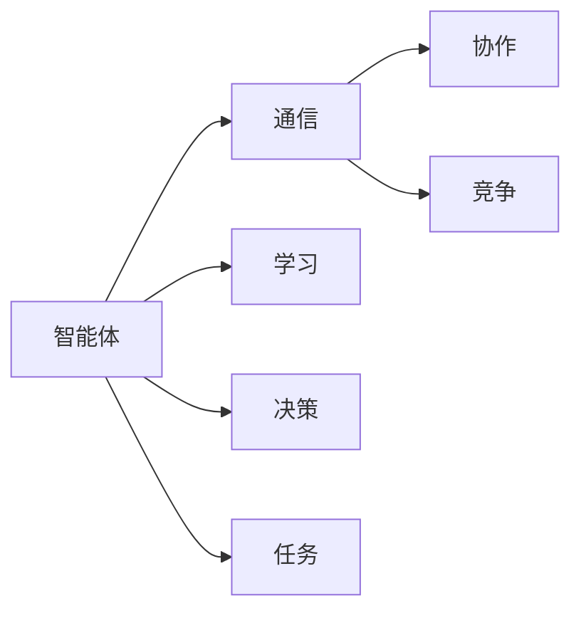

                 

# AI Agent: AI的下一个风口 多智能体系统的未来

> 关键词：多智能体系统(Multi-Agent System, MAS), 强化学习(Reinforcement Learning, RL), 分布式优化(Distributed Optimization), 自动推理与决策(Autonomous Reasoning and Decision), 分布式协作与通信(Distributed Collaboration and Communication)

## 1. 背景介绍

### 1.1 问题由来

随着人工智能(AI)技术的不断成熟，AI在许多领域的应用已经取得了显著成效，但仍然存在一些瓶颈问题，如数据孤岛、信息孤岛、决策孤岛等。而多智能体系统(MAS)提供了一种新的研究思路，通过多智能体的协同合作，实现更高效的决策和优化。

MAS由多个具有自主决策能力的智能体组成，它们在开放的、不确定的环境中进行交互和协作，共同完成复杂的任务。MAS广泛应用在机器人、智能交通、社交网络、电力系统等诸多领域。

### 1.2 问题核心关键点

多智能体系统的核心在于如何设计一种能够自主学习、协作与竞争的机制，通过多智能体的交互来达到更高效的目标。

核心问题包括：

1. 如何在多智能体之间进行有效的通信和协调，避免信息的孤岛。
2. 如何设计智能体的学习机制，使其能够自主地适应环境变化。
3. 如何设计智能体的协作机制，使得它们能够协作完成复杂的任务。
4. 如何设计智能体的竞争机制，使得它们能够在合作中竞争，达到更好的结果。
5. 如何设计和分析多智能体系统的整体性能，如安全性、可扩展性、鲁棒性等。

## 2. 核心概念与联系

### 2.1 核心概念概述

多智能体系统(MAS)是一个由多个智能体(Agent)组成的分布式系统，这些智能体具有自治性和交互性，能够感知环境，自主做出决策，并通过通信交换信息，协调合作完成任务。

多智能体系统包括以下关键概念：

1. **智能体(Agent)**：具有自主决策能力的个体，通常由一个或多个实体组成。
2. **通信渠道(Communication Channel)**：智能体之间交互的信息载体。
3. **通信协议(Communication Protocol)**：智能体之间的通信规则和协议。
4. **协作(Cooperation)**：智能体之间互相支持、互利共赢的交互模式。
5. **竞争(Competition)**：智能体之间争夺资源、地位或收益的交互模式。
6. **学习(Learning)**：智能体通过与环境的交互，自主地学习到策略或知识。
7. **决策(Decision)**：智能体根据自身目标和环境信息做出决策的过程。

### 2.2 核心概念原理和架构的 Mermaid 流程图



这个流程图展示了多智能体系统的核心组件和交互关系。智能体通过通信渠道进行协作与竞争，同时通过学习机制不断优化决策过程，最终完成指定的任务。

## 3. 核心算法原理 & 具体操作步骤

### 3.1 算法原理概述

多智能体系统的核心算法原理主要围绕着强化学习(RL)、分布式优化和自动推理与决策展开。

**强化学习**：智能体通过与环境的交互，学习到最优策略，使得其能够最大化累积奖励。

**分布式优化**：多智能体系统中的优化问题往往是分布式的，智能体之间需要通过协作或竞争的方式进行优化。

**自动推理与决策**：智能体需要根据自身目标和环境信息，做出合理的决策，优化整体系统的性能。

### 3.2 算法步骤详解

**Step 1: 定义智能体和环境**

- 智能体设计：根据任务需求设计智能体的结构和功能。如简单决策器、状态观察器、动作执行器等。
- 环境设计：定义智能体的操作空间和奖励函数。环境可以是一个虚拟仿真环境，也可以是一个实际物理环境。

**Step 2: 设计通信协议和协作机制**

- 通信协议设计：选择合适的通信机制，如直接通信、中介通信、分层通信等。
- 协作机制设计：设计智能体之间的协作方式，如集中式、分布式、混合式等。

**Step 3: 选择强化学习算法**

- 强化学习算法选择：根据任务特性和智能体的学习目标，选择合适的强化学习算法，如Q-Learning、SARSA、Actor-Critic等。

**Step 4: 实施分布式优化**

- 优化目标设计：明确优化目标和约束条件。如最大化系统收益、最小化资源消耗、提高系统鲁棒性等。
- 分布式优化算法选择：选择合适的分布式优化算法，如P2P算法、集中式优化算法等。

**Step 5: 实施自动推理与决策**

- 推理与决策模型设计：选择合适的推理与决策模型，如模型预测、规划、搜索等。
- 推理与决策算法选择：选择合适的推理与决策算法，如深度强化学习、马尔可夫决策过程等。

**Step 6: 测试和优化**

- 实验设计：在仿真环境或实际环境中进行实验，测试系统的性能。
- 优化调整：根据实验结果进行优化调整，如调整智能体结构、通信协议、学习算法等。

### 3.3 算法优缺点

**优点**：

1. **高可扩展性**：多智能体系统能够通过添加智能体和调整结构来扩展系统的规模。
2. **高鲁棒性**：通过分布式优化和协同合作，系统能够更好地应对不确定性和异常情况。
3. **高适应性**：智能体能够根据环境变化自主学习和适应，提高系统的灵活性。

**缺点**：

1. **复杂度高**：系统的设计和实现相对复杂，需要协调多个智能体的交互和协作。
2. **通信开销大**：智能体之间的通信开销可能会影响系统的性能。
3. **局部最优解**：如果缺乏有效的协作和优化机制，智能体可能陷入局部最优解。

### 3.4 算法应用领域

多智能体系统在许多领域都有广泛的应用，如：

1. **机器人**：协作机器人、无人驾驶、人机交互等。
2. **智能交通**：交通流量优化、交通信号控制、自动驾驶等。
3. **电力系统**：电力市场优化、分布式发电、智能电网等。
4. **社会网络**：社交推荐、内容分发、网络治理等。
5. **医疗系统**：医疗资源分配、诊断决策、健康管理等。

## 4. 数学模型和公式 & 详细讲解 & 举例说明

### 4.1 数学模型构建

多智能体系统的数学模型通常包括状态空间、动作空间、奖励函数、通信机制等。

假设系统中有 $n$ 个智能体，每个智能体的状态为 $x_i \in X$，动作为 $u_i \in U$，奖励函数为 $r_i(x_i, u_i)$，智能体之间的通信机制为 $c_{ij} \in C$。则系统的状态转移方程可以表示为：

$$
x_{t+1} = f(x_t, u_t, c_t)
$$

其中 $f$ 为状态转移函数，$u_t = \{u_1, u_2, ..., u_n\}$ 为智能体的动作集合，$c_t = \{c_{12}, c_{13}, ..., c_{n(n-1)/2}\}$ 为通信机制集合。

系统的目标函数为：

$$
\max_{u_t} \sum_{t=0}^{T-1} r(x_t, u_t)
$$

其中 $T$ 为时间步数，$r(x_t, u_t)$ 为系统的即时奖励。

### 4.2 公式推导过程

在多智能体系统中，智能体之间的协作和竞争可以通过以下方法进行建模：

**1. 集中式协作**

集中式协作指所有智能体通过一个集中控制器进行通信和协作。集中控制器根据智能体的当前状态和通信信息，统一规划决策，然后将决策下发给各个智能体执行。

集中式协作的优化问题可以表示为：

$$
\max_{u_t} \sum_{t=0}^{T-1} r(x_t, u_t)
$$

subject to：

$$
x_{t+1} = f(x_t, u_t, c_t)
$$

其中 $u_t = \{u_1, u_2, ..., u_n\}$ 为智能体的动作集合，$c_t = \{c_{12}, c_{13}, ..., c_{n(n-1)/2}\}$ 为通信机制集合。

**2. 分布式协作**

分布式协作指各个智能体之间直接进行通信和协作，每个智能体独立决策并与其他智能体交换信息。

分布式协作的优化问题可以表示为：

$$
\max_{u_t} \sum_{t=0}^{T-1} r(x_t, u_t)
$$

subject to：

$$
x_{t+1} = f(x_t, u_t, c_t)
$$

其中 $u_t = \{u_1, u_2, ..., u_n\}$ 为智能体的动作集合，$c_t = \{c_{12}, c_{13}, ..., c_{n(n-1)/2}\}$ 为通信机制集合。

**3. 竞争与协作的混合**

竞争与协作的混合指智能体之间的交互既包含协作又包含竞争，需要通过合理的策略设计来平衡协作和竞争的关系。

竞争与协作的混合优化问题可以表示为：

$$
\max_{u_t} \sum_{t=0}^{T-1} r(x_t, u_t)
$$

subject to：

$$
x_{t+1} = f(x_t, u_t, c_t)
$$

其中 $u_t = \{u_1, u_2, ..., u_n\}$ 为智能体的动作集合，$c_t = \{c_{12}, c_{13}, ..., c_{n(n-1)/2}\}$ 为通信机制集合。

### 4.3 案例分析与讲解

**案例1: 智能交通系统**

在一个智能交通系统中，有多个交叉路口和多个车辆，每个车辆和交叉路口都是一个智能体。系统需要通过协作和竞争，实现交通流量的优化。

系统可以通过集中式协作或分布式协作的方式，来实现车辆的路径规划和交通信号控制。集中式协作方式下，交通控制中心通过全局最优算法，计算每个交叉路口的信号控制方案。分布式协作方式下，各个交叉路口通过协商，共同优化信号控制方案。

**案例2: 电力市场优化**

在电力市场优化中，有多个电力公司、发电站和消费者，每个公司、发电站和消费者都是一个智能体。系统需要通过协作和竞争，实现电力的合理分配和优化。

系统可以通过集中式协作或分布式协作的方式，来实现电力市场的优化。集中式协作方式下，电力市场控制中心通过全局最优算法，计算每个公司、发电站和消费者的用电方案。分布式协作方式下，各个公司、发电站和消费者通过协商，共同优化用电方案。

## 5. 项目实践：代码实例和详细解释说明

### 5.1 开发环境搭建

在进行多智能体系统开发时，需要选择合适的开发工具和环境。以下是一些常用的工具和环境：

1. **Python**：多智能体系统的开发通常使用Python语言，其简单易用且生态丰富。
2. **PyBullet**：一个开源的机器人仿真平台，支持多智能体系统开发和测试。
3. **ROS**：机器人操作系统，支持多智能体系统的开发和部署。
4. **Gazebo**：另一个机器人仿真平台，支持多智能体系统开发和测试。
5. **SimPy**：一个开源的仿真工具，支持多智能体系统开发和测试。

### 5.2 源代码详细实现

以下是一个基于PyBullet的多智能体系统开发代码实例。

```python
import pybullet as p
import numpy as np

# 定义智能体类
class Agent:
    def __init__(self, id):
        self.id = id
        self.position = [0, 0, 0]
        self.velocity = [0, 0, 0]
        self.state = self.position, self.velocity

    def move(self, velocity):
        self.velocity = velocity
        self.position += velocity

    def update_state(self, dt):
        self.position += self.velocity * dt

# 定义通信协议类
class Communication:
    def __init__(self):
        self.vectors = []
    
    def send(self, vector):
        self.vectors.append(vector)
    
    def receive(self):
        return self.vectors.pop(0)

# 定义协作机制类
class Cooperation:
    def __init__(self):
        self.agent_ids = []
        self.coordinator = None
    
    def add_agent(self, agent):
        self.agent_ids.append(agent.id)
        if len(self.agent_ids) == 1:
            self.coordinator = agent
    
    def broadcast(self, vector):
        for agent in self.agent_ids:
            agent.receive(vector)

# 定义竞争机制类
class Competition:
    def __init__(self):
        self.agent_ids = []
    
    def add_agent(self, agent):
        self.agent_ids.append(agent.id)
    
    def compete(self):
        max_velocity = 0
        for agent in self.agent_ids:
            if agent.velocity > max_velocity:
                max_velocity = agent.velocity
        return max_velocity

# 定义奖励函数
def reward_function(state, action):
    x, v = state
    u = action
    r = -np.sqrt(x**2 + v**2) * u
    return r

# 定义仿真环境
def simulate():
    p.connect()
    p.resetSimulation()
    p.setGravity(0, 0, -9.81)

    agent1 = Agent(1)
    agent2 = Agent(2)
    cooperation = Cooperation()
    competition = Competition()

    cooperation.add_agent(agent1)
    cooperation.add_agent(agent2)
    cooperation.coordinator = agent1

    for i in range(10):
        agent1.update_state(0.1)
        agent2.update_state(0.1)

        cooperation.broadcast(np.array([agent1.position[0], agent2.position[0]]))
        competition.velocity = competition.compete()

        state = agent1.state, agent2.state
        reward = reward_function(state, competition.velocity)

        if reward > 0:
            print(f"Episode {i+1}: Reward = {reward}")
            break

    p.disconnect()

# 运行仿真
simulate()
```

### 5.3 代码解读与分析

在这个代码实例中，我们定义了智能体类、通信协议类、协作机制类和竞争机制类，以及奖励函数和仿真环境。智能体通过通信协议交换信息，通过协作机制共同完成目标，通过竞争机制争夺资源。

智能体类定义了智能体的状态、动作和状态转移函数。通信协议类用于发送和接收通信向量，协作机制类用于添加智能体和广播协作信息，竞争机制类用于添加智能体和计算竞争结果。奖励函数用于计算智能体的即时奖励。

仿真环境用于创建仿真环境，并模拟智能体的行为和交互。在仿真中，智能体通过通信协议和协作机制进行交互，通过竞争机制争夺资源，最终完成目标并计算奖励。

## 6. 实际应用场景

### 6.1 智能交通系统

智能交通系统是多智能体系统的一个重要应用场景。智能交通系统由多个交叉路口、车辆和信号灯组成，每个交叉路口和车辆都是一个智能体。系统通过协作和竞争，实现交通流量的优化。

智能交通系统可以采用集中式协作或分布式协作的方式，来实现交通信号控制和路径规划。集中式协作方式下，交通控制中心通过全局最优算法，计算每个交叉路口的信号控制方案。分布式协作方式下，各个交叉路口通过协商，共同优化信号控制方案。

### 6.2 电力市场优化

电力市场优化是另一个重要应用场景。电力市场由多个电力公司、发电站和消费者组成，每个电力公司、发电站和消费者都是一个智能体。系统通过协作和竞争，实现电力的合理分配和优化。

电力市场可以采用集中式协作或分布式协作的方式，来实现电力市场的优化。集中式协作方式下，电力市场控制中心通过全局最优算法，计算每个电力公司、发电站和消费者的用电方案。分布式协作方式下，各个电力公司、发电站和消费者通过协商，共同优化用电方案。

### 6.3 社会网络

社会网络是多智能体系统的另一个重要应用场景。社交网络由多个用户组成，每个用户都是一个智能体。系统通过协作和竞争，实现信息的传播和社交关系的建立。

社交网络可以采用集中式协作或分布式协作的方式，来实现信息的传播和社交关系的建立。集中式协作方式下，社交网络平台通过全局最优算法，计算每个用户的社交关系。分布式协作方式下，用户通过协商，共同建立社交关系。

### 6.4 未来应用展望

未来，多智能体系统将在更多领域得到广泛应用，如机器人协作、智能制造、智慧城市等。

**机器人协作**：机器人协作是多智能体系统的重要应用之一。多个机器人通过协作，可以完成更复杂的任务，如自动化生产线、协作机器人等。

**智能制造**：智能制造是多智能体系统的另一个重要应用。通过协作和竞争，多个智能体可以实现生产流程的优化和资源的最优分配。

**智慧城市**：智慧城市是多智能体系统的又一个重要应用。通过协作和竞争，多个智能体可以实现城市资源的优化和环境的保护。

## 7. 工具和资源推荐

### 7.1 学习资源推荐

为了帮助开发者系统掌握多智能体系统的理论基础和实践技巧，这里推荐一些优质的学习资源：

1. 《多智能体系统导论》（Russell, S., Norvig, P.）：该书全面介绍了多智能体系统的理论和实践，是学习多智能体系统的必读之作。
2. 《强化学习》（Sutton, R. S., Barto, A. G.）：该书深入浅出地介绍了强化学习的原理和应用，是学习多智能体系统的基础。
3. 《分布式优化》（Drori, I., Antman, A.）：该书介绍了分布式优化的原理和应用，是学习多智能体系统的重要参考。
4. 《机器学习：实战指南》（Tomasik, J.）：该书介绍了机器学习在多智能体系统中的应用，是学习多智能体系统的补充资料。
5. 《多智能体系统在机器人中的应用》（Luck, S., Vedaldi, A.）：该书介绍了多智能体系统在机器人中的应用，是学习多智能体系统的实践指导。

### 7.2 开发工具推荐

高效的多智能体系统开发离不开优秀的工具支持。以下是几款用于多智能体系统开发常用的工具：

1. **PyBullet**：一个开源的机器人仿真平台，支持多智能体系统开发和测试。
2. **ROS**：机器人操作系统，支持多智能体系统的开发和部署。
3. **Gazebo**：另一个机器人仿真平台，支持多智能体系统开发和测试。
4. **SimPy**：一个开源的仿真工具，支持多智能体系统开发和测试。
5. **MARS**：一个用于多智能体系统仿真和分析的可视化工具，支持复杂系统的设计和验证。

### 7.3 相关论文推荐

多智能体系统的发展源于学界的持续研究。以下是几篇奠基性的相关论文，推荐阅读：

1. "Multi-Agent Systems: Architectures, Languages, Agents" by Hale, R., & Frank, M.：介绍了多智能体系统的架构、语言和智能体。
2. "Decentralized Planning for Autonomous Vehicles" by Foerster, J. N., et al.：介绍了多智能体系统在自动驾驶中的应用。
3. "Multi-Agent Reinforcement Learning" by van Raak, R., & Pieters, R.：介绍了多智能体系统的强化学习范式。
4. "Hierarchical Multi-Agent Reinforcement Learning" by Chopra, M. K., & Sonderman, J.：介绍了层次化的多智能体系统学习范式。
5. "Simulation-Based Multi-Agent Systems" by Kuhlmann, M.：介绍了多智能体系统的仿真技术。

这些论文代表了大智能体系统的发展脉络。通过学习这些前沿成果，可以帮助研究者把握学科前进方向，激发更多的创新灵感。

## 8. 总结：未来发展趋势与挑战

### 8.1 总结

本文对多智能体系统的理论基础和实践技巧进行了全面系统的介绍。首先阐述了多智能体系统的研究背景和意义，明确了其在智能交通、电力市场、社会网络等领域的广泛应用。其次，从算法原理到具体操作步骤，详细讲解了多智能体系统的核心算法和设计方法。最后，探讨了多智能体系统的未来发展趋势和面临的挑战，提出了进一步的研究方向。

通过本文的系统梳理，可以看到，多智能体系统通过协作和竞争，能够实现更高效的决策和优化。得益于强化学习、分布式优化和自动推理与决策等技术，多智能体系统在众多领域展现了巨大的潜力。未来，随着技术的不断进步，多智能体系统必将在更多领域得到应用，推动人工智能技术的进一步发展。

### 8.2 未来发展趋势

展望未来，多智能体系统将呈现以下几个发展趋势：

1. **高自治性**：智能体的自治性和自主学习能力将不断提升，系统将更加灵活和自适应。
2. **高鲁棒性**：系统将更加鲁棒和稳定，能够在不确定性和异常情况下保持正常运行。
3. **高协作性**：系统将更加注重协作，通过智能体之间的通信和协调，实现更高效的任务完成。
4. **高扩展性**：系统将更加易于扩展和部署，支持更多智能体和更多任务。
5. **高安全性**：系统将更加注重安全性和隐私保护，避免攻击和滥用。
6. **高可解释性**：系统将更加可解释和可理解，方便人类理解和监督。

### 8.3 面临的挑战

尽管多智能体系统已经取得了显著进展，但在迈向更加智能化、普适化应用的过程中，仍面临诸多挑战：

1. **复杂性高**：多智能体系统的设计和实现相对复杂，需要协调多个智能体的交互和协作。
2. **通信开销大**：智能体之间的通信开销可能会影响系统的性能。
3. **局部最优解**：如果缺乏有效的协作和优化机制，智能体可能陷入局部最优解。
4. **模型可解释性不足**：多智能体系统的决策过程复杂，难以解释其内部工作机制和决策逻辑。
5. **安全性不足**：系统可能面临攻击和滥用，需要加强安全防护和隐私保护。

### 8.4 研究展望

面对多智能体系统所面临的挑战，未来的研究需要在以下几个方面寻求新的突破：

1. **简化复杂性**：通过更简单的模型和更高效的算法，简化多智能体系统的设计和实现。
2. **提升可解释性**：通过更可解释的模型和更透明的设计，提升系统的可解释性和可理解性。
3. **增强鲁棒性**：通过更鲁棒的模型和更稳定的算法，提升系统的鲁棒性和稳定性。
4. **加强协作性**：通过更强大的协作机制和更高效的通信协议，增强系统的协作性和高效性。
5. **保护安全性**：通过更安全的模型和更严格的管理，保护系统的安全性和隐私。

这些研究方向将推动多智能体系统向更加智能、普适、安全、可靠的方向发展，为人工智能技术的广泛应用奠定坚实基础。

## 9. 附录：常见问题与解答

**Q1: 多智能体系统中的智能体如何协作和竞争？**

A: 多智能体系统中的智能体可以通过通信协议和协作机制进行协作，通过竞争机制进行竞争。协作机制包括集中式协作、分布式协作和竞争与协作的混合。竞争机制可以采用全局优化和局部优化两种方式。

**Q2: 多智能体系统的学习和优化目标是什么？**

A: 多智能体系统的学习和优化目标是通过智能体的协作和竞争，实现系统的最优性能。常见的优化目标包括最大化系统收益、最小化资源消耗、提高系统鲁棒性等。

**Q3: 多智能体系统的优化算法有哪些？**

A: 多智能体系统的优化算法包括全局优化算法、分布式优化算法、强化学习算法等。常见的全局优化算法包括遗传算法、粒子群算法等。常见的分布式优化算法包括P2P算法、集中式优化算法等。常见的强化学习算法包括Q-Learning、SARSA、Actor-Critic等。

**Q4: 多智能体系统有哪些应用场景？**

A: 多智能体系统在智能交通、电力市场、社会网络、机器人协作、智能制造、智慧城市等诸多领域都有广泛应用。这些应用场景需要多智能体系统通过协作和竞争，实现更高效的决策和优化。

**Q5: 如何提高多智能体系统的可解释性和可理解性？**

A: 提高多智能体系统的可解释性和可理解性，可以通过更可解释的模型和更透明的设计实现。例如，使用符号化的推理规则和知识库，使得系统的决策过程更加可解释和可理解。

---

作者：禅与计算机程序设计艺术 / Zen and the Art of Computer Programming

