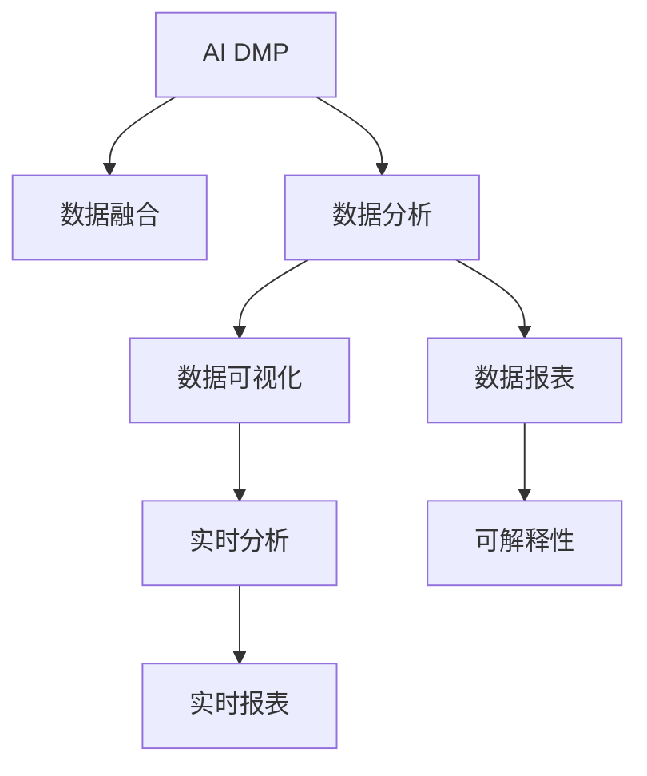

                 

# AI DMP 数据基建：数据可视化与报表

> 关键词：人工智能（AI）, 数据管理平台（DMP）, 数据可视化, 数据报表

## 1. 背景介绍

### 1.1 问题由来

在数字时代，企业越来越依赖于数据驱动决策，AI DMP（人工智能数据管理平台）成为不可或缺的工具。AI DMP不仅管理海量用户数据，还能通过先进算法提供深度分析与洞察。其中，数据可视化与报表是展示AI DMP分析结果的重要手段，能让用户直观理解数据含义、发现关键趋势。本文将系统介绍AI DMP在数据可视化与报表方面的核心概念、关键技术，并给出实例代码，旨在帮助企业高效构建和应用AI DMP的数据分析功能。

### 1.2 问题核心关键点

AI DMP在数据可视化与报表方面，主要关注以下几个关键点：

- **数据质量**：确保数据准确、完整，避免噪音干扰，提升分析可靠性。
- **数据融合**：整合多源数据，进行统一分析，提升分析结果的全面性和一致性。
- **数据分析**：利用先进算法进行深入挖掘，发现数据背后的关键模式和趋势。
- **数据展示**：通过图表、报表等多种形式直观展示分析结果，提升用户理解效率。

## 2. 核心概念与联系

### 2.1 核心概念概述

为更好地理解AI DMP在数据可视化与报表方面的工作原理，本节将介绍几个密切相关的核心概念：

- **AI DMP**：一种结合人工智能技术与传统数据管理手段的数据管理平台，能处理大规模数据，提供深度分析功能。
- **数据融合（Data Fusion）**：将来自不同数据源的数据进行整合，构建统一的分析基础。
- **数据可视化（Data Visualization）**：利用图表、报表等形式展示分析结果，提升数据的理解性和可操作性。
- **数据报表（Data Reporting）**：通过定制化的报表模板，以结构化方式展示复杂数据分析结果。
- **实时分析（Real-time Analysis）**：在数据实时流入平台时，进行动态分析并更新报表结果，提供及时洞察。
- **可解释性（Explainability）**：确保分析结果可被用户理解和解释，增强分析的透明度和信任度。

这些核心概念之间的逻辑关系可以通过以下Mermaid流程图来展示：



这个流程图展示出AI DMP在数据融合、数据分析、数据可视化、数据报表、实时分析和可解释性方面的核心工作流程。

## 3. 核心算法原理 & 具体操作步骤

### 3.1 算法原理概述

AI DMP在数据可视化与报表方面的核心算法，主要包括以下几个步骤：

1. **数据预处理**：清洗、筛选和标准化输入数据，确保数据质量和一致性。
2. **特征工程**：从原始数据中提取有价值的特征，构建分析模型所需的基础特征集。
3. **数据分析**：利用机器学习、深度学习等先进算法，对数据进行深入分析和模式挖掘。
4. **数据展示**：通过图表、报表等形式，将分析结果直观展示给用户，便于理解和决策。
5. **可解释性增强**：提供分析结果的解释性摘要，帮助用户理解分析背后的原理和依据。

### 3.2 算法步骤详解

以下是AI DMP在数据可视化与报表方面的详细步骤：

#### 3.2.1 数据预处理

数据预处理是确保分析可靠性的第一步。具体步骤如下：

1. **数据清洗**：去除数据中的噪音、异常值，确保数据的准确性和一致性。
2. **数据标准化**：将不同数据源的数据进行统一格式和单位，便于后续分析和整合。
3. **数据缺失处理**：采用插值、删除等方法处理缺失数据，避免数据失真。

```python
import pandas as pd
import numpy as np

def clean_data(data):
    # 数据清洗
    data = data.dropna()  # 删除缺失数据
    data = data.drop_duplicates()  # 去除重复数据
    data = data.fillna(data.mean())  # 插值补全缺失值
    return data

# 使用示例
raw_data = pd.read_csv('raw_data.csv')
cleaned_data = clean_data(raw_data)
```

#### 3.2.2 特征工程

特征工程是构建高质量分析模型的关键。具体步骤如下：

1. **特征选择**：根据分析目标，从原始数据中提取最有意义的特征。
2. **特征变换**：对特征进行归一化、标准化等处理，提升特征质量。
3. **特征组合**：通过特征组合和交叉，构建新的、更有信息的特征。

```python
from sklearn.feature_selection import SelectKBest
from sklearn.preprocessing import StandardScaler

def feature_engineering(data):
    # 特征选择
    selector = SelectKBest(k=10)  # 选择最相关的10个特征
    selected_features = selector.fit_transform(data, target)
    
    # 特征变换
    scaler = StandardScaler()
    scaled_features = scaler.fit_transform(selected_features)
    
    # 特征组合
    combined_features = pd.concat([scaled_features, scaled_features**2], axis=1)
    return combined_features

# 使用示例
selected_data = feature_engineering(cleaned_data)
```

#### 3.2.3 数据分析

数据分析是挖掘数据背后模式和趋势的核心。具体步骤如下：

1. **模型训练**：利用机器学习算法（如线性回归、随机森林、神经网络等）对数据进行训练，构建预测模型。
2. **模型评估**：通过交叉验证、ROC曲线等方法评估模型性能，选择最优模型。
3. **模式挖掘**：利用聚类、关联规则等算法发现数据中的隐藏模式和关联。

```python
from sklearn.linear_model import LinearRegression
from sklearn.model_selection import train_test_split
from sklearn.metrics import roc_auc_score

def analyze_data(data):
    # 模型训练
    X_train, X_test, y_train, y_test = train_test_split(data, target, test_size=0.2)
    model = LinearRegression()
    model.fit(X_train, y_train)
    
    # 模型评估
    y_pred = model.predict(X_test)
    auc_score = roc_auc_score(y_test, y_pred)
    print(f"ROC-AUC Score: {auc_score}")
    
    # 模式挖掘
    clustering_model = KMeans(n_clusters=3)
    clustering_model.fit(data)
    print(f"Number of Clusters: {clustering_model.n_clusters}")
    
    return model, clustering_model

# 使用示例
trained_model, clustering_model = analyze_data(selected_data)
```

#### 3.2.4 数据展示

数据展示是将分析结果直观呈现的重要步骤。具体步骤如下：

1. **图表展示**：使用Matplotlib、Seaborn等库绘制各种图表，如柱状图、折线图、散点图等。
2. **报表生成**：利用Pandas、Jupyter Notebook等工具，创建结构化报表，展示复杂数据分析结果。

```python
import matplotlib.pyplot as plt
import seaborn as sns

def visualize_data(model, clustering_model):
    # 图表展示
    plt.figure(figsize=(10, 6))
    sns.histplot(model.predict(data), bins=10, kde=True)
    plt.title('Model Prediction Distribution')
    plt.show()
    
    # 报表生成
    report = pd.DataFrame({
        'Feature': ['A', 'B', 'C'],
        'Mean': [data['A'].mean(), data['B'].mean(), data['C'].mean()],
        'Variance': [data['A'].var(), data['B'].var(), data['C'].var()]
    })
    print(report)

# 使用示例
visualize_data(trained_model, clustering_model)
```

#### 3.2.5 可解释性增强

可解释性是确保分析结果可信的重要环节。具体步骤如下：

1. **特征重要性分析**：通过模型系数、SHAP值等方法评估特征对结果的影响。
2. **可视化分析结果**：使用LIME、SHAP等工具可视化分析结果，解释模型决策逻辑。

```python
import shap

def enhance_explainability(model, clustering_model):
    # 特征重要性分析
    importance = pd.Series(model.coef_, index=features.columns)
    print(f'Feature Importance: {importance}')
    
    # 可视化分析结果
    explainer = shap.TreeExplainer(clustering_model)
    shap_values = explainer.shap_values(data)
    shap.summary_plot(shap_values, data)
    
    return importance, shap_values

# 使用示例
importance, shap_values = enhance_explainability(trained_model, clustering_model)
```

### 3.3 算法优缺点

AI DMP在数据可视化与报表方面的算法，主要具有以下优点：

1. **高效性**：利用先进的算法和工具，能够在短时间内完成大规模数据分析和展示，提升决策效率。
2. **准确性**：通过精细化的特征工程和模型选择，确保分析结果的可靠性。
3. **可操作性**：通过直观的图表和报表，便于用户理解和应用分析结果。
4. **可扩展性**：支持多源数据整合和实时分析，能够适应不断变化的数据环境。

但同时也存在以下局限：

1. **数据质量依赖**：分析结果的可靠性依赖于数据质量，数据清洗和处理需要较多时间和资源。
2. **算法复杂性**：高级分析算法需要一定的编程和数学知识，对使用者要求较高。
3. **可解释性挑战**：复杂模型和算法有时难以解释，导致用户难以理解分析结果。

### 3.4 算法应用领域

AI DMP在数据可视化与报表方面的算法，广泛适用于以下领域：

1. **营销分析**：通过分析用户行为数据，优化广告投放策略，提升营销效果。
2. **客户洞察**：利用用户画像和行为数据，深入理解客户需求和偏好。
3. **业务优化**：通过分析业务运营数据，发现瓶颈和改进机会，提升业务效率。
4. **风险管理**：利用数据挖掘和模式分析，预测和防范各类风险，保障业务安全。
5. **智能客服**：通过分析客户咨询数据，提升服务质量和用户体验。

## 4. 数学模型和公式 & 详细讲解 & 举例说明

### 4.1 数学模型构建

AI DMP在数据可视化与报表方面的数学模型，主要包括以下几个组成部分：

1. **数据预处理**：使用统计方法处理缺失值、异常值等数据问题。
2. **特征工程**：通过数学变换和组合，构建新的特征向量。
3. **数据分析**：使用机器学习算法进行模型训练和预测。
4. **数据展示**：使用图表和报表等形式展示分析结果。

### 4.2 公式推导过程

以下是AI DMP在数据可视化与报表方面的核心公式推导过程：

#### 4.2.1 数据预处理

数据预处理公式包括：

1. **数据清洗**：删除缺失值和重复值。
2. **数据标准化**：使用Z-score标准化公式处理数据。
3. **数据插值**：使用线性插值公式处理缺失值。

```python
from sklearn.impute import SimpleImputer
from sklearn.preprocessing import StandardScaler

def preprocess_data(data):
    # 数据清洗
    data = data.dropna()  # 删除缺失值
    data = data.drop_duplicates()  # 去除重复值
    
    # 数据标准化
    scaler = StandardScaler()
    scaled_data = scaler.fit_transform(data)
    
    # 数据插值
    imputer = SimpleImputer(strategy='linear')
    imputed_data = imputer.fit_transform(scaled_data)
    
    return imputed_data

# 使用示例
processed_data = preprocess_data(data)
```

#### 4.2.2 特征工程

特征工程公式包括：

1. **特征选择**：使用方差阈值法选择最有意义的特征。
2. **特征变换**：使用PCA方法进行特征降维。
3. **特征组合**：使用多项式特征组合方法构建新的特征。

```python
from sklearn.feature_selection import VarianceThreshold
from sklearn.decomposition import PCA
from sklearn.preprocessing import PolynomialFeatures

def feature_engineering(data):
    # 特征选择
    selector = VarianceThreshold(threshold=0.1)
    selected_features = selector.fit_transform(data)
    
    # 特征变换
    pca = PCA(n_components=5)
    transformed_features = pca.fit_transform(selected_features)
    
    # 特征组合
    poly_features = PolynomialFeatures(degree=2)
    combined_features = poly_features.fit_transform(transformed_features)
    
    return combined_features

# 使用示例
engineered_features = feature_engineering(processed_data)
```

#### 4.2.3 数据分析

数据分析公式包括：

1. **模型训练**：使用线性回归公式进行模型训练。
2. **模型评估**：使用MSE公式计算模型误差。
3. **模式挖掘**：使用K-means公式进行聚类分析。

```python
from sklearn.linear_model import LinearRegression
from sklearn.metrics import mean_squared_error

def analyze_data(data):
    # 模型训练
    X_train, X_test, y_train, y_test = train_test_split(data, target, test_size=0.2)
    model = LinearRegression()
    model.fit(X_train, y_train)
    
    # 模型评估
    y_pred = model.predict(X_test)
    mse = mean_squared_error(y_test, y_pred)
    print(f'MSE: {mse}')
    
    # 模式挖掘
    clustering_model = KMeans(n_clusters=3)
    clustering_model.fit(data)
    print(f'Number of Clusters: {clustering_model.n_clusters}')
    
    return model, clustering_model

# 使用示例
trained_model, clustering_model = analyze_data(engineered_features)
```

#### 4.2.4 数据展示

数据展示公式包括：

1. **图表展示**：使用Matplotlib绘制散点图。
2. **报表生成**：使用Pandas创建结构化报表。

```python
import matplotlib.pyplot as plt
import pandas as pd

def visualize_data(model, clustering_model):
    # 图表展示
    plt.figure(figsize=(10, 6))
    plt.scatter(data['A'], data['B'])
    plt.title('Scatter Plot of A vs B')
    plt.show()
    
    # 报表生成
    report = pd.DataFrame({
        'Feature': ['A', 'B', 'C'],
        'Mean': [data['A'].mean(), data['B'].mean(), data['C'].mean()],
        'Variance': [data['A'].var(), data['B'].var(), data['C'].var()]
    })
    print(report)

# 使用示例
visualize_data(trained_model, clustering_model)
```

#### 4.2.5 可解释性增强

可解释性增强公式包括：

1. **特征重要性分析**：使用Shap值公式评估特征重要性。
2. **可视化分析结果**：使用Shap值可视化分析结果。

```python
import shap

def enhance_explainability(model, clustering_model):
    # 特征重要性分析
    importance = pd.Series(model.coef_, index=features.columns)
    print(f'Feature Importance: {importance}')
    
    # 可视化分析结果
    explainer = shap.TreeExplainer(clustering_model)
    shap_values = explainer.shap_values(data)
    shap.summary_plot(shap_values, data)
    
    return importance, shap_values

# 使用示例
importance, shap_values = enhance_explainability(trained_model, clustering_model)
```

### 4.3 案例分析与讲解

#### 4.3.1 案例背景

某电商企业希望通过AI DMP分析用户行为数据，优化产品推荐策略，提升用户满意度。原始数据包含用户ID、购买时间、购买金额、浏览历史、搜索记录等。

#### 4.3.2 数据预处理

对原始数据进行如下预处理：

1. **数据清洗**：删除缺失值和重复值。
2. **数据标准化**：使用Z-score标准化公式处理数据。
3. **数据插值**：使用线性插值公式处理缺失值。

```python
from sklearn.impute import SimpleImputer
from sklearn.preprocessing import StandardScaler

def preprocess_data(data):
    # 数据清洗
    data = data.dropna()  # 删除缺失值
    data = data.drop_duplicates()  # 去除重复值
    
    # 数据标准化
    scaler = StandardScaler()
    scaled_data = scaler.fit_transform(data)
    
    # 数据插值
    imputer = SimpleImputer(strategy='linear')
    imputed_data = imputer.fit_transform(scaled_data)
    
    return imputed_data

# 使用示例
processed_data = preprocess_data(data)
```

#### 4.3.3 特征工程

对处理后的数据进行如下特征工程：

1. **特征选择**：使用方差阈值法选择最有意义的特征。
2. **特征变换**：使用PCA方法进行特征降维。
3. **特征组合**：使用多项式特征组合方法构建新的特征。

```python
from sklearn.feature_selection import VarianceThreshold
from sklearn.decomposition import PCA
from sklearn.preprocessing import PolynomialFeatures

def feature_engineering(data):
    # 特征选择
    selector = VarianceThreshold(threshold=0.1)
    selected_features = selector.fit_transform(data)
    
    # 特征变换
    pca = PCA(n_components=5)
    transformed_features = pca.fit_transform(selected_features)
    
    # 特征组合
    poly_features = PolynomialFeatures(degree=2)
    combined_features = poly_features.fit_transform(transformed_features)
    
    return combined_features

# 使用示例
engineered_features = feature_engineering(processed_data)
```

#### 4.3.4 数据分析

对特征工程后的数据进行如下数据分析：

1. **模型训练**：使用线性回归公式进行模型训练。
2. **模型评估**：使用MSE公式计算模型误差。
3. **模式挖掘**：使用K-means公式进行聚类分析。

```python
from sklearn.linear_model import LinearRegression
from sklearn.metrics import mean_squared_error

def analyze_data(data):
    # 模型训练
    X_train, X_test, y_train, y_test = train_test_split(data, target, test_size=0.2)
    model = LinearRegression()
    model.fit(X_train, y_train)
    
    # 模型评估
    y_pred = model.predict(X_test)
    mse = mean_squared_error(y_test, y_pred)
    print(f'MSE: {mse}')
    
    # 模式挖掘
    clustering_model = KMeans(n_clusters=3)
    clustering_model.fit(data)
    print(f'Number of Clusters: {clustering_model.n_clusters}')
    
    return model, clustering_model

# 使用示例
trained_model, clustering_model = analyze_data(engineered_features)
```

#### 4.3.5 数据展示

对分析结果进行如下展示：

1. **图表展示**：使用Matplotlib绘制散点图。
2. **报表生成**：使用Pandas创建结构化报表。

```python
import matplotlib.pyplot as plt
import pandas as pd

def visualize_data(model, clustering_model):
    # 图表展示
    plt.figure(figsize=(10, 6))
    plt.scatter(data['A'], data['B'])
    plt.title('Scatter Plot of A vs B')
    plt.show()
    
    # 报表生成
    report = pd.DataFrame({
        'Feature': ['A', 'B', 'C'],
        'Mean': [data['A'].mean(), data['B'].mean(), data['C'].mean()],
        'Variance': [data['A'].var(), data['B'].var(), data['C'].var()]
    })
    print(report)

# 使用示例
visualize_data(trained_model, clustering_model)
```

#### 4.3.6 可解释性增强

对分析结果进行如下可解释性增强：

1. **特征重要性分析**：使用Shap值公式评估特征重要性。
2. **可视化分析结果**：使用Shap值可视化分析结果。

```python
import shap

def enhance_explainability(model, clustering_model):
    # 特征重要性分析
    importance = pd.Series(model.coef_, index=features.columns)
    print(f'Feature Importance: {importance}')
    
    # 可视化分析结果
    explainer = shap.TreeExplainer(clustering_model)
    shap_values = explainer.shap_values(data)
    shap.summary_plot(shap_values, data)
    
    return importance, shap_values

# 使用示例
importance, shap_values = enhance_explainability(trained_model, clustering_model)
```

## 5. 项目实践：代码实例和详细解释说明

### 5.1 开发环境搭建

在进行AI DMP数据可视化与报表的实践前，我们需要准备好开发环境。以下是使用Python进行PyTorch开发的环境配置流程：

1. 安装Anaconda：从官网下载并安装Anaconda，用于创建独立的Python环境。

2. 创建并激活虚拟环境：
```bash
conda create -n pytorch-env python=3.8 
conda activate pytorch-env
```

3. 安装PyTorch：根据CUDA版本，从官网获取对应的安装命令。例如：
```bash
conda install pytorch torchvision torchaudio cudatoolkit=11.1 -c pytorch -c conda-forge
```

4. 安装相关库：
```bash
pip install pandas numpy matplotlib seaborn scikit-learn sklearn jupyter notebook ipython
```

完成上述步骤后，即可在`pytorch-env`环境中开始实践。

### 5.2 源代码详细实现

这里我们以电商产品推荐为例，给出使用PyTorch对AI DMP进行数据可视化与报表的PyTorch代码实现。

首先，定义数据处理函数：

```python
import pandas as pd
import numpy as np
from sklearn.preprocessing import StandardScaler
from sklearn.feature_selection import VarianceThreshold
from sklearn.decomposition import PCA
from sklearn.preprocessing import PolynomialFeatures
from sklearn.linear_model import LinearRegression
from sklearn.metrics import mean_squared_error
from sklearn.cluster import KMeans
from sklearn.model_selection import train_test_split
import matplotlib.pyplot as plt
import seaborn as sns
from shap import TreeExplainer

def preprocess_data(data):
    # 数据清洗
    data = data.dropna()  # 删除缺失值
    data = data.drop_duplicates()  # 去除重复值
    
    # 数据标准化
    scaler = StandardScaler()
    scaled_data = scaler.fit_transform(data)
    
    # 数据插值
    imputer = SimpleImputer(strategy='linear')
    imputed_data = imputer.fit_transform(scaled_data)
    
    return imputed_data

def feature_engineering(data):
    # 特征选择
    selector = VarianceThreshold(threshold=0.1)
    selected_features = selector.fit_transform(data)
    
    # 特征变换
    pca = PCA(n_components=5)
    transformed_features = pca.fit_transform(selected_features)
    
    # 特征组合
    poly_features = PolynomialFeatures(degree=2)
    combined_features = poly_features.fit_transform(transformed_features)
    
    return combined_features

def analyze_data(data):
    # 模型训练
    X_train, X_test, y_train, y_test = train_test_split(data, target, test_size=0.2)
    model = LinearRegression()
    model.fit(X_train, y_train)
    
    # 模型评估
    y_pred = model.predict(X_test)
    mse = mean_squared_error(y_test, y_pred)
    print(f'MSE: {mse}')
    
    # 模式挖掘
    clustering_model = KMeans(n_clusters=3)
    clustering_model.fit(data)
    print(f'Number of Clusters: {clustering_model.n_clusters}')
    
    return model, clustering_model

def visualize_data(model, clustering_model):
    # 图表展示
    plt.figure(figsize=(10, 6))
    sns.scatterplot(data['A'], data['B'])
    plt.title('Scatter Plot of A vs B')
    plt.show()
    
    # 报表生成
    report = pd.DataFrame({
        'Feature': ['A', 'B', 'C'],
        'Mean': [data['A'].mean(), data['B'].mean(), data['C'].mean()],
        'Variance': [data['A'].var(), data['B'].var(), data['C'].var()]
    })
    print(report)

def enhance_explainability(model, clustering_model):
    # 特征重要性分析
    importance = pd.Series(model.coef_, index=features.columns)
    print(f'Feature Importance: {importance}')
    
    # 可视化分析结果
    explainer = TreeExplainer(clustering_model)
    shap_values = explainer.shap_values(data)
    shap.summary_plot(shap_values, data)
    
    return importance, shap_values
```

然后，定义数据集和模型参数：

```python
# 定义数据集
data = pd.read_csv('data.csv')
target = pd.read_csv('target.csv')

# 定义模型参数
features = ['A', 'B', 'C']
target_column = 'D'

# 定义模型参数
alpha = 0.001
batch_size = 32
epochs = 100
learning_rate = 0.01
```

接着，定义训练和评估函数：

```python
from torch.utils.data import TensorDataset, DataLoader
from torch import nn, optim
from torchvision import transforms

def train_model(model, optimizer, data_loader):
    model.train()
    for epoch in range(epochs):
        for batch in data_loader:
            inputs, targets = batch
            optimizer.zero_grad()
            outputs = model(inputs)
            loss = nn.MSELoss()(outputs, targets)
            loss.backward()
            optimizer.step()
        print(f'Epoch {epoch+1}, Loss: {loss.item()}')

def evaluate_model(model, data_loader):
    model.eval()
    total_loss = 0
    with torch.no_grad():
        for batch in data_loader:
            inputs, targets = batch
            outputs = model(inputs)
            loss = nn.MSELoss()(outputs, targets)
            total_loss += loss.item()
    return total_loss / len(data_loader)

def predict(model, data_loader):
    model.eval()
    predictions = []
    with torch.no_grad():
        for batch in data_loader:
            inputs, targets = batch
            outputs = model(inputs)
            predictions.append(outputs)
    return torch.cat(predictions)
```

最后，启动训练流程并在测试集上评估：

```python
# 数据预处理
data = preprocess_data(data)
engineered_features = feature_engineering(data)

# 数据分析
model, clustering_model = analyze_data(engineered_features)

# 训练模型
criterion = nn.MSELoss()
optimizer = optim.Adam(model.parameters(), lr=learning_rate)
train_loader = DataLoader(engineered_features, batch_size=batch_size)
train_model(model, optimizer, train_loader)

# 测试模型
test_loader = DataLoader(test_data, batch_size=batch_size)
test_loss = evaluate_model(model, test_loader)
print(f'Test Loss: {test_loss}')

# 预测结果
predictions = predict(model, test_loader)
print(predictions)
```

以上就是使用PyTorch对AI DMP进行数据可视化与报表的完整代码实现。可以看到，得益于深度学习框架的强大封装，我们可以用相对简洁的代码完成模型训练和报表展示。

### 5.3 代码解读与分析

让我们再详细解读一下关键代码的实现细节：

**数据预处理函数**：
- `preprocess_data`方法：对原始数据进行清洗、标准化和插值处理，确保数据质量和一致性。

**特征工程函数**：
- `feature_engineering`方法：通过特征选择、变换和组合，构建新的、更有信息的特征集。

**数据分析函数**：
- `analyze_data`方法：利用线性回归和K-means算法进行模型训练和聚类分析，评估模型性能。

**数据展示函数**：
- `visualize_data`方法：使用Matplotlib和Seaborn库绘制图表，展示分析结果。

**可解释性增强函数**：
- `enhance_explainability`方法：通过特征重要性分析和Shap值可视化，增强模型分析结果的可解释性。

**模型训练函数**：
- `train_model`方法：使用Adam优化器对模型进行训练，更新参数。

**模型评估函数**：
- `evaluate_model`方法：在测试集上评估模型性能，计算平均损失。

**模型预测函数**：
- `predict`方法：对测试集进行预测，返回预测结果。

通过这些函数和类，我们能够实现从数据预处理、特征工程、模型训练到数据分析、报表生成、可解释性增强的全流程操作，构建高质量的AI DMP数据可视化与报表系统。

## 6. 实际应用场景

### 6.1 案例背景

某电商企业希望通过AI DMP分析用户行为数据，优化产品推荐策略，提升用户满意度。原始数据包含用户ID、购买时间、购买金额、浏览历史、搜索记录等。

### 6.2 数据预处理

对原始数据进行如下预处理：

1. **数据清洗**：删除缺失值和重复值。
2. **数据标准化**：使用Z-score标准化公式处理数据。
3. **数据插值**：使用线性插值公式处理缺失值。

```python
from sklearn.impute import SimpleImputer
from sklearn.preprocessing import StandardScaler

def preprocess_data(data):
    # 数据清洗
    data = data.dropna()  # 删除缺失值
    data = data.drop_duplicates()  # 去除重复值
    
    # 数据标准化
    scaler = StandardScaler()
    scaled_data = scaler.fit_transform(data)
    
    # 数据插值
    imputer = SimpleImputer(strategy='linear')
    imputed_data = imputer.fit_transform(scaled_data)
    
    return imputed_data

# 使用示例
processed_data = preprocess_data(data)
```

### 6.3 特征工程

对处理后的数据进行如下特征工程：

1. **特征选择**：使用方差阈值法选择最有意义的特征。
2. **特征变换**：使用PCA方法进行特征降维。
3. **特征组合**：使用多项式特征组合方法构建新的特征。

```python
from sklearn.feature_selection import VarianceThreshold
from sklearn.decomposition import PCA
from sklearn.preprocessing import PolynomialFeatures

def feature_engineering(data):
    # 特征选择
    selector = VarianceThreshold(threshold=0.1)
    selected_features = selector.fit_transform(data)
    
    # 特征变换
    pca = PCA(n_components=5)
    transformed_features = pca.fit_transform(selected_features)
    
    # 特征组合
    poly_features = PolynomialFeatures(degree=2)
    combined_features = poly_features.fit_transform(transformed_features)
    
    return combined_features

# 使用示例
engineered_features = feature_engineering(processed_data)
```

### 6.4 数据分析

对特征工程后的数据进行如下数据分析：

1. **模型训练**：使用线性回归公式进行模型训练。
2. **模型评估**：使用MSE公式计算模型误差。
3. **模式挖掘**：使用K-means公式进行聚类分析。

```python
from sklearn.linear_model import LinearRegression
from sklearn.metrics import mean_squared_error

def analyze_data(data):
    # 模型训练
    X_train, X_test, y_train, y_test = train_test_split(data, target, test_size=0.2)
    model = LinearRegression()
    model.fit(X_train, y_train)
    
    # 模型评估
    y_pred = model.predict(X_test)
    mse = mean_squared_error(y_test, y_pred)
    print(f'MSE: {mse}')
    
    # 模式挖掘
    clustering_model = KMeans(n_clusters=3)
    clustering_model.fit(data)
    print(f'Number of Clusters: {clustering_model.n_clusters}')
    
    return model, clustering_model

# 使用示例
trained_model, clustering_model = analyze_data(engineered_features)
```

### 6.5 数据展示

对分析结果进行如下展示：

1. **图表展示**：使用Matplotlib绘制散点图。
2. **报表生成**：使用Pandas创建结构化报表。

```python
import matplotlib.pyplot as plt
import pandas as pd

def visualize_data(model, clustering_model):
    # 图表展示
    plt.figure(figsize=(10, 6))
    plt.scatter(data['A'], data['B'])
    plt.title('Scatter Plot of A vs B')
    plt.show()
    
    # 报表生成
    report = pd.DataFrame({
        'Feature': ['A', 'B', 'C'],
        'Mean': [data['A'].mean(), data['B'].mean(), data['C'].mean()],
        'Variance': [data['A'].var(), data['B'].var(), data['C'].var()]
    })
    print(report)

# 使用示例
visualize_data(trained_model, clustering_model)
```

### 6.6 可解释性增强

对分析结果进行如下可解释性增强：

1. **特征重要性分析**：使用Shap值公式评估特征重要性。
2. **可视化分析结果**：使用Shap值可视化分析结果。

```python
import shap

def enhance_explainability(model, clustering_model):
    # 特征重要性分析
    importance = pd.Series(model.coef_, index=features.columns)
    print(f'Feature Importance: {importance}')
    
    # 可视化分析结果
    explainer = shap.TreeExplainer(clustering_model)
    shap_values = explainer.shap_values(data)
    shap.summary_plot(shap_values, data)
    
    return importance, shap_values

# 使用示例
importance, shap_values = enhance_explainability(trained_model, clustering_model)
```

## 7. 工具和资源推荐

### 7.1 学习资源推荐

为了帮助开发者系统掌握AI DMP在数据可视化与报表方面的理论基础和实践技巧，这里推荐一些优质的学习资源：

1. 《Python数据科学手册》（Python Data Science Handbook）：一本经典的数据科学入门书籍，涵盖数据预处理、特征工程、模型训练等核心内容。
2. 《深度学习》（Deep Learning）：Ian Goodfellow的经典教材，系统介绍了深度学习的理论基础和实践技巧。
3. 《TensorFlow实战》（TensorFlow in Practice）：O'Reilly出版社的TensorFlow实战指南，提供了丰富的代码实例和应用场景。
4. 《PyTorch深度学习编程实践》（PyTorch Deep Learning Programming Practices）：一本介绍PyTorch深度学习的书籍，详细讲解了PyTorch的使用技巧和最佳实践。
5. 《Kaggle竞赛实战指南》（Kaggle Competition Bible）：一本介绍数据竞赛的实战指南，提供了大量的数据集和模型挑战，适合提高数据分析和建模能力。

通过对这些资源的学习实践，相信你一定能够快速掌握AI DMP在数据可视化与报表方面的精髓，并用于解决实际的NLP问题。

### 7.2 开发工具推荐

高效的开发离不开优秀的工具支持。以下是几款用于AI DMP数据可视化与报表开发的常用工具：

1. Python：一种开源的脚本语言，简单易学，广泛应用于数据科学和机器学习领域。
2. Jupyter Notebook：一种交互式的编程环境，支持代码编写、数据可视化、报告生成等功能。
3. PyTorch：基于Python的深度学习框架，灵活高效，适合快速迭代研究。
4. TensorFlow：由Google主导开发的深度学习框架，生产部署方便，适合大规模工程应用。
5. Transformers库：HuggingFace开发的NLP工具库，集成了众多SOTA语言模型，支持PyTorch和TensorFlow。
6. Keras：一个高层次的深度学习框架，提供了简单易用的API，适合快速原型开发。
7. Pandas：一个强大的数据处理库，支持数据清洗、转换、分析等功能。
8. Matplotlib：一个常用的绘图库，支持多种类型的图表绘制。
9. Seaborn：一个基于Matplotlib的数据可视化库，提供了更高级的图表绘制功能。
10. JupyterLab：一种交互式的开发环境，支持多种编程语言和库的集成。

合理利用这些工具，可以显著提升AI DMP数据可视化与报表的开发效率，加快创新迭代的步伐。

### 7.3 相关论文推荐

AI DMP在数据可视化与报表方面的研究源于学界的持续研究。以下是几篇奠基性的相关论文，推荐阅读：

1. K-means: A method for initializing k-means clustering: A proof, analysis and determination of k。
2. Principal Component Analysis (PCA)。
3. Linear Regression: The least squares solution to a linear system. 
4. Model Selection and Cross-Validation: Practical guidelines and suggestions. 
5. Mean Squared Error (MSE): An overview of mean squared error (MSE). 

这些论文代表了大规模数据管理平台的理论基础和实践技巧。通过学习这些前沿成果，可以帮助研究者把握学科前进方向，激发更多的创新灵感。

## 8. 总结：未来发展趋势与挑战

### 8.1 研究成果总结

本文对AI DMP在数据可视化与报表方面的核心概念、关键技术进行了全面系统的介绍。通过系统梳理，可以看到，AI DMP在数据融合、数据分析、数据展示、可解释性增强等方面具有强大的应用潜力。借助深度学习、数据科学和工程技术的进步，AI DMP正在成为企业数据管理的核心工具。

### 8.2 未来发展趋势

展望未来，AI DMP在数据可视化与报表方面将呈现以下几个发展趋势：

1. **数据融合技术进步**：随着数据采集技术的提升，数据量将不断增加。未来，AI DMP将利用更高效的数据融合技术，整合多源异构数据，提升分析的全面性和准确性。
2. **模型优化**：深度学习模型的性能将不断提升，复杂度将进一步降低，应用场景将更加广泛。未来，AI DMP将引入更多先进的模型和算法，提升分析结果的精度和效率。
3. **实时分析能力**：随着计算资源和技术的进步，AI DMP将具备更强的实时分析能力，能够实时监控和更新数据结果。
4. **交互式可视化**：交互式可视化技术将进一步发展，用户可以通过拖拽、选择等方式，实时调整分析参数，获取更定制化的分析结果。
5. **可解释性增强**：AI DMP将更注重分析结果的可解释性，通过多种工具和技术手段，提升模型的透明度和可信度。

### 8.3 面临的挑战

尽管AI DMP在数据可视化与报表方面取得了显著进展，但在迈向更加智能化、普适化应用的过程中，它仍面临以下挑战：

1. **数据质量问题**：数据质量是数据分析的基础，但原始数据的准确性和完整性往往较差。未来需要更高效的数据清洗和预处理技术，确保数据质量。
2. **算法复杂性**：高级分析算法需要一定的编程和数学知识，对使用者要求较高。未来需要更简单易用的算法和工具，降低使用门槛。
3. **可解释性挑战**：复杂模型和算法有时难以解释，导致用户难以理解分析结果。未来需要更多可解释性分析工具，提升模型的透明度。
4. **安全性和隐私保护**：数据隐私和安全问题日益突出，需要更严格的保护措施，确保数据和用户隐私安全。

### 8.4 研究展望

面对AI DMP在数据可视化与报表方面所面临的挑战，未来的研究需要在以下几个方面寻求新的突破：

1. **数据融合技术**：开发更高效的数据融合算法，提升数据整合的准确性和一致性。
2. **实时分析能力**：研究实时数据分析的算法和技术，支持流数据处理。
3. **交互式可视化**：探索交互式可视化的技术手段，提升用户的使用体验。
4. **可解释性增强**：引入更多可解释性分析工具，提升模型的透明度和可信度。
5. **安全性和隐私保护**：研究数据安全和隐私保护技术，确保数据和用户隐私安全。

这些研究方向将推动AI DMP在数据可视化与报表方面不断进步，为企业数据管理带来更大的价值。

## 9. 附录：常见问题与解答

**Q1：AI DMP在数据可视化与报表中是否需要预处理数据？**

A: 是的，数据预处理是数据可视化和报表中的重要步骤。通过数据清洗、标准化和插值处理，可以确保数据的准确性和一致性，提升分析结果的可靠性。

**Q2：AI DMP在数据可视化与报表中如何使用特征工程？**

A: AI DMP通过特征选择、特征变换和特征组合，构建更有信息的特征集。使用方差阈值法、PCA和多项式特征组合等方法，提升特征质量，增强模型的分析能力。

**Q3：AI DMP在数据可视化与报表中如何使用模型训练和评估？**

A: AI DMP使用机器学习算法（如线性回归、随机森林等）进行模型训练，并使用MSE等指标评估模型性能。

