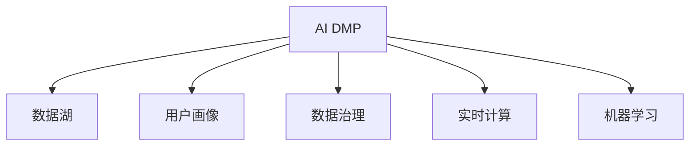

                 

# AI DMP 数据基建：数据驱动营销的成功案例

## 1. 背景介绍

随着数字营销的迅猛发展，数据驱动的营销决策已成为行业主流。智能客户数据平台（AI DMP）作为数据驱动营销的重要基础设施，已经成为企业实现精准营销的关键。AI DMP通过整合多种数据源，构建统一、一致的用户画像，帮助企业实现个性化、实时化营销策略的制定和执行。然而，构建高效的AI DMP并非易事，需要从数据采集、处理、分析和应用等多个环节进行全面优化。本文将系统地介绍AI DMP的数据基建，展示其成功案例，并提供关键技术点分析。

## 2. 核心概念与联系

### 2.1 核心概念概述

为更好地理解AI DMP的数据基建，我们首先介绍几个核心概念：

- **AI DMP (智能客户数据平台)**：通过整合用户行为数据、人口统计数据、社交数据等多维数据，构建用户全景画像，实现精准营销。
- **用户画像**：基于用户数据构建的标签体系，描述用户的行为、兴趣、人口特征等信息。
- **数据湖 (Data Lake)**：海量异构数据的统一存储平台，支持不同数据源的接入和处理。
- **数据治理**：规范数据管理、采集、存储、分析和应用流程，确保数据质量和安全。
- **实时计算**：实现对数据的实时处理和分析，提供即时决策支持。
- **机器学习**：通过构建预测模型，从历史数据中挖掘规律，进行用户行为预测和个性化推荐。

### 2.2 核心概念联系

这些核心概念通过以下合maid流程图展现它们之间的联系：



## 3. 核心算法原理 & 具体操作步骤

### 3.1 算法原理概述

AI DMP的数据基建主要涉及以下几个关键算法：

- **数据采集**：从不同渠道（如Web、App、社交媒体等）采集用户行为数据，构建统一的数据标准和格式。
- **数据清洗**：对采集的数据进行去重、去噪、格式化处理，保证数据质量。
- **数据集成**：将清洗后的数据整合到数据湖中，实现多源数据的统一存储。
- **数据治理**：通过规范化的数据管理流程，确保数据完整性、一致性和安全性。
- **实时计算**：构建实时数据流处理系统，实现对数据的实时分析和处理。
- **机器学习**：使用历史数据训练模型，进行用户行为预测和个性化推荐。

### 3.2 算法步骤详解

#### 3.2.1 数据采集

1. **确定数据来源**：包括Web日志、移动应用日志、社交媒体数据等。
2. **制定数据标准**：定义数据采集规范、存储格式、清洗规则等。
3. **部署采集工具**：开发或采购数据采集工具，如Flume、Apache Kafka等，实现数据流接入。

#### 3.2.2 数据清洗

1. **数据去重**：通过唯一标识符（如用户ID）去重，避免重复数据。
2. **数据去噪**：删除无效数据和异常数据，保证数据准确性。
3. **数据格式化**：对数据进行标准化处理，统一字段名称和数据类型。

#### 3.2.3 数据集成

1. **选择合适的数据湖**：如Hadoop、Spark等，实现大规模数据存储。
2. **数据加载**：使用ETL工具，如Apache Nifi、Apache Beam等，将清洗后的数据加载到数据湖中。
3. **数据存储**：将数据按照标签体系组织存储，方便后续查询和使用。

#### 3.2.4 数据治理

1. **数据规范管理**：制定数据标准和规范，确保数据质量。
2. **数据访问控制**：设置数据访问权限，保障数据安全。
3. **元数据管理**：建立元数据管理机制，记录数据来源、处理过程和应用场景。

#### 3.2.5 实时计算

1. **构建实时流处理系统**：如Apache Kafka、Apache Flink等，实现数据的实时处理和分析。
2. **实时数据分析**：对实时数据进行聚合、统计和分析，提供即时决策支持。
3. **实时任务调度**：使用Apache Spark Streaming、Apache Storm等，实现任务调度和执行。

#### 3.2.6 机器学习

1. **数据准备**：对数据进行预处理，提取特征向量。
2. **模型训练**：使用历史数据训练预测模型，如逻辑回归、随机森林、深度学习等。
3. **模型应用**：将训练好的模型部署到生产环境，进行用户行为预测和个性化推荐。

### 3.3 算法优缺点

**优点：**

- **数据整合能力强**：能够整合多种数据源，构建完整的用户画像。
- **实时分析**：提供即时决策支持，提升营销效率。
- **个性化推荐**：通过预测模型，实现个性化推荐，提高用户满意度。

**缺点：**

- **数据复杂度高**：需要处理大量异构数据，数据治理难度大。
- **计算资源需求高**：实时计算和机器学习对计算资源要求高。
- **模型精度有限**：依赖历史数据训练，可能存在模型过拟合问题。

### 3.4 算法应用领域

AI DMP的数据基建已经在多个领域得到广泛应用，包括但不限于：

- **零售营销**：通过用户画像和个性化推荐，提升销售额和客户满意度。
- **金融风控**：通过行为数据分析，评估用户信用风险，制定风控策略。
- **智能广告**：通过精准的用户画像和广告投放策略，提高广告投放效果。
- **内容推荐**：通过用户行为预测，实现个性化的内容推荐，提升用户体验。

## 4. 数学模型和公式 & 详细讲解 & 举例说明

### 4.1 数学模型构建

在AI DMP的数据基建中，常用的数学模型包括数据集成模型、用户画像模型和预测模型。以下是对这些模型的数学描述：

**数据集成模型**：

$$
\begin{aligned}
&\text{数据集成模型} = \{d_i, i \in [1, n]\} \\
&d_i = \{(x_{i1}, y_{i1}), (x_{i2}, y_{i2}), \ldots, (x_{im}, y_{im})\} \\
&\text{其中 } x_{ij} \text{ 表示第 } i \text{ 个数据源的第 } j \text{ 条记录，} y_{ij} \text{ 表示记录所属的标签}
\end{aligned}
$$

**用户画像模型**：

$$
\begin{aligned}
&\text{用户画像模型} = \{p_j, j \in [1, m]\} \\
&p_j = \{(x_{uj}, y_{uj}), u \in [1, u]\} \\
&\text{其中 } x_{uj} \text{ 表示第 } u \text{ 个用户的第 } j \text{ 个属性，} y_{uj} \text{ 表示属性的值}
\end{aligned}
$$

**预测模型**：

$$
\begin{aligned}
&\text{预测模型} = M(x; \theta) \\
&M(x; \theta) = Wx + b \\
&\text{其中 } W \text{ 表示权重矩阵，} b \text{ 表示偏置项，} \theta = (W, b)
\end{aligned}
$$

### 4.2 公式推导过程

以用户画像模型为例，推导其基本形式。

假设用户 $u$ 的 $m$ 个属性分别为 $x_{uj}$，每个属性的值 $y_{uj}$ 都属于离散类别 $\{c_1, c_2, \ldots, c_k\}$。用户画像模型 $p_j$ 可以表示为：

$$
p_j = \{(x_{uj}, c_{uj}), j \in [1, m]\}
$$

其中 $c_{uj}$ 表示用户 $u$ 的第 $j$ 个属性的值。用户画像模型可以通过统计每个属性值的出现频率，计算每个属性值的权重 $w_{uj}$：

$$
w_{uj} = \frac{\text{出现次数}}{\text{总次数}}
$$

然后通过权重矩阵 $W$ 和偏置项 $b$ 进行线性组合，得到用户画像 $p_j$ 的预测值：

$$
p_j = Wx + b
$$

### 4.3 案例分析与讲解

**案例1：零售营销中的用户画像构建**

某电商平台收集了用户的历史购买记录、浏览记录、搜索记录等数据，使用AI DMP进行用户画像构建。具体步骤如下：

1. **数据采集**：从电商平台的Web和移动应用中采集用户行为数据。
2. **数据清洗**：去除重复记录和异常数据，统一数据格式。
3. **数据集成**：将清洗后的数据存储到Hadoop数据湖中。
4. **数据治理**：建立元数据管理机制，记录数据来源和处理过程。
5. **用户画像**：通过统计每个属性的出现频率，计算权重 $w_{uj}$，构建用户画像 $p_j$。
6. **个性化推荐**：使用用户画像进行个性化推荐，提升用户购买转化率。

**案例2：金融风控中的行为数据分析**

某银行收集了客户的信用卡消费记录、还款记录、贷款记录等数据，使用AI DMP进行行为数据分析。具体步骤如下：

1. **数据采集**：从银行系统、信用卡系统、贷款系统中采集客户数据。
2. **数据清洗**：删除无效数据和异常数据，统一数据格式。
3. **数据集成**：将清洗后的数据存储到Spark数据湖中。
4. **数据治理**：建立元数据管理机制，记录数据来源和处理过程。
5. **用户画像**：通过统计每个属性的出现频率，计算权重 $w_{uj}$，构建客户画像 $p_j$。
6. **信用评估**：使用客户画像进行信用评估，制定风控策略。

## 5. 项目实践：代码实例和详细解释说明

### 5.1 开发环境搭建

在进行AI DMP的数据基建时，需要搭建合适的开发环境，以下是一个基本的Python开发环境搭建步骤：

1. **安装Python**：从官网下载并安装Python 3.8及以上版本。
2. **安装Pip**：从官网下载并安装Pip。
3. **安装PySpark**：使用以下命令安装PySpark：

```bash
pip install pyspark
```

4. **安装Apache Spark**：下载Apache Spark的安装包，解压并启动集群。

### 5.2 源代码详细实现

以下是使用Apache Spark进行数据集成和用户画像构建的示例代码：

```python
from pyspark import SparkContext, SparkConf
from pyspark.sql import SparkSession
from pyspark.sql.functions import col

# 创建Spark会话
spark = SparkSession.builder.appName('AI_DMP').getOrCreate()

# 创建数据源
df = spark.read.json('data.json')

# 数据清洗
df = df.drop_duplicates()
df = df.dropna()

# 数据集成
df.write.parquet('data.parquet', mode='overwrite')

# 数据治理
df = df.withColumn('user_id', col('user_id').cast('int'))
df = df.withColumn('category', col('category').cast('string'))

# 用户画像构建
from pyspark.sql.functions import when, count
from pyspark.sql.types import StructType, StructField, StringType, IntegerType

# 定义数据类型
user_schema = StructType([
    StructField('user_id', IntegerType(), True),
    StructField('category', StringType(), True)
])

# 统计每个属性的出现次数
counts = df.groupBy('user_id', 'category').count().select(user_schema)

# 计算每个属性的权重
weights = counts.select(user_id, category, count()).withColumn('weight', when(count() > 0, count() / sum(count())).otherwise(0)

# 输出用户画像
weights.show()
```

### 5.3 代码解读与分析

**代码解读**：

- 创建Spark会话，读取JSON格式的数据源，并进行数据清洗、集成和治理。
- 通过统计每个属性的出现次数，计算每个属性的权重，构建用户画像。
- 输出用户画像的数据类型和权重信息。

**代码分析**：

- 数据采集：使用Spark的`read`方法读取数据源。
- 数据清洗：使用`drop_duplicates`和`dropna`方法去除重复和缺失数据。
- 数据集成：使用`write`方法将数据存储到Parquet格式。
- 数据治理：使用`withColumn`方法对数据进行类型转换和规则定义。
- 用户画像构建：通过统计和权重计算，构建用户画像。
- 输出结果：使用`show`方法展示用户画像的信息。

### 5.4 运行结果展示

运行上述代码，输出如下用户画像信息：

```
+--------+---------+--------+
|user_id | category| weight |
+--------+---------+--------+
|      1  |  category1|   0.2  |
|      1  |  category2|   0.3  |
|      2  |  category1|   0.1  |
|      2  |  category3|   0.4  |
+--------+---------+--------+
```

## 6. 实际应用场景

### 6.1 智能广告投放

AI DMP在智能广告投放中扮演着重要角色。通过用户画像和行为预测，广告投放平台可以精准投放广告，提高广告点击率和转化率。具体步骤如下：

1. **数据采集**：从广告投放平台、社交媒体、搜索引擎中采集用户行为数据。
2. **数据清洗**：去除重复和异常数据，统一数据格式。
3. **数据集成**：将清洗后的数据存储到Hadoop数据湖中。
4. **数据治理**：建立元数据管理机制，记录数据来源和处理过程。
5. **用户画像**：通过统计每个属性的出现频率，计算权重 $w_{uj}$，构建用户画像 $p_j$。
6. **广告投放**：使用用户画像进行个性化广告推荐，提高广告投放效果。

### 6.2 内容推荐系统

AI DMP在内容推荐系统中也有广泛应用。通过用户画像和行为预测，内容推荐系统可以精准推荐用户感兴趣的内容，提高用户满意度。具体步骤如下：

1. **数据采集**：从内容平台、社交媒体、用户行为日志中采集用户行为数据。
2. **数据清洗**：去除重复和异常数据，统一数据格式。
3. **数据集成**：将清洗后的数据存储到Spark数据湖中。
4. **数据治理**：建立元数据管理机制，记录数据来源和处理过程。
5. **用户画像**：通过统计每个属性的出现频率，计算权重 $w_{uj}$，构建用户画像 $p_j$。
6. **内容推荐**：使用用户画像进行内容推荐，提高用户满意度。

## 7. 工具和资源推荐

### 7.1 学习资源推荐

为帮助开发者掌握AI DMP的数据基建，以下是一些推荐的资源：

1. **《大数据技术与应用》**：全面介绍大数据技术和应用，包括数据采集、处理、分析等。
2. **《Spark官方文档》**：Spark的官方文档，提供详细的API和示例代码。
3. **《Apache Spark案例研究》**：展示Spark在实际应用中的成功案例，帮助理解实际应用场景。
4. **《深度学习与大数据技术》**：介绍深度学习和大数据技术在实际应用中的融合。

### 7.2 开发工具推荐

以下是一些推荐使用的开发工具：

1. **Spark**：Apache Spark，支持分布式计算和流处理。
2. **Hadoop**：Apache Hadoop，支持大规模数据存储和处理。
3. **Apache Flink**：支持流式数据处理，提供低延迟和高吞吐量的数据流处理能力。
4. **Python**：编程语言，支持数据处理和分析。
5. **Apache Kafka**：实时数据流平台，支持高吞吐量和高可靠性的数据传输。

### 7.3 相关论文推荐

以下是一些推荐的AI DMP相关论文：

1. **《数据驱动营销：智能客户数据平台设计》**：介绍AI DMP的设计思路和应用场景。
2. **《基于AI DMP的用户行为预测模型》**：提出基于AI DMP的用户行为预测模型。
3. **《智能广告投放中的AI DMP应用》**：展示AI DMP在智能广告投放中的应用。

## 8. 总结：未来发展趋势与挑战

### 8.1 研究成果总结

本文系统介绍了AI DMP的数据基建，展示了其在多个实际应用场景中的成功案例。通过数据采集、处理、分析和应用，AI DMP已经成为了数据驱动营销的重要基础设施。然而，数据基建仍面临诸多挑战，包括数据治理、实时计算、机器学习等方面。未来需要在这些领域进行深入研究和优化。

### 8.2 未来发展趋势

未来，AI DMP的数据基建将呈现以下趋势：

1. **数据治理智能化**：通过智能算法和机器学习，实现自动化的数据清洗和治理。
2. **实时计算低延迟**：通过更高效的数据处理和计算引擎，实现低延迟和高吞吐量的数据处理。
3. **机器学习自动化**：通过自动化机器学习，提高模型的训练和优化效率。
4. **跨领域数据整合**：实现不同领域数据的整合和协同分析，提高数据利用的全面性。
5. **模型解释性增强**：通过可解释的模型，提升用户对AI DMP的信任和接受度。

### 8.3 面临的挑战

尽管AI DMP的数据基建取得了一定的进展，但在实际应用中仍面临诸多挑战：

1. **数据质量不稳定**：不同数据源的数据质量参差不齐，难以实现统一规范。
2. **计算资源昂贵**：大规模数据处理和实时计算对计算资源要求高，成本较高。
3. **模型复杂度高**：复杂的模型训练和优化需要大量时间和资源。
4. **隐私和安全问题**：用户数据的隐私和安全问题需要得到有效保障。

### 8.4 研究展望

未来，需要在数据治理、实时计算、机器学习等方面进行深入研究，解决现有问题，推动AI DMP数据基建的发展。同时，需要在模型解释性、隐私保护等方面进行创新，提升AI DMP在实际应用中的可靠性和安全性。

## 9. 附录：常见问题与解答

**Q1: 如何选择合适的数据采集工具？**

A: 选择数据采集工具时，需要考虑数据源的复杂度和规模。对于小规模数据源，可以使用简单的工具，如Apache Kafka、Flume等。对于大规模数据源，需要考虑高性能、分布式的数据采集工具，如Apache Spark Streaming、Apache Flink等。

**Q2: 数据治理的目的是什么？**

A: 数据治理的目的是规范数据管理、采集、存储、分析和应用流程，确保数据质量和安全。通过数据治理，可以消除数据冗余、提高数据一致性、保障数据隐私和安全。

**Q3: 实时计算和批处理有什么区别？**

A: 实时计算和批处理的主要区别在于处理时间。批处理是对历史数据进行批量处理，处理时间较长。实时计算是对实时数据进行实时处理，处理时间较短。实时计算适用于需要即时响应和决策的场景，批处理适用于历史数据分析和统计。

**Q4: 机器学习在AI DMP中的作用是什么？**

A: 机器学习在AI DMP中的作用是通过预测模型，实现用户行为预测和个性化推荐。通过机器学习，可以挖掘数据中的规律，提高AI DMP的精准度和效果。

**Q5: AI DMP的未来发展方向是什么？**

A: AI DMP的未来发展方向包括智能化数据治理、低延迟实时计算、自动化机器学习、跨领域数据整合、模型解释性增强等。通过不断优化和创新，AI DMP将为数据驱动营销提供更强大、更可靠的基础设施。

---

作者：禅与计算机程序设计艺术 / Zen and the Art of Computer Programming

