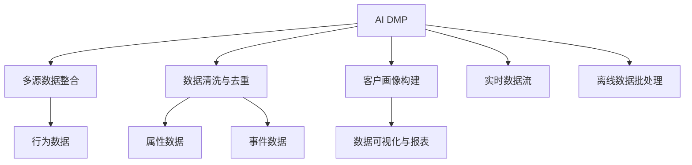

                 

# AI DMP 数据基建：构建数据驱动的营销体系

## 1. 背景介绍

### 1.1 问题由来

在数字化转型的浪潮中，数据已成为驱动营销决策的核心资产。然而，由于数据分散、格式不统一、数据孤岛等问题的存在，企业无法充分释放数据价值，制约了数据驱动营销体系的形成。为此，AI DMP（人工智能驱动的数据管理平台）应运而生，通过整合多源数据，构建统一的客户画像，实现数据的智能化分析与自动化应用，为企业提供更精准的营销策略。

### 1.2 问题核心关键点

AI DMP的核心思想是利用大数据、机器学习和人工智能技术，对散落在不同渠道和部门的数据进行整合、清洗和分析，构建全面的客户画像，从而实现对目标用户精准且高效的营销。

AI DMP的关键在于：
- 多源数据整合：从不同渠道（如电商平台、社交媒体、官网等）获取用户行为数据。
- 数据清洗与去重：消除重复数据和噪音数据，确保数据质量。
- 客户画像构建：通过机器学习算法对用户数据进行聚类、分类等操作，形成详细的用户画像。
- 数据可视化与报表：将分析结果以图表、报表的形式呈现，方便决策者理解与应用。

### 1.3 问题研究意义

AI DMP的构建，对于提升企业营销效率、优化用户体验、增强客户粘性等方面具有重要意义：

1. 提升营销效率：通过整合多源数据，实现对用户行为的全面监控与分析，帮助企业制定更精准的营销策略。
2. 优化用户体验：通过分析用户偏好和行为，提供个性化的产品推荐和服务，提升用户体验。
3. 增强客户粘性：通过细分用户群体，提供差异化的营销活动，增强客户忠诚度。
4. 赋能业务创新：AI DMP通过提供深入的客户洞察，助力企业进行业务创新和战略调整，构建核心竞争力。

## 2. 核心概念与联系

### 2.1 核心概念概述

为更好地理解AI DMP的核心思想和架构，本节将介绍几个关键概念：

- AI DMP（人工智能驱动的数据管理平台）：利用大数据、机器学习和人工智能技术，对多源数据进行整合、清洗和分析，构建详细的用户画像。
- 数据孤岛：不同部门、平台的数据无法互通，形成孤立的数据体系。
- 客户画像：通过分析用户的历史行为、兴趣偏好等数据，构建详细的用户标签，形成用户画像。
- 数据可视化：将分析结果以图表、报表的形式呈现，方便决策者理解与应用。
- 行为数据：用户在网站、应用等平台上的行为数据，如浏览、点击、购买等。
- 属性数据：用户的固定信息，如年龄、性别、职业等。
- 事件数据：用户在应用或网站上发生的事件数据，如注册、登录、页面跳转等。
- 实时数据流：通过实时数据流处理技术，对用户的即时行为进行捕捉与分析。
- 离线数据批处理：通过批处理技术，对历史数据进行全面分析与整合。

这些概念之间的逻辑关系可以通过以下Mermaid流程图来展示：



这个流程图展示了大数据管理平台的核心概念及其之间的关系：

1. AI DMP通过整合多源数据，进行数据清洗与去重，构建客户画像。
2. 客户画像包括行为数据、属性数据和事件数据。
3. 数据可视化将分析结果呈现，方便决策者使用。
4. 实时数据流和离线数据批处理技术，确保数据的全面性和及时性。

这些概念共同构成了AI DMP的数据管理架构，使其能够高效整合、分析和应用用户数据，提升营销决策的精准度。

## 3. 核心算法原理 & 具体操作步骤
### 3.1 算法原理概述

AI DMP的核心算法主要围绕数据整合、清洗、分析和可视化展开。其核心思想是通过机器学习算法，对用户数据进行高效整合与分析，构建详尽的客户画像，并实现数据的智能化应用。

### 3.2 算法步骤详解

AI DMP的数据处理流程主要包括以下几个关键步骤：

**Step 1: 数据采集与整合**

1. 从不同渠道获取用户行为数据，如电商平台、社交媒体、官网等。
2. 将数据整合到一个统一的平台上，形成全链路的数据采集与整合。

**Step 2: 数据清洗与去重**

1. 对数据进行去重、去噪，消除重复和无效数据。
2. 使用规则和算法对数据进行清洗，确保数据质量。

**Step 3: 客户画像构建**

1. 利用聚类、分类等机器学习算法，对用户数据进行分组、标签化。
2. 根据用户的不同特征，构建详尽的客户画像。

**Step 4: 数据可视化与报表**

1. 将分析结果以图表、报表的形式呈现，方便决策者理解与应用。
2. 提供可视化界面，支持交互式数据探索。

**Step 5: 实时数据流与离线数据批处理**

1. 通过实时数据流处理技术，捕捉用户的即时行为。
2. 使用批处理技术，对历史数据进行全面分析与整合。

**Step 6: 模型训练与优化**

1. 使用监督学习算法对模型进行训练与优化。
2. 实时监控模型性能，根据反馈不断调整模型参数。

**Step 7: 自动化决策与营销**

1. 根据用户画像和行为数据，自动生成营销策略。
2. 通过API接口将营销策略应用于广告投放、邮件营销等渠道。

### 3.3 算法优缺点

AI DMP算法具有以下优点：
1. 高效整合多源数据：通过数据整合技术，将不同渠道的数据进行统一管理。
2. 数据清洗与去重：确保数据质量，提高分析精度。
3. 客户画像详尽：通过机器学习算法，构建详尽的客户画像，提升用户洞察。
4. 实时数据流处理：捕捉即时用户行为，实现实时分析与决策。
5. 离线数据批处理：全面分析历史数据，挖掘深层次洞察。

同时，该算法也存在以下局限性：
1. 数据隐私问题：整合大量用户数据时，需要注意数据隐私和安全问题。
2. 算法复杂度：机器学习算法需要较高的计算资源，对硬件要求较高。
3. 数据不完整：不同渠道的数据格式和格式可能不统一，需要处理数据不完整问题。
4. 模型过拟合：在大规模数据集上训练时，可能出现模型过拟合问题。

### 3.4 算法应用领域

AI DMP算法在数据管理与营销决策中有着广泛的应用，如：

- 用户行为分析：通过分析用户在电商、社交媒体等平台上的行为数据，洞察用户需求和行为模式。
- 个性化推荐：根据用户画像和行为数据，提供个性化的产品推荐和服务。
- 营销策略优化：通过分析客户画像和历史数据，生成更精准的营销策略。
- 广告投放优化：根据用户画像和行为数据，自动生成广告投放方案，提高广告转化率。
- 客户细分：通过聚类算法，将用户进行细分，提供差异化的营销策略。
- 风控管理：通过分析用户行为数据，识别潜在的风险用户，进行精准防控。

这些应用场景充分展示了AI DMP在数据驱动营销中的重要作用，为企业提供了全面、精准、智能的营销决策支持。

## 4. 数学模型和公式 & 详细讲解 & 举例说明

### 4.1 数学模型构建

AI DMP的数据处理模型主要由以下几个部分组成：

- **数据采集与整合模型**：从不同渠道采集数据，并整合到统一平台上。
- **数据清洗与去重模型**：对数据进行清洗和去重，确保数据质量。
- **客户画像构建模型**：使用聚类、分类等算法，构建详尽的客户画像。
- **数据可视化与报表模型**：将分析结果以图表、报表的形式呈现。
- **实时数据流与离线数据批处理模型**：通过实时数据流和批处理技术，确保数据的全面性和及时性。
- **模型训练与优化模型**：使用监督学习算法，对模型进行训练与优化。
- **自动化决策与营销模型**：根据用户画像和行为数据，自动生成营销策略。

### 4.2 公式推导过程

以下是AI DMP中几个关键算法的公式推导过程：

**数据采集与整合模型**

假设不同渠道的数据分别为 $D_1, D_2, ..., D_n$，数据采集与整合的流程可以用以下公式表示：

$$
D = \bigcup_{i=1}^n D_i
$$

其中 $D$ 为整合后的数据集。

**数据清洗与去重模型**

假设原始数据集中存在重复数据 $D'$，数据清洗与去重的过程可以用以下公式表示：

$$
D'' = D \backslash D'
$$

其中 $D''$ 为清洗后的数据集。

**客户画像构建模型**

假设用户数据集为 $U$，通过聚类算法对用户进行分组，得到 $K$ 个用户群，其中 $k$ 为某个用户群。客户画像可以用以下公式表示：

$$
P_k = \{u_i | u_i \in U, u_i \in C_k\}
$$

其中 $C_k$ 为第 $k$ 个用户群，$u_i$ 为用户数据。

**数据可视化与报表模型**

假设分析结果为 $R$，数据可视化与报表模型将 $R$ 转化为图表与报表，可以用以下公式表示：

$$
V = \{G, T\}
$$

其中 $G$ 为图表，$T$ 为报表，$V$ 为可视化结果。

**实时数据流与离线数据批处理模型**

假设实时数据流处理模型为 $RDP$，离线数据批处理模型为 $BDP$，数据流 $D_t$ 为实时数据，历史数据 $D_h$ 为离线数据。实时数据流与离线数据批处理模型的融合可以用以下公式表示：

$$
D' = RDP(D_t) \cup BDP(D_h)
$$

其中 $D'$ 为整合后的数据。

**模型训练与优化模型**

假设监督学习模型为 $M$，训练数据集为 $D$，训练结果为 $M'$。模型训练与优化的过程可以用以下公式表示：

$$
M' = \mathop{\arg\min}_{M} \mathcal{L}(M, D)
$$

其中 $\mathcal{L}$ 为损失函数。

**自动化决策与营销模型**

假设用户画像为 $P$，历史数据为 $D_h$，实时数据为 $D_t$，营销策略为 $S$。自动化决策与营销模型的过程可以用以下公式表示：

$$
S = f(P, D_h, D_t)
$$

其中 $f$ 为策略生成函数。

### 4.3 案例分析与讲解

假设某电商平台希望通过AI DMP提升营销效果，具体步骤如下：

1. **数据采集与整合**：从电商平台、社交媒体、官网等渠道采集用户行为数据，整合到一个统一的数据平台。
2. **数据清洗与去重**：对采集到的数据进行清洗和去重，确保数据质量。
3. **客户画像构建**：使用聚类算法对用户进行分组，构建详尽的客户画像。
4. **数据可视化与报表**：将分析结果以图表、报表的形式呈现，帮助决策者理解数据。
5. **实时数据流与离线数据批处理**：通过实时数据流处理技术，捕捉用户的即时行为，使用批处理技术对历史数据进行全面分析。
6. **模型训练与优化**：使用监督学习算法对模型进行训练与优化，实时监控模型性能。
7. **自动化决策与营销**：根据用户画像和行为数据，自动生成营销策略，应用于广告投放、邮件营销等渠道。

最终，通过AI DMP平台的构建，该电商平台显著提升了营销效果，实现了用户的精准推荐和个性化服务，大大提升了用户满意度和忠诚度。

## 5. 项目实践：代码实例和详细解释说明

### 5.1 开发环境搭建

在进行AI DMP项目实践前，我们需要准备好开发环境。以下是使用Python进行PyTorch开发的环境配置流程：

1. 安装Anaconda：从官网下载并安装Anaconda，用于创建独立的Python环境。

2. 创建并激活虚拟环境：
```bash
conda create -n pytorch-env python=3.8 
conda activate pytorch-env
```

3. 安装PyTorch：根据CUDA版本，从官网获取对应的安装命令。例如：
```bash
conda install pytorch torchvision torchaudio cudatoolkit=11.1 -c pytorch -c conda-forge
```

4. 安装相关库：
```bash
pip install pandas numpy scikit-learn matplotlib pyecharts tqdm
```

完成上述步骤后，即可在`pytorch-env`环境中开始AI DMP项目的开发。

### 5.2 源代码详细实现

以下是一个简单的AI DMP项目示例，主要涉及数据采集、数据清洗、用户画像构建和数据可视化：

```python
import pandas as pd
from sklearn.cluster import KMeans
from sklearn.decomposition import PCA
import matplotlib.pyplot as plt

# 数据采集与整合
# 假设数据已经从不同渠道采集并整合到一个统一的数据平台
data = pd.read_csv('data.csv')

# 数据清洗与去重
# 假设数据中存在一些重复和无效数据，需要进行清洗和去重
cleaned_data = data.drop_duplicates().dropna()

# 客户画像构建
# 假设对用户数据进行聚类，生成详尽的客户画像
kmeans = KMeans(n_clusters=5, random_state=42)
kmeans.fit(cleaned_data[['age', 'gender', 'income']])
labels = kmeans.labels_

# 数据可视化
# 假设将客户画像以图表的形式呈现
labels_unique = pd.Series(labels).unique()
labels_count = pd.Series(labels).value_counts()
plt.figure(figsize=(10, 5))
plt.bar(labels_unique, labels_count)
plt.xlabel('Cluster')
plt.ylabel('Count')
plt.title('Customer Clustering')
plt.show()

# 保存可视化结果
plt.savefig('customer_clusters.png')
```

### 5.3 代码解读与分析

让我们再详细解读一下关键代码的实现细节：

**数据采集与整合**：

- `pd.read_csv('data.csv')`：读取数据集，假设数据已经从不同渠道采集并整合到一个统一的数据平台。
- `data.drop_duplicates()`：去除数据中的重复记录。
- `data.dropna()`：去除数据中的缺失值。

**数据清洗与去重**：

- `cleaned_data`：清洗后的数据集。
- `kmeans`：KMeans聚类模型，用于对用户数据进行分组。
- `labels`：用户群的标签。

**客户画像构建**：

- `KMeans`：KMeans聚类算法，用于对用户数据进行分组。
- `labels_unique`：用户群的标签。
- `labels_count`：每个用户群的计数。

**数据可视化**：

- `plt.bar(labels_unique, labels_count)`：绘制柱状图，展示每个用户群的计数。
- `plt.xlabel('Cluster')`：设置X轴标签。
- `plt.ylabel('Count')`：设置Y轴标签。
- `plt.title('Customer Clustering')`：设置图表标题。
- `plt.savefig('customer_clusters.png')`：保存图表。

代码实现较为简单，但展示了AI DMP项目中常用的数据处理步骤。在实际应用中，数据清洗和用户画像构建等步骤会更加复杂，需要结合具体的业务场景和数据特点进行优化。

## 6. 实际应用场景

### 6.1 智能客服系统

AI DMP技术可以广泛应用于智能客服系统的构建。智能客服系统通过整合多渠道用户数据，构建详尽的客户画像，实现对用户需求和行为的深入理解。基于此，智能客服系统能够提供个性化的服务，提升客户满意度和忠诚度。

**具体实现**：

- 数据采集与整合：从官网、社交媒体、电商平台等渠道采集用户行为数据，整合到一个统一的数据平台。
- 数据清洗与去重：对采集到的数据进行清洗和去重，确保数据质量。
- 客户画像构建：使用聚类算法对用户进行分组，构建详尽的客户画像。
- 数据可视化与报表：将分析结果以图表、报表的形式呈现，帮助客服人员理解用户需求。
- 自动化决策与营销：根据用户画像和行为数据，自动生成个性化推荐和服务，提升客户满意度。

### 6.2 个性化推荐系统

AI DMP技术可以应用于个性化推荐系统的构建。个性化推荐系统通过整合多渠道用户数据，构建详尽的客户画像，实现对用户行为和偏好的深入理解。基于此，个性化推荐系统能够提供个性化的产品推荐，提升用户体验和转化率。

**具体实现**：

- 数据采集与整合：从电商平台、社交媒体、视频平台等渠道采集用户行为数据，整合到一个统一的数据平台。
- 数据清洗与去重：对采集到的数据进行清洗和去重，确保数据质量。
- 客户画像构建：使用聚类算法对用户进行分组，构建详尽的客户画像。
- 数据可视化与报表：将分析结果以图表、报表的形式呈现，帮助决策者理解用户行为。
- 自动化决策与营销：根据用户画像和行为数据，自动生成个性化推荐，提升用户体验和转化率。

### 6.3 广告投放优化

AI DMP技术可以应用于广告投放的优化。通过整合多渠道用户数据，构建详尽的客户画像，实现对用户行为和偏好的深入理解。基于此，广告投放系统能够实现更精准的广告投放，提升广告转化率和ROI。

**具体实现**：

- 数据采集与整合：从广告平台、社交媒体、官网等渠道采集用户行为数据，整合到一个统一的数据平台。
- 数据清洗与去重：对采集到的数据进行清洗和去重，确保数据质量。
- 客户画像构建：使用聚类算法对用户进行分组，构建详尽的客户画像。
- 数据可视化与报表：将分析结果以图表、报表的形式呈现，帮助决策者理解用户行为。
- 自动化决策与营销：根据用户画像和行为数据，自动生成广告投放方案，提升广告转化率和ROI。

### 6.4 未来应用展望

随着AI DMP技术的不断发展，其在更多领域的应用前景将更加广阔。未来，AI DMP技术有望在以下几个领域大放异彩：

- 智慧医疗：通过整合多渠道医疗数据，构建详尽的病患画像，实现对病患健康状况的深入理解，提升医疗服务质量和效率。
- 金融风控：通过整合多渠道金融数据，构建详尽的客户画像，实现对客户风险的精准评估，提升金融服务安全性和稳定性。
- 教育培训：通过整合多渠道教育数据，构建详尽的学生画像，实现对学生学习行为的深入理解，提升教育培训效果和效率。
- 旅游服务：通过整合多渠道旅游数据，构建详尽的游客画像，实现对游客行为和偏好的深入理解，提升旅游服务质量和体验。
- 智能制造：通过整合多渠道制造数据，构建详尽的生产设备画像，实现对生产设备的精准监控和管理，提升制造效率和质量。

这些应用场景充分展示了AI DMP在数据驱动营销中的重要作用，为各行各业提供了全面、精准、智能的决策支持。

## 7. 工具和资源推荐

### 7.1 学习资源推荐

为了帮助开发者系统掌握AI DMP的理论基础和实践技巧，这里推荐一些优质的学习资源：

1. 《Python数据科学手册》：详细介绍了Python在数据科学领域的应用，包括数据采集、数据清洗、数据可视化等。
2. 《机器学习实战》：深入浅出地介绍了机器学习的基本概念和算法，适合初学者入门。
3. 《数据挖掘导论》：介绍了数据挖掘的基本概念、算法和技术，适合深入学习。
4. 《深度学习》：由Goodfellow等所著，介绍了深度学习的基本概念、算法和应用，是深度学习领域的经典教材。
5. 《Python深度学习》：由Francois Chollet所著，介绍了TensorFlow和Keras的使用方法和深度学习的应用实例。

通过对这些资源的学习实践，相信你一定能够快速掌握AI DMP的理论基础和实践技巧，并用于解决实际的业务问题。

### 7.2 开发工具推荐

高效的开发离不开优秀的工具支持。以下是几款用于AI DMP开发的常用工具：

1. Python：Python是数据科学和机器学习领域的主流语言，具有丰富的第三方库和社区支持。
2. PyTorch：基于Python的开源深度学习框架，灵活的计算图和动态网络结构，适合快速迭代研究。
3. TensorFlow：由Google主导开发的开源深度学习框架，生产部署方便，适合大规模工程应用。
4. Weights & Biases：模型训练的实验跟踪工具，可以记录和可视化模型训练过程中的各项指标，方便对比和调优。
5. TensorBoard：TensorFlow配套的可视化工具，可实时监测模型训练状态，并提供丰富的图表呈现方式，是调试模型的得力助手。
6. Apache Spark：分布式计算框架，适合处理大规模数据集，支持分布式数据处理和机器学习算法。
7. Apache Hadoop：分布式计算框架，适合处理海量数据，支持数据存储和处理。

合理利用这些工具，可以显著提升AI DMP项目的开发效率，加快创新迭代的步伐。

### 7.3 相关论文推荐

AI DMP技术的不断发展得益于学界的持续研究。以下是几篇奠基性的相关论文，推荐阅读：

1. "A Survey on Machine Learning Techniques for Data Mining and Statistical Learning"：由Tjoa等所著，介绍了机器学习在数据挖掘和统计学习中的应用。
2. "A Survey on Data Privacy Protection in Data Mining"：由Abu et al.所著，介绍了数据隐私保护的基本概念和算法。
3. "Customer Segmentation Using K-Means Clustering"：由Chen等所著，介绍了K-Means聚类算法在客户分群中的应用。
4. "A Survey on Data Stream Mining Techniques"：由Li等所著，介绍了数据流处理的基本概念和算法。
5. "A Survey on AI Technologies for Personalized Recommendation Systems"：由Grau et al.所著，介绍了AI技术在个性化推荐系统中的应用。

这些论文代表了大数据管理平台的发展脉络，通过学习这些前沿成果，可以帮助研究者把握学科前进方向，激发更多的创新灵感。

## 8. 总结：未来发展趋势与挑战

### 8.1 总结

本文对AI DMP数据基建的原理与实践进行了全面系统的介绍。首先阐述了AI DMP的构建背景和意义，明确了其在数据驱动营销中的重要作用。其次，从原理到实践，详细讲解了AI DMP的核心算法和操作步骤，给出了AI DMP项目开发的完整代码实例。同时，本文还广泛探讨了AI DMP在各个行业领域的应用前景，展示了其广阔的实践潜力。

通过本文的系统梳理，可以看到，AI DMP技术正在成为数据驱动营销的重要支撑，极大地提升了企业的营销效率和用户满意度。未来，伴随AI DMP技术的持续演进，其在更多领域的落地应用将更加广泛，为各行各业带来更加精准、智能的营销决策支持。

### 8.2 未来发展趋势

展望未来，AI DMP技术将呈现以下几个发展趋势：

1. 数据整合能力提升：随着数据采集技术的进步，AI DMP将能够整合更多渠道和类型的数据，形成更全面的数据画像。
2. 数据处理效率提高：通过引入先进的数据处理算法和工具，AI DMP将能够更快速地处理大规模数据集，提供更实时的分析结果。
3. 模型智能化程度增强：随着机器学习技术的不断发展，AI DMP将能够构建更精准、智能的客户画像，提供更个性化的营销策略。
4. 多模态数据融合：AI DMP将能够整合多模态数据（如文本、图像、语音等），提供更全面的用户洞察。
5. 自动化决策优化：通过引入强化学习、因果推断等技术，AI DMP将能够实现更智能、更自动化的决策优化。

以上趋势凸显了AI DMP在数据驱动营销中的重要地位，这些方向的探索发展，必将进一步提升营销决策的精准度和有效性。

### 8.3 面临的挑战

尽管AI DMP技术已经取得了显著进展，但在迈向更加智能化、普适化应用的过程中，它仍面临着诸多挑战：

1. 数据隐私问题：整合大量用户数据时，需要注意数据隐私和安全问题。
2. 算法复杂度：机器学习算法需要较高的计算资源，对硬件要求较高。
3. 数据不完整：不同渠道的数据格式和格式可能不统一，需要处理数据不完整问题。
4. 模型过拟合：在大规模数据集上训练时，可能出现模型过拟合问题。
5. 系统稳定性：AI DMP系统需要保证稳定性和可靠性，避免因数据或算法问题导致系统故障。

### 8.4 研究展望

面对AI DMP技术面临的挑战，未来的研究需要在以下几个方面寻求新的突破：

1. 探索无监督和半监督学习技术：摆脱对大规模标注数据的依赖，利用自监督学习、主动学习等技术，最大限度利用非结构化数据。
2. 研究参数高效和计算高效的模型：开发更加参数高效的模型，在固定大部分预训练参数的同时，只更新极少量的任务相关参数，提高模型效率。
3. 引入因果分析和博弈论工具：增强模型的因果关系，学习更加普适、鲁棒的语言表征。
4. 纳入伦理道德约束：在模型训练目标中引入伦理导向的评估指标，确保模型的公正性和安全性。

这些研究方向的探索，必将引领AI DMP技术迈向更高的台阶，为构建安全、可靠、可解释、可控的智能系统铺平道路。面向未来，AI DMP技术还需要与其他AI技术进行更深入的融合，如知识表示、因果推理、强化学习等，多路径协同发力，共同推动数据驱动营销的进步。

## 9. 附录：常见问题与解答

**Q1：如何选择合适的学习率？**

A: AI DMP中，选择合适的学习率是确保模型收敛的关键。通常情况下，学习率应该设置在0.001到0.1之间。如果模型在训练过程中出现了震荡或不收敛的情况，可以考虑使用学习率调度策略，如学习率衰减、warmup等，逐步调整学习率。

**Q2：数据清洗与去重的方法有哪些？**

A: AI DMP中，数据清洗与去重的目的是消除重复和无效数据，确保数据质量。常用的方法包括：
1. 去重：通过去重算法（如hash去重）或去重规则（如唯一性约束）去除重复数据。
2. 去噪：通过规则或算法（如异常值检测、异常值处理）去除噪音数据。
3. 去缺失：通过插值、补全等方法处理缺失数据。

**Q3：客户画像构建的常用算法有哪些？**

A: AI DMP中，客户画像构建是构建详尽的客户画像，实现对用户行为和偏好的深入理解。常用的算法包括：
1. 聚类算法：如K-means、层次聚类、DBSCAN等。
2. 分类算法：如朴素贝叶斯、决策树、随机森林等。
3. 关联规则算法：如Apriori、FP-growth等。

**Q4：数据可视化与报表的方法有哪些？**

A: AI DMP中，数据可视化与报表是将分析结果以图表、报表的形式呈现，方便决策者理解与应用。常用的方法包括：
1. 折线图：用于展示数据随时间的变化趋势。
2. 柱状图：用于展示不同类别数据的比较。
3. 散点图：用于展示两个变量之间的关系。
4. 热力图：用于展示数据的热点区域。

**Q5：自动化决策与营销的实现方法有哪些？**

A: AI DMP中，自动化决策与营销是实现更精准、智能的营销策略。常用的方法包括：
1. 规则引擎：根据预设规则生成营销策略。
2. 决策树：通过决策树模型生成营销策略。
3. 强化学习：通过强化学习算法生成营销策略。

这些问题的解答，展示了AI DMP在数据驱动营销中的关键技术点，帮助开发者更好地理解和使用AI DMP技术。

---

作者：禅与计算机程序设计艺术 / Zen and the Art of Computer Programming

