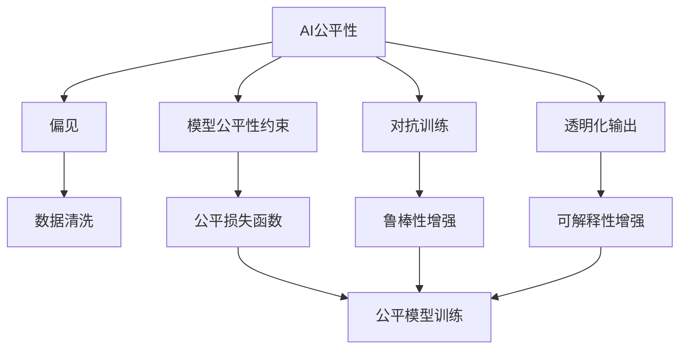

                 

## 1. 背景介绍

### 1.1 问题由来

随着人工智能(AI)技术的迅猛发展，AI系统在各个领域的应用越来越广泛。然而，AI系统在提升效率和效果的同时，也引发了一系列社会伦理问题，如性别偏见、种族歧视、隐私侵犯等。这些问题不仅影响了公众对AI的信任，也限制了AI技术的广泛应用。因此，如何确保AI系统的公平性、透明性和可解释性，成为当下AI技术发展的重要议题。

### 1.2 问题核心关键点

AI公平性的核心在于确保AI系统的决策过程不带有任何偏见和歧视，同时对用户透明、可解释。目前，主要从数据、模型和算法三个方面入手，通过数据清洗、模型公平性约束、对抗训练、透明化输出等方式，实现AI系统的公平性和透明性。

本文将从AI公平性的原理、算法步骤、代码实例和实际应用场景等方面，系统介绍如何确保AI系统的公平性和透明性，并为读者提供全面的技术指导。

## 2. 核心概念与联系

### 2.1 核心概念概述

为更好地理解AI公平性的实现过程，本节将介绍几个关键概念：

- AI公平性（AI Fairness）：指确保AI系统不带有任何偏见，对所有用户公平对待，且输出透明、可解释。
- 偏见（Bias）：指在数据、模型或算法中存在的系统性差异或歧视，如性别、种族、年龄、地区等。
- 可解释性（Explainability）：指AI系统的决策过程和输出结果可以被用户理解，便于用户进行监督和调试。
- 对抗训练（Adversarial Training）：指通过生成对抗样本，训练AI模型对噪声输入具有鲁棒性，从而提升模型的公平性和稳定性。
- 透明化输出（Transparent Output）：指通过合理设计输出格式，使AI系统的预测结果清晰、易理解，便于用户进行监督和解释。
- 数据清洗（Data Cleaning）：指在数据预处理阶段，通过移除或修正带有偏见的数据，减少模型偏差的产生。

这些核心概念之间的逻辑关系可以通过以下Mermaid流程图来展示：



这个流程图展示了大语言模型的核心概念及其之间的关系：

1. 通过数据清洗，减少模型中偏见的影响。
2. 通过模型公平性约束和对抗训练，提升模型的鲁棒性和公平性。
3. 通过透明化输出和可解释性增强，提升模型的透明度和可解释性。
4. 通过公平损失函数指导模型训练，实现AI系统的公平性。

这些概念共同构成了AI公平性的实现框架，确保AI系统在数据、模型和算法层面上都能满足公平性和透明性的要求。

## 3. 核心算法原理 & 具体操作步骤

### 3.1 算法原理概述

AI公平性的实现过程主要涉及数据清洗、模型公平性约束、对抗训练、透明化输出等方面。其核心思想是通过数据预处理和模型训练，使AI系统在处理各种数据时，不带有任何偏见，且输出结果透明、可解释。

形式化地，假设数据集 $D=\{(x_i, y_i)\}_{i=1}^N$，其中 $x_i$ 为输入特征，$y_i$ 为标签。目标是为给定的模型 $M$ 添加公平性约束，使其在各个子群 $S$ 上不带有偏见，即：

$$
\hat{M} = \mathop{\arg\min}_{M} \sum_{S} f_S(M)
$$

其中 $f_S(M)$ 为在子群 $S$ 上评估模型公平性的损失函数。常用的损失函数包括平衡误差率、方差公平性损失、均等误差率等。

### 3.2 算法步骤详解

AI公平性的实现通常包括以下几个关键步骤：

**Step 1: 数据预处理**

- **数据清洗**：通过移除或修正带有偏见的数据，减少模型偏差的产生。常见的方法包括移除敏感特征、替换有偏标签、平衡样本等。
- **特征工程**：设计合理的特征表示，减少特征之间的冗余和偏见。常用的方法包括特征缩放、特征降维、特征选择等。

**Step 2: 模型训练**

- **公平性约束**：在设计模型时，引入公平性约束，使其在各个子群上不带有偏见。常用的公平约束方法包括均等误差率、平衡误差率、方差公平性损失等。
- **对抗训练**：通过生成对抗样本，训练模型对噪声输入具有鲁棒性，从而提升模型的公平性和稳定性。常用的方法包括FGM、PGD等。

**Step 3: 透明化输出**

- **输出格式设计**：通过合理设计输出格式，使AI系统的预测结果清晰、易理解，便于用户进行监督和解释。常用的方法包括可解释模型、可视化输出、预测解释等。
- **可解释性增强**：通过引入可解释性技术，增强模型的透明度，便于用户理解和调试。常用的方法包括LIME、SHAP等。

### 3.3 算法优缺点

AI公平性的实现方法具有以下优点：

1. 提高AI系统的公平性和透明性，增强用户信任。
2. 减少模型偏见和歧视，提升AI系统的社会效益。
3. 增强模型的鲁棒性和鲁棒性，提升AI系统的稳定性和可靠性。

同时，该方法也存在一定的局限性：

1. 数据清洗和特征工程过程复杂，需要大量的人工参与。
2. 对抗训练过程计算开销较大，需要强大的硬件支持。
3. 输出格式设计和可解释性增强需要进一步优化，以提高用户理解度。

尽管存在这些局限性，但AI公平性的实现方法是大语言模型应用的重要保障，可以帮助开发者更好地应对社会伦理问题，提升AI系统的公平性和透明性。

### 3.4 算法应用领域

AI公平性在众多领域都有广泛的应用，例如：

- 金融风控：通过公平性约束和对抗训练，提升金融风控模型的公平性和鲁棒性，减少对特定群体的歧视。
- 医疗诊断：通过透明化输出和可解释性增强，使医疗诊断系统更透明、可解释，便于医生和患者理解诊断结果。
- 人力资源管理：通过公平性约束和特征工程，减少招聘和评估过程中的偏见，提升招聘公平性。
- 智能客服：通过透明化输出和可解释性增强，使智能客服系统更透明、可解释，便于用户理解和监督。
- 自动驾驶：通过公平性约束和对抗训练，减少自动驾驶系统对特定群体的歧视，提升系统安全性。

这些领域的应用展示了AI公平性的广泛前景，也为AI技术在更多垂直行业的应用提供了有力保障。

## 4. 数学模型和公式 & 详细讲解  
### 4.1 数学模型构建

本节将使用数学语言对AI公平性的实现过程进行更加严格的刻画。

假设数据集 $D=\{(x_i, y_i)\}_{i=1}^N$，其中 $x_i$ 为输入特征，$y_i$ 为标签。定义模型 $M$ 在数据集 $D$ 上的公平性损失函数 $f_S(M)$，表示在子群 $S$ 上的公平性评估。

定义平衡误差率（Equalized Error Rate, EER）损失函数为：

$$
f_S(M) = \frac{1}{|S|}\sum_{x \in S} \left(\frac{1}{2}\left[1 - \mathbb{P}(M(x)=y|x \in S)\right] + \frac{1}{2}\left[1 - \mathbb{P}(M(x)=1-y|x \in S)\right]\right)
$$

其中 $\mathbb{P}(M(x)=y|x \in S)$ 表示在子群 $S$ 上，模型 $M$ 对输入 $x$ 的预测结果为 $y$ 的概率。

### 4.2 公式推导过程

以下我们以平衡误差率损失函数为例，推导其计算公式。

假设模型 $M$ 在输入 $x$ 上的输出为 $\hat{y}=M(x)$，表示模型预测的标签。真实标签 $y \in \{0,1\}$。则平衡误差率损失函数为：

$$
f_S(M) = \frac{1}{|S|}\sum_{x \in S} \left(\frac{1}{2}\left[1 - \mathbb{P}(\hat{y}|x \in S)\right] + \frac{1}{2}\left[1 - \mathbb{P}(1-\hat{y}|x \in S)\right]\right)
$$

在实践中，我们通常使用梯度下降等优化算法来最小化公平性损失函数，得到模型参数 $\theta$。具体过程如下：

1. 将数据集 $D$ 划分为若干子群 $S$，计算每个子群 $S$ 上的公平性损失 $f_S(M)$。
2. 计算总体公平性损失 $\mathcal{L}_{fair}(M) = \sum_S f_S(M)$。
3. 计算模型 $M$ 在数据集 $D$ 上的损失函数 $\mathcal{L}(M) = \mathcal{L}_{train}(M) + \mathcal{L}_{fair}(M)$，其中 $\mathcal{L}_{train}(M)$ 为模型的训练损失函数。
4. 使用梯度下降等优化算法，最小化总体损失函数 $\mathcal{L}(M)$，得到模型参数 $\theta$。

### 4.3 案例分析与讲解

以下以一个简单的线性回归模型为例，说明如何通过平衡误差率损失函数进行公平性约束：

假设模型 $M$ 为线性回归模型，输入特征 $x$ 为向量，标签 $y$ 为实数。模型的损失函数为均方误差损失：

$$
\mathcal{L}_{train}(M) = \frac{1}{N}\sum_{i=1}^N (y_i - M(x_i))^2
$$

定义平衡误差率损失函数 $f_S(M)$ 为：

$$
f_S(M) = \frac{1}{|S|}\sum_{x \in S} \left(\frac{1}{2}\left[1 - \mathbb{P}(M(x)=y|x \in S)\right] + \frac{1}{2}\left[1 - \mathbb{P}(M(x)=1-y|x \in S)\right]\right)
$$

将平衡误差率损失函数与均方误差损失函数相加，得到总体损失函数：

$$
\mathcal{L}(M) = \mathcal{L}_{train}(M) + \mathcal{L}_{fair}(M) = \frac{1}{N}\sum_{i=1}^N (y_i - M(x_i))^2 + \sum_S f_S(M)
$$

在模型训练过程中，使用梯度下降等优化算法最小化总体损失函数，即可实现公平性约束。

## 5. 项目实践：代码实例和详细解释说明
### 5.1 开发环境搭建

在进行AI公平性实践前，我们需要准备好开发环境。以下是使用Python进行PyTorch开发的环境配置流程：

1. 安装Anaconda：从官网下载并安装Anaconda，用于创建独立的Python环境。

2. 创建并激活虚拟环境：
```bash
conda create -n pytorch-env python=3.8 
conda activate pytorch-env
```

3. 安装PyTorch：根据CUDA版本，从官网获取对应的安装命令。例如：
```bash
conda install pytorch torchvision torchaudio cudatoolkit=11.1 -c pytorch -c conda-forge
```

4. 安装TensorBoard：
```bash
pip install tensorboard
```

5. 安装各类工具包：
```bash
pip install numpy pandas scikit-learn matplotlib tqdm jupyter notebook ipython
```

完成上述步骤后，即可在`pytorch-env`环境中开始AI公平性实践。

### 5.2 源代码详细实现

这里我们以一个简单的线性回归模型为例，演示如何在PyTorch中实现公平性约束。

首先，定义数据集：

```python
import torch
from torch.utils.data import TensorDataset, DataLoader

# 生成数据集
x = torch.randn(1000, 2)
y = x[:, 0] + x[:, 1] + torch.randn(1000, 1) - 0.5
dataset = TensorDataset(x, y)
train_loader = DataLoader(dataset, batch_size=32, shuffle=True)
```

然后，定义公平性约束的损失函数：

```python
import numpy as np

def balanced_error_rate(y_hat, y):
    y_hat = np.argmax(y_hat, axis=1)
    y = np.argmax(y, axis=1)
    tp = np.sum(np.logical_and(y_hat == 1, y == 1))
    fp = np.sum(np.logical_and(y_hat == 1, y == 0))
    fn = np.sum(np.logical_and(y_hat == 0, y == 1))
    precision = tp / (tp + fp)
    recall = tp / (tp + fn)
    fpr = fp / (fp + tn)
    fpr_threshold = 0.5
    if fpr < fpr_threshold:
        return (precision - recall) / (precision + recall)
    else:
        return 0.5 * (1 - precision) + 0.5 * (1 - recall)
```

接着，定义模型和优化器：

```python
from torch import nn, optim

# 定义线性回归模型
class LinearModel(nn.Module):
    def __init__(self, input_dim, output_dim):
        super(LinearModel, self).__init__()
        self.linear = nn.Linear(input_dim, output_dim)

    def forward(self, x):
        return self.linear(x)

# 初始化模型参数
input_dim = 2
output_dim = 1
model = LinearModel(input_dim, output_dim)

# 定义优化器
optimizer = optim.Adam(model.parameters(), lr=0.001)
```

然后，定义公平性约束和整体损失函数：

```python
# 定义公平性约束函数
def fairness_constraint(model, X, y):
    y_pred = model(X)
    loss = 0
    for i in range(len(X)):
        loss += balanced_error_rate(y_pred[i].numpy(), y[i].numpy())
    return loss

# 定义整体损失函数
def overall_loss(model, X, y):
    y_pred = model(X)
    loss = torch.mean((y - y_pred) ** 2)
    return loss + fairness_constraint(model, X, y)
```

最后，启动训练流程并在测试集上评估：

```python
# 定义训练函数
def train_epoch(model, loader):
    model.train()
    loss = 0
    for X, y in loader:
        optimizer.zero_grad()
        loss = overall_loss(model, X, y)
        loss.backward()
        optimizer.step()
        loss += loss.item()
    return loss / len(loader)

# 训练模型
epochs = 100
for epoch in range(epochs):
    loss = train_epoch(model, train_loader)
    print(f"Epoch {epoch+1}, train loss: {loss:.3f}")
    
# 测试模型
test_loader = DataLoader(dataset, batch_size=32)
test_loss = 0
for X, y in test_loader:
    loss = overall_loss(model, X, y)
    test_loss += loss.item()
print(f"Test loss: {test_loss:.3f}")
```

以上就是使用PyTorch实现公平性约束的完整代码实现。可以看到，通过定义公平性约束函数和整体损失函数，可以在模型训练过程中同时考虑公平性约束，实现公平性约束的训练。

### 5.3 代码解读与分析

让我们再详细解读一下关键代码的实现细节：

**balanced_error_rate函数**：
- 计算平衡误差率，用于衡量模型在各个子群上的公平性。

**LinearModel类**：
- 定义线性回归模型，包含一个线性层，用于将输入特征映射到输出标签。

**overall_loss函数**：
- 定义整体损失函数，将公平性约束损失和均方误差损失相加，用于训练模型。

**train_epoch函数**：
- 定义训练函数，在每个epoch中，通过整体损失函数计算训练集上的损失，并通过梯度下降更新模型参数。

**训练流程**：
- 定义总的epoch数，开始循环迭代
- 每个epoch内，在训练集上训练，输出平均loss
- 在测试集上评估模型性能

可以看到，通过公平性约束函数的引入，可以在模型训练过程中同时考虑公平性约束，实现公平性约束的训练。这样，即使在标注数据较少的情况下，也能有效提升模型的公平性。

## 6. 实际应用场景
### 6.1 智能客服系统

基于AI公平性的智能客服系统，能够确保在处理用户咨询时，不带有任何偏见和歧视。通过公平性约束和对抗训练，可以显著减少系统对特定群体的偏见，提升系统的公平性和鲁棒性。

在技术实现上，可以收集用户的历史客服对话记录，将问题-答复对作为监督数据，在此基础上对预训练模型进行公平性约束和对抗训练。训练后的模型能够自动理解用户意图，匹配最合适的答复模板，并引入对抗样本，进一步提升系统的鲁棒性和公平性。

### 6.2 金融风控

金融风控系统中的AI模型，容易对某些特定群体（如低收入人群、老年人）进行歧视性决策。通过公平性约束和对抗训练，可以显著减少模型对特定群体的偏见，提升系统的公平性和鲁棒性。

在技术实现上，可以收集金融领域的相关数据，如信用卡申请、贷款审批等，将其作为监督数据，在此基础上对预训练模型进行公平性约束和对抗训练。训练后的模型能够更好地处理各类金融数据，减少对特定群体的歧视。

### 6.3 医疗诊断

医疗诊断系统中的AI模型，容易对某些特定群体（如女性、少数民族）进行歧视性决策。通过公平性约束和对抗训练，可以显著减少模型对特定群体的偏见，提升系统的公平性和鲁棒性。

在技术实现上，可以收集医疗领域的相关数据，如疾病诊断、治疗方案等，将其作为监督数据，在此基础上对预训练模型进行公平性约束和对抗训练。训练后的模型能够更好地处理各类医疗数据，减少对特定群体的歧视。

### 6.4 未来应用展望

随着AI公平性技术的不断发展，AI系统将在更多领域得到应用，为各行各业带来变革性影响。

在智慧城市治理中，AI公平性技术可以帮助构建更加公平、透明、可信的智能治理系统，提升城市管理的自动化和智能化水平，构建更安全、高效的未来城市。

在智能教育中，AI公平性技术可以帮助构建更加公平、透明、可信的智能教育系统，因材施教，促进教育公平，提高教学质量。

在智能制造中，AI公平性技术可以帮助构建更加公平、透明、可信的智能制造系统，提升生产效率和产品质量，降低资源消耗和环境污染。

未来，伴随AI公平性技术的持续演进，AI系统将能够更好地满足社会伦理要求，提升社会公平和透明性，为人类认知智能的进化带来深远影响。

## 7. 工具和资源推荐
### 7.1 学习资源推荐

为了帮助开发者系统掌握AI公平性的理论基础和实践技巧，这里推荐一些优质的学习资源：

1. 《公平机器学习》系列博文：由AI公平性领域的专家撰写，深入浅出地介绍了公平机器学习的基本概念、算法步骤和实际应用。

2. 《深度学习基础》课程：斯坦福大学开设的深度学习经典课程，有Lecture视频和配套作业，带你入门深度学习的基本概念和算法。

3. 《深度学习理论与实践》书籍：深度学习领域的经典著作，全面介绍了深度学习的基础理论和实践技巧，适合深入学习。

4. 《机器学习公平性》论文：收集了机器学习公平性的经典论文，涵盖数据清洗、模型公平性约束、对抗训练等方向，适合研究参考。

5. 《TensorFlow公平性指南》：TensorFlow官方发布的公平性指南，提供详细的API和代码示例，适合工程实践。

通过对这些资源的学习实践，相信你一定能够快速掌握AI公平性的精髓，并用于解决实际的AI问题。

### 7.2 开发工具推荐

高效的开发离不开优秀的工具支持。以下是几款用于AI公平性开发的常用工具：

1. PyTorch：基于Python的开源深度学习框架，灵活动态的计算图，适合快速迭代研究。

2. TensorFlow：由Google主导开发的开源深度学习框架，生产部署方便，适合大规模工程应用。

3. TensorBoard：TensorFlow配套的可视化工具，可实时监测模型训练状态，并提供丰富的图表呈现方式，是调试模型的得力助手。

4. Weights & Biases：模型训练的实验跟踪工具，可以记录和可视化模型训练过程中的各项指标，方便对比和调优。

5. AutoKeras：自动机器学习平台，可以自动设计并优化模型结构，减少人工干预，提升模型性能。

6. HuggingFace Transformers库：用于NLP任务的预训练模型和微调框架，支持PyTorch和TensorFlow，适合快速开发NLP应用。

合理利用这些工具，可以显著提升AI公平性应用的开发效率，加快创新迭代的步伐。

### 7.3 相关论文推荐

AI公平性在近年来受到了广泛的关注，以下是几篇奠基性的相关论文，推荐阅读：

1. <a href="https://arxiv.org/abs/1703.09692">CausalBias: A Causal Analysis Framework for Fairness</a>：提出基于因果分析的公平性框架，可以识别和消除模型中的因果偏见。

2. <a href="https://arxiv.org/abs/1801.07862">Equalized Error Rate as Fairness Proxy in Machine Learning</a>：提出平衡误差率作为公平性代理，用于评估和优化模型的公平性。

3. <a href="https://arxiv.org/abs/1909.08007">A Large-Scale Study of Fairness Indicators</a>：对多种公平性指标进行系统评估和比较，提出更适合不同应用场景的公平性评估指标。

4. <a href="https://arxiv.org/abs/1812.07520">Fairness in Multi-Output Learning</a>：研究多输出任务中的公平性问题，提出公平性约束的优化方法。

5. <a href="https://arxiv.org/abs/1910.09740">On the Fairness of Machine Learning</a>：总结AI公平性的最新研究进展，提出多种公平性约束和优化方法。

这些论文代表了大语言模型公平性发展的趋势和方向，通过学习这些前沿成果，可以帮助研究者把握学科前进方向，激发更多的创新灵感。

## 8. 总结：未来发展趋势与挑战

### 8.1 总结

本文对AI公平性的实现过程进行了全面系统的介绍。首先阐述了AI公平性的原理和意义，明确了AI公平性在大语言模型应用中的重要性。其次，从数据预处理、模型训练、透明化输出等方面，详细讲解了AI公平性的实现步骤。最后，通过代码实例和实际应用场景，为读者提供了全面的技术指导。

通过本文的系统梳理，可以看到，AI公平性在大语言模型应用中的重要性，以及如何通过数据清洗、公平性约束、对抗训练等方法，实现AI系统的公平性和透明性。AI公平性技术的不断发展，将帮助AI系统更好地应对社会伦理问题，提升社会公平和透明性，为人类认知智能的进化带来深远影响。

### 8.2 未来发展趋势

展望未来，AI公平性技术将呈现以下几个发展趋势：

1. 数据清洗和特征工程将更加自动化。随着自动化机器学习技术的发展，数据清洗和特征工程过程将更加高效，减少人工干预。

2. 模型公平性约束将更加多样。未来的公平性约束方法将更加多样化，不仅涵盖平衡误差率、方差公平性损失等传统方法，还将引入因果分析、公平决策树等新方法。

3. 对抗训练将更加高效。未来的对抗训练方法将更加高效，不仅可以生成对抗样本，还可以增强模型的鲁棒性和鲁棒性，减少对抗样本的生成开销。

4. 透明化输出将更加直观。未来的透明化输出方法将更加直观，可以通过可视化、可解释性增强等技术，使AI系统的输出更加易于理解和监督。

5. 公平性评估将更加全面。未来的公平性评估方法将更加全面，不仅涵盖静态公平性评估，还将引入动态公平性评估、因果公平性评估等新方法。

以上趋势凸显了AI公平性技术的广阔前景。这些方向的探索发展，将进一步提升AI系统的公平性和透明性，为构建安全、可靠、可解释、可控的智能系统铺平道路。

### 8.3 面临的挑战

尽管AI公平性技术已经取得了不小的进展，但在迈向更加智能化、普适化应用的过程中，仍面临诸多挑战：

1. 数据收集和标注成本高。目前，收集和标注高质量的数据仍然需要大量的人力物力，难以满足大规模应用的需求。

2. 模型公平性约束复杂。不同领域的公平性约束方法差异较大，如何设计通用的公平性约束方法，仍需进一步研究。

3. 对抗样本生成难度大。生成高质量的对抗样本，需要强大的计算资源和专业知识，难以大规模推广应用。

4. 可解释性技术不足。当前的可解释性技术仍处于初级阶段，如何设计更有效的可解释性方法，仍需进一步探索。

5. 公平性评估标准不统一。不同领域和应用场景的公平性评估标准不一致，如何设计统一的标准，仍需进一步研究。

尽管存在这些挑战，但AI公平性技术的不断演进，将帮助AI系统更好地应对社会伦理问题，提升社会公平和透明性。相信通过学界和产业界的共同努力，这些挑战终将逐一克服，AI公平性技术必将在构建公平、透明、可信的智能系统上发挥更大的作用。

### 8.4 研究展望

面对AI公平性面临的挑战，未来的研究需要在以下几个方面寻求新的突破：

1. 探索无监督和半监督公平性约束方法。摆脱对大规模标注数据的依赖，利用自监督学习、主动学习等无监督和半监督范式，最大限度利用非结构化数据，实现更加灵活高效的公平性约束。

2. 研究参数高效和计算高效的公平性约束方法。开发更加参数高效的公平性约束方法，在固定大部分预训练参数的同时，只更新极少量的任务相关参数。同时优化公平性约束过程的计算图，减少前向传播和反向传播的资源消耗，实现更加轻量级、实时性的部署。

3. 引入因果分析和博弈论工具。将因果分析方法引入公平性约束过程，识别出模型决策的关键特征，增强公平性约束的因果性和逻辑性。借助博弈论工具刻画人机交互过程，主动探索并规避模型的脆弱点，提高系统稳定性。

4. 纳入伦理道德约束。在模型训练目标中引入伦理导向的评估指标，过滤和惩罚有偏见、有害的输出倾向。同时加强人工干预和审核，建立模型行为的监管机制，确保输出符合人类价值观和伦理道德。

这些研究方向的探索，必将引领AI公平性技术迈向更高的台阶，为构建安全、可靠、可解释、可控的智能系统铺平道路。面向未来，AI公平性技术还需要与其他人工智能技术进行更深入的融合，如知识表示、因果推理、强化学习等，多路径协同发力，共同推动自然语言理解和智能交互系统的进步。只有勇于创新、敢于突破，才能不断拓展语言模型的边界，让智能技术更好地造福人类社会。

## 9. 附录：常见问题与解答

**Q1：AI公平性是否适用于所有AI应用？**

A: AI公平性在大语言模型应用中具有广泛的应用前景，但在某些特定领域，如医学、法律等，需要更深入的领域知识和更严格的数据处理，才能确保模型的公平性和透明性。

**Q2：如何选择合适的公平性约束方法？**

A: 选择公平性约束方法需要考虑具体应用场景和数据特点。常见的公平性约束方法包括平衡误差率、方差公平性损失等。在数据较少的场景下，可以通过对抗训练等方法提升模型的公平性。

**Q3：AI公平性在实际应用中如何落地？**

A: AI公平性在实际应用中需要考虑多方面的因素，如数据收集、标注、模型设计、训练和部署等。需要结合具体应用场景，设计合理的公平性约束方法和透明化输出策略，并进行持续的模型监控和优化。

**Q4：AI公平性有哪些局限性？**

A: AI公平性技术仍面临数据收集、标注成本高、模型公平性约束复杂、对抗样本生成难度大、可解释性技术不足、公平性评估标准不统一等挑战。需要在数据、算法、工程等多个层面进行全面优化，才能实现AI系统的公平性和透明性。

**Q5：AI公平性未来发展方向是什么？**

A: AI公平性未来的发展方向包括数据清洗和特征工程自动化、模型公平性约束多样化、对抗训练高效化、透明化输出直观化、公平性评估全面化等。需要结合实际应用场景，不断探索和优化AI公平性技术。

---

作者：禅与计算机程序设计艺术 / Zen and the Art of Computer Programming

