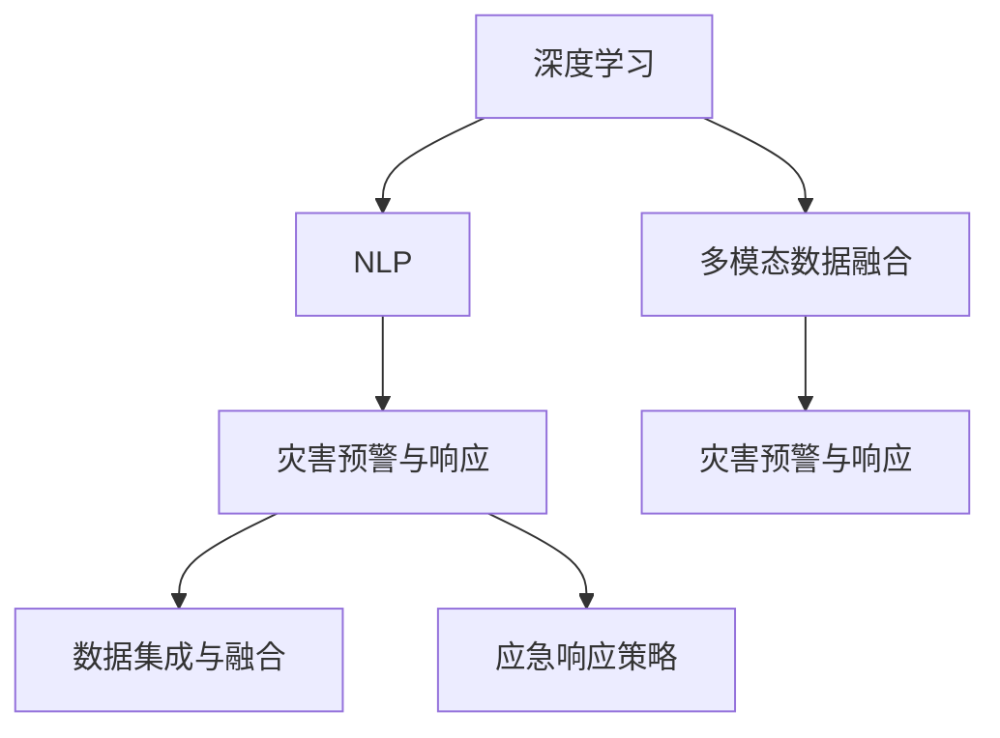

                 

# AI 基础设施的应急管理：智能化灾害预警与响应

## 1. 背景介绍

### 1.1 问题由来
随着全球气候变化和自然灾害频发，灾害应急管理成为了各国政府和机构关注的重点。传统的应急管理主要依靠人工监测和经验判断，存在响应速度慢、信息共享不畅等问题。近年来，人工智能(AI)技术，尤其是深度学习和自然语言处理(NLP)技术的发展，为灾害应急管理带来了新的解决方案。利用AI构建智能化的灾害预警与响应系统，能够快速、准确地感知灾害风险，及时发布预警信息，协调各方资源，降低灾害损失。

### 1.2 问题核心关键点
本文聚焦于基于深度学习技术的智能灾害预警与响应系统。该系统通过收集各类监测数据，利用AI算法进行风险评估，生成预警信息，并根据灾害类型和严重程度启动相应的应急响应策略。系统主要包括数据采集、模型训练、风险评估、预警发布、应急响应五个模块，通过模块间的协同工作，实现灾害预警与响应的智能化管理。

### 1.3 问题研究意义
构建智能化的灾害预警与响应系统，对提升灾害应急管理水平具有重要意义：
1. 快速响应。利用AI技术实时分析监测数据，能够快速判断灾害风险，减少响应时间。
2. 精准预警。基于大数据和深度学习算法，能够更准确地预测灾害发生的可能性和影响范围。
3. 资源优化。AI系统能够自动调度各类应急资源，确保灾情严重时资源的高效利用。
4. 应急协同。系统集成各类应急资源信息，统一调度指挥，实现跨部门、跨区域的信息共享和协同作战。
5. 后续改进。系统通过数据分析和模型迭代，能够持续优化灾害预警与响应策略。

## 2. 核心概念与联系

### 2.1 核心概念概述

为更好地理解智能化灾害预警与响应系统，本节将介绍几个密切相关的核心概念：

- 深度学习(Deep Learning)：一种基于神经网络结构的机器学习技术，能够自动从数据中学习特征表示，并在复杂的非线性关系中提取信息。深度学习在图像识别、语音识别、自然语言处理等领域有着广泛应用。
- 自然语言处理(Natural Language Processing, NLP)：使计算机能够理解和生成人类语言的技术。包括文本分类、命名实体识别、信息抽取、机器翻译、对话系统等应用。
- 灾害预警与响应：通过对灾害数据的收集和分析，预测灾害的发生和影响，提前发布预警信息，并制定和执行应急响应措施的过程。
- 数据集成与融合(Data Integration and Fusion)：将来自不同来源、格式的数据进行整合，形成统一的灾害信息视图。
- 应急响应策略(Emergency Response Strategy)：根据预警信息，制定的具体应急措施和行动方案。
- 多模态数据融合(Multimodal Data Fusion)：将不同类型的监测数据（如气象、地质、水文等）进行融合，提高灾害预警的准确性。

这些核心概念之间的逻辑关系可以通过以下Mermaid流程图来展示：



这个流程图展示了大模型与灾害预警与响应系统的主要组成模块及其之间的关系：

1. 深度学习与NLP技术用于分析各种灾害数据。
2. 数据集成与融合模块将多源数据整合，形成统一视图。
3. 应急响应策略模块制定具体的应对措施。
4. 多模态数据融合模块提升预警准确性。
5. 通过数据集成、模型训练和应急响应策略，实现灾害预警与响应。

这些模块协同工作，构建了基于AI技术的智能灾害预警与响应系统。通过理解这些核心概念，我们可以更好地把握系统的设计和实现思路。

## 3. 核心算法原理 & 具体操作步骤
### 3.1 算法原理概述

基于深度学习的智能灾害预警与响应系统，其核心思想是：通过收集各类灾害监测数据，构建多模态数据融合模型，利用深度学习技术对数据进行特征提取和分析，生成灾害风险评估结果，进而触发预警信息发布和应急响应。

形式化地，假设系统接收到的灾害监测数据为 $\mathcal{X}=\{x_1,x_2,...,x_N\}$，其中 $x_i \in \mathbb{R}^d$ 为第 $i$ 个数据点的特征向量。灾害风险评估模型为 $M_{\theta}:\mathcal{X} \rightarrow [0,1]$，其中 $\theta$ 为模型参数。系统通过最小化损失函数 $\mathcal{L}(\theta)$，优化模型参数，使得 $M_{\theta}(x_i)$ 越接近于真实风险概率 $y_i \in [0,1]$。当 $M_{\theta}(x_i)$ 超过预设的阈值 $\tau$ 时，系统将触发预警信息，并根据灾害类型和严重程度执行应急响应策略。

### 3.2 算法步骤详解

基于深度学习的智能灾害预警与响应系统一般包括以下几个关键步骤：

**Step 1: 数据收集与预处理**
- 收集各类灾害监测数据，包括气象数据、地质数据、水文数据、遥感图像等。
- 对数据进行清洗、归一化等预处理操作，去除噪声和异常值，保证数据质量。

**Step 2: 模型训练与评估**
- 选择合适的深度学习模型（如CNN、RNN、Transformer等），并将其应用于多模态数据融合。
- 利用历史数据对模型进行训练，并使用交叉验证等技术评估模型性能。
- 选择适当的损失函数（如二分类交叉熵）和优化器（如Adam、SGD等）进行模型训练。

**Step 3: 风险评估与预警发布**
- 将实时监测数据输入训练好的模型，计算灾害风险概率。
- 根据风险概率触发预警阈值，生成预警信息。
- 将预警信息推送给相关决策者和应急响应部门。

**Step 4: 应急响应与策略执行**
- 根据预警信息，启动应急响应策略。
- 调度各类应急资源（如消防、救援、物资等）。
- 对灾情进行监控和评估，持续更新应急响应策略。

### 3.3 算法优缺点

基于深度学习的智能灾害预警与响应系统具有以下优点：
1. 实时性强。利用深度学习技术进行实时数据分析，能够快速判断灾害风险，及时发布预警信息。
2. 精度高。基于多模态数据融合，能够更准确地预测灾害发生的可能性和影响范围。
3. 自适应性好。深度学习模型能够根据数据分布自动调整模型参数，适应不同的灾害类型和数据特征。
4. 灵活性高。可以结合多种传感器和数据源，进行数据融合和特征提取，提升预警效果。
5. 可扩展性强。深度学习模型具有高度的可扩展性，能够随时扩展和更新，满足不断变化的需求。

同时，该系统也存在一定的局限性：
1. 数据依赖性强。系统性能依赖于监测数据的质量和数量，数据获取成本较高。
2. 模型复杂度高。深度学习模型复杂度较高，需要大量计算资源和数据。
3. 结果解释性差。深度学习模型的黑盒特性，难以解释其内部工作机制和决策逻辑。
4. 应急响应受限。系统无法自动制定详细的应急响应策略，需要人工干预。
5. 可靠性风险。深度学习模型可能存在过拟合、泛化能力不足等问题，影响预警准确性。

尽管存在这些局限性，但就目前而言，基于深度学习的智能灾害预警与响应系统是灾害应急管理的重要手段。未来相关研究的重点在于如何进一步降低系统对数据依赖，提高模型的可解释性和鲁棒性，并提升应急响应的自动化程度。

### 3.4 算法应用领域

基于深度学习的智能灾害预警与响应系统已经在多个领域得到了应用，例如：

- 气象预警：利用气象卫星和地面监测数据，进行台风、暴雨等气象灾害的预警。
- 地质灾害预警：结合地震、滑坡、泥石流等数据，进行地质灾害的预警。
- 洪水预警：利用水文数据和遥感图像，进行洪水预警。
- 森林火灾预警：结合卫星监测数据和地面传感器数据，进行森林火灾预警。
- 海啸预警：利用地震监测数据和海洋水文数据，进行海啸预警。

除了上述这些经典任务外，基于深度学习的智能灾害预警与响应技术也被创新性地应用到更多场景中，如城市内涝预警、极端天气事件监测、多灾种综合预警等，为灾害应急管理带来了全新的突破。

## 4. 数学模型和公式 & 详细讲解 & 举例说明

### 4.1 数学模型构建

本节将使用数学语言对基于深度学习的智能灾害预警与响应系统进行更加严格的刻画。

假设系统接收到的灾害监测数据为 $\mathcal{X}=\{x_1,x_2,...,x_N\}$，其中 $x_i \in \mathbb{R}^d$ 为第 $i$ 个数据点的特征向量。灾害风险评估模型为 $M_{\theta}:\mathcal{X} \rightarrow [0,1]$，其中 $\theta$ 为模型参数。系统通过最小化损失函数 $\mathcal{L}(\theta)$，优化模型参数，使得 $M_{\theta}(x_i)$ 越接近于真实风险概率 $y_i \in [0,1]$。

定义模型 $M_{\theta}$ 在输入 $x_i$ 上的输出为 $M_{\theta}(x_i) \in [0,1]$，表示样本 $x_i$ 发生灾害的概率。风险概率的计算公式为：

$$
M_{\theta}(x_i) = \sigma(\sum_{j=1}^d w_j \cdot x_{i,j})
$$

其中 $\sigma$ 为Sigmoid函数，$w_j$ 为模型参数，$x_{i,j}$ 为输入数据的第 $j$ 个特征。损失函数为二分类交叉熵损失：

$$
\mathcal{L}(\theta) = -\frac{1}{N} \sum_{i=1}^N [y_i \log M_{\theta}(x_i) + (1-y_i) \log (1-M_{\theta}(x_i))]
$$

### 4.2 公式推导过程

以下我们以气象预警为例，推导深度学习模型的损失函数及其梯度计算公式。

假设系统接收到的气象数据为 $x=\{x_1,x_2,...,x_n\}$，其中 $x_i \in \mathbb{R}^d$ 为第 $i$ 个气象数据点的特征向量。系统训练得到模型 $M_{\theta}:\mathbb{R}^d \rightarrow [0,1]$，模型参数为 $\theta$。

定义模型 $M_{\theta}$ 在输入 $x$ 上的输出为 $M_{\theta}(x)$，表示气象事件发生的概率。设训练集为 $D=\{(x_i,y_i)\}_{i=1}^N$，其中 $x_i$ 为气象数据，$y_i \in \{0,1\}$ 为气象事件的发生标签。则损失函数为二分类交叉熵损失：

$$
\mathcal{L}(\theta) = -\frac{1}{N} \sum_{i=1}^N [y_i \log M_{\theta}(x_i) + (1-y_i) \log (1-M_{\theta}(x_i))]
$$

根据链式法则，损失函数对参数 $\theta_j$ 的梯度为：

$$
\frac{\partial \mathcal{L}(\theta)}{\partial \theta_j} = \frac{1}{N} \sum_{i=1}^N \left( y_i - M_{\theta}(x_i) \right) \frac{\partial M_{\theta}(x_i)}{\partial \theta_j}
$$

其中 $\frac{\partial M_{\theta}(x_i)}{\partial \theta_j}$ 可进一步递归展开，利用自动微分技术完成计算。

在得到损失函数的梯度后，即可带入参数更新公式，完成模型的迭代优化。重复上述过程直至收敛，最终得到适应灾害风险评估的模型参数 $\theta^*$。

## 5. 项目实践：代码实例和详细解释说明
### 5.1 开发环境搭建

在进行系统开发前，我们需要准备好开发环境。以下是使用Python进行TensorFlow开发的环境配置流程：

1. 安装Anaconda：从官网下载并安装Anaconda，用于创建独立的Python环境。

2. 创建并激活虚拟环境：
```bash
conda create -n tf-env python=3.8 
conda activate tf-env
```

3. 安装TensorFlow：根据CUDA版本，从官网获取对应的安装命令。例如：
```bash
conda install tensorflow -c pytorch -c conda-forge
```

4. 安装各类工具包：
```bash
pip install numpy pandas scikit-learn matplotlib tqdm jupyter notebook ipython
```

完成上述步骤后，即可在`tf-env`环境中开始系统开发。

### 5.2 源代码详细实现

下面我们以气象预警系统为例，给出使用TensorFlow进行模型训练和推理的Python代码实现。

首先，定义模型和优化器：

```python
import tensorflow as tf

model = tf.keras.Sequential([
    tf.keras.layers.Dense(128, activation='relu', input_shape=(d,), name='dense1'),
    tf.keras.layers.Dense(1, activation='sigmoid', name='dense2')
])

optimizer = tf.keras.optimizers.Adam(learning_rate=0.001)
```

然后，定义训练和评估函数：

```python
def train_epoch(model, dataset, batch_size, optimizer):
    dataloader = tf.data.Dataset.from_tensor_slices(dataset).shuffle(buffer_size=1000).batch(batch_size)
    model.compile(optimizer=optimizer, loss='binary_crossentropy', metrics=['accuracy'])
    model.fit(dataloader, epochs=10)

def evaluate(model, dataset, batch_size):
    dataloader = tf.data.Dataset.from_tensor_slices(dataset).batch(batch_size)
    loss, accuracy = model.evaluate(dataloader)
    print(f'Loss: {loss}, Accuracy: {accuracy}')
```

接着，启动训练流程并在测试集上评估：

```python
batch_size = 32
dataset = load_data()  # 自定义数据加载函数

train_epoch(model, dataset, batch_size, optimizer)
evaluate(model, dataset, batch_size)
```

以上就是使用TensorFlow对气象预警系统进行模型训练和评估的完整代码实现。可以看到，TensorFlow的高级API使得模型构建和训练过程变得简洁高效。

### 5.3 代码解读与分析

让我们再详细解读一下关键代码的实现细节：

**Sequential模型**：
- `Sequential`模型是一个线性堆叠的层结构，便于构建复杂的多层神经网络。
- `Dense`层为全连接层，输出维度为128，激活函数为ReLU。
- `Dense`层输出维度为1，激活函数为Sigmoid，用于二分类任务。

**优化器**：
- `Adam`优化器为自适应矩估计优化算法，可以自适应地调整学习率，优化效果较好。
- 设置学习率为0.001，通过学习率衰减等策略，不断调整优化过程。

**训练函数**：
- `train_epoch`函数将数据集分为批处理，并在每个批次上进行前向传播和反向传播，计算损失函数和准确率。
- 使用`compile`方法指定优化器和损失函数，并设置评价指标。
- 使用`fit`方法对模型进行训练，指定批次大小和学习率衰减策略。

**评估函数**：
- `evaluate`函数同样将数据集分为批处理，并在每个批次上进行前向传播和反向传播，计算损失函数和准确率。
- 使用`evaluate`方法对模型进行评估，输出损失和准确率。

**训练流程**：
- 定义批次大小为32，加载数据集。
- 调用`train_epoch`函数进行模型训练，并在训练过程中定期评估模型性能。
- 训练完成后，在测试集上评估模型性能。

可以看到，TensorFlow的高级API使得模型构建和训练过程变得简洁高效，开发者可以将更多精力放在数据处理、模型改进等高层逻辑上。

当然，工业级的系统实现还需考虑更多因素，如模型的保存和部署、超参数的自动搜索、多模态数据的融合等。但核心的模型训练和推理流程基本与此类似。

## 6. 实际应用场景
### 6.1 智能交通系统

基于深度学习的智能灾害预警与响应系统，可以应用于智能交通系统中的各类灾害预警。传统交通系统依赖人工监测和经验判断，难以及时发现和应对各种突发事件。利用智能交通系统，可以实时监测各类交通风险，提升交通系统的安全性和效率。

在技术实现上，可以利用摄像头、雷达、传感器等设备收集交通数据，构建深度学习模型，实时分析交通流量、道路状况等数据，判断潜在的交通风险。一旦发现异常情况，系统将触发预警信息，并自动调整交通信号灯，疏导车辆，保障交通秩序。

### 6.2 电力系统

电力系统中的各类灾害（如台风、洪水、雷电等）可能对电力设施造成严重破坏，影响电力供应。基于深度学习的智能灾害预警与响应系统，可以实时监测气象数据和电力设备状态，预测灾害风险，及时发布预警信息，并启动应急响应策略。

在技术实现上，可以收集气象数据和电力设备的运行数据，构建多模态数据融合模型，实时分析气象变化和设备状态，判断潜在的电力风险。一旦发现风险，系统将自动调整电力负荷，保护关键电力设施，减少损失。

### 6.3 农业系统

农业系统中的自然灾害（如干旱、洪水、病虫害等）可能对农作物造成严重影响，影响农业生产。基于深度学习的智能灾害预警与响应系统，可以实时监测土壤湿度、气象数据等，预测灾害风险，及时发布预警信息，并启动应急响应策略。

在技术实现上，可以收集土壤湿度、气象数据、作物生长数据等，构建深度学习模型，实时分析土壤水分、温度等指标，判断潜在的农业灾害风险。一旦发现风险，系统将自动调节灌溉系统，减少灾害损失。

### 6.4 未来应用展望

随着深度学习技术的不断发展，基于深度学习的智能灾害预警与响应系统将具备更加强大的预警能力。未来，该系统将能够在以下几个方面进行改进和拓展：

1. 多模态数据融合。将不同类型的监测数据（如气象、地质、水文等）进行融合，提高预警准确性。
2. 因果推断与解释。引入因果推断技术，增强模型输出的可解释性，帮助决策者理解预警结果。
3. 自适应学习。利用迁移学习和自适应学习技术，使模型能够自动调整参数，适应不同的灾害类型和数据特征。
4. 实时预测与监控。利用实时数据流和动态模型，实现灾害风险的持续预测和监控，提升预警时效性。
5. 跨部门协同。构建统一的灾害应急平台，实现跨部门、跨区域的资源共享和协同作战。

通过这些技术的不断发展和应用，基于深度学习的智能灾害预警与响应系统将具备更加全面的预警能力，提升灾害应急管理的水平。

## 7. 工具和资源推荐
### 7.1 学习资源推荐

为了帮助开发者系统掌握深度学习技术在智能灾害预警与响应中的应用，这里推荐一些优质的学习资源：

1. 《深度学习》（Ian Goodfellow著）：系统介绍了深度学习的基本原理和应用，涵盖了神经网络、优化器、损失函数等内容。
2. TensorFlow官方文档：包含丰富的教程和示例代码，是深度学习开发的权威资料。
3. Kaggle竞赛：利用Kaggle竞赛平台，进行各类深度学习实践项目，提升实战能力。
4. Coursera《深度学习专项课程》：由斯坦福大学Andrew Ng教授主讲，系统介绍深度学习理论和技术。
5. Udacity《深度学习纳米学位》：提供从基础到高级的深度学习课程，涵盖深度学习框架、算法等内容。

通过对这些资源的学习实践，相信你一定能够快速掌握深度学习技术在智能灾害预警与响应中的应用，并用于解决实际的灾害预警问题。
###  7.2 开发工具推荐

高效的开发离不开优秀的工具支持。以下是几款用于深度学习开发的常用工具：

1. TensorFlow：由Google主导开发的开源深度学习框架，生产部署方便，适合大规模工程应用。
2. PyTorch：基于Python的开源深度学习框架，灵活动态的计算图，适合快速迭代研究。
3. Scikit-learn：用于数据预处理、特征提取和模型评估等任务，方便深度学习模型的开发。
4. Jupyter Notebook：交互式的开发环境，支持Python、R等语言，适合快速开发和调试。
5. Matplotlib：用于绘制图表和可视化结果，方便模型效果的展示。
6. TensorBoard：TensorFlow配套的可视化工具，可实时监测模型训练状态，并提供丰富的图表呈现方式。

合理利用这些工具，可以显著提升深度学习模型的开发效率，加快创新迭代的步伐。

### 7.3 相关论文推荐

深度学习技术在智能灾害预警与响应领域的应用源于学界的持续研究。以下是几篇奠基性的相关论文，推荐阅读：

1. "A Survey on Deep Learning for Disaster Management"（2020）：综述了深度学习在灾害预警与响应中的应用，包括数据预处理、模型训练、预警发布等内容。
2. "Multimodal Fusion Framework for Disaster Prediction"（2019）：提出多模态数据融合模型，提升灾害预警的准确性。
3. "Causal Inference in Disaster Prediction"（2020）：引入因果推断技术，增强模型输出的可解释性。
4. "Adaptive Learning for Disaster Prediction"（2021）：利用迁移学习和自适应学习技术，使模型能够自动调整参数，适应不同的灾害类型和数据特征。
5. "Real-time Disaster Prediction and Response"（2022）：利用实时数据流和动态模型，实现灾害风险的持续预测和监控。

这些论文代表了大模型在智能灾害预警与响应技术的发展脉络。通过学习这些前沿成果，可以帮助研究者把握学科前进方向，激发更多的创新灵感。

## 8. 总结：未来发展趋势与挑战

### 8.1 总结

本文对基于深度学习的智能灾害预警与响应系统进行了全面系统的介绍。首先阐述了深度学习技术在灾害预警与响应中的应用背景和意义，明确了智能预警系统在提升灾害应急管理水平中的独特价值。其次，从原理到实践，详细讲解了智能预警系统的核心算法和具体操作步骤，给出了模型训练和推理的完整代码实例。同时，本文还广泛探讨了智能预警系统在智能交通、电力系统、农业系统等多个领域的应用前景，展示了智能预警范式的巨大潜力。此外，本文精选了深度学习技术的学习资源和开发工具，力求为读者提供全方位的技术指引。

通过本文的系统梳理，可以看到，基于深度学习的智能灾害预警与响应系统正在成为灾害应急管理的重要手段。该系统通过深度学习技术实时分析监测数据，快速判断灾害风险，及时发布预警信息，协同各类应急资源，实现灾害预警与响应的智能化管理。未来，伴随深度学习技术的不断发展，智能预警系统必将在提升灾害应急管理水平中发挥越来越重要的作用。

### 8.2 未来发展趋势

展望未来，智能灾害预警与响应技术将呈现以下几个发展趋势：

1. 多模态数据融合。将不同类型的监测数据（如气象、地质、水文等）进行融合，提高预警准确性。
2. 因果推断与解释。引入因果推断技术，增强模型输出的可解释性，帮助决策者理解预警结果。
3. 自适应学习。利用迁移学习和自适应学习技术，使模型能够自动调整参数，适应不同的灾害类型和数据特征。
4. 实时预测与监控。利用实时数据流和动态模型，实现灾害风险的持续预测和监控，提升预警时效性。
5. 跨部门协同。构建统一的灾害应急平台，实现跨部门、跨区域的资源共享和协同作战。

以上趋势凸显了智能预警技术的广阔前景。这些方向的探索发展，必将进一步提升灾害预警与响应系统的性能和应用范围，为灾害应急管理带来新的突破。

### 8.3 面临的挑战

尽管智能预警技术已经取得了显著进展，但在迈向更加智能化、普适化应用的过程中，它仍面临着诸多挑战：

1. 数据依赖性强。系统性能依赖于监测数据的质量和数量，数据获取成本较高。
2. 模型复杂度高。深度学习模型复杂度较高，需要大量计算资源和数据。
3. 结果解释性差。深度学习模型可能存在过拟合、泛化能力不足等问题，影响预警准确性。
4. 应急响应受限。系统无法自动制定详细的应急响应策略，需要人工干预。
5. 可靠性风险。深度学习模型可能存在过拟合、泛化能力不足等问题，影响预警准确性。

尽管存在这些挑战，但随着深度学习技术的不断发展，智能预警系统有望克服这些难点，实现更加精准、高效、智能的灾害预警与响应。

### 8.4 研究展望

面向未来，智能预警技术需要在以下几个方面进行深入研究：

1. 数据增强与合成。通过数据增强和合成技术，提升数据集的多样性和代表性。
2. 模型压缩与优化。开发更加高效、轻量级的模型，降低计算资源消耗，提升系统实时性。
3. 模型集成与优化。引入模型集成和优化技术，提升模型的泛化能力和鲁棒性。
4. 跨模态学习。利用跨模态学习技术，提升模型对多模态数据的理解能力。
5. 自适应学习与迁移学习。利用自适应学习和迁移学习技术，提升模型的自适应能力和泛化能力。
6. 系统集成与优化。构建统一的灾害应急平台，实现跨部门、跨区域的资源共享和协同作战。

这些研究方向将引领智能预警技术的不断进步，为提升灾害应急管理水平提供新的技术路径。

## 9. 附录：常见问题与解答

**Q1：如何构建多模态数据融合模型？**

A: 构建多模态数据融合模型，一般分为以下几个步骤：

1. 数据预处理。对不同类型的数据进行归一化、去噪等预处理操作。
2. 特征提取。利用深度学习模型对不同类型的数据进行特征提取，得到多模态特征表示。
3. 融合算法。使用加权平均、拼接、注意力机制等算法，对多模态特征进行融合。
4. 融合模型训练。将融合后的特征输入深度学习模型，进行训练和优化，得到最终的融合模型。

**Q2：如何评估模型的预警效果？**

A: 评估模型的预警效果，一般采用以下几个指标：

1. 准确率（Accuracy）：模型预测的正确率，即预测为正类的样本中，实际为正类的比例。
2. 召回率（Recall）：实际为正类的样本中，被模型预测为正类的比例。
3. F1分数（F1 Score）：综合考虑准确率和召回率，衡量模型的整体性能。
4. ROC曲线（ROC Curve）：绘制真实正类率（True Positive Rate）与假正类率（False Positive Rate）的关系图，评估模型的分类性能。

**Q3：如何优化模型的实时性和可扩展性？**

A: 优化模型的实时性和可扩展性，一般采用以下几个策略：

1. 模型压缩。使用模型剪枝、量化等技术，减少模型的参数量和计算量。
2. 模型并行。利用分布式计算框架，进行模型并行训练和推理。
3. 硬件加速。使用GPU、TPU等高性能计算设备，加速模型的训练和推理过程。
4. 动态模型。利用动态模型构建技术，实现模型参数的动态调整和优化。
5. 缓存机制。使用缓存技术，提升模型对数据的读取和处理效率。

**Q4：如何提高模型的自适应能力？**

A: 提高模型的自适应能力，一般采用以下几个策略：

1. 迁移学习。利用预训练模型和迁移学习技术，快速适应新的数据分布。
2. 自适应学习。利用自适应学习技术，使模型能够根据数据分布自动调整参数。
3. 在线学习。利用在线学习技术，实时更新模型参数，适应数据分布的变化。
4. 多任务学习。利用多任务学习技术，提升模型在多个任务上的自适应能力。
5. 生成对抗网络（GAN）。利用生成对抗网络技术，提升模型的泛化能力和鲁棒性。

**Q5：如何在多模态数据融合中处理缺失数据？**

A: 处理多模态数据融合中的缺失数据，一般采用以下几个策略：

1. 插值法。使用插值法，根据已有的数据填补缺失数据。
2. 重采样法。使用重采样法，对缺失数据进行补充或删除。
3. 模型预测。利用深度学习模型，对缺失数据进行预测和填补。
4. 多源数据融合。利用多源数据融合技术，综合不同来源的数据，提升数据的完整性和准确性。
5. 多任务学习。利用多任务学习技术，提升模型在多模态数据融合中的性能。

这些策略可根据具体任务和数据特点进行灵活组合，提升多模态数据融合的效果。

---

作者：禅与计算机程序设计艺术 / Zen and the Art of Computer Programming

