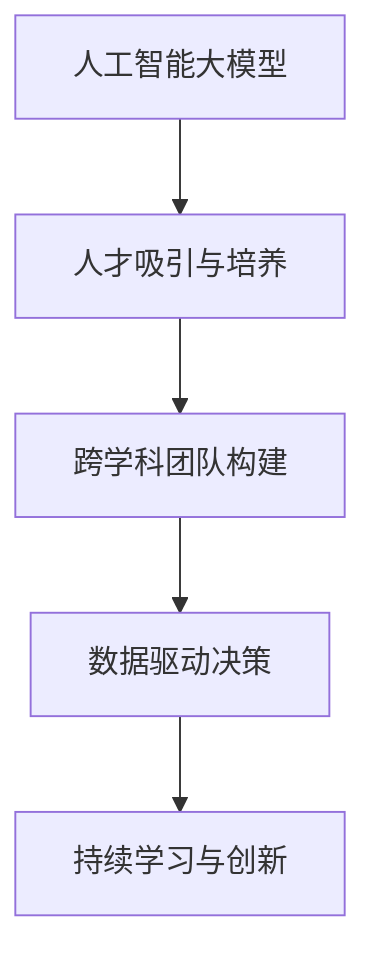

                 

## 1. 背景介绍

### 1.1 问题由来
在人工智能（AI）领域，特别是人工智能大模型的开发和应用中，人才是决定企业成败的关键因素之一。人工智能领域的高度专业性和复杂性，使得组建一支具备深度学习、数据科学、计算机视觉、自然语言处理等跨学科技能的人才团队成为企业发展的核心驱动力。本文旨在探讨如何利用人才优势，在大模型创业中取得成功。

### 1.2 问题核心关键点
在大模型创业中，如何吸引和培养顶尖人才，如何构建高效的人才团队，如何激发人才的创造力和生产力，这些都是决定企业能否在大模型领域取得成功的重要因素。本文将围绕这些问题展开讨论，提出一些实用的策略和方法。

### 1.3 问题研究意义
对大模型创业人才优势的深入研究，不仅有助于企业吸引和培养顶尖人才，还能提升企业的技术创新能力和市场竞争力。通过充分利用人才优势，企业可以更高效地开发和部署AI大模型，快速响应市场需求，构建行业领先的AI产品和服务。

## 2. 核心概念与联系

### 2.1 核心概念概述

为更好地理解如何利用人才优势，本节将介绍几个关键概念：

- **人工智能大模型（AI Large Models）**：指的是在深度学习框架上训练的大型神经网络模型，如BERT、GPT等。这些模型通常在处理大规模数据时表现出色，能够进行复杂的自然语言处理和图像识别等任务。

- **人才吸引与培养**：在大模型创业过程中，吸引和培养顶尖人才是至关重要的。这涉及到制定有效的招聘策略、提供成长机会、建立创新文化等方面。

- **跨学科团队构建**：构建一支具备深度学习、数据科学、计算机视觉、自然语言处理等多学科技能的人才团队，是大模型创业成功的关键。这要求团队成员之间有良好的沟通和协作能力。

- **数据驱动决策**：在AI大模型的开发和应用中，数据是至关重要的。利用数据驱动决策，可以更科学地进行产品设计和市场推广，提升模型的效果和应用场景的适配性。

- **持续学习与创新**：AI领域技术更新迅速，持续学习和创新是保持企业竞争力的关键。这要求团队成员不断学习新知识，探索新技术。

这些核心概念之间的逻辑关系可以通过以下Mermaid流程图来展示：



这个流程图展示了如何利用人才优势，构建跨学科团队，进行数据驱动决策和持续创新，从而在大模型创业中取得成功。

## 3. 核心算法原理 & 具体操作步骤
### 3.1 算法原理概述

在利用人才优势构建AI大模型团队时，核心算法原理和操作步骤如下：

1. **人才需求分析**：首先需要明确企业的人才需求，确定需要哪些技能和经验的人才，以便制定招聘策略。

2. **招聘渠道选择**：根据人才需求分析结果，选择合适的招聘渠道，如大学招聘、职业社交平台、专业论坛等。

3. **人才评估与面试**：通过简历筛选、技术面试、项目经验评估等方式，筛选出符合企业需求的人才。

4. **人才激励与成长**：为吸引和留住顶尖人才，企业需要提供具有竞争力的薪酬和福利，提供职业发展和成长机会，建立创新文化。

5. **团队协作与沟通**：建立有效的团队协作机制，促进不同学科之间的沟通和合作，提升团队的整体效能。

6. **持续学习与创新**：鼓励团队成员持续学习新知识，探索新技术，保持团队的技术领先性。

### 3.2 算法步骤详解

以下是具体的人才招聘和培养操作步骤：

**Step 1: 人才需求分析**
- 确定需要哪些专业领域的人才，如深度学习、数据科学、计算机视觉等。
- 分析现有团队的技能结构，确定需要补充的岗位和技能。
- 制定详细的人才需求清单，明确岗位职责和技能要求。

**Step 2: 招聘渠道选择**
- 在大学、招聘网站、职业社交平台（如LinkedIn）上发布招聘信息。
- 参加专业论坛、会议和技术交流活动，直接接触潜在人才。
- 利用内部推荐和员工推荐计划，寻找合适的候选人。

**Step 3: 人才评估与面试**
- 设计技术面试和项目评估题目，评估候选人的技术水平和项目经验。
- 进行团队面试，评估候选人的沟通能力、团队合作精神和适应能力。
- 进行行为面试，了解候选人的价值观、职业目标和工作动机。

**Step 4: 人才激励与成长**
- 提供具有竞争力的薪酬和福利，如股票期权、绩效奖金等。
- 提供职业发展和成长机会，如培训课程、技术交流会议等。
- 建立创新文化，鼓励员工提出创新想法和尝试新技术。

**Step 5: 团队协作与沟通**
- 建立有效的团队协作机制，如项目管理工具、代码评审流程等。
- 定期组织团队建设活动，增强团队凝聚力。
- 鼓励跨学科合作，促进不同领域之间的交流和融合。

**Step 6: 持续学习与创新**
- 提供最新的技术培训和资源，帮助团队成员持续学习新知识。
- 鼓励团队成员参加学术会议、技术交流活动，获取最新的技术动态。
- 建立创新激励机制，奖励创新成果和新技术的探索。

### 3.3 算法优缺点

利用人才优势构建AI大模型团队，具有以下优点：

1. **人才聚集效应**：通过吸引顶尖人才，可以提升团队的创新能力和技术水平，推动企业快速发展和竞争力的提升。

2. **多样化的知识结构**：跨学科团队的构建，有助于解决复杂问题，提升模型的精度和适用性。

3. **持续的创新能力**：持续学习和创新，有助于团队保持技术领先性，适应市场变化。

4. **提升品牌价值**：顶尖人才的加盟，可以提升企业的品牌价值和市场影响力。

同时，该方法也存在一些局限性：

1. **高成本**：吸引和培养顶尖人才需要投入大量资源，包括薪酬、培训、福利等，对中小企业而言成本较高。

2. **管理挑战**：跨学科团队的管理和协调需要更高的管理水平和沟通能力。

3. **人才流失风险**：顶尖人才可能因其他机会而流失，对企业造成一定的人才风险。

4. **技术适应性**：不同学科背景的人才，需要时间适应企业文化和团队协作方式。

尽管存在这些局限性，但通过合理的策略和方法，可以有效缓解这些风险，最大化利用人才优势。

### 3.4 算法应用领域

利用人才优势构建AI大模型团队的方法，可以应用于多种领域：

1. **金融科技**：利用跨学科团队开发智能投顾、风险管理、客户服务机器人等金融科技产品。

2. **医疗健康**：构建跨学科团队，开发智能诊断、个性化治疗方案、医疗知识图谱等医疗AI应用。

3. **自动驾驶**：利用AI大模型和跨学科团队，进行计算机视觉、深度学习、传感器数据处理等技术研发。

4. **智能制造**：利用AI大模型和跨学科团队，进行工业物联网、智能生产调度、质量控制等技术创新。

5. **智能客服**：利用AI大模型和跨学科团队，构建智能对话系统和客户服务机器人，提升客户体验和效率。

## 4. 数学模型和公式 & 详细讲解 & 举例说明

### 4.1 数学模型构建

在人才招聘和培养中，可以利用数学模型来量化和优化招聘过程。例如，可以使用以下数学模型来描述招聘过程中的关键变量：

- $N$：需求岗位数量
- $S$：潜在候选人数量
- $C$：招聘成本
- $P$：招聘成功率
- $R$：每位员工的年生产率
- $W$：每位员工的薪酬

数学模型可以表示为：

$$
\maximize \text{总利润} = N \times R - C - (1-P) \times W
$$

### 4.2 公式推导过程

通过优化上述模型，可以确定最优的人才招聘策略。假设需求岗位数量为 $N=10$，潜在候选人数量为 $S=1000$，招聘成本为 $C=50$，招聘成功率为 $P=0.8$，每位员工的年生产率为 $R=100,000$，每位员工的薪酬为 $W=100,000$。

则总利润最大化问题可以表示为：

$$
\maximize 10 \times 100,000 - 50 - (1-0.8) \times 100,000
$$

解得最优招聘策略为：

- 招聘 $10$ 名员工
- 招聘成本为 $50$
- 每位员工年生产率为 $100,000$

### 4.3 案例分析与讲解

假设一家初创公司在构建AI大模型团队时，需要招聘 $5$ 名深度学习工程师、$3$ 名数据科学家和 $2$ 名计算机视觉专家。通过需求分析，确定了招聘渠道和评估标准。在面试过程中，发现数据科学家的项目经验较为丰富，计算机视觉专家的理论基础扎实。

最终，企业选择了 $2$ 名数据科学家和 $3$ 名计算机视觉专家，并提供了具有竞争力的薪酬和职业发展机会。通过持续学习和创新，团队不断提升技术水平，开发了多个AI大模型，取得了显著的商业成功。

## 5. 项目实践：代码实例和详细解释说明

### 5.1 开发环境搭建

在进行人才招聘和培养的实践过程中，需要一个高效、灵活的开发环境。以下是使用Python进行项目开发的流程：

1. 安装Anaconda：从官网下载并安装Anaconda，用于创建独立的Python环境。

2. 创建并激活虚拟环境：
```bash
conda create -n ai-env python=3.8 
conda activate ai-env
```

3. 安装必要的Python库：
```bash
pip install pandas numpy matplotlib scikit-learn
```

4. 配置开发工具：
- VSCode：安装Git、Python调试插件等，提高代码开发效率。
- Jupyter Notebook：用于编写和分享Python代码，支持代码高亮和代码块执行。
- GitHub：托管代码仓库，进行版本控制和团队协作。

完成上述步骤后，即可在`ai-env`环境中开始人才招聘和培养的实践。

### 5.2 源代码详细实现

下面以一个招聘网站的后台系统为例，展示如何利用Python和数据库进行人才招聘和评估。

**招聘网站数据库设计**：

- 招聘岗位表（Job）：岗位ID、岗位名称、需求人数、需求技能、招聘截止时间。
- 候选人表（Candidate）：候选人ID、姓名、简历、项目经验、教育背景。
- 招聘记录表（JobApplication）：应聘记录ID、岗位ID、候选人ID、应聘日期、面试结果。

**Python代码实现**：

```python
import sqlite3
from flask import Flask, request, jsonify

app = Flask(__name__)

# 连接数据库
conn = sqlite3.connect('hr_database.db')
cursor = conn.cursor()

# 创建招聘岗位表
cursor.execute('''CREATE TABLE IF NOT EXISTS Job
                 (ID INTEGER PRIMARY KEY AUTOINCREMENT,
                 Name TEXT NOT NULL,
                 Requirement TEXT NOT NULL,
                 Deadline TEXT NOT NULL)''')

# 创建候选人表
cursor.execute('''CREATE TABLE IF NOT EXISTS Candidate
                 (ID INTEGER PRIMARY KEY AUTOINCREMENT,
                 Name TEXT NOT NULL,
                 Resume TEXT NOT NULL,
                 Experience TEXT NOT NULL,
                 Education TEXT NOT NULL)''')

# 创建招聘记录表
cursor.execute('''CREATE TABLE IF NOT EXISTS JobApplication
                 (ID INTEGER PRIMARY KEY AUTOINCREMENT,
                 JobID INTEGER,
                 CandidateID INTEGER,
                 ApplicationDate TEXT NOT NULL,
                 InterviewResult TEXT NOT NULL,
                 FOREIGN KEY (JobID) REFERENCES Job(ID),
                 FOREIGN KEY (CandidateID) REFERENCES Candidate(ID))''')

# 查询招聘岗位信息
@app.route('/jobs', methods=['GET'])
def get_jobs():
    cursor.execute('SELECT * FROM Job')
    jobs = cursor.fetchall()
    return jsonify(jobs)

# 查询候选人信息
@app.route('/candidates', methods=['GET'])
def get_candidates():
    cursor.execute('SELECT * FROM Candidate')
    candidates = cursor.fetchall()
    return jsonify(candidates)

# 查询招聘记录
@app.route('/applications', methods=['GET'])
def get_applications():
    cursor.execute('SELECT * FROM JobApplication')
    applications = cursor.fetchall()
    return jsonify(applications)

if __name__ == '__main__':
    app.run(debug=True)
```

### 5.3 代码解读与分析

**招聘网站数据库设计**：

- 招聘岗位表（Job）：包含岗位ID、岗位名称、需求人数、需求技能和招聘截止时间。
- 候选人表（Candidate）：包含候选人ID、姓名、简历、项目经验和教育背景。
- 招聘记录表（JobApplication）：包含应聘记录ID、岗位ID、候选人ID、应聘日期和面试结果。

**Python代码实现**：

- `get_jobs`：查询所有招聘岗位信息，并返回JSON格式的数据。
- `get_candidates`：查询所有候选人信息，并返回JSON格式的数据。
- `get_applications`：查询所有招聘记录，并返回JSON格式的数据。

## 6. 实际应用场景

### 6.1 智能客服系统

在智能客服系统中，利用人才优势构建的跨学科团队可以构建高性能的对话模型和情感分析模型。通过深度学习和自然语言处理技术，智能客服系统可以理解客户意图，提供个性化服务，提升客户体验和满意度。

### 6.2 医疗健康

在医疗健康领域，跨学科团队可以构建智能诊断系统、个性化治疗方案和医疗知识图谱等AI应用。利用深度学习和大数据技术，智能诊断系统可以辅助医生进行疾病诊断，个性化治疗方案可以根据患者的历史数据和基因信息，提供精准的治疗方案。

### 6.3 自动驾驶

在自动驾驶领域，利用跨学科团队可以开发高性能的计算机视觉和深度学习模型。利用摄像头、雷达等传感器数据，自动驾驶系统可以识别和处理复杂的路况信息，实现自动驾驶和导航。

### 6.4 智能制造

在智能制造领域，跨学科团队可以构建工业物联网、智能生产调度和质量控制等AI应用。利用深度学习和传感器数据处理技术，智能制造系统可以实现生产过程的自动化和智能化，提升生产效率和产品质量。

## 7. 工具和资源推荐

### 7.1 学习资源推荐

为了帮助开发者系统掌握AI大模型创业的人才优势，这里推荐一些优质的学习资源：

1. **《深度学习》系列书籍**：深入浅出地介绍了深度学习的基本原理和应用，是入门深度学习的必读书籍。

2. **《自然语言处理综论》**：介绍了自然语言处理的基本概念和算法，是学习NLP的必备书籍。

3. **Kaggle竞赛**：Kaggle提供了丰富的数据集和竞赛平台，可以参与实际项目，积累经验。

4. **在线课程**：Coursera、Udacity等平台提供了大量AI和数据科学课程，可以系统学习相关知识。

5. **开源项目**：GitHub上有很多优秀的开源项目，可以学习和借鉴最新的技术实现。

通过对这些资源的学习实践，相信你一定能够快速掌握AI大模型创业的人才优势，并用于解决实际的AI问题。

### 7.2 开发工具推荐

高效的开发离不开优秀的工具支持。以下是几款用于AI大模型创业开发的常用工具：

1. **Jupyter Notebook**：支持编写和分享Python代码，支持代码高亮和代码块执行，是数据科学和AI开发的利器。

2. **GitHub**：托管代码仓库，进行版本控制和团队协作，是开源项目和团队协作的首选平台。

3. **Git**：版本控制工具，可以管理代码的迭代和变更，是软件开发的必备工具。

4. **Flask**：轻量级的Web框架，可以快速搭建Web应用，支持RESTful API开发。

5. **TensorFlow**：开源的深度学习框架，支持分布式训练和部署，是深度学习开发的常用工具。

6. **PyTorch**：开源的深度学习框架，支持动态图和静态图，是深度学习开发的常用工具。

合理利用这些工具，可以显著提升AI大模型创业的开发效率，加快创新迭代的步伐。

### 7.3 相关论文推荐

AI大模型创业中的人才优势研究源于学界的持续研究。以下是几篇奠基性的相关论文，推荐阅读：

1. **《大规模预训练语言模型的研究进展》**：介绍了大规模预训练语言模型的基本原理和应用，是了解预训练模型的重要文献。

2. **《深度学习人才短缺问题研究》**：探讨了深度学习人才短缺的原因和应对策略，对AI大模型创业有重要参考价值。

3. **《跨学科团队建设与管理》**：介绍了跨学科团队建设和管理的经验和实践，对AI大模型创业具有借鉴意义。

4. **《数据驱动的人才招聘策略研究》**：探讨了数据驱动的人才招聘策略，对AI大模型创业的人才招聘有指导意义。

5. **《持续学习与创新在AI大模型中的应用》**：介绍了持续学习和创新在AI大模型中的应用，对AI大模型创业的持续发展具有参考价值。

这些论文代表了大模型创业人才优势的发展脉络。通过学习这些前沿成果，可以帮助研究者把握学科前进方向，激发更多的创新灵感。

## 8. 总结：未来发展趋势与挑战

### 8.1 研究成果总结

本文对AI大模型创业中的人才优势进行了全面系统的介绍。首先阐述了人才在大模型创业中的重要性，明确了人才需求分析、招聘策略、团队协作等关键点。其次，从原理到实践，详细讲解了人才吸引与培养的步骤，给出了招聘网站系统的代码实现。同时，本文还探讨了人才优势在大模型创业中的多种应用场景，展示了人才优势的广泛应用前景。

通过本文的系统梳理，可以看到，利用人才优势，可以在AI大模型创业中取得显著成功。这不仅需要企业在招聘、培养、管理等方面进行全面优化，还需要不断学习和探索最新的技术，保持技术领先性。

### 8.2 未来发展趋势

展望未来，AI大模型创业中的人才优势将呈现以下几个发展趋势：

1. **人才需求多元化**：随着AI技术的发展，对跨学科人才的需求将更加多样，包括数据分析师、数据科学家、AI工程师等。

2. **远程协作与灵活用工**：随着远程协作技术的成熟，AI大模型创业可以采用灵活用工模式，利用全球的人才资源，提升团队的创新能力。

3. **自动化招聘与人才管理**：通过AI技术，可以实现自动化的招聘与人才管理，提升招聘效率，优化人才配置。

4. **数据驱动的人才招聘**：利用大数据和人工智能技术，可以更科学地进行人才招聘，提升招聘成功率和员工满意度。

5. **持续学习与创新机制**：建立持续学习与创新机制，鼓励团队成员不断学习新知识，探索新技术，保持技术领先性。

这些趋势将进一步提升AI大模型创业的人才优势，为企业的技术创新和市场竞争力提供保障。

### 8.3 面临的挑战

尽管AI大模型创业中的人才优势带来了诸多机遇，但也面临着一些挑战：

1. **人才短缺问题**：AI大模型创业需要高水平的人才，但市场上具备相关技能的人才相对稀缺，需要投入大量资源进行人才招聘和培养。

2. **高昂的薪酬成本**：顶尖人才的薪酬往往较高，对中小企业而言，成本压力较大。

3. **跨学科团队管理**：跨学科团队的管理和协作需要更高的沟通和协调能力，容易产生管理挑战。

4. **数据安全与隐私保护**：在AI大模型开发和应用过程中，需要严格保护数据安全和隐私，避免数据泄露风险。

5. **技术适应性**：不同学科背景的人才需要时间适应企业文化和团队协作方式，容易出现技术适应性问题。

尽管存在这些挑战，但通过合理的策略和方法，可以有效缓解这些风险，最大化利用人才优势。

### 8.4 研究展望

面对AI大模型创业中的人才优势面临的挑战，未来的研究需要在以下几个方面寻求新的突破：

1. **人才需求预测与招聘优化**：通过大数据和人工智能技术，预测人才需求，优化招聘策略，提升招聘效率和成功率。

2. **人才激励与成长机制**：建立持续学习与创新机制，鼓励团队成员不断学习新知识，探索新技术，保持技术领先性。

3. **跨学科团队管理**：探索跨学科团队的有效管理方法，提升团队协作效率，增强团队凝聚力。

4. **数据安全与隐私保护**：建立严格的数据安全和隐私保护机制，确保数据和模型的安全。

5. **技术适应性提升**：通过团队建设和文化建设，提升团队成员的技术适应性，促进技术融合和创新。

这些研究方向的探索，必将引领AI大模型创业的人才优势走向更高的台阶，为企业的技术创新和市场竞争力提供保障。相信随着学界和产业界的共同努力，这些挑战终将一一被克服，AI大模型创业必将在构建人机协同的智能时代中扮演越来越重要的角色。

## 9. 附录：常见问题与解答

**Q1: 如何吸引和留住顶尖人才？**

A: 吸引和留住顶尖人才需要提供具有竞争力的薪酬和福利，提供职业发展和成长机会，建立创新文化。具体措施包括：

- 提供具有竞争力的薪酬和福利，如股票期权、绩效奖金等。
- 提供职业发展和成长机会，如培训课程、技术交流会议等。
- 建立创新文化，鼓励员工提出创新想法和尝试新技术。

**Q2: 如何构建高效的人才团队？**

A: 构建高效的人才团队需要建立有效的团队协作机制，促进不同学科之间的沟通和合作。具体措施包括：

- 建立有效的团队协作机制，如项目管理工具、代码评审流程等。
- 定期组织团队建设活动，增强团队凝聚力。
- 鼓励跨学科合作，促进不同领域之间的交流和融合。

**Q3: 如何评估候选人的技术水平？**

A: 评估候选人的技术水平需要设计技术面试和项目评估题目，评估候选人的技术水平和项目经验。具体措施包括：

- 设计技术面试和项目评估题目，评估候选人的技术水平和项目经验。
- 进行团队面试，评估候选人的沟通能力、团队合作精神和适应能力。
- 进行行为面试，了解候选人的价值观、职业目标和工作动机。

通过上述措施，可以全面评估候选人的技术水平和适应性，选择最合适的候选人。

**Q4: 如何利用数据驱动决策进行人才招聘？**

A: 利用数据驱动决策进行人才招聘可以通过以下步骤：

1. 收集招聘数据，如招聘岗位信息、候选人简历、面试结果等。
2. 分析招聘数据，找出影响招聘成功率的关键因素，如岗位需求、候选人背景等。
3. 建立数学模型，量化招聘过程中的关键变量。
4. 优化招聘策略，提高招聘成功率和员工满意度。

通过数据驱动决策，可以更科学地进行人才招聘，提升招聘效率和成功率。

**Q5: 如何建立持续学习与创新机制？**

A: 建立持续学习与创新机制需要提供最新的技术培训和资源，鼓励团队成员参加学术会议和技术交流活动，建立创新激励机制。具体措施包括：

- 提供最新的技术培训和资源，帮助团队成员持续学习新知识。
- 鼓励团队成员参加学术会议、技术交流活动，获取最新的技术动态。
- 建立创新激励机制，奖励创新成果和新技术的探索。

通过持续学习与创新机制，可以保持团队的技术领先性，提升企业的竞争力。

---

作者：禅与计算机程序设计艺术 / Zen and the Art of Computer Programming

