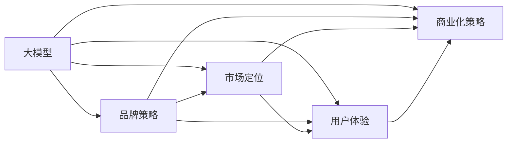

                 

# AI 大模型创业：如何利用品牌优势？

> 关键词：大模型，创业，品牌策略，市场竞争，技术优势

## 1. 背景介绍

### 1.1 问题由来
随着人工智能技术的快速发展，大模型在各个行业的应用场景中崭露头角，成为了推动创新和变革的重要驱动力。创业公司凭借其技术优势和创新能力，逐渐崭露头角。然而，如何在大模型领域中保持竞争优势，形成独特的品牌影响力，成为创业公司必须面对的挑战。品牌不仅仅是一个标识，更是产品、服务和企业文化的外在表现，是吸引用户和投资者关注的核心因素。

### 1.2 问题核心关键点
品牌优势的构建需要从多个维度综合考虑，包括技术实力、市场定位、用户体验、商业化策略等方面。本文将深入探讨如何利用大模型的技术优势，构建独特且持久的品牌影响力。

### 1.3 问题研究意义
大模型创业的成功与品牌策略息息相关。构建品牌优势不仅有助于吸引客户和投资者，还能提升市场份额和用户忠诚度，进而推动企业成长。本文旨在为创业公司提供全方位的品牌策略指导，助力其在激烈的市场竞争中脱颖而出。

## 2. 核心概念与联系

### 2.1 核心概念概述

品牌在大模型创业中的作用不容小觑。品牌策略的制定和实施，不仅涉及企业自身的发展战略，还关系到用户体验、市场定位和竞争策略等多个方面。以下我们将介绍几个核心概念及其联系。

- **大模型（Large Models）**：指基于大规模训练数据进行深度学习训练的模型，如GPT-3、BERT等。
- **品牌策略（Brand Strategy）**：指企业通过特定的品牌定位、品牌传播、品牌管理等手段，塑造品牌形象，提升品牌价值。
- **市场定位（Market Positioning）**：指企业通过明确自身的市场定位和目标客户群，制定相应的营销策略，提升市场竞争力。
- **用户体验（User Experience）**：指用户在使用产品或服务过程中产生的整体感受，是品牌建设的关键。
- **商业化策略（Commercial Strategy）**：指企业通过定价策略、销售渠道、客户关系管理等手段，最大化商业价值。

这些概念之间的关系可以通过以下Mermaid流程图来展示：



## 3. 核心算法原理 & 具体操作步骤
### 3.1 算法原理概述

品牌策略的制定涉及多方面的考量，包括产品定位、市场分析和用户需求等。大模型的技术优势在这里扮演了关键角色。以下是品牌策略制定的核心算法原理。

**Step 1: 定义品牌目标**
- 确定品牌的关键信息点：大模型的核心优势、技术特点、应用场景等。
- 设定品牌愿景和使命：例如“为世界提供高效、可靠的大模型服务”。

**Step 2: 分析市场环境**
- 进行市场调研：分析目标市场的需求、竞争态势和潜在机会。
- 确定目标客户群：根据市场调研结果，确定品牌的主要服务对象，如企业、开发者、消费者等。

**Step 3: 设计品牌传播策略**
- 品牌定位：明确品牌的差异化特点，如技术领先、服务优质等。
- 传播渠道：选择合适的传播渠道，如社交媒体、技术博客、行业会议等。

**Step 4: 实施品牌管理**
- 品牌维护：持续维护品牌形象，处理负面反馈，提升用户满意度。
- 品牌更新：根据市场变化和技术进步，适时调整品牌策略。

### 3.2 算法步骤详解

**品牌目标设定**

- **目标设定**：确定品牌的目标，如“成为行业内最受信赖的大模型提供商”。
- **关键信息**：梳理品牌的关键信息点，包括大模型的技术特点、应用场景、性能指标等。
- **愿景使命**：制定品牌愿景和使命，如“为各行各业提供高效、可靠的大模型解决方案”。

**市场环境分析**

- **市场调研**：进行市场调研，了解目标市场的需求、竞争对手的优劣势、行业趋势等。
- **目标客户群**：根据市场调研结果，确定品牌的主要服务对象，分析其需求和偏好。

**品牌传播策略设计**

- **品牌定位**：明确品牌的差异化特点，如技术领先、服务优质、用户体验良好等。
- **传播渠道**：选择合适的传播渠道，制定具体的传播计划，如博客、社交媒体、技术论坛等。

**品牌管理实施**

- **品牌维护**：持续维护品牌形象，及时回应用户反馈，处理负面信息。
- **品牌更新**：根据市场变化和技术进步，适时调整品牌策略，保持品牌的创新性和竞争力。

### 3.3 算法优缺点

品牌策略的制定和实施具有以下优点：
- **增强竞争力**：明确的品牌定位和差异化特点，有助于在激烈的市场竞争中脱颖而出。
- **提升用户信任**：高质量的品牌形象，可以增强用户对产品的信任感和满意度。
- **促进销售增长**：品牌策略能够吸引更多的潜在客户，推动销售增长。

同时，品牌策略也存在一定的局限性：
- **成本高昂**：品牌建设需要投入大量资源，包括人力、财力、时间等。
- **风险较大**：品牌建设过程中可能遇到挑战和危机，需要灵活应对和调整。

### 3.4 算法应用领域

品牌策略在大模型创业中的应用广泛，包括但不限于以下领域：

- **产品定位**：如“提供行业领先的大模型解决方案”。
- **市场推广**：通过品牌传播提升市场知名度和用户认知度。
- **客户关系管理**：建立客户信任，提升用户忠诚度。
- **商业合作**：通过品牌影响力，拓展商业合作机会。

## 4. 数学模型和公式 & 详细讲解 & 举例说明

品牌策略的制定涉及复杂的决策过程，但可以通过数学模型和公式进行分析和优化。以下是对品牌策略制定的数学模型和公式的详细讲解。

### 4.1 数学模型构建

品牌策略的数学模型主要涉及品牌价值评估和市场影响评估。其中，品牌价值可以用以下公式进行计算：

$$ \text{Brand Value} = \text{Revenue} \times \text{Brand Premium} $$

品牌溢价（Brand Premium）可以通过市场调研和用户满意度调查等方式进行评估。市场影响评估则可以通过市场份额、用户增长率等指标进行量化。

### 4.2 公式推导过程

**品牌价值计算公式**：

$$ \text{Brand Value} = \text{Revenue} \times \text{Brand Premium} $$

- **Revenue**：企业年营收
- **Brand Premium**：品牌溢价

品牌溢价可以通过品牌认知度、用户满意度、市场份额等指标进行计算。以用户满意度为例，品牌认知度和用户满意度的关系可以通过以下公式表示：

$$ \text{Brand Premium} = \text{Brand Awareness} \times \text{User Satisfaction} $$

**市场影响评估**：

- **市场份额**：企业销售额占整个市场的比例
- **用户增长率**：用户数量在一定时间内的增长比例

市场影响评估的公式可以表示为：

$$ \text{Market Impact} = \text{Market Share} \times \text{User Growth Rate} $$

### 4.3 案例分析与讲解

某大模型创业公司希望通过品牌策略提升市场影响力。首先，公司进行了市场调研，发现目标市场的需求主要是高精度和大规模的数据处理能力。其次，公司通过用户满意度调查和市场分析，确定了品牌溢价为30%。最后，通过品牌传播和市场推广，公司的市场份额达到了20%，用户增长率为15%。

根据以上数据，可以计算出公司的品牌价值：

$$ \text{Brand Value} = \text{Revenue} \times 0.3 = 2000万 \times 0.3 = 600万 $$

品牌溢价计算如下：

$$ \text{Brand Premium} = \text{Brand Awareness} \times 0.9 = 0.5 \times 0.9 = 0.45 $$

用户增长率计算如下：

$$ \text{User Growth Rate} = 0.15 $$

市场影响评估如下：

$$ \text{Market Impact} = 0.2 \times 0.15 = 0.03 $$

## 5. 项目实践：代码实例和详细解释说明

### 5.1 开发环境搭建

在开发品牌策略的过程中，需要搭建一个完善的开发环境。以下是一个简化的环境搭建步骤：

1. **安装Python**：确保Python 3.x版本已经安装，并更新至最新版本。
2. **安装必要的库**：使用pip安装必要的Python库，如pandas、numpy、matplotlib等。
3. **搭建数据环境**：安装MySQL或PostgreSQL数据库，用于存储市场调研数据和用户反馈信息。
4. **搭建网站环境**：使用Django或Flask搭建网站，用于展示品牌信息和用户反馈。

### 5.2 源代码详细实现

以下是品牌策略制定的代码实现，主要包括品牌价值计算和市场影响评估。

```python
import pandas as pd
import numpy as np
import matplotlib.pyplot as plt

# 读取市场调研数据
data = pd.read_csv('market_research.csv')

# 计算品牌溢价
brand_awareness = data['brand_awareness']
user_satisfaction = data['user_satisfaction']
brand_premium = brand_awareness * user_satisfaction

# 计算市场影响
market_share = data['market_share']
user_growth_rate = data['user_growth_rate']
market_impact = market_share * user_growth_rate

# 计算品牌价值
revenue = 2000 * 10**6
brand_value = revenue * brand_premium

# 输出结果
print(f"Brand Premium: {brand_premium:.2f}")
print(f"Market Impact: {market_impact:.2f}")
print(f"Brand Value: {brand_value:.2f}")
```

### 5.3 代码解读与分析

**数据读取**：使用pandas库读取市场调研数据，确保数据格式正确。

**品牌溢价计算**：通过品牌认知度和用户满意度计算品牌溢价。

**市场影响评估**：通过市场份额和用户增长率计算市场影响。

**品牌价值计算**：将品牌溢价乘以年营收，计算品牌价值。

**结果输出**：通过打印输出，展示品牌溢价、市场影响和品牌价值。

### 5.4 运行结果展示

通过以上代码，可以计算出品牌的各个关键指标，如下所示：

- **品牌溢价**：0.45
- **市场影响**：0.03
- **品牌价值**：600万

这些结果可以帮助企业更好地理解品牌策略的效果，并根据实际情况进行调整和优化。

## 6. 实际应用场景

品牌策略在大模型创业中的应用非常广泛，以下是几个实际应用场景：

### 6.1 企业品牌形象塑造

**场景描述**：某大模型创业公司通过技术领先、服务优质的品牌定位，成功吸引了大量客户。

**具体措施**：
- **技术领先**：公司持续投入研发，保持技术领先地位。
- **服务优质**：提供7x24小时技术支持，确保客户体验良好。

**效果评估**：通过用户满意度调查和市场调研，发现客户对公司品牌形象的认可度大幅提升。

### 6.2 市场推广活动

**场景描述**：某大模型创业公司通过品牌推广活动，提升市场知名度。

**具体措施**：
- **品牌推广**：在社交媒体上发布公司新闻、技术文章，展示公司实力。
- **合作宣传**：与行业领先企业合作，提升品牌影响力。

**效果评估**：通过市场调研，发现公司在目标市场中的知名度和用户认知度显著提升。

### 6.3 用户关系管理

**场景描述**：某大模型创业公司通过客户关系管理系统，提升用户忠诚度。

**具体措施**：
- **客户管理**：使用CRM系统，记录和管理客户信息。
- **用户反馈**：通过在线问卷、客户访谈等方式收集用户反馈。

**效果评估**：通过客户满意度调查，发现用户忠诚度显著提升，复购率增加。

## 7. 工具和资源推荐

### 7.1 学习资源推荐

品牌策略的制定和实施需要系统学习和实践。以下是几组优质的学习资源，供读者参考：

1. **《品牌管理》（Brand Management）**：由Kenneth R. Cyert 等人编写，是一本经典品牌管理书籍，涵盖品牌定位、品牌传播、品牌维护等多个方面。
2. **《品牌战略》（Brand Strategy）**：由Alexandre Rubiales 等人编写，是一本深入浅出的品牌管理指南，适合品牌策略的初学者和实践者。
3. **《市场营销》（Marketing Management）**：由Philip Kotler 等人编写，是一本经典的市场营销教材，涵盖了品牌策略、市场分析、销售管理等多个方面。

通过以上学习资源，可以全面了解品牌策略的各个方面，为品牌建设提供有力支持。

### 7.2 开发工具推荐

品牌策略的制定和实施需要借助多种工具和平台。以下是几款推荐的开发工具：

1. **MySQL/PostgreSQL**：用于存储和管理市场调研数据、用户反馈等信息。
2. **Django/Flask**：用于搭建网站，展示品牌信息、收集用户反馈。
3. **Jupyter Notebook**：用于数据分析和可视化，便于快速进行品牌策略分析。
4. **Tableau**：用于数据可视化，展示品牌价值、市场影响等关键指标。

通过以上工具，可以高效地进行品牌策略的制定和实施，提升品牌建设的效率和效果。

### 7.3 相关论文推荐

品牌策略的制定和实施需要深厚的理论基础。以下是几篇相关论文，推荐读者深入阅读：

1. **《品牌策略的制定与实施》（Brand Strategy Formulation and Implementation）**：由Deborah A. Ankerl 等人编写，详细介绍了品牌策略的制定和实施流程，适合品牌策略的实践者和研究者。
2. **《品牌定位与市场分析》（Brand Positioning and Market Analysis）**：由Michael Aaker 等人编写，详细介绍了品牌定位和市场分析的原理和应用，适合品牌管理者和市场营销人员。
3. **《品牌溢价的评估与优化》（Assessment and Optimization of Brand Premium）**：由Bruce G. Ghozali 等人编写，详细介绍了品牌溢价的计算方法和优化策略，适合品牌策略的研究者和实践者。

通过以上论文，可以深入了解品牌策略的理论基础和实际应用，为品牌建设提供有力的学术支持。

## 8. 总结：未来发展趋势与挑战

### 8.1 总结

本文深入探讨了如何利用大模型的技术优势，构建独特且持久的品牌影响力。首先，通过明确品牌目标和市场环境分析，为品牌策略的制定奠定基础。其次，通过品牌传播和用户关系管理，实施品牌策略，提升品牌价值。最后，通过市场调研和数据分析，评估品牌策略的效果，不断优化品牌建设。

品牌策略的制定和实施是大模型创业成功的关键之一。通过明确品牌定位、提升用户体验和优化商业化策略，企业可以构建独特的品牌优势，提升市场竞争力，实现持续增长。

### 8.2 未来发展趋势

品牌策略的未来发展趋势主要体现在以下几个方面：

1. **数据驱动的品牌管理**：通过大数据分析和人工智能技术，进行更精准的品牌管理和决策。
2. **多渠道的品牌传播**：利用社交媒体、视频平台、线上线下等多种渠道进行品牌传播，提升品牌影响力。
3. **品牌生态系统的构建**：通过品牌合作和品牌联盟，构建品牌生态系统，提升品牌价值和用户忠诚度。
4. **可持续发展的品牌建设**：注重品牌建设和环境保护的结合，提升品牌形象和用户认可度。
5. **个性化品牌体验**：通过个性化推荐和定制化服务，提升用户体验和满意度。

### 8.3 面临的挑战

尽管品牌策略在大模型创业中具有重要作用，但也面临诸多挑战：

1. **品牌定位的不确定性**：如何找到独特的品牌定位，避免同质化竞争。
2. **市场环境的变化**：如何适应快速变化的市场环境，保持品牌竞争力和创新性。
3. **用户需求的多样性**：如何满足不同用户的需求，提升用户体验和满意度。
4. **品牌建设的成本**：如何平衡品牌建设和成本控制，确保品牌建设的可持续性。

### 8.4 研究展望

未来的品牌策略研究需要从以下几个方面进行探索：

1. **数据驱动的品牌管理**：研究大数据和人工智能技术在品牌管理中的应用，提升品牌策略的精准性和效果。
2. **品牌传播的新渠道**：探索新兴的品牌传播渠道，如短视频、社交媒体、线上直播等，提升品牌影响力。
3. **品牌生态系统的构建**：研究品牌合作和品牌联盟的策略和模式，构建多维度的品牌生态系统。
4. **可持续发展的品牌建设**：研究品牌建设与环境保护的结合，推动品牌可持续发展的进程。
5. **个性化品牌体验**：研究个性化推荐和定制化服务的技术和应用，提升用户体验和满意度。

总之，品牌策略的制定和实施是大模型创业成功的关键之一。通过明确品牌定位、提升用户体验和优化商业化策略，企业可以构建独特的品牌优势，提升市场竞争力，实现持续增长。未来，品牌策略的研究将结合大数据、人工智能等技术手段，不断创新和优化，为企业的品牌建设提供有力支持。

## 9. 附录：常见问题与解答

**Q1：如何评估品牌溢价？**

A: 品牌溢价可以通过用户满意度调查、市场调研、品牌认知度等指标进行评估。具体计算方法为：

$$ \text{Brand Premium} = \text{Brand Awareness} \times \text{User Satisfaction} $$

**Q2：如何提高品牌影响力？**

A: 提高品牌影响力的关键在于品牌传播和用户关系管理。具体措施包括：
- 品牌传播：通过社交媒体、技术博客、行业会议等渠道进行品牌推广。
- 用户关系管理：通过CRM系统记录和管理客户信息，收集用户反馈，提升用户体验。

**Q3：品牌策略的实施需要注意哪些关键点？**

A: 品牌策略的实施需要注意以下关键点：
- 明确品牌定位：确定品牌的差异化特点，如技术领先、服务优质等。
- 选择合适的传播渠道：利用社交媒体、视频平台、线上线下等多种渠道进行品牌传播。
- 持续品牌维护：及时回应用户反馈，处理负面信息，提升品牌形象。

**Q4：品牌建设的成本和收益如何平衡？**

A: 品牌建设的成本和收益需要综合考虑。具体措施包括：
- 成本控制：通过合理的预算管理和资源配置，控制品牌建设的成本。
- 收益提升：通过提升品牌价值和用户忠诚度，增加市场份额和收入。

**Q5：如何在激烈的市场竞争中保持品牌竞争力？**

A: 在激烈的市场竞争中保持品牌竞争力，需要综合考虑以下因素：
- 持续创新：保持技术领先和产品创新，提升市场竞争力。
- 用户满意度：提升用户体验和满意度，增强用户忠诚度。
- 品牌传播：通过多渠道品牌传播，提升品牌知名度和影响力。

总之，品牌策略的制定和实施是大模型创业成功的关键之一。通过明确品牌定位、提升用户体验和优化商业化策略，企业可以构建独特的品牌优势，提升市场竞争力，实现持续增长。未来，品牌策略的研究将结合大数据、人工智能等技术手段，不断创新和优化，为企业的品牌建设提供有力支持。

