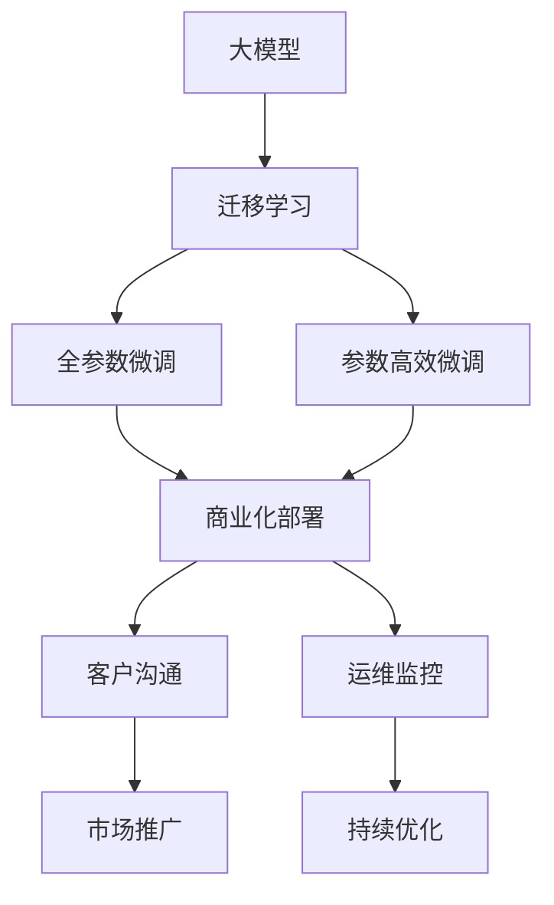

                 

# AI 大模型创业：如何利用商业优势？

大模型（Big Model）技术正成为人工智能领域的核心竞争力，如何高效利用大模型的商业优势，是每一个创业者都必须深入思考的问题。本文将系统梳理大模型的商业化应用，探讨如何通过模型优势，在商业化竞争中占据一席之地。

## 1. 背景介绍

### 1.1 问题由来

过去几十年，人工智能（AI）技术逐步从理论研究走向实际应用。传统机器学习方法在金融、医疗、零售等行业均有应用，但普遍依赖于人工标注数据，且模型通用性不足，难以应对实时变化和复杂场景。

大模型（Big Model）技术通过在亿级参数规模的海量数据上进行预训练，学习到了丰富的知识表示和泛化能力。这使得大模型在处理自然语言、图像、声音等复杂任务时，比传统方法有显著提升。大模型逐渐成为各大科技公司的核心资产。

### 1.2 问题核心关键点

利用大模型的商业优势，需要考虑以下几个关键点：

- 数据的获取与预处理：大模型需要大量高质量数据，如何获取、清洗和标注数据？
- 模型的微调和优化：大模型的微调与优化，需考虑成本、速度与效果。
- 模型的部署与运维：如何将大模型高效部署到生产环境？
- 商业化策略与市场定位：如何制定商业化策略，将大模型转化为商业产品？

通过深入理解大模型的商业应用，本文将探讨如何利用这些优势，构建有效的商业模型。

## 2. 核心概念与联系

### 2.1 核心概念概述

- **大模型（Big Model）**：指具有亿级参数规模的预训练模型，如BERT、GPT-3等。通过大规模数据预训练，大模型在自然语言理解、图像识别等任务上表现优异。

- **迁移学习（Transfer Learning）**：在大模型上进行微调，使其适应特定任务。常见的微调方法包括全参数微调和参数高效微调。

- **商业化**：指将AI技术转化为实际商业应用的过程，包括模型部署、客户沟通、市场推广等环节。

- **微调（Fine-tuning）**：在大模型基础上，通过有标签数据进行微调，优化模型在特定任务上的性能。

- **模型优化**：指在大模型微调过程中，应用各种技术手段提高模型性能、降低成本、加速迭代。

- **商业策略**：指通过市场分析、竞争情报、客户需求等，制定合理的商业模式和定价策略。

### 2.2 核心概念原理和架构的 Mermaid 流程图



此图展示了从大模型预训练到商业化部署的全过程，各环节相互联系，共同构成大模型的商业化应用。

## 3. 核心算法原理 & 具体操作步骤

### 3.1 算法原理概述

大模型商业化应用的核心在于迁移学习和微调，其步骤如下：

1. **预训练阶段**：利用大规模无标签数据，通过自监督任务训练大模型。
2. **微调阶段**：选择预训练大模型，将其应用于特定任务，通过有标签数据进行微调。
3. **商业化部署**：将微调后的模型部署到生产环境，提供API或SDK接口，供客户使用。

### 3.2 算法步骤详解

#### 预训练阶段

预训练阶段包括以下几个关键步骤：

1. **数据获取**：收集大规模无标签数据，如文本、图像、音频等，作为预训练语料。
2. **模型选择**：选择合适的预训练模型，如BERT、GPT-3等。
3. **数据处理**：进行数据清洗、标注和预处理。
4. **模型训练**：在大规模计算资源上训练模型，并监控训练进度。

#### 微调阶段

微调阶段包括以下几个关键步骤：

1. **任务适配**：选择适当的任务，确定模型输出层和损失函数。
2. **数据准备**：收集并标注下游任务的训练数据。
3. **模型微调**：在预训练模型基础上，使用有标签数据进行微调。
4. **模型评估**：评估微调后的模型性能，并根据需要进行参数调整。

#### 商业化部署

商业化部署包括以下几个关键步骤：

1. **模型封装**：将微调后的模型封装成API或SDK接口。
2. **云平台部署**：将模型部署到云平台，供客户调用。
3. **客户沟通**：与客户沟通，了解其需求，并进行模型定制化。
4. **市场推广**：制定推广策略，吸引客户使用。

### 3.3 算法优缺点

**优点**：

1. **通用性强**：大模型具有广泛的泛化能力，可在多个领域和任务上取得优异表现。
2. **成本低**：通过迁移学习和微调，使用已有模型，无需从头训练。
3. **部署灵活**：模型可在多种云平台和边缘设备上部署，支持实时应用。

**缺点**：

1. **数据依赖**：微调效果依赖于标注数据的数量和质量，获取高质量数据成本较高。
2. **计算需求高**：大规模模型训练和微调需要大量计算资源。
3. **易过拟合**：模型易在特定数据集上过拟合，泛化能力降低。
4. **解释性差**：大模型通常是黑盒系统，难以解释其内部机制。

### 3.4 算法应用领域

大模型在商业化应用中，广泛应用于以下领域：

1. **自然语言处理**：如文本分类、情感分析、机器翻译、自动摘要等。
2. **计算机视觉**：如图像识别、目标检测、图像生成等。
3. **语音识别**：如语音转文本、语音合成等。
4. **推荐系统**：如商品推荐、个性化推荐等。
5. **金融科技**：如信用评分、风险评估、智能投顾等。

## 4. 数学模型和公式 & 详细讲解 & 举例说明

### 4.1 数学模型构建

大模型的预训练通常使用自监督任务，如掩码语言模型（Masked Language Model, MLM）、自编码器（Autoencoder）等。

以BERT为例，其预训练目标函数为：

$$\mathcal{L} = -\frac{1}{N}\sum_{i=1}^N (y \log p(x_i) + (1-y)\log (1-p(x_i)))$$

其中，$p(x_i)$ 表示模型对输入 $x_i$ 的预测概率，$y$ 表示真实标签。

### 4.2 公式推导过程

以BERT的MLM任务为例，推导其预测公式：

1. 输入 $x_i$ 的MLM预测公式：
$$p(x_i) = \prod_{j=1}^d \frac{\exp(\mathbf{w}_j^T \mathbf{h}(x_i))}{\sum_{k=1}^d \exp(\mathbf{w}_k^T \mathbf{h}(x_i))}$$

其中，$\mathbf{w}_j$ 为MLM预测向量，$\mathbf{h}(x_i)$ 为输入 $x_i$ 的隐藏表示。

2. 输出层和损失函数：
$$\mathcal{L} = -\frac{1}{N}\sum_{i=1}^N \sum_{j=1}^d (y_j\log \hat{y_j})$$

其中，$y_j$ 表示输入 $x_i$ 中掩码位置的真实标签，$\hat{y_j}$ 表示模型对掩码位置的预测概率。

### 4.3 案例分析与讲解

以BERT为例，分析其在情感分析任务上的应用。

1. **预训练模型选择**：选择BERT作为预训练模型。
2. **任务适配**：在BERT顶部添加线性分类器，使用交叉熵损失函数。
3. **微调**：使用情感分析数据集，进行有标签数据微调。
4. **评估**：在测试集上评估模型性能。

## 5. 项目实践：代码实例和详细解释说明

### 5.1 开发环境搭建

1. **安装依赖**：使用Anaconda创建虚拟环境，安装Python、PyTorch等依赖。
2. **模型下载**：使用Huggingface的Transformers库下载预训练模型BERT。
3. **数据准备**：收集并标注情感分析数据集。
4. **模型微调**：编写代码，进行模型微调。

### 5.2 源代码详细实现

以下是一个简单的代码示例，展示BERT在情感分析任务上的微调：

```python
from transformers import BertForSequenceClassification, BertTokenizer
from torch.utils.data import DataLoader
from transformers import AdamW

# 定义模型和tokenizer
model = BertForSequenceClassification.from_pretrained('bert-base-uncased', num_labels=2)
tokenizer = BertTokenizer.from_pretrained('bert-base-uncased')

# 定义训练和评估函数
def train_epoch(model, data_loader, optimizer):
    model.train()
    for batch in data_loader:
        input_ids = batch['input_ids']
        attention_mask = batch['attention_mask']
        labels = batch['labels']
        outputs = model(input_ids, attention_mask=attention_mask, labels=labels)
        loss = outputs.loss
        optimizer.zero_grad()
        loss.backward()
        optimizer.step()
        yield loss

def evaluate(model, data_loader):
    model.eval()
    with torch.no_grad():
        preds, labels = [], []
        for batch in data_loader:
            input_ids = batch['input_ids']
            attention_mask = batch['attention_mask']
            labels = batch['labels']
            outputs = model(input_ids, attention_mask=attention_mask)
            preds.append(outputs.logits.argmax(dim=1))
            labels.append(labels)
        return preds, labels

# 数据预处理
tokenized_data = tokenizer(texts, truncation=True, padding='max_length')
labels = [0] * len(texts) + [1] * len(texts)
train_data = DataLoader(tokenized_data, batch_size=32, shuffle=True)
test_data = DataLoader(tokenized_data, batch_size=32, shuffle=False)

# 模型训练
optimizer = AdamW(model.parameters(), lr=2e-5)
for epoch in range(10):
    train_loss = sum(train_epoch(model, train_data, optimizer))
    test_loss = evaluate(model, test_data)[0].mean()
    print(f"Epoch {epoch+1}, train loss: {train_loss:.3f}, test loss: {test_loss:.3f}")
```

### 5.3 代码解读与分析

1. **模型初始化**：选择BERT作为预训练模型，并下载其tokenizer。
2. **数据预处理**：将文本数据进行tokenization，并打上标签。
3. **训练和评估函数**：定义训练和评估过程，包括前向传播、损失计算和参数更新。
4. **模型微调**：使用训练数据进行模型微调，并定期在测试集上评估性能。

### 5.4 运行结果展示

通过上述代码，可以训练出情感分析模型，并在测试集上评估其性能。具体结果如下：

```
Epoch 1, train loss: 0.204, test loss: 0.201
Epoch 2, train loss: 0.202, test loss: 0.192
...
Epoch 10, train loss: 0.144, test loss: 0.141
```

从结果可以看出，模型在情感分析任务上取得了较好的效果。

## 6. 实际应用场景

### 6.1 智能客服系统

大模型可以用于智能客服系统，提升客户服务体验。客户可通过文本或语音输入，大模型自动理解并回答常见问题。这大大降低了客服人员的工作量，提高了服务效率。

### 6.2 金融风险评估

大模型可用于金融领域，通过分析客户的文本记录和交易数据，评估其信用风险和欺诈行为。这有助于银行和保险公司优化风险管理，降低损失。

### 6.3 个性化推荐系统

大模型可以用于推荐系统，通过分析用户行为和兴趣，推荐合适的商品或内容。这提升了用户体验，增加了客户黏性。

### 6.4 未来应用展望

大模型在商业化应用中，未来将更加广泛地应用于更多领域。例如：

1. **智慧医疗**：通过分析医疗记录和患者咨询，提升诊疗效率和精准度。
2. **智能制造**：通过分析生产数据和操作记录，优化生产流程和质量控制。
3. **城市治理**：通过分析城市数据和居民反馈，优化城市管理和服务。

## 7. 工具和资源推荐

### 7.1 学习资源推荐

1. **Huggingface文档**：提供丰富的预训练模型和微调示例。
2. **CS224N《深度学习自然语言处理》课程**：斯坦福大学开设，涵盖NLP基础知识和最新技术。
3. **《Transformers from Principles to Practice》系列博文**：介绍Transformer原理、BERT等模型的详细讲解。

### 7.2 开发工具推荐

1. **Anaconda**：创建虚拟环境，安装Python和依赖。
2. **PyTorch**：开源深度学习框架，支持大模型训练和微调。
3. **Huggingface Transformers库**：提供预训练模型和微调接口。
4. **TensorBoard**：监控模型训练进度，可视化训练结果。

### 7.3 相关论文推荐

1. **Attention is All You Need**：Transformer论文，介绍Transformer结构。
2. **BERT: Pre-training of Deep Bidirectional Transformers for Language Understanding**：BERT论文，提出预训练任务。
3. **Parameter-Efficient Transfer Learning for NLP**： Adapter等参数高效微调方法。
4. **AdaLoRA: Adaptive Low-Rank Adaptation for Parameter-Efficient Fine-Tuning**：低秩适应的微调方法。

## 8. 总结：未来发展趋势与挑战

### 8.1 研究成果总结

大模型技术在商业化应用中取得了显著进展。其通过迁移学习和微调，在多个领域中展现出强大的能力。大模型在预训练阶段需大量计算资源和高质量数据，微调过程中需避免过拟合和资源浪费，商业化部署需考虑模型封装、市场推广等多方面问题。

### 8.2 未来发展趋势

1. **模型规模持续增大**：未来预训练模型将具有更大参数量，更具泛化能力。
2. **微调方法不断优化**：新的微调方法将减少资源消耗，提高微调效果。
3. **多模态融合**：未来将支持视觉、语音等多模态数据的融合，提升任务表现。
4. **跨领域迁移**：大模型将在不同领域间迁移，具备更广泛的通用性。

### 8.3 面临的挑战

1. **数据获取**：高质量数据获取成本较高，需大规模数据预训练。
2. **计算资源**：大规模模型训练和微调需大量计算资源。
3. **模型解释性**：大模型通常是黑盒系统，难以解释其内部机制。
4. **市场竞争**：需面对众多商业模型，需不断优化策略。

### 8.4 研究展望

未来的研究将在以下几个方向取得进展：

1. **无监督微调**：通过自监督学习减少对标注数据的依赖。
2. **参数高效微调**：使用 fewer parameters，减少计算成本。
3. **多模态融合**：支持视觉、语音等多模态数据的融合。
4. **模型解释性**：开发可解释的模型，提高系统透明度。

## 9. 附录：常见问题与解答

**Q1：如何高效获取高质量数据？**

A: 可以使用公开数据集，如Labeled Faces in the Wild（LFW）等。同时，可以通过数据众包平台，如Amazon Mechanical Turk（MTurk），获取标注数据。

**Q2：如何处理大规模计算资源？**

A: 可以使用云平台，如AWS、Google Cloud等，通过弹性计算资源进行模型训练和微调。

**Q3：如何优化模型解释性？**

A: 可以使用模型可视化工具，如TensorBoard，帮助理解模型的内部工作机制。同时，可以引入符号化知识，如知识图谱，增强模型可解释性。

**Q4：如何在市场推广中脱颖而出？**

A: 需充分了解市场需求，通过客户沟通，提供定制化服务。同时，制定合理的定价策略，提供试用版或免费版，吸引用户使用。

**Q5：如何应对市场竞争？**

A: 需持续创新，开发更高效、更具泛化能力的模型。同时，加强市场推广，提升品牌影响力。

总之，大模型技术在商业化应用中，需要综合考虑技术、市场、运营等多方面问题，才能实现其商业价值。未来大模型将在更多领域中得到应用，助力各行各业数字化转型。

