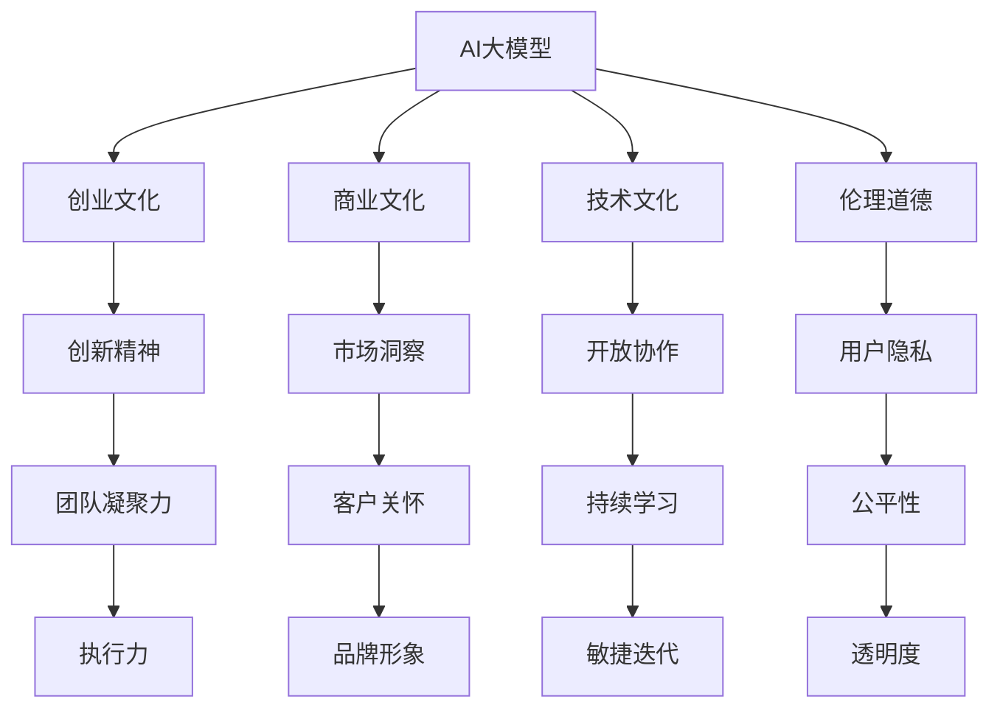

                 

# AI 大模型创业：如何利用文化优势？

> 关键词：AI大模型,创业,文化优势,商业应用,技术壁垒,伦理道德

## 1. 背景介绍

在人工智能领域，AI大模型正成为新一代技术制高点，吸引了大量创业者的目光。然而，AI大模型的研发门槛高、技术壁垒强，如何成功创业并取得商业成功，成为众多创业者面临的共同挑战。

AI大模型的创业并非仅靠技术突破，更多地需要依靠文化优势，包括技术文化的塑造、团队文化的建设、商业文化的培育等。本文将探讨如何利用文化优势，助力AI大模型的创业之路。

## 2. 核心概念与联系

### 2.1 核心概念概述

为更好地理解AI大模型创业中文化优势的重要性，本节将介绍几个密切相关的核心概念：

- **AI大模型**：指基于大规模深度学习模型，通过预训练与微调，能在特定领域或任务上快速适应的智能技术。常见的大模型包括BERT、GPT-3、T5等。

- **创业文化**：指创业公司在企业文化、管理风格、工作氛围等方面形成的独特文化特质，如创新精神、团队凝聚力、执行力等。

- **商业文化**：指公司业务运作、市场定位、客户服务等方面体现出的文化特征，如市场洞察、客户关怀、品牌形象等。

- **技术文化**：指公司对技术发展、技术标准、技术创新等方面具有的价值观和行为规范，如开放协作、持续学习、敏捷迭代等。

- **伦理道德**：指公司对人工智能技术的社会责任、伦理约束、隐私保护等方面的认知和实践，如公平性、透明度、用户隐私等。

这些核心概念之间的逻辑关系可以通过以下Mermaid流程图来展示：



这个流程图展示了大模型与创业文化之间的相互关系：

1. AI大模型作为技术和工具，需要创业文化、商业文化和伦理道德的支持。
2. 创业文化通过塑造创新精神、团队凝聚力和执行力，为技术研发和商业化提供动力。
3. 商业文化通过市场洞察、客户关怀和品牌形象，指导技术应用的商业化方向。
4. 技术文化通过开放协作、持续学习和敏捷迭代，保证技术的领先性和创新性。
5. 伦理道德通过用户隐私保护、公平性和透明度，确保技术的健康发展。

这些文化要素共同构成了AI大模型创业的软实力，是技术成功转化的关键。

## 3. 核心算法原理 & 具体操作步骤
### 3.1 算法原理概述

AI大模型的创业不仅涉及技术研发，更依赖于有效的文化战略和文化落地。本节将从技术和文化两个维度，阐述AI大模型创业的算法原理和操作步骤。

### 3.2 算法步骤详解

**技术方面**：

1. **预训练与微调**：使用大规模无标签数据对模型进行预训练，使用有标签数据进行微调。预训练增加模型的通用能力，微调增强模型对特定领域的应用。

2. **模型优化**：通过正则化、批量标准化、学习率调整等技术，提升模型的稳定性和泛化能力。

3. **推理优化**：采用模型裁剪、量化加速、分布式计算等技术，提升模型的推理速度和资源利用效率。

4. **算法创新**：引入自适应学习率、动态架构调整、混合精度训练等算法，提升模型的学习效率和适应能力。

**文化方面**：

1. **文化建设**：定义公司使命、愿景、价值观，建立团队文化，提升员工的凝聚力和认同感。

2. **文化落实**：制定明确的规章制度、行为规范，营造开放、包容、协作的工作氛围。

3. **文化驱动**：通过文化活动、员工培训、激励机制，推动企业文化落地，形成持续进步的生态。

### 3.3 算法优缺点

**技术优点**：

1. **通用性强**：预训练模型可以应对多种任务，通用性强。
2. **性能提升快**：微调和大规模数据训练可以显著提升模型性能。
3. **可解释性强**：模型结构复杂，但对数据的依赖小，推理过程可解释性强。

**技术缺点**：

1. **资源消耗大**：大模型参数量大，训练和推理需要大量计算资源。
2. **部署复杂**：模型裁剪、量化加速等技术复杂，需要经验丰富的工程师。
3. **风险高**：模型训练需要大量标注数据，标注成本高，数据偏见风险大。

**文化优点**：

1. **凝聚力强**：文化建设提升员工认同感和凝聚力，增强团队的向心力和执行力。
2. **创新能力强**：文化驱动激发创新精神，促进技术持续迭代和突破。
3. **适应力强**：文化落地增强企业的灵活性和应对变化的能力。

**文化缺点**：

1. **管理复杂**：文化建设和管理需要时间和资源，短期内难以见效。
2. **冲突风险**：文化差异可能导致团队内部冲突，影响工作效率。
3. **文化漂移**：文化建设若未持续推动，易出现文化漂移现象，影响长期发展。

### 3.4 算法应用领域

AI大模型的创业文化优势不仅限于技术层面，还涵盖商业、伦理等多个领域。具体应用领域包括：

1. **商业领域**：通过文化建设提升市场洞察力和客户关怀，快速响应市场需求，提高市场竞争力。
2. **技术领域**：通过文化驱动和制度保障，推动技术持续创新和优化，保持技术领先。
3. **伦理领域**：通过文化导向，强化伦理责任和道德约束，确保AI技术的公平性和透明度。
4. **社会领域**：通过文化建设和社会责任，提升企业形象，增强社会影响力。

这些应用领域展现了文化优势在AI大模型创业中的广泛价值，有助于公司在竞争激烈的市场中脱颖而出。

## 4. 数学模型和公式 & 详细讲解 & 举例说明（备注：数学公式请使用latex格式，latex嵌入文中独立段落使用 $$，段落内使用 $)
### 4.1 数学模型构建

本节将使用数学语言对AI大模型创业中的文化影响进行更加严格的刻画。

记AI大模型为 $M_{\theta}$，其中 $\theta$ 为模型参数。设创业文化为 $C$，商业文化为 $B$，技术文化为 $T$，伦理文化为 $E$。则文化影响函数定义为：

$$
F(C,B,T,E) = \max \{f_C(M_{\theta}), f_B(M_{\theta}), f_T(M_{\theta}), f_E(M_{\theta})\}
$$

其中 $f_C$、$f_B$、$f_T$、$f_E$ 分别表示文化对模型 $M_{\theta}$ 的影响函数。

### 4.2 公式推导过程

以文化对技术研发的影响为例，进行公式推导：

设文化对技术的影响因子为 $k$，则技术改进后的模型性能 $M_{\theta}'$ 为：

$$
M_{\theta}' = M_{\theta} + k \cdot \Delta T
$$

其中 $\Delta T$ 表示技术改进量。由于文化的影响 $k$ 是复杂的非线性函数，难以直接解析求解。可以通过实验方法，在多组实验中分别计算文化对不同技术改进的影响，从而得到 $k$ 的近似值。

### 4.3 案例分析与讲解

以谷歌DeepMind为例，分析其文化优势。DeepMind通过开放协作、持续学习和敏捷迭代的文化建设，推动了AlphaGo、AlphaZero等模型的突破，展现出了强大的技术创新能力。同时，DeepMind注重社会责任，公开算法实现，共享研究成果，形成了良好的伦理文化，赢得了广泛的社会认可。

## 5. 项目实践：代码实例和详细解释说明
### 5.1 开发环境搭建

在进行AI大模型创业项目开发前，我们需要准备好开发环境。以下是使用Python进行PyTorch开发的环境配置流程：

1. 安装Anaconda：从官网下载并安装Anaconda，用于创建独立的Python环境。

2. 创建并激活虚拟环境：
```bash
conda create -n pytorch-env python=3.8 
conda activate pytorch-env
```

3. 安装PyTorch：根据CUDA版本，从官网获取对应的安装命令。例如：
```bash
conda install pytorch torchvision torchaudio cudatoolkit=11.1 -c pytorch -c conda-forge
```

4. 安装各类工具包：
```bash
pip install numpy pandas scikit-learn matplotlib tqdm jupyter notebook ipython
```

完成上述步骤后，即可在`pytorch-env`环境中开始创业项目开发。

### 5.2 源代码详细实现

下面我们以基于BERT的命名实体识别(NER)项目为例，给出使用Transformers库的PyTorch代码实现。

首先，定义NER任务的数据处理函数：

```python
from transformers import BertTokenizer
from torch.utils.data import Dataset
import torch

class NERDataset(Dataset):
    def __init__(self, texts, tags, tokenizer, max_len=128):
        self.texts = texts
        self.tags = tags
        self.tokenizer = tokenizer
        self.max_len = max_len
        
    def __len__(self):
        return len(self.texts)
    
    def __getitem__(self, item):
        text = self.texts[item]
        tags = self.tags[item]
        
        encoding = self.tokenizer(text, return_tensors='pt', max_length=self.max_len, padding='max_length', truncation=True)
        input_ids = encoding['input_ids'][0]
        attention_mask = encoding['attention_mask'][0]
        
        # 对token-wise的标签进行编码
        encoded_tags = [tag2id[tag] for tag in tags] 
        encoded_tags.extend([tag2id['O']] * (self.max_len - len(encoded_tags)))
        labels = torch.tensor(encoded_tags, dtype=torch.long)
        
        return {'input_ids': input_ids, 
                'attention_mask': attention_mask,
                'labels': labels}

# 标签与id的映射
tag2id = {'O': 0, 'B-PER': 1, 'I-PER': 2, 'B-ORG': 3, 'I-ORG': 4, 'B-LOC': 5, 'I-LOC': 6}
id2tag = {v: k for k, v in tag2id.items()}

# 创建dataset
tokenizer = BertTokenizer.from_pretrained('bert-base-cased')

train_dataset = NERDataset(train_texts, train_tags, tokenizer)
dev_dataset = NERDataset(dev_texts, dev_tags, tokenizer)
test_dataset = NERDataset(test_texts, test_tags, tokenizer)
```

然后，定义模型和优化器：

```python
from transformers import BertForTokenClassification, AdamW

model = BertForTokenClassification.from_pretrained('bert-base-cased', num_labels=len(tag2id))

optimizer = AdamW(model.parameters(), lr=2e-5)
```

接着，定义训练和评估函数：

```python
from torch.utils.data import DataLoader
from tqdm import tqdm
from sklearn.metrics import classification_report

device = torch.device('cuda') if torch.cuda.is_available() else torch.device('cpu')
model.to(device)

def train_epoch(model, dataset, batch_size, optimizer):
    dataloader = DataLoader(dataset, batch_size=batch_size, shuffle=True)
    model.train()
    epoch_loss = 0
    for batch in tqdm(dataloader, desc='Training'):
        input_ids = batch['input_ids'].to(device)
        attention_mask = batch['attention_mask'].to(device)
        labels = batch['labels'].to(device)
        model.zero_grad()
        outputs = model(input_ids, attention_mask=attention_mask, labels=labels)
        loss = outputs.loss
        epoch_loss += loss.item()
        loss.backward()
        optimizer.step()
    return epoch_loss / len(dataloader)

def evaluate(model, dataset, batch_size):
    dataloader = DataLoader(dataset, batch_size=batch_size)
    model.eval()
    preds, labels = [], []
    with torch.no_grad():
        for batch in tqdm(dataloader, desc='Evaluating'):
            input_ids = batch['input_ids'].to(device)
            attention_mask = batch['attention_mask'].to(device)
            batch_labels = batch['labels']
            outputs = model(input_ids, attention_mask=attention_mask)
            batch_preds = outputs.logits.argmax(dim=2).to('cpu').tolist()
            batch_labels = batch_labels.to('cpu').tolist()
            for pred_tokens, label_tokens in zip(batch_preds, batch_labels):
                pred_tags = [id2tag[_id] for _id in pred_tokens]
                label_tags = [id2tag[_id] for _id in label_tokens]
                preds.append(pred_tags[:len(label_tags)])
                labels.append(label_tags)
                
    print(classification_report(labels, preds))
```

最后，启动训练流程并在测试集上评估：

```python
epochs = 5
batch_size = 16

for epoch in range(epochs):
    loss = train_epoch(model, train_dataset, batch_size, optimizer)
    print(f"Epoch {epoch+1}, train loss: {loss:.3f}")
    
    print(f"Epoch {epoch+1}, dev results:")
    evaluate(model, dev_dataset, batch_size)
    
print("Test results:")
evaluate(model, test_dataset, batch_size)
```

以上就是使用PyTorch对BERT进行命名实体识别任务微调的完整代码实现。可以看到，得益于Transformers库的强大封装，我们可以用相对简洁的代码完成BERT模型的加载和微调。

### 5.3 代码解读与分析

让我们再详细解读一下关键代码的实现细节：

**NERDataset类**：
- `__init__`方法：初始化文本、标签、分词器等关键组件。
- `__len__`方法：返回数据集的样本数量。
- `__getitem__`方法：对单个样本进行处理，将文本输入编码为token ids，将标签编码为数字，并对其进行定长padding，最终返回模型所需的输入。

**tag2id和id2tag字典**：
- 定义了标签与数字id之间的映射关系，用于将token-wise的预测结果解码回真实的标签。

**训练和评估函数**：
- 使用PyTorch的DataLoader对数据集进行批次化加载，供模型训练和推理使用。
- 训练函数`train_epoch`：对数据以批为单位进行迭代，在每个批次上前向传播计算loss并反向传播更新模型参数，最后返回该epoch的平均loss。
- 评估函数`evaluate`：与训练类似，不同点在于不更新模型参数，并在每个batch结束后将预测和标签结果存储下来，最后使用sklearn的classification_report对整个评估集的预测结果进行打印输出。

**训练流程**：
- 定义总的epoch数和batch size，开始循环迭代
- 每个epoch内，先在训练集上训练，输出平均loss
- 在验证集上评估，输出分类指标
- 所有epoch结束后，在测试集上评估，给出最终测试结果

可以看到，PyTorch配合Transformers库使得BERT微调的代码实现变得简洁高效。开发者可以将更多精力放在数据处理、模型改进等高层逻辑上，而不必过多关注底层的实现细节。

当然，工业级的系统实现还需考虑更多因素，如模型的保存和部署、超参数的自动搜索、更灵活的任务适配层等。但核心的微调范式基本与此类似。

## 6. 实际应用场景
### 6.1 智能客服系统

基于大语言模型微调的对话技术，可以广泛应用于智能客服系统的构建。传统客服往往需要配备大量人力，高峰期响应缓慢，且一致性和专业性难以保证。而使用微调后的对话模型，可以7x24小时不间断服务，快速响应客户咨询，用自然流畅的语言解答各类常见问题。

在技术实现上，可以收集企业内部的历史客服对话记录，将问题和最佳答复构建成监督数据，在此基础上对预训练对话模型进行微调。微调后的对话模型能够自动理解用户意图，匹配最合适的答案模板进行回复。对于客户提出的新问题，还可以接入检索系统实时搜索相关内容，动态组织生成回答。如此构建的智能客服系统，能大幅提升客户咨询体验和问题解决效率。

### 6.2 金融舆情监测

金融机构需要实时监测市场舆论动向，以便及时应对负面信息传播，规避金融风险。传统的人工监测方式成本高、效率低，难以应对网络时代海量信息爆发的挑战。基于大语言模型微调的文本分类和情感分析技术，为金融舆情监测提供了新的解决方案。

具体而言，可以收集金融领域相关的新闻、报道、评论等文本数据，并对其进行主题标注和情感标注。在此基础上对预训练语言模型进行微调，使其能够自动判断文本属于何种主题，情感倾向是正面、中性还是负面。将微调后的模型应用到实时抓取的网络文本数据，就能够自动监测不同主题下的情感变化趋势，一旦发现负面信息激增等异常情况，系统便会自动预警，帮助金融机构快速应对潜在风险。

### 6.3 个性化推荐系统

当前的推荐系统往往只依赖用户的历史行为数据进行物品推荐，无法深入理解用户的真实兴趣偏好。基于大语言模型微调技术，个性化推荐系统可以更好地挖掘用户行为背后的语义信息，从而提供更精准、多样的推荐内容。

在实践中，可以收集用户浏览、点击、评论、分享等行为数据，提取和用户交互的物品标题、描述、标签等文本内容。将文本内容作为模型输入，用户的后续行为（如是否点击、购买等）作为监督信号，在此基础上微调预训练语言模型。微调后的模型能够从文本内容中准确把握用户的兴趣点。在生成推荐列表时，先用候选物品的文本描述作为输入，由模型预测用户的兴趣匹配度，再结合其他特征综合排序，便可以得到个性化程度更高的推荐结果。

### 6.4 未来应用展望

随着大语言模型微调技术的不断发展，基于微调范式将在更多领域得到应用，为传统行业带来变革性影响。

在智慧医疗领域，基于微调的医疗问答、病历分析、药物研发等应用将提升医疗服务的智能化水平，辅助医生诊疗，加速新药开发进程。

在智能教育领域，微调技术可应用于作业批改、学情分析、知识推荐等方面，因材施教，促进教育公平，提高教学质量。

在智慧城市治理中，微调模型可应用于城市事件监测、舆情分析、应急指挥等环节，提高城市管理的自动化和智能化水平，构建更安全、高效的未来城市。

此外，在企业生产、社会治理、文娱传媒等众多领域，基于大模型微调的人工智能应用也将不断涌现，为NLP技术带来了全新的突破。相信随着预训练语言模型和微调方法的不断进步，NLP技术将在更广阔的应用领域大放异彩。

## 7. 工具和资源推荐
### 7.1 学习资源推荐

为了帮助开发者系统掌握大语言模型微调的理论基础和实践技巧，这里推荐一些优质的学习资源：

1. 《Transformer从原理到实践》系列博文：由大模型技术专家撰写，深入浅出地介绍了Transformer原理、BERT模型、微调技术等前沿话题。

2. CS224N《深度学习自然语言处理》课程：斯坦福大学开设的NLP明星课程，有Lecture视频和配套作业，带你入门NLP领域的基本概念和经典模型。

3. 《Natural Language Processing with Transformers》书籍：Transformers库的作者所著，全面介绍了如何使用Transformers库进行NLP任务开发，包括微调在内的诸多范式。

4. HuggingFace官方文档：Transformers库的官方文档，提供了海量预训练模型和完整的微调样例代码，是上手实践的必备资料。

5. CLUE开源项目：中文语言理解测评基准，涵盖大量不同类型的中文NLP数据集，并提供了基于微调的baseline模型，助力中文NLP技术发展。

通过对这些资源的学习实践，相信你一定能够快速掌握大语言模型微调的精髓，并用于解决实际的NLP问题。
###  7.2 开发工具推荐

高效的开发离不开优秀的工具支持。以下是几款用于大语言模型微调开发的常用工具：

1. PyTorch：基于Python的开源深度学习框架，灵活动态的计算图，适合快速迭代研究。大部分预训练语言模型都有PyTorch版本的实现。

2. TensorFlow：由Google主导开发的开源深度学习框架，生产部署方便，适合大规模工程应用。同样有丰富的预训练语言模型资源。

3. Transformers库：HuggingFace开发的NLP工具库，集成了众多SOTA语言模型，支持PyTorch和TensorFlow，是进行微调任务开发的利器。

4. Weights & Biases：模型训练的实验跟踪工具，可以记录和可视化模型训练过程中的各项指标，方便对比和调优。与主流深度学习框架无缝集成。

5. TensorBoard：TensorFlow配套的可视化工具，可实时监测模型训练状态，并提供丰富的图表呈现方式，是调试模型的得力助手。

6. Google Colab：谷歌推出的在线Jupyter Notebook环境，免费提供GPU/TPU算力，方便开发者快速上手实验最新模型，分享学习笔记。

合理利用这些工具，可以显著提升大语言模型微调任务的开发效率，加快创新迭代的步伐。

### 7.3 相关论文推荐

大语言模型和微调技术的发展源于学界的持续研究。以下是几篇奠基性的相关论文，推荐阅读：

1. Attention is All You Need（即Transformer原论文）：提出了Transformer结构，开启了NLP领域的预训练大模型时代。

2. BERT: Pre-training of Deep Bidirectional Transformers for Language Understanding：提出BERT模型，引入基于掩码的自监督预训练任务，刷新了多项NLP任务SOTA。

3. Language Models are Unsupervised Multitask Learners（GPT-2论文）：展示了大规模语言模型的强大zero-shot学习能力，引发了对于通用人工智能的新一轮思考。

4. Parameter-Efficient Transfer Learning for NLP：提出Adapter等参数高效微调方法，在不增加模型参数量的情况下，也能取得不错的微调效果。

5. Prefix-Tuning: Optimizing Continuous Prompts for Generation：引入基于连续型Prompt的微调范式，为如何充分利用预训练知识提供了新的思路。

6. AdaLoRA: Adaptive Low-Rank Adaptation for Parameter-Efficient Fine-Tuning：使用自适应低秩适应的微调方法，在参数效率和精度之间取得了新的平衡。

这些论文代表了大语言模型微调技术的发展脉络。通过学习这些前沿成果，可以帮助研究者把握学科前进方向，激发更多的创新灵感。

## 8. 总结：未来发展趋势与挑战

### 8.1 总结

本文对AI大模型创业中利用文化优势进行了全面系统的介绍。首先阐述了AI大模型创业的文化背景和意义，明确了文化在技术和商业中的应用价值。其次，从技术文化、商业文化和伦理道德三个维度，深入讲解了文化对AI大模型创业的影响，并给出了详细的数学模型构建和公式推导。最后，提供了基于微调的大模型在智能客服、金融舆情、个性化推荐等多个领域的应用案例，并提出了未来发展的趋势和挑战。

通过本文的系统梳理，可以看到，利用文化优势是大模型创业的重要战略。优秀的企业文化能够激发技术创新，推动业务增长，构建良好的社会形象。但是，文化建设和管理也需要时间和资源，需要持续推动和优化。只有将技术与文化有机结合，才能真正实现AI大模型的成功创业。

### 8.2 未来发展趋势

展望未来，AI大模型创业将呈现以下几个发展趋势：

1. **技术不断创新**：随着AI技术的发展，未来的AI大模型将具有更强大的计算能力、更丰富的应用场景和更广泛的数据来源，从而推动技术的持续突破。

2. **商业化加速**：越来越多的初创公司将AI大模型技术商业化，进入医疗、金融、教育、制造等多个行业，创造新的商业模式和市场机会。

3. **伦理与责任并重**：随着AI技术的广泛应用，伦理道德和社会责任成为不可忽视的重要因素。未来的AI大模型创业将更加注重伦理道德，确保技术的健康发展。

4. **全球化拓展**：AI大模型创业不仅限于国内市场，更多企业将拓展海外市场，提升全球竞争力。

5. **持续优化与迭代**：AI大模型创业不是一劳永逸的过程，需要不断优化和迭代，提升技术性能和商业应用效果。

### 8.3 面临的挑战

尽管AI大模型创业前景广阔，但也面临诸多挑战：

1. **高昂的成本**：AI大模型的研发和商业化需要大量资金支持，这对于初创公司来说是一个重大挑战。

2. **技术复杂性**：AI大模型的技术门槛高，需要跨学科的复合型人才，这对人才储备和团队管理提出了更高要求。

3. **市场竞争激烈**：AI大模型领域竞争激烈，初创公司需要在技术、市场、人才等多方面进行全面布局，才能在激烈竞争中突围。

4. **数据隐私问题**：AI大模型创业涉及大量敏感数据，如何保护用户隐私和数据安全是一个重要挑战。

5. **法律和监管环境**：AI大模型技术的发展需要与法律法规相结合，合规性问题也需得到充分关注。

### 8.4 研究展望

面对AI大模型创业所面临的挑战，未来的研究需要在以下几个方面寻求新的突破：

1. **降低研发成本**：探索使用更高效、更经济的模型和算法，降低研发成本，促进技术普及。

2. **提升技术鲁棒性**：研究模型鲁棒性提升技术，确保模型在面对新数据和复杂场景时表现稳定。

3. **优化市场策略**：研究市场定位、用户需求分析等策略，优化商业模式，提升市场竞争力。

4. **强化伦理约束**：制定伦理规范和标准，引导AI大模型技术的健康发展，增强社会信任。

5. **跨学科融合**：促进AI技术与其他学科的融合，提升技术创新能力，拓展应用场景。

这些研究方向的探索，必将引领AI大模型创业进入新的发展阶段，为技术落地和商业成功提供有力保障。面向未来，AI大模型创业需要更多创新、更多耐心和更多合作，才能在竞争激烈的市场中脱颖而出，实现真正的商业价值。

## 9. 附录：常见问题与解答

**Q1：AI大模型创业的难点在哪里？**

A: AI大模型创业的难点主要集中在技术、商业和文化三个方面：

1. **技术难度大**：AI大模型技术复杂，需要跨学科知识，难以短期内突破。

2. **市场竞争激烈**：AI大模型领域竞争激烈，初创公司需要寻找独特的市场定位和差异化策略。

3. **文化建设和管理**：企业文化和团队建设需要时间和资源，初期投资压力大。

**Q2：如何提升AI大模型的商业价值？**

A: 提升AI大模型的商业价值，可以从以下几个方面入手：

1. **市场定位**：明确目标市场和用户需求，提供精准的解决方案。

2. **差异化策略**：在技术、产品、服务等方面实现差异化，提升竞争力。

3. **客户关系**：建立良好的客户关系，提供优质的服务和支持。

4. **品牌建设**：提升品牌知名度和形象，增强市场影响力。

5. **增值服务**：提供额外的增值服务，如定制化开发、技术咨询等。

**Q3：AI大模型创业的文化建设有哪些关键要素？**

A: AI大模型创业的文化建设关键要素包括：

1. **使命和愿景**：定义公司的使命和愿景，明确发展方向。

2. **价值观和行为规范**：制定统一的价值观和行为规范，营造良好的工作氛围。

3. **持续学习**：鼓励员工持续学习和技术创新，保持技术领先。

4. **开放协作**：促进团队内部和外部的开放协作，提升创新能力。

5. **执行力和团队凝聚力**：通过制度和激励机制，提升团队的执行力和凝聚力。

**Q4：AI大模型创业如何应对数据隐私问题？**

A: AI大模型创业在处理数据隐私问题时，可以从以下几个方面进行：

1. **数据匿名化**：对用户数据进行匿名化处理，确保数据安全。

2. **合规性**：遵守法律法规和行业规范，确保数据使用合规。

3. **透明度**：公开数据使用和模型训练过程，增强用户信任。

4. **用户同意**：在数据收集和使用前，获取用户同意，确保数据使用的合法性和透明性。

5. **安全保障**：采用数据加密、访问控制等技术，确保数据安全。

**Q5：AI大模型创业如何应对法律和监管环境？**

A: AI大模型创业应对法律和监管环境，可以从以下几个方面进行：

1. **合规性建设**：建立合规性管理体系，确保技术开发和应用符合法律法规。

2. **法律咨询**：定期咨询法律专家，了解最新法规变化，规避法律风险。

3. **透明度报告**：定期发布透明度报告，公开技术使用情况和合规性进展。

4. **用户反馈**：建立用户反馈机制，及时解决用户投诉和问题。

5. **持续改进**：根据法律法规和用户反馈，持续改进技术应用，确保合规性和用户信任。

---

作者：禅与计算机程序设计艺术 / Zen and the Art of Computer Programming

