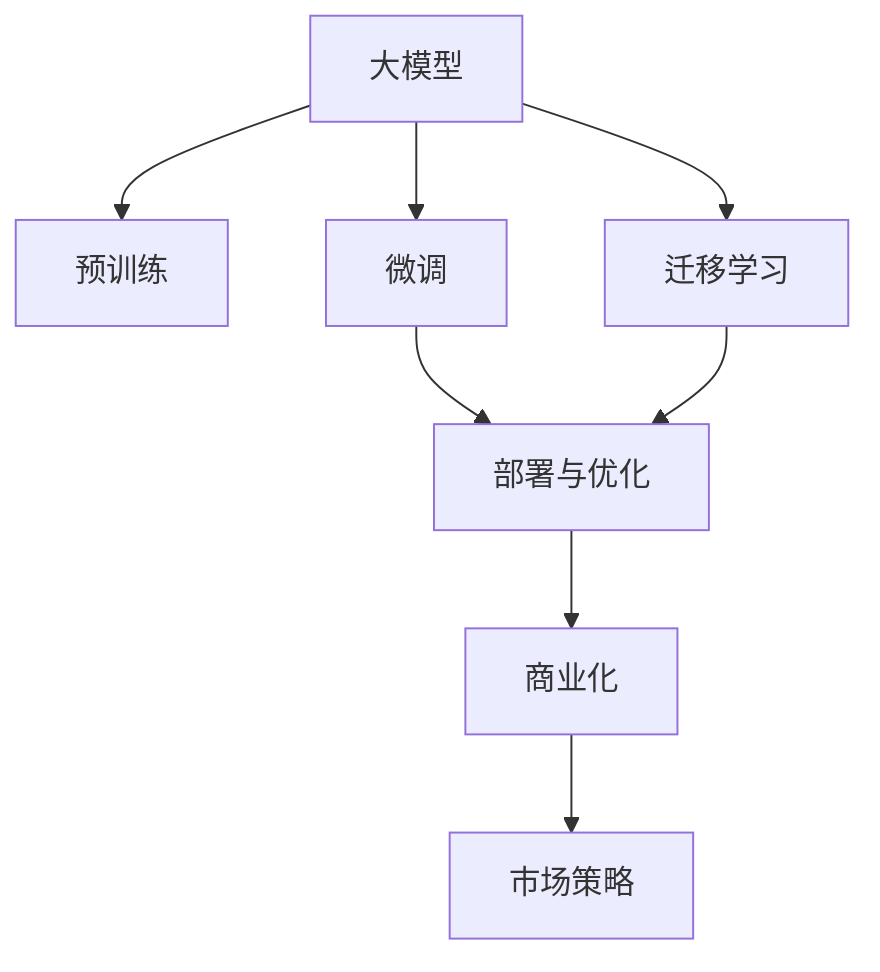

                 

# AI 大模型创业：如何利用未来优势？

> 关键词：AI大模型、创业、未来优势、技术优势、应用场景、市场机会、创业策略、竞争优势、商业模式、市场布局、创新能力、技术壁垒

## 1. 背景介绍

### 1.1 问题由来

随着人工智能（AI）技术的飞速发展，大模型（Large Models）在各个领域的应用越来越广泛。这些大模型通常是指深度学习模型中的大型神经网络，具有海量参数和高计算需求。这些模型的出现不仅提升了AI的准确性和泛化能力，也为创业提供了广阔的天地。然而，随着市场竞争的加剧，如何充分利用大模型的优势，打造具有市场竞争力的AI创业公司，成为了每一个创业者关注的焦点。

### 1.2 问题核心关键点

在创业过程中，大模型的应用涉及以下几个关键点：

- **模型选择**：选择合适的预训练模型，并了解其优势和限制。
- **微调与训练**：基于特定任务进行模型微调，提高模型在特定领域的表现。
- **部署与优化**：将模型部署到生产环境中，并优化其性能和效率。
- **商业化与市场策略**：如何将AI模型转化为商业产品，并通过有效的市场策略进行推广。
- **创新与持续改进**：保持技术创新，不断提升模型的精度和应用范围。

这些关键点共同构成了AI大模型创业的核心挑战，但同时也是创业成功的关键因素。

## 2. 核心概念与联系

### 2.1 核心概念概述

为了更好地理解大模型在创业中的应用，本节将介绍几个核心概念及其相互联系：

- **大模型（Large Models）**：指拥有大量参数的深度学习模型，如GPT、BERT等，具有强大的语言理解和生成能力。
- **预训练（Pre-training）**：在大规模无标签数据上训练模型，学习通用语言知识。
- **微调（Fine-tuning）**：基于特定任务对预训练模型进行微调，提升模型在特定任务上的表现。
- **迁移学习（Transfer Learning）**：将预训练模型迁移到新的任务上，利用已有知识提升新任务的性能。
- **计算资源（Computational Resources）**：包括GPU、TPU等硬件设施，支持大规模模型训练和推理。
- **商业化（Commercialization）**：将AI技术转化为产品或服务，并推广到市场中。
- **市场策略（Market Strategies）**：包括定价、营销、渠道等策略，提高产品竞争力。

这些概念之间的关系可以通过以下Mermaid流程图来展示：



这个流程图展示了大模型从预训练到商业化的全过程，以及其中各环节的相互关系。

## 3. 核心算法原理 & 具体操作步骤

### 3.1 算法原理概述

大模型的创业过程中，算法原理和技术手段的选择至关重要。以下是几个核心算法及其原理概述：

- **深度学习（Deep Learning）**：利用神经网络进行模型训练和推理，具有强大的数据拟合能力。
- **自监督学习（Self-supervised Learning）**：在大规模无标签数据上训练模型，利用数据内在结构进行学习。
- **迁移学习（Transfer Learning）**：将预训练模型迁移到新的任务上，利用已有知识提升新任务的性能。
- **微调（Fine-tuning）**：基于特定任务对预训练模型进行微调，提升模型在特定任务上的表现。
- **模型压缩（Model Compression）**：通过剪枝、量化等手段减小模型大小，提升推理效率。
- **模型优化（Model Optimization）**：优化模型结构、参数等，提高模型性能和效率。

### 3.2 算法步骤详解

基于上述核心算法，AI大模型创业的具体操作步骤可以归纳如下：

1. **模型选择**：选择合适的预训练模型，并根据任务需求进行调整。
2. **数据准备**：收集、清洗和标注所需的数据集。
3. **模型微调**：基于特定任务对预训练模型进行微调，提升模型在特定任务上的表现。
4. **部署优化**：将微调后的模型部署到生产环境中，并进行优化。
5. **商业化策略**：将AI模型转化为商业产品或服务，并制定有效的市场策略进行推广。
6. **持续改进**：保持技术创新，不断提升模型的精度和应用范围。

### 3.3 算法优缺点

使用大模型进行创业时，需要了解其优缺点：

**优点**：

- **精度高**：大模型通过大量的数据训练，通常具有较高的精度和泛化能力。
- **适应性强**：大模型能够适应多种任务，具有较强的迁移学习能力。
- **高效优化**：通过微调和优化，可以在小数据集上快速提升模型性能。

**缺点**：

- **计算资源消耗大**：大模型通常需要大量的计算资源进行训练和推理。
- **可解释性差**：大模型通常被视为“黑盒”，难以解释其内部工作机制。
- **隐私和安全问题**：大模型的使用可能涉及隐私数据，需要严格的安全措施。

### 3.4 算法应用领域

大模型的应用领域非常广泛，以下是几个典型应用场景：

- **自然语言处理（NLP）**：包括文本分类、情感分析、机器翻译等。
- **计算机视觉（CV）**：如图像识别、目标检测等。
- **语音识别（ASR）**：如语音转文本、语音指令识别等。
- **推荐系统**：如电商推荐、广告推荐等。
- **医疗诊断**：如影像诊断、基因分析等。
- **自动驾驶**：如路径规划、障碍物检测等。

## 4. 数学模型和公式 & 详细讲解

### 4.1 数学模型构建

假设我们使用BERT模型进行情感分析任务，构建的数学模型如下：

**输入**：一段文本 $x$。

**输出**：一个二分类标签 $y$，表示文本的情感倾向（正面或负面）。

### 4.2 公式推导过程

基于上述模型，我们可以构建如下的损失函数：

$$
\mathcal{L} = -\frac{1}{N}\sum_{i=1}^{N}(y_i\log p(y_i|x_i) + (1-y_i)\log(1-p(y_i|x_i)))
$$

其中 $N$ 是训练样本数，$y_i$ 是样本的标签，$p(y_i|x_i)$ 是模型对标签的预测概率。

### 4.3 案例分析与讲解

以情感分析任务为例，假设我们有一段文本“今天天气真好，心情很好”，我们希望模型能够预测其情感倾向为正面。我们首先将文本输入BERT模型，得到其向量表示 $x$，然后计算模型对正面情感的预测概率 $p(\text{positive}|x)$，最终得到损失函数 $\mathcal{L}$。通过反向传播算法，我们可以不断更新模型参数，使得模型在训练数据上最大化预测准确率。

## 5. 项目实践：代码实例和详细解释说明

### 5.1 开发环境搭建

在进行大模型项目实践前，需要配置好开发环境。以下是Python和PyTorch的搭建流程：

1. 安装Anaconda：从官网下载并安装Anaconda，用于创建独立的Python环境。
2. 创建并激活虚拟环境：
```bash
conda create -n pytorch-env python=3.8 
conda activate pytorch-env
```

3. 安装PyTorch：根据CUDA版本，从官网获取对应的安装命令。例如：
```bash
conda install pytorch torchvision torchaudio cudatoolkit=11.1 -c pytorch -c conda-forge
```

4. 安装Transformer库：
```bash
pip install transformers
```

5. 安装各类工具包：
```bash
pip install numpy pandas scikit-learn matplotlib tqdm jupyter notebook ipython
```

### 5.2 源代码详细实现

以下是使用PyTorch和Transformers库对BERT模型进行情感分析任务微调的代码实现：

```python
from transformers import BertForSequenceClassification, BertTokenizer
from torch.utils.data import Dataset, DataLoader
from torch import nn, optim

# 定义数据集
class TextDataset(Dataset):
    def __init__(self, texts, labels):
        self.tokenizer = BertTokenizer.from_pretrained('bert-base-cased')
        self.texts = texts
        self.labels = labels
        
    def __len__(self):
        return len(self.texts)
    
    def __getitem__(self, index):
        text = self.texts[index]
        label = self.labels[index]
        encoding = self.tokenizer(text, return_tensors='pt')
        return {'input_ids': encoding['input_ids'].flatten(), 'attention_mask': encoding['attention_mask'].flatten(), 'labels': torch.tensor(label)}

# 加载数据集
train_dataset = TextDataset(train_texts, train_labels)
test_dataset = TextDataset(test_texts, test_labels)

# 定义模型
model = BertForSequenceClassification.from_pretrained('bert-base-cased', num_labels=2)
device = torch.device('cuda' if torch.cuda.is_available() else 'cpu')
model.to(device)

# 定义优化器和损失函数
optimizer = optim.Adam(model.parameters(), lr=2e-5)
loss_fn = nn.BCEWithLogitsLoss()

# 定义训练函数
def train_epoch(model, dataset, optimizer, loss_fn):
    dataloader = DataLoader(dataset, batch_size=16, shuffle=True)
    model.train()
    total_loss = 0
    for batch in dataloader:
        input_ids = batch['input_ids'].to(device)
        attention_mask = batch['attention_mask'].to(device)
        labels = batch['labels'].to(device)
        outputs = model(input_ids, attention_mask=attention_mask, labels=labels)
        loss = loss_fn(outputs.logits, labels)
        optimizer.zero_grad()
        loss.backward()
        optimizer.step()
        total_loss += loss.item()
    return total_loss / len(dataloader)

# 定义评估函数
def evaluate(model, dataset):
    dataloader = DataLoader(dataset, batch_size=16, shuffle=False)
    model.eval()
    total_correct = 0
    total_num = 0
    with torch.no_grad():
        for batch in dataloader:
            input_ids = batch['input_ids'].to(device)
            attention_mask = batch['attention_mask'].to(device)
            labels = batch['labels'].to(device)
            outputs = model(input_ids, attention_mask=attention_mask)
            predictions = torch.round(torch.sigmoid(outputs.logits))
            total_correct += (predictions == labels).sum().item()
            total_num += predictions.numel()
    return total_correct / total_num

# 训练模型
epochs = 5
for epoch in range(epochs):
    train_loss = train_epoch(model, train_dataset, optimizer, loss_fn)
    print(f"Epoch {epoch+1}, train loss: {train_loss:.3f}")
    test_acc = evaluate(model, test_dataset)
    print(f"Epoch {epoch+1}, test acc: {test_acc:.3f}")

print("Training complete.")
```

### 5.3 代码解读与分析

上述代码中，我们首先定义了一个 `TextDataset` 类，用于加载和预处理数据集。接着，我们加载了预训练的BERT模型，并定义了优化器和损失函数。在训练函数中，我们通过反向传播算法不断更新模型参数，最小化损失函数。在评估函数中，我们计算模型在测试集上的准确率。最后，我们进行模型训练，并在测试集上评估其性能。

## 6. 实际应用场景

### 6.1 智能客服系统

智能客服系统是大模型创业的重要应用场景之一。通过微调BERT模型，智能客服系统可以自动理解客户咨询，提供精准的回复。这不仅可以提高客户满意度，还可以显著降低企业的人力成本。

### 6.2 金融舆情监测

金融舆情监测是另一个典型的应用场景。通过微调BERT模型，金融机构可以实时监测市场舆情，及时发现负面信息，规避金融风险。这有助于提高金融决策的科学性和及时性，降低风险损失。

### 6.3 个性化推荐系统

个性化推荐系统也是大模型创业的重要方向。通过微调BERT模型，推荐系统可以更好地理解用户偏好，提供个性化的产品或服务推荐。这不仅可以提升用户体验，还可以提高企业的销售额。

### 6.4 未来应用展望

未来，大模型在创业领域的应用前景广阔。随着技术的不断进步，大模型将能够处理更多复杂的任务，如自然语言生成、对话系统、智能合约等。这些应用将推动各个行业的数字化转型，提升企业的竞争力和市场价值。

## 7. 工具和资源推荐

### 7.1 学习资源推荐

为了帮助开发者系统掌握大模型创业的理论基础和实践技巧，这里推荐一些优质的学习资源：

1. 《深度学习》（Deep Learning）：Ian Goodfellow等著，深入浅出地介绍了深度学习的基本原理和应用。
2. 《自然语言处理综论》（Speech and Language Processing）：Daniel Jurafsky和James H. Martin著，全面介绍了自然语言处理的基础知识和前沿技术。
3. Coursera的深度学习课程：由斯坦福大学Andrew Ng教授主讲的深度学习课程，内容丰富，适合初学者。
4. Kaggle：数据科学和机器学习竞赛平台，提供丰富的数据集和模型，适合实践和竞赛。

### 7.2 开发工具推荐

高效的开发离不开优秀的工具支持。以下是几款用于大模型创业开发的常用工具：

1. PyTorch：基于Python的开源深度学习框架，灵活动态的计算图，适合快速迭代研究。
2. TensorFlow：由Google主导开发的开源深度学习框架，生产部署方便，适合大规模工程应用。
3. HuggingFace Transformers库：提供了丰富的预训练模型和微调范式，是进行NLP任务开发的利器。
4. Weights & Biases：模型训练的实验跟踪工具，可以记录和可视化模型训练过程中的各项指标，方便对比和调优。
5. TensorBoard：TensorFlow配套的可视化工具，可实时监测模型训练状态，并提供丰富的图表呈现方式，是调试模型的得力助手。

### 7.3 相关论文推荐

大模型创业的研究源于学界的持续研究。以下是几篇奠基性的相关论文，推荐阅读：

1. Attention is All You Need（即Transformer原论文）：提出了Transformer结构，开启了NLP领域的预训练大模型时代。
2. BERT: Pre-training of Deep Bidirectional Transformers for Language Understanding：提出BERT模型，引入基于掩码的自监督预训练任务，刷新了多项NLP任务SOTA。
3. Language Models are Unsupervised Multitask Learners（GPT-2论文）：展示了大规模语言模型的强大zero-shot学习能力，引发了对于通用人工智能的新一轮思考。
4. Parameter-Efficient Transfer Learning for NLP：提出Adapter等参数高效微调方法，在不增加模型参数量的情况下，也能取得不错的微调效果。
5. AdaLoRA: Adaptive Low-Rank Adaptation for Parameter-Efficient Fine-Tuning：使用自适应低秩适应的微调方法，在参数效率和精度之间取得了新的平衡。

这些论文代表了大模型创业技术的发展脉络。通过学习这些前沿成果，可以帮助研究者把握学科前进方向，激发更多的创新灵感。

## 8. 总结：未来发展趋势与挑战

### 8.1 总结

本文对基于大模型的AI创业方法进行了全面系统的介绍。首先阐述了AI大模型创业的研究背景和意义，明确了微调在拓展预训练模型应用、提升下游任务性能方面的独特价值。其次，从原理到实践，详细讲解了监督微调的数学原理和关键步骤，给出了微调任务开发的完整代码实例。同时，本文还广泛探讨了微调方法在智能客服、金融舆情、个性化推荐等多个行业领域的应用前景，展示了微调范式的巨大潜力。此外，本文精选了微调技术的各类学习资源，力求为读者提供全方位的技术指引。

通过本文的系统梳理，可以看到，基于大模型的AI创业方法不仅在学术界得到广泛应用，而且在工业界也展现出巨大的商业潜力。未来，伴随着预训练语言模型的持续演进和微调技术的不断优化，相信AI大模型将会在更多领域大放异彩，为社会和经济带来深远的影响。

### 8.2 未来发展趋势

展望未来，AI大模型创业技术将呈现以下几个发展趋势：

1. **模型规模持续增大**：随着算力成本的下降和数据规模的扩张，预训练语言模型的参数量还将持续增长。超大规模语言模型蕴含的丰富语言知识，有望支撑更加复杂多变的下游任务微调。
2. **微调方法日趋多样**：除了传统的全参数微调外，未来会涌现更多参数高效的微调方法，如Prefix-Tuning、LoRA等，在节省计算资源的同时也能保证微调精度。
3. **持续学习成为常态**：随着数据分布的不断变化，微调模型也需要持续学习新知识以保持性能。如何在不遗忘原有知识的同时，高效吸收新样本信息，将成为重要的研究课题。
4. **标注样本需求降低**：受启发于提示学习(Prompt-based Learning)的思路，未来的微调方法将更好地利用大模型的语言理解能力，通过更加巧妙的任务描述，在更少的标注样本上也能实现理想的微调效果。
5. **多模态微调崛起**：当前的微调主要聚焦于纯文本数据，未来会进一步拓展到图像、视频、语音等多模态数据微调。多模态信息的融合，将显著提升语言模型对现实世界的理解和建模能力。
6. **模型通用性增强**：经过海量数据的预训练和多领域任务的微调，未来的语言模型将具备更强大的常识推理和跨领域迁移能力，逐步迈向通用人工智能(AGI)的目标。

以上趋势凸显了AI大模型创业技术的广阔前景。这些方向的探索发展，必将进一步提升NLP系统的性能和应用范围，为人类认知智能的进化带来深远影响。

### 8.3 面临的挑战

尽管AI大模型创业技术已经取得了瞩目成就，但在迈向更加智能化、普适化应用的过程中，它仍面临着诸多挑战：

1. **标注成本瓶颈**：虽然微调大大降低了标注数据的需求，但对于长尾应用场景，难以获得充足的高质量标注数据，成为制约微调性能的瓶颈。如何进一步降低微调对标注样本的依赖，将是一大难题。
2. **模型鲁棒性不足**：当前微调模型面对域外数据时，泛化性能往往大打折扣。对于测试样本的微小扰动，微调模型的预测也容易发生波动。如何提高微调模型的鲁棒性，避免灾难性遗忘，还需要更多理论和实践的积累。
3. **推理效率有待提高**：大规模语言模型虽然精度高，但在实际部署时往往面临推理速度慢、内存占用大等效率问题。如何在保证性能的同时，简化模型结构，提升推理速度，优化资源占用，将是重要的优化方向。
4. **可解释性亟需加强**：当前微调模型更像是“黑盒”系统，难以解释其内部工作机制和决策逻辑。对于医疗、金融等高风险应用，算法的可解释性和可审计性尤为重要。如何赋予微调模型更强的可解释性，将是亟待攻克的难题。
5. **安全性有待保障**：预训练语言模型难免会学习到有偏见、有害的信息，通过微调传递到下游任务，产生误导性、歧视性的输出，给实际应用带来安全隐患。如何从数据和算法层面消除模型偏见，避免恶意用途，确保输出的安全性，也将是重要的研究课题。
6. **知识整合能力不足**：现有的微调模型往往局限于任务内数据，难以灵活吸收和运用更广泛的先验知识。如何让微调过程更好地与外部知识库、规则库等专家知识结合，形成更加全面、准确的信息整合能力，还有很大的想象空间。

正视AI大模型创业面临的这些挑战，积极应对并寻求突破，将是大模型创业走向成熟的必由之路。相信随着学界和产业界的共同努力，这些挑战终将一一被克服，AI大模型创业必将在构建人机协同的智能时代中扮演越来越重要的角色。

### 8.4 研究展望

面向未来，AI大模型创业的研究需要在以下几个方面寻求新的突破：

1. **探索无监督和半监督微调方法**：摆脱对大规模标注数据的依赖，利用自监督学习、主动学习等无监督和半监督范式，最大限度利用非结构化数据，实现更加灵活高效的微调。
2. **研究参数高效和计算高效的微调范式**：开发更加参数高效的微调方法，在固定大部分预训练参数的同时，只更新极少量的任务相关参数。同时优化微调模型的计算图，减少前向传播和反向传播的资源消耗，实现更加轻量级、实时性的部署。
3. **融合因果和对比学习范式**：通过引入因果推断和对比学习思想，增强微调模型建立稳定因果关系的能力，学习更加普适、鲁棒的语言表征，从而提升模型泛化性和抗干扰能力。
4. **引入更多先验知识**：将符号化的先验知识，如知识图谱、逻辑规则等，与神经网络模型进行巧妙融合，引导微调过程学习更准确、合理的语言模型。同时加强不同模态数据的整合，实现视觉、语音等多模态信息与文本信息的协同建模。
5. **结合因果分析和博弈论工具**：将因果分析方法引入微调模型，识别出模型决策的关键特征，增强输出解释的因果性和逻辑性。借助博弈论工具刻画人机交互过程，主动探索并规避模型的脆弱点，提高系统稳定性。
6. **纳入伦理道德约束**：在模型训练目标中引入伦理导向的评估指标，过滤和惩罚有偏见、有害的输出倾向。同时加强人工干预和审核，建立模型行为的监管机制，确保输出符合人类价值观和伦理道德。

这些研究方向的探索，必将引领AI大模型创业技术迈向更高的台阶，为构建安全、可靠、可解释、可控的智能系统铺平道路。面向未来，AI大模型创业技术还需要与其他人工智能技术进行更深入的融合，如知识表示、因果推理、强化学习等，多路径协同发力，共同推动自然语言理解和智能交互系统的进步。只有勇于创新、敢于突破，才能不断拓展语言模型的边界，让智能技术更好地造福人类社会。

## 9. 附录：常见问题与解答

**Q1：AI大模型创业是否适用于所有NLP任务？**

A: AI大模型创业在大多数NLP任务上都能取得不错的效果，特别是对于数据量较小的任务。但对于一些特定领域的任务，如医学、法律等，仅仅依靠通用语料预训练的模型可能难以很好地适应。此时需要在特定领域语料上进一步预训练，再进行微调，才能获得理想效果。此外，对于一些需要时效性、个性化很强的任务，如对话、推荐等，微调方法也需要针对性的改进优化。

**Q2：如何选择最适合的预训练模型？**

A: 选择预训练模型时，需要考虑以下几个因素：

- **任务类型**：不同任务适合不同类型的预训练模型。例如，文本分类任务适合使用BERT，对话系统适合使用GPT等。
- **数据规模**：数据规模较大的任务适合使用大规模预训练模型，如BERT、GPT等。数据规模较小的任务可以使用小型预训练模型，如ELMo、DistilBERT等。
- **计算资源**：计算资源丰富的项目可以选择大规模预训练模型，计算资源有限的项目可以选择小型预训练模型。
- **性能要求**：对于需要高精度的任务，可以选择性能更强的预训练模型。对于对实时性要求较高的任务，可以选择参数量较小的预训练模型。

**Q3：如何进行参数高效微调？**

A: 参数高效微调可以通过以下几种方法实现：

- **Adapter**：只微调最后几层参数，其余参数固定不变。
- **LoRA**：对模型参数进行线性变换，保持大部分参数不变，只微调少量的可学习矩阵。
- **Prompt Tuning**：通过精心设计输入文本的格式，引导模型按期望方式输出，减少微调参数。
- **模型压缩**：使用剪枝、量化等手段减小模型大小，提升推理效率。

这些方法可以在不增加模型参数量的情况下，实现高效的微调，避免过拟合风险。

**Q4：如何处理数据不平衡问题？**

A: 数据不平衡问题可以通过以下几种方法处理：

- **重采样**：通过过采样或欠采样，使数据集更加均衡。
- **类别加权**：在损失函数中给少数类样本更多的权重，使得模型更加关注少数类样本。
- **生成合成数据**：使用GAN等生成模型，生成合成数据补充到少数类样本中。
- **数据增强**：对少数类样本进行数据增强，增加其样本数量。

这些方法可以在不增加数据量的情况下，提升模型的鲁棒性和泛化能力。

**Q5：如何提高模型的泛化能力？**

A: 提高模型的泛化能力可以通过以下几种方法：

- **数据增强**：通过回译、近义替换等方式扩充训练集，提高模型的泛化能力。
- **正则化技术**：使用L2正则、Dropout等技术，防止模型过拟合。
- **迁移学习**：利用已有的大规模预训练模型，进行迁移学习，提升模型的泛化能力。
- **对抗训练**：加入对抗样本，提高模型鲁棒性，从而提升泛化能力。

这些方法可以在不增加数据量的情况下，提升模型的泛化能力，适应更多的应用场景。

---

作者：禅与计算机程序设计艺术 / Zen and the Art of Computer Programming

