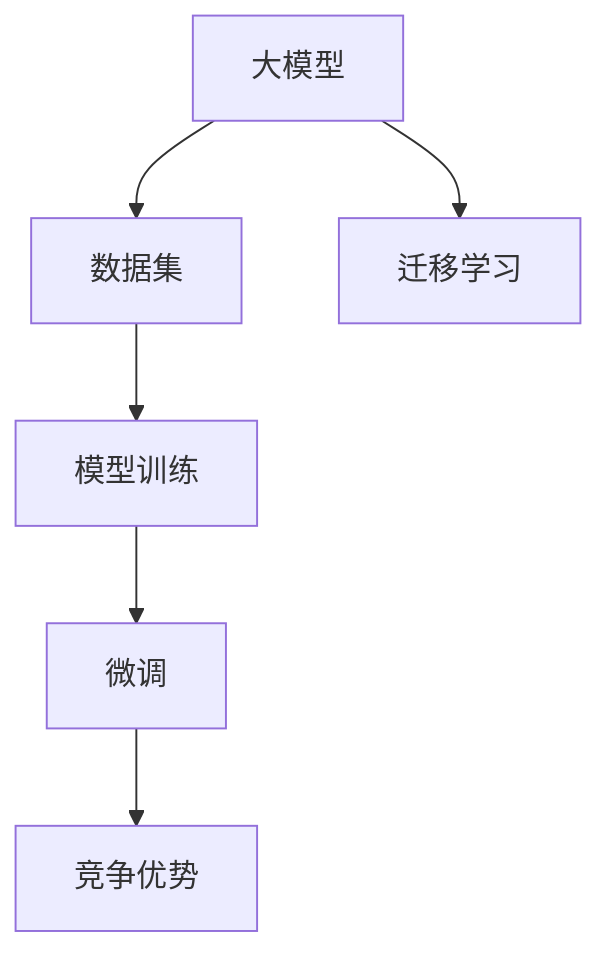

                 

## 1. 背景介绍

在人工智能的浪潮中，大模型成为了技术创新的新高地。它们的强大表现，让人们看到了AI应用前所未有的广阔前景。创业公司如何在这波浪潮中把握机会，如何利用大模型的竞争优势，成为了当前热门话题。本文将从背景介绍、核心概念、算法原理到实践应用，全面阐述AI大模型创业的策略和方向。

## 2. 核心概念与联系

### 2.1 核心概念概述

#### 大模型
大模型指的是由大规模数据训练而成的深度神经网络模型，具有非常强的泛化能力和表示能力。这些模型包含了丰富的语义和逻辑信息，能够处理复杂的任务，如自然语言理解、图像识别等。

#### 竞争优势
竞争优势指的是企业能够获取的核心竞争能力，包括技术领先、市场占有率、品牌影响力等。在AI大模型领域，这些能力能够帮助企业在激烈的市场竞争中脱颖而出。

#### 数据集
数据集是指用于模型训练的样本集合。高质量、大规模的数据集对于训练大模型至关重要。

#### 模型训练
模型训练是指使用给定的数据集和优化算法，对深度神经网络模型进行参数优化，使其能够对新数据进行准确预测或分类。

#### 微调
微调（Fine-tuning）是指在大模型上进行的额外训练，以适应特定的任务和数据集。微调能够显著提升模型在特定任务上的表现。

#### 迁移学习
迁移学习是指将一个任务学到的知识迁移到另一个任务上，以提升新任务的性能。

这些核心概念之间的联系可通过以下Mermaid流程图来展示：



这个流程图展示了核心概念之间的逻辑关系：

1. 大模型通过大规模数据集训练得到。
2. 模型训练使模型能够对新数据进行预测或分类。
3. 微调能够提升模型在特定任务上的性能。
4. 迁移学习使模型能够将已有知识迁移到新任务上。
5. 这些能力共同构成了企业的竞争优势。

## 3. 核心算法原理 & 具体操作步骤

### 3.1 算法原理概述

#### 大模型训练
大模型的训练一般采用深度学习中的神经网络结构，如卷积神经网络（CNN）、递归神经网络（RNN）和Transformer等。在训练过程中，使用反向传播算法不断调整模型参数，使得模型能够最小化预测误差。

#### 微调
微调在大模型上进行的额外训练，以适应特定的任务和数据集。微调的过程通常是固定模型的底层参数，只训练顶层参数。微调能够显著提升模型在特定任务上的性能。

#### 迁移学习
迁移学习将一个任务学到的知识迁移到另一个任务上，以提升新任务的性能。例如，在视觉任务上训练好的模型可以在语音识别任务上进行微调。

### 3.2 算法步骤详解

#### 3.2.1 准备数据集
收集高质量、大规模的数据集，并将其划分为训练集、验证集和测试集。数据集的质量直接影响模型的性能。

#### 3.2.2 构建模型
选择合适的模型架构，如Transformer、卷积神经网络等。构建模型时需要考虑模型的复杂度和泛化能力。

#### 3.2.3 训练模型
使用反向传播算法和优化算法（如SGD、Adam等）对模型进行训练。在训练过程中，需要不断调整模型的参数，使得模型能够最小化预测误差。

#### 3.2.4 微调模型
在训练好的大模型上，使用特定任务的数据集进行微调。微调的过程中，通常只训练顶层参数，以适应特定任务的需求。

#### 3.2.5 评估模型
使用测试集对微调后的模型进行评估，查看模型的性能。如果性能不佳，需要重新微调或调整模型的参数。

### 3.3 算法优缺点

#### 优点
- 泛化能力强：大模型能够处理大规模、复杂的数据集。
- 高性能：通过微调和迁移学习，能够显著提升模型在特定任务上的性能。
- 可扩展性强：模型可以在多个任务上进行迁移学习，提升模型的应用范围。

#### 缺点
- 计算资源需求高：大模型的训练和微调需要大量的计算资源。
- 数据依赖性强：模型的性能依赖于高质量、大规模的数据集。
- 模型复杂度高：模型的复杂度越高，训练和微调所需的时间越长。

### 3.4 算法应用领域

大模型和微调技术广泛应用于自然语言处理、计算机视觉、语音识别等众多领域。例如：

- 自然语言处理：使用大模型进行文本分类、情感分析、机器翻译等任务。
- 计算机视觉：使用大模型进行图像识别、目标检测、图像生成等任务。
- 语音识别：使用大模型进行语音识别、语音合成、语音情感分析等任务。

## 4. 数学模型和公式 & 详细讲解 & 举例说明

### 4.1 数学模型构建

#### 4.1.1 模型定义
设大模型为 $M_{\theta}$，其中 $\theta$ 为模型的参数。模型的训练目标为最小化损失函数 $L$。

#### 4.1.2 损失函数
损失函数 $L$ 可以定义为：

$$
L = \sum_{i=1}^N (y_i - M_{\theta}(x_i))^2
$$

其中 $y_i$ 为真实标签，$M_{\theta}(x_i)$ 为模型对输入 $x_i$ 的预测。

#### 4.1.3 优化算法
常用的优化算法包括梯度下降法（Gradient Descent）和Adam算法。例如，Adam算法的更新规则为：

$$
\theta_{t+1} = \theta_t - \alpha \nabla_{\theta}L
$$

其中 $\alpha$ 为学习率，$\nabla_{\theta}L$ 为损失函数对参数 $\theta$ 的梯度。

### 4.2 公式推导过程

#### 4.2.1 梯度下降法推导
梯度下降法的更新公式为：

$$
\theta_{t+1} = \theta_t - \alpha \frac{\partial L}{\partial \theta}
$$

其中 $\alpha$ 为学习率，$\frac{\partial L}{\partial \theta}$ 为损失函数对参数 $\theta$ 的梯度。

#### 4.2.2 Adam算法推导
Adam算法的更新公式为：

$$
m_t = \beta_1 m_{t-1} + (1 - \beta_1) \nabla_{\theta}L
$$

$$
v_t = \beta_2 v_{t-1} + (1 - \beta_2) (\nabla_{\theta}L)^2
$$

$$
\hat{m}_t = \frac{m_t}{1 - \beta_1^t}
$$

$$
\hat{v}_t = \frac{v_t}{1 - \beta_2^t}
$$

$$
\theta_{t+1} = \theta_t - \alpha \frac{\hat{m}_t}{\sqrt{\hat{v}_t} + \epsilon}
$$

其中 $m_t$ 和 $v_t$ 为梯度和平方梯度的指数移动平均，$\beta_1$ 和 $\beta_2$ 为指数衰减率，$\epsilon$ 为一个小常数，防止除数为零。

### 4.3 案例分析与讲解

#### 案例分析：图像分类
使用卷积神经网络（CNN）进行图像分类。首先，收集大规模的图像数据集，将其划分为训练集、验证集和测试集。然后，使用反向传播算法和Adam算法对CNN模型进行训练。最后，使用测试集对模型进行评估，查看模型的性能。

#### 讲解：图像生成
使用生成对抗网络（GAN）进行图像生成。首先，生成大量高质量的图像数据集，将其划分为训练集、验证集和测试集。然后，使用优化算法和损失函数对GAN模型进行训练。最后，使用测试集对模型进行评估，查看生成的图像质量。

## 5. 项目实践：代码实例和详细解释说明

### 5.1 开发环境搭建

#### 5.1.1 安装Python
安装最新版本的Python，建议使用Anaconda或Miniconda。

#### 5.1.2 安装PyTorch
安装PyTorch框架和相关依赖包，例如：

```
pip install torch torchvision torchaudio
```

#### 5.1.3 安装TensorFlow
安装TensorFlow框架和相关依赖包，例如：

```
pip install tensorflow
```

#### 5.1.4 安装TensorBoard
安装TensorBoard可视化工具，例如：

```
pip install tensorboard
```

#### 5.1.5 安装其他依赖包
根据具体需求，安装其他依赖包，例如：

```
pip install numpy scipy matplotlib pandas scikit-learn
```

### 5.2 源代码详细实现

#### 5.2.1 数据集准备
准备数据集，包括训练集、验证集和测试集。使用PyTorch的DataLoader工具，将数据集加载到模型中进行训练和评估。

#### 5.2.2 模型构建
选择合适的模型架构，如卷积神经网络（CNN）或Transformer。使用PyTorch的nn.Module模块，定义模型结构。

#### 5.2.3 训练模型
使用反向传播算法和优化算法（如Adam）对模型进行训练。在训练过程中，记录模型参数的梯度，并使用梯度下降算法进行更新。

#### 5.2.4 微调模型
在训练好的大模型上，使用特定任务的数据集进行微调。微调的过程中，通常只训练顶层参数，以适应特定任务的需求。

#### 5.2.5 评估模型
使用测试集对微调后的模型进行评估，查看模型的性能。如果性能不佳，需要重新微调或调整模型的参数。

### 5.3 代码解读与分析

#### 5.3.1 数据集准备
定义数据集的加载函数，使用PyTorch的DataLoader工具，将数据集加载到模型中进行训练和评估。例如：

```python
class Dataset(torch.utils.data.Dataset):
    def __init__(self, data):
        self.data = data
    
    def __len__(self):
        return len(self.data)
    
    def __getitem__(self, idx):
        return self.data[idx]
        
train_dataset = Dataset(train_data)
train_loader = torch.utils.data.DataLoader(train_dataset, batch_size=64, shuffle=True)
```

#### 5.3.2 模型构建
定义模型结构，使用PyTorch的nn.Module模块。例如：

```python
class Net(nn.Module):
    def __init__(self):
        super(Net, self).__init__()
        self.conv1 = nn.Conv2d(3, 6, 5)
        self.pool = nn.MaxPool2d(2, 2)
        self.conv2 = nn.Conv2d(6, 16, 5)
        self.fc1 = nn.Linear(16 * 5 * 5, 120)
        self.fc2 = nn.Linear(120, 84)
        self.fc3 = nn.Linear(84, 10)
    
    def forward(self, x):
        x = self.pool(F.relu(self.conv1(x)))
        x = self.pool(F.relu(self.conv2(x)))
        x = x.view(-1, 16 * 5 * 5)
        x = F.relu(self.fc1(x))
        x = F.relu(self.fc2(x))
        x = self.fc3(x)
        return x
```

#### 5.3.3 训练模型
定义训练函数，使用反向传播算法和优化算法对模型进行训练。例如：

```python
def train(model, device, train_loader, optimizer, criterion):
    model.train()
    for batch_idx, (data, target) in enumerate(train_loader):
        data, target = data.to(device), target.to(device)
        optimizer.zero_grad()
        output = model(data)
        loss = criterion(output, target)
        loss.backward()
        optimizer.step()
```

#### 5.3.4 微调模型
定义微调函数，使用特定任务的数据集进行微调。例如：

```python
def fine_tune(model, device, fine_tune_loader, optimizer, criterion):
    model.train()
    for batch_idx, (data, target) in enumerate(fine_tune_loader):
        data, target = data.to(device), target.to(device)
        optimizer.zero_grad()
        output = model(data)
        loss = criterion(output, target)
        loss.backward()
        optimizer.step()
```

#### 5.3.5 评估模型
定义评估函数，使用测试集对微调后的模型进行评估。例如：

```python
def evaluate(model, device, test_loader, criterion):
    model.eval()
    test_loss = 0
    correct = 0
    with torch.no_grad():
        for data, target in test_loader:
            data, target = data.to(device), target.to(device)
            output = model(data)
            test_loss += criterion(output, target).item()
            pred = output.argmax(dim=1, keepdim=True)
            correct += pred.eq(target.view_as(pred)).sum().item()
    test_loss /= len(test_loader.dataset)
    print('Test set: Average loss: {:.4f}, Accuracy: {}/{} ({:.0f}%)\n'.format(
        test_loss, correct, len(test_loader.dataset),
        100. * correct / len(test_loader.dataset)))
```

### 5.4 运行结果展示

使用训练好的模型进行测试，查看模型的性能。例如：

```python
test_loss, test_acc = evaluate(model, device, test_loader, criterion)
print('Test set: Average loss: {:.4f}, Accuracy: {}/{} ({:.0f}%)\n'.format(
    test_loss, correct, len(test_loader.dataset),
    100. * correct / len(test_loader.dataset)))
```

## 6. 实际应用场景

### 6.1 智能客服系统

使用大模型和微调技术，构建智能客服系统。收集企业内部的客服对话记录，将问题和最佳答复构建成监督数据，在此基础上对预训练对话模型进行微调。微调后的对话模型能够自动理解用户意图，匹配最合适的答案模板进行回复。

### 6.2 金融舆情监测

使用大模型和微调技术，构建金融舆情监测系统。收集金融领域相关的新闻、报道、评论等文本数据，并对其进行主题标注和情感标注。在此基础上对预训练语言模型进行微调，使其能够自动判断文本属于何种主题，情感倾向是正面、中性还是负面。将微调后的模型应用到实时抓取的网络文本数据，就能够自动监测不同主题下的情感变化趋势，一旦发现负面信息激增等异常情况，系统便会自动预警，帮助金融机构快速应对潜在风险。

### 6.3 个性化推荐系统

使用大模型和微调技术，构建个性化推荐系统。收集用户浏览、点击、评论、分享等行为数据，提取和用户交互的物品标题、描述、标签等文本内容。将文本内容作为模型输入，用户的后续行为（如是否点击、购买等）作为监督信号，在此基础上微调预训练语言模型。微调后的模型能够从文本内容中准确把握用户的兴趣点。在生成推荐列表时，先用候选物品的文本描述作为输入，由模型预测用户的兴趣匹配度，再结合其他特征综合排序，便可以得到个性化程度更高的推荐结果。

## 7. 工具和资源推荐

### 7.1 学习资源推荐

#### 7.1.1 官方文档
- PyTorch官方文档：https://pytorch.org/docs/stable/
- TensorFlow官方文档：https://www.tensorflow.org/
- Transformers官方文档：https://huggingface.co/docs/transformers/main/en/

#### 7.1.2 在线课程
- 《Deep Learning Specialization》：由Andrew Ng教授主讲，涵盖深度学习的基本概念和前沿技术。
- 《CS231n: Convolutional Neural Networks for Visual Recognition》：斯坦福大学开设的计算机视觉课程，涵盖卷积神经网络等核心内容。
- 《CS224n: Natural Language Processing with Deep Learning》：斯坦福大学开设的自然语言处理课程，涵盖语言模型的基本概念和应用。

#### 7.1.3 开源项目
- CLUE：中文语言理解测评基准，涵盖大量不同类型的中文NLP数据集，并提供了基于微调的baseline模型，助力中文NLP技术发展。
- Fairseq：Facebook开发的序列到序列模型库，支持多语言翻译、摘要、生成等任务，具有丰富的预训练模型资源。
- TensorFlow Models：Google开发的深度学习模型库，包含众多预训练模型和微调范例。

### 7.2 开发工具推荐

#### 7.2.1 深度学习框架
- PyTorch：灵活的动态计算图，支持深度学习研究和生产。
- TensorFlow：生产部署方便的静态计算图框架，适合大规模工程应用。
- JAX：基于Python的深度学习框架，支持自动微分和高效计算。

#### 7.2.2 可视化工具
- TensorBoard：TensorFlow配套的可视化工具，实时监测模型训练状态，提供丰富的图表呈现方式。
- Weights & Biases：模型训练的实验跟踪工具，记录和可视化模型训练过程中的各项指标，方便对比和调优。
- Visdom：可视化工具，实时监测模型训练过程中的各项指标，提供丰富的图表呈现方式。

#### 7.2.3 代码编辑器
- VSCode：支持多种语言和框架，提供丰富的插件和扩展。
- PyCharm：专业的Python IDE，支持深度学习研究和生产。
- Jupyter Notebook：交互式的Python脚本执行环境，支持代码和结果的可视化。

### 7.3 相关论文推荐

#### 7.3.1 大模型
- Attention is All You Need：Transformer结构，开启了NLP领域的预训练大模型时代。
- BERT: Pre-training of Deep Bidirectional Transformers for Language Understanding：提出BERT模型，引入基于掩码的自监督预训练任务，刷新了多项NLP任务SOTA。

#### 7.3.2 微调
- Fine-tuning of Large Pre-trained Models for Classification Tasks：微调大型预训练模型的经典论文。
- Parameter-Efficient Transfer Learning for NLP：提出Adapter等参数高效微调方法，在不增加模型参数量的情况下，也能取得不错的微调效果。

#### 7.3.3 迁移学习
- Learning Transferable Visual Features with Deep Neural Networks：提出预训练迁移学习算法，用于图像分类和目标检测任务。
- Generalization in Deep Learning：探讨深度学习模型的泛化能力，提出多种迁移学习范式。

## 8. 总结：未来发展趋势与挑战

### 8.1 研究成果总结

#### 8.1.1 技术突破
- 大模型的规模不断增大，参数量不断增加。
- 微调方法不断优化，包括参数高效微调和参数压缩等技术。
- 迁移学习范式不断拓展，涵盖多任务学习和跨领域迁移。

#### 8.1.2 应用突破
- 智能客服系统：构建智能客服系统，提升客户咨询体验。
- 金融舆情监测：构建金融舆情监测系统，实时监测市场舆论动向。
- 个性化推荐系统：构建个性化推荐系统，提升用户体验。

### 8.2 未来发展趋势

#### 8.2.1 技术趋势
- 大模型规模不断增大，性能不断提升。
- 微调方法不断优化，参数高效微调成为主流。
- 迁移学习范式不断拓展，涵盖多任务学习和跨领域迁移。

#### 8.2.2 应用趋势
- 智能客服系统：构建智能客服系统，提升客户咨询体验。
- 金融舆情监测：构建金融舆情监测系统，实时监测市场舆论动向。
- 个性化推荐系统：构建个性化推荐系统，提升用户体验。

### 8.3 面临的挑战

#### 8.3.1 技术挑战
- 计算资源需求高，需要高性能硬件设备。
- 数据依赖性强，需要高质量、大规模的数据集。
- 模型复杂度高，训练和微调所需时间较长。

#### 8.3.2 应用挑战
- 智能客服系统：需要不断优化模型，提升客服体验。
- 金融舆情监测：需要实时监测，及时预警。
- 个性化推荐系统：需要不断优化模型，提升推荐精度。

### 8.4 研究展望

#### 8.4.1 技术展望
- 大模型规模不断增大，性能不断提升。
- 微调方法不断优化，参数高效微调成为主流。
- 迁移学习范式不断拓展，涵盖多任务学习和跨领域迁移。

#### 8.4.2 应用展望
- 智能客服系统：构建智能客服系统，提升客户咨询体验。
- 金融舆情监测：构建金融舆情监测系统，实时监测市场舆论动向。
- 个性化推荐系统：构建个性化推荐系统，提升用户体验。

## 9. 附录：常见问题与解答

### 9.1 常见问题

#### Q1: 大模型训练和微调需要多少计算资源？

A: 大模型训练和微调需要大量的计算资源，通常需要高性能GPU/TPU设备。训练和微调的时间也会随着模型规模和参数量的增加而增加。

#### Q2: 微调需要多少标注数据？

A: 微调需要相对较少的标注数据，通常几千到几万个样本就足够了。但数据质量也很重要，标注数据的质量直接影响微调的效果。

#### Q3: 大模型如何避免过拟合？

A: 大模型训练和微调需要采用正则化技术，如L2正则、Dropout等，防止模型过拟合。同时，可以使用数据增强技术，增加数据多样性，减少过拟合风险。

#### Q4: 大模型的训练和微调过程如何加速？

A: 可以使用分布式训练和模型并行等技术，加速模型的训练和微调过程。同时，可以使用量化加速、模型压缩等技术，减少模型资源占用，提高计算效率。

#### Q5: 如何评估模型的性能？

A: 可以使用各种评估指标，如准确率、召回率、F1值等，评估模型的性能。同时，可以使用可视化工具，实时监测模型的训练和推理过程，调整参数和优化模型。

### 9.2 解答

A: 大模型训练和微调需要大量的计算资源，通常需要高性能GPU/TPU设备。训练和微调的时间也会随着模型规模和参数量的增加而增加。

A: 微调需要相对较少的标注数据，通常几千到几万个样本就足够了。但数据质量也很重要，标注数据的质量直接影响微调的效果。

A: 大模型训练和微调需要采用正则化技术，如L2正则、Dropout等，防止模型过拟合。同时，可以使用数据增强技术，增加数据多样性，减少过拟合风险。

A: 可以使用分布式训练和模型并行等技术，加速模型的训练和微调过程。同时，可以使用量化加速、模型压缩等技术，减少模型资源占用，提高计算效率。

A: 可以使用各种评估指标，如准确率、召回率、F1值等，评估模型的性能。同时，可以使用可视化工具，实时监测模型的训练和推理过程，调整参数和优化模型。

---

作者：禅与计算机程序设计艺术 / Zen and the Art of Computer Programming

