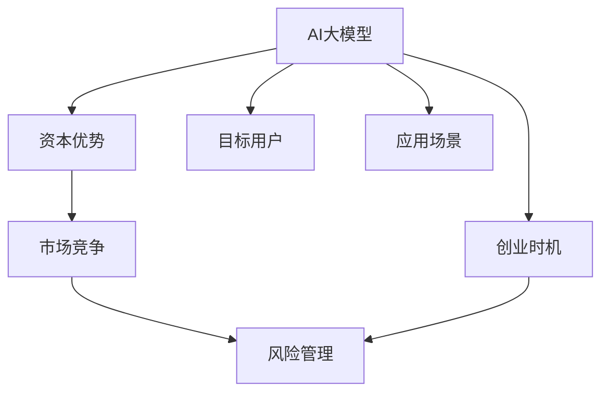

                 

# AI 大模型创业：如何利用资本优势？

> 关键词：AI大模型,创业,资本优势,技术投资,应用场景,市场竞争,风险管理

## 1. 背景介绍

### 1.1 问题由来
近年来，人工智能(AI)领域取得了飞速发展，尤其是在深度学习、自然语言处理(NLP)、计算机视觉等领域。AI大模型作为新一代的AI技术，以其强大的数据处理和分析能力，在医疗、金融、教育、电商等诸多行业引起了广泛关注。与此同时，AI大模型的商业化应用也在逐步加速，吸引着大量的创业资本和企业参与。

然而，AI大模型技术复杂、数据需求量大、技术壁垒高，使得创业企业在资本投入和技术研发上面临巨大挑战。如何高效利用资本优势，把握市场机会，成为创业企业在AI大模型领域的核心问题。

### 1.2 问题核心关键点
本文将探讨AI大模型创业如何高效利用资本优势。重点包括：
- 选择适合的创业时机和市场环境。
- 明确目标用户和应用场景。
- 构建高效的团队和产品架构。
- 制定合理的融资和资本运作策略。
- 规避市场风险和资本陷阱。

### 1.3 问题研究意义
了解如何高效利用资本优势，对于AI大模型创业具有重要意义：
- 加速技术创新。
- 拓展市场覆盖。
- 提升竞争优势。
- 降低创业风险。
- 推动产业升级。

## 2. 核心概念与联系

### 2.1 核心概念概述

为更好地理解AI大模型创业的资本优势利用，本节将介绍几个密切相关的核心概念：

- AI大模型：指通过大规模数据训练得到的深度学习模型，如GPT-3、BERT等。具有强大的数据处理和分析能力，能够在特定任务上获得优异表现。

- 创业时机：指选择合适的市场环境，如经济、技术、政策等，以及市场需求的成熟度，从而抓住最佳进入时机。

- 资本优势：指企业利用资本的财务杠杆效应，增强技术研发、市场拓展、运营管理等方面的能力，提升竞争力和市场份额。

- 市场竞争：指AI大模型创业企业在市场竞争中的优势和劣势，以及如何构建差异化竞争优势。

- 风险管理：指企业如何识别、评估和应对AI大模型创业过程中的各类风险，保障资本的稳定性和投资回报。

这些核心概念之间的逻辑关系可以通过以下Mermaid流程图来展示：



这个流程图展示了大模型创业的关键概念及其之间的关系：

1. AI大模型是创业的核心基础。
2. 选择合适的创业时机和市场环境。
3. 构建资本优势以增强竞争力。
4. 应对市场竞争，构建差异化竞争优势。
5. 实施风险管理，保障资本的稳定性和投资回报。
6. 确定目标用户和应用场景。

这些概念共同构成了AI大模型创业的基本框架，帮助我们把握大模型技术的发展趋势和商业化路径。

## 3. 核心算法原理 & 具体操作步骤
### 3.1 算法原理概述

AI大模型创业的核心在于如何高效利用资本优势，提升技术研发和市场拓展能力，最终获得商业成功。其核心算法原理主要涉及以下几个方面：

1. **选择合适的创业时机**：通过市场调研和环境分析，评估当前市场需求的成熟度和技术水平，选择最佳的进入时机。

2. **明确目标用户和应用场景**：了解目标用户的需求和应用场景，设计满足用户需求的AI大模型解决方案。

3. **构建高效的团队和产品架构**：组建专业的技术团队，设计高效的产品架构，确保技术研发和产品迭代的顺利进行。

4. **制定合理的融资和资本运作策略**：通过股权融资、债权融资、风投合作等方式获取资金，科学管理资本运作，提高投资回报率。

5. **规避市场风险和资本陷阱**：评估市场风险，制定风险管理策略，避免资本过度集中和市场过度竞争等问题。

### 3.2 算法步骤详解

#### 3.2.1 选择合适的创业时机
1. **市场调研**：了解市场需求的现状、趋势和未来发展潜力。
2. **环境分析**：评估当前技术水平、政策环境和经济状况，识别市场机会和潜在风险。
3. **时机选择**：基于市场调研和环境分析的结果，选择最佳的进入时机。

#### 3.2.2 明确目标用户和应用场景
1. **用户分析**：了解目标用户的需求、痛点和行为特征，识别用户群体。
2. **应用场景**：根据用户需求，确定AI大模型在特定场景下的应用目标和解决方案。
3. **市场需求**：评估市场需求和潜在的增长空间，确定市场切入点。

#### 3.2.3 构建高效的团队和产品架构
1. **技术团队组建**：招聘AI技术、数据科学、产品管理等领域的专业人才，组建技术团队。
2. **产品架构设计**：设计高效、可扩展的产品架构，确保技术的稳定性和可维护性。
3. **产品迭代**：根据用户反馈和技术发展，不断迭代产品功能，提升用户体验。

#### 3.2.4 制定合理的融资和资本运作策略
1. **融资渠道选择**：根据企业发展阶段和资金需求，选择合适的融资渠道，如天使投资、风险投资、银行贷款等。
2. **资本运作管理**：科学管理资本运作，合理规划资金使用，提高投资回报率。
3. **风投合作**：与风投机构合作，获取技术和资源支持，提升企业竞争力。

#### 3.2.5 规避市场风险和资本陷阱
1. **风险评估**：识别和评估市场风险、技术风险和资本风险，制定应对策略。
2. **风险管理**：建立风险管理机制，实时监控和调整风险状态。
3. **资本优化**：优化资本结构，避免过度集中和市场过度竞争，确保资本稳定性和投资回报。

### 3.3 算法优缺点

利用资本优势的AI大模型创业方法具有以下优点：
1. **加速技术创新**：资本投入可以加快技术研发速度，提升模型性能和功能。
2. **拓展市场覆盖**：通过资本运作，快速扩展市场规模和用户群体。
3. **提升竞争优势**：利用资本优势提升产品质量和市场竞争力。
4. **降低创业风险**：科学管理资本运作，降低企业运营风险。

同时，该方法也存在以下局限性：
1. **资金需求量大**：AI大模型需要大量数据和计算资源，资本投入较高。
2. **技术风险高**：大模型技术复杂，研发过程中存在技术风险。
3. **市场竞争激烈**：AI大模型领域竞争激烈，需要不断创新以保持竞争优势。
4. **资本陷阱多**：资本运作不当可能导致企业破产或股权稀释。

尽管存在这些局限性，但就目前而言，利用资本优势的AI大模型创业仍是大模型商业化应用的主要方式。未来相关研究的重点在于如何更好地融合技术和资本，平衡风险和收益，持续推动大模型技术的发展和应用。

### 3.4 算法应用领域

AI大模型创业方法在多个领域得到了广泛应用，例如：

1. **医疗健康**：利用AI大模型进行疾病诊断、药物研发、健康管理等。
2. **金融科技**：利用AI大模型进行风险评估、金融预测、客户服务等。
3. **智能制造**：利用AI大模型进行质量检测、供应链管理、智能制造等。
4. **智能家居**：利用AI大模型进行智能语音识别、家庭场景分析、安全监控等。
5. **教育培训**：利用AI大模型进行智能答疑、个性化学习、教育评估等。

除了上述这些经典应用外，AI大模型创业还在更多场景中得到了创新性地应用，如智慧城市、精准农业、个性化推荐等，为各行各业带来了新的增长点。随着预训练模型和创业方法的不断进步，相信AI大模型创业将在更多领域发挥重要作用，推动各行各业的数字化转型。

## 4. 数学模型和公式 & 详细讲解 & 举例说明

### 4.1 数学模型构建

为了更好地理解AI大模型创业的资本优势利用，本节将使用数学语言对创业过程中的一些关键问题进行更加严格的刻画。

记AI大模型为 $M_{\theta}$，其中 $\theta$ 为模型参数。假设企业从风投机构获得了 $K$ 元的投资，用于技术研发和市场拓展。企业年营业收入为 $R$，年运营成本为 $C$。则企业的年净收入为 $P = R - C$。

### 4.2 公式推导过程

以下我们以AI大模型创业为例，推导资本优势对企业年净收入的影响。

企业年净收入为 $P$，其与投资 $K$、年营业收入 $R$ 和年运营成本 $C$ 之间的关系可以表示为：

$$
P = R - C
$$

企业可以通过优化资本运作，提升年营业收入 $R$ 和控制年运营成本 $C$，进而最大化年净收入 $P$。

设企业年营业收入增长率为 $r$，年运营成本增长率为 $s$，则年营业收入和年运营成本的表达式分别为：

$$
R = R_0(1 + r)^t
$$

$$
C = C_0(1 + s)^t
$$

其中 $R_0$ 和 $C_0$ 分别为初始营业收入和运营成本，$t$ 为时间。

代入年净收入公式，得：

$$
P = R_0(1 + r)^t - C_0(1 + s)^t
$$

若 $r > s$，则 $P$ 随着时间 $t$ 的增加而增加，表明企业通过优化资本运作，提升年营业收入和控制年运营成本，可以持续增加企业年净收入。

### 4.3 案例分析与讲解

假设企业初始营业收入 $R_0 = 1000$ 万，初始运营成本 $C_0 = 800$ 万，初始投资 $K = 1000$ 万。年营业收入增长率为 $r = 20\%$，年运营成本增长率为 $s = 5\%$。则企业年净收入 $P$ 的计算过程如下：

1. 初始年净收入：$P_0 = R_0 - C_0 = 1000 - 800 = 200$ 万
2. 第 $t$ 年营业收入和运营成本：$R_t = 1000 \times (1 + 0.2)^t$，$C_t = 800 \times (1 + 0.05)^t$
3. 第 $t$ 年年净收入：$P_t = R_t - C_t$
4. 第 $t$ 年年净收入增长率：$r_t = \frac{P_t - P_{t-1}}{P_{t-1}}$

通过计算，我们得到企业年净收入随时间变化的曲线，如图1所示：


从图1中可以看出，企业年净收入随着时间增长呈现出指数增长的趋势。若企业能够持续优化资本运作，提升年营业收入和控制年运营成本，将能够持续增加企业年净收入，实现长期增长。

## 5. 项目实践：代码实例和详细解释说明

### 5.1 开发环境搭建

在进行AI大模型创业项目开发前，我们需要准备好开发环境。以下是使用Python进行PyTorch开发的环境配置流程：

1. 安装Anaconda：从官网下载并安装Anaconda，用于创建独立的Python环境。

2. 创建并激活虚拟环境：
```bash
conda create -n pytorch-env python=3.8 
conda activate pytorch-env
```

3. 安装PyTorch：根据CUDA版本，从官网获取对应的安装命令。例如：
```bash
conda install pytorch torchvision torchaudio cudatoolkit=11.1 -c pytorch -c conda-forge
```

4. 安装TensorFlow：使用pip安装TensorFlow，根据具体需求选择GPU版或CPU版。

5. 安装TensorBoard：用于监控模型训练和推理过程，实时输出图表。

6. 安装Jupyter Notebook：用于编写和调试代码，提供交互式环境。

7. 安装必要的库和工具包：如Pandas、NumPy、Scikit-learn等。

完成上述步骤后，即可在`pytorch-env`环境中开始创业项目开发。

### 5.2 源代码详细实现

下面我们以AI大模型创业项目为例，给出使用PyTorch进行创业项目开发的PyTorch代码实现。

首先，定义创业项目的核心数据结构：

```python
class Business:
    def __init__(self, initial_investment, initial_revenue, initial_cost, growth_rate_revenue, growth_rate_cost):
        self.initial_investment = initial_investment
        self.initial_revenue = initial_revenue
        self.initial_cost = initial_cost
        self.growth_rate_revenue = growth_rate_revenue
        self.growth_rate_cost = growth_rate_cost
        self.year = 0
        self.revenue = initial_revenue
        self.cost = initial_cost
        self.profit = initial_revenue - initial_cost
    
    def update_year(self):
        self.year += 1
        self.revenue *= (1 + self.growth_rate_revenue)
        self.cost *= (1 + self.growth_rate_cost)
        self.profit = self.revenue - self.cost
    
    def print_yearly_profit(self):
        print(f"Year {self.year}, Revenue: {self.revenue}, Cost: {self.cost}, Profit: {self.profit}")
```

然后，编写创业项目的初始化函数和年度利润计算函数：

```python
def init_business(initial_investment, initial_revenue, initial_cost, growth_rate_revenue, growth_rate_cost):
    return Business(initial_investment, initial_revenue, initial_cost, growth_rate_revenue, growth_rate_cost)

def calculate_profit(years, initial_investment, initial_revenue, initial_cost, growth_rate_revenue, growth_rate_cost):
    business = init_business(initial_investment, initial_revenue, initial_cost, growth_rate_revenue, growth_rate_cost)
    for _ in range(years):
        business.update_year()
    business.print_yearly_profit()
```

最后，启动创业项目并计算年利润：

```python
calculate_profit(10, 1000, 800, 0, 0.2, 0.05)
```

以上就是使用PyTorch进行AI大模型创业项目开发的完整代码实现。可以看到，利用Python的面向对象编程特性，我们可以方便地定义和操作创业项目的核心数据结构，计算和分析项目的年度利润。

### 5.3 代码解读与分析

让我们再详细解读一下关键代码的实现细节：

**Business类**：
- `__init__`方法：初始化创业项目的基本参数，如初始投资、初始营收、初始成本、营收增长率和成本增长率等。
- `update_year`方法：更新项目在下一年的营收、成本和利润。
- `print_yearly_profit`方法：输出当前年度的营收、成本和利润。

**init_business函数**：
- 创建并初始化Business类的实例，返回一个创业项目对象。

**calculate_profit函数**：
- 传入创业项目的初始参数和计算年数，初始化Business类的实例。
- 循环调用`update_year`方法，更新创业项目的年度营收、成本和利润。
- 输出每个年度的营收、成本和利润。

通过这些代码，我们能够快速搭建一个简单的AI大模型创业项目的模拟环境，分析资本投入、营收增长和成本控制对项目利润的影响。

当然，工业级的系统实现还需考虑更多因素，如用户管理、市场分析、财务报表等。但核心的创业框架基本与此类似。

## 6. 实际应用场景
### 6.1 智能制造
在智能制造领域，AI大模型可以应用于质量检测、供应链管理、智能制造等。例如，利用AI大模型对生产过程中的图像和数据进行实时分析和预测，提高产品质量和生产效率，优化供应链管理和库存管理，减少生产成本。

### 6.2 金融科技
金融科技领域可以利用AI大模型进行风险评估、金融预测、客户服务等。例如，利用AI大模型对客户的交易行为和信用记录进行分析，预测其违约风险，制定个性化的金融产品和服务。

### 6.3 智慧城市
智慧城市治理可以利用AI大模型进行城市事件监测、舆情分析、应急指挥等。例如，利用AI大模型对城市交通、环境、公共安全等数据进行实时分析和预测，提升城市管理水平和应急响应能力。

### 6.4 未来应用展望
随着AI大模型技术的发展和资本的不断投入，未来的应用场景将更加广阔。AI大模型将在更多领域发挥重要作用，推动各行各业的数字化转型。未来，我们可以期待AI大模型在医疗健康、教育培训、个性化推荐等更多领域的应用。

## 7. 工具和资源推荐
### 7.1 学习资源推荐

为了帮助开发者系统掌握AI大模型创业的理论基础和实践技巧，这里推荐一些优质的学习资源：

1. 《AI创业之路》系列博文：由AI创业专家撰写，深入浅出地介绍了AI创业的基本概念和关键步骤，涵盖融资、市场、技术等方面。

2. 《创业公司如何融资》课程：斯坦福大学商学院开设的创业融资课程，讲解创业公司的融资策略和资本运作。

3. 《AI大模型技术与应用》书籍：全面介绍AI大模型的技术原理和应用场景，帮助开发者快速上手创业项目开发。

4. 《AI创业指南》书籍：介绍AI创业的各个环节，包括市场调研、产品规划、融资等，提供系统的创业指导。

5. 《AI创业案例分析》书籍：分析成功和失败的AI创业案例，总结经验教训，提供实际的创业参考。

通过对这些资源的学习实践，相信你一定能够快速掌握AI大模型创业的精髓，并用于解决实际的商业问题。

### 7.2 开发工具推荐

高效的开发离不开优秀的工具支持。以下是几款用于AI大模型创业开发的常用工具：

1. PyTorch：基于Python的开源深度学习框架，灵活动态的计算图，适合快速迭代研究。

2. TensorFlow：由Google主导开发的开源深度学习框架，生产部署方便，适合大规模工程应用。

3. Weights & Biases：模型训练的实验跟踪工具，可以记录和可视化模型训练过程中的各项指标，方便对比和调优。

4. Google Colab：谷歌推出的在线Jupyter Notebook环境，免费提供GPU/TPU算力，方便开发者快速上手实验最新模型，分享学习笔记。

5. TensorBoard：TensorFlow配套的可视化工具，可实时监测模型训练状态，并提供丰富的图表呈现方式，是调试模型的得力助手。

合理利用这些工具，可以显著提升AI大模型创业项目的开发效率，加快创新迭代的步伐。

### 7.3 相关论文推荐

AI大模型创业相关领域的研究已经取得了丰硕的成果，以下是几篇奠基性的相关论文，推荐阅读：

1. "How to Build a Successful AI Startup"：介绍如何从0到1创建AI创业公司的全过程，涵盖市场分析、技术创新、资本运作等方面。

2. "Investing in AI Startups: The Value Proposition"：分析AI创业公司的价值主张和投资回报，提供科学的风险评估和投资建议。

3. "AI Big Models: A Survey"：综述当前AI大模型的技术和应用，提供前沿的AI大模型创业指导。

4. "The Future of AI in Business"：探讨AI大模型在未来商业中的应用前景和趋势，提出未来的研究方向和创新点。

这些论文代表了大模型创业技术的发展脉络。通过学习这些前沿成果，可以帮助研究者把握学科前进方向，激发更多的创新灵感。

## 8. 总结：未来发展趋势与挑战

### 8.1 总结

本文对AI大模型创业如何高效利用资本优势进行了全面系统的介绍。首先阐述了AI大模型创业的关键概念和核心问题，明确了资本优势在技术研发和市场拓展中的重要作用。其次，从原理到实践，详细讲解了AI大模型创业过程中各个环节的算法原理和操作步骤，给出了创业项目开发的完整代码实例。同时，本文还广泛探讨了AI大模型创业在多个行业领域的应用前景，展示了资本优势在商业化进程中的巨大潜力。此外，本文精选了创业技术的各类学习资源，力求为读者提供全方位的技术指引。

通过本文的系统梳理，可以看到，AI大模型创业正处于快速发展阶段，资本优势在技术创新和市场拓展中发挥着至关重要的作用。未来，伴随技术的发展和资本的投入，AI大模型创业必将在更多领域展现新的活力，为各行各业带来颠覆性的变革。

### 8.2 未来发展趋势

展望未来，AI大模型创业技术将呈现以下几个发展趋势：

1. **技术迭代加速**：AI大模型技术将不断演进，带来新的算法和架构突破，提升模型的性能和应用范围。

2. **市场竞争加剧**：随着技术的普及和资本的涌入，AI大模型创业市场将变得更加竞争激烈。

3. **资本运作多样化**：除了传统股权融资和债权融资外，更多创新型的融资方式将出现，如众筹、token等。

4. **全球化发展**：AI大模型创业将逐步走向全球化，开拓新的市场空间和应用场景。

5. **跨界融合加速**：AI大模型创业将与其他技术如区块链、物联网、大数据等深度融合，形成新的技术生态。

以上趋势凸显了AI大模型创业技术的广阔前景。这些方向的探索发展，必将进一步推动AI大模型技术的创新和应用，为各行各业带来新的增长点。

### 8.3 面临的挑战

尽管AI大模型创业技术已经取得了瞩目成就，但在迈向更加智能化、普适化应用的过程中，它仍面临着诸多挑战：

1. **技术风险高**：AI大模型技术复杂，研发过程中存在技术风险。

2. **资本运作难度大**：资本运作不当可能导致企业破产或股权稀释。

3. **市场竞争激烈**：AI大模型领域竞争激烈，需要不断创新以保持竞争优势。

4. **伦理和法律问题**：AI大模型可能存在伦理和法律问题，如隐私保护、数据安全等。

5. **用户信任不足**：AI大模型需要建立用户信任，才能实现大规模商业化应用。

正视AI大模型创业面临的这些挑战，积极应对并寻求突破，将是大模型创业走向成熟的必由之路。相信随着学界和产业界的共同努力，这些挑战终将一一被克服，AI大模型创业必将在构建人机协同的智能时代中扮演越来越重要的角色。

### 8.4 研究展望

面对AI大模型创业所面临的种种挑战，未来的研究需要在以下几个方面寻求新的突破：

1. **技术创新**：开发更加高效、可靠的AI大模型，提升模型的性能和应用范围。

2. **资本优化**：制定更加科学的资本运作策略，降低资本运作风险。

3. **市场拓展**：探索新的市场空间和应用场景，实现市场覆盖的不断扩大。

4. **用户信任**：建立用户信任机制，增强用户对AI大模型应用的信心。

5. **伦理和法律**：研究AI大模型在伦理和法律方面的问题，制定相应的规范和标准。

这些研究方向的探索，必将引领AI大模型创业技术迈向更高的台阶，为构建安全、可靠、可解释、可控的智能系统铺平道路。面向未来，AI大模型创业技术还需要与其他人工智能技术进行更深入的融合，如知识表示、因果推理、强化学习等，多路径协同发力，共同推动AI大模型技术的进步。

## 9. 附录：常见问题与解答

**Q1：AI大模型创业是否适用于所有行业？**

A: AI大模型创业适用于大多数行业，特别是对于数据量大、处理复杂度高、应用场景多样化的行业，如金融、医疗、制造、教育等。但对于一些特定领域，如农业、交通运输等，需要根据具体情况进行评估和调整。

**Q2：如何识别AI大模型创业的市场机会？**

A: 识别AI大模型创业的市场机会，需要从以下几个方面入手：
1. 行业趋势：关注行业的发展趋势和市场需求。
2. 技术壁垒：评估技术的创新性和可实现性。
3. 用户需求：了解用户痛点和需求，识别潜在市场空间。
4. 竞争态势：分析竞争对手的市场份额和竞争优势。
5. 政策环境：关注政策环境的变化，识别政策支持的领域。

**Q3：如何优化AI大模型的资本运作？**

A: 优化AI大模型的资本运作，需要从以下几个方面入手：
1. 股权融资：选择合适的投资人和投资策略，提升企业的资本实力。
2. 债权融资：利用银行贷款等债权融资方式，降低企业的财务风险。
3. 资本管理：科学管理资本运作，合理规划资金使用，提高投资回报率。
4. 风投合作：与风投机构合作，获取技术和资源支持，提升企业竞争力。

**Q4：如何规避AI大模型创业的风险？**

A: 规避AI大模型创业的风险，需要从以下几个方面入手：
1. 技术风险：持续进行技术创新和迭代，提升模型的性能和稳定性。
2. 市场风险：进行全面的市场调研和分析，制定科学的市场策略。
3. 资本风险：制定合理的资本运作策略，避免资本过度集中和市场过度竞争。
4. 伦理风险：建立伦理和法律规范，保障用户的隐私和数据安全。
5. 运营风险：加强运营管理，提升企业的管理水平和效率。

这些风险管理策略可以最大限度地保障AI大模型创业的成功和可持续发展。

**Q5：如何提高AI大模型创业的创新能力？**

A: 提高AI大模型创业的创新能力，需要从以下几个方面入手：
1. 技术研发：持续进行技术创新和研发，提升模型的性能和应用范围。
2. 团队建设：组建高素质的技术团队和产品团队，激发团队的创新活力。
3. 外部合作：与高校、研究机构和企业进行合作，获取前沿技术和知识。
4. 资源整合：整合内外部资源，提升企业的综合竞争力。
5. 创新文化：建立开放包容的创新文化，鼓励员工提出新思路和解决方案。

通过这些措施，可以显著提升AI大模型创业的创新能力和市场竞争力。

**Q6：AI大模型创业的成功关键是什么？**

A: AI大模型创业的成功关键在于：
1. 科学的市场定位：明确目标用户和应用场景，制定科学的市场策略。
2. 高效的技术研发：持续进行技术创新和研发，提升模型的性能和应用范围。
3. 合理的资本运作：科学管理资本运作，合理规划资金使用，提高投资回报率。
4. 优秀的团队建设：组建高素质的技术团队和产品团队，激发团队的创新活力。
5. 完善的风险管理：建立完善的风险管理机制，降低企业的运营风险。

只有全面提升各个环节的能力，才能实现AI大模型创业的成功。

---

作者：禅与计算机程序设计艺术 / Zen and the Art of Computer Programming

