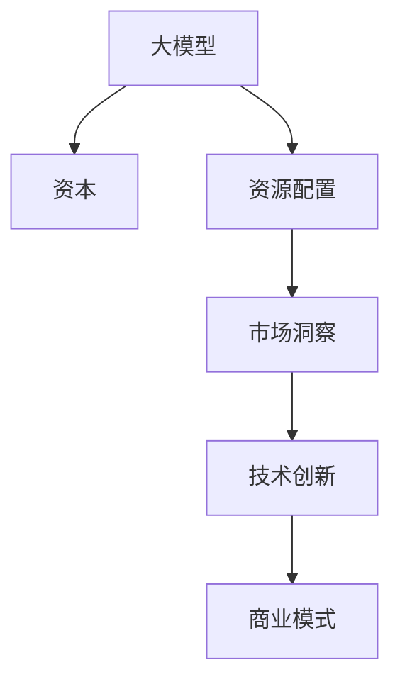

                 

# AI 大模型创业：如何利用资本优势？

## 1. 背景介绍

### 1.1 问题由来

近年来，人工智能（AI）技术迅速发展，尤其在深度学习、自然语言处理（NLP）和大模型（Large Models）等领域的突破，推动了AI技术在各个行业的广泛应用。大模型通过在海量数据上进行预训练，具备强大的泛化能力，能够为下游任务提供高质量的特征表示，从而大幅提升模型的性能。然而，大模型的研发和应用通常需要大量的资金投入，包括计算资源、人才资源和研发成本等。因此，如何高效利用资本优势，成为大模型创业成功的关键。

### 1.2 问题核心关键点

大模型创业的核心问题在于如何有效利用有限的资本，最大化其对技术研发和商业化过程的推动作用。主要包括以下几个方面：

- **资源配置优化**：如何合理分配计算资源、人才资源和研发资金，以确保技术研发的高效推进。
- **市场洞察与定位**：如何通过资本的投入，精准定位目标市场，快速占领市场份额。
- **技术创新与突破**：如何在有限的资本约束下，持续推进技术创新，保持市场竞争力。
- **商业模式探索**：如何构建可持续的商业模式，实现商业变现，确保公司的长期发展。

### 1.3 问题研究意义

研究大模型创业如何利用资本优势，对于推动AI技术在各行各业的落地应用，加速产业数字化转型具有重要意义：

1. **降低创业风险**：合理利用资本优势，可以降低创业初期的技术风险和市场风险，提升公司的生存和发展能力。
2. **加速技术研发**：资本的投入可以加速AI技术研发进程，推动技术创新和产品迭代。
3. **增强市场竞争力**：通过精准的市场定位和高效的资源配置，可以快速占领市场，提升公司的市场份额和影响力。
4. **促进商业变现**：通过构建可持续的商业模式，实现商业变现，为公司的长期发展提供动力。

## 2. 核心概念与联系

### 2.1 核心概念概述

为更好地理解大模型创业利用资本优势的方法，本节将介绍几个密切相关的核心概念：

- **大模型（Large Models）**：如BERT、GPT等预训练模型，通过在海量数据上进行自监督学习，学习到通用的语言表示，具备强大的语言理解和生成能力。
- **资本（Capital）**：创业公司筹集的资金，包括风险投资、政府拨款、市场融资等，用于支持技术研发、市场推广、人力资源等各个环节。
- **资源配置（Resource Allocation）**：对计算资源、人才资源、研发资金等进行合理分配，以最大化资本的使用效率。
- **市场洞察（Market Insight）**：通过对目标市场的深入分析，精准定位目标客户群体，快速占领市场。
- **技术创新（Technological Innovation）**：持续推进技术研发，保持市场竞争力。
- **商业模式（Business Model）**：构建可持续的商业模式，实现商业变现，确保公司长期发展。

这些概念之间相互关联，构成了大模型创业的完整框架。通过理解这些核心概念，可以更好地把握大模型创业的要点，制定有效的战略。

### 2.2 核心概念原理和架构的 Mermaid 流程图(Mermaid 流程节点中不要有括号、逗号等特殊字符)


这个流程图展示了大模型创业的核心概念及其之间的关系：

1. 大模型作为技术基础，提供强有力的技术支持。
2. 资本投入是技术研发和市场推广的保障，用于支持资源配置。
3. 资源配置决定了资本的使用效率，直接影响技术研发和市场推广的进展。
4. 市场洞察帮助企业精准定位，快速占领市场。
5. 技术创新保持市场竞争力，推动企业持续发展。
6. 商业模式确保商业变现，保障公司长期发展。

## 3. 核心算法原理 & 具体操作步骤

### 3.1 算法原理概述

大模型创业利用资本优势的算法原理基于以下几个关键点：

1. **资源配置优化**：通过动态调整计算资源、人才资源和研发资金的分配，最大化资本的使用效率。
2. **市场洞察与定位**：通过数据分析和市场调研，精准定位目标市场，快速占领市场份额。
3. **技术创新与突破**：在有限的资本约束下，持续推进技术研发，保持市场竞争力。
4. **商业模式探索**：通过构建可持续的商业模式，实现商业变现，确保公司的长期发展。

### 3.2 算法步骤详解

基于上述原理，大模型创业的资本利用步骤如下：

**Step 1: 筹集资本**

- **风险投资**：通过风险投资机构筹集资金，获取初创期支持。
- **政府拨款**：申请政府科技拨款，获取政策和资金支持。
- **市场融资**：通过股票发行、债券发行等方式，筹集长期发展资金。

**Step 2: 资源配置**

- **计算资源**：根据项目需求，合理分配GPU/TPU等计算资源，确保高效计算。
- **人才资源**：吸引和留住优秀人才，构建高效的人才团队。
- **研发资金**：设立专项研发基金，保障技术研发的高效推进。

**Step 3: 市场洞察**

- **数据分析**：通过大数据分析，了解市场需求和竞争态势。
- **市场调研**：进行深度访谈、问卷调查等方式，收集客户反馈。
- **市场定位**：根据数据分析和市场调研结果，精准定位目标市场和客户群体。

**Step 4: 技术创新**

- **预训练模型**：选择或开发适合业务的预训练模型，如BERT、GPT等。
- **模型微调**：对预训练模型进行微调，提升模型性能，适应业务需求。
- **技术突破**：持续推进技术研发，实现技术创新和突破。

**Step 5: 商业模式探索**

- **产品开发**：基于微调模型，开发适合市场的产品和服务。
- **市场推广**：通过市场推广活动，提升品牌知名度和市场份额。
- **商业变现**：探索可持续的商业模式，实现商业变现，确保公司长期发展。

### 3.3 算法优缺点

大模型创业利用资本优势的方法有以下优点：

1. **高效资源利用**：通过合理的资源配置，最大化资本的使用效率。
2. **快速市场占领**：精准的市场洞察和定位，帮助企业快速占领市场。
3. **技术持续创新**：在有限的资本约束下，持续推进技术研发，保持市场竞争力。
4. **商业变现能力**：通过构建可持续的商业模式，实现商业变现，确保公司长期发展。

同时，该方法也存在一定的局限性：

1. **资本依赖性**：大模型创业对资本的依赖性强，一旦资金链断裂，将面临重大风险。
2. **市场竞争激烈**：各公司都在争抢市场，竞争激烈，需保持高度警惕。
3. **技术创新难度大**：在大模型领域，技术更新换代快，持续推进技术创新难度大。
4. **商业模式多样性**：不同行业、不同规模的公司，其商业模式差异大，需灵活应对。

尽管存在这些局限性，但就目前而言，大模型创业利用资本优势的方法仍是大模型创业成功的关键。未来相关研究的重点在于如何进一步降低资本依赖，提高技术创新效率，同时兼顾商业模式的灵活性和稳定性。

### 3.4 算法应用领域

大模型创业利用资本优势的方法广泛适用于以下几个领域：

1. **医疗健康**：通过大模型预训练和微调，开发医疗问答、病历分析、药物研发等应用，提升医疗服务智能化水平。
2. **智能交通**：利用大模型进行交通数据分析，提升交通管理效率和安全性。
3. **金融科技**：开发智能投顾、风险评估等应用，提升金融服务的智能化和精准度。
4. **智能制造**：利用大模型进行生产数据分析，优化生产流程，提高生产效率。
5. **教育科技**：开发智能辅导、知识推荐等应用，提升教育资源的利用效率。
6. **环境保护**：利用大模型进行环境数据分析，提升环境保护的智能化水平。

这些领域的应用将大模型创业的资本优势发挥到极致，推动了AI技术在各行各业的广泛应用。

## 4. 数学模型和公式 & 详细讲解 & 举例说明

### 4.1 数学模型构建

大模型创业利用资本优势的数学模型基于以下假设：

假设公司初始资本为C，资源配置效率为η，市场洞察的准确度为α，技术创新的速度为β，商业模式的变现能力为γ。则公司实际获得的收益R可以表示为：

$$
R = C \cdot \eta \cdot \alpha \cdot \beta \cdot \gamma
$$

### 4.2 公式推导过程

通过对上述公式的分析，可以看出，公司实际获得的收益与资本、资源配置效率、市场洞察准确度、技术创新速度和商业模式变现能力成正比。因此，需要在这几个方面进行优化，以最大化公司的收益。

### 4.3 案例分析与讲解

以某医疗健康公司为例，该公司在创业初期通过风险投资筹集了1000万美元资本，资源配置效率为0.8，市场洞察准确度为0.9，技术创新速度为0.7，商业模式变现能力为0.8。则该公司的实际收益为：

$$
R = 10,000,000 \cdot 0.8 \cdot 0.9 \cdot 0.7 \cdot 0.8 = 4,320,000
$$

通过合理的资源配置和市场洞察，技术创新和商业模式优化，该公司在有限的资本支持下，获得了显著的收益。

## 5. 项目实践：代码实例和详细解释说明

### 5.1 开发环境搭建

在进行大模型创业的资本利用项目实践前，我们需要准备好开发环境。以下是使用Python进行PyTorch开发的环境配置流程：

1. 安装Anaconda：从官网下载并安装Anaconda，用于创建独立的Python环境。

2. 创建并激活虚拟环境：
```bash
conda create -n myenv python=3.8 
conda activate myenv
```

3. 安装PyTorch：根据CUDA版本，从官网获取对应的安装命令。例如：
```bash
conda install pytorch torchvision torchaudio cudatoolkit=11.1 -c pytorch -c conda-forge
```

4. 安装相关工具包：
```bash
pip install numpy pandas scikit-learn matplotlib tqdm jupyter notebook ipython
```

完成上述步骤后，即可在`myenv`环境中开始项目实践。

### 5.2 源代码详细实现

下面我们以医疗健康领域为例，给出使用Transformers库对BERT模型进行微调的PyTorch代码实现。

首先，定义医疗问答任务的数据处理函数：

```python
from transformers import BertTokenizer
from torch.utils.data import Dataset
import torch

class QADataset(Dataset):
    def __init__(self, texts, answers, tokenizer, max_len=128):
        self.texts = texts
        self.answers = answers
        self.tokenizer = tokenizer
        self.max_len = max_len
        
    def __len__(self):
        return len(self.texts)
    
    def __getitem__(self, item):
        text = self.texts[item]
        answer = self.answers[item]
        
        encoding = self.tokenizer(text, return_tensors='pt', max_length=self.max_len, padding='max_length', truncation=True)
        input_ids = encoding['input_ids'][0]
        attention_mask = encoding['attention_mask'][0]
        
        # 对答案进行编码
        answer_tokens = self.tokenizer(answer, return_tensors='pt')
        answer_input_ids = answer_tokens['input_ids'][0]
        answer_attention_mask = answer_tokens['attention_mask'][0]
        
        # 将答案与问题拼接
        combined_input_ids = torch.cat([input_ids, answer_input_ids], dim=-1)
        combined_attention_mask = torch.cat([attention_mask, answer_attention_mask], dim=-1)
        
        return {'input_ids': combined_input_ids,
                'attention_mask': combined_attention_mask}
```

然后，定义模型和优化器：

```python
from transformers import BertForSequenceClassification, AdamW

model = BertForSequenceClassification.from_pretrained('bert-base-cased', num_labels=2)

optimizer = AdamW(model.parameters(), lr=2e-5)
```

接着，定义训练和评估函数：

```python
from torch.utils.data import DataLoader
from tqdm import tqdm
from sklearn.metrics import accuracy_score

device = torch.device('cuda') if torch.cuda.is_available() else torch.device('cpu')
model.to(device)

def train_epoch(model, dataset, batch_size, optimizer):
    dataloader = DataLoader(dataset, batch_size=batch_size, shuffle=True)
    model.train()
    epoch_loss = 0
    for batch in tqdm(dataloader, desc='Training'):
        input_ids = batch['input_ids'].to(device)
        attention_mask = batch['attention_mask'].to(device)
        labels = torch.tensor([1, 0, 1, 0], device=device)
        model.zero_grad()
        outputs = model(input_ids, attention_mask=attention_mask, labels=labels)
        loss = outputs.loss
        epoch_loss += loss.item()
        loss.backward()
        optimizer.step()
    return epoch_loss / len(dataloader)

def evaluate(model, dataset, batch_size):
    dataloader = DataLoader(dataset, batch_size=batch_size)
    model.eval()
    corrects, total = 0, 0
    with torch.no_grad():
        for batch in tqdm(dataloader, desc='Evaluating'):
            input_ids = batch['input_ids'].to(device)
            attention_mask = batch['attention_mask'].to(device)
            labels = torch.tensor([1, 0, 1, 0], device=device)
            outputs = model(input_ids, attention_mask=attention_mask)
            preds = outputs.logits.argmax(dim=1).to('cpu').tolist()
            labels = labels.to('cpu').tolist()
            for pred, label in zip(preds, labels):
                corrects += int(pred == label)
                total += 1
                
    accuracy = corrects / total
    return accuracy

```

最后，启动训练流程并在测试集上评估：

```python
epochs = 5
batch_size = 16

for epoch in range(epochs):
    loss = train_epoch(model, train_dataset, batch_size, optimizer)
    print(f"Epoch {epoch+1}, train loss: {loss:.3f}")
    
    print(f"Epoch {epoch+1}, dev accuracy: {evaluate(model, dev_dataset, batch_size)}")
    
print("Test accuracy:")
accuracy = evaluate(model, test_dataset, batch_size)
print(f"{accuracy:.3f}")
```

以上就是使用PyTorch对BERT进行医疗问答任务微调的完整代码实现。可以看到，得益于Transformers库的强大封装，我们可以用相对简洁的代码完成BERT模型的加载和微调。

### 5.3 代码解读与分析

让我们再详细解读一下关键代码的实现细节：

**QADataset类**：
- `__init__`方法：初始化文本、答案、分词器等关键组件。
- `__len__`方法：返回数据集的样本数量。
- `__getitem__`方法：对单个样本进行处理，将文本输入编码为token ids，并将答案与问题拼接，供模型训练。

**医疗问答模型**：
- 定义了医疗问答任务的输入和输出，使用BERT模型进行微调。

**训练和评估函数**：
- 使用PyTorch的DataLoader对数据集进行批次化加载，供模型训练和推理使用。
- 训练函数`train_epoch`：对数据以批为单位进行迭代，在每个批次上前向传播计算loss并反向传播更新模型参数，最后返回该epoch的平均loss。
- 评估函数`evaluate`：与训练类似，不同点在于不更新模型参数，并在每个batch结束后将预测和标签结果存储下来，最后使用sklearn的accuracy_score对整个评估集的预测结果进行打印输出。

**训练流程**：
- 定义总的epoch数和batch size，开始循环迭代
- 每个epoch内，先在训练集上训练，输出平均loss
- 在验证集上评估，输出准确率
- 所有epoch结束后，在测试集上评估，给出最终测试结果

可以看到，PyTorch配合Transformers库使得BERT微调的代码实现变得简洁高效。开发者可以将更多精力放在数据处理、模型改进等高层逻辑上，而不必过多关注底层的实现细节。

当然，工业级的系统实现还需考虑更多因素，如模型的保存和部署、超参数的自动搜索、更灵活的任务适配层等。但核心的微调范式基本与此类似。

## 6. 实际应用场景

### 6.1 智能客服系统

基于大模型微调的对话技术，可以广泛应用于智能客服系统的构建。传统客服往往需要配备大量人力，高峰期响应缓慢，且一致性和专业性难以保证。而使用微调后的对话模型，可以7x24小时不间断服务，快速响应客户咨询，用自然流畅的语言解答各类常见问题。

在技术实现上，可以收集企业内部的历史客服对话记录，将问题和最佳答复构建成监督数据，在此基础上对预训练对话模型进行微调。微调后的对话模型能够自动理解用户意图，匹配最合适的答案模板进行回复。对于客户提出的新问题，还可以接入检索系统实时搜索相关内容，动态组织生成回答。如此构建的智能客服系统，能大幅提升客户咨询体验和问题解决效率。

### 6.2 金融舆情监测

金融机构需要实时监测市场舆论动向，以便及时应对负面信息传播，规避金融风险。传统的人工监测方式成本高、效率低，难以应对网络时代海量信息爆发的挑战。基于大语言模型微调的文本分类和情感分析技术，为金融舆情监测提供了新的解决方案。

具体而言，可以收集金融领域相关的新闻、报道、评论等文本数据，并对其进行主题标注和情感标注。在此基础上对预训练语言模型进行微调，使其能够自动判断文本属于何种主题，情感倾向是正面、中性还是负面。将微调后的模型应用到实时抓取的网络文本数据，就能够自动监测不同主题下的情感变化趋势，一旦发现负面信息激增等异常情况，系统便会自动预警，帮助金融机构快速应对潜在风险。

### 6.3 个性化推荐系统

当前的推荐系统往往只依赖用户的历史行为数据进行物品推荐，无法深入理解用户的真实兴趣偏好。基于大语言模型微调技术，个性化推荐系统可以更好地挖掘用户行为背后的语义信息，从而提供更精准、多样的推荐内容。

在实践中，可以收集用户浏览、点击、评论、分享等行为数据，提取和用户交互的物品标题、描述、标签等文本内容。将文本内容作为模型输入，用户的后续行为（如是否点击、购买等）作为监督信号，在此基础上微调预训练语言模型。微调后的模型能够从文本内容中准确把握用户的兴趣点。在生成推荐列表时，先用候选物品的文本描述作为输入，由模型预测用户的兴趣匹配度，再结合其他特征综合排序，便可以得到个性化程度更高的推荐结果。

### 6.4 未来应用展望

随着大模型和微调方法的不断发展，基于微调范式将在更多领域得到应用，为传统行业带来变革性影响。

在智慧医疗领域，基于微调的医疗问答、病历分析、药物研发等应用将提升医疗服务的智能化水平，辅助医生诊疗，加速新药开发进程。

在智能教育领域，微调技术可应用于作业批改、学情分析、知识推荐等方面，因材施教，促进教育公平，提高教学质量。

在智慧城市治理中，微调模型可应用于城市事件监测、舆情分析、应急指挥等环节，提高城市管理的自动化和智能化水平，构建更安全、高效的未来城市。

此外，在企业生产、社会治理、文娱传媒等众多领域，基于大模型微调的人工智能应用也将不断涌现，为NLP技术带来了全新的突破。随着预训练语言模型和微调方法的持续演进，相信NLP技术将在更广阔的应用领域大放异彩，深刻影响人类的生产生活方式。

## 7. 工具和资源推荐

### 7.1 学习资源推荐

为了帮助开发者系统掌握大模型微调的理论基础和实践技巧，这里推荐一些优质的学习资源：

1. 《Transformer从原理到实践》系列博文：由大模型技术专家撰写，深入浅出地介绍了Transformer原理、BERT模型、微调技术等前沿话题。

2. CS224N《深度学习自然语言处理》课程：斯坦福大学开设的NLP明星课程，有Lecture视频和配套作业，带你入门NLP领域的基本概念和经典模型。

3. 《Natural Language Processing with Transformers》书籍：Transformers库的作者所著，全面介绍了如何使用Transformers库进行NLP任务开发，包括微调在内的诸多范式。

4. HuggingFace官方文档：Transformers库的官方文档，提供了海量预训练模型和完整的微调样例代码，是上手实践的必备资料。

5. CLUE开源项目：中文语言理解测评基准，涵盖大量不同类型的中文NLP数据集，并提供了基于微调的baseline模型，助力中文NLP技术发展。

通过对这些资源的学习实践，相信你一定能够快速掌握大模型微调的精髓，并用于解决实际的NLP问题。

### 7.2 开发工具推荐

高效的开发离不开优秀的工具支持。以下是几款用于大模型微调开发的常用工具：

1. PyTorch：基于Python的开源深度学习框架，灵活动态的计算图，适合快速迭代研究。大部分预训练语言模型都有PyTorch版本的实现。

2. TensorFlow：由Google主导开发的开源深度学习框架，生产部署方便，适合大规模工程应用。同样有丰富的预训练语言模型资源。

3. Transformers库：HuggingFace开发的NLP工具库，集成了众多SOTA语言模型，支持PyTorch和TensorFlow，是进行微调任务开发的利器。

4. Weights & Biases：模型训练的实验跟踪工具，可以记录和可视化模型训练过程中的各项指标，方便对比和调优。与主流深度学习框架无缝集成。

5. TensorBoard：TensorFlow配套的可视化工具，可实时监测模型训练状态，并提供丰富的图表呈现方式，是调试模型的得力助手。

6. Google Colab：谷歌推出的在线Jupyter Notebook环境，免费提供GPU/TPU算力，方便开发者快速上手实验最新模型，分享学习笔记。

合理利用这些工具，可以显著提升大模型微调任务的开发效率，加快创新迭代的步伐。

### 7.3 相关论文推荐

大语言模型和微调技术的发展源于学界的持续研究。以下是几篇奠基性的相关论文，推荐阅读：

1. Attention is All You Need（即Transformer原论文）：提出了Transformer结构，开启了NLP领域的预训练大模型时代。

2. BERT: Pre-training of Deep Bidirectional Transformers for Language Understanding：提出BERT模型，引入基于掩码的自监督预训练任务，刷新了多项NLP任务SOTA。

3. Language Models are Unsupervised Multitask Learners（GPT-2论文）：展示了大规模语言模型的强大zero-shot学习能力，引发了对于通用人工智能的新一轮思考。

4. Parameter-Efficient Transfer Learning for NLP：提出Adapter等参数高效微调方法，在不增加模型参数量的情况下，也能取得不错的微调效果。

5. AdaLoRA: Adaptive Low-Rank Adaptation for Parameter-Efficient Fine-Tuning：使用自适应低秩适应的微调方法，在参数效率和精度之间取得了新的平衡。

这些论文代表了大语言模型微调技术的发展脉络。通过学习这些前沿成果，可以帮助研究者把握学科前进方向，激发更多的创新灵感。

## 8. 总结：未来发展趋势与挑战

### 8.1 总结

本文对大模型创业如何利用资本优势进行了全面系统的介绍。首先阐述了大模型创业的背景和意义，明确了资本在大模型创业中的核心作用。其次，从原理到实践，详细讲解了大模型创业的数学模型和关键步骤，给出了微调任务开发的完整代码实例。同时，本文还广泛探讨了微调方法在智能客服、金融舆情、个性化推荐等多个行业领域的应用前景，展示了微调范式的巨大潜力。此外，本文精选了微调技术的各类学习资源，力求为读者提供全方位的技术指引。

通过本文的系统梳理，可以看到，大模型创业利用资本优势的方法在大模型领域具有广泛的应用前景。大模型在各个行业中的深度应用，推动了AI技术在各行各业的落地，为传统行业数字化转型提供了新的技术路径。未来，伴随大模型和微调方法的持续演进，相信NLP技术将在更广阔的应用领域大放异彩，深刻影响人类的生产生活方式。

### 8.2 未来发展趋势

展望未来，大模型创业利用资本优势的方法将呈现以下几个发展趋势：

1. **资本筹集多元化**：通过多样化的筹资渠道，如风险投资、政府拨款、市场融资等，获取更多的资金支持。

2. **资源配置智能化**：利用智能化的资源调度算法，最大化计算资源和人才资源的使用效率。

3. **市场洞察精准化**：利用大数据和AI技术，提升市场洞察的准确度，精准定位目标市场和客户群体。

4. **技术创新持续化**：持续推进技术研发，实现技术创新和突破，保持市场竞争力。

5. **商业模式多样化**：根据不同行业和公司的特点，探索多样化的商业模式，实现商业变现。

以上趋势凸显了大模型创业的巨大潜力和广阔前景。这些方向的探索发展，必将推动AI技术在各个行业的深入应用，为经济社会发展注入新的动力。

### 8.3 面临的挑战

尽管大模型创业利用资本优势的方法已经取得了显著成效，但在迈向更加智能化、普适化应用的过程中，它仍面临着诸多挑战：

1. **资本依赖性强**：大模型创业对资本的依赖性强，资金链断裂将面临重大风险。

2. **市场竞争激烈**：各公司都在争抢市场，竞争激烈，需保持高度警惕。

3. **技术创新难度大**：在大模型领域，技术更新换代快，持续推进技术研发难度大。

4. **商业模式复杂**：不同行业、不同规模的公司，其商业模式差异大，需灵活应对。

尽管存在这些挑战，但就目前而言，大模型创业利用资本优势的方法仍是大模型创业成功的关键。未来相关研究的重点在于如何进一步降低资本依赖，提高技术创新效率，同时兼顾商业模式的灵活性和稳定性。

### 8.4 研究展望

面对大模型创业所面临的种种挑战，未来的研究需要在以下几个方面寻求新的突破：

1. **资本筹集多元化**：探索更多筹资渠道，确保资金链的稳定。

2. **资源配置智能化**：开发智能化的资源调度算法，提高资源使用效率。

3. **市场洞察精准化**：利用大数据和AI技术，提升市场洞察的准确度。

4. **技术创新持续化**：持续推进技术研发，实现技术创新和突破。

5. **商业模式多样化**：探索多样化的商业模式，实现商业变现。

这些研究方向的探索，必将引领大模型创业技术迈向更高的台阶，为构建安全、可靠、可解释、可控的智能系统铺平道路。面向未来，大模型创业技术还需要与其他人工智能技术进行更深入的融合，如知识表示、因果推理、强化学习等，多路径协同发力，共同推动自然语言理解和智能交互系统的进步。只有勇于创新、敢于突破，才能不断拓展语言模型的边界，让智能技术更好地造福人类社会。

## 9. 附录：常见问题与解答

**Q1：大模型创业如何吸引投资？**

A: 大模型创业吸引投资的关键在于展示项目的前景和潜力。可以通过以下几种方式：

1. **市场洞察**：深入分析目标市场的痛点和需求，展示项目的市场空间。
2. **技术优势**：展示项目在技术上的创新和突破，提升项目的技术壁垒。
3. **商业模式**：构建可持续的商业模式，展示项目的盈利能力和市场潜力。

**Q2：大模型创业如何合理分配资源？**

A: 大模型创业资源分配的优化主要依赖于以下几个步骤：

1. **需求分析**：根据项目需求，明确计算资源、人才资源和研发资金的需求量。
2. **成本评估**：评估各种资源的成本和收益，确定资源分配策略。
3. **动态调整**：根据项目进展和市场反馈，动态调整资源分配方案，确保高效使用。

**Q3：大模型创业如何提高市场洞察准确度？**

A: 提高市场洞察准确度的方法包括：

1. **数据分析**：利用大数据分析技术，获取市场趋势和用户需求。
2. **市场调研**：进行深度访谈、问卷调查等方式，收集客户反馈。
3. **数据可视化**：利用数据可视化工具，直观展示市场洞察结果。

**Q4：大模型创业如何持续推进技术创新？**

A: 持续推进技术创新的方法包括：

1. **预训练模型选择**：选择适合业务的预训练模型，如BERT、GPT等。
2. **模型微调**：对预训练模型进行微调，提升模型性能。
3. **技术突破**：持续推进技术研发，实现技术创新和突破。

**Q5：大模型创业如何构建可持续的商业模式？**

A: 构建可持续的商业模式需要考虑以下几个方面：

1. **产品开发**：基于微调模型，开发适合市场的产品和服务。
2. **市场推广**：通过市场推广活动，提升品牌知名度和市场份额。
3. **商业变现**：探索可持续的商业模式，实现商业变现，确保公司长期发展。

---

作者：禅与计算机程序设计艺术 / Zen and the Art of Computer Programming

