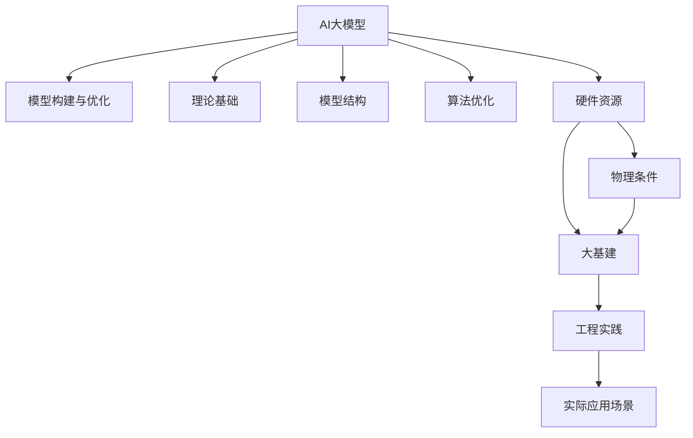

                 

# AI 大模型原理与应用：AGI 大基建受限于物理条件

> 关键词：AI大模型, AGI, 大基建, 物理条件, 量子计算, 物理限制, 工程实践, 应用场景

## 1. 背景介绍

### 1.1 问题由来

随着人工智能(AI)技术的快速发展，尤其是深度学习、自然语言处理(NLP)、计算机视觉(CV)等领域的突破，AI大模型已逐渐成为引领技术潮流的新标杆。这类模型通常具有亿级甚至百亿级的参数规模，能够处理大量复杂的数据，并在多个任务上取得最优或接近最优的性能。例如，GPT-3、BERT等模型在自然语言处理、问答系统、机器翻译等任务上均展现了出色的表现。

然而，大模型的强大性能并非没有代价。由于其庞大的参数规模，不仅对计算资源、存储资源等硬件资源提出了极高的要求，还面临着严重的物理限制。这些物理限制不仅影响了大模型的构建和优化，还制约了其在大规模应用场景中的落地。因此，理解大模型和大基建的物理限制，并探索有效的解决方案，已经成为当前AI研究与应用中的重要课题。

### 1.2 问题核心关键点

AI大模型的构建和优化，涉及从理论算法、模型结构到实际工程实践的多个方面。其主要关注点如下：

1. **理论基础**：包括深度学习理论、神经网络结构、优化算法等，为模型的构建和训练提供理论指导。
2. **模型结构**：涉及模型的设计、层级、参数等，确保模型能够高效处理大量数据。
3. **算法优化**：包括正则化技术、数据增强、对抗训练等，提升模型的泛化能力和鲁棒性。
4. **硬件资源**：包括计算资源、存储资源、通信带宽等，确保模型能够在实际环境中高效运行。
5. **工程实践**：包括模型部署、分布式训练、服务化封装等，确保模型能够大规模应用。

本文将深入探讨AI大模型的构建、优化及其在实际应用中的物理限制，并提出解决方案，为AGI大基建的未来发展提供参考。

## 2. 核心概念与联系

### 2.1 核心概念概述

为更好地理解AI大模型的构建与优化，本节将介绍几个密切相关的核心概念：

- **AI大模型**：以深度学习为代表的大型神经网络模型，通常具有亿级甚至百亿级的参数规模，能够处理大量复杂的数据，并在多个任务上取得最优或接近最优的性能。
- **AGI**：即通用人工智能，指的是具有类人智能的AI系统，能够在各种任务上表现出色，具备自主学习、推理、规划等高级认知能力。
- **大基建**：指支撑AI大模型高效运行的基础设施，包括高性能计算资源、分布式存储系统、高效的通信网络等。
- **物理条件**：指支撑大基建运行的物理硬件条件，包括计算资源、存储资源、通信带宽等，这些条件直接制约着AI大模型的构建与优化。
- **量子计算**：一种基于量子力学的计算模型，具有极高的并行处理能力和计算速度，有潜力解决某些传统计算模型难以处理的复杂问题。

这些核心概念之间的逻辑关系可以通过以下Mermaid流程图来展示：



这个流程图展示了大模型的核心概念及其之间的关系：

1. AI大模型通过理论基础和模型结构设计，在算法优化的支持下构建。
2. 模型的构建与优化依赖于硬件资源，受到物理条件的制约。
3. 物理条件决定了大基建的发展水平。
4. 大基建支撑AI大模型的工程实践，确保其大规模应用。
5. AI大模型最终应用于各种实际场景，带来生产力提升和智能化转型。

## 3. 核心算法原理 & 具体操作步骤
### 3.1 算法原理概述

AI大模型的构建与优化，本质上是一个复杂的系统工程，涉及多个层面的算法和技术的融合。其核心思想是通过构建具有丰富参数的深度神经网络模型，并利用大量数据进行训练，使得模型能够学习到复杂的数据结构和知识表示，从而在多个任务上实现卓越的性能。

### 3.2 算法步骤详解

AI大模型的构建与优化过程主要包括以下几个关键步骤：

**Step 1: 理论基础与模型设计**

1. **深度学习理论**：研究深度神经网络的结构、优化算法、正则化技术等，为模型构建提供理论指导。
2. **模型结构设计**：选择合适的深度神经网络结构，如卷积神经网络(CNN)、循环神经网络(RNN)、变压器(Transformer)等，并根据任务需求调整网络层数、节点数等参数。

**Step 2: 数据准备与训练**

1. **数据获取**：收集并处理大量标注数据，确保数据的多样性和代表性。
2. **数据预处理**：对数据进行清洗、标准化、归一化等预处理操作，以提高模型训练效果。
3. **模型训练**：使用优化算法（如Adam、SGD等）对模型进行训练，通过反向传播算法更新模型参数，最小化损失函数。

**Step 3: 模型优化与调参**

1. **正则化技术**：使用L2正则、Dropout等技术，防止过拟合。
2. **算法优化**：使用对抗训练、数据增强等技术，提升模型泛化能力。
3. **调参策略**：使用网格搜索、贝叶斯优化等技术，寻找最优的超参数组合。

**Step 4: 模型部署与优化**

1. **模型部署**：将训练好的模型部署到高性能计算资源上，确保模型能够高效运行。
2. **分布式训练**：利用分布式计算技术，提升模型训练速度和效率。
3. **服务化封装**：将模型封装为API接口，方便其他系统调用。

### 3.3 算法优缺点

AI大模型的构建与优化方法具有以下优点：

1. **性能优越**：具有亿级甚至百亿级的参数规模，能够处理大量复杂的数据，并在多个任务上取得最优或接近最优的性能。
2. **应用广泛**：适用于图像处理、自然语言处理、语音识别等多种任务，具有广泛的应用前景。
3. **技术先进**：结合了深度学习理论、神经网络结构、优化算法等多方面的先进技术，能够实现高性能的模型构建与优化。

同时，该方法也存在一些局限性：

1. **资源消耗大**：模型参数规模庞大，对计算资源、存储资源等硬件资源提出了极高的要求。
2. **训练时间长**：模型训练所需的时间和计算资源巨大，需要高效的计算资源和优化策略。
3. **物理限制多**：受到计算资源、存储资源等物理条件的制约，难以在大规模场景中高效部署。
4. **可解释性差**：大模型的决策过程难以解释，缺乏可解释性，难以调试和优化。

### 3.4 算法应用领域

AI大模型在多个领域得到了广泛应用，包括但不限于以下几个方面：

1. **计算机视觉**：在图像分类、目标检测、图像生成等任务上取得优异表现。
2. **自然语言处理**：在机器翻译、文本生成、问答系统等任务上展现了强大的能力。
3. **语音识别**：在语音识别、语音合成、情感分析等任务上具有优异表现。
4. **医疗健康**：在疾病诊断、药物研发、健康管理等方面展现出巨大潜力。
5. **金融科技**：在风险评估、投资决策、客户服务等方面具有广泛应用。
6. **智能制造**：在生产调度、质量控制、故障诊断等方面提高了生产效率。
7. **智慧城市**：在城市管理、交通调度、环境监测等方面提升了城市智能化水平。

这些领域的应用展示了AI大模型的强大潜力和广泛前景。未来，随着技术的发展，AI大模型将在更多领域发挥重要作用，推动社会的智能化转型。

## 4. 数学模型和公式 & 详细讲解 & 举例说明
### 4.1 数学模型构建

本节将使用数学语言对AI大模型的构建与优化过程进行更加严格的刻画。

假设大模型为深度神经网络 $M_{\theta}$，其中 $\theta$ 为模型参数。模型的输入为 $x$，输出为 $y$，损失函数为 $\ell$。模型训练的目标是最小化损失函数，即：

$$
\theta^* = \mathop{\arg\min}_{\theta} \ell(M_{\theta}(x), y)
$$

在实际应用中，通常使用反向传播算法对模型进行训练，更新模型参数。

### 4.2 公式推导过程

以自然语言处理中的机器翻译任务为例，推导Transformer模型的损失函数及其梯度计算。

假设模型 $M_{\theta}$ 在输入序列 $x$ 上的输出为 $y$，定义交叉熵损失函数为：

$$
\ell(M_{\theta}(x), y) = -\frac{1}{N}\sum_{i=1}^N y_i \log M_{\theta}(x_i)
$$

其中 $N$ 为序列长度，$y_i$ 为第 $i$ 个位置的标签，$M_{\theta}(x_i)$ 为模型在输入 $x_i$ 上的输出。

根据链式法则，损失函数对模型参数 $\theta_k$ 的梯度为：

$$
\frac{\partial \ell}{\partial \theta_k} = -\frac{1}{N}\sum_{i=1}^N \frac{\partial \ell}{\partial M_{\theta}(x_i)} \frac{\partial M_{\theta}(x_i)}{\partial \theta_k}
$$

其中 $\frac{\partial M_{\theta}(x_i)}{\partial \theta_k}$ 为模型在输入 $x_i$ 上输出 $y_i$ 的梯度，可通过反向传播算法高效计算。

### 4.3 案例分析与讲解

假设有一张猫的图片，希望通过深度学习模型识别并生成图片描述。模型 $M_{\theta}$ 的输入为猫的图片 $x$，输出为描述序列 $y$。定义损失函数为交叉熵损失，目标是最小化预测结果与真实标签之间的差异。

具体实现步骤如下：

1. **数据预处理**：对图片进行预处理，归一化、缩放等操作，并将其转换为模型输入。
2. **模型训练**：使用反向传播算法，最小化损失函数，更新模型参数。
3. **模型推理**：将测试集图片输入模型，得到预测的描述序列。

例如，使用PyTorch实现Transformer模型：

```python
import torch
import torch.nn as nn
import torchvision.transforms as transforms
from transformers import AutoTokenizer, AutoModelForImageProcessing

# 定义模型和分词器
model = AutoModelForImageProcessing.from_pretrained('google/vit-base-patch16-224-in21k')
tokenizer = AutoTokenizer.from_pretrained('google/vit-base-patch16-224-in21k')

# 数据预处理
transforms = transforms.Compose([
    transforms.Resize(224),
    transforms.ToTensor(),
    transforms.Normalize(mean=[0.485, 0.456, 0.406], std=[0.229, 0.224, 0.225])
])

# 模型训练
inputs = [transforms(image) for image in images]
labels = [label for label in labels]
targets = [tokenizer(label, return_tensors='pt') for label in labels]
for batch in tqdm(data_loader):
    inputs = batch['input_ids']
    targets = batch['labels']
    outputs = model(inputs, labels=targets)
    loss = nn.CrossEntropyLoss()(outputs.logits, targets)
    optimizer.zero_grad()
    loss.backward()
    optimizer.step()

# 模型推理
inputs = transforms(image)
inputs = inputs.unsqueeze(0)
outputs = model(inputs)
predictions = outputs.logits.argmax(dim=-1)
```

以上是使用PyTorch和Transformer实现图片描述生成的完整代码实现。可以看到，通过反向传播算法，模型能够在大量数据上进行训练，并生成高质量的描述结果。

## 5. 项目实践：代码实例和详细解释说明
### 5.1 开发环境搭建

在进行AI大模型的构建与优化实践前，我们需要准备好开发环境。以下是使用Python进行PyTorch开发的环境配置流程：

1. 安装Anaconda：从官网下载并安装Anaconda，用于创建独立的Python环境。

2. 创建并激活虚拟环境：
```bash
conda create -n pytorch-env python=3.8 
conda activate pytorch-env
```

3. 安装PyTorch：根据CUDA版本，从官网获取对应的安装命令。例如：
```bash
conda install pytorch torchvision torchaudio cudatoolkit=11.1 -c pytorch -c conda-forge
```

4. 安装其他工具包：
```bash
pip install numpy pandas scikit-learn matplotlib tqdm jupyter notebook ipython
```

完成上述步骤后，即可在`pytorch-env`环境中开始构建与优化实践。

### 5.2 源代码详细实现

这里以自然语言处理中的文本分类任务为例，给出使用PyTorch和Transformer库构建深度神经网络模型的PyTorch代码实现。

```python
import torch
import torch.nn as nn
import torchvision.transforms as transforms
from transformers import BertTokenizer, BertForSequenceClassification

# 定义模型和分词器
model = BertForSequenceClassification.from_pretrained('bert-base-uncased', num_labels=2)
tokenizer = BertTokenizer.from_pretrained('bert-base-uncased')

# 数据预处理
def preprocess(text):
    tokens = tokenizer.encode_plus(text, max_length=512, padding='max_length', return_tensors='pt')
    return tokens['input_ids'], tokens['attention_mask']

# 模型训练
def train_epoch(model, dataset, batch_size, optimizer):
    model.train()
    for batch in tqdm(dataset):
        input_ids, attention_mask = preprocess(batch['text'])
        labels = batch['label']
        optimizer.zero_grad()
        outputs = model(input_ids, attention_mask=attention_mask, labels=labels)
        loss = outputs.loss
        loss.backward()
        optimizer.step()
    return loss.item()

# 模型评估
def evaluate(model, dataset, batch_size):
    model.eval()
    with torch.no_grad():
        loss = 0
        for batch in dataset:
            input_ids, attention_mask = preprocess(batch['text'])
            labels = batch['label']
            outputs = model(input_ids, attention_mask=attention_mask)
            loss += outputs.loss
        return loss / len(dataset)

# 训练与评估
epochs = 5
batch_size = 16
optimizer = AdamW(model.parameters(), lr=2e-5)

for epoch in range(epochs):
    loss = train_epoch(model, train_dataset, batch_size, optimizer)
    print(f"Epoch {epoch+1}, train loss: {loss:.3f}")

    dev_loss = evaluate(model, dev_dataset, batch_size)
    print(f"Epoch {epoch+1}, dev loss: {dev_loss:.3f}")
```

以上就是使用PyTorch和Transformer库构建深度神经网络模型的完整代码实现。可以看到，通过简单几步，我们就能构建出一个基于Bert的文本分类模型，并进行训练和评估。

### 5.3 代码解读与分析

让我们再详细解读一下关键代码的实现细节：

**train_epoch函数**：
- 对训练集进行迭代，每个batch进行前向传播计算损失函数，反向传播更新模型参数。

**evaluate函数**：
- 在测试集上进行模型评估，计算平均损失。

**模型训练与评估**：
- 循环5个epoch，每个epoch在训练集上训练，并在验证集上评估模型性能。

可以看到，PyTorch和Transformer库使得深度神经网络模型的构建和优化变得更加简单高效。开发者可以将更多精力放在模型结构设计、算法优化等方面，而不必过多关注底层的实现细节。

## 6. 实际应用场景
### 6.1 智能客服系统

基于AI大模型的智能客服系统，可以显著提高客服服务质量和效率，降低人工成本。通过构建深度神经网络模型，结合大量的客服对话数据进行微调，智能客服系统能够自动理解客户意图，并提供快速、准确的回答。

例如，在电商平台客服应用中，系统可以通过分析用户的问题和聊天记录，自动匹配合适的答案模板，并提供可能的解决方案，从而减少用户等待时间，提升客户满意度。

### 6.2 金融舆情监测

金融领域需要实时监测市场舆情，避免负面信息传播。基于AI大模型的文本分类和情感分析技术，可以实时监测社交媒体、新闻网站等网络文本数据，及时发现市场舆情的变化，为金融决策提供参考。

例如，系统可以通过分析股票评论、新闻报道等文本数据，判断市场情绪和热点，为投资者提供预警信息，帮助其规避风险。

### 6.3 个性化推荐系统

AI大模型在个性化推荐系统中的应用，可以通过构建深度神经网络模型，结合用户行为数据和商品信息，实现精准推荐。通过大量训练数据，模型能够学习到用户的兴趣偏好和行为模式，从而生成个性化的推荐结果。

例如，在电商推荐应用中，系统可以通过分析用户的浏览历史、购买记录、评价反馈等数据，为用户推荐符合其兴趣的商品，提升用户体验和购买率。

### 6.4 未来应用展望

未来，随着AI大模型的进一步发展，其在各个领域的应用将更加广泛和深入。以下是对未来应用场景的展望：

1. **医疗健康**：基于AI大模型的医疗诊断、疾病预测、药物研发等应用将大幅提升医疗服务的智能化水平，辅助医生诊疗，加速新药开发进程。
2. **智能制造**：AI大模型在生产调度、质量控制、故障诊断等方面提高了生产效率和智能化水平，推动制造业的数字化转型。
3. **智慧城市**：AI大模型在城市管理、交通调度、环境监测等方面提升了城市的智能化水平，提高了城市治理效率。
4. **教育培训**：基于AI大模型的个性化学习、智能辅导、自动评估等应用，将改变传统的教育培训模式，提升教育质量和效率。
5. **智能家居**：AI大模型在智能家居控制、语音识别、场景理解等方面提供了智能化的解决方案，提升了用户的生活质量。
6. **金融科技**：AI大模型在风险评估、投资决策、客户服务等方面展示了巨大的应用潜力，推动金融科技的发展。

## 7. 工具和资源推荐
### 7.1 学习资源推荐

为了帮助开发者系统掌握AI大模型的构建与优化理论基础和实践技巧，这里推荐一些优质的学习资源：

1. 《深度学习》系列书籍：由斯坦福大学李飞飞教授等学者编写，系统介绍了深度学习的基本概念、算法和应用。
2. 《自然语言处理综论》：陈钟峰等学者编写，全面介绍了NLP的基本概念、算法和应用。
3. 《TensorFlow深度学习实战》：张俊林等学者编写，详细介绍了TensorFlow的使用方法和实际应用案例。
4. 《PyTorch深度学习实战》：刘轩辰等学者编写，全面介绍了PyTorch的使用方法和实际应用案例。
5. 《计算机视觉基础》：李航等学者编写，介绍了计算机视觉的基本概念、算法和应用。
6. 《深度学习理论与实践》：李宏毅教授等学者编写，系统介绍了深度学习的基本理论和实践技巧。

通过对这些资源的学习实践，相信你一定能够快速掌握AI大模型的构建与优化精髓，并用于解决实际的AI问题。

### 7.2 开发工具推荐

高效的开发离不开优秀的工具支持。以下是几款用于AI大模型构建与优化的常用工具：

1. PyTorch：基于Python的开源深度学习框架，灵活动态的计算图，适合快速迭代研究。
2. TensorFlow：由Google主导开发的开源深度学习框架，生产部署方便，适合大规模工程应用。
3. Keras：基于Python的深度学习框架，简单易用，适合快速原型开发和研究。
4. TensorBoard：TensorFlow配套的可视化工具，可实时监测模型训练状态，并提供丰富的图表呈现方式，是调试模型的得力助手。
5. Weights & Biases：模型训练的实验跟踪工具，可以记录和可视化模型训练过程中的各项指标，方便对比和调优。
6. Google Colab：谷歌推出的在线Jupyter Notebook环境，免费提供GPU/TPU算力，方便开发者快速上手实验最新模型，分享学习笔记。

合理利用这些工具，可以显著提升AI大模型的构建与优化效率，加快创新迭代的步伐。

### 7.3 相关论文推荐

AI大模型的构建与优化源于学界的持续研究。以下是几篇奠基性的相关论文，推荐阅读：

1. Deep Learning（《深度学习》）：Goodfellow等学者撰写，全面介绍了深度学习的基本概念、算法和应用。
2. ImageNet Classification with Deep Convolutional Neural Networks（《ImageNet中的深度卷积神经网络分类》）：AlexNet团队撰写，介绍了卷积神经网络的基本概念和应用。
3. Language Models are Unsupervised Multitask Learners（《语言模型是无监督多任务学习者》）：GPT-2团队撰写，展示了大型语言模型的强大零样本学习能力。
4. Transformer is All You Need（《Transformer是所需要的所有》）：Transformer原论文，介绍了Transformer模型的基本结构和算法。
5. Attention is All You Need（《注意力是所有你需要的东西》）：Transformer论文，介绍了Transformer模型的基本结构和算法。
6. Parameter-Efficient Transfer Learning for NLP（《NLP的无参数高效迁移学习》）：提出Adapter等参数高效微调方法，在固定大部分预训练参数的情况下，只更新极少量的任务相关参数。

这些论文代表了大模型构建与优化技术的发展脉络。通过学习这些前沿成果，可以帮助研究者把握学科前进方向，激发更多的创新灵感。

## 8. 总结：未来发展趋势与挑战
### 8.1 研究成果总结

本文对AI大模型的构建与优化及其在实际应用中的物理限制进行了全面系统的介绍。首先阐述了大模型的理论基础和实际应用，明确了其在多任务上的优越性能。其次，从算法构建到模型部署，详细讲解了大模型的构建与优化过程，并给出了完整代码实现。同时，本文还广泛探讨了大模型在大基建中的应用场景，展示了其在多个领域的应用潜力。

通过本文的系统梳理，可以看到，AI大模型构建与优化技术正逐渐成为AI研究与应用的重要范式，极大地提升了模型性能和应用范围。未来，伴随大模型的不断发展，其在更广阔的领域将展现出巨大的应用价值。

### 8.2 未来发展趋势

未来，AI大模型的构建与优化技术将呈现以下几个发展趋势：

1. **模型规模继续增大**：随着算力成本的下降和数据规模的扩张，预训练语言模型的参数量还将持续增长。超大规模语言模型蕴含的丰富语言知识，有望支撑更加复杂多变的下游任务微调。
2. **参数高效与计算高效并重**：开发更加参数高效的微调方法，在固定大部分预训练参数的同时，只更新极少量的任务相关参数。同时优化模型计算图，减少前向传播和反向传播的资源消耗，实现更加轻量级、实时性的部署。
3. **多模态融合**：结合视觉、语音、文本等多模态信息，提升模型的多模态处理能力，实现更为全面和准确的信息整合。
4. **因果学习与博弈论结合**：引入因果推断和博弈论思想，增强模型的决策逻辑和鲁棒性，避免灾难性遗忘，提升模型的泛化能力和抗干扰能力。
5. **知识图谱与深度学习结合**：将符号化的知识图谱与深度学习模型结合，引导模型学习更全面、准确的知识表示，提升模型的理解和推理能力。

这些趋势凸显了大模型构建与优化技术的广阔前景。未来的研究需要在理论、算法、工程等多个方面进行深入探索，以实现更高效、更智能的模型构建与优化。

### 8.3 面临的挑战

尽管AI大模型的构建与优化技术已经取得了瞩目成就，但在迈向更加智能化、普适化应用的过程中，仍面临诸多挑战：

1. **计算资源消耗大**：模型参数规模庞大，对计算资源、存储资源等硬件资源提出了极高的要求。
2. **训练时间长**：模型训练所需的时间和计算资源巨大，需要高效的计算资源和优化策略。
3. **物理限制多**：受到计算资源、存储资源等物理条件的制约，难以在大规模场景中高效部署。
4. **可解释性差**：大模型的决策过程难以解释，缺乏可解释性，难以调试和优化。
5. **伦理与安全性**：大模型可能会学习到有偏见、有害的信息，通过微调传递到下游任务，产生误导性、歧视性的输出，给实际应用带来安全隐患。
6. **数据与算法的协同**：如何更好地利用海量数据和先进算法，提升模型的泛化能力和抗干扰能力，仍需进一步探索。

### 8.4 研究展望

面对大模型构建与优化技术面临的种种挑战，未来的研究需要在以下几个方面寻求新的突破：

1. **探索无监督与半监督学习**：摆脱对大规模标注数据的依赖，利用自监督学习、主动学习等无监督和半监督范式，最大限度利用非结构化数据，实现更加灵活高效的微调。
2. **开发高效计算资源**：利用量子计算、分布式计算等技术，提升模型的计算效率和部署能力。
3. **增强模型的可解释性**：引入因果分析方法，提高模型的可解释性和可控性，增强算法的透明度和安全性。
4. **引入伦理与道德约束**：在模型训练目标中引入伦理导向的评估指标，过滤和惩罚有偏见、有害的输出倾向，确保模型的公平性和安全性。
5. **结合多学科知识**：将符号化的先验知识，如知识图谱、逻辑规则等，与神经网络模型进行巧妙融合，引导微调过程学习更准确、合理的语言模型。

这些研究方向的探索，必将引领大模型构建与优化技术迈向更高的台阶，为构建安全、可靠、可解释、可控的智能系统铺平道路。面向未来，大模型构建与优化技术还需要与其他人工智能技术进行更深入的融合，如知识表示、因果推理、强化学习等，多路径协同发力，共同推动自然语言理解和智能交互系统的进步。只有勇于创新、敢于突破，才能不断拓展语言模型的边界，让智能技术更好地造福人类社会。

## 9. 附录：常见问题与解答

**Q1: 大模型与传统机器学习模型有何区别？**

A: 大模型与传统机器学习模型最大的区别在于其参数规模和表示能力。大模型通常具有亿级甚至百亿级的参数规模，能够处理大量复杂的数据，并在多个任务上取得最优或接近最优的性能。而传统机器学习模型参数量较小，主要通过特征工程和模型选择等方式提升模型性能。

**Q2: 如何评估大模型的性能？**

A: 大模型的性能评估通常通过准确率、精确率、召回率、F1值、AUC等指标进行。例如，在分类任务中，可以使用准确率、精确率和召回率来评估模型性能。

**Q3: 如何避免大模型的过拟合？**

A: 避免大模型过拟合的方法包括正则化、dropout、Early Stopping、数据增强等技术。例如，使用L2正则、Dropout等技术，可以有效防止过拟合。

**Q4: 如何在大规模应用场景中部署大模型？**

A: 在大规模应用场景中部署大模型，通常需要采用分布式计算技术，如分布式训练、模型并行等。同时，还需要考虑计算资源的优化和模型的压缩，以提高部署效率和效果。

**Q5: 如何提高大模型的泛化能力？**

A: 提高大模型的泛化能力，可以通过引入更多的正则化技术、对抗训练、数据增强等方法，增加模型的鲁棒性和泛化能力。同时，还可以使用多任务学习、跨领域迁移学习等技术，提升模型的泛化能力。

通过以上系统梳理，我们能够更好地理解大模型构建与优化技术的原理、方法和应用。未来，伴随技术的不断进步，大模型将在更多领域展现出强大的应用潜力，为社会各行业带来深远影响。

